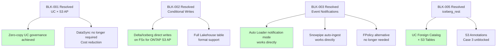
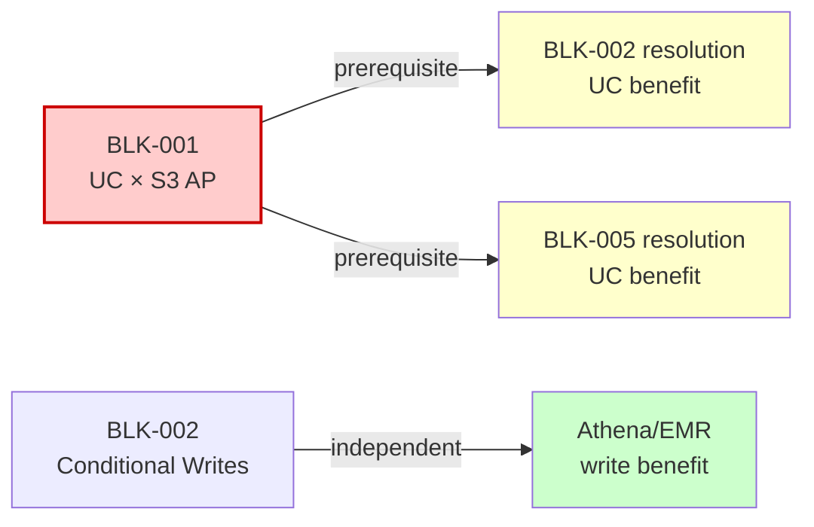

🌐 **English** | [日本語](../ja/blocker-tracker.md)

# Blocker Tracking Dashboard

> **Purpose**: A living document that centrally manages the status of known blockers and constraints for FSx for ONTAP × Lakehouse integration.
> **Last updated**: 2026-06-20
> **Update frequency**: Quarterly, or ad-hoc when significant status changes occur

---

## Summary (All Blockers)

| ID | Blocker | Impact Area | Status | Workaround |
|:---:|---|---|:---:|:---:|
| BLK-001 | UC External Location does not support S3 AP | Databricks UC governance | ❌ Unresolved | ✅ Available |
| BLK-002 | Conditional writes not supported | Delta/Iceberg/Hudi writes | ❌ Unresolved | ✅ Available |
| BLK-003 | S3 Event Notifications not supported | Auto Loader notification / Snowpipe | ❌ Unresolved | ✅ Available |
| BLK-004 | SnapMirror S3 disabled on FSx for ONTAP | ONTAP-native S3 replication | ❌ Unresolved | ✅ Available |
| BLK-005 | `iceberg_rest` Connection Type not supported | UC Foreign Catalog × S3 Tables | ❌ Unresolved | ⚠️ Partial |
| BLK-006 | ListObjectsV2 high latency (30-80x) | Large directory scans | ⚠️ By design | ✅ Available |
| BLK-007 | NFS/SMB mount blocked by seccomp | Databricks direct filesystem access | ❌ By design | ✅ Available |
| BLK-008 | Lake Formation column-level control unsupported on S3 Tables | S3 Tables federated catalog governance | ❌ Unresolved | ⚠️ Table-level only |

---

## Details

### BLK-001: UC External Location Does Not Support S3 AP

| Attribute | Value |
|-----------|-------|
| **Affected service** | Databricks Unity Catalog |
| **Affected features** | External Location / External Table / External Volume / all UC governance |
| **Root cause** | Databricks session policy generated during AssumeRole does not correctly interpret S3 AP ARNs |
| **Confirmed** | 2026-05-26 (Databricks Support; case closed — not entitled due to support tier) |
| **Status** | ❌ Unresolved — support case closed (not entitled); awaiting platform-level resolution |
| **Resolution criteria** | Databricks platform GA-supports S3 AP as UC External Location |
| **Severity** | **Critical** — Cannot apply UC governance (lineage, tags, masks, row filters) directly to FSx for ONTAP data |

**Workarounds (recommended paths)**:
1. **DataSync → standard S3 → UC External Location** — Recommended. Full governance applicable. [Details](./datasync-to-s3-guide.md)
2. **Kafka → Structured Streaming → UC Delta** — For real-time requirements. [Details](./kafka-clickhouse-unity-catalog-connectivity.md)
3. **Glue/EMR ETL → standard S3 → UC** — For batch transformation

**Evidence**: [integrations/databricks/README.md](../../integrations/databricks/README.md)

> **Impact scoping** (Databricks Governance Architect lens): This blocker prevents "zero-copy governance" but copying to S3 via DataSync enables full UC governance. Evaluate the trade-off: copy cost (~$27/month/TB) vs governance value.

---

### BLK-002: Conditional Writes Not Supported

| Attribute | Value |
|-----------|-------|
| **Affected service** | FSx for ONTAP S3 Access Points |
| **Affected features** | Delta Lake / Iceberg / Hudi transactional writes |
| **Root cause** | FSx for ONTAP S3 AP does not implement `If-None-Match` header (returns HTTP 501) |
| **Confirmed** | 2026-05-22 (AWS Support, product-level limitation) |
| **Status** | ❌ Unresolved — Feature Request filed |
| **Resolution criteria** | AWS implements conditional writes on FSx for ONTAP S3 AP (parity with S3 native Aug 2024) |
| **Severity** | **High** — Lakehouse table format writes impossible. Read path unaffected |

**Workarounds**:
1. **Use read-only** — Athena / Glue / Snowflake reads work normally
2. **Write to standard S3** — DataSync → standard S3 → Delta/Iceberg writes
3. **Iceberg + external catalog (single writer)** — Glue Catalog manages pointers; theoretically writable in single-writer config (experimental). ⚠️ **Concurrent writes risk data corruption — DO NOT USE IN PRODUCTION**

**Evidence**: [Compatibility Matrix](./compatibility-matrix.md) (Lakehouse Table Formats section)

> **S3 parity roadmap** (FSx for ONTAP Architect lens): S3 native received conditional writes in Aug 2024. Addition to FSx for ONTAP S3 AP depends on the AWS development roadmap, but parity is a reasonable expectation. Timeline undisclosed.

---

### BLK-003: S3 Event Notifications Not Supported

| Attribute | Value |
|-----------|-------|
| **Affected service** | FSx for ONTAP S3 Access Points |
| **Affected features** | Databricks Auto Loader (notification mode), Snowflake Snowpipe auto-ingest, EventBridge |
| **Root cause** | FSx for ONTAP S3 AP does not emit S3 Event Notifications (s3:ObjectCreated, etc.) |
| **Confirmed** | 2026-05-22 (API docs + environment verification) |
| **Status** | ❌ Unresolved — Feature Request filed |
| **Resolution criteria** | AWS implements Event Notifications on FSx for ONTAP S3 AP |
| **Severity** | **Medium** — Event-driven pipelines cannot be built directly. Schedule-based alternatives available |

**Workarounds**:
1. **FPolicy → Lambda → S3** — FSx for ONTAP native file event detection as alternative. [Details](./datasync-to-s3-guide.md) (FPolicy section)
2. **DataSync → standard S3** — Sync to standard S3, then use Event Notifications
3. **Auto Loader listing mode** — Directory scan detection (affected by ListObjectsV2 latency)
4. **Schedule polling** — EventBridge schedule for periodic crawl

> **FPolicy operational complexity** (Manufacturing Edge Data Architect lens): FPolicy → Lambda is technically valid but operationally complex (Lambda concurrency limits, DLQ, backpressure). If DataSync schedule (rate(5 minutes)) is acceptable, prefer it.

---

### BLK-004: SnapMirror S3 Disabled on FSx for ONTAP

| Attribute | Value |
|-----------|-------|
| **Affected service** | FSx for ONTAP |
| **Affected features** | ONTAP S3 bucket → AWS S3 native replication |
| **Root cause** | FSx for ONTAP blocks SnapMirror S3 commands at service level |
| **Confirmed** | 2026-05-26 (CLI + REST API both confirmed) |
| **Status** | ❌ Unresolved — Feature Request filed |
| **Resolution criteria** | AWS enables SnapMirror S3 on FSx for ONTAP |
| **Severity** | **Medium** — DataSync provides alternative, but loses ONTAP-native replication efficiency |

**Workaround**:
- **AWS DataSync** — The only verified managed sync mechanism from FSx for ONTAP NFS to S3. [Details](./datasync-to-s3-guide.md)

**Evidence**: [verification-pack/snapmirror-s3/evidence/2026-05-26/evidence-record.yaml](../../verification-pack/snapmirror-s3/evidence/2026-05-26/evidence-record.yaml)

> **On-premises difference** (FSx for ONTAP Architect lens): On-premises ONTAP supports SnapMirror S3 (9.10.1+). This is an FSx for ONTAP-specific limitation. Note this in on-premises → cloud migration planning.

---

### BLK-005: `iceberg_rest` Connection Type Not Supported

| Attribute | Value |
|-----------|-------|
| **Affected service** | Databricks Unity Catalog |
| **Affected features** | UC Foreign Catalog × S3 Tables Iceberg REST endpoint |
| **Root cause** | Databricks SQL Warehouse does not recognize `iceberg_rest` as a Connection Type |
| **Confirmed** | 2026-05-31 (`CONNECTION_TYPE_NOT_SUPPORTED` error; case closed — not entitled due to support tier) |
| **Status** | ❌ Unresolved — support case closed (not entitled); awaiting platform-level resolution |
| **Resolution criteria** | Databricks GA-supports `iceberg_rest` as UC Connection Type |
| **Severity** | **Medium** — Cannot reference S3 Tables / S3 Metadata Iceberg tables from UC directly |

**Workarounds**:
1. **Databricks Spark cluster with manual catalog config** — Set `spark.sql.catalog.s3tables` at cluster scope (outside UC governance)
2. **Glue HMS Federation (recommended)** — Use `CREATE CONNECTION TYPE glue` to reference S3 Tables Iceberg tables via Glue Federated Catalog as a Foreign Catalog. UC governance applicable. [Execution Guide](../../integrations/iceberg-metadata-catalog/databricks/foreign-iceberg-execution-guide.md)
3. **Query via Athena / EMR** — AWS native engines work normally via `s3tablescatalog`
4. **Iceberg on standard S3** — Create Iceberg tables on standard S3 buckets (not S3 Tables) and expose via Glue Catalog → UC Foreign Catalog (most reliable)

**Evidence**: [Compatibility Matrix](./compatibility-matrix.md) (S3 Tables Iceberg REST Endpoint section)

> **Double blocker** (Databricks Governance Architect lens): S3 Annotations evaluation Case 3 (annotation table UC reference) is completely blocked by BLK-001 + BLK-005. Case 1 (AWS native engine query) is unaffected.

---

### BLK-006: ListObjectsV2 High Latency (30-80x)

| Attribute | Value |
|-----------|-------|
| **Affected service** | FSx for ONTAP S3 Access Points |
| **Affected features** | Directory scans, Glue Crawler, Auto Loader listing mode |
| **Root cause** | Product-level performance characteristic of FSx for ONTAP S3 AP |
| **Confirmed** | 2026-05-22 (AWS Support confirmed) |
| **Status** | ⚠️ By design (improvement requested but confirmed as product characteristic) |
| **Resolution criteria** | AWS ListObjectsV2 performance improvement |
| **Severity** | **Low-Medium** — Workarounds available. Only manifests on large directories |

**Workarounds**:
1. **File consolidation** — Merge small files to ≥ 128 MB to reduce ListObjects calls
2. **Partition structure** — Organize as `year=YYYY/month=MM/day=DD/` to limit scan scope
3. **Glue Catalog reference** — Use query paths that reference Glue Catalog metadata instead of file listing
4. **Auto Loader notification mode** — Via DataSync → standard S3 (no ListObjects needed)

---

### BLK-007: NFS/SMB Mount Blocked by seccomp

| Attribute | Value |
|-----------|-------|
| **Affected service** | Databricks Runtime |
| **Affected features** | NFS/SMB/FUSE mount from Databricks clusters |
| **Root cause** | Databricks runtime seccomp profile prohibits `mount` / `umount` syscalls |
| **Confirmed** | 2026-05 (confirmed as design-level constraint) |
| **Status** | ❌ By design — Security design, no resolution expected |
| **Resolution criteria** | None (intentional security design) |
| **Severity** | **N/A — Architectural** — Intentional security design. No resolution expected. Alternative paths established; practical impact limited |

**Workaround**:
- Same alternative paths as BLK-001 (DataSync / Kafka / Glue/EMR)

---

### BLK-008: Lake Formation Column-Level Control Unsupported on S3 Tables

| Attribute | Value |
|-----------|-------|
| **Affected service** | AWS Lake Formation × S3 Tables |
| **Affected features** | Column-level permissions on S3 Tables federated catalog |
| **Root cause** | Lake Formation has not implemented column-level control for S3 Tables catalog |
| **Confirmed** | 2026-05 (table-level only confirmed to work) |
| **Status** | ❌ Unresolved — Feature Request planned |
| **Resolution criteria** | AWS supports Lake Formation column-level permissions on S3 Tables federated catalog |
| **Severity** | **Low** — Table-level control works. Use regular Glue Catalog tables for column-level needs |

**Workaround**:
- Place tables requiring column-level control on regular Glue Catalog tables (general-purpose S3 buckets) and apply Lake Formation column masks there

---

## Blocker Resolution Impact Map

> **Maximum impact**: If BLK-001 and BLK-002 are resolved simultaneously, FSx for ONTAP S3 AP would directly support full Databricks UC capabilities (read + write + governance), and the DataSync path would change from "required" to "optional."

---

## Feature Request Status

| Vendor | Request | Filed | Status |
|--------|---------|-------|--------|
| Databricks | UC External Location S3 AP support | 2026-05 | Closed (not entitled — support tier limitation) |
| Databricks | `iceberg_rest` Connection Type support | 2026-05 | Closed (not entitled — support tier limitation) |
| AWS | FSx for ONTAP S3 AP conditional writes | 2026-05 | Filed, no response |
| AWS | FSx for ONTAP S3 AP Event Notifications | 2026-05 | Filed, no response |
| AWS | Enable SnapMirror S3 on FSx for ONTAP | 2026-05 | Filed, no response |
| AWS | ListObjectsV2 latency improvement | 2026-05 | Filed, confirmed as product characteristic |
| AWS | S3 Tables × Lake Formation column-level control | 2026-05 | Planned to file |

> Case numbers and engineer names are not published (role-based references only, per steering policy).

---

## Quarterly Review Schedule

| Review Date | Check Items |
|-------------|-------------|
| 2026-09 (Q3) | Databricks release notes review, pre-re:Invent GA confirmation |
| 2026-12 (Q4) | re:Invent announcements review, reflect in 2027 planning |
| 2027-03 (Q1) | Pre-DAIS 2027 confirmation |

---

## Blocker Prerequisite Chain (Interactions)

Some blockers have resolution-order dependencies:

| Scenario | Result |
|----------|--------|
| BLK-002 only resolved (BLK-001 unresolved) | Athena/EMR/Glue can write Delta/Iceberg directly to FSx for ONTAP S3 AP. **But no Databricks UC benefit** (BLK-001 is the gate) |
| BLK-001 only resolved (BLK-002 unresolved) | UC External Location can register S3 AP → **read + UC governance** achieved. Writes still via standard S3 |
| BLK-001 + BLK-002 both resolved | **Full capability**: zero-copy + UC governance + Delta/Iceberg writes. DataSync changes from "required" to "optional" |
| BLK-003 only resolved (BLK-001 unresolved) | Auto Loader notification mode works on FSx for ONTAP S3 AP. But UC governance still requires standard S3 path |
| BLK-005 only resolved (BLK-001 unresolved) | UC SQL Warehouse can query S3 Tables/annotation tables. FSx for ONTAP S3 AP direct connection is separate (BLK-001) |

> **Key insight**: BLK-001 (UC × S3 AP) is the **gate blocker** for several others. While BLK-001 remains unresolved, resolving BLK-002/003/005 provides no direct benefit to the Databricks UC path (though Athena/EMR and other non-UC paths do benefit).

---

## Resolution Signal Monitoring

Check these sources during quarterly reviews:

| Blocker | Monitoring Source | Keywords |
|---------|------------------|----------|
| BLK-001 | [Databricks Release Notes](https://docs.databricks.com/en/release-notes/index.html) | "External Location", "S3 Access Point", "access_point" |
| BLK-001 | [Databricks Changelog](https://docs.databricks.com/en/release-notes/product/index.html) | "storage", "External Location" |
| BLK-002 | [AWS What's New](https://aws.amazon.com/about-aws/whats-new/) | "FSx for ONTAP", "conditional writes", "If-None-Match" |
| BLK-003 | [AWS What's New](https://aws.amazon.com/about-aws/whats-new/) | "FSx for ONTAP", "Event Notifications", "S3 events" |
| BLK-004 | [AWS What's New](https://aws.amazon.com/about-aws/whats-new/) | "FSx for ONTAP", "SnapMirror S3" |
| BLK-005 | [Databricks Release Notes](https://docs.databricks.com/en/release-notes/index.html) | "iceberg_rest", "Foreign Catalog", "S3 Tables" |
| BLK-006 | [AWS What's New](https://aws.amazon.com/about-aws/whats-new/) | "FSx for ONTAP", "performance", "ListObjects" |
| BLK-008 | [AWS What's New](https://aws.amazon.com/about-aws/whats-new/) | "Lake Formation", "S3 Tables", "column-level" |

> **Automation hint**: A GitHub Actions pipeline can periodically check these RSS feeds and auto-create Issues on keyword hits.

---

## Related Documents

- [UC Connection Guide](./fsx-ontap-to-databricks-unity-catalog-guide.md) — Path design affected by blockers
- [Compatibility Matrix](./compatibility-matrix.md) — Technical constraint details
- [DataSync → S3 Guide](./datasync-to-s3-guide.md) — Primary workaround for BLK-001/002/003
- [S3 Annotations Evaluation](./s3-annotations-governance-evaluation.md) — Case 3 affected by BLK-005
- [Reading Path Guide](./reading-path-guide.md) — Overall document navigation
