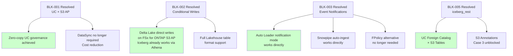
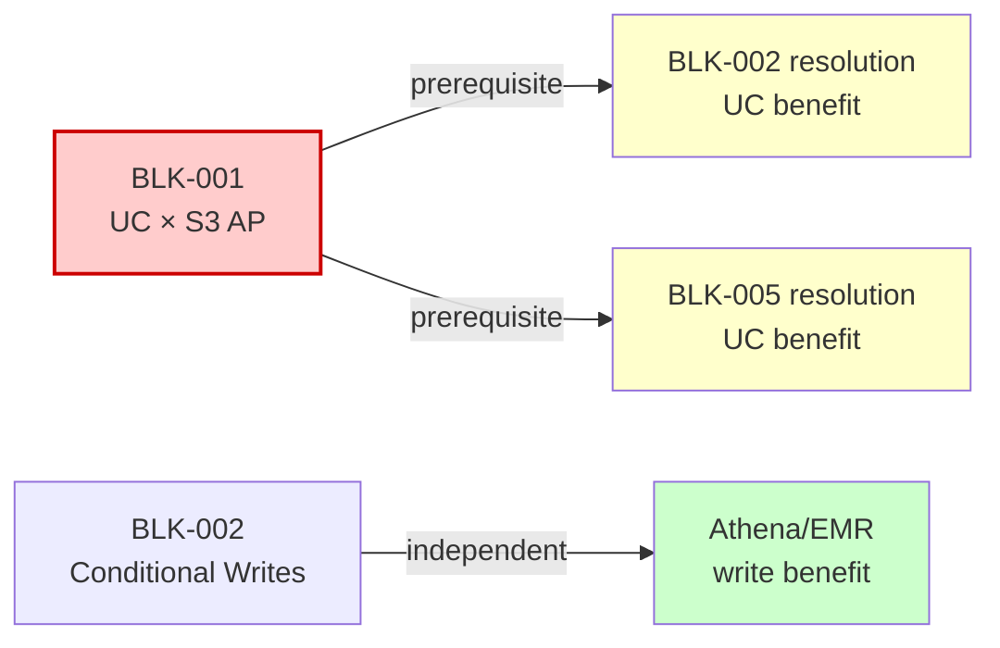

🌐 **English** | [日本語](../ja/blocker-tracker.md)

# Blocker Tracking Dashboard

> This page tracks what is known **not** to work. For claims that are simply untested, see the [Unverified Item Inventory](./unverified-inventory.md). For the same blockers grouped by which layer they originate in, see [Known Challenges by Layer](./known-challenges.md).

> **Purpose**: A living document that centrally manages the status of known blockers and constraints for FSx for ONTAP × Lakehouse integration.
> **Last updated**: 2026-06-20
> **Update frequency**: Quarterly, or ad-hoc when significant status changes occur

---

## Summary (All Blockers)

| ID | Blocker | Impact Area | Status | Workaround |
|:---:|---|---|:---:|:---:|
| BLK-001 | UC credential vending does not authorise S3 AP reads (registration works) | Databricks UC governance | ❌ Unresolved | ✅ Available |
| BLK-002 | Conditional writes not supported | Delta Lake writes (Iceberg via Athena unaffected) | ❌ Unresolved | ✅ Available |
| BLK-003 | S3 Event Notifications not supported | Auto Loader notification / Snowpipe | ❌ Unresolved | ✅ Available |
| BLK-004 | SnapMirror S3 disabled on FSx for ONTAP | ONTAP-native S3 replication | ❌ Unresolved | ✅ Available |
| BLK-005 | `iceberg_rest` Connection Type not supported | UC Foreign Catalog × S3 Tables | ❌ Unresolved | ⚠️ Partial |
| BLK-006 | ListObjectsV2 latency (30-80x withdrawn; 1.3-1.4x measured) | Large directory scans | ⚠️ Scope reduced | ✅ Available |
| BLK-007 | NFS/SMB mount blocked by seccomp | Databricks direct filesystem access | ❌ By design | ✅ Available |
| BLK-008 | Lake Formation column-level control unsupported on S3 Tables | S3 Tables federated catalog governance | ❌ Unresolved | ⚠️ Table-level only |
| BLK-009 | Unload to an S3 AP fails checksum validation, leaving the object behind | Snowflake `COPY INTO @stage` (and any unload to an AP) | ❌ Unresolved | ✅ Available |

---

## Details

### BLK-001: UC Credential Vending Does Not Authorise S3 AP Reads

| Attribute | Value |
|-----------|-------|
| **Affected service** | Databricks Unity Catalog |
| **Affected features** | **Reading** through an External Location / External Table / External Volume on an S3 AP / **`FILE EXTERNAL` columns (FILE type, Beta)**. Registration itself is **not** affected — see [scope corrected](#scope-corrected-2026-08-12-registration-works-reads-do-not) |
| **Root cause** | The down-scoped session policy Unity Catalog attaches when it vends credentials is written in **bucket-style** resource ARNs (`arn:aws:s3:::<alias>`), while AWS authorises an access-point request against the **access point ARN**. The two never match, and a session policy intersects with the role policy, so the request is denied inside the session regardless of what the IAM role itself allows |
| **Confirmed** | 2026-05-26 (Databricks Support) — root cause stated. 2026-08-12 (this repository) — mechanism demonstrated directly, with a native-S3 control |
| **Status** | ❌ Unresolved — **and the scope was wrong until 2026-08-12**: registration succeeds, reads fail |
| **Resolution criteria** | Unity Catalog emits the access point ARN form (`arn:aws:s3:<region>:<account>:accesspoint/<name>` and `.../object/*`) in the down-scoped session policy when the location URL is an access point alias |
| **Severity** | **Critical** — Cannot apply UC governance (lineage, tags, masks, row filters) directly to FSx for ONTAP data |
| **User-side workaround** | **None.** The session policy is generated by Unity Catalog; no IAM policy or network change on our side widens it |

**Workarounds (recommended paths)**:
1. **DataSync → standard S3 → UC External Location** — Recommended. Full governance applicable. [Details](./datasync-to-s3-guide.md)
2. **Kafka → Structured Streaming → UC Delta** — For real-time requirements. [Details](./kafka-clickhouse-unity-catalog-connectivity.md)
3. **Glue/EMR ETL → standard S3 → UC** — For batch transformation

**Evidence**: [integrations/databricks/README.md](../../integrations/databricks/README.md)

> **Impact scoping**: This blocker prevents "zero-copy governance" but copying to S3 via DataSync enables full UC governance. Evaluate the trade-off: copy cost (~$27/month/TB) vs governance value.

#### Scope corrected 2026-08-12: registration works, reads do not

This blocker was recorded as "UC External Location does not support S3 AP". Measured on a
purpose-built non-trial workspace in the same account and region as the file system, that
wording is wrong:

| Step | Result |
|---|---|
| `CREATE STORAGE CREDENTIAL` with an IAM role | ✅ |
| `CREATE EXTERNAL LOCATION` on `s3://<AP alias>/`, `skip_validation=False` | ✅ — UC ran its own read/write validation and passed |
| `CREATE EXTERNAL VOLUME` on that location | ✅ |
| Reading through it (`read_files`, `list_files`, `to_file`, `dbutils.fs.ls`) | ❌ 403 / AccessDenied |

Two IAM details are required to get that far, and getting either wrong produces a 403 that
looks like "S3 AP is unsupported":

1. The storage credential's external ID is the Databricks **account UUID**, not the metastore ID.
2. The IAM permission policy must reference the **access point ARN**. Granting only the
   alias-as-bucket ARN fails, even though the alias form works from the AWS CLI.

The read failure is the same on serverless SQL and on a classic DBR 18.2 cluster, and it
reproduces **outside Databricks entirely** when the credentials that Unity Catalog vends are
used from an operator workstation. AWS names the cause in the error:

```
is not authorized to perform: s3:ListBucket on resource:
"arn:aws:s3:<region>:<account>:accesspoint/<name>"
because no session policy allows the s3:ListBucket action
```

Eliminated along the way, so they are not re-tested: UC volume privileges, IAM role
permissions, HEAD-on-missing-key status codes, `x-amz-expected-bucket-owner`, the S3
endpoint hostname, compute-role permissions (a classic cluster has no ambient AWS
credentials at all), and the S3 Gateway endpoint that the Databricks-managed VPC creates.

**FILE type stake.** `FILE EXTERNAL` needs a UC volume, and a UC volume on an S3 AP can now
be created but not read, so `FILE EXTERNAL` over ONTAP-resident files remains out of reach.
`FILE MANAGED` copies the bytes into UC-managed storage. Resolving this therefore buys
governed multimodal AI over data that stays on the NAS, on top of the tabular governance it
always bought.

Evidence: [evidence-record-tokyo.yaml](../../verification-pack/databricks/file-type/evidence/2026-08-12/evidence-record-tokyo.yaml).
Reproduce: [verification runbook](./databricks-verification-runbook.md), which deploys the IAM role and runs the comparison with a native-S3 control.
Full analysis, including the separate `_object_metadata` path: [databricks-file-type-evaluation](./databricks-file-type-evaluation.md).

---

### BLK-002: Conditional Writes Not Supported

| Attribute | Value |
|-----------|-------|
| **Affected service** | FSx for ONTAP S3 Access Points |
| **Affected features** | Delta Lake transactional writes. Hudi untested. **Iceberg is not affected when the catalog holds the pointer** — see scope below |
| **Root cause** | FSx for ONTAP S3 AP does not implement `If-None-Match` header (returns HTTP 501) |
| **Confirmed** | 2026-05-22 (AWS Support, product-level limitation) |
| **Status** | ❌ Unresolved — Feature Request filed |
| **Resolution criteria** | AWS implements conditional writes on FSx for ONTAP S3 AP (parity with S3 native Aug 2024) |
| **Severity** | **Medium** — narrowed 2026-08-06. Delta Lake writes are impossible; Iceberg writes via Athena work. Read path unaffected |

**Scope, measured 2026-08-06**

| Table format / engine | Write | Why |
|---|:---:|---|
| Delta Lake (any engine) | ❌ | The commit log lives in `_delta_log` on the object store, so the commit itself needs the conditional write |
| Iceberg via Athena + Glue Catalog | ✅ | Glue holds the current-metadata pointer. The commit is a conditional update in Glue, not on S3. INSERT, UPDATE, DELETE, time travel, `OPTIMIZE`, `VACUUM` and two concurrent commits all succeeded |
| Iceberg via EMR Serverless | ❌ | Fails for an unrelated reason: S3FileIO does not handle the Access Point alias during metadata write (NullPointerException) |
| Hudi | ❓ | Not tested |

The earlier note that concurrent Iceberg writes risk corruption was an inference, not a measurement, and is withdrawn.

**Failed Delta writes leave their data files behind.** Observed 2026-08-06 on the
verification Access Point: four prefixes hold Delta data files with no
`_delta_log`, and one holds three data files written a minute apart. Delta writes
the Parquet first and commits second, so when the commit hits the 501 the data
files stay. Each retry adds another orphan.

This is the same residue shape as [BLK-009](#blk-009-unload-to-an-s3-access-point-fails-checksum-validation-and-leaves-the-object)
from a different cause. Sweep for it with:

```bash
./shared/scripts/check_orphaned_unload_objects.py --access-point <alias>
```

The script reports prefixes that hold engine output but no completion marker
(`_SUCCESS`, `_delta_log/`, `_committed_*`), which is what an interrupted write
looks like from the storage side.
 Two concurrent Athena commits produced the correct row count with no lost update. That is a small test — it establishes that concurrency is not categorically unsafe here, not a concurrency limit.

**Workarounds for Delta Lake**:
1. **Use read-only** — Athena / Glue / Snowflake reads work normally
2. **Write to standard S3** — DataSync → standard S3 → Delta writes
3. **Use Iceberg instead** — with Athena and the Glue Catalog, writes work directly on the Access Point

**Evidence**: [Athena Iceberg verification](../../verification-pack/athena-iceberg/evidence/2026-08-06/evidence-record.yaml) · [Compatibility Matrix](./compatibility-matrix.md) (Lakehouse Table Formats section)

> **S3 parity roadmap**: S3 native received conditional writes in Aug 2024. Addition to FSx for ONTAP S3 AP depends on the AWS development roadmap, but parity is a reasonable expectation. Timeline undisclosed.

---

### BLK-003: S3 Event Notifications Not Supported

| Attribute | Value |
|-----------|-------|
| **Affected service** | FSx for ONTAP S3 Access Points |
| **Affected features** | Databricks Auto Loader (notification mode), Snowflake Snowpipe auto-ingest, EventBridge |
| **Root cause** | FSx for ONTAP S3 AP does not emit S3 Event Notifications (s3:ObjectCreated, etc.) |
| **Confirmed** | 2026-05-22 (API docs + environment verification) |
| **Status** | ❌ Unresolved — Feature Request filed |
| **Resolution criteria** | AWS implements Event Notifications on FSx for ONTAP S3 AP |
| **Severity** | **Medium** — Event-driven pipelines cannot be built directly. Schedule-based alternatives available |
| **Workaround verification** | Lambda polling → SNS verified on the AWS side (6 defects found). The Snowflake leg (acceptance of a synthesized notification) is unverified. [Snowpipe Verification Results](../../integrations/snowflake/docs/en/snowpipe-verification-results.md) |

**Workarounds**:
1. **FPolicy → Lambda → S3** — FSx for ONTAP native file event detection as alternative. [Details](./datasync-to-s3-guide.md) (FPolicy section)
2. **DataSync → standard S3** — Sync to standard S3, then use Event Notifications
3. **Auto Loader listing mode** — Directory scan detection (affected by ListObjectsV2 latency)
4. **Schedule polling** — EventBridge schedule for periodic crawl

> **FPolicy operational complexity**: FPolicy → Lambda is technically valid but operationally complex (Lambda concurrency limits, DLQ, backpressure). If DataSync schedule (rate(5 minutes)) is acceptable, prefer it.

---

### BLK-004: SnapMirror S3 Disabled on FSx for ONTAP

| Attribute | Value |
|-----------|-------|
| **Affected service** | FSx for ONTAP |
| **Affected features** | ONTAP S3 bucket → AWS S3 native replication |
| **Root cause** | FSx for ONTAP blocks SnapMirror S3 commands at service level |
| **Confirmed** | 2026-05-26 (CLI + REST API both confirmed) |
| **Status** | ❌ Unresolved — Feature Request filed |
| **Resolution criteria** | AWS enables SnapMirror S3 on FSx for ONTAP |
| **Severity** | **Medium** — DataSync provides alternative, but loses ONTAP-native replication efficiency |

**Workaround**:
- **AWS DataSync** — The only verified managed sync mechanism from FSx for ONTAP NFS to S3. [Details](./datasync-to-s3-guide.md)

**Evidence**: [verification-pack/snapmirror-s3/evidence/2026-05-26/evidence-record.yaml](../../verification-pack/snapmirror-s3/evidence/2026-05-26/evidence-record.yaml)

> **On-premises difference**: On-premises ONTAP supports SnapMirror S3 (9.10.1+). This is an FSx for ONTAP-specific limitation. Note this in on-premises → cloud migration planning.

---

### BLK-005: `iceberg_rest` Connection Type Not Supported

| Attribute | Value |
|-----------|-------|
| **Affected service** | Databricks Unity Catalog |
| **Affected features** | UC Foreign Catalog × S3 Tables Iceberg REST endpoint |
| **Root cause** | Databricks SQL Warehouse does not recognize `iceberg_rest` as a Connection Type |
| **Confirmed** | 2026-05-31 (`CONNECTION_TYPE_NOT_SUPPORTED` error; case closed — not entitled due to support tier) |
| **Status** | ❌ Unresolved — support case closed (not entitled); awaiting platform-level resolution |
| **Resolution criteria** | Databricks GA-supports `iceberg_rest` as UC Connection Type |
| **Severity** | **Medium** — Cannot reference S3 Tables / S3 Metadata Iceberg tables from UC directly |

**Workarounds**:
1. **Databricks Spark cluster with manual catalog config** — Set `spark.sql.catalog.s3tables` at cluster scope (outside UC governance)
2. **Glue HMS Federation (recommended)** — Use `CREATE CONNECTION TYPE glue` to reference S3 Tables Iceberg tables via Glue Federated Catalog as a Foreign Catalog. UC governance applicable. [Execution Guide](../../integrations/iceberg-metadata-catalog/databricks/foreign-iceberg-execution-guide.md)
3. **Query via Athena / EMR** — AWS native engines work normally via `s3tablescatalog`
4. **Iceberg on standard S3** — Create Iceberg tables on standard S3 buckets (not S3 Tables) and expose via Glue Catalog → UC Foreign Catalog (most reliable)

**Evidence**: [Compatibility Matrix](./compatibility-matrix.md) (S3 Tables Iceberg REST Endpoint section)

> **Double blocker**: S3 Annotations evaluation Case 3 (annotation table UC reference) is completely blocked by BLK-001 + BLK-005. Case 1 (AWS native engine query) is unaffected.

---

### BLK-006: ListObjectsV2 Latency (re-measured — 30-80x not reproduced)

| Attribute | Value |
|-----------|-------|
| **Affected service** | FSx for ONTAP S3 Access Points |
| **Affected features** | Directory scans, Glue Crawler, Auto Loader listing mode |
| **Root cause** | Product-level performance characteristic of FSx for ONTAP S3 AP |
| **Originally confirmed** | 2026-05-22 (AWS Support confirmed as a product-level characteristic, quoted as 30-80x) |
| **Re-measured** | 2026-08-05 — **0.9x-1.4x** at 10-5,000 objects. The 30-80x figure did not reproduce. [Evidence](../../verification-pack/s3ap-list-latency/evidence/2026-08-05/benchmark-result.yaml) |
| **Status** | ⚠️ Scope reduced — not observed at ≤5,000 objects; unquantified above that |
| **Resolution criteria** | Measurement at 100k+ objects to establish where, if anywhere, the penalty appears |
| **Severity** | **Low** — Not measurable at the object counts tested. Workarounds remain sound design practice |

**Re-measurement summary** (medians, 5 trials per point, paginated list loop only):

| Objects | FSx for ONTAP S3 AP | Native S3 | Ratio |
|--------:|--------------------:|----------:|------:|
| 10 | 38 ms | 27 ms | 1.4x |
| 100 | 52 ms | 39 ms | 1.3x |
| 1,000 | 162 ms | 128 ms | 1.3x |
| 5,000 | 665 ms | 704 ms | 0.9x |

A nested two-level layout produced the same ratios. All results fall inside the
performance target originally recorded for this blocker (<1 s for <100 files,
<3 s for <1,000 files).

**What is still unknown**: listing was only measured up to 5,000 objects.
Behaviour at hundreds of thousands or millions of objects in one directory is
untested, and [S3 AP design considerations](./s3ap-design-considerations.md)
notes that ONTAP must sort all directory entries in memory, which would grow
with entry count. The workarounds below therefore remain the recommended design
practice — they are just no longer justified by a measured 30-80x penalty at
small scale.

**Origin of the original figure**: not determined. No evidence record survives
to compare against, so it is left unexplained rather than attributed. Possible
contributors include measurement through a CLI wrapper (process startup
dominates short calls), a file system in a degraded state at the time, or
platform changes since.

**Workarounds**:
1. **File consolidation** — Merge small files to ≥ 128 MB to reduce ListObjects calls
2. **Partition structure** — Organize as `year=YYYY/month=MM/day=DD/` to limit scan scope
3. **Glue Catalog reference** — Use query paths that reference Glue Catalog metadata instead of file listing
4. **Auto Loader notification mode** — Via DataSync → standard S3 (no ListObjects needed)

---

### BLK-007: NFS/SMB Mount Blocked by seccomp

| Attribute | Value |
|-----------|-------|
| **Affected service** | Databricks Runtime |
| **Affected features** | NFS/SMB/FUSE mount from Databricks clusters |
| **Root cause** | Databricks runtime seccomp profile prohibits `mount` / `umount` syscalls |
| **Confirmed** | 2026-05 (confirmed as design-level constraint) |
| **Status** | ❌ By design — Security design, no resolution expected |
| **Resolution criteria** | None (intentional security design) |
| **Severity** | **N/A — Architectural** — Intentional security design. No resolution expected. Alternative paths established; practical impact limited |

**Workaround**:
- Same alternative paths as BLK-001 (DataSync / Kafka / Glue/EMR)

---

### BLK-008: Lake Formation Column-Level Control Unsupported on S3 Tables

| Attribute | Value |
|-----------|-------|
| **Affected service** | AWS Lake Formation × S3 Tables |
| **Affected features** | Column-level permissions on S3 Tables federated catalog |
| **Root cause** | Lake Formation has not implemented column-level control for S3 Tables catalog |
| **Confirmed** | 2026-05 (table-level only confirmed to work) |
| **Status** | ❌ Unresolved — Feature Request planned |
| **Resolution criteria** | AWS supports Lake Formation column-level permissions on S3 Tables federated catalog |
| **Severity** | **Low** — Table-level control works. Use regular Glue Catalog tables for column-level needs |

**Workaround**:
- Place tables requiring column-level control on regular Glue Catalog tables (general-purpose S3 buckets) and apply Lake Formation column masks there

---

### BLK-009: Unload to an S3 Access Point Fails Checksum Validation and Leaves the Object

| Attribute | Value |
|-----------|-------|
| **Affected service** | FSx for ONTAP S3 Access Points × any engine that unloads to them |
| **Affected features** | Snowflake `COPY INTO @stage`; likely any unload that validates a checksum against the returned encryption type |
| **Root cause** | AWS documents that upload checksums are handled differently here: the checksum "is not stored in the FSx for NetApp ONTAP volume as object metadata and the object itself", so "the checksum values are not returned in the response", and the ETag is explicitly not an MD5 digest ([access point compatibility](https://docs.aws.amazon.com/fsx/latest/ONTAPGuide/access-points-for-fsxn-object-api-support.html)). A client that validates its computed checksum against the response cannot complete that step. The write itself succeeds first. The error text points at the encryption type (`aws:fsx`, neither `AWS_SSE_S3` nor `AWS_SSE_KMS`), which is the remediation hint the client offers rather than the mechanism |
| **Confirmed** | 2026-08-06 (measured) |
| **Status** | ❌ Unresolved |
| **Resolution criteria** | FSx for ONTAP S3 AP reports an encryption type that clients accept, or clients tolerate `aws:fsx` |
| **Severity** | **Medium** — the operation is unusable, and it fails in a way that leaves state behind rather than rejecting cleanly |

**What was measured**

| Attempt | Result |
|---|---|
| `COPY INTO @stage` with no explicit encryption | Failed in 479 ms with `Remote upload failed checksum validation`. **The object was written anyway** — 25 bytes, valid gzip, correct content, `ServerSideEncryption: aws:fsx` |
| Stage with `ENCRYPTION=(TYPE='AWS_SSE_S3')` | Hung. Cancelled after 2 m 54 s. Nothing written |

**Why this matters more than a plain rejection**: the statement reports failure, so a caller will assume nothing was written. A complete object remains on the Access Point. Anyone who has attempted unload against an AP-backed stage should list the target prefix and remove orphans.

**Workarounds**:
1. **Do not unload to an Access Point.** Write to a standard S3 bucket, or to Snowflake-managed storage (internal table, or a Managed Iceberg Table on an External Volume — verified 2026-08-06)
2. If NFS or SMB access to the same volume is available, write there instead; the S3 layer is not involved

**Evidence**: [Snowflake verification 2026-08-06](../../verification-pack/snowflake/evidence/2026-08-06/evidence-record.yaml)

> Earlier revisions of this repository explained this as "Snowflake external stages are read-only by design". That was wrong, and it hid the partial-write behaviour.

---

## Blocker Resolution Impact Map



> **Maximum impact**: If BLK-001 and BLK-002 are resolved simultaneously, FSx for ONTAP S3 AP would directly support full Databricks UC capabilities (read + write + governance), and the DataSync path would change from "required" to "optional."

---

## Feature Request Status

| Vendor | Request | Filed | Status |
|--------|---------|-------|--------|
| Databricks | UC External Location S3 AP support | 2026-05 | Closed (not entitled — support tier limitation). [Community post](https://community.databricks.com/t5/data-engineering/unity-catalog-external-location-with-amazon-s3-access-points/m-p/160296#M54880) (2026-06) |
| Databricks | `iceberg_rest` Connection Type support | 2026-05 | Closed (not entitled — support tier limitation) |
| Databricks | OpenSharing STS credential vending on S3 AP | 2026-06 | [Community post](https://community.databricks.com/t5/data-engineering/opensharing-vended-sts-credentials-on-s3-access-points-verified/m-p/160298#M54881) — seeking architecture guidance |
| AWS | FSx for ONTAP S3 AP conditional writes | 2026-05 | Filed, no response |
| AWS | FSx for ONTAP S3 AP Event Notifications | 2026-05 | Filed, no response |
| AWS | Enable SnapMirror S3 on FSx for ONTAP | 2026-05 | Filed, no response |
| AWS | ListObjectsV2 latency improvement | 2026-05 | Filed, confirmed as product characteristic |
| AWS | S3 Tables × Lake Formation column-level control | 2026-05 | Planned to file |

> Case numbers and engineer names are not published (role-based references only, per steering policy).

---

## Quarterly Review Schedule

| Review Date | Check Items |
|-------------|-------------|
| 2026-09 (Q3) | Databricks release notes review, pre-re:Invent GA confirmation |
| 2026-12 (Q4) | re:Invent announcements review, reflect in 2027 planning |
| 2027-03 (Q1) | Pre-DAIS 2027 confirmation |

---

## Blocker Prerequisite Chain (Interactions)

Some blockers have resolution-order dependencies:



| Scenario | Result |
|----------|--------|
| BLK-002 only resolved (BLK-001 unresolved) | Athena/EMR/Glue could write Delta Lake directly to FSx for ONTAP S3 AP; Iceberg via Athena already can. **But no Databricks UC benefit** (BLK-001 is the gate) |
| BLK-001 only resolved (BLK-002 unresolved) | UC External Location can register S3 AP → **read + UC governance** achieved. Writes still via standard S3 |
| BLK-001 + BLK-002 both resolved | **Full capability**: zero-copy + UC governance + Delta/Iceberg writes. DataSync changes from "required" to "optional" |
| BLK-003 only resolved (BLK-001 unresolved) | Auto Loader notification mode works on FSx for ONTAP S3 AP. But UC governance still requires standard S3 path |
| BLK-005 only resolved (BLK-001 unresolved) | UC SQL Warehouse can query S3 Tables/annotation tables. FSx for ONTAP S3 AP direct connection is separate (BLK-001) |

> **Key insight**: BLK-001 (UC × S3 AP) is the **gate blocker** for several others. While BLK-001 remains unresolved, resolving BLK-002/003/005 provides no direct benefit to the Databricks UC path (though Athena/EMR and other non-UC paths do benefit).

---

## Resolution Signal Monitoring

Check these sources during quarterly reviews:

| Blocker | Monitoring Source | Keywords |
|---------|------------------|----------|
| BLK-001 | [Databricks Release Notes](https://docs.databricks.com/en/release-notes/index.html) | "External Location", "S3 Access Point", "access_point" |
| BLK-001 | [Databricks Changelog](https://docs.databricks.com/en/release-notes/product/index.html) | "storage", "External Location" |
| BLK-002 | [AWS What's New](https://aws.amazon.com/about-aws/whats-new/) | "FSx for ONTAP", "conditional writes", "If-None-Match" |
| BLK-003 | [AWS What's New](https://aws.amazon.com/about-aws/whats-new/) | "FSx for ONTAP", "Event Notifications", "S3 events" |
| BLK-004 | [AWS What's New](https://aws.amazon.com/about-aws/whats-new/) | "FSx for ONTAP", "SnapMirror S3" |
| BLK-005 | [Databricks Release Notes](https://docs.databricks.com/en/release-notes/index.html) | "iceberg_rest", "Foreign Catalog", "S3 Tables" |
| BLK-006 | [AWS What's New](https://aws.amazon.com/about-aws/whats-new/) | "FSx for ONTAP", "performance", "ListObjects" |
| BLK-008 | [AWS What's New](https://aws.amazon.com/about-aws/whats-new/) | "Lake Formation", "S3 Tables", "column-level" |

> **Automation hint**: A GitHub Actions pipeline can periodically check these RSS feeds and auto-create Issues on keyword hits.

---

## Related Documents

- [UC Connection Guide](./fsx-ontap-to-databricks-unity-catalog-guide.md) — Path design affected by blockers
- [Compatibility Matrix](./compatibility-matrix.md) — Technical constraint details
- [DataSync → S3 Guide](./datasync-to-s3-guide.md) — Primary workaround for BLK-001/002/003
- [S3 Annotations Evaluation](./s3-annotations-governance-evaluation.md) — Case 3 affected by BLK-005
- [Reading Path Guide](./reading-path-guide.md) — Overall document navigation
