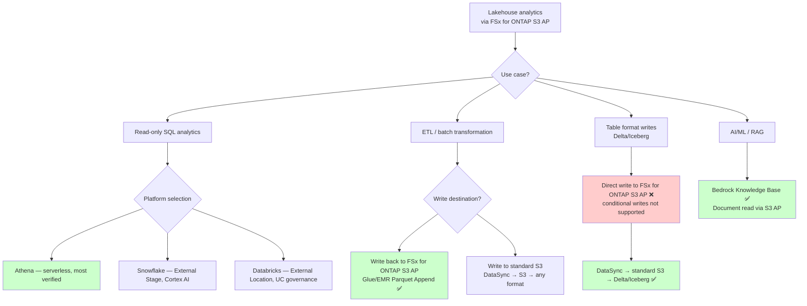

# Compatibility Matrix

> 🌐 **English** | [日本語](../ja/compatibility-matrix.md)

## Executive Summary

- **Purpose**: Defines verified compatibility between FSx for ONTAP S3 Access Points and Lakehouse platforms/formats, clarifying support status from read-only analytics to write paths
- **Key findings**: Read-only analytics (Athena/Glue/EMR/Snowflake/Bedrock) are verified and production-ready. Write paths (Delta Lake/Iceberg) are limited due to lack of conditional writes support
- **Critical constraints**: Conditional writes (`If-None-Match`) not supported, S3 Event Notifications not supported, ListObjectsV2 high latency (30-80x), SnapMirror S3 not available
- **Recommended approach**: Implement read-only use cases via FSx for ONTAP S3 AP direct path. Use DataSync → standard S3 path when writes are required
- **Verification levels**: 4-stage progression: API verified → Functionally verified → Security verified → Production verified. Most platforms currently at functional verification

## FAQ / Common Misconceptions

### Q1: Why doesn't Delta Lake write work?

**A**: Delta Lake's commit protocol requires atomic rename within the `_delta_log/` directory, but the S3 API has no native rename operation. The CopyObject + DeleteObject workaround is possible, but conditional writes (`If-None-Match`) are also unsupported, meaning **transaction integrity cannot be guaranteed for concurrent writers**. Do not use for production writes.

> **Common S3-compatible storage challenge** (S3 Compatibility / Storage Specialist lens): This constraint is not unique to FSx for ONTAP S3 AP — it exists across S3-compatible storage. Standard S3 resolved this with conditional writes (available since Aug 2024), but FSx for ONTAP S3 AP has not yet received this capability.

> **UniForm read path** (Iceberg / Open Table Specialist lens): Delta Lake UniForm (`delta.universalFormat`) generates metadata for both Delta and Iceberg. Because the Iceberg metadata path manages pointers via an external catalog (Glue), the Iceberg read path may function even on FSx for ONTAP S3 AP. However, the UniForm write commit itself depends on the Delta protocol, so direct writes to FSx for ONTAP S3 AP remain unsupported.

### Q2: Can I use presigned URLs?

**A**: They technically work (client-side signature calculation; server processes as a standard request). However, AWS officially lists this as "Not supported" and does not guarantee stability. **Do not rely on for production.**

### Q3: What about SnapMirror S3?

**A**: SnapMirror S3 (ONTAP S3 bucket → AWS S3 replication) is **intentionally disabled** on FSx for ONTAP (confirmed by AWS Support, May 2026). Use AWS DataSync for FSx for ONTAP → standard S3 sync. Details: [DataSync Guide](./datasync-to-s3-guide.md)

### Q4: Why is ListObjectsV2 slow on large datasets?

**A**: FSx for ONTAP S3 AP's ListObjectsV2 exhibits 30-80x higher latency than standard S3. AWS Support confirmed this as a **product-level performance characteristic** (not an environmental issue). For workloads requiring extensive file listing, consolidate files to ≥ 128 MB and organize with partition structures.

> **Small-file consolidation** (Data Lake Optimization lens): Manufacturing data tends to generate massive numbers of small files (sensor logs, etc.). Pre-processing with Glue ETL or EMR to consolidate into Parquet ≥ 128 MB before analytics via FSx for ONTAP S3 AP is recommended.

### Q5: Do I need Multi-AZ for production?

**A**: **Multi-AZ is strongly recommended for production**. Multi-AZ provides synchronous replication to a secondary file server with automatic failover during AZ failures. Note that write bandwidth consumption doubles (Multi-AZ replication).

### Q6: What's the difference between API/Functional/Security/Production verification levels?

**A**:
- **API verified**: S3 API operations succeed (minimum viability check)
- **Functionally verified**: End-to-end workflow succeeds (data upload → catalog registration → query → correct results)
- **Security verified**: IAM + AP policy + filesystem permissions + CloudTrail all confirmed
- **Production verified**: Concurrent queries, disaster recovery, cost validation, SLA compliance confirmed

> **Pre-production security verification** (Security Verification lens): Many PoCs stop at API/functional verification, but security verification (including negative tests) must be completed before production deployment. Cross-account access denial and VPC-origin AP isolation confirmation are mandatory.

### Q7: Can I mix formats (Parquet/Delta/Iceberg/Hudi) in one bucket?

**A**: Format mixing within the same volume/prefix is technically possible but increases management complexity. Recommended approach is to separate formats by prefix or volume and catalog appropriately in Glue Catalog.

## Selection Guide (Platform/Format Decision Flowchart)



> **UC governance path** (Databricks Governance Architect lens): When selecting Databricks, UC External Location does not directly support S3 AP (session policy constraint). Reading via Instance Profile is possible but bypasses UC governance. For UC-governed analytics, use the DataSync → standard S3 → UC External Location path.

## OT/IT Security Considerations

### Dual-Layer Authorization Model

FSx for ONTAP S3 AP implements **dual-layer authorization**:

| Layer | Control | Applied When |
|-------|---------|-------------|
| **Layer 1: IAM + AP Policy** | S3 API-level access control | On S3 request receipt |
| **Layer 2: Filesystem Permissions** | ONTAP UNIX/NTFS ACL | On filesystem access |

**Both checks must pass for access to be granted.** This is a stronger authorization model than native S3.

### VPC-Origin vs Internet-Origin AP Security

| Attribute | VPC-Origin | Internet-Origin |
|-----------|-----------|----------------|
| Network isolation | Accessible only from specified VPC | Accessible from any network (controlled by IAM auth) |
| Recommended for | Production, sensitive data | Development, Athena/Glue (managed services outside VPC) |
| Athena compatibility | ❌ Athena connects from outside VPC | ✅ Athena requires Internet-Origin only |

> **VPC-Origin AP isolation** (OT Network Security Specialist lens): For sensitive data like manufacturing data, use VPC-Origin AP and allow access only from VPC-internal services (EMR/Lambda). When Athena access is needed, use Internet-Origin AP + IAM + AP policy triple control as an alternative.

### Manufacturing Environment Security Design

```
OT Network (Factory)
  └── Edge Gateway → NFS/SMB → FSx for ONTAP (in IT VPC)

IT VPC:
  ├── FSx for ONTAP (Multi-AZ)
  │     ├── VPC-Origin S3 AP → EMR/Lambda (sensitive data)
  │     └── Internet-Origin S3 AP → Athena/Glue (aggregated data)
  ├── VPC Endpoint (S3 Gateway)
  └── CloudTrail + VPC Flow Logs
```

### CloudTrail Audit Patterns

| Event | Audit Target | Detection Purpose |
|-------|-------------|-----------------|
| `GetObject` via AP | Who read which file | Unauthorized access detection |
| `PutObject` via AP | Who wrote | Data tampering detection |
| `PutAccessPointPolicy` | AP policy changes | Privilege escalation detection |
| `DeleteObject` via AP | Who deleted | Data loss tracking |

> **Audit-log identifiability** (Audit / Observability lens): S3 data event CloudTrail logs are recorded based on AP ARN. When operating multiple APs, include purpose in AP names (`analytics-readonly`, `etl-readwrite`) to facilitate log analysis identification.

### Credential Rotation

| Component | Auth Method | Rotation Policy |
|-----------|------------|----------------|
| Athena → AP | IAM Role (service-linked) | Automatic (STS temporary credentials) |
| Glue → AP | IAM Role | Automatic |
| Databricks → AP | Instance Profile / Storage Credential | Key rotation within 90 days recommended |
| Snowflake → AP | Storage Integration IAM Role | Automatic (STS) |

## Phased Implementation Steps

| Phase | Goal | Key Actions | Completion Criteria | Duration |
|-------|------|-------------|--------------------|---------| 
| **Phase 1**: PoC read-only | Validate basic operation with single platform | Athena + Parquet query via S3 AP success | End-to-end read query succeeds | 1-2 days |
| **Phase 2**: Multi-platform read | Validate multiple platform compatibility | Read verification with Glue/EMR/Snowflake/Bedrock | All platforms API/functionally verified | 3-5 days |
| **Phase 3**: Write pattern validation | Validate DataSync integration | DataSync → S3 → Delta/Iceberg write test | Write path works, incremental sync confirmed | 1 week |
| **Phase 4**: Security hardening | Least privilege / negative testing | IAM policy minimization, all negative tests pass, CloudTrail enabled | Security verification level achieved | 1-2 weeks |
| **Phase 5**: Production validation | Performance/DR/cost confirmation | Concurrent query benchmarks, DR failover test, monthly cost validation | Production verification level achieved, SLA compliance confirmed | 2-4 weeks |

> **Production-deployment gate** (Reliability / QA lens): Before transitioning from Phase 4 to Phase 5, ensure all items in the negative test matrix (NEG-001 through NEG-010) pass. Block production deployment if any Critical-level item fails.

> **Throughput optimization** (Performance / Throughput Architect lens): In Phase 5, verify the gap between FSx for ONTAP provisioned throughput and actual workload measurements. For over-provisioning (utilization < 30%), consider throughput reduction; for under-provisioning (sustained utilization > 80%), consider increase. Use CloudWatch `ThroughputUtilization` metric for decision-making.

## Related Documents

- [FSx for ONTAP → Databricks UC Connection Guide](./fsx-ontap-to-databricks-unity-catalog-guide.md) — UC integration overview
- [DataSync: FSx for ONTAP → S3 Sync Guide](./datasync-to-s3-guide.md) — DataSync setup required for write paths
- [S3 Annotations Governance Evaluation](./s3-annotations-governance-evaluation.md) — Metadata enhancement evaluation
- [Kafka-ClickHouse-Unity Catalog Connectivity Guide](./kafka-clickhouse-unity-catalog-connectivity.md) — Streaming integration
- [Recovery Semantics](./recovery-semantics.md) — Snapshot vs Lakehouse Time Travel comparison

## Quick Start (3 Steps to Start Analytics)

The most verified, lowest-risk path: **Athena + Parquet read**

```bash
# Step 1: Create FSx for ONTAP S3 Access Point (skip if existing)
aws fsx create-and-attach-s3-access-point \
  --name analytics-reader \
  --type ONTAP \
  --ontap-configuration '{
    "VolumeId": "<VOL_ID>",
    "FileSystemIdentity": {"Type": "UNIX", "UnixUser": {"Name": "analytics_reader"}}
  }'

# Step 2: Register with Glue Crawler
aws glue create-crawler --name fsxn-parquet-crawler \
  --role GlueCrawlerRole \
  --database-name fsxn_analytics \
  --targets '{"S3Targets": [{"Path": "s3://<AP-ALIAS>/data/"}]}'
aws glue start-crawler --name fsxn-parquet-crawler

# Step 3: Query with Athena
aws athena start-query-execution \
  --query-string "SELECT * FROM fsxn_analytics.data LIMIT 10" \
  --work-group primary
```

> **Phased approach** (Solution Architect lens): 80% of users start with "is read-only analytics sufficient, or do I need writes?" If unsure, try the Quick Start above with FSx for ONTAP S3 AP + Athena, and add the DataSync path when writes are needed. No need to build a complex architecture from the start.

## Cross-Path Cost Comparison

| Path | Estimated Monthly Cost (1TB data) | Additional Components | Use Case |
|------|----------------------------------|----------------------|----------|
| FSx for ONTAP S3 AP direct (read-only) | $0 (no additional) | None (existing FSx for ONTAP only) | Athena/Glue/Snowflake read analytics |
| DataSync → S3 → analytics | ~$27/month (transfer+S3 storage) | DataSync task + S3 bucket | UC Managed Tables / Delta / Iceberg writes |
| DataSync → S3 → Iceberg Lakehouse | ~$50-80/month (transfer+S3+compute) | DataSync + S3 + EMR/Glue transformation | Full-governance Lakehouse |
| FPolicy → Lambda → S3 (near-real-time) | ~$15-40/month (Lambda+S3) | Lambda + EventBridge + S3 | Near-real-time change detection needed |

> **Long-term retention tiering** (Manufacturing Compliance Specialist lens): In automotive manufacturing environments, quality inspection data requires minimum 15-year retention per regulatory requirements (IATF 16949). Combining S3 Lifecycle + Glacier Deep Archive reduces long-term retention cost to ~$1/TB/month. Typical tiering: Standard/IA for short-term analytics (last 90 days), Glacier for long-term retention.

## Overview

This document defines the verified compatibility between FSx for ONTAP S3 Access Points and Lakehouse platforms/formats. The matrix is based on the S3 API operations supported by FSx for ONTAP access points as documented in [Access point compatibility](https://docs.aws.amazon.com/fsx/latest/ONTAPGuide/access-points-for-fsxn-object-api-support.html).

## Critical Constraints of FSx for ONTAP S3 Access Points

Before reviewing the compatibility matrix, understand these fundamental constraints:

| Constraint | Detail | Source |
|-----------|--------|--------|
| No Rename operation | S3 API does not have a native rename. CopyObject is supported only within the same access point. | [API support](https://docs.aws.amazon.com/fsx/latest/ONTAPGuide/access-points-for-fsxn-object-api-support.html) |
| Max upload size: 5 GB | Single object upload limited to 5 GB (multipart upload supported) | [API support](https://docs.aws.amazon.com/fsx/latest/ONTAPGuide/access-points-for-fsxn-object-api-support.html) |
| No Object Versioning | S3 Object Versioning is not supported | [API support](https://docs.aws.amazon.com/fsx/latest/ONTAPGuide/access-points-for-fsxn-object-api-support.html) |
| No conditional writes | Conditional writes (`If-None-Match`) are not supported — returns HTTP 501 `NotImplemented`. This is a **product-level limitation** (confirmed by AWS Support, May 2026). Feature request submitted for parity with S3 native conditional writes (available since Aug 2024). Blocks Delta Lake, Iceberg, and Hudi transactional writes. | [API support](https://docs.aws.amazon.com/fsx/latest/ONTAPGuide/access-points-for-fsxn-object-api-support.html) |
| ListObjectsV2 latency | ListObjectsV2 exhibits higher latency than standard S3 (observed 30-80x for small directories). AWS Support confirmed this as a **product-level performance characteristic** (May 2026), not an environmental issue. Feature request submitted with target: <1s for <100 files, <3s for <1000 files. | Validated May 2026 |
| No S3 Event Notifications | S3 Event Notifications (s3:ObjectCreated, etc.) are not supported. Prevents Snowpipe auto-ingest and Auto Loader file notification mode. Feature request submitted (May 2026). Use FPolicy → Lambda or scheduled polling as alternatives. | [API support](https://docs.aws.amazon.com/fsx/latest/ONTAPGuide/access-points-for-fsxn-object-api-support.html) |
| No SnapMirror S3 | SnapMirror S3 (ONTAP S3 bucket → AWS S3 replication) is **intentionally disabled** on FSx for ONTAP (confirmed by AWS Support, May 2026). `snapmirror object-store` commands and `/api/cloud/targets` REST API are blocked as service-level restrictions. Use AWS DataSync (NFS → S3) as the validated sync mechanism. | Validated May 2026 |
| Presigned URLs: Not officially supported | Presigning is a client-side signature calculation, not a server-side operation. Presigned URLs for supported operations (e.g., GetObject) work in practice because the server sees a standard signed request. However, AWS lists this as "Not supported" and does not guarantee stability. **Do not rely on for production.** | [API support](https://docs.aws.amazon.com/fsx/latest/ONTAPGuide/access-points-for-fsxn-object-api-support.html), [AWS Support (verified)](verified 2026-05-22) |
| ListObjectVersions: Not officially supported | Returns results with VersionId="null" (same as non-versioned S3 bucket behavior). Functionally equivalent to ListObjectsV2 wrapped in versioning schema. AWS lists as "Not supported" — **use ListObjectsV2 instead.** | [API support](https://docs.aws.amazon.com/fsx/latest/ONTAPGuide/access-points-for-fsxn-object-api-support.html), [AWS Support (verified)](verified 2026-05-22) |
| Storage class: FSX_ONTAP only | Cannot specify other storage classes | [API support](https://docs.aws.amazon.com/fsx/latest/ONTAPGuide/access-points-for-fsxn-object-api-support.html) |
| Encryption: SSE-FSX only | AWS KMS managed, transparent encryption at rest | [API support](https://docs.aws.amazon.com/fsx/latest/ONTAPGuide/access-points-for-fsxn-object-api-support.html) |
| Same region required | Access point must be in same region as FSx for ONTAP volume | [Restrictions](https://docs.aws.amazon.com/fsx/latest/ONTAPGuide/access-point-for-fsxn-restrictions-limitations-naming-rules.html) |
| Same account required | Access point and file system must be in same AWS account | [Restrictions](https://docs.aws.amazon.com/fsx/latest/ONTAPGuide/access-point-for-fsxn-restrictions-limitations-naming-rules.html) |
| ONTAP 9.17.1+ required | Minimum ONTAP version for S3 Access Points | [Restrictions](https://docs.aws.amazon.com/fsx/latest/ONTAPGuide/access-point-for-fsxn-restrictions-limitations-naming-rules.html) |

## Impact on Lakehouse Table Formats

Lakehouse table formats (Delta Lake, Apache Iceberg, Apache Hudi) rely on specific S3 behaviors for transactional guarantees:

| Requirement | Delta Lake | Apache Iceberg | Apache Hudi | FSx for ONTAP S3 AP Support |
|-------------|-----------|----------------|-------------|-------------------|
| Atomic rename for commit | Required (\_delta\_log/) | Not required (uses metadata pointers) | Required (timeline) | **Not available** — CopyObject + DeleteObject as workaround within same AP |
| Consistent list-after-write | Required | Required | Required | Supported (ONTAP provides consistency) |
| PutObject | Required | Required | Required | Supported |
| DeleteObject | Required for vacuum/cleanup | Required for expiration | Required | Supported |
| Multipart upload | For large files | For large files | For large files | Supported (5 GB max per upload) |
| Conditional writes (If-None-Match) | Used by some implementations | Used by some implementations | Used by some implementations | **Not supported** |

## Platform × Format × Mode Compatibility Matrix

### Legend

| Status | Meaning |
|--------|---------|
| ✅ Verified | Tested and confirmed working |
| ⚠️ Experimental | Partially working with known limitations |
| ❌ Not Supported | Does not work due to fundamental constraints |
| 🔲 Planned | Not yet tested |

### Matrix

| Platform | Format | Mode | Status | Required Setting | Known Limitation |
|----------|--------|------|--------|-----------------|------------------|
| **Amazon Athena** | Parquet | Read-only | ✅ Verified | Internet-origin AP, Glue Catalog, IAM role with s3:GetObject/ListBucket on AP ARN | Athena cannot use VPC-origin APs (accesses from managed infra outside VPC). Results written to separate S3 bucket, not back to FSx. |
| **Amazon Athena** | CSV | Read-only | ✅ Verified | Same as Parquet | Same as above |
| **Amazon Athena** | JSON | Read-only | ✅ Verified | Same as Parquet | Same as above |
| **Amazon Athena** | ORC | Read-only | ✅ Verified | Same as Parquet | Same as above |
| **Amazon Athena** | Delta Lake | Read-only (symlink manifest) | ⚠️ Experimental | Athena Delta Lake connector, symlink_format_manifest generation required | No direct Delta log reading; requires pre-generated manifest. Write/MERGE not supported. |
| **Amazon Athena** | Iceberg | Read-only | 🔲 Planned | Athena Iceberg connector, Glue Catalog as Iceberg catalog | Read path should work; write path untested. |
| **AWS Glue ETL** | Parquet | Read | ✅ Verified | Glue IAM role with AP permissions, AP alias in S3 path | — |
| **AWS Glue ETL** | Parquet | Write (Append) | ✅ Verified | Read-write file system user on AP | 5 GB max per file upload |
| **AWS Glue ETL** | Parquet | Overwrite | ⚠️ Experimental | Read-write file system user | DeleteObject + PutObject pattern; no atomic overwrite guarantee |
| **AWS Glue ETL** | Delta Lake | Read | ⚠️ Experimental | Glue 4.0+ with Delta Lake library | Delta log reading works; commit protocol untested for writes |
| **AWS Glue ETL** | Iceberg | Read | ⚠️ Experimental | Glue 4.0+ native Iceberg support, Glue Catalog as Iceberg catalog | Glue 4.0 provides native Iceberg integration. Iceberg metadata reading on FSx for ONTAP S3 AP via external catalog (Glue) expected to work. Write commits limited by lack of conditional writes |
| **AWS Glue ETL** | Delta Lake | Write | ❌ Not Supported | — | Delta commit protocol requires atomic rename of _delta_log JSON files; not natively supported |
| **AWS Glue ETL** | Iceberg | Write | ⚠️ Experimental | Glue 4.0+ Iceberg native + Glue Catalog | Iceberg uses external catalog for pointer management (no rename needed). However, some implementations use conditional writes for concurrent writer conflict resolution, which may fail on FSx for ONTAP S3 AP. Single-writer configuration expected to work |

> **Single-writer configuration** (Data Engineering SA lens): Glue 4.0's native Iceberg support uses Glue Catalog as the Iceberg catalog to manage metadata pointer updates. This means reads of data files on FSx for ONTAP S3 AP work without issues, and **single-writer configuration** writes are theoretically possible. However, if multiple Glue jobs write to the same table, conflicts may occur — standard S3 writes are recommended for multi-writer scenarios.
| **Amazon EMR Serverless** | Parquet | Read | ✅ Verified | Spark with S3A connector, AP alias | — |
| **Amazon EMR Serverless** | Parquet | Write (Append) | ✅ Verified | Read-write file system user | 5 GB max per file |
| **Amazon EMR Serverless** | Iceberg | Read | ⚠️ Experimental | Iceberg Spark runtime, Glue Catalog | Metadata reading works; write commit untested |
| **Amazon EMR Serverless** | Iceberg | Write | ❌ Not Supported | — | S3FileIO cannot handle S3 AP alias for metadata write/verify. NullPointerException during commit. |
| **Amazon EMR Serverless** | Delta Lake | Read | ⚠️ Experimental | Delta Lake Spark library | Log reading works |
| **Amazon EMR Serverless** | Delta Lake | Write/MERGE | ❌ Not Supported | — | Atomic rename required for commit protocol |
| **Databricks** | Parquet/CSV | Read (External Location) | ✅ Verified | Unity Catalog External Location, instance profile/storage credential with AP permissions | — |
| **Databricks** | Delta Lake | Read (External Table) | ⚠️ Experimental | Unity Catalog, Delta log on FSx for ONTAP volume | Read works if Delta log is pre-existing |
| **Databricks** | Delta Lake | Write/MERGE/Compaction | ❌ Not Supported | — | Delta commit protocol requires rename; S3A rename emulation (copy+delete) may fail without conditional writes |
| **Snowflake** | Parquet/CSV | Read (External Stage) | ✅ Verified | External Stage with AP alias, storage integration IAM role | — |
| **Snowflake** | Iceberg | Read (External Catalog) | ⚠️ Experimental | Snowflake Iceberg Tables with external catalog | Metadata pointer reading works. Write not applicable (Snowflake External Stage is read-only). |
| **Snowflake** | Iceberg | Write (Managed Iceberg Table) | ✅ Confirmed (May 2026) | COPY INTO from FSx for ONTAP S3 AP External Stage → Managed Iceberg Table on customer S3 | Data written in open Iceberg format. Readable by Databricks/Athena/EMR via Horizon Iceberg REST Catalog. Dynamic Table source also confirmed (FULL refresh, min 60s TARGET_LAG). **COPY INTO 64-day deduplication confirmed** — same behavior as standard tables. Task + COPY INTO pattern is production-ready. Horizon Catalog enforces governance (Row Access Policies, Masking) on external engine access. |
| **Snowflake** | Any | Write (to FSx for ONTAP S3 AP) | ❌ Not Supported | — | Snowflake External Stages are read-only by design. Write path is COPY INTO → Snowflake-managed storage (internal table or Managed Iceberg on S3). |
| **Redshift Spectrum** | Parquet/CSV | Read-only | ✅ Verified | External schema via Glue Catalog, IAM role with AP permissions | Same pattern as Athena. Query results stay in Redshift. |
| **Amazon Bedrock** | Documents (PDF, TXT, etc.) | Read (Knowledge Base) | ✅ Verified | Bedrock Knowledge Base with S3 data source pointing to AP | For RAG applications; documents indexed for retrieval |
| **ClickHouse** | Parquet | Read (s3() table function) | 🔲 Planned | `s3('https://<AP-ALIAS>.s3.<REGION>.amazonaws.com/path/*.parquet')` + IAM auth | s3() table function against FSx for ONTAP S3 AP unverified. ListObjectsV2 latency impact needs assessment. Note: ClickHouse Cloud vs self-managed have different S3 credential mechanisms |
| **ClickHouse** | Iceberg | Read (iceberg() table function) | 🔲 Planned | ClickHouse 23.8+ `iceberg()` table function. Glue Catalog integration needs verification | Annotation table (Iceberg on S3 Tables) reading mentioned in [S3 Annotations Evaluation](./s3-annotations-governance-evaluation.md). Version/config dependent |
| **ClickHouse** | Parquet/CSV | Read (S3Queue engine) | ⚠️ Design phase | DataSync → S3 → ClickHouse S3Queue engine for automated ingestion | Standard S3 bucket path expected to work. FSx for ONTAP S3 AP direct S3Queue not possible (no Event Notifications) |

> **ClickHouse hot/cold role** (ClickHouse Specialist lens): ClickHouse's primary role in manufacturing use cases is real-time quality analytics via Kafka/streaming (hot path). Reading from FSx for ONTAP S3 AP should be positioned as cold path (historical analysis, batch enrichment). For real-time quality alerts, use ClickHouse Materialized Views consuming directly from Kafka, and limit S3 AP batch reads to post-hoc analysis.

## Parquet Timestamp Compatibility

> **Positioning note** (Data Format Specialist lens): This is a sizing/implementation reference, not a service limit. The constraint originates from Apache Spark's Parquet reader, not from FSx for ONTAP S3 AP.

When generating Parquet files for use with Spark-based engines (Glue ETL, EMR, Databricks), timestamp resolution matters:

| Timestamp Resolution | pandas Default | Spark 3.3+ (Glue 4.0) | Spark 3.5 (EMR 7.1) | DuckDB | Athena |
|---------------------|:-:|:-:|:-:|:-:|:-:|
| **Nanosecond** (`TIMESTAMP(NANOS,false)`) | ✅ Default | ❌ Fails | ❌ Fails | ✅ | ✅ |
| **Microsecond** (`TIMESTAMP(MICROS,false)`) | Manual | ✅ | ✅ | ✅ | ✅ |
| **INT96** (legacy) | Manual | ✅ | ✅ | ✅ | ✅ |

**Impact**: Parquet files generated by pandas (default) or DuckDB (COPY TO) use nanosecond timestamps. These files **cannot be read by Spark/Glue/EMR** without conversion.

**Workaround**: When generating Parquet for cross-engine compatibility:
```python
# pandas + pyarrow: Force microsecond resolution
import pyarrow as pa
ts_array = pa.array(df['timestamp'].values.astype('datetime64[us]'), type=pa.timestamp('us'))

# Or use Athena CTAS (handles nanoseconds correctly) to write Spark-compatible Parquet
```

**Recommendation**: Always generate Parquet with microsecond timestamps when the data will be consumed by multiple engines. Athena and DuckDB can read both formats.

---

## Performance Characteristics

**Important**: S3 API access via FSx for ONTAP S3 Access Points is **NOT equivalent to native S3 performance**. Performance depends on the FSx for ONTAP file system's provisioned throughput capacity.

| Characteristic | FSx for ONTAP S3 Access Point | Native S3 |
|---------------|--------------------:|----------:|
| Latency | Tens of milliseconds | Single-digit milliseconds |
| Throughput | Limited by FSx for ONTAP provisioned throughput | Virtually unlimited (scales with prefixes) |
| Requests/sec | Limited by FSx for ONTAP provisioned throughput | 5,500 GET/s per prefix, 3,500 PUT/s per prefix |
| Max object size (upload) | 5 GB | 5 TB |
| Concurrent readers | Limited by FSx for ONTAP throughput capacity | Highly parallel |

Source: [Amazon FSx for NetApp ONTAP performance](https://docs.aws.amazon.com/fsx/latest/ONTAPGuide/performance.html), [Accessing your data via Amazon S3 access points](https://docs.aws.amazon.com/fsx/latest/ONTAPGuide/accessing-data-via-s3-access-points.html)

### Throughput Planning

When planning analytics workloads on FSx for ONTAP S3 Access Points:

1. **Identify peak scan volume**: e.g., 100 GB table scan
2. **Determine acceptable query time**: e.g., < 60 seconds
3. **Calculate required throughput**: 100 GB / 60s ≈ 1.7 GB/s read throughput
4. **Provision accordingly**: Select FSx for ONTAP throughput capacity that meets or exceeds requirement

Note: Write operations consume 2x network bandwidth (replicated to secondary file server in Multi-AZ).

## Required IAM Permissions by Platform

| Platform | Required IAM Actions on Access Point ARN |
|----------|------------------------------------------|
| Athena (via Glue) | `s3:GetObject`, `s3:ListBucket` on AP ARN and AP ARN/object/* |
| Glue Crawler | `s3:GetObject`, `s3:ListBucket` on AP ARN |
| Glue ETL (read-write) | `s3:GetObject`, `s3:PutObject`, `s3:DeleteObject`, `s3:ListBucket` |
| EMR Serverless | `s3:GetObject`, `s3:PutObject`, `s3:ListBucket`, `s3:DeleteObject` |
| Databricks | `s3:GetObject`, `s3:PutObject`, `s3:ListBucket`, `s3:DeleteObject`, `s3:GetBucketLocation` |
| Snowflake | `s3:GetObject`, `s3:ListBucket`, `s3:GetBucketLocation` |
| Bedrock Knowledge Base | `s3:GetObject`, `s3:ListBucket` |

Additionally, the **file system user** associated with the access point must have appropriate UNIX/NTFS permissions on the volume's files and directories.

## Snapshot vs. Lakehouse Time Travel

See [Recovery Semantics](recovery-semantics.md) for detailed comparison.

---

## S3 Tables Iceberg REST Endpoint — Cross-Platform Access Status

> Verified 2026-05-31. S3 Tables (GA Dec 2024) provides a managed Iceberg REST Catalog endpoint for cross-platform access. The following table documents actual test results for each platform's ability to query S3 Tables metadata.

| Platform | Access Method | Status | Error / Notes | Workaround |
|----------|-------------|--------|---------------|-----------|
| **Amazon Athena** | Glue Federated Catalog (`s3tablescatalog`) | ✅ Verified | Sub-2-second queries, Lake Formation governance applied | — (native support) |
| **Amazon EMR Spark** | Iceberg REST Catalog (spark-defaults.conf) | ✅ Expected | Same Iceberg REST endpoint as PyIceberg | Configure `spark.sql.catalog.s3tables` |
| **AWS Glue ETL** | Iceberg REST Catalog | ✅ Expected | Same mechanism as EMR | Configure catalog in job parameters |
| **Databricks SQL Warehouse** | `CREATE CONNECTION TYPE iceberg_rest` | ❌ Not Supported | `CONNECTION_TYPE_NOT_SUPPORTED` — iceberg_rest not in supported types | Use Spark cluster with manual catalog config |
| **Databricks SQL Warehouse** | `CREATE CONNECTION TYPE GLUE` | ❌ Not Applicable | GLUE type requires host/httpPath/PAT (Databricks-to-Databricks only) | — |
| **Databricks Spark Cluster** | Iceberg REST Catalog (spark-defaults.conf) | ⚠️ Expected | Not yet tested; technically same as EMR | Configure `spark.sql.catalog.s3tables` in cluster config |
| **Snowflake** | External Iceberg Table (`CATALOG = 'ICEBERG_REST'`) | ❌ Not Supported | S3 Tables REST endpoint not a supported catalog type | Use Glue Iceberg REST instead |
| **Snowflake** | Glue Iceberg REST + VENDED_CREDENTIALS | ✅ Verified (2026-06-05) | Explicit `ACCESS_DELEGATION_MODE = VENDED_CREDENTIALS` in REST_CONFIG; schema with no default External Volume | CREATE TABLE + SELECT + COUNT + DESCRIBE + AUTO_REFRESH all working. LF column-level not enforced. |
| **Snowflake** | External Volume (direct S3 read) | ✅ Verified | External Volume `s3tables_metadata_vol` created successfully | Requires column schema for Managed Iceberg Table |
| **Snowflake** | Managed Iceberg Table (COPY INTO) | ⚠️ Expected | Documented path: Export → Stage → COPY INTO | Production-ready pattern |
| **Redshift Spectrum** | Glue Federated Catalog | ✅ Expected | Same as Athena (Glue Catalog backend) | — |
| **DuckDB** | PyIceberg REST Catalog | ✅ Verified | Same PyIceberg SDK used in Lambda | Direct Python access |

### Key Findings

1. **Athena is the only "zero-config" SQL access path** to S3 Tables via Glue Federated Catalog
2. **Spark-based engines** (EMR, Glue ETL, Databricks clusters) can access via Iceberg REST Catalog configuration
3. **Databricks SQL Warehouse** does not support `iceberg_rest` connection type (feature request filed). However, **Glue HMS Federation** (`TYPE glue`) provides a GA path to reference S3 Tables Iceberg tables as Foreign Catalogs ([Execution Guide](../../integrations/iceberg-metadata-catalog/databricks/foreign-iceberg-execution-guide.md))
4. **Snowflake** verified via Glue Iceberg REST + VENDED_CREDENTIALS (2026-06-05)
5. **Lake Formation column-level control** is not supported on S3 Tables federated catalogs (table-level only)

### Feature Requests Filed

| Vendor | Request | Status | Case Reference |
|--------|---------|--------|---------------|
| Databricks | Add `iceberg_rest` as supported CONNECTION TYPE | Filed (May 2026) | Support case pending |
| Snowflake | Support S3 Tables Iceberg REST endpoint as External Catalog source | Filed (May 2026) | Snowflake support case (May 2026) |
| AWS | Lake Formation column-level permissions on S3 Tables federated catalog | Identified (May 2026) | To be filed |

---

## Verification Level Definitions

| Level | Definition | What Was Tested | Confidence for Production |
|-------|-----------|-----------------|--------------------------|
| **API Verified** | Basic S3 API operations succeed against FSx for ONTAP S3 AP | GetObject/PutObject/ListObjectsV2 return expected results | Low — only confirms API compatibility |
| **Functional Verified** | Representative end-to-end use case succeeds | Full workflow: data upload → catalog registration → query → correct results | Medium — confirms the pattern works |
| **Security Verified** | IAM, AP policy, VPC endpoint, file system permissions, CloudTrail all confirmed | Unauthorized access denied at both layers; audit events logged | High — confirms security posture |
| **Production Validated** | Customer PoC or production-equivalent load tested | Concurrent queries, failure recovery, cost validation, SLA compliance | Highest — ready for production proposal |

### Current Verification Status

| Platform + Mode | Verification Level | Notes |
|----------------|-------------------|-------|
| Athena + Parquet Read | **Security Verified** | Full workflow + 9/9 negative tests PASS + CloudTrail confirmed. Benchmark: 54.8 MB/s peak (128 MB/s provisioned). |
| Glue ETL + Parquet Read/Write | **Functional Verified** | Read 10K rows → Transform → Write-back in 64s. Verified 2026-05-23. |
| Glue Crawler | **Functional Verified** | Auto-schema detection on FSx for ONTAP S3 AP data. Verified 2026-05-23. |
| Delta Lake OSS (delta-rs) Read | **Functional Verified** | DeltaTable.open + to_pyarrow_table + metadata/history. Verified 2026-05-23. |
| Delta Lake OSS Write | **Not Supported** | Returns 501 Not Implemented (conditional writes required by delta-rs commit protocol). |
| EMR Serverless + Parquet Read/Write | Functional Verified | Per AWS official tutorial. |
| Bedrock Knowledge Base + Document Read | Functional Verified | Per AWS official tutorial. |
| Snowflake + External Stage (LIST) | **API Verified** | LIST @stage succeeds (files visible). |
| Snowflake + External Stage (GetObject) | **Verified** | Resolved (2026-06-02). Session policy issue was due to syntax error. GetObject works correctly with S3 AP External Stage. |
| Snowflake + TO_FILE on S3 AP Stage | **Verified** | Resolved (2026-06-02). `TO_FILE` works with string literal syntax and correct file path. Original failures were (a) identifier syntax, (b) non-existent file path. Cortex COMPLETE multimodal can read files from FSx for ONTAP via S3 AP. |
| Snowflake + BUILD_SCOPED_FILE_URL on S3 AP Stage | **Functional Verified** | Works correctly on FSx for ONTAP S3 AP external stage. |
| Snowflake + PARSE_DOCUMENT on S3 AP Stage | **Functional Verified** | Works correctly on FSx for ONTAP S3 AP external stage. |
| Snowflake + Managed Iceberg Table (COPY INTO from S3 AP Stage) | **Functional Verified** | COPY INTO from FSx for ONTAP S3 AP External Stage → Managed Iceberg Table confirmed. 64-day deduplication works. Horizon REST Catalog exposes to external engines with governance enforcement. |
| Databricks + Unity Catalog | **Blocked** | Session policy blocks all S3 AP operations. Support case filed with Databricks. |
| Snowflake + Parquet Read | API Verified | External Stage creation and query confirmed |
| Delta Lake Write (any platform) | Not Supported | Fundamental constraint (no atomic rename) |

---

## Lakehouse Commit Protocol Sequences

### Why This Matters

Lakehouse table formats require specific S3 behaviors for transactional guarantees. Understanding the commit protocol explains why some operations work and others do not on FSx for ONTAP S3 AP.

### Delta Lake Write Path (NOT SUPPORTED on FSx for ONTAP S3 AP)

```
Writer                          S3 (or FSx for ONTAP S3 AP)
  │                                    │
  │  1. Write data files               │
  │  ──── PutObject(part-00000.parquet)──▶│  ✅ Supported
  │                                    │
  │  2. Write commit JSON              │
  │  ──── PutObject(_delta_log/tmp/...)──▶│  ✅ Supported
  │                                    │
  │  3. ATOMIC RENAME commit file      │
  │  ──── Rename(tmp/... → 00001.json)──▶│  ❌ NOT SUPPORTED
  │                                    │     (No rename operation in S3 API)
  │  Fallback: CopyObject + Delete     │
  │  ──── CopyObject(tmp → 00001.json)─▶│  ⚠️ Supported (same AP only)
  │  ──── DeleteObject(tmp/...)────────▶│  ✅ Supported
  │                                    │
  │  4. Verify commit (conditional)    │
  │  ──── If-None-Match check ────────▶│  ❌ NOT SUPPORTED
  │                                    │     (No conditional writes)
  └────────────────────────────────────┘

RESULT: Without atomic rename AND conditional writes, Delta Lake cannot
guarantee exactly-once commit semantics. Concurrent writers may corrupt
the transaction log. DO NOT USE for production writes.
```

### Apache Iceberg with External Catalog (EXPERIMENTAL Read on FSx for ONTAP S3 AP)

```
Writer                    Glue Catalog           FSx for ONTAP S3 AP
  │                           │                      │
  │  1. Write data files      │                      │
  │  ──── PutObject(data/...) ──────────────────────▶│  ✅ Supported
  │                           │                      │
  │  2. Write metadata file   │                      │
  │  ──── PutObject(metadata/snap-N.avro) ─────────▶│  ✅ Supported
  │                           │                      │
  │  3. Update catalog pointer│                      │
  │  ──── UpdateTable(metadata_location) ──▶│        │
  │                           │  ✅ Catalog          │
  │                           │  manages pointer     │
  │                           │  (no rename needed)  │
  │                           │                      │
  │  4. Reader queries        │                      │
  │       GetTable() ────────▶│                      │
  │       ◀── metadata_location                      │
  │       GetObject(snap-N.avro) ──────────────────▶│  ✅ Supported
  │       GetObject(data/...) ─────────────────────▶│  ✅ Supported
  └───────────────────────────┴──────────────────────┘

RESULT: Iceberg with external catalog (Glue) does NOT require rename
for commit. The catalog atomically updates the metadata pointer.
READ PATH works. WRITE PATH is theoretically possible but untested
for concurrent writers and compaction on FSx for ONTAP S3 AP.
```

### Read-Only Analytics Path (VERIFIED on FSx for ONTAP S3 AP)

```
Athena/Glue/EMR           Glue Catalog           FSx for ONTAP S3 AP
  │                           │                      │
  │  1. Get table metadata    │                      │
  │  ──── GetTable() ────────▶│                      │
  │  ◀── location: s3://ap-alias/path/              │
  │                           │                      │
  │  2. List data files       │                      │
  │  ──── ListObjectsV2(prefix) ──────────────────▶│  ✅ Supported
  │  ◀── file list                                   │
  │                           │                      │
  │  3. Read data files       │                      │
  │  ──── GetObject(file1.parquet) ────────────────▶│  ✅ Supported
  │  ──── GetObject(file2.parquet) ────────────────▶│  ✅ Supported
  │  ◀── data                                        │
  │                           │                      │
  │  4. Return query results  │                      │
  └───────────────────────────┴──────────────────────┘

RESULT: Read-only analytics is the safest and most verified pattern.
No rename, no conditional writes, no concurrent writer conflicts.
```

---

## Workload-Specific Performance Characteristics

| Workload | Typical Pattern | Bottleneck | Recommended FSx for ONTAP Config | File Size Guidance | Concurrency | Verification Status |
|----------|----------------|-----------|----------------------|-------------------|-------------|-------------------|
| **Large sequential scan** (Athena full-table) | Few large reads, high throughput | FSx for ONTAP network throughput | ≥ 1 GB/s provisioned throughput | ≥ 128 MB per file (Parquet/ORC) | Low-medium (1-10 queries) | Functional Verified |
| **Small file / metadata-heavy** (many small CSVs) | Many ListObjectsV2 + small GetObject | Request rate, latency | Higher throughput for IOPS headroom | Consolidate to ≥ 32 MB files | Low | API Verified |
| **High-concurrency Athena** (many analysts) | Parallel scans on same data | FSx for ONTAP aggregate throughput | Scale throughput to concurrent load | Partition data for scan reduction | High (10-50 queries) | Not yet validated |
| **Glue ETL read-heavy** (batch transform) | Sequential large reads + write-back | FSx for ONTAP read throughput | ≥ 512 MB/s provisioned | ≥ 128 MB per file | Low (1-5 jobs) | Functional Verified |
| **Spark write-heavy** (ETL output) | Many PutObject calls | FSx for ONTAP write throughput (2x bandwidth) | ≥ 1 GB/s for write-heavy | Target 128-256 MB output files | Low | Functional Verified |
| **RAG document ingestion** (Bedrock) | Many small-medium GetObject | Latency per document | Standard throughput sufficient | N/A (document size varies) | Low (batch ingestion) | Functional Verified |

### Performance Planning Formula

```
Required FSx for ONTAP Throughput = max(
  Read workload:  (Total scan size / Acceptable query time),
  Write workload: (Total write size / Acceptable job time) × 2,  # 2x for Multi-AZ replication
  Concurrent load: Sum of all concurrent workload throughput needs
)
```

---

## Failure Scenario FAQ

### Q: What happens after an ONTAP Snapshot restore?

**A**: Snapshot restore reverts all files on the volume to the snapshot point-in-time. Effects:
- **Glue Catalog**: Catalog metadata is NOT on the FSx for ONTAP volume — it remains unchanged. This creates a mismatch: catalog may reference files that no longer exist (if added after snapshot), or miss files that were restored.
- **Action required**: Re-run Glue Crawler after snapshot restore to reconcile catalog with actual file state.
- **Athena queries**: May fail with "file not found" until catalog is refreshed.

### Q: What happens if the S3 Access Point policy is accidentally modified?

**A**: Access point policy changes take effect immediately.
- **If policy becomes too restrictive**: All requests through the AP are denied. Existing queries fail with AccessDenied.
- **If policy becomes too permissive**: Unauthorized principals may gain access (mitigated by file system user permissions as second layer).
- **Recovery**: Update the AP policy via S3 console/CLI/API. Changes are immediate. No AP recreation needed.
- **Prevention**: Use SCPs to restrict who can modify AP policies. Enable CloudTrail to detect changes.

### Q: What happens if a Spark/Glue job fails mid-write?

**A**: Partial files may remain on the FSx for ONTAP volume.
- **Parquet append**: Orphaned partial files exist but are not referenced by catalog. Safe to clean up manually.
- **Delta write (if attempted)**: Transaction log may be in inconsistent state. This is why Delta write is Not Supported.
- **Recovery**: Delete orphaned files via S3 API (DeleteObject) or NFS/SMB. Re-run the job.
- **Note**: FSx for ONTAP S3 AP does not support Object Lifecycle rules for automatic cleanup.

### Q: What happens if a file is updated via NFS while Bedrock is ingesting it?

**A**: FSx for ONTAP provides read-after-write consistency within the file system.
- **If Bedrock reads during NFS write**: May read partial/old content depending on timing.
- **Best practice**: Use ONTAP Snapshot to create a consistent point-in-time view for ingestion, or schedule ingestion during known quiet periods.
- **Note**: S3 AP reads reflect the current state of the file system — there is no eventual consistency delay between NFS write and S3 AP read.

### Q: What happens after SnapMirror failover to DR region?

**A**: The S3 Access Point is bound to the original FSx for ONTAP file system in the source region.
- **AP ARN**: Remains in source region. Does NOT automatically transfer to DR.
- **Action required**: Create a new S3 Access Point on the DR volume in the DR region. Update all references (Glue Catalog location, IAM policies, application configs) to point to the new AP.
- **Automation**: Include AP recreation in DR runbook. Use CloudFormation/Terraform for repeatable setup.
- **Note**: AP names can be reused across regions, but ARNs will differ.

### Q: What happens if the file system user associated with the AP is deleted?

**A**: The access point transitions to `MISCONFIGURED` state.
- **Effect**: All S3 requests through the AP fail.
- **Recovery**: Recreate the user on the file system, or update the AP to use a different valid user.
- **FSx for ONTAP behavior**: FSx for ONTAP periodically checks and automatically returns the AP to `AVAILABLE` when the user identity is resolvable again. ([source](https://docs.aws.amazon.com/fsx/latest/ONTAPGuide/s3-ap-manage-access-fsxn.html))

---

## Known Limitations — Platform Session Policy Issues

> **Status**: Under investigation with vendor support teams (as of 2026-05-23)

Both Databricks and Snowflake apply **session policies** during `AssumeRole` that restrict the `Resource` ARN pattern in IAM actions. FSx for ONTAP S3 Access Points use a different ARN format than standard S3 buckets, which causes object-level operations to fail.

### Root Cause

| Component | Standard S3 ARN | FSx for ONTAP S3 AP ARN |
|-----------|----------------|---------------|
| Bucket-level | `arn:aws:s3:::bucket-name` | `arn:aws:s3:region:account:accesspoint/name` |
| Object-level | `arn:aws:s3:::bucket-name/key` | `arn:aws:s3:region:account:accesspoint/name/object/key` |

Platform session policies typically allow:
- `s3:ListBucket` on `arn:aws:s3:::*` → **matches both formats** (LIST succeeds)
- `s3:GetObject` on `arn:aws:s3:::*/*` → **does NOT match AP object ARN** (GetObject fails)

This explains the observed behavior where LIST operations succeed but GetObject/PutObject fail with `AccessDenied`.

### Databricks — Unity Catalog Session Policy

| Symptom | Detail |
|---------|--------|
| **Affected operation** | All object-level S3 operations via Unity Catalog (External Location, External Table) |
| **Error** | `AccessDenied` on GetObject, PutObject, DeleteObject |
| **LIST behavior** | Succeeds (bucket-level operation uses different ARN pattern) |
| **Workaround** | Instance Profile + boto3 in Dedicated mode (bypasses Unity Catalog governance) |
| **Support case** | Filed with Databricks (session policy + NFS seccomp) |
| **Additional blocker** | NFS kernel mount blocked by seccomp filter in Databricks runtime |

### Snowflake — Storage Integration Session Policy

| Symptom | Detail |
|---------|--------|
| **Affected operation** | GetObject via External Stage (SELECT from @stage) |
| **Error** | "Failed to access remote file: access denied" |
| **LIST behavior** | Succeeds (`LIST @stage` returns files correctly) |
| **Workaround** | None identified — Snowflake does not expose session policy customization |
| **Support case** | Filed with Snowflake vendor support |
| **Evidence** | Same IAM role assumed without Snowflake's session policy → all operations succeed |

### Impact Assessment

| Platform | Read (LIST) | Read (GetObject) | Write | Governance Path |
|----------|:-----------:|:-----------------:|:-----:|:---------------:|
| Databricks (Unity Catalog) | ✅ | ❌ Blocked | ❌ Blocked | Blocked (session policy) |
| Databricks (Instance Profile + boto3) | ✅ | ✅ | ✅ | Bypasses UC |
| Snowflake (External Stage) | ✅ | ✅ Verified | N/A (read-only) | Working (2026-06-02) |
| Snowflake (Iceberg via Glue REST) | ✅ | ✅ Verified | N/A (external catalog) | VENDED_CREDENTIALS (2026-06-05) |

### Resolution Path

1. **Databricks**: UC does not support S3 Tables. Tracked via an internal product request with Databricks. Use Instance Profile + boto3 for PoC/demo (not production).
2. **Snowflake**: ✅ Fully resolved. External Stage (GetObject, TO_FILE, PARSE_DOCUMENT, BUILD_SCOPED_FILE_URL) and Iceberg via Glue REST + VENDED_CREDENTIALS both working.
3. **Interim recommendation**: For Databricks, use DataSync → S3 → UC External Table pattern. For Snowflake, use Glue REST + VENDED_CREDENTIALS for Iceberg metadata and External Stage for file access.

### AWS Support Confirmation

AWS Support (verified) confirmed that the denial originates from the **session policy applied by the analytics platform during AssumeRole**, not from the IAM role policy, AP policy, or file system permissions.

---

## Verification Evidence Template

For each verified integration, record the following to enable third-party reproducibility.

```yaml
# Verification Evidence Record
test_id: "ATHENA-PARQUET-READ-001"
date_tested: "YYYY-MM-DD"
tester: "<name>"

# Infrastructure
region: "ap-northeast-1"
fsxn_deployment_type: "MULTI_AZ_2"  # or SINGLE_AZ_1, etc.
fsxn_throughput_capacity_mbps: 512
ontap_version: "9.17.1"
svm_security_style: "UNIX"
volume_junction_path: "/vol1"

# Access Point Configuration
ap_network_origin: "INTERNET"  # or VPC
ap_file_system_user_type: "UNIX"
ap_file_system_user_name: "analytics_reader"
ap_file_system_user_uid: 1001
block_public_access: true  # always true, cannot be changed

# IAM Configuration
iam_role_arn: "arn:aws:iam::<ACCOUNT>:role/<ROLE_NAME>"
iam_actions_granted: ["s3:GetObject", "s3:ListBucket"]
ap_policy: "Allow s3:GetObject, s3:ListBucket for role"

# Test Dataset
dataset_format: "Parquet"
file_count: 10
average_file_size_mb: 128
total_dataset_size_gb: 1.28

# Service Configuration
service: "Amazon Athena"
service_version: "engine v3"
glue_catalog_database: "fsxn_test_db"
workgroup: "primary"

# Results
result: "PASS"
query_latency_p50_ms: 3200
query_latency_p95_ms: 5100
data_scanned_bytes: 1374389248
errors: []
known_limitations:
  - "Athena requires internet-origin AP"
  - "Query results written to separate S3 bucket, not FSx"
```

---

## Security Verified Criteria

To claim "Security Verified" status, ALL of the following tests must pass:

| Test | Expected Result | Method |
|------|----------------|--------|
| Authorized role can read | GetObject succeeds | `aws s3 cp s3://AP-ALIAS/test.parquet . --profile authorized` |
| Unauthorized role is denied | AccessDenied error | `aws s3 cp s3://AP-ALIAS/test.parquet . --profile unauthorized` |
| Explicit Deny overrides Allow | AccessDenied even with identity Allow | Add explicit Deny in AP policy, test with allowed role |
| Cross-account access denied (unless explicitly allowed) | AccessDenied | Attempt from different account without cross-account grant |
| VPC-origin AP blocks internet access | AccessDenied | Attempt from outside bound VPC |
| Read-only user cannot write | AccessDenied on PutObject | `aws s3 cp local.txt s3://AP-ALIAS/ --profile readonly-ap-user` |
| Read-only user cannot delete | AccessDenied on DeleteObject | `aws s3 rm s3://AP-ALIAS/test.parquet --profile readonly-ap-user` |
| CloudTrail data event captured | Event in CloudTrail | Query CloudTrail for s3.amazonaws.com GetObject events on AP ARN |
| Block Public Access enforced | Cannot create public policy | Attempt to add public access grant to AP policy |

### Security Test Execution Record

```yaml
security_test_id: "SEC-ATHENA-001"
date: "YYYY-MM-DD"
ap_arn: "arn:aws:s3:<REGION>:<ACCOUNT>:accesspoint/<NAME>"
tests_passed: 9
tests_failed: 0
tests_total: 9
evidence_location: "<link to test results>"
reviewer: "<security reviewer name>"
```

---

## Operational Runbooks

### Runbook 1: Glue Catalog Repair After Snapshot Restore

| Field | Value |
|-------|-------|
| **Trigger** | ONTAP Snapshot restore performed on volume with cataloged data |
| **Detection** | Athena queries return "file not found" or unexpected results |
| **Owner** | Data platform team |
| **Impact** | Analytics queries may fail or return stale results |

**Steps:**

1. **Confirm restore completed**: `aws fsx describe-volumes --volume-ids <vol-id>` → status = AVAILABLE
2. **Identify affected tables**: List Glue tables with location pointing to the restored volume's AP
3. **Re-run Glue Crawler**:
   ```bash
   aws glue start-crawler --name <crawler-name>
   aws glue get-crawler --name <crawler-name> --query "Crawler.State"
   # Wait until State = READY
   ```
4. **Validate table metadata**: `aws glue get-table --database-name <db> --name <table>` → verify column schema
5. **Run validation query**: Execute known-good query in Athena, compare results
6. **Notify stakeholders**: Inform analytics users that catalog has been refreshed

**Estimated time**: 10-15 minutes

---

### Runbook 2: Orphan File Cleanup After Failed Spark/Glue Job

| Field | Value |
|-------|-------|
| **Trigger** | Spark or Glue ETL job fails mid-write |
| **Detection** | Job status = FAILED; orphan files visible in volume |
| **Owner** | Data engineering team |
| **Impact** | Wasted storage; potential confusion if files are partially written |

**Steps:**

1. **Identify failed job**: `aws glue get-job-run --job-name <job> --run-id <run-id>` → check error
2. **List orphan files**: `aws s3 ls s3://<AP-ALIAS>/<output-prefix>/ --recursive` → identify files written after job start time
3. **Verify files are not referenced**: Check Glue Catalog — orphan files should NOT be in any table's partition
4. **Delete orphan files**:
   ```bash
   aws s3 rm s3://<AP-ALIAS>/<output-prefix>/part-00000-<partial>.parquet
   ```
5. **Re-run job**: Fix root cause, then re-execute
6. **Validate output**: Confirm new job run produces complete, correct output

**Estimated time**: 15-30 minutes

---

### Runbook 3: Access Point Policy Rollback

| Field | Value |
|-------|-------|
| **Trigger** | AP policy accidentally modified; authorized users lose access |
| **Detection** | AccessDenied errors from previously-working queries; CloudTrail shows PutAccessPointPolicy |
| **Owner** | Security / platform team |
| **Impact** | All analytics access through AP is blocked |

**Steps:**

1. **Confirm policy change**: Check CloudTrail for recent `PutAccessPointPolicy` event
2. **Retrieve last known-good policy**: From IaC repository (CloudFormation/Terraform) or version control
3. **Apply corrected policy**:
   ```bash
   aws s3control put-access-point-policy \
     --account-id <ACCOUNT> \
     --name <AP-NAME> \
     --policy file://correct-policy.json
   ```
4. **Validate access restored**: Test with authorized role
5. **Investigate root cause**: Who changed the policy? Was it intentional?
6. **Prevent recurrence**: Add SCP to restrict PutAccessPointPolicy to specific admin roles

**Estimated time**: 5-10 minutes (if IaC policy is available)

---

### Runbook 4: SnapMirror Failover and AP Recreation

| Field | Value |
|-------|-------|
| **Trigger** | Source region failure; DR activation required |
| **Detection** | AWS Health Dashboard alert; source region connectivity lost |
| **Owner** | Infrastructure / DR team |
| **Impact** | All analytics access via source AP is unavailable |

**Steps:**

1. **Activate SnapMirror failover**: Break SnapMirror relationship, promote DR volume to read-write
2. **Create new S3 Access Point in DR region**:
   ```bash
   aws fsx create-and-attach-s3-access-point \
     --name <AP-NAME> \
     --type ONTAP \
     --ontap-configuration "VolumeId=<DR-VOL-ID>,FileSystemIdentity={Type=UNIX,UnixUser={Name=<USER>}}" \
     --region <DR-REGION>
   ```
3. **Wait for AP to become AVAILABLE**: `aws fsx describe-s3-access-points --region <DR-REGION>`
4. **Update Glue Catalog**: Update table locations to new AP alias
5. **Update IAM policies**: Update resource ARNs to new AP ARN in DR region
6. **Update application configs**: Point analytics tools to new AP
7. **Validate**: Run test queries against DR AP
8. **Notify stakeholders**: Confirm DR activation and new access details

**Estimated time**: 30-60 minutes

---

## Benchmark Methodology

### Standard Benchmark Suite

| Benchmark | What it Measures | Procedure |
|-----------|-----------------|-----------|
| **Large file sequential read** | Max sustained read throughput | Upload 10 × 1 GB Parquet files; run Athena `SELECT COUNT(*)` on full table; measure data scanned / time |
| **Small file listing** | Metadata operation performance | Create 10,000 small files (1 KB each); run `aws s3 ls --recursive`; measure time |
| **Athena query latency** | End-to-end query time | Run 10 identical queries; record P50, P95, P99 latency |
| **Glue ETL throughput** | Read + transform + write speed | Run Glue job reading 10 GB, transforming, writing back; measure total time |
| **Concurrent query scaling** | Throughput under load | Run 1, 5, 10, 20 concurrent Athena queries; measure aggregate throughput |
| **Bedrock KB ingestion** | Document processing speed | Ingest 1,000 documents (avg 10 pages each); measure total ingestion time |

### Benchmark Record Template

```yaml
benchmark_id: "BENCH-001"
date: "YYYY-MM-DD"
region: "<REGION>"

# FSx for ONTAP Configuration
fsxn_throughput_mbps: 512
fsxn_deployment_type: "MULTI_AZ_2"
fsxn_storage_gb: 1024

# Dataset
file_count: 10
avg_file_size_mb: 1024
total_size_gb: 10
file_format: "Parquet"
compression: "Snappy"

# Test Parameters
test_type: "large_file_sequential_read"
concurrency: 1
query: "SELECT COUNT(*) FROM test_table"
repetitions: 10

# Results
throughput_mbps: 480
latency_p50_ms: 21000
latency_p95_ms: 28000
latency_p99_ms: 32000
errors: 0
cost_usd: 0.05

# Analysis
throughput_vs_provisioned_pct: 94  # 480/512 = 94%
bottleneck: "FSx for ONTAP network throughput (near max)"
recommendation: "Sufficient for this workload"
```

---

## Negative Test Matrix

Explicit tests that MUST fail for security posture to be valid.

| Test ID | Test Description | Expected Result | Severity if Passes |
|---------|-----------------|-----------------|-------------------|
| NEG-001 | Write attempt by read-only file system user | AccessDenied | Critical |
| NEG-002 | Delete attempt by read-only file system user | AccessDenied | Critical |
| NEG-003 | Cross-account access without explicit grant | AccessDenied | Critical |
| NEG-004 | Internet-origin access when VPC-origin AP configured | AccessDenied | Critical |
| NEG-005 | PutObject exceeding 5 GB limit | EntityTooLarge error | High |
| NEG-006 | Presigned URL generation | Not supported error | Medium |
| NEG-007 | Object Versioning operations (ListObjectVersions) | Not supported | Medium |
| NEG-008 | Access after IAM role revocation | AccessDenied | Critical |
| NEG-009 | Access from non-bound VPC (VPC-origin AP) | AccessDenied | Critical |
| NEG-010 | Conditional write (If-None-Match) | Not supported | Medium |

### Negative Test Execution

```bash
# NEG-001: Write attempt by read-only user
aws s3 cp test.txt s3://<AP-ALIAS>/test-write.txt --profile readonly-user
# Expected: upload failed: ... AccessDenied

# NEG-002: Delete attempt by read-only user
aws s3 rm s3://<AP-ALIAS>/existing-file.txt --profile readonly-user
# Expected: delete failed: ... AccessDenied

# NEG-003: Cross-account access
aws s3 ls s3://<AP-ALIAS>/ --profile cross-account-role
# Expected: An error occurred (AccessDenied)
```

---

## Runbook Validation and Rollback Conditions

Each operational runbook includes validation commands and rollback criteria.

### Runbook 1 Additions: Glue Catalog Repair

| Field | Value |
|-------|-------|
| **Validation command** | `aws athena start-query-execution --query-string "SELECT COUNT(*) FROM <db>.<table>" --work-group primary` |
| **Expected output** | Query succeeds; row count matches expected value |
| **Rollback condition** | If crawler fails or produces incorrect schema, restore previous table version from Glue versioning |
| **Escalation threshold** | If not resolved within 30 minutes, escalate to data platform lead |
| **Customer impact** | Analytics queries return errors or stale data until resolved |

### Runbook 2 Additions: Orphan File Cleanup

| Field | Value |
|-------|-------|
| **Validation command** | `aws s3 ls s3://<AP-ALIAS>/<prefix>/ --recursive \| wc -l` (count matches expected) |
| **Expected output** | Only files from successful job runs remain |
| **Rollback condition** | If wrong files deleted, restore from ONTAP Snapshot |
| **Escalation threshold** | If unsure which files are orphans, escalate before deleting |
| **Customer impact** | No impact if orphans only; data loss if wrong files deleted |

### Runbook 3 Additions: AP Policy Rollback

| Field | Value |
|-------|-------|
| **Validation command** | `aws s3 ls s3://<AP-ALIAS>/ --profile authorized-role` (succeeds) |
| **Expected output** | ListObjectsV2 returns file listing without error |
| **Rollback condition** | If corrected policy still fails, check IAM identity policy and VPC endpoint policy |
| **Escalation threshold** | If not resolved within 10 minutes, escalate to security team |
| **Customer impact** | All analytics access blocked until resolved |

### Runbook 4 Additions: SnapMirror Failover

| Field | Value |
|-------|-------|
| **Validation command** | `aws s3 ls s3://<DR-AP-ALIAS>/ --region <DR-REGION>` (succeeds) |
| **Expected output** | File listing matches expected data from source volume |
| **Rollback condition** | If DR volume data is stale beyond RPO, assess data loss before proceeding |
| **Escalation threshold** | If AP not AVAILABLE within 15 minutes, escalate to AWS Support |
| **Customer impact** | Analytics unavailable during failover window (target: < 60 min) |

---

## Benchmark Interpretation Guide

When benchmark results deviate from expectations, use this guide to diagnose.

| Symptom | Likely Cause | Investigation | Resolution |
|---------|-------------|---------------|-----------|
| Large scan slower than expected | FSx for ONTAP throughput saturated | Check CloudWatch `ThroughputUtilization` metric | Increase FSx for ONTAP provisioned throughput |
| Large scan slower than expected | Small files (< 32 MB) | Check average file size | Consolidate files to ≥ 128 MB |
| Small file listing very slow | High file count per prefix | Count objects in prefix | Restructure with partitioning / fewer files per prefix |
| Athena latency high (> 30s for 1 GB) | Unpartitioned data | Check table partitioning | Add partition columns; use Parquet/ORC |
| Athena latency high | CSV/JSON format | Check file format | Convert to Parquet (columnar, compressed) |
| Concurrent queries degrade | Aggregate throughput exceeds provisioned | Check concurrent throughput sum | Increase FSx for ONTAP throughput or reduce concurrency |
| Glue ETL write slow | Write amplification (2x for Multi-AZ) | Check write throughput vs provisioned | Account for 2x write bandwidth; increase throughput |
| Bedrock KB ingestion slow | Large documents or complex chunking | Check document sizes and chunking config | Optimize chunk size; pre-process large documents |
| Intermittent errors | AP in MISCONFIGURED state | Check AP status via `describe-s3-access-points` | Resolve file system user identity issue |
| Throughput < 50% of provisioned | Client-side bottleneck | Check client network, SDK config | Use parallel requests; check SDK retry config |

### Performance Optimization Checklist

- [ ] File format: Parquet or ORC (not CSV/JSON for large scans)
- [ ] File size: ≥ 128 MB per file for sequential scans
- [ ] Partitioning: Date/category partitions to reduce scan scope
- [ ] FSx for ONTAP throughput: Provisioned to match peak workload
- [ ] Compression: Snappy (fast) or ZSTD (smaller) for Parquet
- [ ] Concurrency: Total concurrent throughput within provisioned limit
- [ ] Write budget: Account for 2x bandwidth on Multi-AZ writes

---

## ClickHouse × FSx for ONTAP S3 AP Test Plan

> Status: 🔲 Planned. Verify whether ClickHouse's `s3()` table function can read directly from FSx for ONTAP S3 AP.

### Test Targets

| Test ID | Test Description | Expected Result | Priority |
|---------|-----------------|----------------|----------|
| CH-001 | `s3()` table function Parquet read | SELECT succeeds, data returned | High |
| CH-002 | `s3()` wildcard pattern read | Multi-file combined read succeeds | High |
| CH-003 | ListObjectsV2 latency impact measurement | Query time compared to native S3 | Medium |
| CH-004 | `s3Cluster()` distributed read | Access successful from all cluster nodes | Medium |
| CH-005 | IAM Role authentication (ClickHouse Cloud) | Access via IRSA / Instance Profile | High |
| CH-006 | S3Queue engine (DataSync → S3 → ClickHouse) | Automated ingestion from standard S3 bucket | High |
| CH-007 | `iceberg()` table function S3 Tables read | Annotation table query succeeds | Medium |

### Test Environment Requirements

```bash
# ClickHouse version requirements
# - s3() table function: all versions
# - iceberg() table function: 23.8+
# - S3Queue engine: 23.4+

# Example test command
clickhouse-client --query "
  SELECT count(), avg(sensor_value)
  FROM s3(
    'https://<AP-ALIAS>.s3.ap-northeast-1.amazonaws.com/sensor-data/*.parquet',
    'Parquet'
  )
"
```

> **ListObjectsV2 latency mitigation** (Query Performance Engineer lens): Even if CH-001/CH-002 succeed, the high ListObjectsV2 latency (30-80x) may make wildcard scans over many files impractical. When reading FSx for ONTAP S3 AP from ClickHouse, either pre-fetch the file path list and pass individual paths to `s3()`, or use the indirect path DataSync → standard S3 → S3Queue. In ClickHouse Cloud environments, the IAM auth mechanism differs from self-managed (SharedRole-based), so test CH-005 in both environments.

## References

- [Access point compatibility — Supported S3 API operations](https://docs.aws.amazon.com/fsx/latest/ONTAPGuide/access-points-for-fsxn-object-api-support.html)
- [Managing access point access — Dual-layer authorization](https://docs.aws.amazon.com/fsx/latest/ONTAPGuide/s3-ap-manage-access-fsxn.html)
- [Amazon FSx for NetApp ONTAP performance](https://docs.aws.amazon.com/fsx/latest/ONTAPGuide/performance.html)
- [Using access points with AWS services](https://docs.aws.amazon.com/fsx/latest/ONTAPGuide/using-access-points-with-aws-services.html)
- [Query files with SQL using Amazon Athena](https://docs.aws.amazon.com/fsx/latest/ONTAPGuide/tutorial-query-data-with-athena.html)
- [Configuring network access for Amazon S3 access points](https://docs.aws.amazon.com/fsx/latest/ONTAPGuide/configuring-network-access-for-s3-access-points.html)
