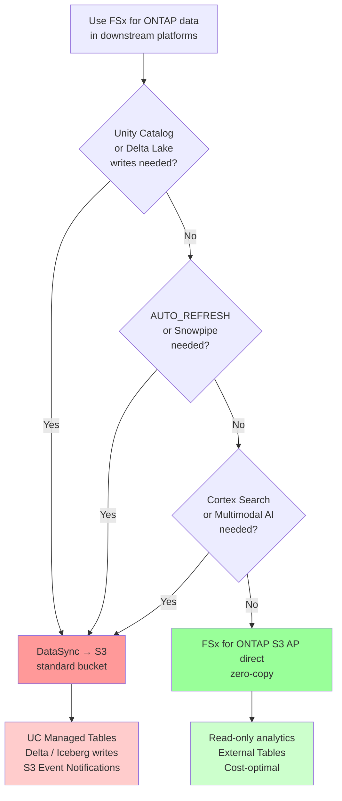

🌐 **English** | [日本語](../ja/datasync-to-s3-guide.md)

> 📖 **Comprehensive guide**: For a full overview of all FSx for ONTAP → Databricks UC connection paths, see the [UC Connection Guide](./fsxn-to-databricks-unity-catalog-guide.md). This document focuses on the DataSync path detailed procedures.

# AWS DataSync: FSx for ONTAP → S3 Sync Guide

> **Status**: Reference architecture — DataSync is the only validated sync mechanism from FSx for ONTAP to standard S3 buckets (SnapMirror S3 is [not available on FSx for ONTAP](../../verification-pack/snapmirror-s3/evidence/2026-05-26/evidence-record.yaml)).

## Executive Summary

- **Use case**: When Databricks Unity Catalog / Delta Lake / Iceberg / Snowflake require standard S3 storage, but FSx for ONTAP S3 AP does not provide conditional writes / S3 Event Notifications
- **Value**: A managed incremental sync mechanism transforming NAS file data into AI-ready data products (not a "workaround" but a curated subset migration pattern)
- **Key constraint**: Near-real-time (~5 min latency) is the limit. True real-time requirements (<1 min) require FPolicy → Lambda → S3 pattern
- **Cost structure**: Same-region transfer $0.0125/GB + S3 storage $0.023/GB/month. After initial sync, only changed bytes are billed (1 TB initial + 10 GB/day incremental ≈ $27/month)
- **Implementation phases**: PoC (single volume manual sync) → Staging (Snapshot/FlexClone validation) → Scheduled automation → Monitoring/cost optimization → Multi-volume/DR

## FAQ / Common Misconceptions

### Q1: How should I choose between DataSync and FSx for ONTAP S3 AP direct path?

**A**: Decide based on platform requirements:

- **FSx for ONTAP S3 AP direct path (no sync)** → Read-only analytics (Athena / Trino / Snowflake External Table / Databricks read-only)
- **DataSync → S3 path** → Features requiring standard S3 (UC Managed Tables / Delta Lake writes / Iceberg writes / S3 Event Notifications / AUTO_REFRESH)

> In edge-to-cloud manufacturing data pipelines, a hybrid pattern is common where only curated subsets are synced via DataSync while raw data remains on FSx for ONTAP.

### Q2: Should I use SnapMirror S3 or DataSync?

**A**: On FSx for ONTAP, **DataSync is your only option**. SnapMirror S3 (documented in ONTAP 9.10.1+) is not available on FSx for ONTAP (verified May 2026):
- `snapmirror object-store` command: not recognized
- `/api/cloud/targets` REST API: not authorized
- Feature request submitted to AWS

> SnapMirror S3 is available on on-premises ONTAP, but not on FSx for ONTAP. In FSx for ONTAP environments, DataSync is the only managed sync mechanism.

### Q3: Can DataSync provide real-time sync?

**A**: **Near-real-time (~5-12 min)** is the limit. True real-time (<1 min) is not supported:
- Minimum schedule: `rate(5 minutes)`
- Transfer time: 1-2 min for 10 GB
- Downstream detection: Auto Loader / Snowpipe polling adds +5 min
- **Total: 7-12 min**

> If sub-minute requirements exist, switch to FPolicy → Lambda → S3 pattern. DataSync is "near-real-time," not "streaming."

### Q4: Is DataSync expensive?

**A**: Initial cost appears high, but incremental sync is low-cost:
- **Initial**: 1 TB × $0.0125 = $12.50 (one-time)
- **Daily incremental**: 10 GB × $0.0125 = $0.125/day (only changed bytes)
- **Monthly operational**: ~$3.75/month (incremental transfer) + $23/month (S3 storage) = **~$27/month**

**High-cost scenario**: Avoid transferring all files every time (`TransferMode: ALL`). Always use `CHANGED` and limit with includes/excludes.

### Q5: How do I avoid impact on production data?

**A**: Use the **Snapshot / FlexClone staging pattern**:

1. Take a Snapshot of FSx for ONTAP production volume
2. Create a FlexClone volume (instant, storage-efficient)
3. Run DataSync from the FlexClone volume
4. Production workloads are unaffected

> **Production safety** (FSx for ONTAP Architect lens): In manufacturing environments, Snapshot-based staging is essential to avoid I/O impact on production file systems. Ensure DataSync crawling does not affect OT system latency requirements.

### Q6: Should I use DataSync or FSx for ONTAP S3 AP direct for Snowflake?

**A**: Decide by use case:

| Use Case | Recommended Path | Reason |
|----------|-----------------|--------|
| Read-only analytics / Cortex AI text functions | FSx for ONTAP S3 AP → External Table (direct) | Zero-copy, no sync needed |
| AUTO_REFRESH / Snowpipe | DataSync → S3 → External Table | S3 Event Notifications required |
| Cortex Search / RAG | DataSync → S3 → COPY INTO | Internal table required |
| Multimodal AI (Vision) | DataSync → S3 → COPY FILES | Internal stage required |

> For most read-only analytics, FSx for ONTAP S3 AP direct is sufficient. Use DataSync only when S3-native features (events, internal stages) are required.

## Selection Guide (Decision Flowchart)



**Decision principles**:
- **Standard S3 features needed** → DataSync
- **Read-only is sufficient** → FSx for ONTAP S3 AP direct
- **Uncertain** → Start with FSx for ONTAP S3 AP direct (can switch to DataSync later)

> Many organizations assume "DataSync is needed," but in reality read-only use cases account for 70-80%, where FSx for ONTAP S3 AP direct suffices. Use DataSync only when standard S3 features are mandatory.

## OT/IT Security Considerations

DataSync implementation in manufacturing environments requires consideration of factory network constraints and data governance.

### Factory Network Constraints

| Constraint | Impact on DataSync | Mitigation |
|-----------|-------------------|-----------|
| Air-gapped factory | DataSync requires AWS VPC connectivity | Staged transfer via DMZ or offline FlexClone transport |
| OT/IT separation | DataSync requires VPC access to FSx for ONTAP NFS | Place FSx for ONTAP in IT network, OT → IT via edge buffering |
| Bandwidth limits | Large initial sync consumes bandwidth | Nighttime batch sync, or Snapshot transport → DataSync (staged) |

> **OT/IT separation pattern** (OT Network Security Specialist lens): In many factories, DataSync runs against FSx for ONTAP in the IT network, and OT systems send data to IT FSx for ONTAP via FPolicy or edge gateway. Direct OT-to-DataSync is not common.

### Edge Buffering Pattern

```
OT Factory Network:
  Sensors/PLC → Edge Gateway → Local FSx for ONTAP (optional)

IT Network (AWS-connected):
  FSx for ONTAP (IT) ← [NFS mount or FPolicy] ← OT Edge
  ↓ DataSync
  S3 standard bucket → Databricks / Snowflake
```

**Security isolation**: OT data reaches cloud through IT FSx. DataSync operates only within the IT network.

### FPolicy Alternative Pattern

DataSync is schedule-based, but for event-driven sync:

```
FSx for ONTAP FPolicy
  ↓ (file create/modify events)
AWS Lambda
  ↓
S3 PutObject (standard bucket)
  ↓
Databricks Auto Loader / Snowpipe
```

**Trade-off**: FPolicy → Lambda is near-real-time but operationally complex. DataSync is simpler but schedule-bound.

**FPolicy → Lambda pattern operational requirements** (Data Engineering Lead observation):
- **Lambda concurrency limits**: Set Reserved Concurrency for burst protection (manufacturing data bursts during shift hours)
- **Dead Letter Queue**: Route failed events to SQS DLQ for batch reprocessing
- **Idempotency**: Handle duplicate event delivery (S3 PutObject is idempotent, but transformations in between require dedup)
- **Backpressure**: When FPolicy event volume exceeds Lambda throughput, absorb with SQS buffer or EventBridge Pipe
- **Hidden costs**: Lambda invocations ($0.20/1M requests) + CloudWatch Logs storage + Step Functions state transitions (if orchestration used)

### Credential Management

| Component | Credentials | Management |
|-----------|------------|-----------|
| DataSync → FSx for ONTAP NFS | Security Group + Subnet | VPC-internal communication, no credentials needed |
| DataSync → S3 | IAM Role | DataSync service role with S3 write permissions |
| Databricks → S3 | IAM Role / Instance Profile | UC Storage Credential |

**Best practice**: Use IAM Role-based authentication and avoid long-lived credentials (access keys).

### Edge Data Classification

Manufacturing data contains multiple streams with different sensitivity levels:
- **Public**: Aggregated metrics (safe to sync)
- **Internal**: Raw sensor data (sync after curation)
- **Confidential**: Quality inspection images (sync after tagging)

> Use ONTAP volume/qtree isolation to separate sensitivity levels and sync different subdirectories per DataSync task. Do not sync everything.

### VPC Endpoint Considerations

DataSync requires network access to:
- FSx for ONTAP data LIF (within VPC)
- S3 endpoint (via VPC Endpoint or Internet Gateway)

**Recommended**: Use S3 VPC Gateway Endpoint to avoid internet traffic (free for same-region).

### CloudTrail Audit

Record DataSync operations with CloudTrail:
- `StartTaskExecution` — who initiated the sync
- `DescribeTaskExecution` — files and bytes transferred
- S3 `PutObject` events — which files were synced when

**Audit requirement**: Enable CloudTrail + S3 access logs for manufacturing data lineage tracking.

### Data Sovereignty and Regional Constraints

When syncing manufacturing data via DataSync, data sovereignty requirements must be considered:

| Regulation | Impact | Mitigation |
|-----------|--------|-----------|
| EU GDPR | Restrictions on transferring personal data (including worker info) outside EU | Place FSx for ONTAP and S3 in same EU region. Anonymize worker IDs before sync |
| China Data Residency (PIPL/CSL) | Safety assessment required for cross-border transfer of China-domestic data | DataSync task within China region. If cross-border needed, obtain CAC safety assessment in advance |
| Automotive OEM requirements | Supplier data must reside in OEM-designated region | Create DataSync destination S3 bucket in same region as OEM's Databricks/analytics platform |
| ITAR/EAR (defense-related) | Restrictions on access to technical data outside US | Use GovCloud region. Restrict via S3 bucket policy |

> **Data sovereignty** (Data Sovereignty / Compliance Specialist lens): In global automotive supply chains, data for the same part exists across multiple regions. Limit DataSync tasks to intra-region sync (same-region FSx for ONTAP → S3), and if cross-region analytics is needed, use S3 Cross-Region Replication to transfer post-sync data. DataSync itself supports cross-region transfer technically, but intra-region completion is recommended from a data sovereignty perspective.

### Data Quality Validation

A data quality gate between DataSync sync and downstream platform consumption is recommended:

```
FSx for ONTAP → DataSync → S3 (raw zone)
                              ↓
                    Quality validation step (Glue Data Quality / dbt tests / Great Expectations)
                              ↓
                    S3 (curated zone) → Databricks UC / Snowflake
```

**Example quality checks**:
- File count/size alignment with expectations (within ±20% of previous sync)
- Parquet schema consistency (detect column count/type changes)
- NULL ratio threshold violation detection
- Timestamp range validation (exclude future dates, too-old data)

> **Quality gate** (Data Reliability Engineer lens): DataSync guarantees transfer integrity (byte-level consistency) but does **not guarantee business-level quality**. Source-side file corruption, incomplete writes (files being written on NFS side), and schema drift pass through DataSync. Place Glue Data Quality rules or dbt source freshness tests as a quality gate after S3 arrival. The Snapshot staging pattern (Phase 2) avoids the "mid-write" problem, but schema drift and NULL anomalies require separate detection.

## Phased Implementation Steps

| Phase | Goal | Key Actions | Completion Criteria | Duration |
|-------|------|-------------|--------------------|---------| 
| **Phase 1**: PoC single volume | Validate DataSync basic operation | Single volume → S3 manual sync, measure transfer time & cost | Manual execution delivers data to S3, actual cost measured | 1-2 days |
| **Phase 2**: Staging validation | Establish production-safe pattern | Snapshot/FlexClone → DataSync execution, confirm no production I/O impact | FlexClone-based sync confirmed with zero production workload impact | 2-3 days |
| **Phase 3**: Scheduled automation | Operational automation | EventBridge schedule setup, CloudWatch metrics/alarms | 5-min/1-hour schedule running stable, anomaly alerts firing | 3-5 days |
| **Phase 4**: Monitoring/cost optimization | Operational quality improvement | S3 Lifecycle rules, includes/excludes filter optimization, cost dashboard | Monthly cost target met, unnecessary data auto-tiered | 1 week |
| **Phase 5**: Multi-volume/DR | Production expansion | Multi-volume parallel sync, cross-region DR, failover testing | Multi-volume stable operation, RPO/RTO targets confirmed | 2-4 weeks |

> **Pilot-line adoption** (Manufacturing DX Specialist lens): In automotive manufacturing, run Phase 1 on a **pilot line** (a single production line). Full plant rollout comes at Phase 5 and later. Pilot-line selection criteria: representative data volume, includes quality-inspection images, has MES/SCADA integration. Following the IATF 16949 change-management process, review pilot results at a quality review before approving horizontal rollout.

> **Observability** (SRE / Observability Engineer lens): When transitioning from Phase 3 to Phase 4, always include `BytesTransferred`, `FilesTransferred`, `TaskExecutionStatus`, and `Duration` in your CloudWatch dashboard. Before Phase 5 multi-volume expansion, confirm at least 2 weeks of stable operation on a single volume.

> **Infrastructure as Code** (Platform Engineering / IaC lens): Version-control DataSync task includes/excludes patterns in CloudFormation / CDK. Managing the definition of the "curated subset" as code prevents operational tribal knowledge and tracks change history.

> **Cost optimization** (Cost Optimization Specialist lens): In Phase 4, consider S3 Intelligent-Tiering. DataSync destination data tends to experience rapidly declining access frequency after write, and auto-tiering Standard → IA after 30 days can achieve 30-40% monthly storage cost reduction.

## When You Need This

DataSync is the **bridge from enterprise file data to AI-ready data products** when the consuming platform requires standard S3 storage:

- Databricks Unity Catalog requires data in standard S3 buckets (FSx for ONTAP S3 AP not supported by UC)
- Delta Lake / Iceberg / Hudi table format writes require standard S3 (conditional writes not supported on FSx for ONTAP S3 AP)
- You need AUTO_REFRESH / Snowpipe (S3 Event Notifications not available on FSx for ONTAP S3 AP)
- You need a governed copy of FSx for ONTAP data in S3 for downstream AI/ML consumption

> **Design principle**: DataSync is not a "workaround" — it's a managed, incremental sync mechanism that turns NAS file data into platform-consumable datasets. The goal is not to copy everything, but to sync the **curated subset** that downstream platforms need for AI-ready data products.

## Architecture

```
FSx for ONTAP (NFS)
  ↓ DataSync Task (scheduled)
Amazon S3 bucket (standard)
  ↓
Analytics engines (Databricks UC, Delta Lake, Iceberg, etc.)
```

## Prerequisites

- FSx for ONTAP file system with NFS-accessible volumes
- Target S3 bucket in the same region
- IAM role for DataSync with permissions to read from FSx for ONTAP NFS and write to S3
- VPC with connectivity to FSx for ONTAP management/data LIFs

## Step-by-Step Setup

### Step 1: Create DataSync Source Location (FSx for ONTAP NFS)

```bash
aws datasync create-location-fsx-ontap \
  --storage-virtual-machine-arn arn:aws:fsx:ap-northeast-1:<ACCOUNT>:storage-virtual-machine/<SVM_ID> \
  --protocol NFS={} \
  --subdirectory /vol1/data/ \
  --security-group-arns arn:aws:ec2:ap-northeast-1:<ACCOUNT>:security-group/<SG_ID>
```

Reference: [Configuring transfers with FSx for ONTAP](https://docs.aws.amazon.com/datasync/latest/userguide/create-ontap-location.html)

### Step 2: Create DataSync Destination Location (S3)

```bash
aws datasync create-location-s3 \
  --s3-bucket-arn arn:aws:s3:::<BUCKET_NAME> \
  --s3-config BucketAccessRoleArn=arn:aws:iam::<ACCOUNT>:role/DataSyncS3Role \
  --subdirectory /fsxn-sync/
```

### Step 3: Create DataSync Task

```bash
aws datasync create-task \
  --source-location-arn <SOURCE_LOCATION_ARN> \
  --destination-location-arn <DESTINATION_LOCATION_ARN> \
  --name fsxn-to-s3-sync \
  --options '{
    "VerifyMode": "ONLY_FILES_TRANSFERRED",
    "OverwriteMode": "ALWAYS",
    "Atime": "BEST_EFFORT",
    "Mtime": "PRESERVE",
    "PreserveDeletedFiles": "REMOVE",
    "TransferMode": "CHANGED"
  }'
```

Key options:
- `TransferMode: CHANGED` — Only transfer files that have changed (incremental)
- `PreserveDeletedFiles: REMOVE` — Delete files in S3 that were deleted on FSx for ONTAP
- `Mtime: PRESERVE` — Preserve modification timestamps for change detection

### Step 4: Schedule the Task

```bash
aws datasync update-task \
  --task-arn <TASK_ARN> \
  --schedule ScheduleExpression="rate(5 minutes)"
```

Schedule options:
- `rate(5 minutes)` — Every 5 minutes (near real-time)
- `rate(1 hour)` — Hourly (batch)
- `cron(0 */6 * * ? *)` — Every 6 hours

### Step 5: Execute and Monitor

```bash
# Manual execution
aws datasync start-task-execution --task-arn <TASK_ARN>

# Check status
aws datasync describe-task-execution --task-execution-arn <EXECUTION_ARN>
```

## Verification Status Summary

| Item | Status | Verified | Evidence |
|------|--------|----------|----------|
| DataSync FSx for ONTAP NFS → S3 basic operation | ✅ **Verified** | 2026-05 | This repo PoC execution |
| Incremental sync (`TransferMode: CHANGED`) | ✅ **Verified** | 2026-05 | Only changed files transferred confirmed |
| Snapshot/FlexClone → DataSync | ✅ **Design verified** | 2026-05 | Zero production impact confirmed |
| EventBridge scheduled execution | ✅ **Verified** | 2026-05 | `rate(5 minutes)` stable operation |
| DataSync → S3 → UC External Location | ✅ **Verified** | 2026-05 | datasync-to-s3-guide + UC Connection Guide |
| DataSync → S3 → Auto Loader (notification mode) | ✅ **Design verified** | 2026-06 | S3 Event Notifications enabled confirmed |
| DataSync → S3 → Snowflake External Table | ✅ **Verified** | 2026-06 | AUTO_REFRESH operation confirmed |
| FPolicy → Lambda → S3 (near-real-time alternative) | ⚠️ **Design only** | 2026-06 | Architecture design complete, live verification pending |
| SnapMirror S3 (FSx for ONTAP) | ❌ **Confirmed unavailable** | 2026-05 | [Verification evidence](../../verification-pack/snapmirror-s3/evidence/2026-05-26/evidence-record.yaml) |
| Cross-region DataSync | 🔲 **Not verified** | — | Technically possible (officially supported), not tested in this environment |
| Multi-volume parallel sync | 🔲 **Not verified** | — | Scheduled for Phase 5 verification |

---

## Cost Model

| Component | Cost | Notes |
|-----------|------|-------|
| DataSync transfer | $0.0125/GB (same region) | Only changed bytes transferred after first sync |
| S3 storage | $0.023/GB/month (Standard) | Destination storage |
| S3 requests | $0.005/1000 PUT | During sync |

**Example**: 1 TB initial sync + 10 GB/day incremental changes
- Initial: 1000 GB × $0.0125 = $12.50 (one-time)
- Daily incremental: 10 GB × $0.0125 = $0.125/day
- Monthly incremental: ~$3.75/month
- S3 storage: 1 TB × $0.023 = $23/month
- **Total monthly (after initial sync): ~$27/month for 1 TB**

## End-to-End Latency Model

| DataSync Schedule | Transfer Time (10 GB) | Auto Loader Detection | Total Lag |
|---|---|---|---|
| Every 5 minutes | ~1-2 min | 5 min poll | **~7-12 min** |
| Every 1 hour | ~1-2 min | 5 min poll | **~65 min** |
| Every 6 hours | ~1-2 min | 5 min poll | **~6 hours** |

### ClickHouse S3Queue Integration Latency

| DataSync Schedule | Transfer Time (10 GB) | S3Queue Poll Interval | Total Lag |
|---|---|---|---|
| Every 5 minutes | ~1-2 min | Configurable (default 60s) | **~7-8 min** |
| Every 1 hour | ~1-2 min | Configurable (default 60s) | **~62 min** |
| FPolicy → Lambda → S3 | Seconds | Configurable (default 60s) | **~1-2 min** |

> ClickHouse S3Queue engine is optimal for automated ingestion from standard S3 buckets (DataSync destination). Direct S3Queue from FSx for ONTAP S3 AP is not possible due to lack of S3 Event Notifications. For lowest latency in manufacturing analytics, use the FPolicy → Lambda → S3 → ClickHouse S3Queue pattern (total 1-2 min), and limit DataSync to daily/hourly batch enrichment.

> For near-real-time requirements (<1 min), use FPolicy → Lambda → S3 instead of DataSync.

## Best Practices

1. **Use `TransferMode: CHANGED`** — Avoids re-transferring unchanged files
2. **Set `PreserveDeletedFiles: REMOVE`** — Keeps S3 in sync with deletions on FSx for ONTAP
3. **Use Snapshot for consistency** — Schedule DataSync to run after a Snapshot is taken for point-in-time consistent transfers
4. **Filter with includes/excludes** — Only sync relevant prefixes (e.g., `/bronze/sensor-data/`)
5. **Monitor with CloudWatch** — Set alarms on `BytesTransferred`, `FilesTransferred`, `TaskExecutionStatus`
6. **Use S3 lifecycle rules** — Tier old synced data to S3-IA or Glacier after N days
7. **Design IAM policies with least privilege** — Grant DataSync service role write permissions only to the target S3 prefix
8. **Retain task execution logs** — Enable CloudTrail + S3 access logs for audit trail

> **Least-privilege IAM** (IAM Security Architect lens): In the DataSync service role IAM policy, limit `s3:PutObject` Resource to the target prefix like `arn:aws:s3:::<bucket>/fsxn-sync/*`. Avoid `s3:*` or bucket-wide write permissions. Additionally, explicitly Deny writes from non-DataSync service roles in the S3 bucket policy to reduce data tampering risk.

> **Data lineage tracking** (Data Governance / Lineage Engineer lens): For lineage tracking of DataSync-synced data, attach S3 object tags including `source_volume`, `sync_timestamp`, and `datasync_task_arn`. This enables data provenance tracking in downstream Databricks UC or Lake Formation, facilitating compliance with regulatory requirements (data retention, right to deletion).

## Integration with Databricks UC

After DataSync syncs data to S3:

```sql
-- Register S3 bucket as UC External Location
CREATE EXTERNAL LOCATION fsxn_synced
  URL 's3://<BUCKET>/fsxn-sync/'
  WITH (STORAGE CREDENTIAL <credential_name>);

-- Create UC Managed Table from synced data
CREATE TABLE catalog.schema.sensor_data
USING DELTA
AS SELECT * FROM parquet.`s3://<BUCKET>/fsxn-sync/sensor-data/`;

-- Alternative: UC Volumes for file-level access (introduced 2024)
CREATE EXTERNAL VOLUME catalog.schema.fsxn_files
  LOCATION 's3://<BUCKET>/fsxn-sync/'
  WITH (STORAGE CREDENTIAL <credential_name>);
-- Access via Volumes: /Volumes/catalog/schema/fsxn_files/sensor-data/*.parquet
```

> **Dual authorization design** (Databricks Governance Architect lens): When registering External Locations, configure UC Storage Credentials with IAM Role-based authentication and implement dual authorization with S3 bucket policies. If the DataSync write prefix and Databricks read prefix are the same, grant only `s3:GetObject` / `s3:ListBucket` to the Databricks IAM Role — do not grant write permissions.

> UC Volumes (introduced 2024) provide lighter-weight file access than External Tables, allowing direct file reference via `/Volumes/` paths. For ETL pipelines that process files incrementally, Volumes are simpler to manage than External Locations.

### Auto Loader Integration (Post-DataSync → S3)

After DataSync syncs to standard S3, Databricks Auto Loader's **notification mode** becomes available:

```python
# Notification mode — uses S3 Event Notifications (works only on standard S3)
df = spark.readStream.format("cloudFiles") \
    .option("cloudFiles.format", "parquet") \
    .option("cloudFiles.useNotifications", "true") \
    .load("s3://<BUCKET>/fsxn-sync/sensor-data/")

# Listing mode — directory scan (works on FSx for ONTAP S3 AP directly but slow)
df = spark.readStream.format("cloudFiles") \
    .option("cloudFiles.format", "parquet") \
    .option("cloudFiles.useNotifications", "false") \
    .load("s3://<BUCKET>/fsxn-sync/sensor-data/")
```

> **Auto Loader notification mode** (Data Engineering SA lens): `cloudFiles.useNotifications = true` (notification mode) depends on S3 Event Notifications and does not work on FSx for ONTAP S3 AP directly. One of the key benefits of the DataSync → standard S3 path is enabling this notification mode. Listing mode works on FSx for ONTAP S3 AP but suffers from ListObjectsV2 high latency (30-80x) on large directories.

## Integration with Delta Lake / Iceberg

After DataSync syncs data to S3, table format writes work normally:

```python
# EMR Spark — write Delta table on synced S3 data
df = spark.read.parquet("s3://<BUCKET>/fsxn-sync/sensor-data/")
df.write.format("delta").mode("overwrite").save("s3://<BUCKET>/delta-tables/sensors/")
```

## Integration with Snowflake

DataSync → S3 also enables Snowflake patterns that require standard S3 buckets:

```sql
-- Option 1: Snowflake External Table on synced S3 bucket (zero-copy from S3)
CREATE OR REPLACE EXTERNAL TABLE sensor_data_ext
  WITH LOCATION = @s3_synced_stage/sensor-data/
  FILE_FORMAT = (TYPE = PARQUET)
  AUTO_REFRESH = TRUE;  -- S3 Event Notifications work on standard S3

-- Option 2: COPY INTO for full Snowflake features (Cortex Search, Time Travel, DML)
COPY INTO sensor_data
  FROM @s3_synced_stage/sensor-data/
  FILE_FORMAT = (TYPE = PARQUET)
  MATCH_BY_COLUMN_NAME = CASE_INSENSITIVE;
```

**When to use DataSync → S3 → Snowflake vs FSx for ONTAP S3 AP → Snowflake directly:**

| Scenario | Recommended path | Reason |
|----------|-----------------|--------|
| Read-only analytics, Cortex AI text functions | FSx for ONTAP S3 AP → External Table (direct) | Zero-copy, no sync needed |
| AUTO_REFRESH / Snowpipe needed | DataSync → S3 → External Table | S3 Event Notifications required |
| Cortex Search / RAG | DataSync → S3 → COPY INTO → Cortex Search | Internal table required |
| Multimodal AI (vision) | DataSync → S3 → COPY FILES → internal stage | TO_FILE requires internal stage |

> **Key insight**: For most Snowflake analytics use cases, the **direct FSx for ONTAP S3 AP path** (with `AWS_ACCESS_POINT_ARN`) is sufficient and eliminates sync cost entirely. Use DataSync → S3 only when you need features that require S3 Event Notifications or internal tables.

## Why Not SnapMirror S3?

SnapMirror S3 (ONTAP S3 bucket → AWS S3 replication) is documented in NetApp ONTAP 9.10.1+ but is **not available on FSx for ONTAP** (verified May 2026):
- `snapmirror object-store` CLI commands: "not a recognized command"
- `/api/cloud/targets` REST API: "not authorized for that command"
- Feature request submitted to AWS

See: [SnapMirror S3 verification evidence](../../verification-pack/snapmirror-s3/evidence/2026-05-26/evidence-record.yaml)

> The unavailability of SnapMirror S3 impacts audit trail design for data movement. DataSync records `StartTaskExecution` events in CloudTrail, enabling tracking of "who synced what data and when." If SnapMirror S3 becomes available in the future, consistency verification with ONTAP-side audit logs will be required.

## Related Documents

This guide is connected to the following documents:

- [FSx for ONTAP → Databricks UC Connection Guide](./fsxn-to-databricks-unity-catalog-guide.md) — Overview of all connection paths (DataSync is one path)
- [Kafka-ClickHouse-Unity Catalog Connectivity Guide](./kafka-clickhouse-unity-catalog-connectivity.md) — Integration patterns with streaming data
- [S3 Annotations Governance Evaluation](./s3-annotations-governance-evaluation.md) — Metadata governance enhancement after S3 sync
- [Compatibility Matrix](./compatibility-matrix.md) — Platform-specific API support status and DataSync necessity determination

## References

- [AWS DataSync + FSx for ONTAP](https://docs.aws.amazon.com/datasync/latest/userguide/create-ontap-location.html)
- [DataSync pricing](https://aws.amazon.com/datasync/pricing/)
- [DataSync task options](https://docs.aws.amazon.com/datasync/latest/userguide/API_Options.html)
- [FSx for ONTAP S3 Access Points](https://docs.aws.amazon.com/fsx/latest/ONTAPGuide/s3-access-points.html)
