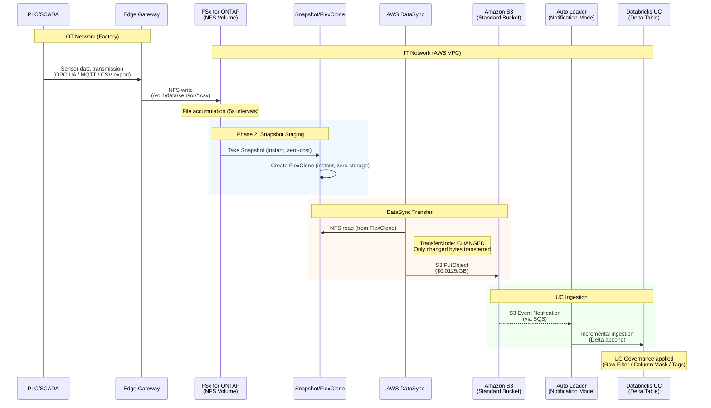
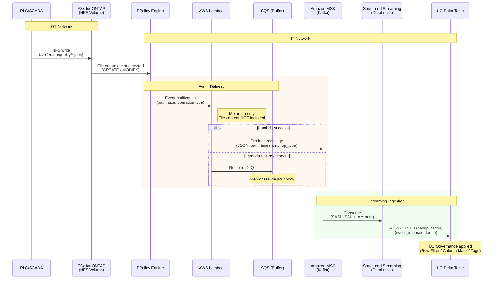

🌐 **English** | [日本語](../ja/e2e-sequence-diagrams.md)

# End-to-End Data Flow Sequence Diagrams

> **Purpose**: Visualizes full data flows from FSx for ONTAP to downstream analytics platforms, annotated with latency, data volumes, and failure behavior at each step.
> **Last updated**: 2026-06-21

---

## Overview

This document details the 2 primary paths in this repository using mermaid sequence diagrams:

1. **DataSync Path** (batch / near-real-time): PLC → FSx for ONTAP → DataSync → S3 → Databricks UC
2. **FPolicy Path** (event-driven / near-real-time): PLC → FSx for ONTAP → FPolicy → Lambda → Kafka → UC Delta

---

## Path 1: DataSync Path (Recommended, Production)

### Sequence Diagram

### Latency Budget

| Step | Latency | Cumulative | Notes |
|------|:---:|:---:|------|
| PLC → Edge Gateway | ~1 ms | 1 ms | OPC UA / local network |
| Edge → FSx for ONTAP (NFS write) | ~5 ms | 6 ms | NFS v4.1 over VPC |
| File accumulation (buffering) | 5 sec–5 min | 5 min | Edge Gateway batch write interval |
| Snapshot + FlexClone | ~1 sec | 5 min | Instant operations |
| DataSync scan + transfer (10 GB) | 1-2 min | 7 min | CHANGED mode |
| S3 Event → SQS → Auto Loader | ~30 sec | 7.5 min | Notification propagation + polling |
| Auto Loader → Delta write | ~30 sec | **8 min** | Spark micro-batch |

> **Total E2E latency**: PLC output to UC Delta table queryable in **~7-12 min** (with DataSync 5-min schedule)

### Failure Scenarios and Recovery

| Failure Point | Impact | Detection | Recovery |
|---|---|---|---|
| Edge → FSx for ONTAP disconnected | Data accumulation stops | NFS mount monitoring | Edge local buffer → resend on reconnect |
| FSx for ONTAP failure | Multi-AZ failover | CloudWatch FSx metrics | Automatic failover (~30 sec) |
| DataSync failure | Sync delay | CloudWatch alarm | [Runbook #01](../../runbooks/01-datasync-failure-triage.md) |
| S3 write failure | DataSync retry | DataSync execution status | Automatic retry (DataSync built-in) |
| Auto Loader failure | Ingestion delay | Spark Streaming metrics | Resume from checkpoint (exactly-once) |

---

## Path 2: FPolicy Path (Event-Driven)

### Sequence Diagram

### Latency Budget

| Step | Latency | Cumulative | Notes |
|------|:---:|:---:|------|
| PLC → FSx for ONTAP (NFS write) | ~5 ms | 5 ms | NFS v4.1 |
| FPolicy event detection | ~100 ms | 100 ms | ONTAP internal event propagation |
| FPolicy → Lambda invocation | ~200 ms | 300 ms | VPC-internal communication (ENI) |
| Lambda processing | ~500 ms | 800 ms | Metadata transform + Kafka Produce |
| Kafka → Structured Streaming | ~2 sec | 3 sec | Micro-batch interval dependent |
| Structured Streaming → UC Delta | ~2 sec | **5 sec** | MERGE INTO |

> **Total E2E latency**: PLC output to UC Delta table queryable in **~3-10 sec** (depends on streaming micro-batch interval)

### Failure Scenarios and Recovery

| Failure Point | Impact | Detection | Recovery |
|---|---|---|---|
| FPolicy → Lambda disconnected | Event loss risk | FPolicy disconnect log | FPolicy auto-reconnect |
| Lambda timeout | DLQ accumulation | CloudWatch Lambda Errors | [Runbook #02](../../runbooks/02-fpolicy-lambda-failure.md) |
| Lambda → Kafka failure | DLQ accumulation | CloudWatch + DLQ depth | [Runbook #02](../../runbooks/02-fpolicy-lambda-failure.md) |
| MSK broker failure | Produce failure | MSK metrics | MSK auto-recovery + Lambda retry |
| Structured Streaming failure | Ingestion stops | Spark metrics | Resume from checkpoint |
| Duplicate event delivery | Data duplication | — | Absorbed by MERGE INTO event_id dedup |

---

## Path Comparison Summary

| Attribute | DataSync Path | FPolicy Path |
|---|:---:|:---:|
| E2E Latency | 7-12 min | 3-10 sec |
| Throughput | High (DataSync optimized) | Medium (Lambda concurrency limits) |
| Operational Complexity | Low (managed) | High (Lambda + Kafka + SS) |
| Data Guarantee | Incremental sync (byte-level) | At-least-once (dedup required) |
| Cost | $0.0125/GB transfer + S3 | Lambda + MSK + Databricks Streaming |
| Failure Recovery | DataSync re-execution | DLQ reprocessing + checkpoint resume |
| Recommended Use Case | Batch analytics, ML training data | Real-time quality inspection, alerts |

> **Selection guidance** (Principal Cloud Data Architect lens): Most enterprise environments **use both paths together**. DataSync for bulk data (daily/hourly) sync, FPolicy for critical events only (quality defect detection, etc.) in real-time. Not all data needs to stream.

---

## Related Documents

- [DataSync → S3 Guide](./datasync-to-s3-guide.md) — DataSync path implementation details
- [Kafka-ClickHouse-UC Connectivity](./kafka-clickhouse-unity-catalog-connectivity.md) — FPolicy/Kafka path implementation
- [UC Connection Guide](./fsx-ontap-to-databricks-unity-catalog-guide.md) — Path selection logic
- [Runbook #01](../../runbooks/01-datasync-failure-triage.md) — DataSync failure response
- [Runbook #02](../../runbooks/02-fpolicy-lambda-failure.md) — FPolicy/Lambda failure response
- [FSx for ONTAP Feature Map](./fsx-ontap-feature-utilization-map.md) — ONTAP features used at each step
