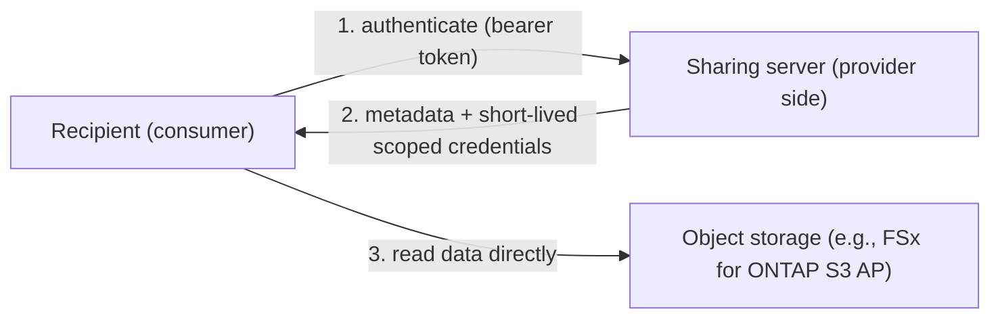
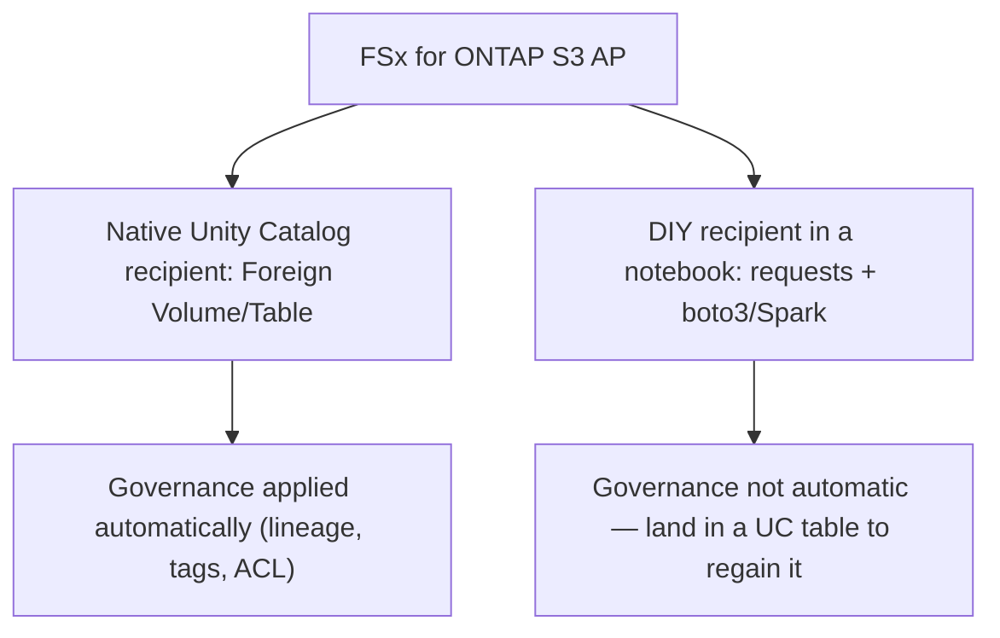
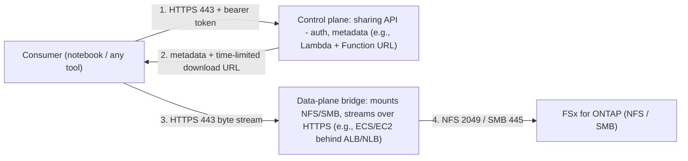

🌐 **English** | [日本語](../ja/opensharing-and-unity-catalog-explained.md)

# OpenSharing and Unity Catalog: Concepts and Validation Notes

A neutral, factual summary of how open data sharing works between object storage
(such as Amazon FSx for NetApp ONTAP S3 Access Points) and Databricks Unity Catalog
— what is available today, what is still evolving, and why.

> This document explains concepts and cites primary sources. It is not a product
> pitch and does not position any vendor against another. Availability and timelines
> are controlled by the respective platform owners; always confirm current status in
> the linked documentation.

## Overview

If you store files on a NAS/object store and want an analytics platform like
Databricks to use that data **with governance** (lineage, tags, access control),
there are a few different paths. They differ in whether data is **copied**, whether
**Unity Catalog governance** is applied automatically, and how mature each path is.

This document focuses on two related mechanisms that are easy to confuse:

- **A native Unity Catalog recipient** — Unity Catalog itself consuming a share and
  governing it as first-class objects.
- **A "do-it-yourself" recipient in a notebook** — reading shared data with your own
  code (the "use any tool" model).

## Background: OpenSharing (formerly Delta Sharing)

**OpenSharing** is an open protocol for securely sharing data and AI assets across
organizations, clouds, and platforms — without copying data. It was announced at
Data+AI Summit 2026 (June 10, 2026) as the successor to Delta Sharing, and is now
an independent open-source project hosted by the **Linux Foundation** under Apache 2.0.

The protocol defines a **three-level asset hierarchy** (`Share → Schema → Asset`) and
supports the following asset types:

| Asset type | Status | Description |
|------------|--------|-------------|
| **Table** | Specified | Structured data in Delta Lake, Apache Iceberg, or Parquet formats |
| **Volume** | Specified | Directories of files (documents, media, embeddings) via scoped credentials |
| **AgentSkill** | Specified | Reusable AI agent capabilities with scoped storage access |
| **Model** | Specified | ML model artifacts with version metadata and provenance |
| **Agent** | Community proposal | Live callable agent services |
| **Page** | Community proposal | Named business entities, metrics, or term definitions |

Key properties: **vendor-neutral** (any compliant server or client is valid),
**AI-native** (covers the full range of shared assets), **zero-copy** (assets stay
in the provider's storage), and **works where data lives** (S3, ADLS, GCS, R2,
on-premises).

Two access modes are defined for tables:
- **`url` mode** — server returns presigned URLs; client fetches data directly
- **`dir` mode** — server vends temporary STS credentials; client reads with standard `GetObject`

For Volumes, only the `dir` (STS credential) mode is used.

- OpenSharing announcement: <https://www.databricks.com/blog/introducing-opensharing-next-evolution-delta-sharing-agentic-era>
- Protocol specification (GitHub): <https://github.com/OpenSharing-IO/OpenSharing>
- Linux Foundation press release: <https://www.linuxfoundation.org/press/linux-foundation-announces-opensharing-project-to-standardize-ai-asset-and-data-exchange>
- Databricks OpenSharing product page: <https://www.databricks.com/product/opensharing>

> **Historical note**: Delta Sharing was launched by Databricks in 2021 as a sub-project
> of Delta Lake. OpenSharing retains full backward compatibility with the Delta Sharing
> protocol while extending scope to AI assets, Iceberg interoperability, and the
> `dir`-mode credential vending. Existing Delta Sharing integrations continue to work
> under OpenSharing.

"Credential vending" means the sharing server issues **short-lived, scoped cloud
credentials** (e.g., AWS STS) so the consumer reads the data **directly from object
storage** — no bulk copy required.

## Key roles and sharing models

Two terms carry most of the confusion:

- **Provider** — the side that owns data and runs (or uses a built-in) **sharing
  server**. Because the protocol is open, anyone can implement a provider server.
- **Recipient** — has two meanings: (1) a *recipient object* the provider creates to
  represent "who I share to" (with a bearer token), and (2) the *consumer* that reads
  the shared data.

Databricks documents two sharing models:

- **Databricks-to-Databricks** — both sides use Unity Catalog; provider objects are
  created automatically in the recipient's metastore, and governance applies on both
  sides. See [Manage providers for recipients](https://docs.databricks.com/aws/en/opensharing/manage-provider).
- **Databricks-to-Open** — the provider is Databricks/UC and the recipient can be
  **any tool** (including non-Databricks), using a credential file or activation URL.
  See [Access data shared with you (recipients)](https://docs.databricks.com/aws/en/opensharing/recipient)
  and [Read shared data (OpenSharing)](https://docs.databricks.com/aws/en/opensharing/share-data-open).

The core flow (credential vending) looks like this:



> Note: Unity Catalog also has a separate feature that vends credentials **to external
> engines** (the reverse direction). That is not the same as OpenSharing; see
> [UC credential vending](https://docs.databricks.com/gcp/en/external-access/credential-vending).

## Unity Catalog and FSx for ONTAP S3 Access Points

A natural question is: can Unity Catalog register an FSx for ONTAP S3 Access Point
directly as an **External Location** and create governed tables on it (zero-copy)?

As of this validation, **that direct path does not work**. When Unity Catalog assumes
the storage-credential IAM role, it generates a **session policy** that recognizes
standard S3 bucket ARNs but not **S3 Access Point ARNs**. Top-level listing and
explicit-path reads may appear to work, but subdirectory listing, `CREATE TABLE`, and
writes fail. Databricks Support confirmed S3 Access Points are not a supported storage
target for UC External Locations. This repository documents the observed behavior in
detail; see [integrations/databricks](../../integrations/databricks/).

OpenSharing sidesteps this specific limitation because it **does not use an External
Location** — the server vends scoped credentials and the consumer reads object storage
directly. The remaining question is how Unity Catalog *consumes* such a share.

## Two ways to consume data (native recipient vs DIY recipient)



**1. Native Unity Catalog recipient (managed, governed).** Unity Catalog acts as the
recipient and surfaces the shared Volumes/Tables as governed objects (with lineage,
tags, and access control). For Databricks-to-Databricks and for open-provider
**Tables**, recipient support exists today. Consuming a **non-Databricks provider's
unstructured Volumes** (the FSx for ONTAP S3 Access Point case) as native governed
objects is the newer area; Databricks announced **Storage Ecosystem** connections for
hybrid/on-prem storage over OpenSharing — see the
[Storage Ecosystem announcement](https://www.databricks.com/blog/announcing-databricks-storage-ecosystem-governing-enterprise-data-estate-wherever-it-lives).

Storage Ecosystem partner status (DAIS 2026, June 2026):

| Partner | Status |
|---------|--------|
| MinIO | GA |
| Everpure (formerly Pure Storage) | Private Preview |
| Qumulo | Private Preview (July 2026) |
| VAST Data | Private Preview (August 2026) |
| NetApp, Cohesity, Commvault, HPE, Nutanix, Rubrik | Native integration committed by end of 2026 |

Confirm scope and availability with Databricks.

**2. A "do-it-yourself" recipient in a notebook (any tool).** In the Databricks-to-Open
model, the recipient can be any tool. A **Databricks notebook** — an interactive,
cell-based coding environment similar to a Jupyter notebook, hosted by Databricks
(see [Databricks notebooks](https://docs.databricks.com/aws/en/notebooks/)) — can call
the sharing server, receive credentials, and read the data with `boto3`/Spark. There is
**no special "OpenSharing notebook"**; this is simply recipient code you write yourself.
The trade-off: Unity Catalog governance is **not** applied automatically to a DIY read;
to regain governance you would land the data in a UC-managed table.

## Supplementary pattern: a self-managed provider bridge for file-protocol (NFS/SMB) storage (illustrative)

When storage is accessed over **file protocols (NFS/SMB)** rather than an object
interface, an alternative to vending object-store credentials is to run a
**self-managed provider** that reads files over NFS/SMB and serves the bytes over
HTTPS. This is an **illustrative design pattern — not a validated or productized path**.
In particular, whether a native Unity Catalog recipient accepts self-hosted URLs is
**unverified and spec-external** (a DIY recipient can consume it). Confirm availability
and native support with Databricks.

The pattern splits into two layers with different roles:

- **Control plane** — the OpenSharing API (authentication, metadata, routing);
  lightweight and event-driven.
- **Data-plane bridge** — a long-running component that mounts the storage over NFS/SMB
  and streams file bytes over HTTPS.



Data flow:
1. The consumer authenticates to the control plane (HTTPS 443, bearer token).
2. The control plane returns metadata plus a time-limited download URL pointing to the data-plane bridge.
3. The consumer fetches the file bytes from the data-plane bridge over HTTPS (443).
4. The data-plane bridge reads from storage over NFS (2049) / SMB (445) and streams the bytes back.

Compute choices (by role):

| Role | AWS option | Why |
|---|---|---|
| Control plane (auth, metadata, routing) | Lambda + Function URL | Lightweight, event-driven; this repository's reference server |
| Data-plane bridge (managed) | ECS on Fargate | Low server ops; requires a userspace NFS/SMB client (no privileged kernel mount) |
| Data-plane bridge (high throughput / large files) | EC2 / ECS on EC2 | Host-level `mount -t nfs`/`cifs`, high bandwidth, no execution-time limit |
| Not suitable for the data plane | Lambda | 15-minute limit, response-size limits, no arbitrary NFS mount |

Ports to open:

| Direction | Port(s) | Purpose |
|---|---|---|
| Consumer → provider endpoint | TCP 443 (HTTPS/TLS) | Sharing API and byte stream |
| Data-plane bridge → storage | TCP 2049 (+ portmapper 111 for NFSv3) | NFS |
| Data-plane bridge → storage | TCP 445 | SMB |

Considerations:
- **Self-operated**: patching, scaling, HA (multi-AZ behind ALB/NLB), and always-on cost are the operator's responsibility.
- **The data plane sits on the byte path** (bandwidth, cost, latency, single point of failure) — unlike credential vending, where the consumer reads storage directly. Keep the bridge stateless to scale horizontally and run redundantly across AZs.
- **SMB + Active Directory**: the bridge authenticates as a service account (Kerberos/NTLM); the storage export policy (NFS) / share ACL (SMB) must allow the bridge. Mapping file ACLs to recipient identity (permission-aware access) is additional design work; default to deny when permissions are unknown.
- **Authentication**: expose only over TLS with bearer-token auth (and mTLS where appropriate); do not expose an unauthenticated endpoint. Prefer PrivateLink / NCC for private connectivity.

## What this repository independently validated

Using an open-source reference server (this repository) and deterministic runs, the
following were observed on FSx for ONTAP S3 Access Points:

- Credential vending issues scoped, short-lived STS credentials; **11 file formats**
  read successfully; **prefix isolation** holds (credentials for one volume cannot read
  another); presigned URLs return HTTP 200.
- From Databricks **serverless** compute: a custom public endpoint (the sharing
  server's URL) was **not reachable** by default (serverless egress is restricted; a
  Network Connectivity Configuration is required even when the egress policy is "Full").
  AWS S3 / the S3 Access Point **were** reachable via a managed VPC endpoint, and with
  vended credentials a notebook read an object from the S3 Access Point (~250 KB parquet).

Not validated here (dependent on platform features): a **native Unity Catalog
recipient** for a non-Databricks Volumes provider. Reproducible server and steps are in
[integrations/opensharing-server](../../integrations/opensharing-server/).

## UC Recipient: Current Availability and Responsibility Map

The OpenSharing protocol has two sides. The **provider** side (the sharing server) is
open and implementable by anyone — this repository demonstrates a working
implementation. The **recipient** side — where Unity Catalog consumes a share and
applies governance — is a Databricks platform feature that is being rolled out via the
Storage Ecosystem program.

### Responsibility split

```
Provider side (open, anyone can implement)     Recipient side (Databricks platform)
┌─────────────────────────────────────┐       ┌────────────────────────────────────┐
│ • OpenSharing server                │       │ • CREATE PROVIDER                  │
│ • Bearer token issuance             │ ───── │ • SHOW SHARES IN PROVIDER          │
│ • Credential vending (STS)          │  API  │ • CREATE CATALOG USING SHARE       │
│ • Asset discovery (list/get)        │       │ • Foreign Volume / Table in UC     │
│                                     │       │ • Governance (tags, ABAC, lineage) │
└─────────────────────────────────────┘       └────────────────────────────────────┘
  This repository: ✅ Done                      Status: ⏳ Pending for non-Databricks
  (FSx for ONTAP S3 AP validated)               Volume providers (Storage Ecosystem
                                                rollout in progress)
```

### What MinIO GA proves

MinIO is GA as a Storage Ecosystem partner (DAIS 2026). This means:
- The UC **recipient-side code exists** for consuming a non-Databricks provider's share
- Unity Catalog can `CREATE CATALOG USING SHARE` from an external OpenSharing server
- The mechanism works end-to-end for at least one partner

**What is unclear**: whether this recipient-side path is open to any protocol-compliant
server, or restricted to Databricks-certified partners via allowlisting.

### Remaining platform capabilities (Databricks scope)

| Capability | Description | Owner |
|------------|-------------|-------|
| UC acceptance of non-certified providers | Allow `CREATE PROVIDER` with a credential profile pointing to any OpenSharing-compliant endpoint | Databricks |
| Foreign Volume governance for external shares | Apply tags, ABAC, lineage, column masks to Volumes consumed via OpenSharing | Databricks |
| Open sharing Volume support for open recipients | Currently Volumes shared D2D only; open-recipient Volume access undocumented | Databricks |

### Why Notebook access without UC is insufficient

UC governance (tags, ABAC / row filters / column masks, audit lineage) applies **only**
to UC-registered objects. Data read in a notebook via `boto3` or Spark with external
credentials is **outside UC governance** — no tags, no ABAC, no lineage, no masking.

For regulated or governed workloads, UC registration is not optional. The path forward
requires UC to accept shares from non-Databricks providers as first-class governed
objects.

### Storage Ecosystem: who does what

| Responsibility | Owner | Status |
|---------------|-------|--------|
| Implement OpenSharing provider server for ONTAP (on-prem) | NetApp | Committed by end of 2026 |
| Implement OpenSharing provider server for FSx for ONTAP (AWS) | AWS / NetApp (partnership) | Unclear — may follow on-prem or may be separate |
| Accept non-Databricks provider shares in UC (recipient side) | Databricks | GA for MinIO; availability for other partners pending |
| Certify new partners in Storage Ecosystem | Databricks + partner jointly | Partner Well-Architected Framework |
| OSS reference server (protocol-compliant, validates feasibility) | This repository | ✅ Done |

### How to accelerate

1. **Validate technically** — attempt `CREATE PROVIDER` with a credential profile from
   the reference server. Document the result (success or error message).
2. **Feature request** — file with Databricks product team: "UC recipient for
   non-Databricks OpenSharing Volumes providers" with evidence of protocol-compliant
   server.
3. **Partner leverage** — NetApp's Storage Ecosystem commitment covers on-prem ONTAP.
   FSx for ONTAP (AWS-managed) should be included in the same timeline.
4. **Public evidence** — publish the validation showing that the provider side is
   protocol-compliant and the remaining dependency is on the platform recipient
   feature, creating community visibility and interest.

## How to choose today

- **Need governed analytics now** → stage data to a standard S3 bucket (for example via
  AWS DataSync, or an FPolicy → Lambda pipeline) and register that bucket with Unity
  Catalog. This copies data but applies full governance.
- **Need zero-copy reads without full UC governance** → read the S3 Access Point
  directly (Athena, or a DIY recipient in a notebook with vended credentials).
- **Want zero-copy *and* native UC governance** → track the native recipient / Storage
  Ecosystem direction and confirm availability with Databricks.
- **Storage can only be exposed over file protocols (NFS/SMB)** → consider the
  self-managed provider bridge above (illustrative), noting the operational
  responsibility and that native UC consumption is unverified.

Each option suits a different context; choose based on your governance, freshness, and
cost requirements.

## FAQ

- **Can a storage system implement the provider side itself?** Yes — the protocol is
  open, and this repository includes a working reference provider server. What a storage
  system cannot implement on its own is Unity Catalog's *recipient-side* behavior
  (governing a third-party share as native objects); that is a Databricks platform
  feature.
- **Is an "OpenSharing notebook" a special product?** No. It refers to writing recipient
  code inside a Databricks notebook (a Jupyter-like environment). Any tool works.
- **Is credential vending the same as Unity Catalog credential vending?** No. OpenSharing
  vending shares data *to others*; [UC credential vending](https://docs.databricks.com/gcp/en/external-access/credential-vending)
  lets external engines read *UC-managed* data.
- **Are Tables and Volumes handled the same way?** Open-provider Table consumption is
  established; native consumption of unstructured **Volumes** is the newer area.

## References

- OpenSharing announcement (Databricks): <https://www.databricks.com/blog/introducing-opensharing-next-evolution-delta-sharing-agentic-era>
- OpenSharing and Marketplace capabilities (DAIS 2026): <https://www.databricks.com/blog/announcing-new-opensharing-and-marketplace-capabilities-ai-era>
- Storage Ecosystem announcement (Databricks): <https://www.databricks.com/blog/announcing-databricks-storage-ecosystem-governing-enterprise-data-estate-wherever-it-lives>
- OpenSharing specification (GitHub): <https://github.com/OpenSharing-IO/OpenSharing>
- Linux Foundation press release: <https://www.linuxfoundation.org/press/linux-foundation-announces-opensharing-project-to-standardize-ai-asset-and-data-exchange>
- Databricks OpenSharing product page: <https://www.databricks.com/product/opensharing>
- Access data shared with you (recipients): <https://docs.databricks.com/aws/en/opensharing/recipient>
- Manage providers for recipients: <https://docs.databricks.com/aws/en/opensharing/manage-provider>
- Read shared data (OpenSharing): <https://docs.databricks.com/aws/en/opensharing/share-data-open>
- Unity Catalog credential vending: <https://docs.databricks.com/gcp/en/external-access/credential-vending>
- Databricks notebooks: <https://docs.databricks.com/aws/en/notebooks/>
- This repository — reference server: [integrations/opensharing-server](../../integrations/opensharing-server/)
- This repository — Databricks integration notes: [integrations/databricks](../../integrations/databricks/)
