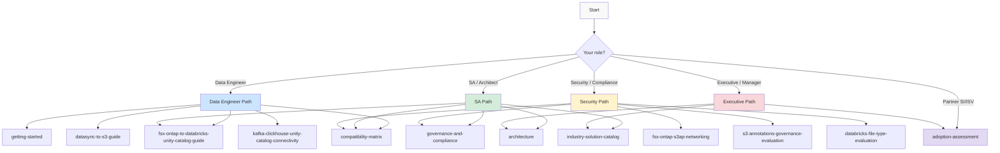
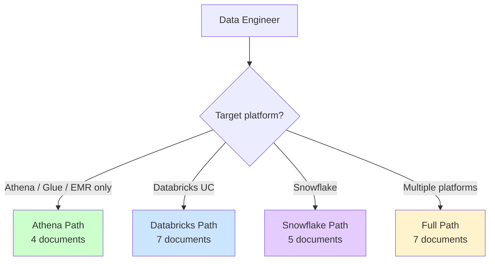
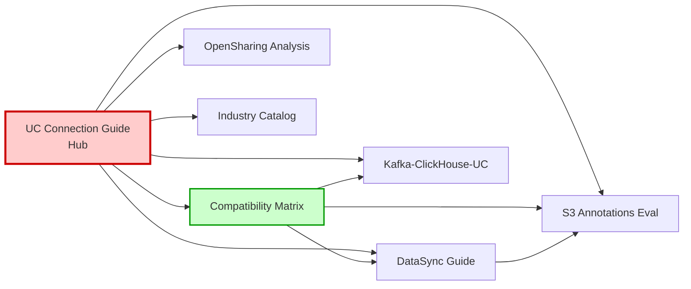

🌐 **English** | [日本語](../ja/reading-path-guide.md)

# Document Reading Path Guide

> **Purpose**: This repository contains 25+ technical documents. This guide shows the optimal reading order based on your role and objectives.
> **Updated**: 2026-06-20

---

## Document Dependency Map

---

## Out of Scope (Not Covered in This Repository)

The following topics are NOT covered here. Avoid unnecessary searching:

| Out of Scope | Reference |
|---|---|
| FSx for ONTAP file system provisioning | [AWS Docs: Create FSx for ONTAP](https://docs.aws.amazon.com/fsx/latest/ONTAPGuide/getting-started.html) |
| Databricks workspace setup | [Databricks Docs: Workspace creation](https://docs.databricks.com/en/getting-started/index.html) |
| Kafka / MSK cluster deployment | [AWS Docs: Create MSK](https://docs.aws.amazon.com/msk/latest/developerguide/getting-started.html) |
| ClickHouse installation & configuration | [ClickHouse Docs](https://clickhouse.com/docs) |
| Snowflake account initial setup | [Snowflake Docs](https://docs.snowflake.com/) |
| ONTAP CLI / REST API reference | [NetApp ONTAP Docs](https://docs.netapp.com/us-en/ontap/) |
| FSx for ONTAP cost optimization (storage tiering) | [AWS: FSx for ONTAP Pricing](https://aws.amazon.com/fsx/netapp-ontap/pricing/) |

> This repository focuses on **integration patterns for making FSx for ONTAP data available in Lakehouse platforms**. For platform-specific setup instructions, refer to official documentation.

---

## Depth Level Legend

How much of each document you should read:

| Level | Symbol | Meaning | Target Sections |
|-------|:---:|---------|----------------|
| Summary only | ○ | Executive summary is sufficient | Opening "Executive Summary" |
| Key sections | ◎ | Read sections relevant to your role | FAQ + Selection Guide + relevant path |
| Full read | ● | Read all sections | Everything |

---

## Role-Based Reading Order

### Data Engineer / Data Platform Engineer

**Goal**: Build pipelines to make FSx for ONTAP data available in Databricks / Snowflake / Athena

**First branch**: What's your target platform?

#### Athena / Glue / EMR Only (Shortest Path)

| Order | Document | Depth | Prerequisite | Time |
|:---:|---|:---:|---|:---:|
| 1 | [Getting Started](./getting-started.md) | ● | None | 10 min |
| 2 | [Compatibility Matrix](./compatibility-matrix.md) | ◎ | None (focus on matrix + quick start) | 15 min |
| 3 | [Networking](./fsx-ontap-s3ap-networking.md) | ◎ | #2 constraint understanding | 10 min |
| 4 | [Event-driven Architecture](./event-driven-architecture.md) | ○ | None (only if needed) | 5 min |

> Athena / Glue / EMR can access FSx for ONTAP S3 AP directly (no DataSync needed). You do NOT need the UC Connection Guide.

#### Databricks UC Path

| Order | Document | Depth | Prerequisite | Time |
|:---:|---|:---:|---|:---:|
| 1 | [Getting Started](./getting-started.md) | ● | None | 10 min |
| 2 | [Compatibility Matrix](./compatibility-matrix.md) | ◎ | None | 15 min |
| 3 | [UC Connection Guide](./fsx-ontap-to-databricks-unity-catalog-guide.md) | ● | #2 constraint understanding required | 30 min |
| 4 | [DataSync → S3 Guide](./datasync-to-s3-guide.md) | ● | After path selection in #3 | 20 min |
| 5 | [Kafka-ClickHouse-UC Connectivity](./kafka-clickhouse-unity-catalog-connectivity.md) | ◎ | Only if real-time requirements exist | 25 min |
| 6 | [Event-driven Architecture](./event-driven-architecture.md) | ◎ | If FPolicy details needed from #5 | 15 min |
| 7 | [Iceberg Metadata Catalog](./iceberg-metadata-catalog.md) | ○ | Only for unstructured data | 20 min |

> **Prerequisite chain**: #3 (UC Connection Guide) requires understanding constraints from #2. #4 (DataSync Guide) should be read after path selection in #3.

#### Snowflake Path

| Order | Document | Depth | Prerequisite | Time |
|:---:|---|:---:|---|:---:|
| 1 | [Getting Started](./getting-started.md) | ● | None | 10 min |
| 2 | [Compatibility Matrix](./compatibility-matrix.md) | ◎ | None (focus on Snowflake rows) | 15 min |
| 3 | [UC Connection Guide](./fsx-ontap-to-databricks-unity-catalog-guide.md) | ◎ | Snowflake section only | 10 min |
| 4 | [DataSync → S3 Guide](./datasync-to-s3-guide.md) | ◎ | Focus on Snowflake integration section | 10 min |
| 5 | [Networking](./fsx-ontap-s3ap-networking.md) | ◎ | Storage Integration design | 10 min |

> Snowflake can access FSx for ONTAP S3 AP directly (External Stage). DataSync is only needed for AUTO_REFRESH / Cortex Search.

**Can skip**: governance-and-compliance (security team handles)

---

### SA / Solutions Architect

**Goal**: Design the architecture, plan a PoC, and run architecture reviews

| Order | Document | Why to read | Time |
|:---:|---|---|:---:|
| 1 | [Architecture](./architecture.md) | Overall design philosophy | 15 min |
| 2 | [UC Connection Guide](./fsx-ontap-to-databricks-unity-catalog-guide.md) | Complete path selection logic and constraints | 30 min |
| 3 | [Compatibility Matrix](./compatibility-matrix.md) | Platform/format support details | 20 min |
| 4 | [Industry Solution Catalog](./industry-solution-catalog.md) | Industry-specific application patterns | 20 min |
| 5 | [Governance and Compliance](./governance-and-compliance.md) | Enterprise requirements coverage | 15 min |
| 6 | [DataSync → S3 Guide](./datasync-to-s3-guide.md) | Recommended path technical details | 20 min |
| 7 | [Recovery Semantics](./recovery-semantics.md) | Snapshot vs Time Travel comparison | 10 min |
| 8 | [OpenSharing Integration Analysis](./opensharing-integration-analysis.md) | DAIS 2026 new feature impact | 15 min |
| 9 | [Adoption Assessment](../adoption-guide/adoption-assessment.md) | Fit criteria and configuration scoping | 10 min |

**Also see**: vendor-comparison (when alternatives needed), region-design-guide (global deployments), [Architecture Comparison](../adoption-guide/architecture-comparison.md) (approach selection), [Cost Estimation](../adoption-guide/cost-estimation.md) (capacity planning)

---

### Security / Compliance

**Goal**: Validate data protection, access control, audit, and regulatory compliance

| Order | Document | Why to read | Time |
|:---:|---|---|:---:|
| 1 | [Governance and Compliance](./governance-and-compliance.md) | Overall security design | 20 min |
| 2 | [Compatibility Matrix](./compatibility-matrix.md) | Dual-layer authorization model and VPC design | 15 min |
| 3 | [Networking](./fsx-ontap-s3ap-networking.md) | VPC/AP/endpoint design | 15 min |
| 4 | [S3 Annotations Governance Evaluation](./s3-annotations-governance-evaluation.md) | Metadata governance capabilities and constraints | 20 min |
| 5 | [DataSync → S3 Guide](./datasync-to-s3-guide.md) | Focus on OT/IT security section | 10 min |
| 6 | [Zero-copy Media Governance](./zero-copy-media-governance.md) | Media file access control | 15 min |
| 7 | [Recovery Semantics](./recovery-semantics.md) | DR / backup / tamper prevention | 10 min |

**Key tip**: Check the "OT/IT Security Considerations" section across all documents.

---

### Executive / Project Manager

**Goal**: Investment decisions, project planning, risk awareness

| Order | Document | Why to read | Time |
|:---:|---|---|:---:|
| 1 | [**Plain-Language Business Guide**](./quickstart-business-guide.md) | The complete picture in non-technical language | 5 min |
| 2 | [Industry Solution Catalog](./industry-solution-catalog.md) | Business value and target industries | 15 min |
| 3 | [Architecture](./architecture.md) | Executive summary only | 5 min |
| 4 | [UC Connection Guide](./fsx-ontap-to-databricks-unity-catalog-guide.md) | Executive summary + phased adoption steps | 10 min |
| 5 | [KPI and Validation](./kpi-and-validation.md) | Success metrics and progress | 10 min |

**Reading tip**: Start with the Business Guide — it covers everything a decision-maker needs in 5 minutes. The other documents are for deeper dives on specific topics.

---

### Implementing for Another Team

**Goal**: Understand the full set of connection paths and their constraints well enough to build and hand over a deployment

| Order | Document | Why to read | Time |
|:---:|---|---|:---:|
| 1 | [Adoption Assessment](../adoption-guide/adoption-assessment.md) | Fit criteria, anti-patterns, decision framework | 10 min |
| 2 | [Industry Solution Catalog](./industry-solution-catalog.md) | Industry-specific patterns | 20 min |
| 3 | [UC Connection Guide](./fsx-ontap-to-databricks-unity-catalog-guide.md) | Technical understanding of all paths | 30 min |
| 4 | [Compatibility Matrix](./compatibility-matrix.md) | Which operations are verified, and which are not | 15 min |
| 5 | [DataSync → S3 Guide](./datasync-to-s3-guide.md) | Implementation procedure understanding | 20 min |
| 6 | [PoC Execution Guide](../implementation-guide/poc-execution-guide.md) | PoC checklist and troubleshooting | 15 min |
| 7 | [Region Design Guide](./region-design-guide.md) | Global deployment design | 10 min |

---

## Document Classification Map

### Freshness Status (as of 2026-06-20)

| Document | Last Updated | Freshness |
|---|---|:---:|
| UC Connection Guide | 2026-06-18 | 🟢 Current |
| Compatibility Matrix | 2026-06-20 | 🟢 Current |
| DataSync → S3 Guide | 2026-06-20 | 🟢 Current |
| S3 Annotations Evaluation | 2026-06-20 | 🟢 Current |
| Kafka-ClickHouse-UC | 2026-06-15 | 🟢 Current |
| Industry Solution Catalog | 2026-06-18 | 🟢 Current |
| OpenSharing Integration | 2026-06-15 | 🟢 Current |
| Recovery Semantics | 2026-06-10 | 🟢 Current |
| Event-driven Architecture | 2026-05-28 | 🟡 Review needed |
| Governance and Compliance | 2026-05-25 | 🟡 Review needed |
| Networking | 2026-05-20 | 🟡 Review needed |

> 🟢 = Updated within 30 days / 🟡 = 30-60 days / 🔴 = 60+ days (review recommended)

### By Category

| Category | Document | Summary |
|---------|----------|---------|
| **Getting Started** | [Getting Started](./getting-started.md) | Setup and prerequisites |
| **Design** | [Architecture](./architecture.md) | Overall architecture |
| | [UC Connection Guide](./fsx-ontap-to-databricks-unity-catalog-guide.md) | All Databricks UC paths (hub document) |
| | [Event-driven Architecture](./event-driven-architecture.md) | FPolicy / event-driven patterns |
| | [Region Design Guide](./region-design-guide.md) | Multi-region design |
| **Implementation** | [DataSync → S3 Guide](./datasync-to-s3-guide.md) | DataSync path details |
| | [Kafka-ClickHouse-UC](./kafka-clickhouse-unity-catalog-connectivity.md) | Streaming + OLAP path |
| | [Networking](./fsx-ontap-s3ap-networking.md) | VPC / AP / endpoints |
| | [Supported Regions](./supported-regions.md) | Region availability |
| **Verification** | [Compatibility Matrix](./compatibility-matrix.md) | Platform/format compatibility |
| | [Known Challenges by Layer](./known-challenges.md) | Every constraint, grouped by where it originates |
| | [KPI and Validation](./kpi-and-validation.md) | Validation KPIs and progress |
| | [ClickHouse UC Verification Plan](./verification-plan-clickhouse-uc-connectivity.md) | ClickHouse verification plan |
| **Governance** | [Governance and Compliance](./governance-and-compliance.md) | Security/compliance |
| | [S3 Annotations Evaluation](./s3-annotations-governance-evaluation.md) | S3 Annotations for governance |
| | [Zero-copy Media Governance](./zero-copy-media-governance.md) | Media governance |
| | [Recovery Semantics](./recovery-semantics.md) | Snapshot vs Time Travel |
| **AI/ML** | [Iceberg Metadata Catalog](./iceberg-metadata-catalog.md) | AI catalog design |
| | [Unstructured Data Access](./unstructured-data-access.md) | Unstructured data access |
| | [Databricks FILE type Evaluation](./databricks-file-type-evaluation.md) | Multimodal data in Delta columns, object-tag bridge, three-layer metadata design |
| | [OmniGent Evaluation](./omnigent-multi-agent-evaluation.md) | Multi-agent evaluation |
| **Platform Evaluation** | [OpenSharing Integration](./opensharing-integration-analysis.md) | DAIS 2026 impact |
| | [AWS Context vs UC](./aws-context-vs-unity-catalog.md) | AWS vs Databricks governance |
| | [Vendor Comparison](./vendor-comparison.md) | Platform comparison |
| **Business** | [Industry Solution Catalog](./industry-solution-catalog.md) | Industry solutions |
| | [Adoption Assessment](../adoption-guide/adoption-assessment.md) | Fit criteria and anti-patterns |
| | [Cross-repo Strategy](./cross-repo-integration-strategy.md) | Cross-repository integration |
| **Adoption Guide** | [Technical Overview](../adoption-guide/technical-overview.md) | Architecture and metrics summary |
| | [Architecture Comparison](../adoption-guide/architecture-comparison.md) | Approach selection framework |
| | [Technical FAQ](../adoption-guide/technical-faq.md) | Limitations and integration Q&A |
| | [Cost Estimation](../adoption-guide/cost-estimation.md) | Component-level cost planning |
| | [PoC Execution Guide](../implementation-guide/poc-execution-guide.md) | Step-by-step PoC checklist |

### Hub Documents (central docs referenced by many others)

> **If unsure where to start**: Begin with the [UC Connection Guide](./fsx-ontap-to-databricks-unity-catalog-guide.md). It's the hub that connects all detailed documents.

---

## Quick Reference: "I want to..." → Document to Read

| I want to... | Read first | Read next |
|---|---|---|
| Analyze FSx for ONTAP data in Databricks | [UC Connection Guide](./fsx-ontap-to-databricks-unity-catalog-guide.md) | [DataSync Guide](./datasync-to-s3-guide.md) |
| Analyze FSx for ONTAP data in Athena | [Compatibility Matrix](./compatibility-matrix.md) | [Networking](./fsx-ontap-s3ap-networking.md) |
| Analyze FSx for ONTAP data in Snowflake | [Compatibility Matrix](./compatibility-matrix.md) | [UC Connection Guide](./fsx-ontap-to-databricks-unity-catalog-guide.md) (Snowflake section) |
| Ingest data in real-time | [Kafka-ClickHouse-UC](./kafka-clickhouse-unity-catalog-connectivity.md) | [Event-driven Architecture](./event-driven-architecture.md) |
| Use unstructured data (images/PDFs) with AI | [Iceberg Metadata Catalog](./iceberg-metadata-catalog.md) | [Unstructured Data Access](./unstructured-data-access.md) |
| Evaluate Databricks FILE type / link object metadata to a table | [Databricks FILE type Evaluation](./databricks-file-type-evaluation.md) | [S3 Annotations Evaluation](./s3-annotations-governance-evaluation.md) |
| Verify security/compliance | [Governance and Compliance](./governance-and-compliance.md) | [Compatibility Matrix](./compatibility-matrix.md) (OT/IT security) |
| Decide whether this pattern fits | [Industry Solution Catalog](./industry-solution-catalog.md) | [Adoption Assessment](../adoption-guide/adoption-assessment.md) |
| Check blocked features | [Compatibility Matrix](./compatibility-matrix.md) (constraints table) | [UC Connection Guide](./fsx-ontap-to-databricks-unity-catalog-guide.md) (future outlook) |
| Understand Snapshot / DR / recovery | [Recovery Semantics](./recovery-semantics.md) | [DataSync Guide](./datasync-to-s3-guide.md) (Phase 5) |

---

## Related Documents

- [Getting Started](./getting-started.md) — How to start using this repository
- [UC Connection Guide](./fsx-ontap-to-databricks-unity-catalog-guide.md) — Hub document
- [Compatibility Matrix](./compatibility-matrix.md) — Technical constraints detail
