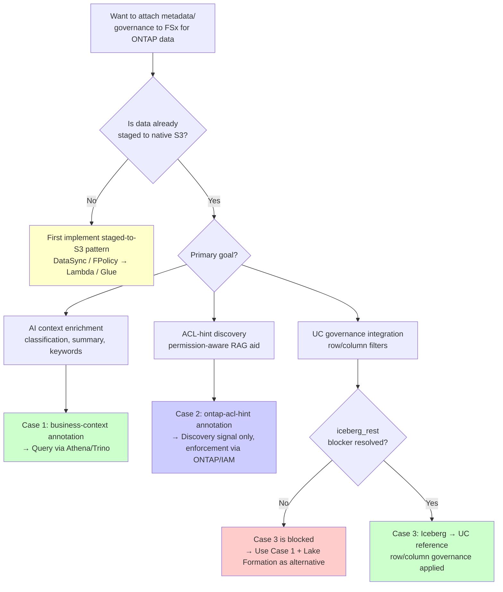

🌐 **English** | [日本語](../ja/s3-annotations-governance-evaluation.md)

# S3 Annotations / Metadata Evaluation: A Proposal for the Databricks UC × FSx for ONTAP S3 AP Governance Challenge

> **Status**: Initial evaluation (2026-06-18). Live-verified (native S3) + confirmed against official docs.
> **Evidence tier** per claim: **Public** (verifiable from public sources) / **Verified** (proven in this environment) / **Project-context** (internal assumption) / **Hypothesis**.
> **Test environment**: AWS ap-northeast-1, boto3 1.43.32 (AWS CLI 2.35.4 lacks the new commands; 2.35.7+ required).
> **Framing**: right-tool-for-the-job, not vendor-versus. Trade-offs stated symmetrically.

---

## Executive Summary

- **Target challenge**: Databricks UC does not support FSx for ONTAP S3 AP as External Location (session policy constraint). This evaluation assesses what S3 Annotations / Metadata can propose
- **S3 Annotations applicability**: Native Amazon S3 buckets only. Cannot apply directly to FSx for ONTAP S3 AP → staged-to-S3 pattern is prerequisite
- **Three proposals**: (1) AI context enrichment (attach Bedrock classification as annotation), (2) ACL-hint discovery signal (permission-aware RAG aid, not enforcement), (3) Governance application at Iceberg layer (pending UC blocker resolution)
- **Verification status**: Annotation attach/roundtrip is Verified (Case 1/2 proven). Scale-query via annotation table is supported by AWS native engines (Athena/Trino/Spark); only Databricks UC reference is blocked
- **Critical constraint**: Annotations are "discovery & context," not "access control enforcement." Permission-aware RAG requires dual-check (annotation discovery + ONTAP/IAM enforcement)
- **Recommended actions**: Case 1 (AI context annotation) can start immediately. Cases 2/3 require design + blocker resolution

## FAQ / Common Misconceptions

### Q1: Can S3 Annotations enforce access control?

**A**: **No.** Annotations are descriptive metadata attached to objects and do not enforce read authorization. Enforcement boundaries remain ONTAP file-level ACL + FPolicy + S3 AP access point policy + IAM.

> **Discovery vs enforcement**: Misinterpreting annotations as ACL substitutes creates a critical security gap. Annotations are mutable, so any principal with `s3:PutObjectAnnotation` permission can tamper with them. Use annotations only as discovery signals and always reference actual ONTAP/IAM ACLs for authorization decisions.

### Q2: Can annotations be attached directly to FSx for ONTAP S3 AP?

**A**: **No.** S3 Annotations / Metadata target only native general-purpose buckets managed by the Amazon S3 control plane. ONTAP S3 buckets are outside the S3 namespace (not listed by `aws s3 ls`), so annotation APIs cannot apply. The only valid path is staged-to-S3 (FSx for ONTAP → DataSync/FPolicy/Glue → native S3).

> **ONTAP S3 structural constraint**: This is a structural constraint of the ONTAP S3 protocol. ONTAP S3 provides an S3-compatible API, but Amazon S3 control-plane features (Event Notifications, S3 Metadata, Annotations) are AWS-managed service capabilities not applicable to ONTAP S3 endpoints.

### Q3: What's the difference between "attach" and "query"?

**A**: Two stages:
1. **attach**: `PutObjectAnnotation` API attaches annotation to an object. Works **standalone** without S3 Metadata configuration (proven in §4)
2. **query**: After enabling annotation table (`CreateBucketMetadataConfiguration` V2), query at scale via Athena/Trino/Spark through `s3tablescatalog`. Enabling requires backfill (minutes to hours) + IAM role setup

> For PoC, attach alone provides value (verify via per-object `GetObjectAnnotation`). Enable annotation tables only when scale-query is needed.

### Q4: Why does annotation table enablement have backfill delay?

**A**: The S3 Metadata service aggregates annotations from all objects in the bucket into an Iceberg table (on S3 Tables), which takes minutes to hours depending on object count. This is a one-time process; after enablement, updates are incremental.

### Q5: Are annotations free?

**A**: Annotation storage is charged as S3 storage (additional storage for annotation size). Annotation tables (S3 Metadata) incur S3 Tables storage + Athena/Trino scan charges. In large environments, staged S3 duplication cost is the primary cost driver.

> **Cost optimization**: For cost optimization, minimize annotation size (design compact JSON schemas, exclude unnecessary fields). Annotation table Athena scans benefit from partition pruning, so include `classification` or `source_volume` as top-level fields in your annotation schema to reduce scan costs.

### Q6: Can annotations be used for real-time use cases?

**A**: **Annotations are for cold path (discovery & context).** Backfill delay makes them unsuitable for real-time hot paths. For real-time requirements (connected vehicle telemetry, streaming quality inspection, etc.), use Structured Streaming / Lakeflow / RT OLAP infrastructure.

> **Hot/cold path separation**: Real-time quality decisions in manufacturing should use streaming infrastructure (Kafka → Spark Structured Streaming → ClickHouse), not annotations. Annotations are appropriate for post-hoc discovery, audit, and traceability.

> **Real-time OLAP**: For real-time quality alerts, use ClickHouse Materialized Views consuming directly from Kafka. Annotations enrich the cold path for post-hoc analysis and audit. When reading annotation tables from ClickHouse via the `iceberg()` table function (23.8+), limit to batch enrichment (periodic snapshot reference) and do not place in the hot path.

### Q7: How do annotations differ from UC tags / Lake Formation LF-Tags?

**A**: They are parallel, separate mechanisms:
- **S3 Annotations**: Object-level rich metadata (up to 1MB/annotation). Searchable from AWS native engines
- **UC tags**: Governance metadata within Databricks. Used for ABAC (attribute-based access control)
- **Lake Formation LF-Tags**: AWS-side column/row-level control. Applied to Athena/EMR via credential vending

Annotations **do not automatically integrate** with UC/LF governance tags. Annotation → tag mapping requires separate design.

> **Governance tag mapping**: To make annotations contribute to UC governance, a periodic batch pipeline mapping annotation classification results to UC tags is required. No automatic integration API currently exists.

## Selection Guide (Decision Flowchart)



> **Two-phase strategy**: Many organizations target Case 3 (UC integration), but the `iceberg_rest` blocker currently exists. A two-phase strategy is recommended: deliver value immediately with Case 1 while awaiting blocker resolution.

## OT/IT Security Considerations

### Annotation Write Permission Control

Annotations are mutable, making write permission control mandatory:

| Operation | Required Permission | Control Policy |
|-----------|-------------------|---------------|
| `PutObjectAnnotation` | `s3:PutObjectAnnotation` | Grant only to annotation pipeline dedicated IAM role. Never grant to human users |
| `DeleteObjectAnnotation` | `s3:DeleteObjectAnnotation` | Same. Only re-sync pipeline should delete |
| `GetObjectAnnotation` | `s3:GetObjectAnnotation` | Read can be granted to analytics roles / RAG pipelines |

> **Write-permission control**: If annotation write permissions are uncontrolled, ACL-hints (Case 2) can be tampered with or spoofed, undermining discovery signal reliability. In the S3 bucket policy, allow `s3:PutObjectAnnotation` only for specific IAM roles (annotation pipeline) and explicitly Deny for all other principals.

### FPolicy → Annotation Pipeline Security

```
FSx for ONTAP FPolicy (file change detection)
  ↓ VPC-internal communication (Lambda ENI)
Lambda (annotation generation/update)
  ↓ IAM Role (least privilege)
S3 PutObjectAnnotation
```

**Security requirements**:
- Lambda deployed in VPC (same subnet as FSx for ONTAP ENI)
- Lambda IAM role grants `s3:PutObjectAnnotation` only for target bucket/prefix
- FPolicy → Lambda event payload must not contain sensitive data (path + metadata only)

### Manufacturing Data Classification and Annotation Strategy

| Data Classification | Annotation Strategy | Example |
|-------------------|-------------------|---------|
| Public (aggregated metrics) | AI classification annotation (Case 1) | `{"classification": "public", "category": "aggregate_metrics"}` |
| Internal (raw sensor data) | ACL-hint + classification (Case 1+2) | `{"classification": "internal", "owner": "factory-a-team"}` |
| Confidential (quality inspection images) | ACL-hint + encryption flag (Case 2) | `{"classification": "confidential", "encryption": "SSE-KMS"}` |

> **Retention policy**: Include a `retention_days` field in manufacturing data annotation schema. Combined with S3 Lifecycle rules, this enables tracking regulatory requirements (e.g., quality record retention 7 years) at annotation level and detecting retention violations via Athena queries.

### VPC Endpoint Requirements

Annotation pipeline requires access to:
- FSx for ONTAP data LIF (within VPC)
- S3 VPC Gateway Endpoint (for annotation API calls)
- Bedrock VPC Endpoint (if AI classification in Case 1 is needed)

## Phased Implementation Steps

| Phase | Goal | Key Actions | Completion Criteria | Duration |
|-------|------|-------------|--------------------|---------| 
| **Phase 1**: Annotation attach PoC | Verify PutObjectAnnotation operation | Run §4 script with sample data, annotation attach/get roundtrip | Annotation attach and read success | 1 day |
| **Phase 2**: Annotation table enablement | Build scale-query infrastructure | `CreateBucketMetadataConfiguration` V2 + IAM role setup, wait for backfill | Athena query of annotation table succeeds | 2-3 days |
| **Phase 3**: AI classification pipeline | Automated Bedrock Vision → annotation | Lambda/Step Functions for image/document classification → `PutObjectAnnotation` automation | New staged files automatically annotated | 1-2 weeks |
| **Phase 4**: ACL-hint integration | Permission-aware discovery signal | FPolicy → Lambda → ACL-hint annotation attach, re-sync on permission change | ACL changes reflected in annotations, staleness < 15 min | 2-3 weeks |
| **Phase 5**: UC integration (post-blocker) | Apply Databricks governance | Confirm `iceberg_rest` blocker resolved → UC Iceberg reference → tag mapping | Row/column governance + annotation integration working in UC | TBD (blocker-dependent) |

> Phases 1-2 can proceed independently, but Phase 3+ requires integrating annotation generation steps into CI/CD pipelines. Including annotation schema versioning (`schema_version` field) from Phase 1 makes later schema evolution easier.

> **Schema evolution**: Define a migration strategy in Phase 1 for breaking annotation schema changes (field renames, type changes, etc.). Recommended pattern: (1) attach the new version under a separate name such as `business-context-v2`, (2) co-exist v1 and v2 during the migration window, (3) delete v1 after downstream pipelines complete migration to v2. The `schema_version` field enables version filtering in Athena queries.

> **Traceability design**: For automotive manufacturing traceability annotations, include the following fields to meet IATF 16949 requirements: `lot_id`, `serial_number`, `production_order`, `work_center`, `inspection_result`, `defect_category` (when applicable), `operator_shift`, `equipment_id`. This accelerates root-cause tracking (8D report creation) when quality issues arise.

## Verification Status Summary

| Item | Status | Verified | Evidence |
|------|--------|----------|----------|
| S3 Annotations attach/roundtrip (PutObjectAnnotation) | ✅ **Verified** | 2026-06-18 | §4 script execution, ap-northeast-1 |
| S3 Annotations — ACL-hint storage | ✅ **Verified** | 2026-06-18 | §4 Case 2 (owner/group/acl_hash roundtrip confirmed) |
| Direct annotation on FSx for ONTAP S3 AP | ❌ **Confirmed impossible** | 2026-06-18 | §3 structural constraint (ONTAP S3 outside S3 namespace) |
| Annotation table enablement + Athena query | ⚠️ **Path confirmed via official docs** | 2026-06 | AWS official docs confirmed. Not live-run due to backfill delay |
| Query from AWS native engines (Athena/Trino/Spark) | ✅ **Official support confirmed** | 2026-06 | Via `s3tablescatalog` (§6) |
| Databricks UC reference to annotation table | ❌ **Blocked** | 2026-06 | `iceberg_rest` connection not supported |
| AI classification pipeline (Bedrock → auto-annotate) | 🔲 **Design only** | — | Planned for Phase 3 |
| ACL-hint + permission-aware RAG authorization chain | 🔲 **Design only** | — | Planned for Phase 4 |
| Source change/deletion annotation re-sync | 🔲 **Design only** | — | FPolicy trigger design pending |
| Annotation schema versioning | 🔲 **Design only** | — | `schema_version` field included from Phase 1 |

---

## Related Documents

This evaluation is connected to:

- [FSx for ONTAP → Databricks UC Connection Guide](./fsx-ontap-to-databricks-unity-catalog-guide.md) — UC connection overview (annotations are a complementary layer)
- [DataSync: FSx for ONTAP → S3 Sync Guide](./datasync-to-s3-guide.md) — staged-to-S3 pattern implementation (prerequisite for annotations)
- [Kafka-ClickHouse-Unity Catalog Connectivity Guide](./kafka-clickhouse-unity-catalog-connectivity.md) — Streaming infrastructure separation (annotations are cold path)
- [Compatibility Matrix](./compatibility-matrix.md) — Platform-specific S3 Metadata / Annotations support status

---

## 1. Background: the recorded governance challenge

This repository already records the constraint between Databricks Unity Catalog (UC) and FSx for ONTAP S3 Access Points (S3 AP) (source: [`integrations/databricks/README.md`](../../integrations/databricks/README.md) "Support Confirmation, 2026-05" — **role-based** wording; case numbers and engineer names are withheld per steering policy).

- **UC External Locations do not support S3 AP as a storage target** (confirmed by Databricks Support, 2026-05; evidence tier: **Project-context recorded as Public**)
- **Root cause**: the **session policy** that Databricks generates during AssumeRole does not correctly handle S3 AP ARNs → External Location / External Table / External Volume creation is blocked
- The `access_point` field was **never released as GA** and was removed from docs. Partial success is "not a supported code path."
- Instance Profile + boto3 can read but **fully bypasses UC governance** (PoC only)

> There is **no record of a statement attributed to a "Databricks Product Manager"** by name/title. The technical core is recorded via the Support confirmation above. This evaluation considers what the newly announced S3 Annotations / S3 Metadata can propose for that challenge.

---

## 2. What S3 Annotations / S3 Metadata are (evidence tier: Public)

- [S3 Annotations](https://aws.amazon.com/about-aws/whats-new/2026/06/amazon-s3-annotations-business-context/) (AWS Summit NY 2026, 2026-06): attach custom metadata to S3 objects at scale. Up to 1GB per object (up to 1000 named annotations × 1MB each). JSON/XML/YAML/text. Mutable (change/delete without rewriting the object). Moves with the object on copy/replication; removed on delete ([AWS News Blog](https://aws.amazon.com/blogs/aws/amazon-s3-annotations-attach-rich-queryable-context-directly-to-your-objects/)).
- [S3 Metadata](https://aws.amazon.com/s3/features/metadata/): automatically exposes object metadata as read-only Apache Iceberg tables (journal / inventory / annotation). Queryable via Athena, Iceberg-compatible tools, and the S3 Tables MCP server. GA in several regions including ap-northeast-1.

> Source descriptions are paraphrased/summarized for licensing compliance.

---

## 3. Applicability finding (the crux of this evaluation)

| Question | Result | Basis |
|---|---|---|
| Bucket types S3 Metadata supports | **General-purpose Amazon S3 buckets only** (not directory/table/vector) | Official: [Metadata table limitations](https://docs.aws.amazon.com/AmazonS3/latest/userguide/metadata-tables-restrictions.html) (**Public**) |
| Does the S3 Metadata table include ACLs | **No** (Lifecycle/Object Lock/ACL/replication status excluded) | Same (**Public**) |
| Can FSx for ONTAP S3 (ONTAP S3 + S3 AP) be configured for S3 Metadata | **No** | Structural: ONTAP S3 buckets are outside the Amazon S3 control plane (not listed by `aws s3 ls`). S3 Metadata APIs target Amazon S3 buckets (**Verified**: ONTAP S3 buckets are absent from the S3 namespace in this environment) |
| Do annotations themselves (PutObjectAnnotation) work on native S3 | **Yes** | **Verified** (§4) |

**Conclusion**: S3 Annotations / Metadata **cannot apply directly to FSx for ONTAP S3 AP data**. They are usable only in the **staged-to-S3 pattern** (FSx for ONTAP → FPolicy/DataSync/Glue/EMR → native Amazon S3). This is both a constraint and the precondition for the proposals.

---

## 4. Verification results (2026-06-18, ap-northeast-1, evidence tier: Verified)

Reproduction script: [`integrations/iceberg-metadata-catalog/scripts/verify-s3-annotations.py`](../../integrations/iceberg-metadata-catalog/scripts/verify-s3-annotations.py) (creates a throwaway bucket and deletes all resources afterward).

| Step | Result |
|---|---|
| Create native S3 bucket | ✅ |
| Put object | ✅ |
| `put_object_annotation` (`business-context`: AI-classification JSON) | ✅ Case 1 demonstrated |
| `put_object_annotation` (`ontap-acl-hint`: owner/group/acl_hash/svm/volume/snapshot_id/allowed_principals JSON) | ✅ Case 2 demonstrated |
| `list_object_annotations` | ✅ count=2 |
| `get_object_annotation` round-trip (owner=svc_quality confirmed) | ✅ |
| Cleanup (annotations → object → bucket) | ✅ no residual billable resources |

Note: AWS CLI 2.35.4 lacks the S3 Metadata/Annotations commands (2.35.7+ required). boto3 1.43.32 has all APIs.

> **Verification scope (annotation table / query path)**: §7 #3 ("enable annotation table + query") was **not live-run in this session** because AWS docs confirm the following (capturing it from authoritative sources is preferable to leaving billable resources behind for an unreachable run):
> - **Enabling triggers backfilling that takes minutes to hours** ([official: Enabling annotation tables](https://docs.aws.amazon.com/AmazonS3/latest/userguide/metadata-tables-enable-disable-annotation-tables.html)) → "queryable" is not reachable in-session + backfill charges.
> - The annotation/metadata tables are created on **AWS-managed S3 Tables (table buckets)**. **AWS-native/open engines (Athena/EMR/Trino/Spark/ClickHouse) CAN query them via `s3tablescatalog` (officially supported, §6)**; only the Databricks UC reference (`iceberg_rest`) is blocked.
> - `CreateBucketMetadataConfiguration` **requires a journal table** (a journal table is created even if you only want annotations) + an **IAM role** assumed by the S3 metadata service (confirmed via API introspection).

---

## 5. Deep-dive of the three proposals

### Case 1: Annotation enrichment for `iceberg-metadata-catalog` (most natural, lowest risk)

The existing [iceberg-metadata-catalog](../../integrations/iceberg-metadata-catalog/) classifies unstructured files with Bedrock Vision and provides an Iceberg metadata catalog + OpenSearch vector search. S3 Annotations **complement (not replace)** it — a self-describing layer attached to the object that travels with it on copy/replication.

> **Two-step nature**: (1) Attaching annotations (`PutObjectAnnotation`) works **standalone**, without an S3 Metadata config (verified in §4). (2) **Querying at scale requires enabling the annotation table** (`CreateBucketMetadataConfiguration` V2 + annotation table). This needs an **IAM role** (assumed by the S3 metadata service), and the table is created in an **AWS-managed table bucket (S3 Tables)**. Enabling triggers **backfilling (minutes–hours)**, and querying requires **S3 Tables catalog federation (`s3tablescatalog`)** (see the shared dependency in §6).

```
FSx for ONTAP (images/docs)
  │ ① Take a consistent point-in-time via Snapshot / FlexClone (per FSx for ONTAP steering)
  ▼
Staged ingestion: FPolicy→Lambda→S3 / DataSync / Glue / EMR
  │  NOTE: SnapMirror-to-S3 is NOT supported on FSx for ONTAP (recorded in this repo)
  ▼
Amazon S3 (general-purpose bucket)
  │ ② put_object_annotation: business-context = {class, confidence, model, language, schema_version}
  │ ③ enable annotation table (S3 Metadata V2 + IAM role)
  ▼
S3 Metadata (annotation table, Iceberg, on S3 Tables)
  ├── query with Athena
  └── agent search via S3 Tables MCP server
```

| Aspect | Assessment |
|---|---|
| Pros | Classification context travels with the object (copy/replication). **Complements** the existing Iceberg catalog (OpenSearch search) by adding per-object self-description. AWS-native |
| Trade-offs | Requires staged S3 (not direct FSx). Annotation limits: 1MB each, 1000 per object. S3 Metadata is general-purpose buckets only. **Querying additionally requires enabling the annotation table (IAM role + table bucket)** |
| vs the existing catalog | Cross-cutting vector/full-text search and large aggregations: the existing iceberg-metadata-catalog (OpenSearch/Iceberg). Self-describing context that rides with the object on copy: annotations. The two are **complementary** |
| Verification | Annotation attach/round-trip: **Verified** (§4). Annotation-table enablement + Athena query: §7 #3 (not yet run; to be runbooked) |

### Case 2: A permission-aware "discovery signal" (with an important caveat)

Attach `owner` / `group` / `acl_hash` / `classification` / `snapshot_id` / `allowed_principals` as annotations, made searchable via S3 Metadata.

> ⚠️ **Non-negotiable precondition (per the FSx for ONTAP AI/RAG steering)**: **This is a "discovery signal", not "access-control enforcement".** Annotations are descriptive metadata attached to the object; they do not enforce read authorization. Permission-aware RAG must:
> - **Re-check authorization immediately before passing context to the LLM**, after vector/metadata filtering
> - Re-verify the user can actually access a cited source before showing its link
> - **Deny by default when permissions are unknown**
> - Keep the enforcement boundary at **ONTAP file-level ACL + FPolicy + S3 AP access point policy + IAM** (compensating controls)

> **ACL-hint derivation**: ONTAP is multi-protocol, so the hint must include the **security style**:
> - `security_style`: `ntfs` / `unix` / `mixed`
> - **NTFS style**: compute `acl_hash` from the NTFS Security Descriptor (normalized to SDDL). `owner` = owner SID/name, `group` = primary group
> - **UNIX/NFSv4 style**: compute from the NFSv4 ACE list (order-normalized) or mode bits
> - `acl_hash` is a SHA-256 of the **normalized** form (absorbs ACE ordering / formatting variance). It is a **change-detection fingerprint, not the ACL itself**
> - Source: ONTAP REST API (delta-triggered by FPolicy events). Detects permission changes and re-syncs the staged side

| Aspect | Assessment |
|---|---|
| Pros | Improves **discoverability** of already-authorized data. `acl_hash` can trigger "permission-change detection" |
| Trade-offs | No enforcement (double-check mandatory). A hint, not the ACL itself. Staleness risk on sync lag → detect via acl_hash and re-sync |
| Verification | Storing ACL hints in annotations: **Verified**. Authorization-chain integration: **not verified** (design only) |

### Case 3: Move governance to "the layer where it works" (Iceberg) — the direct take on the Databricks challenge

Rather than forcing S3 AP into UC, have **UC reference** the staged-S3 S3 Metadata Iceberg tables (and the business Iceberg tables) and apply governance in the layer where it works. This **structurally avoids** the S3 AP × session policy problem.

```
staged S3 ──▶ S3 Metadata (Iceberg) / business Iceberg tables
                     │
                     ├── Databricks UC (native reference) ── row/column governance (UC-internal engine)
                     └── Athena / other engines (via Iceberg REST)
```

> ⚠️ **Known constraints (recorded in this repo; Databricks Governance Architect findings)**:
> - **Important distinction**: S3 Metadata's **system tables** (journal/inventory/annotation) live on **AWS-managed S3 Tables (table buckets)**; UC reference requires S3 Tables catalog federation (`s3tablescatalog` / `iceberg_rest`) → that path is **blocked** (a double blocker). The **realistic UC-reference target is "user-created business Iceberg tables (on general-purpose S3)"**, which Case 3 targets first.
> - **Annotations are a parallel mechanism that does NOT integrate with UC tags/ABAC**. Annotations do not automatically contribute to UC governance (UC tags/ABAC must be set separately).
> - **UC Row Filters / Column Masks are NOT enforced on external engines** (Athena/EMR via Iceberg REST) (source: [`docs/en/governance-and-compliance.md`](./governance-and-compliance.md)). UC governance works for UC-internal engines but is not enforced cross-engine.
> - iceberg-metadata-catalog **Phase 4 (Databricks integration) is blocked** (`iceberg_rest` connection cannot be created; AWS/Databricks support in progress). Case 3's UC reference depends on clearing this blocker.

| Aspect | Assessment |
|---|---|
| Pros | Avoids the session policy / S3 AP constraint. Within UC, row/column governance + lineage work |
| Trade-offs | Requires staged S3 (loses zero-copy). No cross-engine enforcement. Depends on the `iceberg_rest` blocker |
| Verification | **Not verified** (awaiting Phase 4 blocker resolution, §7) |

---

## 5.5 Additional Considerations

The following considerations refine the three proposals across open table format / catalog federation, streaming, real-time OLAP, manufacturing scale, and governance.

- **Open table format / catalog federation**: S3 Metadata tables are queryable from Athena / EMR / Redshift / Trino / Spark via `s3tablescatalog` (Glue + Lake Formation). AWS-native query is supported; only Databricks UC reference is blocked.
- **Streaming / real-time**: annotations + S3 Metadata are off the real-time hot path due to backfilling (minutes–hours). Position them as a cold path (discovery/context); real-time (e.g., connected-vehicle telemetry) stays on streaming engines (Structured Streaming / Lakeflow / RT OLAP). Do not put annotations on the hot path.
- **Real-time OLAP / open engines**: because the annotation table is Iceberg, open engines such as Trino / Spark / ClickHouse can also read it (Iceberg-compatible endpoints), offering an alternative query engine that bypasses the Databricks UC block (right-tool-for-the-job, not a ranking). However, Iceberg / S3 Tables read support in ClickHouse/Trino is version/config-dependent and must be validated (§7).
- **Automotive/manufacturing scale**: at scale (many vehicles/parts/images), annotation limits (1MB each, 1000 per object) + backfill + staged-S3 duplication cost become material → include a retention/lifecycle policy. Manufacturing traceability (genealogy: `lot_id` / `serial` / `process_step` / `inspection_result`) is a strong annotation use case. Example:
  ```json
  { "schema": "mfg.traceability.v1", "lot_id": "L-2026-0042", "serial": "SN-000123",
    "process_step": "weld-03", "inspection_result": "pass", "ts": "2026-06-18T00:00:00Z" }
  ```
- **Governance (two planes)**: treat governance for the staged S3 / Iceberg path as two planes — (a) AWS-side Lake Formation (column/row-level controls + credential vending on S3 Tables, applied to Athena/EMR), (b) Databricks UC (`iceberg_rest` blocked). Annotations are a discovery signal; where enforcement is needed, map them to governed tags (LF LF-Tags / UC tags) (annotations alone do not govern). Also, since annotations are mutable, write access (`s3:PutObjectAnnotation` / `DeleteObjectAnnotation`) must be tightly least-privilege controlled; otherwise discovery signals such as ACL hints can be tampered/spoofed, undermining discovery trust. Case 2 thus assumes both "double-checking read authorization" and "controlling write access".

---

## 6. What it does NOT solve (honest assessment)

- S3 Annotations / Metadata **do not solve the core problem that UC cannot directly govern S3 AP**. They are "discovery/context", not "access-control enforcement", and they do not apply to FSx for ONTAP S3 AP.
- Zero-copy is not preserved (staged-to-S3 is the precondition), trading off the value of direct FSx for ONTAP access (ONTAP feature retention, multi-protocol).
- Annotations are not the ACL itself, so the permission-aware enforcement boundary remains on the ONTAP/IAM side.
- **Annotation freshness on source change**: annotations travel with the object on copy/replication, but the staged S3 object is a **derived copy** of the FSx for ONTAP source. When the FSx for ONTAP file is updated/deleted, the staged copy and its annotations must be **re-synced/invalidated** (source update → re-stage + re-annotate; source delete → remove staged + annotations). Use FPolicy change events as the re-sync trigger.
- **Shared substrate, divergent support for the query path**: the annotation/metadata tables live on AWS-managed S3 Tables and **share** the `s3tablescatalog` substrate (Glue Data Catalog + Lake Formation). However, support **diverges**:
>   - **AWS-native / open engines (Athena / EMR / Redshift / Trino / Spark / ClickHouse) CAN query them** via `s3tablescatalog` ([official: Querying metadata tables with AWS analytics services](https://docs.aws.amazon.com/AmazonS3/latest/userguide/metadata-tables-bucket-integration.html)). Lake Formation can also enforce column/row-level controls.
>   - **Databricks UC reference (the `iceberg_rest` connection) is blocked** (Case 3).
>   → Therefore **Case 1's query path (AWS-native) is NOT blocked**; only Case 3 (Databricks UC) is. The two share a substrate (`s3tablescatalog` / Iceberg) but **diverge in support**. Attaching works standalone; scale-querying rides on this substrate (backfill minutes–hours + LF/IAM setup are preconditions).

---

## 7. Validation items / open questions

| # | Item | Status |
|---|---|---|
| 1 | Confirm S3 Metadata cannot be configured on FSx for ONTAP S3 | ✅ Public + Verified (§3) |
| 2 | Annotation round-trip on native S3 | ✅ Verified (§4) |
| 3 | Enable annotation table + query (a step separate from attach). **AWS-native/open engines (Athena/EMR/Trino/Spark/ClickHouse) CAN query via `s3tablescatalog` (officially supported)**; enabling requires backfill (minutes–hours) + LF/IAM setup. Only the Databricks UC reference is blocked (§6) | ⚠️ Path confirmed via official docs (§4/§6). Live query not run this session due to backfill latency → captured as a runbook |
| 4 | Annotation-attachment pipeline at staged ingestion (FPolicy/Glue/Lambda placement) | 🔲 Design pending |
| 5 | Whether UC can stably reference S3 Metadata Iceberg tables (`iceberg_rest` blocker) | 🔲 Depends on Phase 4 |
| 6 | Integration of annotation ACL hints with the permission-aware RAG authorization chain | 🔲 Design pending (double-check mandatory since not enforced) |
| 7 | Annotation limits (1MB each, 1000 per object) vs manufacturing metadata volume | 🔲 Needs estimation |
| 8 | Re-sync/invalidation pipeline for annotations on source change/delete (FPolicy trigger) | 🔲 Design pending |
| 9 | Annotation schema versioning/evolution (establish the authoritative version via ingestion order/dedup) | 🔲 Design pending |
| 10 | Cost-dimension estimation (annotation storage / S3 Metadata table (S3 Tables) / Athena scan / ingestion compute / staged S3 duplication) | 🔲 Needs estimation |
| 11 | Manufacturing-traceability annotation schema (lot/serial/process/inspection) design + validation | 🔲 Design pending |
| 12 | Annotation → governed tag (LF LF-Tags / UC tags) mapping design | 🔲 Design pending |
| 13 | Reading the annotation table from open engines (Trino / ClickHouse) — validation | 🔲 Not verified |
| 14 | Control of annotation write access (least-privilege `s3:PutObjectAnnotation`/`Delete`) — prevent discovery-signal tampering | 🔲 Design pending |
| 15 | Structured (array) payload design when manufacturing genealogy exceeds 1000 events (mind the 1MB/annotation limit) | 🔲 Design pending |

---

## 8. Feedback to AWS / Databricks

Submission-ready drafts are stored **privately** (`.private/support-feedback/`, gitignored; the submitter adds case numbers):

- **To AWS**: feature request for S3 Metadata/Annotations support on FSx for ONTAP S3 / ONTAP S3 buckets (or Iceberg-compatible exposure of ONTAP S3 object metadata). The "general-purpose buckets only" restriction is a gap for FSx for ONTAP use cases.
- **To Databricks**: UC External Location S3 AP session-policy support; the `iceberg_rest` connection constraint; whether UC can reference S3 Metadata Iceberg tables; cross-engine enforcement of row/column governance on the staged-to-Iceberg path.

Public repository content **excludes case numbers and engineer names** (role-based wording only).

---

## 9. Selection guide (use-case-based / right-tool-for-the-job)

| Requirement | Recommended | Note |
|---|---|---|
| Add **discoverability / AI context** to FSx for ONTAP data, AWS-native | Case 1 (staged S3 + Annotations) | Zero-copy sacrificed; scale-query works via Athena/Trino/Spark/ClickHouse (`s3tablescatalog`), backfill/LF setup required (§6) |
| **Discovery aid** for permission-aware RAG | Case 2 (ACL-hint annotations) | Enforcement stays on ONTAP/IAM; double-check mandatory |
| **Governed analytics in Databricks** | Case 3 (move to Iceberg layer) | Requires `iceberg_rest` resolution; mind cross-engine non-enforcement |
| Direct FSx for ONTAP access + enforced governance (today) | Snowflake External Table / Athena + ONTAP ACL/FPolicy | Independent of S3 Annotations |

---

## References

- [Amazon S3 Annotations (What's New, 2026-06)](https://aws.amazon.com/about-aws/whats-new/2026/06/amazon-s3-annotations-business-context/)
- [Amazon S3 annotations (AWS News Blog)](https://aws.amazon.com/blogs/aws/amazon-s3-annotations-attach-rich-queryable-context-directly-to-your-objects/)
- [S3 Metadata table limitations and restrictions](https://docs.aws.amazon.com/AmazonS3/latest/userguide/metadata-tables-restrictions.html)
- [Amazon S3 Metadata (feature page)](https://aws.amazon.com/s3/features/metadata/)
- This repo: [Databricks integration README](../../integrations/databricks/README.md) / [governance-and-compliance](./governance-and-compliance.md) / [cross-repo-integration-strategy](./cross-repo-integration-strategy.md)
- Connectivity perspective (distinct from storage: Kafka/ClickHouse → UC paths/ports): [Kafka/ClickHouse → Unity Catalog connectivity](./kafka-clickhouse-unity-catalog-connectivity.md)

