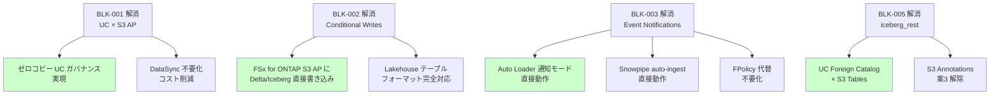
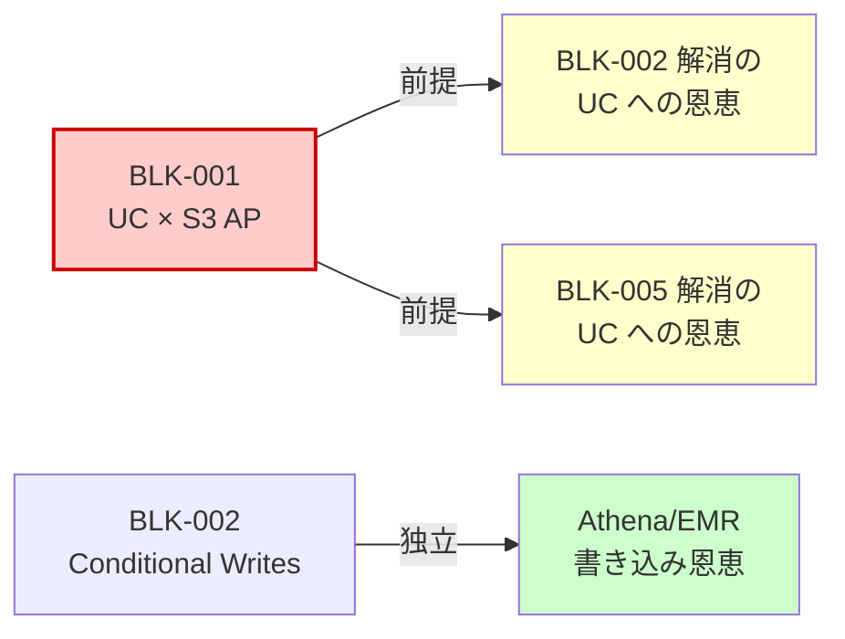

🌐 [English](../en/blocker-tracker.md) | **日本語**

# ブロッカー追跡ダッシュボード

> **目的**: FSx for ONTAP × Lakehouse 統合における既知のブロッカーと制約のステータスを一元管理する Living Document。
> **最終更新**: 2026-06-20
> **更新頻度**: 四半期ごと、または重大なステータス変更時に随時更新

---

## サマリ（全ブロッカー一覧）

| ID | ブロッカー | 影響範囲 | ステータス | 回避策有無 |
|:---:|---|---|:---:|:---:|
| BLK-001 | UC External Location が S3 AP を非サポート | Databricks UC ガバナンス | ❌ 未解決 | ✅ あり |
| BLK-002 | Conditional writes 非サポート | Delta/Iceberg/Hudi 書き込み | ❌ 未解決 | ✅ あり |
| BLK-003 | S3 Event Notifications 非サポート | Auto Loader 通知モード / Snowpipe | ❌ 未解決 | ✅ あり |
| BLK-004 | SnapMirror S3 が FSx for ONTAP で無効化 | ONTAP ネイティブ S3 レプリケーション | ❌ 未解決 | ✅ あり |
| BLK-005 | `iceberg_rest` Connection Type 未サポート | UC Foreign Catalog × S3 Tables | ❌ 未解決 | ⚠️ 部分的 |
| BLK-006 | ListObjectsV2 高レイテンシ（30-80x） | 大規模ディレクトリスキャン | ⚠️ 仕様 | ✅ あり |
| BLK-007 | NFS/SMB マウントが seccomp でブロック | Databricks からの直接ファイルシステムアクセス | ❌ 設計上不可 | ✅ あり |
| BLK-008 | Lake Formation 列レベル制御が S3 Tables 非対応 | S3 Tables フェデレーテッドカタログのガバナンス | ❌ 未解決 | ⚠️ テーブルレベルのみ |

---

## 詳細

### BLK-001: UC External Location が S3 AP を非サポート

| 属性 | 値 |
|------|---|
| **影響サービス** | Databricks Unity Catalog |
| **影響機能** | External Location / External Table / External Volume / UC ガバナンス全般 |
| **根本原因** | Databricks の AssumeRole 時にセッションポリシーが S3 AP ARN を正しく解釈しない |
| **確認日** | 2026-05-26（Databricks Support 確認; ケースクローズ — サポートティア不足により資格なし） |
| **ステータス** | ❌ 未解決 — サポートケースクローズ（資格なし）; プラットフォームレベルでの解決待ち |
| **解除条件** | Databricks プラットフォームが S3 AP を UC External Location として GA サポート |
| **影響度** | **Critical** — UC ガバナンス（lineage, tags, masks, row filters）を FSx for ONTAP データに直接適用できない |

**回避策（推奨パス）**:
1. **DataSync → 標準 S3 → UC External Location** — 推奨。フルガバナンス適用可能。[詳細](./datasync-to-s3-guide.md)
2. **Kafka → Structured Streaming → UC Delta** — リアルタイム要件時。[詳細](./kafka-clickhouse-unity-catalog-connectivity.md)
3. **Glue/EMR ETL → 標準 S3 → UC** — バッチ変換時

**エビデンス**: [integrations/databricks/README.md](../../integrations/databricks/README.md)

> **影響の限定** (Databricks Governance Architect lens): このブロッカーは「ゼロコピーのガバナンス適用」をブロックしますが、DataSync パスで S3 にコピーすれば UC のフルガバナンスは適用可能です。コピーコスト（~$27/月/TB）対ガバナンス価値のトレードオフで判断してください。

---

### BLK-002: Conditional Writes 非サポート

| 属性 | 値 |
|------|---|
| **影響サービス** | FSx for ONTAP S3 Access Points |
| **影響機能** | Delta Lake / Iceberg / Hudi のトランザクショナル書き込み |
| **根本原因** | FSx for ONTAP S3 AP が `If-None-Match` ヘッダーを実装していない（HTTP 501 返却） |
| **確認日** | 2026-05-22（AWS Support 確認、プロダクトレベルの制限） |
| **ステータス** | ❌ 未解決 — Feature Request 提出済み |
| **解除条件** | AWS が FSx for ONTAP S3 AP に conditional writes を実装（S3 ネイティブ 2024-08 parity） |
| **影響度** | **High** — Lakehouse テーブルフォーマットの書き込みが不可。読み取りは影響なし |

**回避策**:
1. **読み取り専用で利用** — Athena / Glue / Snowflake からの読み取りは正常動作
2. **書き込み先は標準 S3** — DataSync → 標準 S3 → Delta/Iceberg 書き込み
3. **Iceberg + 外部カタログ（単一ライター）** — Glue Catalog がポインタを管理するため、単一ライター構成では理論的に書き込み可能（実験的）。⚠️ **並行書き込みではデータ破損リスクがあるため本番利用禁止**

**エビデンス**: [互換性マトリクス](./compatibility-matrix.md)（Lakehouse テーブルフォーマットへの影響セクション）

> **S3 parity ロードマップ** (FSx for ONTAP Architect lens): S3 ネイティブに conditional writes が追加されたのは 2024-08 です。FSx for ONTAP S3 AP への追加は AWS の開発ロードマップ次第ですが、parity 達成は合理的な期待です。タイムラインは未公開。

---

### BLK-003: S3 Event Notifications 非サポート

| 属性 | 値 |
|------|---|
| **影響サービス** | FSx for ONTAP S3 Access Points |
| **影響機能** | Databricks Auto Loader（通知モード）、Snowflake Snowpipe auto-ingest、EventBridge 連携 |
| **根本原因** | FSx for ONTAP S3 AP が S3 Event Notifications（s3:ObjectCreated 等）を発行しない |
| **確認日** | 2026-05-22（API ドキュメント + 実環境検証） |
| **ステータス** | ❌ 未解決 — Feature Request 提出済み |
| **解除条件** | AWS が FSx for ONTAP S3 AP に Event Notifications を実装 |
| **影響度** | **Medium** — イベント駆動パイプラインが直接構築できない。スケジュールベースの代替は可能 |

**回避策**:
1. **FPolicy → Lambda → S3** — FSx for ONTAP ネイティブのファイルイベント検知で代替。[詳細](./datasync-to-s3-guide.md)（FPolicy 代替パターンセクション）
2. **DataSync → 標準 S3** — 標準 S3 に同期後、Event Notifications を利用
3. **Auto Loader リスティングモード** — ディレクトリスキャンで検知（ListObjectsV2 レイテンシの影響あり）
4. **スケジュールポーリング** — EventBridge schedule で定期クロール

> **FPolicy の運用複雑性** (Manufacturing Edge Data Architect lens): FPolicy → Lambda 代替は技術的に有効ですが、運用複雑性が高い（Lambda 同時実行制限、DLQ、バックプレッシャー）。DataSync スケジュール（rate(5 minutes)）で許容できる場合はそちらを優先してください。

---

### BLK-004: SnapMirror S3 が FSx for ONTAP で無効化

| 属性 | 値 |
|------|---|
| **影響サービス** | FSx for ONTAP |
| **影響機能** | ONTAP S3 バケット → AWS S3 のネイティブレプリケーション |
| **根本原因** | FSx for ONTAP がサービスレベルで SnapMirror S3 コマンドをブロック |
| **確認日** | 2026-05-26（CLI + REST API 両方で確認） |
| **ステータス** | ❌ 未解決 — Feature Request 提出済み |
| **解除条件** | AWS が FSx for ONTAP で SnapMirror S3 を有効化 |
| **影響度** | **Medium** — DataSync で代替可能だが、ONTAP ネイティブの効率的なレプリケーションが使えない |

**回避策**:
- **AWS DataSync** — FSx for ONTAP NFS → S3 の唯一の検証済みマネージド同期メカニズム。[詳細](./datasync-to-s3-guide.md)

**エビデンス**: [verification-pack/snapmirror-s3/evidence/2026-05-26/evidence-record.yaml](../../verification-pack/snapmirror-s3/evidence/2026-05-26/evidence-record.yaml)

> **オンプレミスとの差異** (FSx for ONTAP Architect lens): オンプレミス ONTAP では SnapMirror S3 は利用可能です（9.10.1+）。FSx for ONTAP 固有の制限であり、オンプレミス→クラウドの移行計画では注意が必要です。

---

### BLK-005: `iceberg_rest` Connection Type 未サポート

| 属性 | 値 |
|------|---|
| **影響サービス** | Databricks Unity Catalog |
| **影響機能** | UC Foreign Catalog × S3 Tables Iceberg REST endpoint |
| **根本原因** | Databricks SQL Warehouse が `iceberg_rest` を Connection Type として認識しない |
| **確認日** | 2026-05-31（`CONNECTION_TYPE_NOT_SUPPORTED` エラー確認; ケースクローズ — サポートティア不足により資格なし） |
| **ステータス** | ❌ 未解決 — サポートケースクローズ（資格なし）; プラットフォームレベルでの解決待ち |
| **解除条件** | Databricks が `iceberg_rest` を UC Connection Type として GA サポート |
| **影響度** | **Medium** — S3 Tables / S3 Metadata の Iceberg テーブルを UC から直接参照できない |

**回避策**:
1. **Databricks Spark クラスターで手動カタログ設定** — クラスタースコープで `spark.sql.catalog.s3tables` を設定（UC ガバナンス外）
2. **Glue HMS Federation（推奨）** — `CREATE CONNECTION TYPE glue` で Glue Federated Catalog 経由で S3 Tables Iceberg テーブルを Foreign Catalog として参照。UC ガバナンス適用可能。[検証ガイド](../../integrations/iceberg-metadata-catalog/databricks/foreign-iceberg-execution-guide.md)
3. **Athena / EMR 経由でクエリ** — AWS ネイティブエンジンは `s3tablescatalog` 経由で正常動作
4. **通常 S3 上の Iceberg テーブル** — S3 Tables を使わず通常 S3 バケットに Iceberg テーブルを作成し、Glue Catalog 経由で UC に公開（最も確実）

**エビデンス**: [互換性マトリクス](./compatibility-matrix.md)（S3 Tables Iceberg REST Endpoint セクション）

> **二重ブロッカー** (Databricks Governance Architect lens): S3 Annotations 評価の案3（annotation テーブルの UC 参照）は BLK-001 + BLK-005 の二重ブロッカーにより完全にブロックされています。案1（AWS ネイティブエンジンでのクエリ）は影響を受けません。

---

### BLK-006: ListObjectsV2 高レイテンシ（30-80x）

| 属性 | 値 |
|------|---|
| **影響サービス** | FSx for ONTAP S3 Access Points |
| **影響機能** | ディレクトリスキャン、Glue Crawler、Auto Loader リスティングモード |
| **根本原因** | FSx for ONTAP S3 AP のプロダクトレベルのパフォーマンス特性 |
| **確認日** | 2026-05-22（AWS Support 確認） |
| **ステータス** | ⚠️ 仕様（改善要望提出済みだが、現時点ではプロダクト特性として確認） |
| **解除条件** | AWS による ListObjectsV2 パフォーマンス改善 |
| **影響度** | **Low-Medium** — ワークアラウンドで対処可能。大規模ディレクトリでのみ顕在化 |

**回避策**:
1. **ファイル統合** — 小ファイルを ≥ 128 MB に統合して ListObjects 呼び出し回数を削減
2. **パーティション構造** — `year=YYYY/month=MM/day=DD/` で整理し、スキャン範囲を限定
3. **Glue Catalog 参照** — ファイル一覧ではなく Glue Catalog のメタデータを参照するクエリパスを使用
4. **Auto Loader 通知モード** — DataSync → 標準 S3 経由で通知モードを利用（ListObjects 不要）

---

### BLK-007: NFS/SMB マウントが seccomp でブロック

| 属性 | 値 |
|------|---|
| **影響サービス** | Databricks Runtime |
| **影響機能** | Databricks クラスターからの NFS/SMB/FUSE マウント |
| **根本原因** | Databricks ランタイムの seccomp プロファイルが `mount` / `umount` システムコールを禁止 |
| **確認日** | 2026-05（設計上の制約として確認） |
| **ステータス** | ❌ 設計上不可 — セキュリティ設計であり、解除見込みなし |
| **解除条件** | なし（セキュリティ設計として意図的） |
| **影響度** | **N/A — Architectural** — セキュリティ設計として意図的。解除見込みなし。代替パスが確立されており実用上の影響は限定的 |

**回避策**:
- BLK-001 と同じ代替パスを使用（DataSync / Kafka / Glue/EMR 経由）

---

### BLK-008: Lake Formation 列レベル制御が S3 Tables 非対応

| 属性 | 値 |
|------|---|
| **影響サービス** | AWS Lake Formation × S3 Tables |
| **影響機能** | S3 Tables フェデレーテッドカタログでの列レベル権限 |
| **根本原因** | Lake Formation が S3 Tables カタログに対して列レベル（Column-level）の制御を未実装 |
| **確認日** | 2026-05（テーブルレベルのみ適用されることを確認） |
| **ステータス** | ❌ 未解決 — Feature Request 提出予定 |
| **解除条件** | AWS が S3 Tables フェデレーテッドカタログで Lake Formation 列レベル権限をサポート |
| **影響度** | **Low** — テーブルレベル制御は動作。列レベルが必要な場合は通常の Glue Catalog テーブルを使用 |

**回避策**:
- 列レベル制御が必要なテーブルは通常の Glue Catalog テーブル（汎用 S3 バケット上）に配置し、Lake Formation 列マスクを適用

---

## ブロッカー解消時の影響マップ

> **最大インパクト**: BLK-001 と BLK-002 が同時に解消されれば、FSx for ONTAP S3 AP が Databricks UC のフル機能（読み取り + 書き込み + ガバナンス）を直接サポートする構成が実現し、DataSync パスが「必須」から「オプション」に変わります。

---

## 機能要望ステータス

| ベンダー | 要望内容 | 提出日 | ステータス |
|---------|---------|--------|-----------|
| Databricks | UC External Location の S3 AP サポート | 2026-05 | クローズ（サポートティア不足により資格なし） |
| Databricks | `iceberg_rest` Connection Type サポート | 2026-05 | クローズ（サポートティア不足により資格なし） |
| AWS | FSx for ONTAP S3 AP に conditional writes 追加 | 2026-05 | 提出済み・未回答 |
| AWS | FSx for ONTAP S3 AP に Event Notifications 追加 | 2026-05 | 提出済み・未回答 |
| AWS | FSx for ONTAP に SnapMirror S3 有効化 | 2026-05 | 提出済み・未回答 |
| AWS | ListObjectsV2 レイテンシ改善 | 2026-05 | 提出済み・プロダクト特性として確認 |
| AWS | S3 Tables × Lake Formation 列レベル制御 | 2026-05 | 提出予定 |

> ケース番号・担当者名は非公開（ロールベース表記のみ。ステアリング準拠）。

---

## 四半期レビュースケジュール

| レビュー日 | 確認事項 |
|-----------|---------|
| 2026-09（Q3） | Databricks リリースノート確認、AWS re:Invent 前の GA 確認 |
| 2026-12（Q4） | re:Invent 発表確認、2027 計画への反映 |
| 2027-03（Q1） | DAIS 2027 向け事前確認 |

---

## ブロッカー間の前提条件チェーン

一部のブロッカーは解消の順序に依存関係があります:

| シナリオ | 結果 |
|---------|------|
| BLK-002 のみ解消（BLK-001 未解消） | Athena/EMR/Glue から FSx for ONTAP S3 AP に直接 Delta/Iceberg 書き込み可能。**ただし Databricks UC からの恩恵はなし**（BLK-001 がゲート） |
| BLK-001 のみ解消（BLK-002 未解消） | UC External Location として S3 AP を登録可能 → **読み取り + UC ガバナンス**が実現。書き込みは引き続き標準 S3 経由 |
| BLK-001 + BLK-002 同時解消 | **フル機能**: ゼロコピー + UC ガバナンス + Delta/Iceberg 書き込み。DataSync が「必須」→「オプション」に |
| BLK-003 のみ解消（BLK-001 未解消） | Auto Loader 通知モードが FSx for ONTAP S3 AP で動作。ただし UC ガバナンスは引き続き標準 S3 経由が必要 |
| BLK-005 のみ解消（BLK-001 未解消） | UC SQL Warehouse から S3 Tables/annotation テーブルをクエリ可能。FSx for ONTAP S3 AP 直接接続は別問題（BLK-001） |

> **キーインサイト**: BLK-001（UC × S3 AP）は他の複数ブロッカーの**ゲートブロッカー**です。BLK-001 が未解消の限り、BLK-002/003/005 の解消は Databricks UC パスには直接恩恵をもたらしません（Athena/EMR など UC 外パスには恩恵あり）。

---

## 解消シグナルの監視方法

四半期レビュー時に以下のソースを確認してください:

| ブロッカー | 監視ソース | 監視キーワード |
|-----------|-----------|-------------|
| BLK-001 | [Databricks Release Notes](https://docs.databricks.com/en/release-notes/index.html) | "External Location", "S3 Access Point", "access_point" |
| BLK-001 | [Databricks Changelog](https://docs.databricks.com/en/release-notes/product/index.html) | "storage", "External Location" |
| BLK-002 | [AWS What's New](https://aws.amazon.com/about-aws/whats-new/) | "FSx for ONTAP", "conditional writes", "If-None-Match" |
| BLK-003 | [AWS What's New](https://aws.amazon.com/about-aws/whats-new/) | "FSx for ONTAP", "Event Notifications", "S3 events" |
| BLK-004 | [AWS What's New](https://aws.amazon.com/about-aws/whats-new/) | "FSx for ONTAP", "SnapMirror S3" |
| BLK-005 | [Databricks Release Notes](https://docs.databricks.com/en/release-notes/index.html) | "iceberg_rest", "Foreign Catalog", "S3 Tables" |
| BLK-006 | [AWS What's New](https://aws.amazon.com/about-aws/whats-new/) | "FSx for ONTAP", "performance", "ListObjects" |
| BLK-008 | [AWS What's New](https://aws.amazon.com/about-aws/whats-new/) | "Lake Formation", "S3 Tables", "column-level" |

> **自動化のヒント**: GitHub Actions で上記 RSS フィードを定期チェックし、キーワードヒット時に Issue を自動作成するパイプラインを構築可能です。

---

## 関連ドキュメント

- [UC 接続総合ガイド](./fsx-ontap-to-databricks-unity-catalog-guide.md) — ブロッカーの影響を受けるパス設計
- [互換性マトリクス](./compatibility-matrix.md) — 制約の技術詳細
- [DataSync → S3 ガイド](./datasync-to-s3-guide.md) — BLK-001/002/003 の主要回避策
- [S3 Annotations 評価](./s3-annotations-governance-evaluation.md) — BLK-005 の影響を受ける案3
- [読み順ガイド](./reading-path-guide.md) — ドキュメント全体のナビゲーション
