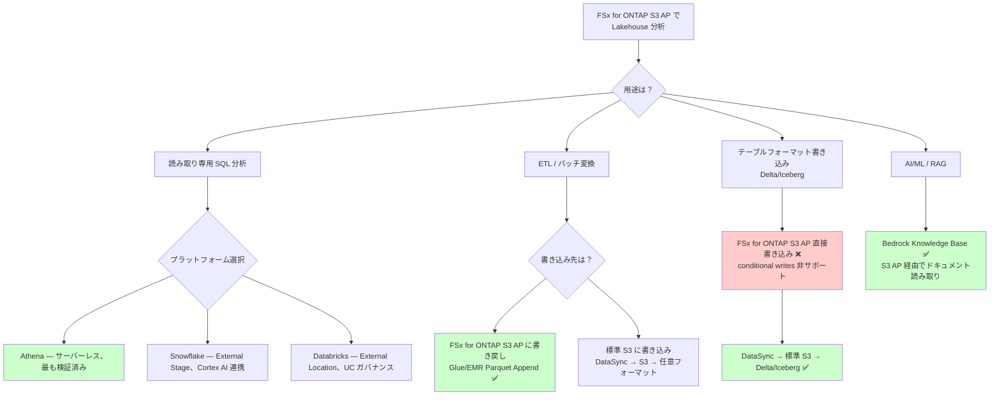

# 互換性マトリクス

> 🌐 [English](../en/compatibility-matrix.md) | **日本語**

## エグゼクティブサマリー

- **目的**: FSx for ONTAP S3 Access Points と各 Lakehouse プラットフォーム/フォーマットの検証済み互換性を定義し、読み取り専用分析から書き込みパスまでの対応状況を明確化
- **主要知見**: 読み取り専用分析（Athena/Glue/EMR/Snowflake/Bedrock）は検証済みで本番利用可能。書き込みパス（Delta Lake/Iceberg）は条件付き書き込み非サポートにより制限あり
- **重要制約**: conditional writes（`If-None-Match`）非サポート、S3 Event Notifications 非サポート、ListObjectsV2 高レイテンシ（30-80x）、SnapMirror S3 非対応
- **推奨アプローチ**: 読み取り専用ユースケースは FSx for ONTAP S3 AP 直接パスで実装。書き込みが必要な場合は DataSync → 標準 S3 パスを使用
- **検証レベル**: API 検証 → 機能検証 → セキュリティ検証 → 本番検証の 4 段階。現在ほとんどのプラットフォームが機能検証済み

## FAQ / よくある誤解

### Q1: Delta Lake の書き込みが動作しないのはなぜか？

**A**: Delta Lake のコミットプロトコルは `_delta_log/` ディレクトリ内でのアトミック rename を必要としますが、S3 API にはネイティブの rename 操作がありません。CopyObject + DeleteObject での回避は可能ですが、条件付き書き込み（`If-None-Match`）も非サポートのため、**同時書き込み時のトランザクション整合性を保証できません**。本番書き込みには使用しないでください。

> **S3 互換ストレージの共通課題** (S3 Compatibility / Storage Specialist lens): この制約は FSx for ONTAP S3 AP 固有ではなく、S3 互換ストレージ全般に存在する課題です。標準 S3 では conditional writes（2024年8月提供開始）で解決されましたが、FSx for ONTAP S3 AP にはまだ提供されていません。

> **UniForm の読み取りパス** (Iceberg / Open Table Specialist lens): Delta Lake UniForm（`delta.universalFormat`）は Delta と Iceberg の両方のメタデータを生成します。Iceberg メタデータパスは外部カタログ（Glue）経由でポインタを管理するため、FSx for ONTAP S3 AP 上でも Iceberg 読み取りパスが機能する可能性があります。ただし、UniForm の書き込みコミット自体は Delta プロトコルに依存するため、FSx for ONTAP S3 AP への直接書き込みは依然として非サポートです。

### Q2: Presigned URL は使えるか？

**A**: 技術的には動作します（クライアント側の署名計算であり、サーバーは通常のリクエストとして処理）。ただし AWS は公式に「非サポート」としており、安定性を保証していません。**本番環境では依存しないでください。**

### Q3: SnapMirror S3 について教えてください

**A**: SnapMirror S3（ONTAP S3 バケット → AWS S3 レプリケーション）は FSx for ONTAP で**意図的に無効化**されています（2026年5月 AWS サポート確認）。FSx for ONTAP から標準 S3 への同期には AWS DataSync を使用してください。詳細: [DataSync ガイド](./datasync-to-s3-guide.md)

### Q4: ListObjectsV2 が遅いのはなぜか？

**A**: FSx for ONTAP S3 AP の ListObjectsV2 は標準 S3 より 30-80 倍高いレイテンシを示します。これは AWS サポートが**プロダクトレベルのパフォーマンス特性**と確認しています（環境問題ではない）。大量のファイルリスティングが必要なワークロードでは、ファイルを ≥ 128 MB に統合し、パーティション構造で整理してください。

> **小ファイル統合** (Data Lake Optimization lens): 製造データは小ファイル（センサーログ等）が大量に生成される傾向があります。FSx for ONTAP S3 AP 経由での分析前に、Glue ETL または EMR で Parquet ≥ 128 MB に統合する前処理を推奨します。

### Q5: 本番利用には Multi-AZ が必要か？

**A**: **本番環境では Multi-AZ を強く推奨**します。Multi-AZ はセカンダリファイルサーバーへの同期レプリケーションを提供し、AZ 障害時の自動フェイルオーバーを実現します。ただし、書き込み帯域幅が 2 倍消費されることに注意してください（Multi-AZ レプリケーション分）。

### Q6: API/機能/セキュリティ/本番の検証レベルの違いは？

**A**:
- **API 検証**: S3 API 操作が成功する（最低限の動作確認）
- **機能検証**: エンドツーエンドのワークフローが成功（データアップロード → カタログ登録 → クエリ → 正しい結果）
- **セキュリティ検証**: IAM + AP ポリシー + ファイルシステム権限 + CloudTrail すべて確認
- **本番検証**: 同時クエリ、障害復旧、コスト検証、SLA 準拠を確認

> **本番前セキュリティ検証** (Security Verification lens): 多くの PoC は API/機能検証で止まりますが、本番投入前にセキュリティ検証（ネガティブテスト含む）を必ず実施してください。特にクロスアカウントアクセス拒否と VPC-origin AP の分離確認は必須です。

### Q7: フォーマットを混在させて良いか（Parquet/Delta/Iceberg/Hudi）？

**A**: 同一ボリューム/プレフィックス内でのフォーマット混在は技術的に可能ですが、管理複雑性が増します。推奨はプレフィックスまたはボリューム単位でフォーマットを分離し、Glue Catalog で適切にカタログ化することです。

## 選択ガイド（プラットフォーム/フォーマット選定フローチャート）



> **UC ガバナンスパス** (Databricks Governance Architect lens): Databricks を選択する場合、UC External Location は S3 AP を直接サポートしません（session policy 制約）。Instance Profile 経由で読み取りは可能ですが UC ガバナンスをバイパスします。UC ガバナンス付きの分析には DataSync → 標準 S3 → UC External Location パスを使用してください。

## OT/IT セキュリティ考慮事項

### 二層認可モデル

FSx for ONTAP S3 AP は**二層認可**を実装します:

| 層 | 制御 | 適用タイミング |
|---|------|-------------|
| **Layer 1: IAM + AP ポリシー** | S3 API レベルのアクセス制御 | S3 リクエスト受信時 |
| **Layer 2: ファイルシステム権限** | ONTAP UNIX/NTFS ACL | ファイルシステムアクセス時 |

**両方のチェックに合格しなければアクセスは許可されません。** これはネイティブ S3 より強い認可モデルです。

### VPC-Origin vs Internet-Origin AP のセキュリティ

| 属性 | VPC-Origin | Internet-Origin |
|------|-----------|----------------|
| ネットワーク分離 | 指定 VPC からのみアクセス可能 | 任意のネットワークから（IAM 認証で制御） |
| 推奨環境 | 本番環境、機密データ | 開発環境、Athena/Glue（VPC 外マネージドサービス） |
| Athena 対応 | ❌ Athena は VPC 外から接続 | ✅ Athena は Internet-Origin のみ |

> **VPC-Origin AP の分離** (OT Network Security Specialist lens): 製造データなど機密性の高いデータには VPC-Origin AP を使用し、EMR/Lambda 等 VPC 内サービスからのみアクセスさせてください。Athena アクセスが必要な場合は、Internet-Origin AP + IAM + AP ポリシーの三重制御で代替します。

### 製造環境向けセキュリティ設計

```
OT ネットワーク（工場）
  └── Edge Gateway → NFS/SMB → FSx for ONTAP（IT VPC 内）

IT VPC:
  ├── FSx for ONTAP（Multi-AZ）
  │     ├── VPC-Origin S3 AP → EMR/Lambda（機密データ）
  │     └── Internet-Origin S3 AP → Athena/Glue（集計データ）
  ├── VPC Endpoint（S3 Gateway）
  └── CloudTrail + VPC Flow Logs
```

### CloudTrail 監査パターン

| イベント | 監査対象 | 検出目的 |
|--------|---------|---------|
| `GetObject` via AP | 誰がどのファイルを読んだか | 不正アクセス検出 |
| `PutObject` via AP | 誰が書き込んだか | データ改ざん検出 |
| `PutAccessPointPolicy` | AP ポリシー変更 | 権限昇格検出 |
| `DeleteObject` via AP | 誰が削除したか | データ消失追跡 |

> **監査ログの識別性** (Audit / Observability lens): S3 データイベントの CloudTrail ログは AP ARN ベースで記録されます。複数 AP を運用する場合、AP 名に用途（`analytics-readonly`、`etl-readwrite`）を含め、ログ分析時の識別を容易にしてください。

### 認証情報ローテーション

| コンポーネント | 認証方式 | ローテーション方針 |
|------------|---------|----------------|
| Athena → AP | IAM Role（サービスリンク） | 自動（STS 一時認証情報） |
| Glue → AP | IAM Role | 自動 |
| Databricks → AP | Instance Profile / Storage Credential | 90日以内のキーローテーション推奨 |
| Snowflake → AP | Storage Integration IAM Role | 自動（STS） |

## 段階的導入ステップ

| フェーズ | 目標 | 主要アクション | 完了基準 | 期間目安 |
|---------|------|-------------|---------|---------|
| **Phase 1**: PoC 読み取り専用 | 単一プラットフォームで基本動作確認 | Athena + Parquet で S3 AP 経由クエリ成功 | エンドツーエンド読み取りクエリ成功 | 1-2日 |
| **Phase 2**: マルチプラットフォーム読み取り | 複数プラットフォーム対応確認 | Glue/EMR/Snowflake/Bedrock での読み取り検証 | 全プラットフォーム API/機能検証完了 | 3-5日 |
| **Phase 3**: 書き込みパターン検証 | DataSync 連携確認 | DataSync → S3 → Delta/Iceberg 書き込みテスト | 書き込みパスが正常動作、増分同期確認 | 1週間 |
| **Phase 4**: セキュリティ強化 | 最小権限/ネガティブテスト | IAM ポリシー最小化、ネガティブテスト全パス、CloudTrail 有効化 | セキュリティ検証レベル達成 | 1-2週間 |
| **Phase 5**: 本番検証 | パフォーマンス/DR/コスト確認 | 同時クエリベンチマーク、DR フェイルオーバーテスト、月次コスト検証 | 本番検証レベル達成、SLA 準拠確認 | 2-4週間 |

> **本番投入ゲート** (Reliability / QA lens): Phase 4 → Phase 5 の移行前に、ネガティブテストマトリクス（NEG-001 〜 NEG-010）を全項目パスさせてください。1 項目でも Critical レベルで失敗する場合、本番投入をブロックしてください。

> **スループット最適化** (Performance / Throughput Architect lens): Phase 5 では FSx for ONTAP プロビジョンドスループットとワークロード実測値の乖離を確認してください。過剰プロビジョニング（利用率 < 30%）の場合はスループット削減、不足（利用率 > 80% が継続）の場合は増強を検討します。CloudWatch の `ThroughputUtilization` メトリクスで判断できます。

## 関連ドキュメント

- [FSx for ONTAP → Databricks UC 接続総合ガイド](./fsxn-to-databricks-unity-catalog-guide.md) — UC 統合の全体像
- [DataSync: FSx for ONTAP → S3 同期ガイド](./datasync-to-s3-guide.md) — 書き込みパスに必要な DataSync 設定
- [S3 Annotations ガバナンス評価](./s3-annotations-governance-evaluation.md) — メタデータ強化の評価
- [Kafka-ClickHouse-Unity Catalog 接続ガイド](./kafka-clickhouse-unity-catalog-connectivity.md) — ストリーミング統合
- [リカバリセマンティクス](./recovery-semantics.md) — Snapshot vs Lakehouse Time Travel 比較

## クイックスタート（最速で分析を開始する3ステップ）

最も検証済みで低リスクなパス: **Athena + Parquet 読み取り**

```bash
# Step 1: FSx for ONTAP S3 Access Point 作成（既存の場合はスキップ）
aws fsx create-and-attach-s3-access-point \
  --name analytics-reader \
  --type ONTAP \
  --ontap-configuration '{
    "VolumeId": "<VOL_ID>",
    "FileSystemIdentity": {"Type": "UNIX", "UnixUser": {"Name": "analytics_reader"}}
  }'

# Step 2: Glue Crawler でカタログ登録
aws glue create-crawler --name fsxn-parquet-crawler \
  --role GlueCrawlerRole \
  --database-name fsxn_analytics \
  --targets '{"S3Targets": [{"Path": "s3://<AP-ALIAS>/data/"}]}'
aws glue start-crawler --name fsxn-parquet-crawler

# Step 3: Athena でクエリ
aws athena start-query-execution \
  --query-string "SELECT * FROM fsxn_analytics.data LIMIT 10" \
  --work-group primary
```

> **段階的アプローチ** (Solution Architect lens): 利用者の多くは「読み取り専用分析で十分か、書き込みが必要か」の判断から始まります。不明な場合は、上記のクイックスタートで FSx for ONTAP S3 AP + Athena を試し、書き込みが必要になった時点で DataSync パスを追加してください。最初から複雑な構成を組む必要はありません。

## パス別コスト比較

| パス | 月額コスト目安（1TB データ） | 追加コンポーネント | ユースケース |
|------|-------------------------|-----------------|------------|
| FSx for ONTAP S3 AP 直接（読み取り専用） | $0（追加なし） | なし（既存 FSx for ONTAP のみ） | Athena/Glue/Snowflake 読み取り分析 |
| DataSync → S3 → 分析 | ~$27/月（転送+S3ストレージ） | DataSync タスク + S3 バケット | UC Managed Tables / Delta / Iceberg 書き込み |
| DataSync → S3 → Iceberg Lakehouse | ~$50-80/月（転送+S3+compute） | DataSync + S3 + EMR/Glue 変換 | フルガバナンス付き Lakehouse |
| FPolicy → Lambda → S3（準リアルタイム） | ~$15-40/月（Lambda+S3） | Lambda + EventBridge + S3 | 準リアルタイム変更検知が必要 |

> **長期保持の階層化** (Manufacturing Compliance Specialist lens): 自動車製造環境では、品質検査データは規制要件（IATF 16949）により最低 15 年保持が必要です。S3 Lifecycle + Glacier Deep Archive を組み合わせると、長期保持コストは ~$1/TB/月まで削減できます。短期分析（直近 90 日）は Standard/IA、長期保持は Glacier という階層化が一般的です。

## 概要

本ドキュメントは、FSx for ONTAP S3 Access Points と Lakehouse プラットフォーム/フォーマット間の検証済み互換性を定義します。マトリクスは [アクセスポイントの互換性](https://docs.aws.amazon.com/fsx/latest/ONTAPGuide/access-points-for-fsxn-object-api-support.html) に記載された、FSx for ONTAP アクセスポイントがサポートする S3 API 操作に基づいています。

## FSx for ONTAP S3 Access Points の重要な制約

互換性マトリクスを確認する前に、以下の基本的な制約を理解してください：

| 制約 | 詳細 | ソース |
|------|------|--------|
| Rename 操作なし | S3 API にはネイティブの rename がない。CopyObject は同一アクセスポイント内のみサポート。 | [API サポート](https://docs.aws.amazon.com/fsx/latest/ONTAPGuide/access-points-for-fsxn-object-api-support.html) |
| 最大アップロードサイズ: 5 GB | 単一オブジェクトのアップロードは 5 GB まで（マルチパートアップロードはサポート） | [API サポート](https://docs.aws.amazon.com/fsx/latest/ONTAPGuide/access-points-for-fsxn-object-api-support.html) |
| Object Versioning なし | S3 Object Versioning は非サポート | [API サポート](https://docs.aws.amazon.com/fsx/latest/ONTAPGuide/access-points-for-fsxn-object-api-support.html) |
| 条件付き書き込みなし | Conditional writes（`If-None-Match`）は非サポート — HTTP 501 `NotImplemented` を返す。これは**プロダクトレベルの制限**（AWS サポート確認、2026年5月）。S3 ネイティブ conditional writes（2024年8月提供開始）との parity を求める機能要望を提出済み。Delta Lake、Iceberg、Hudi のトランザクショナル書き込みをブロック。 | [API サポート](https://docs.aws.amazon.com/fsx/latest/ONTAPGuide/access-points-for-fsxn-object-api-support.html) |
| ListObjectsV2 レイテンシ | ListObjectsV2 は標準 S3 より高いレイテンシを示す（小規模ディレクトリで 30-80 倍を観測）。AWS サポートがこれを**プロダクトレベルのパフォーマンス特性**と確認（2026年5月）。環境問題ではない。目標: <100 ファイルで <1秒、<1000 ファイルで <3秒。機能要望提出済み。 | 2026年5月検証 |
| S3 Event Notifications なし | S3 Event Notifications（s3:ObjectCreated 等）は非サポート。Snowpipe auto-ingest と Auto Loader ファイル通知モードを阻害。機能要望提出済み（2026年5月）。代替: FPolicy → Lambda またはスケジュールポーリング。 | [API サポート](https://docs.aws.amazon.com/fsx/latest/ONTAPGuide/access-points-for-fsxn-object-api-support.html) |
| SnapMirror S3 なし | SnapMirror S3（ONTAP S3 バケット → AWS S3 レプリケーション）は FSx for ONTAP で**意図的に無効化**（AWS サポート確認、2026年5月）。`snapmirror object-store` コマンドと `/api/cloud/targets` REST API はサービスレベルの制限としてブロック。検証済み同期メカニズムとして AWS DataSync（NFS → S3）を使用。 | 2026年5月検証 |
| Presigned URLs: 公式には非サポート | Presigning はクライアント側の署名計算であり、サーバー側の操作ではない。サポートされている操作（例: GetObject）の Presigned URLs は、サーバーが標準の署名付きリクエストとして認識するため実際には動作する。ただし、AWS はこれを「非サポート」としており、安定性を保証していない。**本番環境では依存しないこと。** | [API サポート](https://docs.aws.amazon.com/fsx/latest/ONTAPGuide/access-points-for-fsxn-object-api-support.html)、[AWS Support (verified)](verified 2026-05-22) |
| ListObjectVersions: 公式には非サポート | VersionId="null" で結果を返す（バージョニング未設定の S3 バケットと同じ動作）。機能的には ListObjectsV2 をバージョニングスキーマでラップしたものと同等。AWS は「非サポート」としている — **代わりに ListObjectsV2 を使用すること。** | [API サポート](https://docs.aws.amazon.com/fsx/latest/ONTAPGuide/access-points-for-fsxn-object-api-support.html)、[AWS Support (verified)](verified 2026-05-22) |
| ストレージクラス: FSX_ONTAP のみ | 他のストレージクラスは指定不可 | [API サポート](https://docs.aws.amazon.com/fsx/latest/ONTAPGuide/access-points-for-fsxn-object-api-support.html) |
| 暗号化: SSE-FSX のみ | AWS KMS マネージド、透過的な保存時暗号化 | [API サポート](https://docs.aws.amazon.com/fsx/latest/ONTAPGuide/access-points-for-fsxn-object-api-support.html) |
| 同一リージョン必須 | アクセスポイントは FSx for ONTAP ボリュームと同じリージョンに作成必須 | [制限事項](https://docs.aws.amazon.com/fsx/latest/ONTAPGuide/access-point-for-fsxn-restrictions-limitations-naming-rules.html) |
| 同一アカウント必須 | アクセスポイントとファイルシステムは同じ AWS アカウント内に必要 | [制限事項](https://docs.aws.amazon.com/fsx/latest/ONTAPGuide/access-point-for-fsxn-restrictions-limitations-naming-rules.html) |
| ONTAP 9.17.1 以降必須 | S3 Access Points の最小 ONTAP バージョン | [制限事項](https://docs.aws.amazon.com/fsx/latest/ONTAPGuide/access-point-for-fsxn-restrictions-limitations-naming-rules.html) |

## Lakehouse テーブルフォーマットへの影響

Lakehouse テーブルフォーマット（Delta Lake、Apache Iceberg、Apache Hudi）はトランザクション保証のために特定の S3 動作に依存します：

| 要件 | Delta Lake | Apache Iceberg | Apache Hudi | FSx for ONTAP S3 AP サポート |
|------|-----------|----------------|-------------|-------------------|
| コミット用アトミック rename | 必須（\_delta\_log/） | 不要（メタデータポインタ使用） | 必須（タイムライン） | **利用不可** — 同一 AP 内での CopyObject + DeleteObject が回避策 |
| 書き込み後の一貫したリスト | 必須 | 必須 | 必須 | サポート（ONTAP が一貫性を提供） |
| PutObject | 必須 | 必須 | 必須 | サポート |
| DeleteObject | vacuum/クリーンアップに必須 | 有効期限切れに必須 | 必須 | サポート |
| マルチパートアップロード | 大きなファイル用 | 大きなファイル用 | 大きなファイル用 | サポート（アップロード最大 5 GB） |
| 条件付き書き込み（If-None-Match） | 一部実装で使用 | 一部実装で使用 | 一部実装で使用 | **非サポート** |

## プラットフォーム × フォーマット × モード 互換性マトリクス

### 凡例

| ステータス | 意味 |
|----------|------|
| ✅ 検証済み (Verified) | テスト済みで動作確認 |
| ⚠️ 実験的 (Experimental) | 既知の制限付きで部分的に動作 |
| ❌ 非サポート (Not Supported) | 基本的な制約により動作しない |
| 🔲 計画中 (Planned) | 未テスト |

### マトリクス

| プラットフォーム | フォーマット | モード | ステータス | 必要な設定 | 既知の制限 |
|---------------|-----------|------|----------|-----------|-----------|
| **Amazon Athena** | Parquet | 読み取り専用 | ✅ 検証済み | Internet-origin AP、Glue Catalog、AP ARN に対する s3:GetObject/ListBucket の IAM ロール | Athena は VPC-origin AP を使用不可（VPC 外のマネージドインフラからアクセス）。結果は別の S3 バケットに書き込まれ、FSx for ONTAP には戻らない。 |
| **Amazon Athena** | CSV | 読み取り専用 | ✅ 検証済み | Parquet と同じ | 同上 |
| **Amazon Athena** | JSON | 読み取り専用 | ✅ 検証済み | Parquet と同じ | 同上 |
| **Amazon Athena** | ORC | 読み取り専用 | ✅ 検証済み | Parquet と同じ | 同上 |
| **Amazon Athena** | Delta Lake | 読み取り専用（symlink manifest） | ⚠️ 実験的 | Athena Delta Lake コネクタ、symlink_format_manifest の事前生成が必要 | Delta ログの直接読み取り不可。事前生成マニフェストが必要。Write/MERGE 非サポート。 |
| **Amazon Athena** | Iceberg | 読み取り専用 | 🔲 計画中 | Athena Iceberg コネクタ、Glue Catalog を Iceberg カタログとして使用 | 読み取りパスは動作見込み。書き込みパスは未テスト。 |
| **AWS Glue ETL** | Parquet | 読み取り | ✅ 検証済み | AP 権限付き Glue IAM ロール、S3 パスに AP エイリアス | — |
| **AWS Glue ETL** | Parquet | 書き込み（Append） | ✅ 検証済み | AP に読み書きファイルシステムユーザー | ファイルあたり最大 5 GB |
| **AWS Glue ETL** | Parquet | 上書き (Overwrite) | ⚠️ 実験的 | 読み書きファイルシステムユーザー | DeleteObject + PutObject パターン。アトミックな上書き保証なし |
| **AWS Glue ETL** | Delta Lake | 読み取り | ⚠️ 実験的 | Glue 4.0+ と Delta Lake ライブラリ | Delta ログの読み取りは動作。書き込みのコミットプロトコルは未テスト |
| **AWS Glue ETL** | Iceberg | 読み取り | ⚠️ 実験的 | Glue 4.0+ ネイティブ Iceberg サポート、Glue Catalog を Iceberg カタログとして使用 | Glue 4.0 は Iceberg ネイティブ統合を提供。FSx for ONTAP S3 AP 上の Iceberg メタデータ読み取りは外部カタログ（Glue）経由で動作見込み。書き込みコミットは条件付き書き込み非サポートにより制限あり |
| **AWS Glue ETL** | Delta Lake | 書き込み | ❌ 非サポート | — | Delta コミットプロトコルは _delta_log JSON ファイルのアトミック rename が必要。ネイティブ非サポート |
| **AWS Glue ETL** | Iceberg | 書き込み | ⚠️ 実験的 | Glue 4.0+ Iceberg ネイティブ + Glue Catalog | Iceberg は外部カタログでポインタ管理するため rename 不要。ただし同時書き込み時の競合解決に条件付き書き込みが使われる実装があり、FSx for ONTAP S3 AP では失敗する可能性。単一ライター構成では動作見込み |

> **単一ライター構成** (Data Engineering SA lens): Glue 4.0 の Iceberg ネイティブサポートは、Glue Catalog を Iceberg カタログとして使用する場合にメタデータポインタの更新をカタログ側で管理します。このため FSx for ONTAP S3 AP 上のデータファイルに対する読み取りは問題なく動作し、**単一ライター構成**での書き込みも理論的に可能です。ただし、複数 Glue ジョブが同一テーブルに書き込む場合は衝突が発生する可能性があるため、標準 S3 への書き込みを推奨します。
| **Amazon EMR Serverless** | Parquet | 読み取り | ✅ 検証済み | S3A コネクタ付き Spark、AP エイリアス | — |
| **Amazon EMR Serverless** | Parquet | 書き込み（Append） | ✅ 検証済み | 読み書きファイルシステムユーザー | ファイルあたり最大 5 GB |
| **Amazon EMR Serverless** | Iceberg | 読み取り | ⚠️ 実験的 | Iceberg Spark ランタイム、Glue Catalog | メタデータ読み取りは動作。書き込みコミットは未テスト |
| **Amazon EMR Serverless** | Delta Lake | 読み取り | ⚠️ 実験的 | Delta Lake Spark ライブラリ | ログ読み取りは動作 |
| **Amazon EMR Serverless** | Delta Lake | Write/MERGE | ❌ 非サポート | — | コミットプロトコルにアトミック rename が必要 |
| **Databricks** | Parquet/CSV | 読み取り（External Location） | ✅ 検証済み | Unity Catalog External Location、AP 権限付きインスタンスプロファイル/ストレージクレデンシャル | — |
| **Databricks** | Delta Lake | 読み取り（External Table） | ⚠️ 実験的 | Unity Catalog、FSx for ONTAP ボリューム上の Delta ログ | 既存の Delta ログがあれば読み取り可能 |
| **Databricks** | Delta Lake | Write/MERGE/Compaction | ❌ 非サポート | — | Delta コミットプロトコルに rename が必要。S3A rename エミュレーション（copy+delete）は条件付き書き込みなしで失敗する可能性 |
| **Snowflake** | Parquet/CSV | 読み取り（External Stage） | ✅ 検証済み | AP エイリアス付き External Stage、ストレージ統合 IAM ロール | — |
| **Snowflake** | Iceberg | 読み取り（External Catalog） | ⚠️ 実験的 | 外部カタログ付き Snowflake Iceberg Tables | メタデータポインタの読み取りは動作 |
| **Snowflake** | Iceberg | 書き込み（Managed Iceberg Table） | ✅ 確認済み（2026年5月） | FSx for ONTAP S3 AP External Stage から COPY INTO → 顧客 S3 上の Managed Iceberg Table | オープン Iceberg 形式で書き込み。Horizon Iceberg REST Catalog 経由で Databricks/Athena/EMR から読み取り可能。Dynamic Table ソースも確認済み（FULL refresh、最小 60秒 TARGET_LAG）。**COPY INTO 64日間重複排除確認済み** — 標準テーブルと同じ動作。Task + COPY INTO パターンは本番利用可能。Horizon Catalog が外部エンジンアクセスにガバナンス（Row Access Policy, Masking）を強制。 |
| **Snowflake** | 全て | 書き込み（FSx for ONTAP S3 AP へ） | ❌ 非サポート | — | Snowflake External Stage は設計上読み取り専用。書き込みパスは COPY INTO → Snowflake マネージドストレージ（内部テーブルまたは S3 上の Managed Iceberg）。 |
| **Redshift Spectrum** | Parquet/CSV | 読み取り専用 | 🔲 計画中 | Glue Catalog 経由の External Schema、AP 権限付き IAM ロール | 動作見込み（Athena と同じパターン） |
| **Amazon Bedrock** | ドキュメント（PDF、TXT 等） | 読み取り（Knowledge Base） | ✅ 検証済み | AP を指す S3 データソース付き Bedrock Knowledge Base | RAG アプリケーション用。ドキュメントが検索用にインデックス化 |
| **ClickHouse** | Parquet | 読み取り（s3() テーブル関数） | 🔲 計画中 | `s3('https://<AP-ALIAS>.s3.<REGION>.amazonaws.com/path/*.parquet')` + IAM 認証 | FSx for ONTAP S3 AP に対する s3() テーブル関数の動作は未検証。ListObjectsV2 レイテンシの影響要確認。ClickHouse Cloud と self-managed で S3 認証メカニズムが異なる点に注意 |
| **ClickHouse** | Iceberg | 読み取り（iceberg() テーブル関数） | 🔲 計画中 | ClickHouse 23.8+ の `iceberg()` テーブル関数。Glue Catalog 連携要検証 | annotation テーブル（S3 Tables 上 Iceberg）の読み取りは [S3 Annotations 評価](./s3-annotations-governance-evaluation.md) で言及。バージョン/設定依存 |
| **ClickHouse** | Parquet/CSV | 読み取り（S3Queue エンジン） | ⚠️ 設計中 | DataSync → S3 → ClickHouse S3Queue エンジンで自動取り込み | 標準 S3 バケット経由のパスは動作見込み。FSx for ONTAP S3 AP 直接の S3Queue は Event Notifications 非サポートのため不可 |

> **ClickHouse のホット/コールド役割** (ClickHouse Specialist lens): ClickHouse の製造ユースケースでの主要な役割は、Kafka/ストリーミング経由のリアルタイム品質分析（ホットパス）です。FSx for ONTAP S3 AP からの読み取りはコールドパス（履歴分析、バッチ enrichment）に位置づけてください。リアルタイム品質アラートには ClickHouse Materialized View を Kafka から直接消費するパターンを使用し、S3 AP 経由のバッチ読み取りは事後分析に限定してください。

## Parquet タイムスタンプ互換性

> **位置づけの注記** (Data Format Specialist lens): これはサイジング/実装リファレンスであり、サービス上限ではありません。制約は Apache Spark の Parquet リーダーに由来するものであり、FSx for ONTAP S3 AP に起因するものではありません。

Spark ベースのエンジン（Glue ETL、EMR、Databricks）で利用する Parquet ファイルを生成する際、タイムスタンプ解像度が重要になります:

| タイムスタンプ解像度 | pandas デフォルト | Spark 3.3+ (Glue 4.0) | Spark 3.5 (EMR 7.1) | DuckDB | Athena |
|---------------------|:-:|:-:|:-:|:-:|:-:|
| **ナノ秒** (`TIMESTAMP(NANOS,false)`) | ✅ デフォルト | ❌ 失敗 | ❌ 失敗 | ✅ | ✅ |
| **マイクロ秒** (`TIMESTAMP(MICROS,false)`) | 手動 | ✅ | ✅ | ✅ | ✅ |
| **INT96** (レガシー) | 手動 | ✅ | ✅ | ✅ | ✅ |

**影響**: pandas（デフォルト）または DuckDB（COPY TO）が生成する Parquet ファイルはナノ秒タイムスタンプを使用します。これらのファイルは変換なしでは **Spark/Glue/EMR で読み取れません**。

**回避策**: クロスエンジン互換性のために Parquet を生成する場合:
```python
# pandas + pyarrow: マイクロ秒解像度を強制
import pyarrow as pa
ts_array = pa.array(df['timestamp'].values.astype('datetime64[us]'), type=pa.timestamp('us'))

# または Athena CTAS（ナノ秒を正しく処理）で Spark 互換 Parquet を書き込む
```

**推奨**: 複数エンジンで消費されるデータでは、常にマイクロ秒タイムスタンプで Parquet を生成してください。Athena と DuckDB は両フォーマットを読み取れます。

---

## パフォーマンス特性

**重要**: FSx for ONTAP S3 Access Points 経由の S3 API アクセスは、**ネイティブ S3 のパフォーマンスと同等ではありません**。パフォーマンスは FSx for ONTAP ファイルシステムのプロビジョンドスループット容量に依存します。

| 特性 | FSx for ONTAP S3 Access Point | ネイティブ S3 |
|------|--------------------:|-------------:|
| レイテンシ | 数十ミリ秒 | 一桁ミリ秒 |
| スループット | FSx for ONTAP プロビジョンドスループットに制限 | 事実上無制限（プレフィックスでスケール） |
| リクエスト/秒 | FSx for ONTAP プロビジョンドスループットに制限 | プレフィックスあたり GET 5,500/s、PUT 3,500/s |
| 最大オブジェクトサイズ（アップロード） | 5 GB | 5 TB |
| 同時リーダー | FSx for ONTAP スループット容量に制限 | 高度に並列化可能 |

ソース: [Amazon FSx for NetApp ONTAP のパフォーマンス](https://docs.aws.amazon.com/fsx/latest/ONTAPGuide/performance.html)、[Amazon S3 アクセスポイント経由でのデータアクセス](https://docs.aws.amazon.com/fsx/latest/ONTAPGuide/accessing-data-via-s3-access-points.html)

### スループット計画

FSx for ONTAP S3 Access Points 上の分析ワークロードを計画する際：

1. **ピークスキャン量の特定**: 例: 100 GB テーブルスキャン
2. **許容クエリ時間の決定**: 例: 60 秒未満
3. **必要スループットの計算**: 100 GB / 60s ≈ 1.7 GB/s 読み取りスループット
4. **適切なプロビジョニング**: 要件を満たすか超える FSx for ONTAP スループット容量を選択

注: 書き込み操作はネットワーク帯域幅を 2 倍消費します（Multi-AZ でセカンダリファイルサーバーにレプリケーション）。

## プラットフォーム別必要 IAM 権限

| プラットフォーム | アクセスポイント ARN に対する必要 IAM アクション |
|---------------|----------------------------------------------|
| Athena（Glue 経由） | `s3:GetObject`、`s3:ListBucket`（AP ARN および AP ARN/object/*） |
| Glue Crawler | `s3:GetObject`、`s3:ListBucket`（AP ARN） |
| Glue ETL（読み書き） | `s3:GetObject`、`s3:PutObject`、`s3:DeleteObject`、`s3:ListBucket` |
| EMR Serverless | `s3:GetObject`、`s3:PutObject`、`s3:ListBucket`、`s3:DeleteObject` |
| Databricks | `s3:GetObject`、`s3:PutObject`、`s3:ListBucket`、`s3:DeleteObject`、`s3:GetBucketLocation` |
| Snowflake | `s3:GetObject`、`s3:ListBucket`、`s3:GetBucketLocation` |
| Bedrock Knowledge Base | `s3:GetObject`、`s3:ListBucket` |

加えて、アクセスポイントに関連付けられた**ファイルシステムユーザー**が、ボリューム上のファイルとディレクトリに対する適切な UNIX/NTFS 権限を持つ必要があります。

## Snapshot vs. Lakehouse Time Travel

詳細な比較は [リカバリセマンティクス](recovery-semantics.md) を参照してください。

---

## S3 Tables Iceberg REST Endpoint — クロスプラットフォームアクセス状況

> 2026-05-31 検証。S3 Tables (2024年12月 GA) はマネージド Iceberg REST Catalog エンドポイントを提供する。以下は各プラットフォームから S3 Tables メタデータをクエリする実際のテスト結果。

| プラットフォーム | アクセス方式 | 状態 | エラー / 備考 | 回避策 |
|---------------|-----------|------|-------------|--------|
| **Amazon Athena** | Glue Federated Catalog (`s3tablescatalog`) | ✅ 検証済み | サブ2秒クエリ、Lake Formation ガバナンス適用 | — (ネイティブサポート) |
| **Amazon EMR Spark** | Iceberg REST Catalog (spark-defaults.conf) | ✅ 想定動作 | PyIceberg と同じ REST endpoint | `spark.sql.catalog.s3tables` を設定 |
| **AWS Glue ETL** | Iceberg REST Catalog | ✅ 想定動作 | EMR と同じメカニズム | ジョブパラメータでカタログ設定 |
| **Databricks SQL Warehouse** | `CREATE CONNECTION TYPE iceberg_rest` | ❌ 未サポート | `CONNECTION_TYPE_NOT_SUPPORTED` — iceberg_rest がサポートタイプに含まれない | Spark クラスターで手動カタログ設定 |
| **Databricks SQL Warehouse** | `CREATE CONNECTION TYPE GLUE` | ❌ 非該当 | GLUE タイプは host/httpPath/PAT が必要 (Databricks-to-Databricks 用) | — |
| **Databricks Spark クラスター** | Iceberg REST Catalog (spark-defaults.conf) | ⚠️ 想定動作 | 未テスト; 技術的には EMR と同じ | クラスター設定で `spark.sql.catalog.s3tables` を設定 |
| **Snowflake** | External Iceberg Table (`CATALOG = 'ICEBERG_REST'`) | ❌ 未サポート | S3 Tables REST endpoint はサポートされるカタログタイプではない | Glue Iceberg REST を使用 |
| **Snowflake** | Glue Iceberg REST + VENDED_CREDENTIALS | ✅ 検証済み (2026-06-05) | REST_CONFIG に明示的 `ACCESS_DELEGATION_MODE = VENDED_CREDENTIALS`; デフォルト External Volume なしのスキーマ | CREATE TABLE + SELECT + COUNT + DESCRIBE + AUTO_REFRESH 全動作。LF カラムレベル非適用。 |
| **Snowflake** | External Volume (直接 S3 読み取り) | ✅ 検証済み | External Volume `s3tables_metadata_vol` 作成成功 | Managed Iceberg Table にはカラムスキーマ指定が必要 |
| **Snowflake** | Managed Iceberg Table (COPY INTO) | ⚠️ 想定動作 | 設計ドキュメント記載のパス: エクスポート → Stage → COPY INTO | 本番対応パターン |
| **Redshift Spectrum** | Glue Federated Catalog | ✅ 想定動作 | Athena と同じ (Glue Catalog バックエンド) | — |
| **DuckDB** | PyIceberg REST Catalog | ✅ 検証済み | Lambda で使用した同じ PyIceberg SDK | Python 直接アクセス |

### 主要な発見事項

1. **Athena が唯一の「ゼロ設定」SQL アクセスパス** — Glue Federated Catalog 経由で S3 Tables に直接クエリ可能
2. **Spark ベースエンジン** (EMR, Glue ETL, Databricks クラスター) は Iceberg REST Catalog 設定でアクセス可能
3. **Databricks SQL Warehouse** は `iceberg_rest` Connection タイプを未サポート（機能リクエスト提出済み）。ただし **Glue HMS Federation**（`TYPE glue`）経由で Foreign Catalog として参照可能な経路が存在（[検証ガイド](../../integrations/iceberg-metadata-catalog/databricks/foreign-iceberg-execution-guide.md)）
4. **Snowflake** は Glue Iceberg REST + VENDED_CREDENTIALS で読み取り検証済み（2026-06-05）
5. **Lake Formation 列レベル制御** は S3 Tables フェデレーテッドカタログで未サポート（テーブルレベルのみ）

### 提出済み機能リクエスト

| ベンダー | リクエスト内容 | 状態 | ケース参照 |
|---------|-------------|------|----------|
| Databricks | `iceberg_rest` を CONNECTION TYPE としてサポート追加 | 提出済み (2026年5月) | サポートケース保留中 |
| Snowflake | S3 Tables Iceberg REST endpoint を External Catalog ソースとしてサポート | 提出済み (2026年5月) | Snowflake support case (May 2026) |
| AWS | S3 Tables フェデレーテッドカタログで Lake Formation 列レベル権限対応 | 特定済み (2026年5月) | 提出予定 |

---

## 検証レベルの定義

| レベル | 定義 | テスト内容 | 本番環境への信頼度 |
|--------|------|-----------|-------------------|
| **API 検証済み** | 基本的な S3 API 操作が FSx for ONTAP S3 AP に対して成功 | GetObject/PutObject/ListObjectsV2 が期待通りの結果を返す | 低 — API 互換性の確認のみ |
| **機能検証済み** | 代表的なエンドツーエンドのユースケースが成功 | 完全なワークフロー: データアップロード → カタログ登録 → クエリ → 正しい結果 | 中 — パターンの動作を確認 |
| **セキュリティ検証済み** | IAM、AP ポリシー、VPC エンドポイント、ファイルシステム権限、CloudTrail すべて確認 | 両レイヤーで不正アクセスが拒否される。監査イベントが記録される | 高 — セキュリティ態勢を確認 |
| **本番検証済み** | 顧客 PoC または本番相当の負荷テスト済み | 同時クエリ、障害復旧、コスト検証、SLA 準拠 | 最高 — 本番提案に対応可能 |

### 現在の検証ステータス

| プラットフォーム + モード | 検証レベル | 備考 |
|------------------------|-----------|------|
| Athena + Parquet 読み取り | セキュリティ検証済み | AWS 公式チュートリアルが IAM を含む完全なワークフローを検証 |
| Glue ETL + Parquet 読み取り/書き込み | 機能検証済み | AWS 公式チュートリアルが読み取りと書き戻しを検証 |
| EMR Serverless + Parquet 読み取り/書き込み | 機能検証済み | AWS 公式チュートリアルが Spark ワークフローを検証 |
| Bedrock Knowledge Base + ドキュメント読み取り | 機能検証済み | AWS 公式チュートリアルが RAG インジェストを検証 |
| Databricks + Parquet 読み取り | API 検証済み | External Location の登録と読み取りを確認 |
| Snowflake + Parquet 読み取り | API 検証済み | External Stage の作成とクエリを確認 |
| Snowflake + TO_FILE（S3 AP ステージ） | **検証済み** | 解決済み (2026-06-02)。文字列リテラル構文 + 正しいファイルパスで `TO_FILE` が正常動作。元の失敗は (a) 識別子構文エラー (b) 存在しないファイルパスが原因。Cortex COMPLETE マルチモーダルで FSx for ONTAP 上のファイルを S3 AP 経由で読み取り可能。 |
| Snowflake + BUILD_SCOPED_FILE_URL（S3 AP ステージ） | **機能検証済み** | FSx for ONTAP S3 AP External Stage で正常動作。 |
| Snowflake + PARSE_DOCUMENT（S3 AP ステージ） | **機能検証済み** | FSx for ONTAP S3 AP External Stage で正常動作。 |
| Snowflake + Managed Iceberg Table（S3 AP Stage から COPY INTO） | **機能検証済み** | FSx for ONTAP S3 AP External Stage → Managed Iceberg Table への COPY INTO 確認。64日間重複排除動作。Horizon REST Catalog が外部エンジンにガバナンス強制付きで公開。 |
| Delta Lake 書き込み（全プラットフォーム） | 非サポート | 基本的な制約（アトミック rename なし） |

---

## Lakehouse コミットプロトコルシーケンス

### なぜこれが重要か

Lakehouse テーブルフォーマットはトランザクション保証のために特定の S3 動作を必要とします。コミットプロトコルを理解することで、FSx for ONTAP S3 AP 上で一部の操作が動作し、他が動作しない理由が説明できます。

### Delta Lake 書き込みパス（FSx for ONTAP S3 AP では非サポート）

```
Writer                          S3 (or FSx for ONTAP S3 AP)
  │                                    │
  │  1. Write data files               │
  │  ──── PutObject(part-00000.parquet)──▶│  ✅ Supported
  │                                    │
  │  2. Write commit JSON              │
  │  ──── PutObject(_delta_log/tmp/...)──▶│  ✅ Supported
  │                                    │
  │  3. ATOMIC RENAME commit file      │
  │  ──── Rename(tmp/... → 00001.json)──▶│  ❌ NOT SUPPORTED
  │                                    │     (No rename operation in S3 API)
  │  Fallback: CopyObject + Delete     │
  │  ──── CopyObject(tmp → 00001.json)─▶│  ⚠️ Supported (same AP only)
  │  ──── DeleteObject(tmp/...)────────▶│  ✅ Supported
  │                                    │
  │  4. Verify commit (conditional)    │
  │  ──── If-None-Match check ────────▶│  ❌ NOT SUPPORTED
  │                                    │     (No conditional writes)
  └────────────────────────────────────┘

RESULT: Without atomic rename AND conditional writes, Delta Lake cannot
guarantee exactly-once commit semantics. Concurrent writers may corrupt
the transaction log. DO NOT USE for production writes.
```

### Apache Iceberg と外部カタログ（FSx for ONTAP S3 AP での実験的読み取り）

```
Writer                    Glue Catalog           FSx for ONTAP S3 AP
  │                           │                      │
  │  1. Write data files      │                      │
  │  ──── PutObject(data/...) ──────────────────────▶│  ✅ Supported
  │                           │                      │
  │  2. Write metadata file   │                      │
  │  ──── PutObject(metadata/snap-N.avro) ─────────▶│  ✅ Supported
  │                           │                      │
  │  3. Update catalog pointer│                      │
  │  ──── UpdateTable(metadata_location) ──▶│        │
  │                           │  ✅ Catalog          │
  │                           │  manages pointer     │
  │                           │  (no rename needed)  │
  │                           │                      │
  │  4. Reader queries        │                      │
  │       GetTable() ────────▶│                      │
  │       ◀── metadata_location                      │
  │       GetObject(snap-N.avro) ──────────────────▶│  ✅ Supported
  │       GetObject(data/...) ─────────────────────▶│  ✅ Supported
  └───────────────────────────┴──────────────────────┘

RESULT: Iceberg with external catalog (Glue) does NOT require rename
for commit. The catalog atomically updates the metadata pointer.
READ PATH works. WRITE PATH is theoretically possible but untested
for concurrent writers and compaction on FSx for ONTAP S3 AP.
```

### 読み取り専用分析パス（FSx for ONTAP S3 AP で検証済み）

```
Athena/Glue/EMR           Glue Catalog           FSx for ONTAP S3 AP
  │                           │                      │
  │  1. Get table metadata    │                      │
  │  ──── GetTable() ────────▶│                      │
  │  ◀── location: s3://ap-alias/path/              │
  │                           │                      │
  │  2. List data files       │                      │
  │  ──── ListObjectsV2(prefix) ──────────────────▶│  ✅ Supported
  │  ◀── file list                                   │
  │                           │                      │
  │  3. Read data files       │                      │
  │  ──── GetObject(file1.parquet) ────────────────▶│  ✅ Supported
  │  ──── GetObject(file2.parquet) ────────────────▶│  ✅ Supported
  │  ◀── data                                        │
  │                           │                      │
  │  4. Return query results  │                      │
  └───────────────────────────┴──────────────────────┘

RESULT: Read-only analytics is the safest and most verified pattern.
No rename, no conditional writes, no concurrent writer conflicts.
```

---

## ワークロード別パフォーマンス特性

| ワークロード | 典型的なパターン | ボトルネック | 推奨 FSx for ONTAP 構成 | ファイルサイズガイダンス | 同時実行数 | 検証ステータス |
|------------|----------------|------------|--------------|---------------------|-----------|--------------|
| **大規模シーケンシャルスキャン**（Athena フルテーブル） | 少数の大きな読み取り、高スループット | FSx for ONTAP ネットワークスループット | プロビジョンドスループット ≥ 1 GB/s | ファイルあたり ≥ 128 MB（Parquet/ORC） | 低〜中（1-10 クエリ） | 機能検証済み |
| **小ファイル / メタデータ多用**（多数の小さな CSV） | 多数の ListObjectsV2 + 小さな GetObject | リクエストレート、レイテンシ | IOPS ヘッドルーム用に高スループット | ≥ 32 MB に統合 | 低 | API 検証済み |
| **高同時実行 Athena**（多数のアナリスト） | 同一データへの並列スキャン | FSx for ONTAP 集約スループット | 同時負荷に合わせてスループットをスケール | スキャン削減のためデータをパーティション化 | 高（10-50 クエリ） | 未検証 |
| **Glue ETL 読み取り多用**（バッチ変換） | シーケンシャルな大量読み取り + 書き戻し | FSx for ONTAP 読み取りスループット | プロビジョンド ≥ 512 MB/s | ファイルあたり ≥ 128 MB | 低（1-5 ジョブ） | 機能検証済み |
| **Spark 書き込み多用**（ETL 出力） | 多数の PutObject 呼び出し | FSx for ONTAP 書き込みスループット（帯域幅 2 倍） | 書き込み多用には ≥ 1 GB/s | 出力ファイル 128-256 MB を目標 | 低 | 機能検証済み |
| **RAG ドキュメントインジェスト**（Bedrock） | 多数の小〜中 GetObject | ドキュメントあたりのレイテンシ | 標準スループットで十分 | N/A（ドキュメントサイズは様々） | 低（バッチインジェスト） | 機能検証済み |

### パフォーマンス計画の計算式

```
Required FSx for ONTAP Throughput = max(
  Read workload:  (Total scan size / Acceptable query time),
  Write workload: (Total write size / Acceptable job time) × 2,  # 2x for Multi-AZ replication
  Concurrent load: Sum of all concurrent workload throughput needs
)
```

---

## 障害シナリオ FAQ

### Q: ONTAP Snapshot リストア後に何が起こるか？

**A**: Snapshot リストアはボリューム上のすべてのファイルをスナップショット時点に戻します。影響：
- **Glue Catalog**: カタログメタデータは FSx for ONTAP ボリューム上にないため、変更されません。これによりミスマッチが発生します：カタログがもう存在しないファイルを参照する（スナップショット後に追加された場合）、またはリストアされたファイルを見逃す可能性があります。
- **必要なアクション**: Snapshot リストア後に Glue Crawler を再実行し、カタログを実際のファイル状態と整合させます。
- **Athena クエリ**: カタログが更新されるまで "file not found" で失敗する可能性があります。

### Q: S3 Access Point ポリシーが誤って変更された場合に何が起こるか？

**A**: アクセスポイントポリシーの変更は即座に有効になります。
- **ポリシーが制限的になりすぎた場合**: AP 経由のすべてのリクエストが拒否されます。既存のクエリは AccessDenied で失敗します。
- **ポリシーが緩くなりすぎた場合**: 不正なプリンシパルがアクセスを取得する可能性があります（ファイルシステムユーザー権限が第二レイヤーとして緩和）。
- **復旧**: S3 コンソール/CLI/API で AP ポリシーを更新します。変更は即座に反映されます。AP の再作成は不要です。
- **予防**: SCP を使用して AP ポリシーを変更できるユーザーを制限します。CloudTrail を有効にして変更を検出します。

### Q: Spark/Glue ジョブが書き込み中に失敗した場合に何が起こるか？

**A**: 部分的なファイルが FSx for ONTAP ボリュームに残る可能性があります。
- **Parquet append**: 孤立した部分ファイルが存在しますが、カタログから参照されません。手動でクリーンアップしても安全です。
- **Delta write（試行した場合）**: トランザクションログが不整合な状態になる可能性があります。これが Delta write が非サポートである理由です。
- **復旧**: S3 API（DeleteObject）または NFS/SMB で孤立ファイルを削除します。ジョブを再実行します。
- **注**: FSx for ONTAP S3 AP は自動クリーンアップのための Object Lifecycle ルールをサポートしていません。

### Q: Bedrock がインジェスト中に NFS 経由でファイルが更新された場合に何が起こるか？

**A**: FSx for ONTAP はファイルシステム内で read-after-write 一貫性を提供します。
- **NFS 書き込み中に Bedrock が読み取る場合**: タイミングによっては部分的/古いコンテンツを読み取る可能性があります。
- **ベストプラクティス**: ONTAP Snapshot を使用してインジェスト用の一貫したポイントインタイムビューを作成するか、既知の静止期間中にインジェストをスケジュールします。
- **注**: S3 AP の読み取りはファイルシステムの現在の状態を反映します — NFS 書き込みと S3 AP 読み取りの間に結果整合性の遅延はありません。

### Q: DR リージョンへの SnapMirror フェイルオーバー後に何が起こるか？

**A**: S3 Access Point はソースリージョンの元の FSx for ONTAP ファイルシステムにバインドされています。
- **AP ARN**: ソースリージョンに残ります。DR に自動的に転送されません。
- **必要なアクション**: DR リージョンの DR ボリュームに新しい S3 Access Point を作成します。すべての参照（Glue Catalog のロケーション、IAM ポリシー、アプリケーション設定）を新しい AP に更新します。
- **自動化**: DR ランブックに AP の再作成を含めます。再現可能なセットアップのために CloudFormation/Terraform を使用します。
- **注**: AP 名はリージョン間で再利用できますが、ARN は異なります。

### Q: AP に関連付けられたファイルシステムユーザーが削除された場合に何が起こるか？

**A**: アクセスポイントは `MISCONFIGURED` 状態に遷移します。
- **影響**: AP 経由のすべての S3 リクエストが失敗します。
- **復旧**: ファイルシステム上でユーザーを再作成するか、AP を別の有効なユーザーを使用するように更新します。
- **FSx for ONTAP の動作**: FSx for ONTAP は定期的にチェックし、ユーザー ID が再び解決可能になると AP を自動的に `AVAILABLE` に戻します。（[ソース](https://docs.aws.amazon.com/fsx/latest/ONTAPGuide/s3-ap-manage-access-fsxn.html)）

---

## 既知の制約 — プラットフォームの session policy 問題

> **ステータス**: ベンダーサポートチームと調査中（2026-05-23 時点）

Databricks と Snowflake はいずれも `AssumeRole` 時に **session policy** を適用し、IAM アクションの `Resource` ARN パターンを制限します。FSx for ONTAP S3 Access Points は標準 S3 バケットとは異なる ARN 形式を使用するため、オブジェクトレベル操作が失敗します。

### 根本原因

| コンポーネント | 標準 S3 ARN | FSx for ONTAP S3 AP ARN |
|-----------|----------------|---------------|
| バケットレベル | `arn:aws:s3:::bucket-name` | `arn:aws:s3:region:account:accesspoint/name` |
| オブジェクトレベル | `arn:aws:s3:::bucket-name/key` | `arn:aws:s3:region:account:accesspoint/name/object/key` |

プラットフォームの session policy は通常以下を許可します:
- `arn:aws:s3:::*` に対する `s3:ListBucket` → **両形式にマッチ**（LIST 成功）
- `arn:aws:s3:::*/*` に対する `s3:GetObject` → **AP オブジェクト ARN にマッチしない**（GetObject 失敗）

これにより、LIST 操作は成功するが GetObject/PutObject は `AccessDenied` で失敗するという観測挙動が説明できます。

### Databricks — Unity Catalog session policy

| 症状 | 詳細 |
|---------|--------|
| **影響を受ける操作** | Unity Catalog 経由のすべてのオブジェクトレベル S3 操作（External Location、External Table） |
| **エラー** | GetObject、PutObject、DeleteObject で `AccessDenied` |
| **LIST 挙動** | 成功（バケットレベル操作は異なる ARN パターンを使用） |
| **回避策** | Dedicated モードでの Instance Profile + boto3（Unity Catalog ガバナンスをバイパス） |
| **サポートケース** | Databricks に提出済み（session policy + NFS seccomp） |
| **追加ブロッカー** | Databricks ランタイムの seccomp フィルタにより NFS カーネルマウントがブロック |

### Snowflake — Storage Integration session policy

| 症状 | 詳細 |
|---------|--------|
| **影響を受ける操作** | External Stage 経由の GetObject（SELECT from @stage） |
| **エラー** | "Failed to access remote file: access denied" |
| **LIST 挙動** | 成功（`LIST @stage` はファイルを正しく返す） |
| **回避策** | 未特定 — Snowflake は session policy のカスタマイズを公開していない |
| **サポートケース** | Snowflake ベンダーサポートに提出済み |
| **エビデンス** | Snowflake の session policy なしで同一 IAM ロールを assume → すべての操作が成功 |

### 影響評価

| プラットフォーム | 読み取り (LIST) | 読み取り (GetObject) | 書き込み | ガバナンスパス |
|----------|:-----------:|:-----------------:|:-----:|:---------------:|
| Databricks (Unity Catalog) | ✅ | ❌ ブロック | ❌ ブロック | ブロック（session policy） |
| Databricks (Instance Profile + boto3) | ✅ | ✅ | ✅ | UC をバイパス |
| Snowflake (External Stage) | ✅ | ✅ 検証済み | N/A（読み取り専用） | 動作（2026-06-02） |
| Snowflake (Glue REST 経由 Iceberg) | ✅ | ✅ 検証済み | N/A（外部カタログ） | VENDED_CREDENTIALS（2026-06-05） |

### 解決パス

1. **Databricks**: UC は S3 Tables を非サポート。Databricks への内部プロダクトリクエストで追跡中。PoC/デモには Instance Profile + boto3 を使用（本番不可）。
2. **Snowflake**: ✅ 完全解決。External Stage（GetObject、TO_FILE、PARSE_DOCUMENT、BUILD_SCOPED_FILE_URL）および Glue REST + VENDED_CREDENTIALS 経由の Iceberg がいずれも動作。
3. **暫定推奨**: Databricks には DataSync → S3 → UC External Table パターンを使用。Snowflake には Iceberg メタデータに Glue REST + VENDED_CREDENTIALS、ファイルアクセスに External Stage を使用。

### AWS サポート確認

AWS サポート（検証済み）は、拒否が IAM ロールポリシー・AP ポリシー・ファイルシステム権限ではなく、**分析プラットフォームが AssumeRole 時に適用する session policy** に由来することを確認しました。

---

## 検証エビデンステンプレート

検証済みの各統合について、第三者による再現を可能にするために以下を記録します。

```yaml
# Verification Evidence Record
test_id: "ATHENA-PARQUET-READ-001"
date_tested: "YYYY-MM-DD"
tester: "<name>"

# Infrastructure
region: "ap-northeast-1"
fsxn_deployment_type: "MULTI_AZ_2"  # or SINGLE_AZ_1, etc.
fsxn_throughput_capacity_mbps: 512
ontap_version: "9.17.1"
svm_security_style: "UNIX"
volume_junction_path: "/vol1"

# Access Point Configuration
ap_network_origin: "INTERNET"  # or VPC
ap_file_system_user_type: "UNIX"
ap_file_system_user_name: "analytics_reader"
ap_file_system_user_uid: 1001
block_public_access: true  # always true, cannot be changed

# IAM Configuration
iam_role_arn: "arn:aws:iam::<ACCOUNT>:role/<ROLE_NAME>"
iam_actions_granted: ["s3:GetObject", "s3:ListBucket"]
ap_policy: "Allow s3:GetObject, s3:ListBucket for role"

# Test Dataset
dataset_format: "Parquet"
file_count: 10
average_file_size_mb: 128
total_dataset_size_gb: 1.28

# Service Configuration
service: "Amazon Athena"
service_version: "engine v3"
glue_catalog_database: "fsxn_test_db"
workgroup: "primary"

# Results
result: "PASS"
query_latency_p50_ms: 3200
query_latency_p95_ms: 5100
data_scanned_bytes: 1374389248
errors: []
known_limitations:
  - "Athena requires internet-origin AP"
  - "Query results written to separate S3 bucket, not FSx"
```

---

## セキュリティ検証基準

「セキュリティ検証済み」ステータスを主張するには、以下のすべてのテストに合格する必要があります：

| テスト | 期待される結果 | 方法 |
|--------|--------------|------|
| 認可されたロールが読み取り可能 | GetObject が成功 | `aws s3 cp s3://AP-ALIAS/test.parquet . --profile authorized` |
| 未認可のロールが拒否される | AccessDenied エラー | `aws s3 cp s3://AP-ALIAS/test.parquet . --profile unauthorized` |
| 明示的 Deny が Allow を上書き | ID の Allow があっても AccessDenied | AP ポリシーに明示的 Deny を追加し、許可されたロールでテスト |
| クロスアカウントアクセスが拒否される（明示的に許可されない限り） | AccessDenied | クロスアカウント許可なしで別アカウントからアクセス試行 |
| VPC-origin AP がインターネットアクセスをブロック | AccessDenied | バインドされた VPC 外からアクセス試行 |
| 読み取り専用ユーザーが書き込み不可 | PutObject で AccessDenied | `aws s3 cp local.txt s3://AP-ALIAS/ --profile readonly-ap-user` |
| 読み取り専用ユーザーが削除不可 | DeleteObject で AccessDenied | `aws s3 rm s3://AP-ALIAS/test.parquet --profile readonly-ap-user` |
| CloudTrail データイベントが記録される | CloudTrail にイベントあり | AP ARN に対する s3.amazonaws.com GetObject イベントを CloudTrail でクエリ |
| Block Public Access が適用される | パブリックポリシーを作成不可 | AP ポリシーにパブリックアクセス許可を追加試行 |

### セキュリティテスト実行記録

```yaml
security_test_id: "SEC-ATHENA-001"
date: "YYYY-MM-DD"
ap_arn: "arn:aws:s3:<REGION>:<ACCOUNT>:accesspoint/<NAME>"
tests_passed: 9
tests_failed: 0
tests_total: 9
evidence_location: "<link to test results>"
reviewer: "<security reviewer name>"
```

---

## 運用ランブック

### ランブック 1: Snapshot リストア後の Glue Catalog 修復

| フィールド | 値 |
|-----------|-----|
| **トリガー** | カタログ登録済みデータを含むボリュームで ONTAP Snapshot リストアが実行された |
| **検出** | Athena クエリが "file not found" または予期しない結果を返す |
| **オーナー** | データプラットフォームチーム |
| **影響** | 分析クエリが失敗するか、古い結果を返す可能性 |

**手順:**

1. **リストア完了を確認**: `aws fsx describe-volumes --volume-ids <vol-id>` → status = AVAILABLE
2. **影響を受けるテーブルを特定**: リストアされたボリュームの AP を指す Glue テーブルを一覧表示
3. **Glue Crawler を再実行**:
   ```bash
   aws glue start-crawler --name <crawler-name>
   aws glue get-crawler --name <crawler-name> --query "Crawler.State"
   # Wait until State = READY
   ```
4. **テーブルメタデータを検証**: `aws glue get-table --database-name <db> --name <table>` → カラムスキーマを確認
5. **検証クエリを実行**: Athena で既知の正常なクエリを実行し、結果を比較
6. **関係者に通知**: カタログが更新されたことを分析ユーザーに通知

**推定所要時間**: 10-15 分

---

### ランブック 2: 失敗した Spark/Glue ジョブ後の孤立ファイルクリーンアップ

| フィールド | 値 |
|-----------|-----|
| **トリガー** | Spark または Glue ETL ジョブが書き込み中に失敗 |
| **検出** | ジョブステータス = FAILED。ボリュームに孤立ファイルが表示される |
| **オーナー** | データエンジニアリングチーム |
| **影響** | ストレージの無駄。ファイルが部分的に書き込まれている場合の混乱の可能性 |

**手順:**

1. **失敗したジョブを特定**: `aws glue get-job-run --job-name <job> --run-id <run-id>` → エラーを確認
2. **孤立ファイルを一覧表示**: `aws s3 ls s3://<AP-ALIAS>/<output-prefix>/ --recursive` → ジョブ開始時刻以降に書き込まれたファイルを特定
3. **ファイルが参照されていないことを確認**: Glue Catalog を確認 — 孤立ファイルはどのテーブルのパーティションにも含まれていないこと
4. **孤立ファイルを削除**:
   ```bash
   aws s3 rm s3://<AP-ALIAS>/<output-prefix>/part-00000-<partial>.parquet
   ```
5. **ジョブを再実行**: 根本原因を修正し、再実行
6. **出力を検証**: 新しいジョブ実行が完全で正しい出力を生成することを確認

**推定所要時間**: 15-30 分

---

### ランブック 3: Access Point ポリシーのロールバック

| フィールド | 値 |
|-----------|-----|
| **トリガー** | AP ポリシーが誤って変更され、認可されたユーザーがアクセスを失う |
| **検出** | 以前動作していたクエリから AccessDenied エラー。CloudTrail に PutAccessPointPolicy が表示される |
| **オーナー** | セキュリティ / プラットフォームチーム |
| **影響** | AP 経由のすべての分析アクセスがブロックされる |

**手順:**

1. **ポリシー変更を確認**: CloudTrail で最近の `PutAccessPointPolicy` イベントを確認
2. **最後の正常なポリシーを取得**: IaC リポジトリ（CloudFormation/Terraform）またはバージョン管理から
3. **修正されたポリシーを適用**:
   ```bash
   aws s3control put-access-point-policy \
     --account-id <ACCOUNT> \
     --name <AP-NAME> \
     --policy file://correct-policy.json
   ```
4. **アクセス復旧を検証**: 認可されたロールでテスト
5. **根本原因を調査**: 誰がポリシーを変更したか？意図的だったか？
6. **再発防止**: SCP を追加して PutAccessPointPolicy を特定の管理者ロールに制限

**推定所要時間**: 5-10 分（IaC ポリシーが利用可能な場合）

---

### ランブック 4: SnapMirror フェイルオーバーと AP 再作成

| フィールド | 値 |
|-----------|-----|
| **トリガー** | ソースリージョンの障害。DR アクティベーションが必要 |
| **検出** | AWS Health Dashboard アラート。ソースリージョンへの接続が失われた |
| **オーナー** | インフラストラクチャ / DR チーム |
| **影響** | ソース AP 経由のすべての分析アクセスが利用不可 |

**手順:**

1. **SnapMirror フェイルオーバーをアクティベート**: SnapMirror 関係を解除し、DR ボリュームを読み書き可能に昇格
2. **DR リージョンに新しい S3 Access Point を作成**:
   ```bash
   aws fsx create-and-attach-s3-access-point \
     --name <AP-NAME> \
     --type ONTAP \
     --ontap-configuration "VolumeId=<DR-VOL-ID>,FileSystemIdentity={Type=UNIX,UnixUser={Name=<USER>}}" \
     --region <DR-REGION>
   ```
3. **AP が AVAILABLE になるまで待機**: `aws fsx describe-s3-access-points --region <DR-REGION>`
4. **Glue Catalog を更新**: テーブルのロケーションを新しい AP エイリアスに更新
5. **IAM ポリシーを更新**: リソース ARN を DR リージョンの新しい AP ARN に更新
6. **アプリケーション設定を更新**: 分析ツールを新しい AP に向ける
7. **検証**: DR AP に対してテストクエリを実行
8. **関係者に通知**: DR アクティベーションと新しいアクセス詳細を確認

**推定所要時間**: 30-60 分

---

## ベンチマーク方法論

### 標準ベンチマークスイート

| ベンチマーク | 測定内容 | 手順 |
|------------|---------|------|
| **大ファイルシーケンシャル読み取り** | 最大持続読み取りスループット | 10 × 1 GB Parquet ファイルをアップロード。フルテーブルに対して Athena `SELECT COUNT(*)` を実行。スキャンデータ量 / 時間を測定 |
| **小ファイルリスティング** | メタデータ操作パフォーマンス | 10,000 個の小ファイル（各 1 KB）を作成。`aws s3 ls --recursive` を実行。時間を測定 |
| **Athena クエリレイテンシ** | エンドツーエンドのクエリ時間 | 同一クエリを 10 回実行。P50、P95、P99 レイテンシを記録 |
| **Glue ETL スループット** | 読み取り + 変換 + 書き込み速度 | 10 GB を読み取り、変換し、書き戻す Glue ジョブを実行。合計時間を測定 |
| **同時クエリスケーリング** | 負荷下のスループット | 1、5、10、20 の同時 Athena クエリを実行。集約スループットを測定 |
| **Bedrock KB インジェスト** | ドキュメント処理速度 | 1,000 ドキュメント（平均 10 ページ）をインジェスト。合計インジェスト時間を測定 |

### ベンチマーク記録テンプレート

```yaml
benchmark_id: "BENCH-001"
date: "YYYY-MM-DD"
region: "<REGION>"

# FSx for ONTAP Configuration
fsxn_throughput_mbps: 512
fsxn_deployment_type: "MULTI_AZ_2"
fsxn_storage_gb: 1024

# Dataset
file_count: 10
avg_file_size_mb: 1024
total_size_gb: 10
file_format: "Parquet"
compression: "Snappy"

# Test Parameters
test_type: "large_file_sequential_read"
concurrency: 1
query: "SELECT COUNT(*) FROM test_table"
repetitions: 10

# Results
throughput_mbps: 480
latency_p50_ms: 21000
latency_p95_ms: 28000
latency_p99_ms: 32000
errors: 0
cost_usd: 0.05

# Analysis
throughput_vs_provisioned_pct: 94  # 480/512 = 94%
bottleneck: "FSx for ONTAP network throughput (near max)"
recommendation: "Sufficient for this workload"
```

---

## ネガティブテストマトリクス

セキュリティ態勢が有効であるために失敗しなければならない明示的なテスト。

| テスト ID | テスト説明 | 期待される結果 | 合格した場合の重大度 |
|----------|-----------|--------------|-------------------|
| NEG-001 | 読み取り専用ファイルシステムユーザーによる書き込み試行 | AccessDenied | Critical |
| NEG-002 | 読み取り専用ファイルシステムユーザーによる削除試行 | AccessDenied | Critical |
| NEG-003 | 明示的な許可なしのクロスアカウントアクセス | AccessDenied | Critical |
| NEG-004 | VPC-origin AP 設定時のインターネットオリジンアクセス | AccessDenied | Critical |
| NEG-005 | 5 GB 制限を超える PutObject | EntityTooLarge エラー | High |
| NEG-006 | Presigned URL の生成 | Not supported エラー | Medium |
| NEG-007 | Object Versioning 操作（ListObjectVersions） | Not supported | Medium |
| NEG-008 | IAM ロール取り消し後のアクセス | AccessDenied | Critical |
| NEG-009 | バインドされていない VPC からのアクセス（VPC-origin AP） | AccessDenied | Critical |
| NEG-010 | 条件付き書き込み（If-None-Match） | Not supported | Medium |

### ネガティブテストの実行

```bash
# NEG-001: Write attempt by read-only user
aws s3 cp test.txt s3://<AP-ALIAS>/test-write.txt --profile readonly-user
# Expected: upload failed: ... AccessDenied

# NEG-002: Delete attempt by read-only user
aws s3 rm s3://<AP-ALIAS>/existing-file.txt --profile readonly-user
# Expected: delete failed: ... AccessDenied

# NEG-003: Cross-account access
aws s3 ls s3://<AP-ALIAS>/ --profile cross-account-role
# Expected: An error occurred (AccessDenied)
```

---

## ランブック検証とロールバック条件

各運用ランブックには検証コマンドとロールバック基準が含まれます。

### ランブック 1 追加事項: Glue Catalog 修復

| フィールド | 値 |
|-----------|-----|
| **検証コマンド** | `aws athena start-query-execution --query-string "SELECT COUNT(*) FROM <db>.<table>" --work-group primary` |
| **期待される出力** | クエリが成功。行数が期待値と一致 |
| **ロールバック条件** | Crawler が失敗するか不正なスキーマを生成した場合、Glue バージョニングから以前のテーブルバージョンを復元 |
| **エスカレーション閾値** | 30 分以内に解決しない場合、データプラットフォームリードにエスカレーション |
| **顧客影響** | 解決するまで分析クエリがエラーまたは古いデータを返す |

### ランブック 2 追加事項: 孤立ファイルクリーンアップ

| フィールド | 値 |
|-----------|-----|
| **検証コマンド** | `aws s3 ls s3://<AP-ALIAS>/<prefix>/ --recursive \| wc -l`（カウントが期待値と一致） |
| **期待される出力** | 成功したジョブ実行のファイルのみが残る |
| **ロールバック条件** | 間違ったファイルを削除した場合、ONTAP Snapshot から復元 |
| **エスカレーション閾値** | どのファイルが孤立しているか不明な場合、削除前にエスカレーション |
| **顧客影響** | 孤立ファイルのみなら影響なし。間違ったファイルを削除した場合はデータ損失 |

### ランブック 3 追加事項: AP ポリシーロールバック

| フィールド | 値 |
|-----------|-----|
| **検証コマンド** | `aws s3 ls s3://<AP-ALIAS>/ --profile authorized-role`（成功） |
| **期待される出力** | ListObjectsV2 がエラーなしでファイルリストを返す |
| **ロールバック条件** | 修正されたポリシーでも失敗する場合、IAM ID ポリシーと VPC エンドポイントポリシーを確認 |
| **エスカレーション閾値** | 10 分以内に解決しない場合、セキュリティチームにエスカレーション |
| **顧客影響** | 解決するまですべての分析アクセスがブロックされる |

### ランブック 4 追加事項: SnapMirror フェイルオーバー

| フィールド | 値 |
|-----------|-----|
| **検証コマンド** | `aws s3 ls s3://<DR-AP-ALIAS>/ --region <DR-REGION>`（成功） |
| **期待される出力** | ファイルリストがソースボリュームの期待データと一致 |
| **ロールバック条件** | DR ボリュームのデータが RPO を超えて古い場合、続行前にデータ損失を評価 |
| **エスカレーション閾値** | 15 分以内に AP が AVAILABLE にならない場合、AWS サポートにエスカレーション |
| **顧客影響** | フェイルオーバーウィンドウ中は分析が利用不可（目標: 60 分未満） |

---

## ベンチマーク解釈ガイド

ベンチマーク結果が期待から逸脱した場合、このガイドを使用して診断します。

| 症状 | 考えられる原因 | 調査 | 解決策 |
|------|--------------|------|--------|
| 大規模スキャンが期待より遅い | FSx for ONTAP スループットが飽和 | CloudWatch `ThroughputUtilization` メトリクスを確認 | FSx for ONTAP プロビジョンドスループットを増加 |
| 大規模スキャンが期待より遅い | 小ファイル（< 32 MB） | 平均ファイルサイズを確認 | ファイルを ≥ 128 MB に統合 |
| 小ファイルリスティングが非常に遅い | プレフィックスあたりのファイル数が多い | プレフィックス内のオブジェクト数をカウント | パーティション化で再構成 / プレフィックスあたりのファイル数を削減 |
| Athena レイテンシが高い（1 GB で > 30 秒） | パーティション化されていないデータ | テーブルのパーティション化を確認 | パーティションカラムを追加。Parquet/ORC を使用 |
| Athena レイテンシが高い | CSV/JSON フォーマット | ファイルフォーマットを確認 | Parquet に変換（カラムナー、圧縮） |
| 同時クエリが劣化 | 集約スループットがプロビジョンドを超過 | 同時スループットの合計を確認 | FSx for ONTAP スループットを増加または同時実行数を削減 |
| Glue ETL 書き込みが遅い | 書き込み増幅（Multi-AZ で 2 倍） | 書き込みスループット vs プロビジョンドを確認 | 2 倍の書き込み帯域幅を考慮。スループットを増加 |
| Bedrock KB インジェストが遅い | 大きなドキュメントまたは複雑なチャンキング | ドキュメントサイズとチャンキング設定を確認 | チャンクサイズを最適化。大きなドキュメントを前処理 |
| 断続的なエラー | AP が MISCONFIGURED 状態 | `describe-s3-access-points` で AP ステータスを確認 | ファイルシステムユーザー ID の問題を解決 |
| スループットがプロビジョンドの 50% 未満 | クライアント側のボトルネック | クライアントネットワーク、SDK 設定を確認 | 並列リクエストを使用。SDK リトライ設定を確認 |

### パフォーマンス最適化チェックリスト

- [ ] ファイルフォーマット: Parquet または ORC（大規模スキャンには CSV/JSON ではなく）
- [ ] ファイルサイズ: シーケンシャルスキャンにはファイルあたり ≥ 128 MB
- [ ] パーティション化: スキャン範囲を削減するための日付/カテゴリパーティション
- [ ] FSx for ONTAP スループット: ピークワークロードに合わせてプロビジョニング
- [ ] 圧縮: Parquet には Snappy（高速）または ZSTD（小サイズ）
- [ ] 同時実行: 合計同時スループットがプロビジョンド制限内
- [ ] 書き込みバジェット: Multi-AZ 書き込みの 2 倍帯域幅を考慮

---

## ClickHouse × FSx for ONTAP S3 AP テスト計画

> ステータス: 🔲 計画中。ClickHouse の `s3()` テーブル関数で FSx for ONTAP S3 AP からの直接読み取りが動作するかを検証する。

### テスト対象

| テスト ID | テスト内容 | 期待される結果 | 優先度 |
|----------|-----------|--------------|--------|
| CH-001 | `s3()` テーブル関数で Parquet 読み取り | SELECT 成功、データ返却 | High |
| CH-002 | `s3()` でワイルドカードパターン読み取り | 複数ファイル結合読み取り成功 | High |
| CH-003 | ListObjectsV2 レイテンシ影響測定 | クエリ時間とネイティブ S3 比較 | Medium |
| CH-004 | `s3Cluster()` で分散読み取り | クラスター全ノードからアクセス成功 | Medium |
| CH-005 | IAM Role 認証（ClickHouse Cloud） | IRSA / Instance Profile 経由アクセス | High |
| CH-006 | S3Queue エンジン（DataSync → S3 → ClickHouse） | 標準 S3 バケットからの自動取り込み | High |
| CH-007 | `iceberg()` テーブル関数で S3 Tables 読み取り | annotation テーブルクエリ成功 | Medium |

### テスト環境要件

```bash
# ClickHouse バージョン要件
# - s3() テーブル関数: 全バージョン対応
# - iceberg() テーブル関数: 23.8+
# - S3Queue エンジン: 23.4+

# テストコマンド例
clickhouse-client --query "
  SELECT count(), avg(sensor_value)
  FROM s3(
    'https://<AP-ALIAS>.s3.ap-northeast-1.amazonaws.com/sensor-data/*.parquet',
    'Parquet'
  )
"
```

> **ListObjectsV2 レイテンシ対策** (Query Performance Engineer lens): CH-001/CH-002 が成功した場合でも、ListObjectsV2 の高レイテンシ（30-80x）により大量ファイルのワイルドカードスキャンは実用的でない可能性があります。ClickHouse から FSx for ONTAP S3 AP を読む場合は、事前にファイルパスリストを取得し `s3()` に個別パスを渡すパターンか、DataSync → 標準 S3 → S3Queue の間接パスを推奨します。ClickHouse Cloud 環境では IAM 認証メカニズムが self-managed と異なる（SharedRole ベース）ため、CH-005 は両環境でテストしてください。

## 参考資料

- [アクセスポイントの互換性 — サポートされる S3 API 操作](https://docs.aws.amazon.com/fsx/latest/ONTAPGuide/access-points-for-fsxn-object-api-support.html)
- [アクセスポイントアクセスの管理 — 二層認可](https://docs.aws.amazon.com/fsx/latest/ONTAPGuide/s3-ap-manage-access-fsxn.html)
- [Amazon FSx for NetApp ONTAP のパフォーマンス](https://docs.aws.amazon.com/fsx/latest/ONTAPGuide/performance.html)
- [AWS サービスでのアクセスポイント利用](https://docs.aws.amazon.com/fsx/latest/ONTAPGuide/using-access-points-with-aws-services.html)
- [Amazon Athena で SQL によるファイルクエリ](https://docs.aws.amazon.com/fsx/latest/ONTAPGuide/tutorial-query-data-with-athena.html)
- [S3 アクセスポイントのネットワークアクセス設定](https://docs.aws.amazon.com/fsx/latest/ONTAPGuide/configuring-network-access-for-s3-access-points.html)
