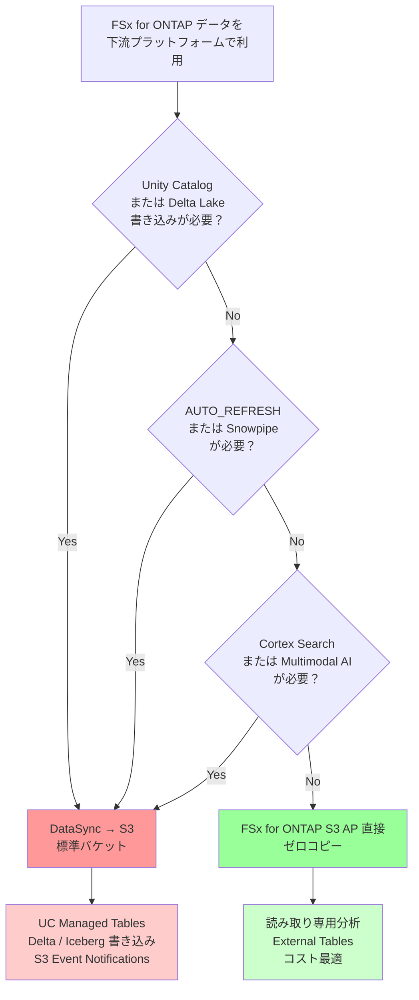

🌐 [English](../en/datasync-to-s3-guide.md) | **日本語**

> 📖 **総合ガイド**: FSx for ONTAP → Databricks UC の全接続パスを俯瞰するには [UC 接続総合ガイド](./fsxn-to-databricks-unity-catalog-guide.md) を参照してください。本ドキュメントは DataSync パスの詳細手順に特化しています。

# AWS DataSync: FSx for ONTAP → S3 同期ガイド

> **ステータス**: リファレンスアーキテクチャ — DataSync は FSx for ONTAP から標準 S3 バケットへの唯一の検証済み同期メカニズムです（SnapMirror S3 は [FSx for ONTAP で利用不可](../../verification-pack/snapmirror-s3/evidence/2026-05-26/evidence-record.yaml)）。

## エグゼクティブサマリー

- **適用場面**: Databricks Unity Catalog / Delta Lake / Iceberg / Snowflake が標準 S3 ストレージを要求するが、FSx for ONTAP S3 AP は conditional writes / S3 Event Notifications を提供しない場合
- **利用価値**: NAS ファイルデータを AI-ready データプロダクトに変換するマネージドな増分同期メカニズム（「回避策」ではなく、キュレートされたサブセットの移行パターン）
- **主要制約**: 準リアルタイム（~5分レイテンシ）が限界。真のリアルタイム要件（<1分）には FPolicy → Lambda → S3 パターンが必要
- **コスト構造**: 同一リージョン転送 $0.0125/GB + S3 ストレージ $0.023/GB/月。初回同期後は変更バイトのみ請求（1TB 初回 + 10GB/日増分で月額約$27）
- **実装フェーズ**: PoC（単一ボリューム手動同期） → ステージング（Snapshot/FlexClone 検証） → スケジュール自動化 → モニタリング/コスト最適化 → マルチボリューム/DR

## FAQ / よくある誤解

### Q1: DataSync と FSx for ONTAP S3 AP 直接パスはどう使い分けるべきか？

**A**: プラットフォームの要件で判断する:

- **FSx for ONTAP S3 AP 直接パス（同期なし）** → 読み取り専用分析（Athena / Trino / Snowflake External Table / Databricks read-only）
- **DataSync → S3 パス** → 標準 S3 が必要な機能（UC Managed Tables / Delta Lake 書き込み / Iceberg 書き込み / S3 Event Notifications / AUTO_REFRESH）

> Edge-to-cloud 製造データパイプラインでは、キュレートされたサブセットのみを DataSync 経由で同期し、生データは FSx for ONTAP に残すハイブリッドパターンが一般的です。

### Q2: SnapMirror S3 と DataSync のどちらを使うべきか？

**A**: FSx for ONTAP では **DataSync のみ**が選択肢です。SnapMirror S3（ONTAP 9.10.1+ ドキュメント記載機能）は FSx for ONTAP で利用不可（2026年5月検証）:
- `snapmirror object-store` コマンドは未認識
- `/api/cloud/targets` REST API は未認可
- AWS に機能要望提出済み

> オンプレミス ONTAP では SnapMirror S3 が利用可能ですが、FSx for ONTAP には提供されていません。FSx for ONTAP 環境では DataSync が唯一のマネージド同期メカニズムです。

### Q3: DataSync でリアルタイム同期は可能か？

**A**: **準リアルタイム（~5-12分）**が限界です。真のリアルタイム（<1分）には対応していません:
- 最小スケジュール: `rate(5 minutes)`
- 転送時間: 10 GB で 1-2 分
- 下流検知: Auto Loader / Snowpipe ポーリングで +5分
- **合計: 7-12分**

> 1分未満の要件がある場合は、FPolicy → Lambda → S3 パターンへの切り替えが必要です。DataSync は「準リアルタイム」であり「ストリーミング」ではありません。

### Q4: DataSync のコストは高くないか？

**A**: 初回は高く見えますが、増分同期では低コストです:
- **初回**: 1 TB × $0.0125 = $12.50（一回限り）
- **日次増分**: 10 GB × $0.0125 = $0.125/日（変更バイトのみ）
- **月次運用**: 約$3.75/月（増分転送）+ $23/月（S3 ストレージ） = **約$27/月**

**高コストシナリオ**: 全ファイルを毎回転送する設定（`TransferMode: ALL`）は避ける。必ず `CHANGED` を使用し、includes/excludes でサブセットを限定する。

### Q5: 本番データへの影響を避けるには？

**A**: **Snapshot / FlexClone ステージングパターン**を使用する:

1. FSx for ONTAP 本番ボリュームの Snapshot 取得
2. FlexClone ボリュームを作成（瞬時、ストレージ効率的）
3. DataSync を FlexClone ボリュームから実行
4. 本番ワークロードは無影響

> **本番影響回避** (FSx for ONTAP Architect lens): 製造現場では、本番ファイルシステムへの I/O 影響を回避するため、Snapshot ベースのステージングが必須です。DataSync クローリングが OT システムのレイテンシ要件に影響を与えないようにします。

### Q6: Snowflake で DataSync を使うべきか、FSx for ONTAP S3 AP 直接を使うべきか？

**A**: ユースケースで判断:

| ユースケース | 推奨パス | 理由 |
|------------|---------|------|
| 読み取り専用分析 / Cortex AI テキスト関数 | FSx for ONTAP S3 AP → External Table（直接） | ゼロコピー、同期不要 |
| AUTO_REFRESH / Snowpipe | DataSync → S3 → External Table | S3 Event Notifications が必要 |
| Cortex Search / RAG | DataSync → S3 → COPY INTO | 内部テーブルが必要 |
| Multimodal AI (Vision) | DataSync → S3 → COPY FILES | 内部ステージが必要 |

> ほとんどの読み取り専用分析では FSx for ONTAP S3 AP 直接が十分です。DataSync は S3 ネイティブ機能（イベント、内部ステージ）が必要な場合にのみ使用してください。

## 選択ガイド（意思決定フローチャート）



**意思決定の原則**:
- **標準 S3 機能が必要** → DataSync
- **読み取り専用で十分** → FSx for ONTAP S3 AP 直接
- **不明な場合** → FSx for ONTAP S3 AP 直接から開始（後で DataSync に切り替え可能）
- **ハイブリッド（最も一般的な企業パターン）** → 読み取り分析は FSx for ONTAP S3 AP 直接 + 書き込みが必要なキュレート済みサブセットのみ DataSync

> エンタープライズ環境で最も一般的なパターンは「ハイブリッド」です。全データを同期するのではなく、ホットリードパス（直近データの読み取り分析）は FSx for ONTAP S3 AP 直接を使い、コールドパス（キュレート済みサブセットの Delta/Iceberg 変換）のみ DataSync で同期します。

> 多くの組織は「DataSync が必要」と想定しますが、実際には読み取り専用ユースケースが 70-80% を占め、FSx for ONTAP S3 AP 直接で十分です。DataSync は標準 S3 機能が必須の場合にのみ使用してください。

## OT/IT セキュリティ考慮事項

製造環境での DataSync 実装では、工場ネットワーク制約とデータガバナンスを考慮する必要があります。

### 工場ネットワーク制約

| 制約 | DataSync への影響 | 対策 |
|------|------------------|------|
| エアギャップ工場 | DataSync は AWS VPC 接続が必要 | DMZ 経由の段階的転送またはオフライン FlexClone 輸送 |
| OT/IT 分離 | DataSync は FSx for ONTAP NFS への VPC アクセスが必要 | FSx for ONTAP を IT ネットワークに配置、OT → IT はエッジバッファリング経由 |
| 帯域幅制限 | 大規模初回同期が帯域を消費 | 夜間バッチ同期、または Snapshot 輸送 → DataSync（段階的） |

> **OT/IT 分離パターン** (OT Network Security Specialist lens): 多くの工場では、DataSync を IT ネットワーク内の FSx for ONTAP に対して実行し、OT システムは FPolicy または edge gateway 経由でデータを IT FSx for ONTAP に送信します。直接 OT-to-DataSync は一般的ではありません。

### エッジバッファリングパターン

```
OT 工場ネットワーク:
  センサー/PLC → Edge Gateway → Local FSx for ONTAP (オプション)

IT ネットワーク（AWS 接続）:
  FSx for ONTAP (IT) ← [NFS mount または FPolicy] ← OT Edge
  ↓ DataSync
  S3 標準バケット → Databricks / Snowflake
```

**セキュリティ分離**: OT データは IT FSx for ONTAP を経由してクラウドに到達します。DataSync は IT ネットワーク内でのみ動作します。

### FPolicy 代替パターン

DataSync はスケジュールベースですが、イベント駆動同期が必要な場合:

```
FSx for ONTAP FPolicy
  ↓ (ファイル作成/変更イベント)
AWS Lambda
  ↓
S3 PutObject (標準バケット)
  ↓
Databricks Auto Loader / Snowpipe
```

**トレードオフ**: FPolicy → Lambda は準リアルタイムですが、運用複雑性が高い。DataSync はシンプルですが準リアルタイムです。

**FPolicy → Lambda パターンの運用要件**（Data Engineering Lead observation）:
- **Lambda 同時実行制限**: バースト時のスロットリングに備えて Reserved Concurrency を設定（製造データは勤務時間帯にバースト発生）
- **Dead Letter Queue**: 処理失敗イベントを SQS DLQ に退避し、後続バッチで再処理
- **冪等性**: 同一ファイルイベントの重複配信に対応（S3 PutObject は冪等だが、変換処理を挟む場合は dedup が必要）
- **バックプレッシャー**: FPolicy イベント量が Lambda スループットを超えた場合、SQS バッファまたは EventBridge Pipe で吸収
- **隠れコスト**: Lambda 呼び出し（$0.20/100万リクエスト）+ CloudWatch Logs ストレージ + Step Functions 状態遷移（オーケストレーション使用時）

### 認証情報管理

| コンポーネント | 認証情報 | 管理方法 |
|------------|---------|---------|
| DataSync → FSx for ONTAP NFS | Security Group + Subnet | VPC 内通信、認証情報不要 |
| DataSync → S3 | IAM Role | DataSync サービスロールに S3 書き込み権限 |
| Databricks → S3 | IAM Role / Instance Profile | UC Storage Credential |

**ベストプラクティス**: IAM Role ベースの認証を使用し、長期認証情報（アクセスキー）を避ける。

### エッジでのデータ分類

製造データには機密性レベルが異なる複数のストリームが含まれます:
- **公開**: 集計メトリクス（同期可能）
- **内部**: 生センサーデータ（キュレーション後に同期）
- **機密**: 品質検査画像（タグ付け後に同期）

> ONTAP ボリューム/qtree 分離を使用して機密性レベルを分離し、DataSync タスクごとに異なるサブディレクトリを同期します。すべてを同期しないでください。

### VPC Endpoint 考慮事項

DataSync は以下へのネットワークアクセスが必要です:
- FSx for ONTAP データ LIF（VPC 内）
- S3 エンドポイント（VPC Endpoint または Internet Gateway 経由）

**推奨**: S3 用 VPC Gateway Endpoint を使用してインターネットトラフィックを回避（同一リージョンでは無料）。

### CloudTrail 監査

DataSync 操作を CloudTrail で記録:
- `StartTaskExecution` — 誰が同期を開始したか
- `DescribeTaskExecution` — 転送されたファイル数とバイト数
- S3 `PutObject` イベント — どのファイルがいつ同期されたか

**監査要件**: 製造データの系統追跡には CloudTrail + S3 アクセスログを有効にしてください。

### データ主権とリージョン制約

製造データを DataSync で同期する際、データ主権要件を考慮する必要があります:

| 規制 | 影響 | 対策 |
|------|------|------|
| EU GDPR | 個人データ（作業者情報含む）の EU 外転送制限 | FSx for ONTAP と S3 を同一 EU リージョンに配置。作業者 ID は匿名化後に同期 |
| 中国データ居住（PIPL/CSL） | 中国国内データの越境転送に安全評価が必要 | 中国リージョン内で完結する DataSync タスク。越境が必要な場合は CAC 安全評価を事前取得 |
| 自動車 OEM 要件 | サプライヤーデータを OEM 指定リージョンに配置 | DataSync 宛先 S3 バケットを OEM の Databricks/分析基盤と同一リージョンに作成 |
| ITAR/EAR（防衛関連） | 技術データの米国外アクセス制限 | GovCloud リージョン使用。S3 バケットポリシーでリージョン制限 |

> **データ主権** (Data Sovereignty / Compliance Specialist lens): グローバル自動車サプライチェーンでは、同一部品のデータが複数リージョンに存在します。DataSync タスクはリージョン内同期（同一リージョン FSx for ONTAP → S3）に限定し、クロスリージョン分析が必要な場合は S3 Cross-Region Replication で同期後のデータを転送してください。DataSync 自体のクロスリージョン転送も技術的に可能ですが、データ主権の観点からリージョン内完結を推奨します。

### データ品質検証

DataSync による同期と下流プラットフォームでの消費の間に、データ品質ゲートを設置することを推奨します:

```
FSx for ONTAP → DataSync → S3（raw zone）
                              ↓
                    品質検証ステップ（Glue Data Quality / dbt tests / Great Expectations）
                              ↓
                    S3（curated zone）→ Databricks UC / Snowflake
```

**品質チェック項目例**:
- ファイル数・サイズの期待値との整合（前回同期比 ±20% 以内）
- Parquet スキーマの一貫性（カラム数・型の変化検知）
- NULL 比率の閾値超過検知
- タイムスタンプの範囲検証（未来日付・古すぎるデータの排除）

> **品質ゲート** (Data Reliability Engineer lens): DataSync は転送の整合性（バイトレベル一貫性）を保証しますが、**ビジネスレベルの品質**は保証しません。ソース側のファイル破損、不完全な書き込み（NFS 側で書き込み途中のファイル）、スキーマドリフトは DataSync を通過します。S3 到達後に Glue Data Quality ルールまたは dbt source freshness テストで品質ゲートを設けてください。Snapshot ステージングパターン（Phase 2）を使えば「書き込み途中」の問題は回避できますが、スキーマドリフトと NULL 異常は別途検出が必要です。

## このガイドが必要な場面

DataSync は、消費プラットフォームが標準 S3 ストレージを要求する場合に、**エンタープライズファイルデータから AI-ready データプロダクトへのブリッジ**です:

- Databricks Unity Catalog が標準 S3 バケットのデータを要求する場合（FSx for ONTAP S3 AP は UC 非サポート）
- Delta Lake / Iceberg / Hudi テーブルフォーマット書き込みに標準 S3 が必要な場合（FSx for ONTAP S3 AP は conditional writes 非サポート）
- AUTO_REFRESH / Snowpipe が必要な場合（S3 Event Notifications が FSx for ONTAP S3 AP で利用不可）
- FSx for ONTAP データのガバナンス付きコピーを S3 に配置して下流の AI/ML 消費に使用する場合

> **設計原則**: DataSync は「回避策」ではなく、NAS ファイルデータをプラットフォームが消費可能なデータセットに変換するマネージドな増分同期メカニズムです。目標はすべてをコピーすることではなく、下流プラットフォームが AI-ready データプロダクトに必要とする **curated subset** を同期することです。

## アーキテクチャ

```
FSx for ONTAP (NFS)
  ↓ DataSync タスク（スケジュール）
Amazon S3 バケット（標準）
  ↓
分析エンジン（Databricks UC, Delta Lake, Iceberg 等）
```

## 前提条件

- NFS アクセス可能なボリュームを持つ FSx for ONTAP ファイルシステム
- 同一リージョンのターゲット S3 バケット
- FSx for ONTAP NFS からの読み取りと S3 への書き込み権限を持つ DataSync 用 IAM ロール
- FSx for ONTAP 管理/データ LIF への接続性を持つ VPC

## セットアップ手順

### ステップ 1: DataSync ソースロケーション作成（FSx for ONTAP NFS）

```bash
aws datasync create-location-fsx-ontap \
  --storage-virtual-machine-arn arn:aws:fsx:ap-northeast-1:<ACCOUNT>:storage-virtual-machine/<SVM_ID> \
  --protocol NFS={} \
  --subdirectory /vol1/data/ \
  --security-group-arns arn:aws:ec2:ap-northeast-1:<ACCOUNT>:security-group/<SG_ID>
```

参照: [FSx for ONTAP での転送設定](https://docs.aws.amazon.com/datasync/latest/userguide/create-ontap-location.html)

### ステップ 2: DataSync 宛先ロケーション作成（S3）

```bash
aws datasync create-location-s3 \
  --s3-bucket-arn arn:aws:s3:::<BUCKET_NAME> \
  --s3-config BucketAccessRoleArn=arn:aws:iam::<ACCOUNT>:role/DataSyncS3Role \
  --subdirectory /fsxn-sync/
```

### ステップ 3: DataSync タスク作成

```bash
aws datasync create-task \
  --source-location-arn <SOURCE_LOCATION_ARN> \
  --destination-location-arn <DESTINATION_LOCATION_ARN> \
  --name fsxn-to-s3-sync \
  --options '{
    "VerifyMode": "ONLY_FILES_TRANSFERRED",
    "OverwriteMode": "ALWAYS",
    "Atime": "BEST_EFFORT",
    "Mtime": "PRESERVE",
    "PreserveDeletedFiles": "REMOVE",
    "TransferMode": "CHANGED"
  }'
```

主要オプション:
- `TransferMode: CHANGED` — 変更されたファイルのみ転送（増分）
- `PreserveDeletedFiles: REMOVE` — FSx for ONTAP で削除されたファイルを S3 からも削除
- `Mtime: PRESERVE` — 変更検知のために更新タイムスタンプを保持

### ステップ 4: タスクのスケジュール設定

```bash
aws datasync update-task \
  --task-arn <TASK_ARN> \
  --schedule ScheduleExpression="rate(5 minutes)"
```

スケジュールオプション:
- `rate(5 minutes)` — 5分ごと（準リアルタイム）
- `rate(1 hour)` — 1時間ごと（バッチ）
- `cron(0 */6 * * ? *)` — 6時間ごと

### ステップ 5: 実行と監視

```bash
# 手動実行
aws datasync start-task-execution --task-arn <TASK_ARN>

# ステータス確認
aws datasync describe-task-execution --task-execution-arn <EXECUTION_ARN>
```

## 段階的導入ステップ

| フェーズ | 目標 | 主要アクション | 完了基準 | 期間目安 |
|---------|------|-------------|---------|---------|
| **Phase 1**: PoC 単一ボリューム | DataSync 基本動作確認 | 単一ボリューム → S3 手動同期、転送時間・コスト計測 | 手動実行で S3 にデータ到達、コスト実測値取得 | 1-2日 |
| **Phase 2**: ステージング検証 | 本番影響回避パターン確立 | Snapshot/FlexClone → DataSync 実行、本番 I/O 影響なし確認 | FlexClone 経由同期で本番ワークロード無影響を確認 | 2-3日 |
| **Phase 3**: スケジュール自動化 | 運用自動化 | EventBridge スケジュール設定、CloudWatch メトリクス/アラーム構築 | 5分/1時間スケジュール安定稼働、異常時アラート発報 | 3-5日 |
| **Phase 4**: モニタリング/コスト最適化 | 運用品質向上 | S3 Lifecycle ルール、includes/excludes フィルタ最適化、コストダッシュボード | 月次コスト目標達成、不要データ自動階層化 | 1週間 |
| **Phase 5**: マルチボリューム/DR | 本番拡張 | 複数ボリューム並列同期、クロスリージョン DR、障害復旧テスト | マルチボリューム安定稼働、RPO/RTO 達成確認 | 2-4週間 |

> **パイロットライン導入** (Manufacturing DX Specialist lens): 自動車製造環境では Phase 1 を**パイロットライン**（単一生産ライン）で実施してください。全工場展開は Phase 5 以降です。パイロットラインの選定基準: データ量が代表的、品質検査画像を含む、MES/SCADA 連携あり。IATF 16949 の変更管理プロセスに従い、パイロット結果を品質会議でレビュー後に横展開を承認します。

> **可観測性** (SRE / Observability Engineer lens): Phase 3 → Phase 4 の移行では、CloudWatch ダッシュボードに `BytesTransferred`、`FilesTransferred`、`TaskExecutionStatus`、`Duration` の 4 メトリクスを必ず含めてください。Phase 5 でのマルチボリューム展開前に、単一ボリュームでの安定稼働を最低 2 週間確認することを推奨します。

> **Infrastructure as Code** (Platform Engineering / IaC lens): DataSync タスクの includes/excludes パターンは CloudFormation / CDK でバージョン管理してください。「キュレート済みサブセット」の定義がコードとして管理されることで、運用チームの属人化を防ぎ、変更履歴を追跡できます。

> **コスト最適化** (Cost Optimization Specialist lens): Phase 4 では S3 Intelligent-Tiering を検討してください。DataSync 同期先のデータは書き込み後にアクセス頻度が急速に低下する傾向があり、30 日未経過データを Standard、30 日超を IA に自動階層化することで月額 30-40% のストレージコスト削減が可能です。

## コストモデル

| コンポーネント | コスト | 備考 |
|------------|------|------|
| DataSync 転送 | $0.0125/GB（同一リージョン） | 初回同期後は変更バイトのみ転送 |
| S3 ストレージ | $0.023/GB/月（Standard） | 宛先ストレージ |
| S3 リクエスト | $0.005/1000 PUT | 同期中 |

**例**: 1 TB 初回同期 + 10 GB/日の増分変更
- 初回: 1000 GB × $0.0125 = $12.50（一回限り）
- 日次増分: 10 GB × $0.0125 = $0.125/日
- 月次増分: 約$3.75/月
- S3 ストレージ: 1 TB × $0.023 = $23/月
- **月額合計（初回同期後）: 1 TB で約$27/月**

## エンドツーエンドレイテンシモデル

| DataSync スケジュール | 転送時間 (10 GB) | Auto Loader 検出 | 合計ラグ |
|---|---|---|---|
| 5分ごと | 約1-2分 | 5分ポーリング | **約7-12分** |
| 1時間ごと | 約1-2分 | 5分ポーリング | **約65分** |
| 6時間ごと | 約1-2分 | 5分ポーリング | **約6時間** |

### ClickHouse S3Queue 統合時のレイテンシ

| DataSync スケジュール | 転送時間 (10 GB) | S3Queue ポーリング間隔 | 合計ラグ |
|---|---|---|---|
| 5分ごと | 約1-2分 | 設定可能（デフォルト60秒） | **約7-8分** |
| 1時間ごと | 約1-2分 | 設定可能（デフォルト60秒） | **約62分** |
| FPolicy → Lambda → S3 | 秒単位 | 設定可能（デフォルト60秒） | **約1-2分** |

> ClickHouse S3Queue エンジンは標準 S3 バケットからの自動取り込みに最適です（DataSync 宛先）。FSx for ONTAP S3 AP からの直接 S3Queue は S3 Event Notifications 非サポートのため不可能です。製造分析で最も低レイテンシを実現するには、FPolicy → Lambda → S3 → ClickHouse S3Queue パターン（合計 1-2 分）を使用し、DataSync は日次/時次のバッチ enrichment に限定してください。

> 準リアルタイム要件（<1分）には、DataSync の代わりに FPolicy → Lambda → S3 を使用してください。

## ベストプラクティス

1. **`TransferMode: CHANGED` を使用** — 未変更ファイルの再転送を回避
2. **`PreserveDeletedFiles: REMOVE` を設定** — FSx for ONTAP での削除を S3 に反映
3. **Snapshot で整合性を確保** — Snapshot 取得後に DataSync を実行し、ポイントインタイム整合性のある転送を実現
4. **includes/excludes でフィルタ** — 関連プレフィックスのみ同期（例: `/bronze/sensor-data/`）
5. **CloudWatch で監視** — `BytesTransferred`、`FilesTransferred`、`TaskExecutionStatus` にアラーム設定
6. **S3 ライフサイクルルールを使用** — N日後に古い同期データを S3-IA や Glacier に階層化
7. **IAM ポリシーを最小権限で設計** — DataSync サービスロールには対象 S3 プレフィックスのみの書き込み権限を付与
8. **タスク実行ログを保持** — CloudTrail + S3 アクセスログで監査証跡を確保

> **最小権限 IAM** (IAM Security Architect lens): DataSync サービスロールの IAM ポリシーでは、`s3:PutObject` の Resource を `arn:aws:s3:::<bucket>/fsxn-sync/*` のように対象プレフィックスに限定してください。`s3:*` やバケット全体への書き込み権限は過剰です。また、S3 バケットポリシーで DataSync サービスロール以外からの書き込みを明示的に Deny することで、データ改ざんリスクを低減できます。

> **データ系統追跡** (Data Governance / Lineage Engineer lens): DataSync で同期されたデータの系統（lineage）追跡には、S3 オブジェクトタグに `source_volume`、`sync_timestamp`、`datasync_task_arn` を付与することを推奨します。これにより、下流の Databricks UC や Lake Formation でデータの出自を追跡でき、規制要件（データ保持、削除権）への対応が容易になります。

## Databricks UC との統合

DataSync がデータを S3 に同期した後:

```sql
-- S3 バケットを UC External Location として登録
CREATE EXTERNAL LOCATION fsxn_synced
  URL 's3://<BUCKET>/fsxn-sync/'
  WITH (STORAGE CREDENTIAL <credential_name>);

-- 同期データから UC Managed Table を作成
CREATE TABLE catalog.schema.sensor_data
USING DELTA
AS SELECT * FROM parquet.`s3://<BUCKET>/fsxn-sync/sensor-data/`;

-- 代替: UC Volumes によるファイルレベルアクセス（2024年導入）
CREATE EXTERNAL VOLUME catalog.schema.fsxn_files
  LOCATION 's3://<BUCKET>/fsxn-sync/'
  WITH (STORAGE CREDENTIAL <credential_name>);
-- Volumes 経由: /Volumes/catalog/schema/fsxn_files/sensor-data/*.parquet
```

> **二重認可設計** (Databricks Governance Architect lens): External Location 登録時には、UC の Storage Credential を IAM Role ベースで構成し、S3 バケットポリシーと合わせて二重認可を実装してください。DataSync が書き込むプレフィックスと Databricks が読み取るプレフィックスを同一にする場合、Databricks 側の IAM Role には `s3:GetObject` / `s3:ListBucket` のみを付与し、書き込み権限は付与しないでください。

> UC Volumes（2024年導入）は External Tables より軽量なファイルアクセスを提供し、`/Volumes/` パス経由でファイルを直接参照できます。ETL パイプラインでファイルを段階的に処理する場合、Volumes は External Location より管理が簡単です。

### Auto Loader 統合（DataSync → S3 後）

DataSync で標準 S3 に同期した後、Databricks Auto Loader の**通知モード**が利用可能になります:

```python
# 通知モード — S3 Event Notifications を使用（標準 S3 でのみ動作）
df = spark.readStream.format("cloudFiles") \
    .option("cloudFiles.format", "parquet") \
    .option("cloudFiles.useNotifications", "true") \
    .load("s3://<BUCKET>/fsxn-sync/sensor-data/")

# リスティングモード — ディレクトリスキャン（FSx for ONTAP S3 AP 直接でも動作するが低速）
df = spark.readStream.format("cloudFiles") \
    .option("cloudFiles.format", "parquet") \
    .option("cloudFiles.useNotifications", "false") \
    .load("s3://<BUCKET>/fsxn-sync/sensor-data/")
```

> **Auto Loader 通知モード** (Data Engineering SA lens): `cloudFiles.useNotifications = true`（通知モード）は S3 Event Notifications に依存するため、FSx for ONTAP S3 AP 直接では動作しません。DataSync → 標準 S3 パスの主要なメリットの一つは、この通知モードが利用可能になることです。リスティングモードは FSx for ONTAP S3 AP でも動作しますが、ListObjectsV2 の高レイテンシ（30-80x）により大規模ディレクトリで性能問題が発生します。

## Delta Lake / Iceberg との統合

DataSync がデータを S3 に同期した後、テーブルフォーマット書き込みが正常に動作:

```python
# EMR Spark — 同期済み S3 データに Delta テーブルを書き込み
df = spark.read.parquet("s3://<BUCKET>/fsxn-sync/sensor-data/")
df.write.format("delta").mode("overwrite").save("s3://<BUCKET>/delta-tables/sensors/")
```

## Snowflake との統合

DataSync → S3 は、標準 S3 バケットを必要とする Snowflake パターンも有効にします:

```sql
-- オプション 1: 同期済み S3 バケット上の Snowflake External Table（S3 からのゼロコピー）
CREATE OR REPLACE EXTERNAL TABLE sensor_data_ext
  WITH LOCATION = @s3_synced_stage/sensor-data/
  FILE_FORMAT = (TYPE = PARQUET)
  AUTO_REFRESH = TRUE;  -- 標準 S3 では S3 Event Notifications が動作

-- オプション 2: Snowflake 全機能向け COPY INTO（Cortex Search, Time Travel, DML）
COPY INTO sensor_data
  FROM @s3_synced_stage/sensor-data/
  FILE_FORMAT = (TYPE = PARQUET)
  MATCH_BY_COLUMN_NAME = CASE_INSENSITIVE;
```

**DataSync → S3 → Snowflake vs FSx for ONTAP S3 AP → Snowflake 直接の使い分け:**

| シナリオ | 推奨パス | 理由 |
|----------|---------|------|
| 読み取り専用分析、Cortex AI テキスト関数 | FSx for ONTAP S3 AP → External Table（直接） | ゼロコピー、同期不要 |
| AUTO_REFRESH / Snowpipe が必要 | DataSync → S3 → External Table | S3 Event Notifications が必要 |
| Cortex Search / RAG | DataSync → S3 → COPY INTO → Cortex Search | 内部テーブルが必要 |
| マルチモーダル AI (Vision) | DataSync → S3 → COPY FILES → 内部ステージ | TO_FILE に内部ステージが必要 |

> **重要な知見**: ほとんどの Snowflake 分析ユースケースでは、**FSx for ONTAP S3 AP 直接パス**（`AWS_ACCESS_POINT_ARN` 使用）で十分であり、同期コストを完全に排除できます。DataSync → S3 は S3 Event Notifications や内部テーブルを必要とする機能がある場合にのみ使用してください。

## なぜ SnapMirror S3 ではないのか？

SnapMirror S3（ONTAP S3 バケット → AWS S3 レプリケーション）は NetApp ONTAP 9.10.1+ のドキュメントに記載されていますが、**FSx for ONTAP では利用不可**です（2026年5月検証）:
- `snapmirror object-store` CLI コマンド: "not a recognized command"
- `/api/cloud/targets` REST API: "not authorized for that command"
- AWS に機能要望を提出済み

参照: [SnapMirror S3 検証エビデンス](../../verification-pack/snapmirror-s3/evidence/2026-05-26/evidence-record.yaml)

> SnapMirror S3 が利用不可であることは、データ移動の監査証跡設計に影響します。DataSync は CloudTrail に `StartTaskExecution` イベントを記録するため、「誰が、いつ、どのデータを同期したか」の追跡が可能です。将来 SnapMirror S3 が利用可能になった場合、ONTAP 側の監査ログとの整合性確認が必要になります。

## 関連ドキュメント

本ガイドは以下のドキュメントと連携しています:

- [FSx for ONTAP → Databricks UC 接続総合ガイド](./fsxn-to-databricks-unity-catalog-guide.md) — 全接続パスの俯瞰（DataSync はパスの一つ）
- [Kafka-ClickHouse-Unity Catalog 接続ガイド](./kafka-clickhouse-unity-catalog-connectivity.md) — ストリーミングデータとの統合パターン
- [S3 Annotations ガバナンス評価](./s3-annotations-governance-evaluation.md) — S3 同期後のメタデータガバナンス強化
- [互換性マトリクス](./compatibility-matrix.md) — プラットフォーム別 API 対応状況と DataSync 必要性判定

## 参考資料

- [AWS DataSync + FSx for ONTAP](https://docs.aws.amazon.com/datasync/latest/userguide/create-ontap-location.html)
- [DataSync 料金](https://aws.amazon.com/datasync/pricing/)
- [DataSync タスクオプション](https://docs.aws.amazon.com/datasync/latest/userguide/API_Options.html)
- [FSx for ONTAP S3 Access Points](https://docs.aws.amazon.com/fsx/latest/ONTAPGuide/s3-access-points.html)
