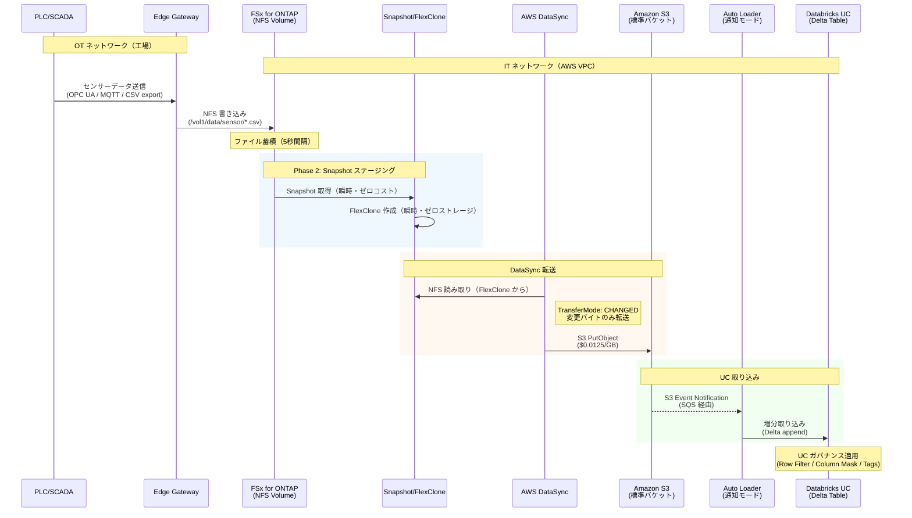
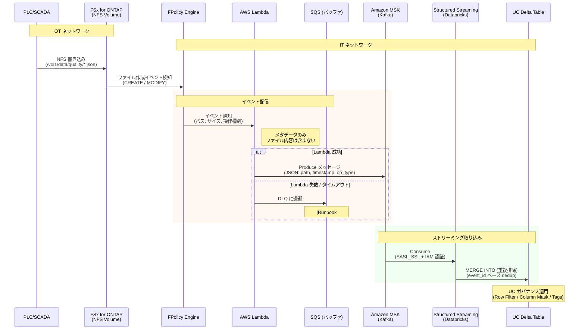

🌐 [English](../en/e2e-sequence-diagrams.md) | **日本語**

# End-to-End データフロー シーケンス図

> **目的**: FSx for ONTAP から下流分析プラットフォームまでの全データフローを、レイテンシ・データ量・障害時動作と共に可視化します。
> **最終更新**: 2026-06-21

---

## 概要

本ドキュメントでは、本リポジトリの 2 つの主要パスを mermaid シーケンス図で詳細化します:

1. **DataSync パス**（バッチ/準リアルタイム）: PLC → FSx for ONTAP → DataSync → S3 → Databricks UC
2. **FPolicy パス**（イベント駆動/準リアルタイム）: PLC → FSx for ONTAP → FPolicy → Lambda → Kafka → UC Delta

---

## パス 1: DataSync パス（推奨・本番向け）

### シーケンス図

### レイテンシバジェット

| ステップ | レイテンシ | 累積 | 備考 |
|---------|:---:|:---:|------|
| PLC → Edge Gateway | ~1 ms | 1 ms | OPC UA / ローカルネットワーク |
| Edge → FSx for ONTAP (NFS write) | ~5 ms | 6 ms | NFS v4.1 over VPC |
| ファイル蓄積（バッファリング） | 5 秒〜5 分 | 5 分 | Edge Gateway のバッチ書き込み間隔 |
| Snapshot + FlexClone | ~1 秒 | 5 分 | 瞬時操作 |
| DataSync スキャン + 転送 (10 GB) | 1-2 分 | 7 分 | CHANGED モード |
| S3 Event → SQS → Auto Loader | ~30 秒 | 7.5 分 | 通知伝播 + ポーリング |
| Auto Loader → Delta 書き込み | ~30 秒 | **8 分** | Spark マイクロバッチ |

> **合計 E2E レイテンシ**: PLC 出力から UC Delta テーブルクエリ可能まで **約 7-12 分**（DataSync 5 分スケジュール時）

### 障害シナリオと復旧

| 障害ポイント | 影響 | 検知方法 | 復旧手順 |
|---|---|---|---|
| Edge → FSx for ONTAP 切断 | データ蓄積停止 | NFS mount 監視 | Edge ローカルバッファ → 再接続後に再送 |
| FSx for ONTAP 障害 | Multi-AZ フェイルオーバー | CloudWatch FSx metrics | 自動フェイルオーバー（~30 秒） |
| DataSync 失敗 | 同期遅延 | CloudWatch アラーム | [Runbook #01](../../runbooks/01-datasync-failure-triage.md) |
| S3 書き込み失敗 | DataSync リトライ | DataSync execution status | 自動リトライ（DataSync 内蔵） |
| Auto Loader 失敗 | 取り込み遅延 | Spark Streaming metrics | Checkpoint から再開（exactly-once） |

---

## パス 2: FPolicy パス（イベント駆動）

### シーケンス図

### レイテンシバジェット

| ステップ | レイテンシ | 累積 | 備考 |
|---------|:---:|:---:|------|
| PLC → FSx for ONTAP (NFS write) | ~5 ms | 5 ms | NFS v4.1 |
| FPolicy イベント検知 | ~100 ms | 100 ms | ONTAP 内部イベント伝播 |
| FPolicy → Lambda 呼び出し | ~200 ms | 300 ms | VPC 内通信 (ENI) |
| Lambda 処理 | ~500 ms | 800 ms | メタデータ変換 + Kafka Produce |
| Kafka → Structured Streaming | ~2 秒 | 3 秒 | マイクロバッチ間隔依存 |
| Structured Streaming → UC Delta | ~2 秒 | **5 秒** | MERGE INTO |

> **合計 E2E レイテンシ**: PLC 出力から UC Delta テーブルクエリ可能まで **約 3-10 秒**（ストリーミングマイクロバッチ間隔依存）

### 障害シナリオと復旧

| 障害ポイント | 影響 | 検知方法 | 復旧手順 |
|---|---|---|---|
| FPolicy → Lambda 切断 | イベント消失リスク | FPolicy disconnect log | FPolicy 再接続（自動） |
| Lambda タイムアウト | DLQ 蓄積 | CloudWatch Lambda Errors | [Runbook #02](../../runbooks/02-fpolicy-lambda-failure.md) |
| Lambda → Kafka 失敗 | DLQ 蓄積 | CloudWatch + DLQ depth | [Runbook #02](../../runbooks/02-fpolicy-lambda-failure.md) |
| MSK ブローカー障害 | Produce 失敗 | MSK metrics | MSK 自動復旧 + Lambda リトライ |
| Structured Streaming 失敗 | 取り込み停止 | Spark metrics | Checkpoint から再開 |
| 重複イベント配信 | データ重複 | — | MERGE INTO の event_id dedup で吸収 |

---

## パス比較サマリ

| 属性 | DataSync パス | FPolicy パス |
|------|:---:|:---:|
| E2E レイテンシ | 7-12 分 | 3-10 秒 |
| スループット | 高（DataSync 最適化） | 中（Lambda 同時実行制限） |
| 運用複雑性 | 低（マネージド） | 高（Lambda + Kafka + SS） |
| データ保証 | 増分同期（バイトレベル） | at-least-once（dedup 必要） |
| コスト | $0.0125/GB 転送 + S3 | Lambda + MSK + Databricks Streaming |
| 障害復旧 | DataSync 再実行 | DLQ 再処理 + Checkpoint 再開 |
| 推奨ユースケース | バッチ分析、ML 訓練データ | リアルタイム品質検査、アラート |

> **選択指針** (Principal Cloud Data Architect lens): 多くのエンタープライズ環境では**両方を併用**します。DataSync パスでバルクデータ（日次/時次）を同期し、FPolicy パスでクリティカルイベント（品質不良検知等）のみリアルタイム連携。全データをストリーミングする必要はありません。

---

## 関連ドキュメント

- [DataSync → S3 ガイド](./datasync-to-s3-guide.md) — DataSync パスの実装詳細
- [Kafka-ClickHouse-UC 接続ガイド](./kafka-clickhouse-unity-catalog-connectivity.md) — FPolicy/Kafka パスの実装
- [UC 接続総合ガイド](./fsxn-to-databricks-unity-catalog-guide.md) — パス選定ロジック
- [Runbook #01](../../runbooks/01-datasync-failure-triage.md) — DataSync 障害対応
- [Runbook #02](../../runbooks/02-fpolicy-lambda-failure.md) — FPolicy/Lambda 障害対応
- [FSx for ONTAP 機能マップ](./fsxn-feature-utilization-map.md) — 各ステップで使用される ONTAP 機能
