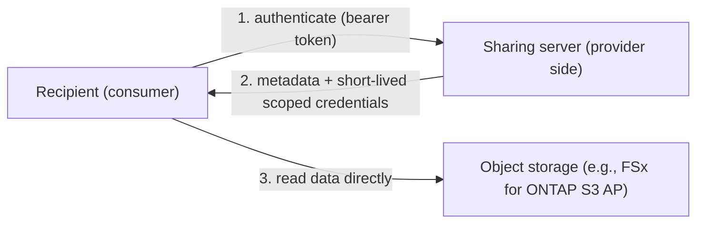
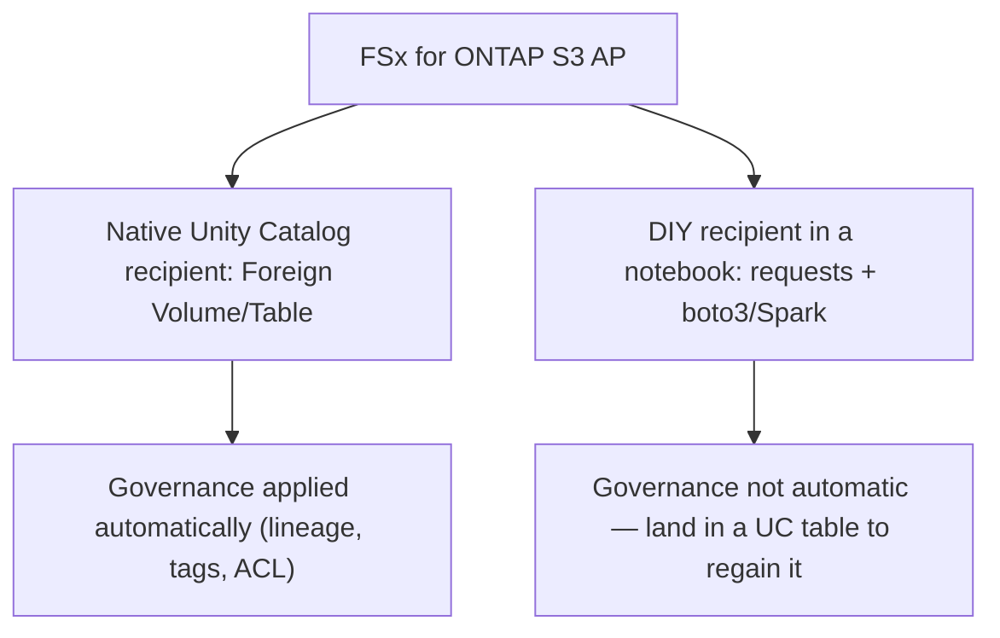
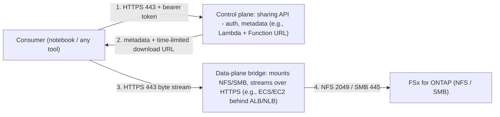

🌐 [English](../en/opensharing-and-unity-catalog-explained.md) | **日本語**

# OpenSharing と Unity Catalog: 概念と検証メモ

オブジェクトストレージ（例: Amazon FSx for NetApp ONTAP の S3 Access Points）と
Databricks Unity Catalog の間で、オープンなデータ共有がどう動くのかを中立に整理します。
今できること、まだ発展途上のこと、そしてその理由を扱います。

> 本ドキュメントは概念の解説と一次情報の引用を目的とし、特定ベンダーを持ち上げたり
> 他と対立させたりするものではありません。可用性や提供時期は各プラットフォーム提供元が
> 管理します。最新状況は必ずリンク先ドキュメントで確認してください。

## 概要

NAS/オブジェクトストレージにファイルを置き、Databricks のような分析基盤で
**ガバナンス（リネージ・タグ・アクセス制御）付き**にそのデータを使いたい場合、
いくつかの経路があります。各経路は、データを**コピーするか**、**Unity Catalog の
ガバナンスが自動適用されるか**、そして**成熟度**の点で異なります。

本稿は、混同されやすい2つの仕組みに焦点を当てます。

- **ネイティブな Unity Catalog recipient** — Unity Catalog 自身が共有を取り込み、
  第一級のオブジェクトとしてガバナンスする方式。
- **notebook での「自作」recipient** — 自分のコードで共有データを読む方式（「任意の
  ツールで読む」モデル）。

## 背景: OpenSharing（旧 Delta Sharing）

**OpenSharing** は、組織・クラウド・プラットフォームを超えてデータと AI アセットを
安全に共有するためのオープンプロトコルです。Data+AI Summit 2026（2026年6月10日）で
Delta Sharing の後継として発表され、**Linux Foundation** 傘下の独立 OSS プロジェクト
（Apache 2.0）として運営されています。

プロトコルは **3 層のアセット階層**（`Share → Schema → Asset`）を定義し、以下の
アセットタイプをサポートします。

| アセットタイプ | ステータス | 説明 |
|---------------|-----------|------|
| **Table** | 仕様確定 | Delta Lake、Apache Iceberg、Parquet 形式の構造化データ |
| **Volume** | 仕様確定 | ファイルディレクトリ（ドキュメント、メディア、embedding）をスコープ限定認証情報で配信 |
| **AgentSkill** | 仕様確定 | 再利用可能な AI エージェント機能（スコープ限定ストレージアクセス付き） |
| **Model** | 仕様確定 | ML モデルアーティファクト（バージョンメタデータ・来歴情報付き） |
| **Agent** | コミュニティ提案 | ライブで呼び出し可能なエージェントサービス |
| **Page** | コミュニティ提案 | ビジネスエンティティ、メトリクス、用語定義 |

主要な特性: **ベンダー中立**（準拠するサーバー/クライアントはすべて有効）、
**AI ネイティブ**（共有対象をデータから AI アセット全般に拡張）、**ゼロコピー**
（アセットは provider のストレージに残る）、**データの所在を問わない**
（S3、ADLS、GCS、R2、オンプレミス対応）。

テーブルには2つのアクセスモードが定義されています。
- **`url` モード** — サーバーが presigned URL を返し、クライアントが直接取得
- **`dir` モード** — サーバーが一時 STS 認証情報を vend し、クライアントが標準 `GetObject` で読み取り

Volumes には `dir`（STS 認証情報）モードのみが使用されます。

- OpenSharing の発表: <https://www.databricks.com/blog/introducing-opensharing-next-evolution-delta-sharing-agentic-era>
- プロトコル仕様（GitHub）: <https://github.com/OpenSharing-IO/OpenSharing>
- Linux Foundation プレスリリース: <https://www.linuxfoundation.org/press/linux-foundation-announces-opensharing-project-to-standardize-ai-asset-and-data-exchange>
- Databricks OpenSharing 製品ページ: <https://www.databricks.com/product/opensharing>

> **歴史的な経緯**: Delta Sharing は 2021 年に Databricks が Delta Lake のサブプロジェクト
> として発表しました。OpenSharing は Delta Sharing プロトコルとの完全な後方互換性を
> 保ちつつ、AI アセット、Iceberg 相互運用、`dir` モード credential vending へとスコープを
> 拡張しています。既存の Delta Sharing 統合は OpenSharing の下で引き続き動作します。

「credential vending」とは、共有サーバーが**短命でスコープ限定のクラウド認証情報**
（例: AWS STS）を発行し、消費側が**オブジェクトストレージから直接**データを読む
仕組みです。大量コピーは不要です。

## 主要な役割と共有モデル

混乱の大半は次の2用語に由来します。

- **Provider（共有元）** — データを保有し、**共有サーバー**を運用（または内蔵利用）
  する側。プロトコルはオープンなので、誰でも provider サーバーを実装できます。
- **Recipient** — 2つの意味があります。(1) provider が作る「誰に共有するか」を表す
  *recipient オブジェクト*（bearer token を伴う）、(2) 共有データを読む*消費側*。

Databricks は2つの共有モデルを文書化しています。

- **Databricks-to-Databricks** — 両側が Unity Catalog を使用。recipient のメタストアに
  provider オブジェクトが自動生成され、両側にガバナンスが適用されます。
  [recipient 向け provider 管理](https://docs.databricks.com/aws/en/opensharing/manage-provider)を参照。
- **Databricks-to-Open** — provider は Databricks/UC で、recipient は**任意のツール**
  （非 Databricks を含む）。credential file や activation URL を使います。
  [共有データへのアクセス（recipient 向け）](https://docs.databricks.com/aws/en/opensharing/recipient)
  と[共有データの読み取り（OpenSharing）](https://docs.databricks.com/aws/en/opensharing/share-data-open)を参照。

中核の流れ（credential vending）は次のとおりです。



> 注: Unity Catalog には、**外部エンジンへ**認証情報を vend する別機能もあります（逆方向）。
> これは OpenSharing とは別物です。
> [UC credential vending](https://docs.databricks.com/gcp/en/external-access/credential-vending)を参照。

## Unity Catalog と FSx for ONTAP S3 Access Points

自然な疑問として、「Unity Catalog は FSx for ONTAP S3 Access Point を直接
**External Location** として登録し、その上にガバナンス付きテーブルを作れるか
（ゼロコピー）？」があります。

本検証時点では、**この直接経路は動作しません**。Unity Catalog がストレージ認証用の
IAM ロールを引き受ける際に生成する**セッションポリシー**が、標準の S3 バケット ARN は
認識する一方で、**S3 Access Point ARN**を認識しないためです。トップレベルの一覧取得や
明示パスの読み取りは動くように見えても、サブディレクトリ一覧・`CREATE TABLE`・書き込みは
失敗します。Databricks サポートは、S3 Access Points が UC External Location の
サポート対象ストレージではないことを確認しています。観測挙動の詳細は本リポジトリの
[integrations/databricks](../../integrations/databricks/)を参照してください。

OpenSharing はこの制約を回避します。**External Location を使わず**、サーバーがスコープ
限定の認証情報を vend し、消費側がオブジェクトストレージを直接読むためです。残る論点は、
Unity Catalog がそのような共有を*どう取り込む*かです。

## データ取り込みの2方式（ネイティブ recipient vs 自作 recipient）



**1. ネイティブな Unity Catalog recipient（マネージド・ガバナンス付き）。** Unity Catalog
が recipient として振る舞い、共有された Volumes/Tables をガバナンス付きオブジェクト
（リネージ・タグ・アクセス制御）として提供します。Databricks-to-Databricks、および
open-provider の **Tables** については recipient 機能が既に存在します。**非 Databricks
provider の非構造化 Volumes**（FSx for ONTAP S3 Access Point のケース）をネイティブな
ガバナンス付きオブジェクトとして取り込むのは新しい領域です。Databricks は
ハイブリッド/オンプレストレージを OpenSharing で接続する **Storage Ecosystem** を発表して
います（[Storage Ecosystem の発表](https://www.databricks.com/blog/announcing-databricks-storage-ecosystem-governing-enterprise-data-estate-wherever-it-lives)）。

Storage Ecosystem パートナー状況（DAIS 2026, 2026年6月）:

| パートナー | ステータス |
|-----------|-----------|
| MinIO | GA |
| Everpure（旧 Pure Storage） | Private Preview |
| Qumulo | Private Preview（2026年7月） |
| VAST Data | Private Preview（2026年8月） |
| NetApp, Cohesity, Commvault, HPE, Nutanix, Rubrik | 2026年末までにネイティブ統合をコミット |

対応スコープと可用性は Databricks に確認してください。

**2. notebook での「自作」recipient（任意のツール）。** Databricks-to-Open モデルでは
recipient は任意のツールで構いません。**Databricks notebook**（Jupyter notebook に似た、
セル単位で対話実行する Databricks ホストのコード環境。
[Databricks notebooks](https://docs.databricks.com/aws/en/notebooks/)参照）から共有
サーバーを呼び、認証情報を受け取り、`boto3`/Spark でデータを読めます。**特別な
「OpenSharing notebook」は存在しません**。単に自分で書く recipient コードです。
トレードオフとして、自作読み取りには Unity Catalog のガバナンスが**自動適用されません**。
ガバナンスを効かせたい場合は、読んだデータを UC マネージドテーブルへ格納します。

## 補足パターン: ファイルプロトコル（NFS/SMB）ストレージ向けの自己管理 provider ブリッジ（設計例）

ストレージをオブジェクトインターフェースではなく**ファイルプロトコル（NFS/SMB）**で
アクセスする場合、オブジェクトストレージ認証情報を vend する代わりに、**自分で運用する
provider** がファイルを NFS/SMB で読み、その実体を HTTPS で配信する構成も考えられます。
これは**設計例（illustrative）であり、検証済みでも製品化された経路でもありません**。
とくに、ネイティブな Unity Catalog recipient が自己ホストの URL を受理するかは
**未検証・仕様外**です（自作 recipient なら成立し得ます）。可用性やネイティブ対応可否は
Databricks に確認してください。

この構成は役割の異なる2層に分かれます。

- **制御面** — OpenSharing API（認証・メタデータ・ルーティング）。軽量でイベント駆動。
- **データ面ブリッジ** — ストレージを NFS/SMB でマウントし、ファイル実体を HTTPS で
  ストリーム配信する常駐コンポーネント。



データの流れ:
1. 消費側が制御面に認証（HTTPS 443・bearer token）。
2. 制御面がメタデータと、データ面ブリッジを指す時間制限付きダウンロード URL を返す。
3. 消費側がデータ面ブリッジからファイル実体を HTTPS(443) で取得。
4. データ面ブリッジがストレージを NFS(2049)/SMB(445) で読み、ストリーム返却。

コンピュートの選択（役割別）:

| 役割 | AWS の選択肢 | 理由 |
|---|---|---|
| 制御面（認証・メタデータ・ルーティング） | Lambda + Function URL | 軽量・イベント駆動。本リポジトリのリファレンスサーバーが該当 |
| データ面ブリッジ（マネージド） | ECS on Fargate | サーバー運用が軽い。特権 kernel マウント不可のため userspace の NFS/SMB クライアント実装が前提 |
| データ面ブリッジ（高スループット・大容量） | EC2 / ECS on EC2 | host で `mount -t nfs`/`cifs` 可・高帯域・実行時間無制限 |
| データ面には不向き | Lambda | 15 分上限・応答サイズ上限・任意 NFS マウント不可 |

開けるポート:

| 方向 | ポート | 用途 |
|---|---|---|
| 消費側 → provider エンドポイント | TCP 443（HTTPS/TLS） | 共有 API とバイトストリーム |
| データ面ブリッジ → ストレージ | TCP 2049（+ NFSv3 は portmapper 111） | NFS |
| データ面ブリッジ → ストレージ | TCP 445 | SMB |

考慮事項:
- **自己運用**: パッチ・スケール・HA（マルチ AZ + ALB/NLB）・常駐コストは運用側の責任。
- **データ面がバイト経路上に入る**（帯域・コスト・レイテンシ・単一障害点）。credential
  vending（消費側がストレージを直読み）とは性質が異なる。ブリッジはステートレスにして
  水平スケール・マルチ AZ で冗長化する。
- **SMB + Active Directory**: ブリッジはサービスアカウントで認証（Kerberos/NTLM）。ストレージ側の
  export policy（NFS）/ share ACL（SMB）でブリッジを許可する。ファイル ACL を recipient の
  ID に対応づける（permission-aware）のは追加設計であり、権限不明時は既定で拒否する。
- **認証**: 公開する場合も TLS + bearer token（必要に応じて mTLS）で保護し、非認証の
  エンドポイントは公開しない。私設接続なら PrivateLink / NCC を優先。

## 本リポジトリの独立検証

オープンソースのリファレンスサーバー（本リポジトリ）と決定論的な実行により、
FSx for ONTAP S3 Access Points で以下を観測しました。

- credential vending がスコープ限定・短命の STS 認証情報を発行。**11 のファイル形式**を
  読み取り成功。**prefix 分離**が機能（あるボリューム用の認証情報では別ボリュームを読めない）。
  presigned URL は HTTP 200。
- Databricks **serverless** コンピュートから: 独自の公開エンドポイント（共有サーバーの
  URL）へは既定で**到達できません**（serverless の egress は制限され、egress ポリシーが
  「Full」でも Network Connectivity Configuration が必要）。一方 AWS S3 / S3 Access Point
  へは managed VPC endpoint 経由で**到達可能**で、vend された認証情報を使って notebook が
  S3 Access Point 上のオブジェクトを読み取れました（約 250 KB の parquet）。

本リポジトリで未検証（プラットフォーム機能に依存）: 非 Databricks の Volumes provider に対する
**ネイティブな Unity Catalog recipient**。再現可能なサーバーと手順は
[integrations/opensharing-server](../../integrations/opensharing-server/)にあります。

## UC Recipient: 現在の提供状況と責任マップ

OpenSharing プロトコルには2つの側面があります。**Provider 側**（共有サーバー）はオープンで
誰でも実装可能 — 本リポジトリが動作する実装を示しています。**Recipient 側** — Unity
Catalog が Share を取り込みガバナンスを適用する部分 — は Databricks プラットフォームの
機能であり、Storage Ecosystem プログラムを通じて展開が進んでいます。

### 責任分界

```
Provider 側（オープン、誰でも実装可能）       Recipient 側（Databricks プラットフォーム）
┌─────────────────────────────────────┐       ┌────────────────────────────────────┐
│ • OpenSharing server                │       │ • CREATE PROVIDER                  │
│ • Bearer token 発行                 │       │ • SHOW SHARES IN PROVIDER          │
│ • Credential vending (STS)          │ ───── │ • CREATE CATALOG USING SHARE       │
│ • アセット探索 (list/get)            │  API  │ • Foreign Volume / Table in UC     │
│                                     │       │ • ガバナンス (tags, ABAC, lineage) │
└─────────────────────────────────────┘       └────────────────────────────────────┘
  本リポジトリ: ✅ 完了                         ステータス: ⏳ 非 Databricks の Volume
  (FSx for ONTAP S3 AP で検証済み)              provider 向けは展開中
                                                (Storage Ecosystem ロールアウト進行中)
```

### MinIO GA が証明すること

MinIO は Storage Ecosystem パートナーとして GA（DAIS 2026）。これは:
- UC の **Recipient 側コードが存在**し、非 Databricks provider の share を取り込める
- Unity Catalog が外部 OpenSharing server から `CREATE CATALOG USING SHARE` できる
- 少なくとも1つのパートナーで E2E が動作する

**不明な点**: この Recipient 側パスが任意のプロトコル準拠サーバーに開放されているか、
Databricks 認定パートナーのみに制限されているか。

### Databricks 側で展開中のプラットフォーム機能

| 機能 | 説明 | オーナー |
|------|------|---------|
| 未認定 provider の UC 受け入れ | 任意の OpenSharing 準拠エンドポイントへの credential profile で `CREATE PROVIDER` を許可 | Databricks |
| 外部 share の Foreign Volume ガバナンス | OpenSharing 経由で取り込んだ Volume に tags, ABAC, lineage, column masks を適用 | Databricks |
| Open recipient への Volume sharing 対応 | 現在 Volume は D2D のみ。Open recipient 向け Volume アクセスは未文書化 | Databricks |

### Notebook アクセスだけでは不十分な理由

UC ガバナンス（tags, ABAC / row filters / column masks, 監査 lineage）は **UC に登録された
オブジェクトにのみ**適用されます。外部認証情報で `boto3` や Spark を使って notebook から
読んだデータは **UC ガバナンスの対象外** — tags なし、ABAC なし、lineage なし、
masking なし。

規制対象やガバナンスが要件のワークロードでは、UC 登録は省略できません。非 Databricks
provider からの share を UC にファーストクラスのガバナンス付きオブジェクトとして取り込む
機能が必要です。

### Storage Ecosystem: 誰が何をするか

| 責任 | オーナー | ステータス |
|------|---------|-----------|
| ONTAP（オンプレ）向け OpenSharing provider server 実装 | NetApp | 2026年末までにコミット |
| FSx for ONTAP（AWS）向け OpenSharing provider server 実装 | AWS / NetApp（パートナーシップ） | 不明 — オンプレに追随するか別途かは未定 |
| UC で非 Databricks provider の share を受理（Recipient 側） | Databricks | MinIO で GA。他パートナーへの展開は未定 |
| Storage Ecosystem 新規パートナー認定 | Databricks + パートナー共同 | Partner Well-Architected Framework |
| OSS リファレンスサーバー（プロトコル準拠、実現可能性の検証） | 本リポジトリ | ✅ 完了 |

### 加速の方法

1. **技術検証** — リファレンスサーバーの credential profile で `CREATE PROVIDER` を試行。
   結果（成功 or エラーメッセージ）を記録。
2. **Feature request** — Databricks プロダクトチームへ: 「非 Databricks OpenSharing
   Volumes provider の UC recipient 対応」をプロトコル準拠サーバーのエビデンスとともに提出。
3. **パートナーレバー** — NetApp の Storage Ecosystem コミットメントはオンプレ ONTAP 対象。
   FSx for ONTAP（AWS マネージド）も同タイムラインに含めるよう主張。
4. **パブリックエビデンス** — Provider 側がプロトコル準拠で動作し、残りの依存は
   プラットフォーム Recipient 機能にあることを公開し、コミュニティの関心と可視性を高める。

## 現時点の選び方

- **今すぐガバナンス付き分析が必要** → 標準の S3 バケットへデータをステージング（例:
  AWS DataSync、または FPolicy → Lambda パイプライン）し、そのバケットを Unity Catalog に
  登録。コピーは発生しますが完全なガバナンスが適用されます。
- **完全な UC ガバナンス無しでゼロコピー読み取りが必要** → S3 Access Point を直接読む
  （Athena、または vend された認証情報で notebook の自作 recipient）。
- **ゼロコピー*かつ*ネイティブな UC ガバナンスが欲しい** → ネイティブ recipient /
  Storage Ecosystem の動向を追い、可用性を Databricks に確認。
- **ストレージをファイルプロトコル（NFS/SMB）でしか出せない** → 上記の自己管理 provider
  ブリッジ（設計例）を検討。ただし運用責任と、ネイティブ UC 取り込みが未検証である点に留意。

各選択肢は異なる文脈に適します。ガバナンス・鮮度・コストの要件に基づいて選んでください。

## FAQ

- **ストレージ側が provider を自分で実装できますか？** はい — プロトコルはオープンで、
  本リポジトリには動作するリファレンス provider サーバーが含まれます。ストレージ側だけで
  実装できないのは、Unity Catalog の*recipient 側*の挙動（サードパーティ共有をネイティブ
  オブジェクトとしてガバナンスする部分）で、これは Databricks プラットフォームの機能です。
- **「OpenSharing notebook」は特別な製品ですか？** いいえ。Databricks notebook（Jupyter に
  似た環境）の中に recipient コードを書くことを指します。任意のツールで可能です。
- **credential vending は Unity Catalog の credential vending と同じ？** いいえ。OpenSharing の
  vending は*他者へ*データを共有するもの、
  [UC credential vending](https://docs.databricks.com/gcp/en/external-access/credential-vending)は
  外部エンジンが*UC マネージド*データを読むためのものです。
- **Tables と Volumes は同じ扱い？** open-provider の Table 取り込みは確立済み、非構造化の
  **Volumes** のネイティブ取り込みが新しい領域です。

## 参考資料

- OpenSharing の発表（Databricks）: <https://www.databricks.com/blog/introducing-opensharing-next-evolution-delta-sharing-agentic-era>
- OpenSharing と Marketplace 機能（DAIS 2026）: <https://www.databricks.com/blog/announcing-new-opensharing-and-marketplace-capabilities-ai-era>
- Storage Ecosystem の発表（Databricks）: <https://www.databricks.com/blog/announcing-databricks-storage-ecosystem-governing-enterprise-data-estate-wherever-it-lives>
- OpenSharing 仕様（GitHub）: <https://github.com/OpenSharing-IO/OpenSharing>
- Linux Foundation プレスリリース: <https://www.linuxfoundation.org/press/linux-foundation-announces-opensharing-project-to-standardize-ai-asset-and-data-exchange>
- Databricks OpenSharing 製品ページ: <https://www.databricks.com/product/opensharing>
- 共有データへのアクセス（recipient 向け）: <https://docs.databricks.com/aws/en/opensharing/recipient>
- recipient 向け provider 管理: <https://docs.databricks.com/aws/en/opensharing/manage-provider>
- 共有データの読み取り（OpenSharing）: <https://docs.databricks.com/aws/en/opensharing/share-data-open>
- Unity Catalog credential vending: <https://docs.databricks.com/gcp/en/external-access/credential-vending>
- Databricks notebooks: <https://docs.databricks.com/aws/en/notebooks/>
- 本リポジトリ — リファレンスサーバー: [integrations/opensharing-server](../../integrations/opensharing-server/)
- 本リポジトリ — Databricks 統合メモ: [integrations/databricks](../../integrations/databricks/)
