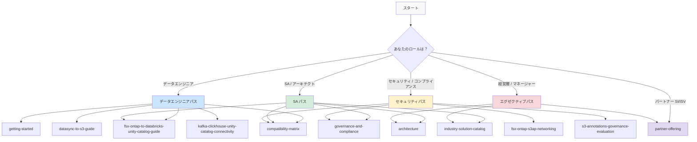
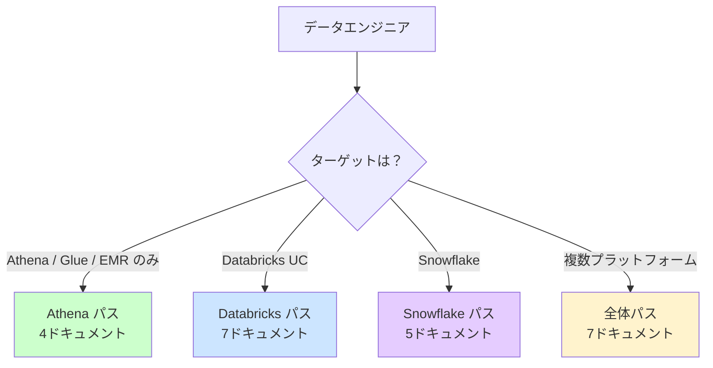
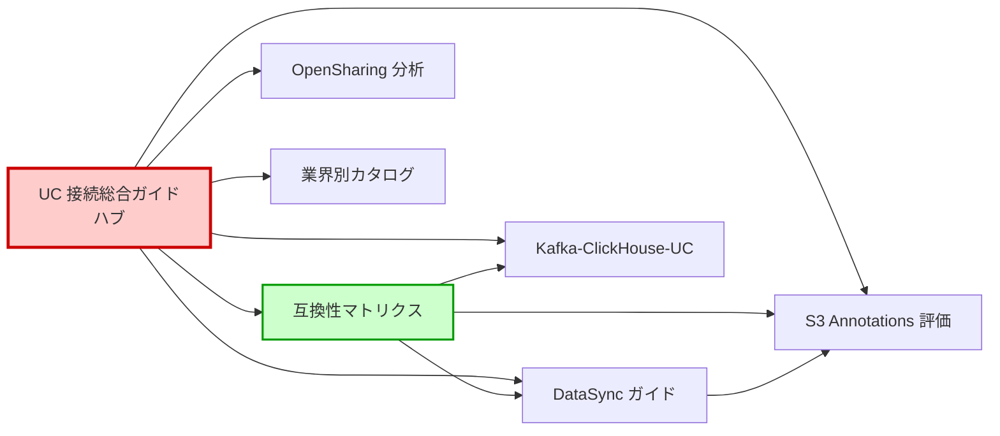

🌐 [English](../en/reading-path-guide.md) | **日本語**

# ドキュメント読み順ガイド

> **目的**: 本リポジトリには 25 以上の技術ドキュメントがあります。あなたのロールと目的に応じた最適な読み順を示します。
> **更新日**: 2026-06-20

---

## ドキュメント依存関係マップ

---

## このリポジトリでカバーしないこと（スコープ外）

以下のトピックは本リポジトリの対象外です。無駄な検索を避けてください:

| スコープ外 | 参照先 |
|-----------|--------|
| FSx for ONTAP ファイルシステムのプロビジョニング手順 | [AWS 公式: FSx for ONTAP 作成](https://docs.aws.amazon.com/fsx/latest/ONTAPGuide/getting-started.html) |
| Databricks ワークスペースのセットアップ | [Databricks 公式: ワークスペース作成](https://docs.databricks.com/en/getting-started/index.html) |
| Kafka / MSK クラスターのデプロイ手順 | [AWS 公式: MSK 作成](https://docs.aws.amazon.com/msk/latest/developerguide/getting-started.html) |
| ClickHouse のインストール・設定 | [ClickHouse 公式ドキュメント](https://clickhouse.com/docs) |
| Snowflake アカウントの初期設定 | [Snowflake 公式ドキュメント](https://docs.snowflake.com/) |
| ONTAP CLI / REST API のリファレンス | [NetApp ONTAP ドキュメント](https://docs.netapp.com/us-en/ontap/) |
| FSx for ONTAP のコスト最適化（ストレージ階層化） | [AWS 公式: FSx for ONTAP 料金](https://aws.amazon.com/fsx/netapp-ontap/pricing/) |

> 本リポジトリは「FSx for ONTAP のデータを Lakehouse プラットフォームで活用する統合パターン」に特化しています。各プラットフォーム自体の構築手順は公式ドキュメントを参照してください。

---

## 深度レベルの凡例

各ドキュメントをどこまで読むべきかの目安:

| レベル | 記号 | 意味 | 対象セクション |
|--------|:---:|------|------------|
| サマリのみ | ○ | エグゼクティブサマリだけで十分 | 冒頭の「エグゼクティブサマリ」 |
| 重点セクション | ◎ | 自分のロールに関連するセクションを読む | FAQ + 選択ガイド + 該当パス |
| 全文読み | ● | 全セクションを通読すべき | 全体 |

---

## ロール別読み順

### データエンジニア / データプラットフォーム担当

**目的**: FSx for ONTAP のデータを Databricks / Snowflake / Athena で利用するパイプラインを構築したい

**まず分岐**: あなたのターゲットプラットフォームは？

#### Athena / Glue / EMR のみ（最短パス）

| 順序 | ドキュメント | 深度 | 前提条件 | 所要時間 |
|:---:|---|:---:|---|:---:|
| 1 | [Getting Started](./getting-started.md) | ● | なし | 10分 |
| 2 | [互換性マトリクス](./compatibility-matrix.md) | ◎ | なし（マトリクス + クイックスタートに集中） | 15分 |
| 3 | [Networking](./fsx-ontap-s3ap-networking.md) | ◎ | #2 の制約理解 | 10分 |
| 4 | [イベント駆動アーキテクチャ](./event-driven-architecture.md) | ○ | なし（必要時のみ） | 5分 |

> Athena / Glue / EMR は FSx for ONTAP S3 AP に直接アクセス可能（DataSync 不要）。UC 接続ガイドは読む必要がありません。

#### Databricks UC パス

| 順序 | ドキュメント | 深度 | 前提条件 | 所要時間 |
|:---:|---|:---:|---|:---:|
| 1 | [Getting Started](./getting-started.md) | ● | なし | 10分 |
| 2 | [互換性マトリクス](./compatibility-matrix.md) | ◎ | なし | 15分 |
| 3 | [UC 接続総合ガイド](./fsx-ontap-to-databricks-unity-catalog-guide.md) | ● | #2 の制約理解が前提 | 30分 |
| 4 | [DataSync → S3 ガイド](./datasync-to-s3-guide.md) | ● | #3 でパス選定後 | 20分 |
| 5 | [Kafka-ClickHouse-UC 接続ガイド](./kafka-clickhouse-unity-catalog-connectivity.md) | ◎ | リアルタイム要件がある場合のみ | 25分 |
| 6 | [イベント駆動アーキテクチャ](./event-driven-architecture.md) | ◎ | #5 の FPolicy 詳細が必要な場合 | 15分 |
| 7 | [Iceberg メタデータカタログ](./iceberg-metadata-catalog.md) | ○ | 非構造化データの場合のみ | 20分 |

> **前提条件の連鎖**: #3（UC 接続ガイド）は #2（互換性マトリクス）の制約を理解していることが前提。#4（DataSync ガイド）は #3 でパスを選定した後に読む。

#### Snowflake パス

| 順序 | ドキュメント | 深度 | 前提条件 | 所要時間 |
|:---:|---|:---:|---|:---:|
| 1 | [Getting Started](./getting-started.md) | ● | なし | 10分 |
| 2 | [互換性マトリクス](./compatibility-matrix.md) | ◎ | なし（Snowflake 行に集中） | 15分 |
| 3 | [UC 接続総合ガイド](./fsx-ontap-to-databricks-unity-catalog-guide.md) | ◎ | Snowflake セクションのみ | 10分 |
| 4 | [DataSync → S3 ガイド](./datasync-to-s3-guide.md) | ◎ | Snowflake 統合セクションに集中 | 10分 |
| 5 | [Networking](./fsx-ontap-s3ap-networking.md) | ◎ | Storage Integration 設計 | 10分 |

> Snowflake は FSx for ONTAP S3 AP に直接アクセス可能（External Stage）。DataSync は AUTO_REFRESH / Cortex Search が必要な場合のみ。

**スキップ可能**: governance-and-compliance（セキュリティチームが担当）、partner-offering（パートナー向け）

---

### SA / ソリューションアーキテクト

**目的**: 顧客への提案設計、PoC 計画、アーキテクチャレビューを行いたい

| 順序 | ドキュメント | 読む理由 | 所要時間 |
|:---:|---|---|:---:|
| 1 | [アーキテクチャ概要](./architecture.md) | 全体設計思想の把握 | 15分 |
| 2 | [UC 接続総合ガイド](./fsx-ontap-to-databricks-unity-catalog-guide.md) | パス選定ロジックと制約の完全理解 | 30分 |
| 3 | [互換性マトリクス](./compatibility-matrix.md) | プラットフォーム/フォーマット対応の詳細 | 20分 |
| 4 | [業界別ソリューションカタログ](./industry-solution-catalog.md) | 顧客業界ごとの適用パターン | 20分 |
| 5 | [ガバナンスとコンプライアンス](./governance-and-compliance.md) | エンタープライズ要件への対応 | 15分 |
| 6 | [DataSync → S3 ガイド](./datasync-to-s3-guide.md) | 推奨パスの技術詳細 | 20分 |
| 7 | [リカバリセマンティクス](./recovery-semantics.md) | Snapshot vs Time Travel の比較 | 10分 |
| 8 | [OpenSharing 統合分析](./opensharing-integration-analysis.md) | DAIS 2026 新機能の影響評価 | 15分 |
| 9 | [パートナーオファリング](./partner-offering.md) | SI/ISV 向けパッケージ設計 | 10分 |

**追加参照**: vendor-comparison（代替比較が必要な場合）、region-design-guide（グローバル展開時）、[アーキテクチャ比較](../adoption-guide/architecture-comparison-ja.md)（アプローチ選定）、[コスト見積もり](../adoption-guide/cost-estimation-ja.md)（キャパシティプランニング）

---

### セキュリティ / コンプライアンス担当

**目的**: データ保護、アクセス制御、監査、規制対応を確認したい

| 順序 | ドキュメント | 読む理由 | 所要時間 |
|:---:|---|---|:---:|
| 1 | [ガバナンスとコンプライアンス](./governance-and-compliance.md) | セキュリティ設計の全体像 | 20分 |
| 2 | [互換性マトリクス](./compatibility-matrix.md) | 二層認可モデルと VPC 設計 | 15分 |
| 3 | [ネットワーキング](./fsx-ontap-s3ap-networking.md) | VPC/AP/エンドポイント設計 | 15分 |
| 4 | [S3 Annotations ガバナンス評価](./s3-annotations-governance-evaluation.md) | メタデータガバナンスの可能性と制約 | 20分 |
| 5 | [DataSync → S3 ガイド](./datasync-to-s3-guide.md) | OT/IT セキュリティセクション重点 | 10分 |
| 6 | [ゼロコピーメディアガバナンス](./zero-copy-media-governance.md) | メディアファイルのアクセス制御 | 15分 |
| 7 | [リカバリセマンティクス](./recovery-semantics.md) | DR / バックアップ / 改ざん防止 | 10分 |

**重点セクション**: 各ドキュメントの「OT/IT セキュリティ考慮事項」セクションを横断的に確認してください。

---

### 経営層 / プロジェクトマネージャー

**目的**: 投資判断、プロジェクト計画、リスク把握を行いたい

| 順序 | ドキュメント | 読む理由 | 所要時間 |
|:---:|---|---|:---:|
| 1 | [**わかりやすいビジネスガイド**](./quickstart-business-guide.md) | 技術用語なしで全体像を把握 | 5分 |
| 2 | [業界別ソリューションカタログ](./industry-solution-catalog.md) | ビジネス価値と適用業界の理解 | 15分 |
| 3 | [アーキテクチャ概要](./architecture.md) | エグゼクティブサマリのみ | 5分 |
| 4 | [UC 接続総合ガイド](./fsx-ontap-to-databricks-unity-catalog-guide.md) | エグゼクティブサマリ + 段階的導入ステップ | 10分 |
| 5 | [KPI と検証](./kpi-and-validation.md) | 成功指標と進捗状況 | 10分 |

**読み方の注意**: ビジネスガイドから始めてください — 意思決定者に必要な情報が 5 分で把握できます。他のドキュメントはトピック別の深掘り用です。

---

### パートナー SI / ISV

**目的**: 顧客向けソリューション構築、リセル/実装パートナーとしての技術理解を得たい

| 順序 | ドキュメント | 読む理由 | 所要時間 |
|:---:|---|---|:---:|
| 1 | [パートナーオファリング](./partner-offering.md) | パートナー向けパッケージ概要 | 10分 |
| 2 | [業界別ソリューションカタログ](./industry-solution-catalog.md) | 顧客提案に使える業界パターン | 20分 |
| 3 | [UC 接続総合ガイド](./fsx-ontap-to-databricks-unity-catalog-guide.md) | 技術的な全パスの理解 | 30分 |
| 4 | [互換性マトリクス](./compatibility-matrix.md) | 提案時の制約事項の把握 | 15分 |
| 5 | [DataSync → S3 ガイド](./datasync-to-s3-guide.md) | 実装手順の理解 | 20分 |
| 6 | [PoC 実行ガイド](../implementation-guide/poc-execution-guide-ja.md) | PoC チェックリストとトラブルシューティング | 15分 |
| 7 | [リージョン設計ガイド](./region-design-guide.md) | グローバル展開設計 | 10分 |

---

## ドキュメント分類マップ

### 鮮度ステータス（2026-06-20 時点）

| ドキュメント | 最終更新 | 鮮度 |
|---|---|:---:|
| UC 接続総合ガイド | 2026-06-18 | 🟢 最新 |
| 互換性マトリクス | 2026-06-20 | 🟢 最新 |
| DataSync → S3 ガイド | 2026-06-20 | 🟢 最新 |
| S3 Annotations 評価 | 2026-06-20 | 🟢 最新 |
| Kafka-ClickHouse-UC | 2026-06-15 | 🟢 最新 |
| 業界別ソリューションカタログ | 2026-06-18 | 🟢 最新 |
| OpenSharing 統合分析 | 2026-06-15 | 🟢 最新 |
| Recovery Semantics | 2026-06-10 | 🟢 最新 |
| Event-driven Architecture | 2026-05-28 | 🟡 要確認 |
| Governance and Compliance | 2026-05-25 | 🟡 要確認 |
| Networking | 2026-05-20 | 🟡 要確認 |

> 🟢 = 30日以内に更新 / 🟡 = 30-60日 / 🔴 = 60日超（レビュー推奨）

### カテゴリ別一覧

| カテゴリ | ドキュメント | 概要 |
|---------|------------|------|
| **入門** | [Getting Started](./getting-started.md) | 環境構築、前提条件 |
| **設計** | [Architecture](./architecture.md) | 全体アーキテクチャ設計 |
| | [UC 接続総合ガイド](./fsx-ontap-to-databricks-unity-catalog-guide.md) | Databricks UC 接続の全パス（ハブドキュメント） |
| | [Event-driven Architecture](./event-driven-architecture.md) | FPolicy / イベント駆動パターン |
| | [Region Design Guide](./region-design-guide.md) | マルチリージョン設計 |
| **実装** | [DataSync → S3 ガイド](./datasync-to-s3-guide.md) | DataSync パスの実装詳細 |
| | [Kafka-ClickHouse-UC 接続](./kafka-clickhouse-unity-catalog-connectivity.md) | ストリーミング + OLAP パス |
| | [Networking](./fsx-ontap-s3ap-networking.md) | VPC / AP / エンドポイント |
| | [Supported Regions](./supported-regions.md) | リージョン対応状況 |
| **検証** | [互換性マトリクス](./compatibility-matrix.md) | プラットフォーム/フォーマット互換性 |
| | [KPI and Validation](./kpi-and-validation.md) | 検証 KPI と進捗 |
| | [ClickHouse UC 検証計画](./verification-plan-clickhouse-uc-connectivity.md) | ClickHouse 検証計画 |
| **ガバナンス** | [Governance and Compliance](./governance-and-compliance.md) | セキュリティ/コンプライアンス |
| | [S3 Annotations 評価](./s3-annotations-governance-evaluation.md) | S3 Annotations のガバナンス活用 |
| | [Zero-copy Media Governance](./zero-copy-media-governance.md) | メディアガバナンス |
| | [Recovery Semantics](./recovery-semantics.md) | Snapshot vs Time Travel |
| **AI/ML** | [Iceberg Metadata Catalog](./iceberg-metadata-catalog.md) | AI カタログ設計 |
| | [Unstructured Data Access](./unstructured-data-access.md) | 非構造化データアクセス |
| | [OmniGent 評価](./omnigent-multi-agent-evaluation.md) | マルチエージェント評価 |
| **プラットフォーム評価** | [OpenSharing 統合分析](./opensharing-integration-analysis.md) | DAIS 2026 影響評価 |
| | [AWS Context vs UC](./aws-context-vs-unity-catalog.md) | AWS vs Databricks ガバナンス比較 |
| | [Vendor Comparison](./vendor-comparison.md) | プラットフォーム比較 |
| **ビジネス** | [Industry Solution Catalog](./industry-solution-catalog.md) | 業界別ソリューション |
| | [Partner Offering](./partner-offering.md) | パートナー向けパッケージ |
| | [Cross-repo Strategy](./cross-repo-integration-strategy.md) | リポジトリ間連携 |
| **採用ガイド** | [テクニカルオーバービュー](../adoption-guide/technical-overview-ja.md) | アーキテクチャとメトリクス概要 |
| | [アーキテクチャ比較](../adoption-guide/architecture-comparison-ja.md) | アプローチ選定フレームワーク |
| | [テクニカル FAQ](../adoption-guide/technical-faq-ja.md) | 制約と統合に関する Q&A |
| | [コスト見積もり](../adoption-guide/cost-estimation-ja.md) | コンポーネント別コスト計画 |
| | [PoC 実行ガイド](../implementation-guide/poc-execution-guide-ja.md) | PoC のステップバイステップチェックリスト |

### ハブドキュメント（他の多くのドキュメントから参照される中心ドキュメント）

> **読み始めに迷ったら**: [UC 接続総合ガイド](./fsx-ontap-to-databricks-unity-catalog-guide.md) から始めてください。このドキュメントが全パスの起点であり、各詳細ドキュメントへのリンクを含んでいます。

---

## クイックリファレンス: 「〇〇したい」→ 読むべきドキュメント

| やりたいこと | 最初に読むドキュメント | 次に読むドキュメント |
|---|---|---|
| FSx for ONTAP データを Databricks で分析したい | [UC 接続総合ガイド](./fsx-ontap-to-databricks-unity-catalog-guide.md) | [DataSync ガイド](./datasync-to-s3-guide.md) |
| FSx for ONTAP データを Athena で分析したい | [互換性マトリクス](./compatibility-matrix.md) | [Networking](./fsx-ontap-s3ap-networking.md) |
| FSx for ONTAP データを Snowflake で分析したい | [互換性マトリクス](./compatibility-matrix.md) | [UC 接続総合ガイド](./fsx-ontap-to-databricks-unity-catalog-guide.md)（Snowflake セクション） |
| リアルタイムでデータを取り込みたい | [Kafka-ClickHouse-UC](./kafka-clickhouse-unity-catalog-connectivity.md) | [Event-driven Architecture](./event-driven-architecture.md) |
| 非構造化データ（画像/PDF）を AI で活用したい | [Iceberg Metadata Catalog](./iceberg-metadata-catalog.md) | [Unstructured Data Access](./unstructured-data-access.md) |
| セキュリティ/コンプライアンスを確認したい | [Governance and Compliance](./governance-and-compliance.md) | [互換性マトリクス](./compatibility-matrix.md)（OT/IT セキュリティ） |
| 顧客に提案資料を作りたい | [業界別ソリューションカタログ](./industry-solution-catalog.md) | [Partner Offering](./partner-offering.md) |
| ブロックされている機能を確認したい | [互換性マトリクス](./compatibility-matrix.md)（制約テーブル） | [UC 接続総合ガイド](./fsx-ontap-to-databricks-unity-catalog-guide.md)（今後の展望） |
| Snapshot / DR / リカバリを理解したい | [Recovery Semantics](./recovery-semantics.md) | [DataSync ガイド](./datasync-to-s3-guide.md)（Phase 5） |

---

## 関連ドキュメント

- [Getting Started](./getting-started.md) — 本リポジトリの利用開始手順
- [UC 接続総合ガイド](./fsx-ontap-to-databricks-unity-catalog-guide.md) — ハブドキュメント
- [互換性マトリクス](./compatibility-matrix.md) — 技術的制約の詳細
