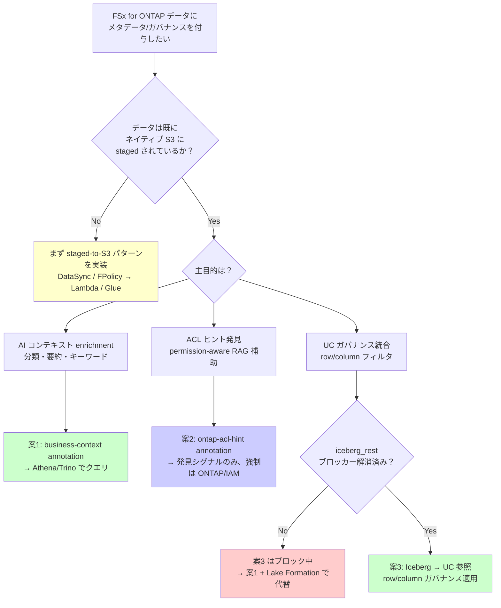

🌐 [English](../en/s3-annotations-governance-evaluation.md) | **日本語**

# S3 Annotations / Metadata 評価: Databricks UC × FSx for ONTAP S3 AP ガバナンス課題への提案

> **ステータス**: 評価初版（2026-06-18）。live 検証済み（ネイティブ S3）+ 公式ドキュメント確定。
> **Evidence tier**: 各主張に明記（**Public** = 公開情報で検証可能 / **Verified** = 本環境で実証 / **Project-context** = 内部前提 / **Hypothesis** = 仮説）。
> **検証環境**: AWS ap-northeast-1、boto3 1.43.32（AWS CLI 2.35.4 には新コマンド未搭載、2.35.7+ 必要）。
> **フレーミング**: vendor-versus ではなく right-tool-for-the-job。各オプションのトレードオフを対称に記載。

---

## エグゼクティブサマリー

- **対象課題**: FSx for ONTAP S3 AP に対する Databricks UC の External Location は登録できるが、それ経由の読み取りが払い出しセッションポリシーに拒否される（2026-08-12 計測）。本評価では S3 Annotations / Metadata が何を提案できるかを評価する
- **S3 Annotations の適用範囲**: ネイティブ Amazon S3 バケットのみ。FSx for ONTAP S3 AP には直接適用不可 → staged-to-S3 パターンが前提
- **3つの提案**: (1) AI コンテキスト enrichment（Bedrock 分類結果を annotation 付与）、(2) ACL ヒント発見シグナル（permission-aware RAG 補助、強制ではない）、(3) Iceberg 層でのガバナンス適用（UC ブロッカー解消待ち）
- **検証状況**: annotation 付与/往復は Verified（Case 1/2 実証済み）。annotation テーブル経由のスケールクエリは AWS ネイティブエンジン（Athena/Trino/Spark）でサポート済み、Databricks UC からの参照のみブロック中
- **重要な制約**: annotation は「発見・コンテキスト」であり「アクセス制御の強制」ではない。permission-aware RAG では二重チェック（annotation 発見 + ONTAP/IAM 強制）が必須
- **推奨アクション**: 案1（AI コンテキスト annotation）は即着手可能。案2/3 は設計 + ブロッカー解消待ち

## FAQ / よくある誤解

### Q1: S3 Annotations でアクセス制御を強制できるか？

**A**: **できません**。Annotations はオブジェクトに付随する記述メタデータであり、読み取り認可を強制しません。強制境界は引き続き ONTAP ファイルレベル ACL + FPolicy + S3 AP access point policy + IAM が担います。

> **発見 vs 強制の区別**: annotation を ACL 代替と誤解すると重大なセキュリティギャップが発生します。annotation はミュータブルなため、`s3:PutObjectAnnotation` 権限を持つ主体が改ざん可能です。発見シグナルとしてのみ使用し、認可判定には必ず ONTAP/IAM の実 ACL を参照してください。

### Q2: FSx for ONTAP S3 AP に直接 annotation を付与できるか？

**A**: **できません**。S3 Annotations / Metadata は Amazon S3 コントロールプレーンが管理するネイティブ汎用バケットのみが対象です。ONTAP S3 バケットは S3 名前空間外（`aws s3 ls` に現れない）のため、annotation API は適用不可です。有効なパスは staged-to-S3（FSx for ONTAP → DataSync/FPolicy/Glue → ネイティブ S3）のみ。

> **ONTAP S3 の構造的制約**: これは ONTAP S3 プロトコルの構造的制約です。ONTAP S3 は S3 互換 API を提供しますが、Amazon S3 のコントロールプレーン機能（Event Notifications、S3 Metadata、Annotations）は AWS マネージドサービス側の機能であり、ONTAP S3 エンドポイントには適用されません。

> **ただしオブジェクト*タグ*は別機構であり、こちらは動作する**（**Verified** 2026-08-12）。`PutObjectTagging` / `GetObjectTagging` / `DeleteObjectTagging` と `x-amz-meta-*` ユーザーメタデータは、S3 へのステージングなしに FSx for ONTAP S3 Access Point 上で直接サポートされる。タグは ONTAP ファイルとともに保存され、ある Access Point で書いたタグは同一ボリューム上の別 Access Point から読める。annotations とのトレードオフは実在する。1 MB のペイロードではなくオブジェクトあたり 10 タグであり、かつこの Access Point では**実質 ASCII 限定**（U+0100 以上の文字は大半の文字列で拒否される）。実測: [s3ap-object-tagging](../../verification-pack/s3ap-object-tagging/evidence/2026-08-12/evidence-record.yaml)。タグをテーブル列へ読み込む Databricks `_object_metadata` 列を含む設計上の含意: [databricks-file-type-evaluation](./databricks-file-type-evaluation.md)。

### Q3: 「attach」と「query」の違いは何か？

**A**: 2段階です:
1. **attach（付与）**: `PutObjectAnnotation` API でオブジェクトに annotation を付与。S3 Metadata 構成なしで**単体動作**（§4 で実証済み）
2. **query（クエリ）**: annotation テーブル有効化（`CreateBucketMetadataConfiguration` V2）後、Athena/Trino/Spark から `s3tablescatalog` 経由で大規模検索。有効化には backfill（分〜時間）+ IAM ロール設定が必要

> PoC では attach のみで十分価値があります（個別オブジェクトの `GetObjectAnnotation` で確認可能）。大規模クエリが必要になった段階で annotation テーブルを有効化してください。

### Q4: annotation テーブル有効化の backfill はなぜ遅延するのか？

**A**: S3 Metadata サービスがバケット内の全オブジェクトの annotation を Iceberg テーブル（S3 Tables 上）に集約するため、オブジェクト数に応じて分〜時間かかります。これは初回のみの処理で、有効化後は増分更新されます。

### Q5: annotation は無料か？

**A**: annotation ストレージ自体は S3 ストレージ料金に含まれます（annotation サイズ分の追加ストレージ課金）。annotation テーブル（S3 Metadata）は S3 Tables のストレージ + Athena/Trino のスキャン量で課金されます。大規模環境では staged S3 の二重化コストが主要コスト要因です。

> **コスト最適化**: コスト最適化の観点では、annotation サイズを最小化してください（JSON schema を compact に設計、不要フィールドを含めない）。また、annotation テーブルの Athena スキャンはパーティション pruning が効くため、annotation schema に `classification` や `source_volume` をトップレベルフィールドとして含めることでスキャンコストを削減できます。

### Q6: リアルタイムユースケースに使えるか？

**A**: **annotation は cold path（発見・コンテキスト）向け**です。backfill 遅延があるため、リアルタイムのホットパスには適しません。リアルタイム要件（コネクテッドカー telemetry、ストリーミング品質検査等）には Structured Streaming / Lakeflow / RT OLAP 基盤を使用してください。

> **ホット/コールドパスの分離**: 製造現場のリアルタイム品質判定は annotation ではなく、ストリーミング基盤（Kafka → Spark Structured Streaming → ClickHouse）で処理し、annotation は事後の発見・監査・トレーサビリティに使用するのが適切です。

> **リアルタイム OLAP**: リアルタイム品質アラートには ClickHouse Materialized View を Kafka から直接消費するパターンを使用してください。Annotations は事後分析と監査のコールドパスに位置づけ、ホットパスに配置しないでください。ClickHouse の `iceberg()` テーブル関数（23.8+）で annotation テーブルを読む場合も、バッチ enrichment（定期的なスナップショット参照）に限定してください。

### Q7: UC tags / Lake Formation LF-Tags との違いは？

**A**: 並行する別メカニズムです:
- **S3 Annotations**: オブジェクトレベルのリッチメタデータ（最大1MB/個）。AWS ネイティブエンジンから検索可能
- **UC tags**: Databricks 内のガバナンスメタデータ。ABAC（属性ベースアクセス制御）に使用
- **Lake Formation LF-Tags**: AWS 側の列/行レベル制御。credential vending で Athena/EMR に適用

annotation が UC/LF のガバナンス tag に**自動統合されることはありません**。annotation → tag マッピングは別途設計が必要です。

> **ガバナンス tag マッピング**: annotation を UC governance に寄与させたい場合、annotation の分類結果を定期バッチで UC tags にマッピングするパイプラインが必要です。現時点では自動連携 API は存在しません。

## 選択ガイド（意思決定フローチャート）



> **二段構え戦略**: 多くの組織は案3（UC 統合）を目標としますが、現時点では `iceberg_rest` ブロッカーが存在します。即時着手可能な案1 で価値を出しつつ、ブロッカー解消を待つ二段構え戦略を推奨します。

## OT/IT セキュリティ考慮事項

### annotation 書き込み権限の統制

annotation はミュータブルなため、書き込み権限の統制が必須です:

| 操作 | 必要権限 | 統制方針 |
|------|---------|---------|
| `PutObjectAnnotation` | `s3:PutObjectAnnotation` | annotation パイプライン専用 IAM ロールのみに付与。人間ユーザーには付与しない |
| `DeleteObjectAnnotation` | `s3:DeleteObjectAnnotation` | 同上。削除は再同期パイプラインのみが実行 |
| `GetObjectAnnotation` | `s3:GetObjectAnnotation` | 読み取りは分析ロール/RAG パイプラインに付与可能 |

> **書き込み権限の統制**: annotation 書き込み権限が未統制の場合、ACL ヒント（案2）の改ざんやなりすましが可能になり、発見シグナルの信頼性が損なわれます。S3 バケットポリシーで `s3:PutObjectAnnotation` を特定 IAM ロール（annotation パイプライン）にのみ許可し、他の全プリンシパルには Deny してください。

### FPolicy → annotation パイプラインのセキュリティ

```
FSx for ONTAP FPolicy (ファイル変更検知)
  ↓ VPC 内通信（Lambda ENI）
Lambda (annotation 生成/更新)
  ↓ IAM Role（最小権限）
S3 PutObjectAnnotation
```

**セキュリティ要件**:
- Lambda は VPC 内に配置（FSx for ONTAP ENI と同一サブネット）
- Lambda IAM ロールは対象バケット/プレフィックスの `s3:PutObjectAnnotation` のみ
- FPolicy → Lambda のイベントペイロードに機密データを含めない（パス + メタデータのみ）

### 製造データ分類と annotation 戦略

| データ分類 | annotation 戦略 | 例 |
|-----------|----------------|---|
| 公開（集計メトリクス） | AI 分類 annotation（案1） | `{"classification": "public", "category": "aggregate_metrics"}` |
| 内部（生センサーデータ） | ACL ヒント + 分類（案1+2） | `{"classification": "internal", "owner": "factory-a-team"}` |
| 機密（品質検査画像） | ACL ヒント + 暗号化フラグ（案2） | `{"classification": "confidential", "encryption": "SSE-KMS"}` |

> **保持ポリシー**: 製造データの annotation schema には `retention_days` フィールドを含めることを推奨します。S3 Lifecycle ルールと組み合わせて、規制要件（品質記録保持 7 年等）を annotation レベルで追跡し、保持期間違反を Athena クエリで検出できます。

### VPC Endpoint 要件

annotation パイプラインは以下へのアクセスが必要:
- FSx for ONTAP データ LIF（VPC 内）
- S3 VPC Gateway Endpoint（annotation API 呼び出し用）
- Bedrock VPC Endpoint（案1 の AI 分類で必要な場合）

## 段階的導入ステップ

| フェーズ | 目標 | 主要アクション | 完了基準 | 期間目安 |
|---------|------|-------------|---------|---------|
| **Phase 1**: annotation 付与 PoC | PutObjectAnnotation の動作確認 | サンプルデータで annotation 付与/取得往復、§4 スクリプト実行 | annotation 付与・読み取り成功 | 1日 |
| **Phase 2**: annotation テーブル有効化 | スケールクエリ基盤構築 | `CreateBucketMetadataConfiguration` V2 + IAM ロール設定、backfill 完了待ち | Athena から annotation テーブルクエリ成功 | 2-3日 |
| **Phase 3**: AI 分類パイプライン | Bedrock Vision → annotation 自動付与 | Lambda/Step Functions で画像/文書分類 → `PutObjectAnnotation` 自動化 | 新規ファイル stage 時に自動 annotation 付与 | 1-2週間 |
| **Phase 4**: ACL ヒント統合 | permission-aware 発見シグナル | FPolicy → Lambda → ACL ヒント annotation 付与、権限変更時の再同期 | ACL 変更が annotation に反映、staleness < 15分 | 2-3週間 |
| **Phase 5**: UC 統合（ブロッカー解消後） | Databricks ガバナンス適用 | `iceberg_rest` ブロッカー解消確認 → UC からの Iceberg 参照 → tag マッピング | UC 内で row/column ガバナンス + annotation 連携動作 | TBD（ブロッカー依存） |

> Phase 1-2 は独立して進行可能ですが、Phase 3 以降は CI/CD パイプラインへの annotation 生成ステップ組み込みが必要です。annotation schema のバージョン管理（`schema_version` フィールド）を Phase 1 から含めておくと、後続フェーズでの schema 進化が容易になります。

> **スキーマ進化**: annotation schema の破壊的変更（フィールド名変更、型変更等）が発生した場合の移行戦略を Phase 1 で定義してください。推奨パターン: (1) 新バージョンの annotation を `business-context-v2` として別名で付与、(2) 移行期間中は v1 と v2 を共存、(3) 下流パイプラインが v2 に移行完了後に v1 を削除。`schema_version` フィールドで Athena クエリ時にバージョンフィルタが可能です。

> **トレーサビリティ設計**: 自動車製造のトレーサビリティ annotation では、IATF 16949 の要求に対応するため以下のフィールドを含めてください: `lot_id`、`serial_number`、`production_order`、`work_center`、`inspection_result`、`defect_category`（該当時）、`operator_shift`、`equipment_id`。これにより品質問題発生時の原因追跡（8D レポート作成）が迅速化されます。

## 検証ステータスサマリ

| 項目 | ステータス | 検証日 | エビデンス |
|------|-----------|--------|-----------|
| S3 Annotations 付与/往復（PutObjectAnnotation） | ✅ **Verified** | 2026-06-18 | §4 スクリプト実行、ap-northeast-1 |
| S3 Annotations — ACL ヒント格納 | ✅ **Verified** | 2026-06-18 | §4 Case 2（owner/group/acl_hash 往復確認） |
| FSx for ONTAP S3 AP への直接 annotation 適用 | ❌ **不可確認** | 2026-06-18 | §3 構造的制約（ONTAP S3 は S3 名前空間外） |
| Annotation テーブル有効化 + Athena クエリ | ⚠️ **公式根拠で経路確定** | 2026-06 | AWS 公式ドキュメント確認。backfill 遅延のため live 未実施 |
| AWS ネイティブエンジンからのクエリ（Athena/Trino/Spark） | ✅ **公式サポート確認** | 2026-06 | `s3tablescatalog` 経由（§6） |
| Databricks UC からの annotation テーブル参照 | ❌ **ブロック中** | 2026-06 | `iceberg_rest` connection 未サポート |
| AI 分類パイプライン（Bedrock → annotation 自動付与） | 🔲 **設計のみ** | — | Phase 3 で実装予定 |
| ACL ヒント + permission-aware RAG 認可チェーン統合 | 🔲 **設計のみ** | — | Phase 4 で実装予定 |
| Source 変更/削除時の annotation 再同期 | 🔲 **設計のみ** | — | FPolicy トリガ設計待ち |
| Annotation schema バージョン管理 | 🔲 **設計のみ** | — | Phase 1 で `schema_version` フィールド含む |

---

## 関連ドキュメント

本評価は以下のドキュメントと連携しています:

- [FSx for ONTAP → Databricks UC 接続総合ガイド](./fsx-ontap-to-databricks-unity-catalog-guide.md) — UC 接続の全体像（annotation は補完レイヤー）
- [DataSync: FSx for ONTAP → S3 同期ガイド](./datasync-to-s3-guide.md) — staged-to-S3 パターンの実装手順（annotation の前提）
- [Kafka-ClickHouse-Unity Catalog 接続ガイド](./kafka-clickhouse-unity-catalog-connectivity.md) — ストリーミング基盤との分離（annotation は cold path）
- [互換性マトリクス](./compatibility-matrix.md) — プラットフォーム別 S3 Metadata / Annotations サポート状況

---

## 1. 背景: 記録済みのガバナンス課題

本リポジトリには、Databricks Unity Catalog（UC）と FSx for ONTAP の S3 Access Point（S3 AP）連携に関する制約が記録済みです（出典: [`integrations/databricks/README.md`](../../integrations/databricks/README.md) の "Support Confirmation, 2026-05"。**ロールベース表記**で、ケース番号・担当者名はステアリング方針どおり伏せています）。

- **UC External Location は S3 AP に対して登録できるが、それ経由の読み取りが認可されない**（根本原因は Databricks Support 2026-05 確認、機構は 2026-08-12 に実測。evidence tier: **Verified**）。払い出される down-scoped セッションポリシーがバケット形式 ARN で書かれているため、アクセスポイント ARN に対する認可評価と一致しない
- **根本原因**: 資格情報払い出し時に Databricks が生成する **session policy が S3 AP ARN を持たない** → 作成は成功し、そのロケーション経由の読み取りがすべて拒否される
- `access_point` フィールドは **GA リリースされず**、ドキュメントから削除。部分的成功は「サポートされたコードパスではない」
- Instance Profile + boto3 で読めるが **UC ガバナンスを完全にバイパス**（PoC のみ）

> 「Databricks Product Manager の発言」という人物・肩書での記録は存在しません。技術的な核心は上記 Support 確認ベースで記録済みです。本評価はその課題に対し、新発表の S3 Annotations / S3 Metadata で何が提案できるかを検討します。

---

## 2. S3 Annotations / S3 Metadata とは（evidence tier: Public）

- [S3 Annotations](https://aws.amazon.com/about-aws/whats-new/2026/06/amazon-s3-annotations-business-context/)（AWS Summit NY 2026, 2026-06）: S3 オブジェクトに大規模にカスタムメタデータを付与。1オブジェクト最大 1GB（最大1000個の名前付き annotation × 各1MB）。JSON/XML/YAML/テキスト。ミュータブル（オブジェクト書き換え不要で変更・削除）。copy/replication で追従、削除で消える（[AWS News Blog](https://aws.amazon.com/blogs/aws/amazon-s3-annotations-attach-rich-queryable-context-directly-to-your-objects/)）。
- [S3 Metadata](https://aws.amazon.com/s3/features/metadata/): オブジェクトメタデータを read-only な Apache Iceberg テーブル（journal / inventory / annotation テーブル）として自動提供。Athena・Iceberg 互換ツール・S3 Tables MCP server から検索可能。ap-northeast-1 を含む複数リージョンで GA。

> 出典の記述はライセンス遵守のため要約・言い換えしています。

---

## 3. 適用範囲の確定（本評価の最重要ポイント）

| 確認事項 | 結果 | 根拠 |
|---|---|---|
| S3 Metadata の対象バケット種別 | **汎用 Amazon S3 バケットのみ**（directory/table/vector 不可） | 公式: [Metadata table limitations](https://docs.aws.amazon.com/AmazonS3/latest/userguide/metadata-tables-restrictions.html)（**Public**） |
| S3 Metadata テーブルに ACL は含まれるか | **含まれない**（Lifecycle/Object Lock/ACL/replication status は対象外） | 同上（**Public**） |
| FSx for ONTAP S3（ONTAP S3 + S3 AP）に S3 Metadata 構成可能か | **不可** | 構造的理由: ONTAP S3 バケットは Amazon S3 コントロールプレーン外（`aws s3 ls` に現れない）。S3 Metadata API は Amazon S3 バケットを対象とする（**Verified**: 本環境で ONTAP S3 バケットは S3 名前空間に非存在を確認） |
| 注釈そのもの（PutObjectAnnotation）はネイティブ S3 で動作するか | **動作する** | **Verified**（§4） |

**結論**: S3 Annotations / Metadata は **直接 FSx for ONTAP S3 AP のデータには適用できません**。有効なのは **staged-to-S3 パターン**（FSx for ONTAP → FPolicy/DataSync/Glue/EMR → ネイティブ Amazon S3）に限られます。これは制約であると同時に、提案の前提条件です。

---

## 4. 検証結果（2026-06-18, ap-northeast-1, evidence tier: Verified）

再現スクリプト: [`integrations/iceberg-metadata-catalog/scripts/verify-s3-annotations.py`](../../integrations/iceberg-metadata-catalog/scripts/verify-s3-annotations.py)（使い捨てバケットを作成し、検証後に全リソースを削除）。

| ステップ | 結果 |
|---|---|
| ネイティブ S3 バケット作成 | ✅ |
| オブジェクト put | ✅ |
| `put_object_annotation`（`business-context`: AI 分類 JSON） | ✅ Case 1 実証 |
| `put_object_annotation`（`ontap-acl-hint`: owner/group/acl_hash/svm/volume/snapshot_id/allowed_principals JSON） | ✅ Case 2 実証 |
| `list_object_annotations` | ✅ count=2 |
| `get_object_annotation` 往復（owner=svc_quality 確認） | ✅ |
| クリーンアップ（注釈→オブジェクト→バケット削除） | ✅ 残存課金リソースなし |

補足: AWS CLI 2.35.4 には S3 Metadata/Annotations コマンドが未搭載（2.35.7+ 必要）。boto3 1.43.32 は全 API 搭載。

> **検証スコープ（annotation テーブル / クエリパス）**: §7 #3 の「annotation テーブル有効化 + クエリ」は、AWS 公式で以下が確定したため**本セッションでの live クエリは実施していません**（到達不能な実行で課金リソースを残すより公式根拠で確定する方が適切と判断）:
> - **有効化は backfill を伴い完了まで分〜時間**（[公式: Enabling annotation tables](https://docs.aws.amazon.com/AmazonS3/latest/userguide/metadata-tables-enable-disable-annotation-tables.html)）→ in-session で「クエリ可能」に到達できない + backfill 課金。
> - annotation/metadata テーブルは **AWS マネージドの S3 Tables（table bucket）** に作成される。**AWS ネイティブ/オープンエンジン（Athena/EMR/Trino/Spark/ClickHouse）からは `s3tablescatalog` 経由でクエリ可能（公式サポート、§6）**。Databricks UC からの参照（`iceberg_rest`）のみブロック。
> - `CreateBucketMetadataConfiguration` は **journal テーブル必須**（annotation だけでも journal を作成）+ S3 metadata サービスが assume する **IAM ロール**が必要（API 内省で確認）。

---

## 5. 提案の深掘り（3案）

### 案1: `iceberg-metadata-catalog` の Annotations 強化（最も自然・低リスク）

既存の [iceberg-metadata-catalog](../../integrations/iceberg-metadata-catalog/) は Bedrock Vision で非構造化ファイルを分類し、Iceberg メタデータカタログ + OpenSearch ベクトル検索を提供しています。S3 Annotations は**それを置き換えるのではなく補完**します（分類結果を**オブジェクト自身に付与**し、コピー/レプリケーションで追従させる自己記述レイヤー）。

> **2 段階であることに注意**: (1) 注釈の付与（`PutObjectAnnotation`）は S3 Metadata 構成なしで**単体動作**（§4 で実証）。(2) **大規模クエリには annotation テーブルの有効化が必須**（`CreateBucketMetadataConfiguration` V2 + annotation テーブル設定）。これは S3 metadata サービスが assume する **IAM ロール**を要し、テーブルは **AWS マネージドの table bucket（S3 Tables）** に作成される。有効化は **backfill（分〜時間）** を伴い、クエリには **S3 Tables カタログ連携（`s3tablescatalog`）** が必要（§6 の共有依存を参照）。

```
FSx for ONTAP (画像/文書)
  │ ① Snapshot / FlexClone で一貫した時点を取得（FSx for ONTAP steering 準拠）
  ▼
staged 取り込み: FPolicy→Lambda→S3 / DataSync / Glue / EMR
  │  ※ SnapMirror-to-S3 は FSx for ONTAP では非対応（本リポジトリ記録）
  ▼
Amazon S3 (汎用バケット)
  │ ② put_object_annotation: business-context = {分類, 信頼度, モデル, 言語, schema_version}
  │ ③ annotation テーブル有効化（S3 Metadata V2 + IAM ロール）
  ▼
S3 Metadata (annotation テーブル, Iceberg, S3 Tables 上)
  ├── Athena でクエリ
  └── S3 Tables MCP server でエージェント検索
```

| 観点 | 評価 |
|---|---|
| メリット | 分類コンテキストがオブジェクトに追従（copy/replication）。既存 Iceberg カタログ（OpenSearch 検索）を**補完**し、オブジェクト単位の自己記述性を付与。AWS ネイティブ |
| トレードオフ | staged S3 が前提（FSx for ONTAP 直アクセス不可）。annotation は最大1MB/個・1000個/オブジェクト。S3 Metadata は汎用バケットのみ。**クエリには annotation テーブル有効化（IAM ロール + table bucket）が追加で必要** |
| 既存カタログとの使い分け | 横断ベクトル/全文検索・大規模集計は既存 iceberg-metadata-catalog（OpenSearch/Iceberg）。オブジェクトに付随し copy で追従する自己記述コンテキストは annotation。両者は**補完関係** |
| 検証ステータス | annotation 付与/往復: **Verified**（§4）。annotation テーブル有効化 + Athena クエリ: §7 #3（未実施・runbook 化） |

### 案2: permission-aware の「発見シグナル」（重要な但し書きあり）

`owner` / `group` / `acl_hash` / `classification` / `snapshot_id` / `allowed_principals` を annotation 化し、S3 Metadata 経由で検索可能にします。

> ⚠️ **非交渉の前提（FSx for ONTAP AI/RAG steering 準拠）**: **これは「発見シグナル」であって「アクセス制御の強制」ではありません。** annotation はオブジェクトに付随する記述メタデータであり、読み取り認可を強制しません。permission-aware RAG では以下を必須とします:
> - ベクトル検索/メタデータフィルタの後、**LLM へ渡す直前に認可を再チェック**
> - 引用元リンク表示時にユーザーが実際にアクセス可能か再確認
> - **権限不明は deny by default**
> - 強制境界は引き続き **ONTAP ファイルレベル ACL + FPolicy + S3 AP access point policy + IAM**（補償コントロール）

> **ACL ヒントの導出**: ONTAP はマルチプロトコルのため、ヒントには **security style** を必須に含める:
> - `security_style`: `ntfs` / `unix` / `mixed`
> - **NTFS スタイル**: NTFS Security Descriptor（SDDL に正規化）から `acl_hash` を算出。`owner`=所有者 SID/名、`group`=プライマリグループ
> - **UNIX/NFSv4 スタイル**: NFSv4 ACE リスト（順序正規化）または mode bits から算出
> - `acl_hash` は**正規化後**の SHA-256（ACE 順序・表記揺れを吸収）。**ACL の実体ではなく変更検知用フィンガープリント**
> - 取得元は ONTAP REST API（FPolicy イベントで差分トリガ）。権限変更を検知し staged 側を再同期する

| 観点 | 評価 |
|---|---|
| メリット | 認可済みデータの**発見性**向上。ACL ハッシュで「権限変更検知」のトリガに利用可能 |
| トレードオフ | 強制力なし（二重チェック必須）。ACL の実体ではなくヒント。同期遅延で陳腐化リスク → acl_hash で検知し再同期 |
| 検証ステータス | annotation への ACL ヒント格納: **Verified**。認可チェーン統合: **未検証**（設計のみ） |

### 案3: ガバナンスを「効く層（Iceberg）」へ寄せる（Databricks 課題への直接アプローチ）

「S3 AP を UC に無理に載せる」のではなく、staged S3 の S3 Metadata Iceberg テーブル（+ 業務データの Iceberg テーブル）を **UC が参照**し、ガバナンスが機能する層で適用します。これにより S3 AP × session policy 問題を**構造的に回避**します。

```
staged S3 ──▶ S3 Metadata (Iceberg) / 業務 Iceberg テーブル
                     │
                     ├── Databricks UC（ネイティブ参照）── row/column ガバナンス（UC 内エンジン）
                     └── Athena / 他エンジン（Iceberg REST 経由）
```

> ⚠️ **既知制約（本リポジトリ記録）**:
> - **重要な区別**: S3 Metadata の **system テーブル**（journal/inventory/annotation）は **AWS マネージドの S3 Tables（table bucket）** 上にあり、UC からの参照には S3 Tables カタログ連携（`s3tablescatalog` / `iceberg_rest`）が必要 → 本パスは**ブロック中**（二重ブロッカー）。**現実的な UC 参照ターゲットは「業務用にユーザーが作成する通常 Iceberg テーブル（汎用 S3 上）」**であり、Case 3 はまず後者を対象とする。
> - **annotation は UC の tags/ABAC とは統合されない並行メカニズム**。annotation が UC ガバナンスに自動で寄与することはない（UC 側は別途 tag/ABAC を設定する必要がある）。
> - **UC の Row Filters / Column Masks は外部エンジン（Athena/EMR が Iceberg REST 経由）では適用されない**（出典: [`docs/ja/governance-and-compliance.md`](./governance-and-compliance.md)）。UC ガバナンスは「UC 内エンジン」では効くが、クロスエンジンでは強制されない。
> - iceberg-metadata-catalog の **Phase 4（Databricks 連携）はブロック中**（`iceberg_rest` connection 作成不可、AWS/Databricks サポート対応中）。案3 の UC 参照は本ブロッカー解消が前提。

| 観点 | 評価 |
|---|---|
| メリット | session policy / S3 AP 制約を回避。UC 内では row/column ガバナンス + lineage が機能 |
| トレードオフ | staged S3 が前提（ゼロコピー喪失）。クロスエンジン強制は不可。`iceberg_rest` ブロッカー依存 |
| 検証ステータス | **未検証**（Phase 4 ブロッカー解消待ち、§7） |

---

## 5.5 追加考慮事項

以下は、オープンテーブルフォーマット・カタログ連携、ストリーミング、リアルタイム OLAP、製造スケール、ガバナンスの観点で 3 案を補足する考慮事項です。

- **オープンテーブルフォーマット / カタログ連携**: S3 Metadata テーブルは Athena / EMR / Redshift / Trino / Spark から `s3tablescatalog`（Glue + Lake Formation）経由でクエリ可能。AWS ネイティブ query はサポート済で、ブロックは Databricks UC 参照のみ。
- **ストリーミング / リアルタイム**: annotation + S3 Metadata は backfill（分〜時間）のためリアルタイムのホットパス外。cold path（発見・コンテキスト）に位置づけ、リアルタイム（コネクテッドカー telemetry 等）はストリーミング基盤（Structured Streaming / Lakeflow / RT OLAP）が担う。annotation を hot path に置かない。
- **リアルタイム OLAP / オープンエンジン**: annotation テーブルは Iceberg のため、Trino / Spark / ClickHouse 等のオープンエンジンからも読める（Iceberg 互換エンドポイント）。Databricks UC ブロックを迂回する代替クエリエンジンとして選択可能（優劣ではなく適材適所）。ただし ClickHouse/Trino の Iceberg・S3 Tables 読み取りはバージョン/設定依存のため要検証（§7）。
- **自動車・製造スケール**: 大規模（車両 / 部品 / 画像が大量）では annotation 上限（1MB/個・1000個）+ backfill + staged S3 二重化のコストが顕在 → 保持 / ライフサイクル方針を設計に含める。製造トレーサビリティ（genealogy: `lot_id` / `serial` / `process_step` / `inspection_result`）は annotation の好適ユースケース。例:
  ```json
  { "schema": "mfg.traceability.v1", "lot_id": "L-2026-0042", "serial": "SN-000123",
    "process_step": "weld-03", "inspection_result": "pass", "ts": "2026-06-18T00:00:00Z" }
  ```
- **ガバナンス（2 平面の分離）**: staged S3 / Iceberg のガバナンスは 2 平面に分離する — (a) AWS 側 Lake Formation（S3 Tables に列/行レベル制御 + credential vending、Athena/EMR 等に適用）、(b) Databricks UC（`iceberg_rest` ブロック中）。annotation は発見シグナルであり、強制が必要な箇所はガバナンス tag（LF LF-Tags / UC tags）へマッピングする（annotation 単体では govern しない）。さらに annotation はミュータブルなため、`s3:PutObjectAnnotation` / `DeleteObjectAnnotation` の書き込み権限を最小権限で統制する必要がある。統制しないと ACL ヒント等の発見シグナルが改ざん/なりすまし可能 → 発見の信頼性が損なわれる。Case 2 は「読み取り認可の二重チェック」に加え「書き込み権限の統制」も前提とする。

---

## 6. 解決しないこと（honest assessment）

- S3 Annotations / Metadata は **UC が S3 AP を直接 govern できない問題そのものを解決しません**。これらは「発見・コンテキスト」であり「アクセス制御の強制」ではなく、かつ FSx for ONTAP S3 AP には適用されません。
- ゼロコピーは維持されません（staged-to-S3 が前提）。FSx for ONTAP 直アクセスの価値（ONTAP 機能の保持、マルチプロトコル）とはトレードオフ。
- annotation は ACL の実体ではないため、permission-aware の強制境界は引き続き ONTAP/IAM 側が担います。
- **クエリパスの共有基盤と分岐**: annotation/metadata テーブルは AWS マネージドの S3 Tables 上にあり、`s3tablescatalog`（Glue Data Catalog + Lake Formation 連携）を**共有基盤**とします。ただしサポート状況は**分岐**します:
>   - **AWS ネイティブ / オープンエンジン（Athena / EMR / Redshift / Trino / Spark / ClickHouse 等）からのクエリはサポート済み**（`s3tablescatalog` 経由。[公式: Querying metadata tables with AWS analytics services](https://docs.aws.amazon.com/AmazonS3/latest/userguide/metadata-tables-bucket-integration.html)）。Lake Formation で列/行レベル制御も可能。
>   - **Databricks UC からの参照（`iceberg_rest` connection）はブロック中**（Case 3）。
>   → よって**案1 のクエリパス（AWS ネイティブ）はブロックされておらず**、ブロックは案3（Databricks UC）のみ。両者は同一基盤（`s3tablescatalog` / Iceberg）を共有するが**サポートは分岐**する。attach 自体は単体動作、スケールクエリは上記基盤に乗る（backfill 分〜時間 + LF/IAM 設定が前提）。
- **annotation の鮮度（source 変更時）**: annotation はコピー/レプリケーションで追従しますが、staged S3 オブジェクトは FSx for ONTAP ソースの**派生コピー**です。FSx for ONTAP 側でファイルが更新/削除された場合、staged コピーと annotation の**再同期/無効化**が必要（source update → 再 stage + 再 annotate、source delete → staged + annotation 削除）。FPolicy 変更イベントを再同期トリガに利用します。

---

## 7. 検証項目 / オープンクエスチョン

| # | 項目 | 状態 |
|---|---|---|
| 1 | FSx for ONTAP S3 への S3 Metadata 構成不可の確定 | ✅ Public + Verified（§3） |
| 2 | ネイティブ S3 での annotation 往復 | ✅ Verified（§4） |
| 3 | annotation テーブル有効化 + クエリ（attach とは別段階）。**AWS ネイティブ/オープンエンジン（Athena/EMR/Trino/Spark/ClickHouse）からは `s3tablescatalog` 経由でクエリ可能（公式サポート）**。有効化は backfill 分〜時間 + LF/IAM 設定が前提。Databricks UC 参照のみブロック（§6） | ⚠️ 公式で経路確定（§4/§6）。live クエリは backfill 遅延のため本セッション未実施→runbook 化 |
| 4 | staged 取り込み時の annotation 付与パイプライン（FPolicy/Glue/Lambda のどこで付与） | 🔲 設計待ち |
| 5 | UC が S3 Metadata Iceberg テーブルを安定参照できるか（`iceberg_rest` ブロッカー） | 🔲 Phase 4 依存 |
| 6 | annotation の ACL ヒントと permission-aware RAG 認可チェーンの統合 | 🔲 設計待ち（強制ではないため二重チェック必須） |
| 7 | annotation 上限（1MB/個・1000個）と製造メタデータ量の適合 | 🔲 要見積もり |
| 8 | source 変更/削除時の annotation 再同期・無効化パイプライン（FPolicy トリガ） | 🔲 設計待ち |
| 9 | annotation schema のバージョン管理・進化（取り込み順序/dedup で権威版を確定） | 🔲 設計待ち |
| 10 | コスト次元の見積もり（annotation ストレージ / S3 Metadata テーブル(S3 Tables) / Athena scan / 取り込み compute / staged S3 二重化） | 🔲 要見積もり |
| 11 | 製造トレーサビリティ annotation schema（lot/serial/process/inspection）の設計・検証 | 🔲 設計待ち |
| 12 | annotation → ガバナンス tag（LF LF-Tags / UC tags）マッピング設計 | 🔲 設計待ち |
| 13 | オープンエンジン（Trino / ClickHouse）での annotation テーブル読み取り検証 | 🔲 未検証 |
| 14 | annotation 書き込み権限の統制（`s3:PutObjectAnnotation`/`Delete` の最小権限）— 発見シグナル改ざん防止 | 🔲 設計待ち |
| 15 | 製造 genealogy が 1000 イベント超の場合の構造化（配列）ペイロード設計（1MB/個上限考慮） | 🔲 設計待ち |

---

## 8. AWS / Databricks へのフィードバック

サポート提出用の草案は**非公開**（`.private/support-feedback/`、gitignore 対象、ケース番号は提出者が追記）に格納:

- **AWS 向け**: FSx for ONTAP S3 / ONTAP S3 バケットでの S3 Metadata・Annotations 対応（または ONTAP S3 メタデータの Iceberg 互換公開）の feature request。本評価の「汎用バケットのみ」制約が FSx for ONTAP ユースケースのギャップである旨。
- **Databricks 向け**: UC External Location の S3 AP session policy 対応、`iceberg_rest` connection 制約、S3 Metadata Iceberg テーブルの UC 参照可否。staged-to-Iceberg パスでの row/column ガバナンスのクロスエンジン強制。

公開リポジトリには **ケース番号・担当者名を含めません**（ロールベース表記のみ）。

---

## 9. 選定ガイド（用途に応じて / right-tool-for-the-job）

| 要件 | 推奨 | 補足 |
|---|---|---|
| FSx for ONTAP データの**発見性・AI コンテキスト**を AWS ネイティブで付与 | 案1（staged S3 + Annotations） | ゼロコピーは犠牲。スケールクエリは Athena/Trino/Spark/ClickHouse（`s3tablescatalog`）で可能・backfill/LF 設定要（§6） |
| permission-aware RAG の**発見補助** | 案2（ACL ヒント annotation） | 強制は ONTAP/IAM、二重チェック必須 |
| Databricks で**ガバナンス付き分析** | 案3（Iceberg 層へ寄せる） | `iceberg_rest` 解消が前提、クロスエンジン非強制に注意 |
| FSx for ONTAP 直アクセス + 強制ガバナンス（現時点） | Snowflake External Table / Athena + ONTAP ACL/FPolicy | S3 Annotations とは独立 |

---

## 参考

- [Amazon S3 Annotations (What's New, 2026-06)](https://aws.amazon.com/about-aws/whats-new/2026/06/amazon-s3-annotations-business-context/)
- [Amazon S3 annotations (AWS News Blog)](https://aws.amazon.com/blogs/aws/amazon-s3-annotations-attach-rich-queryable-context-directly-to-your-objects/)
- [S3 Metadata table limitations and restrictions](https://docs.aws.amazon.com/AmazonS3/latest/userguide/metadata-tables-restrictions.html)
- [Amazon S3 Metadata (feature page)](https://aws.amazon.com/s3/features/metadata/)
- 本リポジトリ: [Databricks integration README](../../integrations/databricks/README.md) / [governance-and-compliance](./governance-and-compliance.md) / [cross-repo-integration-strategy](./cross-repo-integration-strategy.md)
- 接続性視点（ストレージとは別: Kafka/ClickHouse の UC 接続・通信経路・ポート）: [Kafka/ClickHouse → Unity Catalog 接続](./kafka-clickhouse-unity-catalog-connectivity.md)

