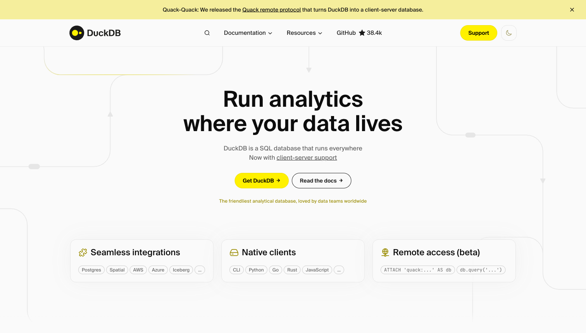
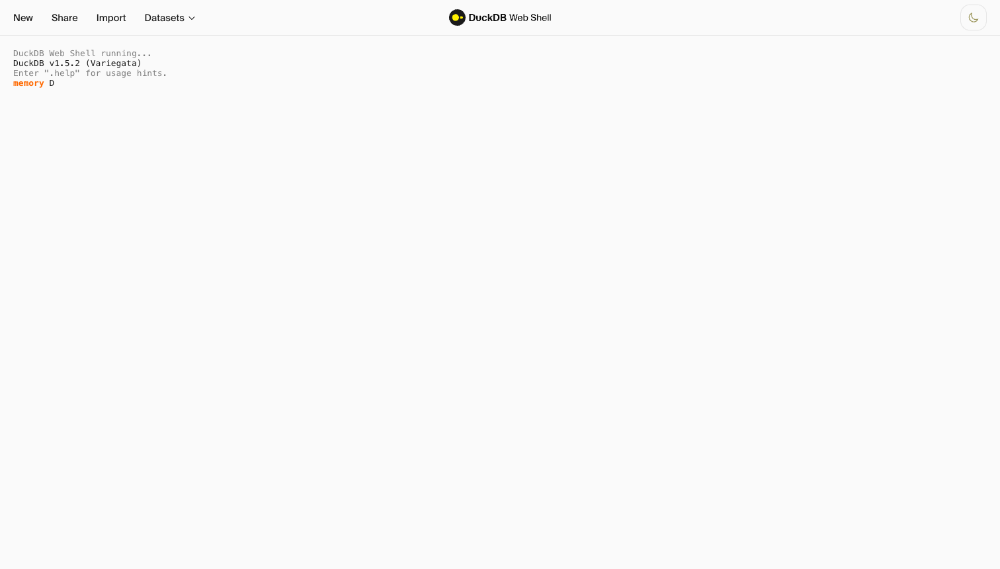
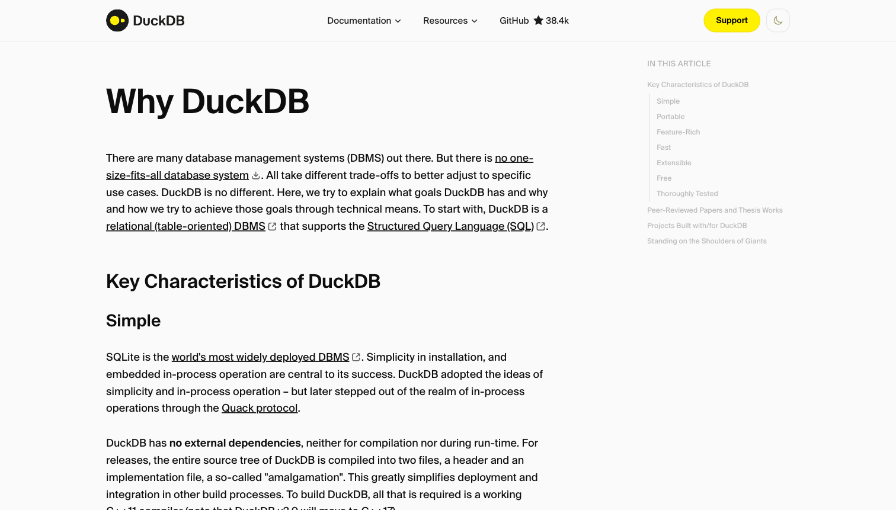

# DuckDB Integration

🌐 **English** | [日本語](docs/ja/README.md)

## Overview

Lightweight, in-process analytics on FSx for ONTAP data using DuckDB. No server required.
Deploy as Lambda for serverless pay-per-invocation queries, or run locally/on EC2.

## What is DuckDB?

DuckDB is an in-process SQL OLAP database — think "SQLite for analytics." It runs inside your application (Python, Node.js, Java, etc.) with zero infrastructure. No database server to manage, no cluster to provision.


*DuckDB — An in-process SQL OLAP database management system ([duckdb.org](https://duckdb.org))*

**Key characteristics:**
- **In-process**: Runs inside Lambda, your laptop, or any compute — no separate DB server
- **Columnar**: Optimized for analytical queries (aggregations, scans, JOINs)
- **Parquet-native**: Reads Parquet files directly from S3 with predicate pushdown
- **Zero-copy**: No ETL needed — query files where they are


*DuckDB Web Shell — Try SQL queries in your browser at [shell.duckdb.org](https://shell.duckdb.org)*

**Why DuckDB for FSx for ONTAP?**
- Query Parquet/CSV/JSON on FSx S3 AP without provisioning any analytics infrastructure
- Deploy in Lambda for serverless, pay-per-invocation analytics ($0 when idle)
- No session policy issues (unlike Databricks/Snowflake) — uses direct IAM credentials
- Sub-second queries on millions of rows


*DuckDB design philosophy — simple, portable, fast ([duckdb.org/why_duckdb](https://duckdb.org/why_duckdb))*

## Architecture

```
Lambda (arm64, Python 3.12)          Local / EC2
    │                                    │
    └── DuckDB (in-process)              └── DuckDB (in-process)
            │                                    │
            └── httpfs extension                  └── httpfs extension
                    │                                    │
                    └── S3 AP (VPC-scoped) ──→ FSx for ONTAP     └── S3 AP ──→ FSx for ONTAP
```

## Key Features

- **Zero infrastructure**: DuckDB runs in-process (no database server)
- **Lambda deployment**: Serverless, pay-per-invocation, arm64 Graviton
- **Parquet pushdown**: Predicate and projection pushdown for minimal data transfer
- **Write-back**: COPY results to FSx for ONTAP as Parquet/CSV
- **Sub-second queries**: Warm Lambda queries in 200-500ms

## Status: ✅ Functional Verified (2026-05-23)

Verified locally with DuckDB 1.4.4 + httpfs on FSx for ONTAP S3 AP (internet-origin).
- Read: 10K rows in 628ms, 5M rows in 779ms
- Aggregation: GROUP BY in 1.2s, Window function in 1.0s
- Write-back: COPY TO Parquet in 304ms
- Lambda deployment: Ready (template.yaml + handler.py complete)

## Quick Start

```bash
# Local queries
pip install duckdb boto3
python notebooks/01_local_queries.py --ap-alias <your-ap-alias>

# Lambda deployment
./lambda/build_layer.sh
./deploy.sh
python scripts/validate_connectivity.py
```

## Directory Structure

```
integrations/duckdb/
├── template.yaml                  ← CloudFormation (Lambda + Layer + IAM)
├── deploy.sh                      ← Deployment automation
├── params.example.json            ← Parameter template
├── lambda/
│   ├── handler.py                 ← Lambda function (DuckDB query executor)
│   └── build_layer.sh             ← Layer builder (Docker, arm64)
├── notebooks/
│   ├── 01_local_queries.py        ← Local DuckDB queries on FSx for ONTAP
│   ├── 02_pushdown_verification.py ← Predicate pushdown tests
│   └── 03_write_back.py           ← Write results to FSx for ONTAP
├── scripts/
│   ├── validate_connectivity.py   ← Connectivity validation
│   └── cleanup.sh                 ← Resource cleanup
└── tests/results/                 ← Query metrics output
```
