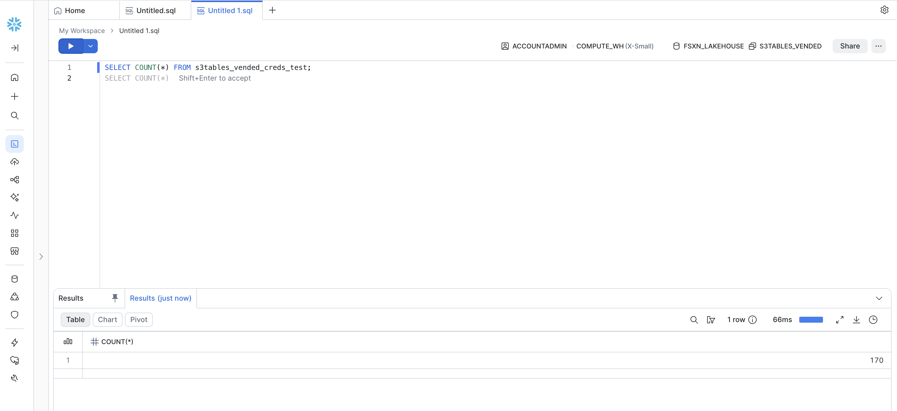
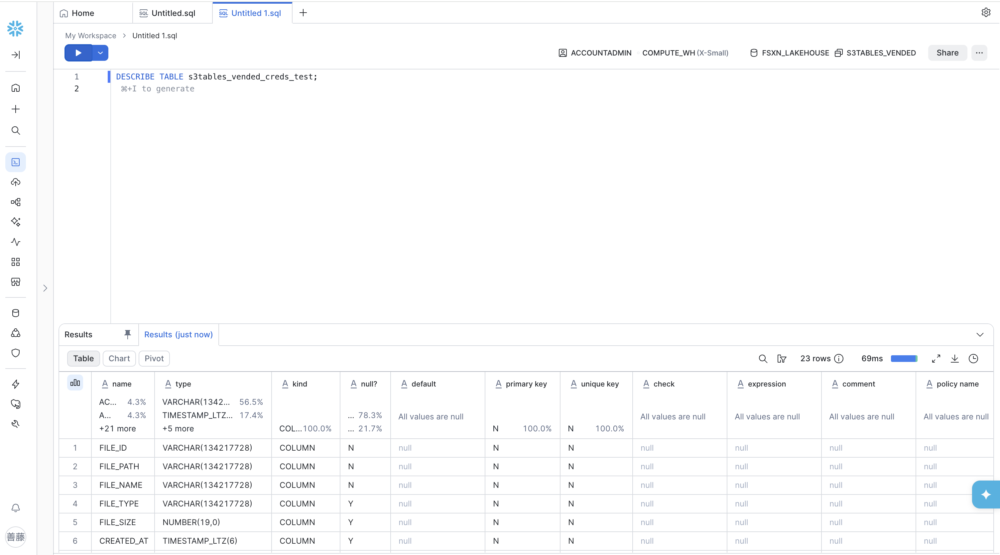
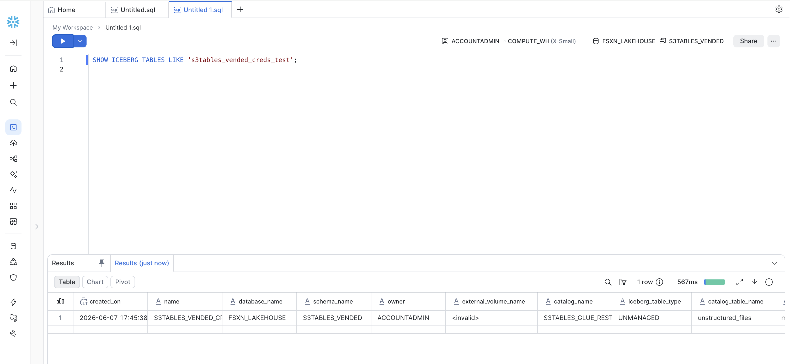
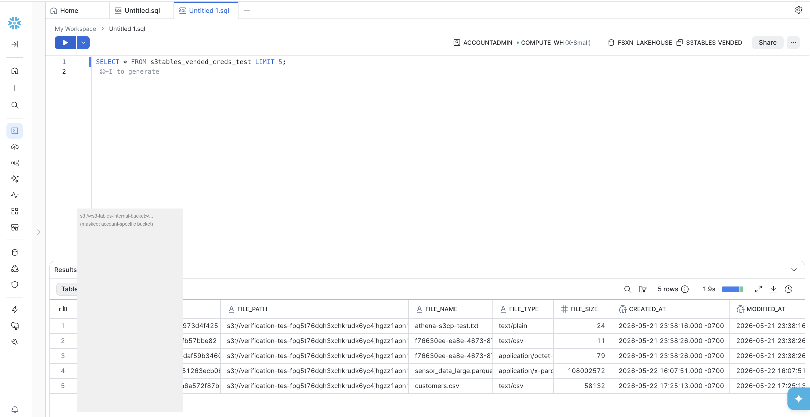
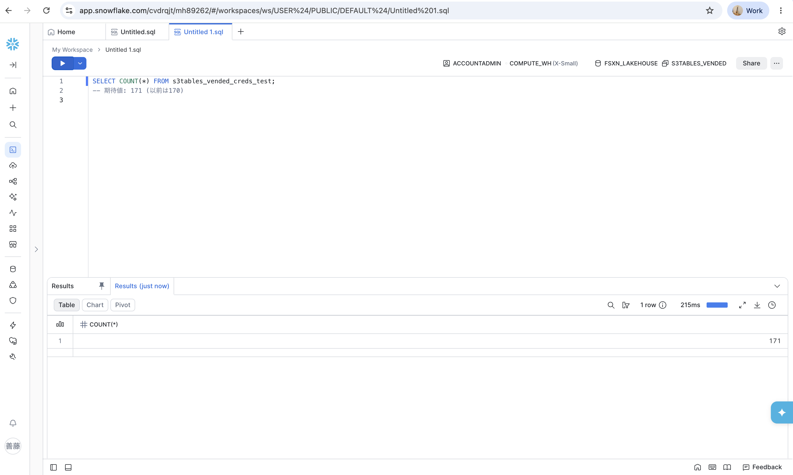
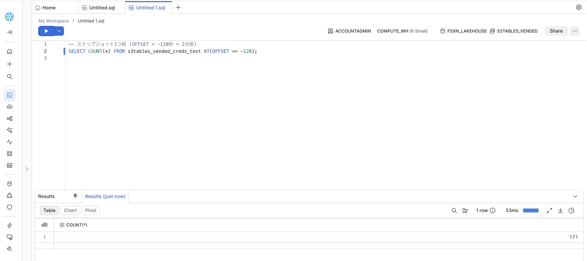

# Snowflake Glue REST + Vended Credentials Validation

🌐 [日本語](glue-rest-vended-credentials-validation-ja.md) | English

## Purpose

Document the validation of Snowflake CATALOG INTEGRATION with AWS Glue Iceberg REST endpoint using vended credentials for S3 Tables access.

## Current Status

| Step | Status | Notes |
|---|---|---|
| CATALOG INTEGRATION created | ✅ | `ICEBERG_REST` + `AWS_GLUE` + `VENDED_CREDENTIALS` (explicit) |
| DESCRIBE CATALOG INTEGRATION | ✅ | Returns valid IAM credentials |
| CREATE ICEBERG TABLE | ✅ | Success (5.9s) — 2026-06-05 |
| SELECT * LIMIT 5 | ✅ | 5 rows returned (1.6s) — 2026-06-05 |
| COUNT(*) | ✅ | 171 rows (215ms) — 2026-06-08; AUTO_REFRESH verified (170→171) |
| Time travel (AT/BEFORE TIMESTAMP) | ✅ | **VERIFIED**: AT(OFFSET => -1200) returns 170 (pre-append), current returns 171 |
| AUTO_REFRESH | ✅ | **VERIFIED**: PyIceberg append detected within 30s (170→171 auto-reflected) |
| Lake Formation column-level | ❌ | NOT enforced via VENDED_CREDENTIALS (2026-06-08) |
| Support case | ✅ | Case #01364260 — closed |

## ✅ BREAKTHROUGH: VENDED_CREDENTIALS Working (2026-06-05)

**Query ID**: `01c4e515-0003-ee3c-0003-6a86002d62b2`

### Evidence Screenshots









### AUTO_REFRESH + Time Travel Evidence (2026-06-08)


*AUTO_REFRESH: PyIceberg appended 1 record → Snowflake COUNT(*) automatically changed from 170 to 171 within 30 seconds*


*Time Travel: AT(OFFSET => -1200) returns 170 — the count before the append operation*

### Root Cause of Previous Failures

`ACCESS_DELEGATION_MODE` defaults to `EXTERNAL_VOLUME_CREDENTIALS` when not explicitly specified. In this mode, Snowflake validates storage access through the External Volume path, which triggers `ListObjectsV2` against S3 Tables internal buckets — an operation that returns `MethodNotAllowed`.

### Working Configuration

**Key requirements:**
1. `ACCESS_DELEGATION_MODE = VENDED_CREDENTIALS` must be **explicitly** specified in `REST_CONFIG`
2. Table must be created in a schema with **no default EXTERNAL_VOLUME**
3. `CREATE TABLE` must **not** include `EXTERNAL_VOLUME` parameter

```sql
-- 1. Catalog Integration (explicit VENDED_CREDENTIALS)
CREATE OR REPLACE CATALOG INTEGRATION s3tables_glue_rest_int
  CATALOG_SOURCE = ICEBERG_REST
  TABLE_FORMAT = ICEBERG
  CATALOG_NAMESPACE = 'metadata'
  REST_CONFIG = (
    CATALOG_URI = 'https://glue.ap-northeast-1.amazonaws.com/iceberg'
    CATALOG_API_TYPE = AWS_GLUE
    CATALOG_NAME = '<ACCOUNT_ID>:s3tablescatalog/fsxn-metadata-catalog'
    ACCESS_DELEGATION_MODE = VENDED_CREDENTIALS
  )
  REST_AUTHENTICATION = (
    TYPE = SIGV4
    SIGV4_IAM_ROLE = 'arn:aws:iam::<ACCOUNT_ID>:role/fsxn-snowflake-verification-role'
    SIGV4_SIGNING_REGION = 'ap-northeast-1'
  )
  ENABLED = TRUE;

-- 2. Schema WITHOUT default EXTERNAL_VOLUME
CREATE SCHEMA FSXN_LAKEHOUSE.S3TABLES_VENDED;
USE SCHEMA FSXN_LAKEHOUSE.S3TABLES_VENDED;

-- 3. Table WITHOUT EXTERNAL_VOLUME parameter
CREATE ICEBERG TABLE s3tables_vended_creds_test
  CATALOG = 's3tables_glue_rest_int'
  CATALOG_TABLE_NAME = 'unstructured_files';

-- 4. Query — SUCCESS
SELECT * FROM s3tables_vended_creds_test LIMIT 5;
-- Returns: FILE_ID, FILE_PATH, FILE_NAME, FILE_TYPE, FILE_SIZE, CREATED_AT, MODIFIED_AT
```

### AWS-Side Prerequisites

```bash
# Register S3 Tables resource with Lake Formation (--with-federation is REQUIRED)
aws lakeformation register-resource \
  --resource-arn "arn:aws:s3tables:ap-northeast-1:<ACCOUNT_ID>:bucket/fsxn-metadata-catalog" \
  --role-arn "arn:aws:iam::<ACCOUNT_ID>:role/S3TablesRoleForLakeFormation" \
  --with-federation

# IAM role policy must include:
# - glue:GetTable, glue:GetDatabase, glue:GetCatalog
# - lakeformation:GetDataAccess
# - s3tables:GetTableBucket, s3tables:GetTable, s3tables:GetNamespace
# - s3tables:GetTableData, s3tables:GetTableMetadataLocation

# IAM trust policy must include Snowflake's External ID
# (obtained from DESCRIBE CATALOG INTEGRATION output)
```

### How VENDED_CREDENTIALS Works (Confirmed)

In VENDED_CREDENTIALS mode:
1. Snowflake calls Glue REST `loadTable` with appropriate delegation headers
2. Lake Formation (via `GetTemporaryGlueTableCredentials`) returns temporary storage credentials
3. These credentials are included in the `loadTable` response config map
4. Snowflake uses these credentials to access data files directly
5. **No ListObjectsV2 is required** — Snowflake reads files by exact path from Iceberg metadata

### IAM Trust Policy (Required)

The IAM role's trust policy must allow Snowflake's IAM user to assume it:

```json
{
  "Version": "2012-10-17",
  "Statement": [
    {
      "Effect": "Allow",
      "Principal": {
        "AWS": "arn:aws:iam::465774455528:user/<snowflake-user-id>"
      },
      "Action": "sts:AssumeRole",
      "Condition": {
        "StringEquals": {
          "sts:ExternalId": "<external-id-from-describe-output>"
        }
      }
    }
  ]
}
```

> Get `<snowflake-user-id>` from `API_AWS_IAM_USER_ARN` and `<external-id>` from `API_AWS_EXTERNAL_ID` in `DESCRIBE CATALOG INTEGRATION` output. `465774455528` is Snowflake's shared infrastructure account (same for all customers).

## Historical Configuration (Before Fix)

> **Note**: The configuration below was from initial testing that FAILED.
> See "✅ BREAKTHROUGH" section above for the working configuration.

### Original Catalog Integration (FAILED — missing explicit ACCESS_DELEGATION_MODE)

```sql
CREATE OR REPLACE CATALOG INTEGRATION s3tables_glue_rest_int
  CATALOG_SOURCE = ICEBERG_REST
  TABLE_FORMAT = ICEBERG
  CATALOG_NAMESPACE = 'metadata'
  REST_CONFIG = (
    CATALOG_URI = 'https://glue.ap-northeast-1.amazonaws.com/iceberg'
    WAREHOUSE = '<ACCOUNT_ID>:s3tablescatalog/fsxn-metadata-catalog'
    CATALOG_API_TYPE = AWS_GLUE
  )
  REST_AUTHENTICATION = (
    TYPE = VENDED_CREDENTIALS
    CATALOG_IAM_ROLE_ARN = 'arn:aws:iam::<ACCOUNT_ID>:role/fsxn-snowflake-verification-role'
  )
  ENABLED = TRUE;
```

### DESCRIBE Output

```sql
DESCRIBE CATALOG INTEGRATION s3tables_glue_rest_int;
-- Returns:
-- API_AWS_IAM_USER_ARN: arn:aws:iam::465774455528:user/3u4g1000-s
-- API_AWS_EXTERNAL_ID: VP28055_SFCRole=4_XED90KG9gprirTrHg2DGl26RvB0=
```

### Failed CREATE ICEBERG TABLE

```sql
CREATE OR REPLACE ICEBERG TABLE test_metadata
  EXTERNAL_VOLUME = 'fsxn_s3tables_vol'  -- if needed
  CATALOG = 's3tables_glue_rest_int'
  CATALOG_TABLE_NAME = 'unstructured_files';
-- ERROR: Failed to retrieve credentials from the Catalog
```

## Validation Checklist

| Check | Status | Evidence |
|---|---|---|
| IAM trust policy includes Snowflake user ARN | ✅ | Trust policy updated |
| IAM role has Glue permissions (GetCatalog, GetDatabase, GetTable, etc.) | ✅ | Policy attached |
| IAM role has S3 Tables permissions | ✅ | s3tables:* granted |
| IAM role has Lake Formation permissions | ✅ | lakeformation:GetDataAccess |
| Lake Formation resource registered with --with-federation | ✅ | Required for credential vending |
| Lake Formation AllowFullTableExternalDataAccess = true | ✅ | Set for testing |
| Glue REST endpoint responds to Snowflake | ✅ | DESCRIBE returns credentials |
| ACCESS_DELEGATION_MODE = VENDED_CREDENTIALS explicit | ✅ | Critical fix |
| Schema has no default EXTERNAL_VOLUME | ✅ | S3TABLES_VENDED schema |
| CREATE TABLE without EXTERNAL_VOLUME parameter | ✅ | Working |
| Credential vending returns storage credentials | ✅ | **CONFIRMED WORKING 2026-06-05** |
| CREATE ICEBERG TABLE | ✅ | Success (5.9s) |
| SELECT * query | ✅ | 5 rows returned (1.6s) |
| SYSTEM$VERIFY_CATALOG_INTEGRATION | ✅ | "Statement executed successfully" |
| COUNT(*) | ✅ | 171 rows (215ms) — AUTO_REFRESH verified (PyIceberg append 170→171) |
| Time travel (AT/BEFORE TIMESTAMP) | ✅ | **VERIFIED**: AT(OFFSET => -1200) returns 170 (prior snapshot) |
| AUTO_REFRESH | ✅ | **VERIFIED**: 30s interval detected new Iceberg snapshot automatically |
| Lake Formation column-level permissions | ❌ | **NOT SUPPORTED** via VENDED_CREDENTIALS (2026-06-08). AllowFullTableExternalDataAccess=false blocks all access. |

## Debugging Steps

```sql
-- Step 1: Verify catalog integration
DESCRIBE CATALOG INTEGRATION s3tables_glue_rest_int;

-- Step 2: List namespaces (if supported)
SELECT SYSTEM$LIST_NAMESPACES_FROM_CATALOG('s3tables_glue_rest_int');

-- Step 3: List tables
SELECT SYSTEM$LIST_ICEBERG_TABLES_FROM_CATALOG('s3tables_glue_rest_int', 'metadata');

-- Step 4: Attempt table creation with verbose error
CREATE ICEBERG TABLE test_metadata
  CATALOG = 's3tables_glue_rest_int'
  CATALOG_TABLE_NAME = 'unstructured_files';
```

## Hypothesis History (Resolved)

### Original Hypothesis (CONFIRMED then RESOLVED)

**Initial finding (2026-06-01)**: The AWS Glue Iceberg REST endpoint does NOT implement the Iceberg REST `/credentials` endpoint. Calling `POST /v1/.../credentials` returns `UnknownOperationException`.

**Resolution (2026-06-05)**: This finding remains true, but is NOT the blocker. Lake Formation credential vending works through a proprietary mechanism (`GetTemporaryGlueTableCredentials`) that is triggered when `ACCESS_DELEGATION_MODE = VENDED_CREDENTIALS` is explicitly set. The credentials are returned within the `loadTable` response config map, not via a separate `/credentials` endpoint.

**Key insight**: The previous failures were caused by `ACCESS_DELEGATION_MODE` defaulting to `EXTERNAL_VOLUME_CREDENTIALS`, NOT by missing credential vending capability. When explicitly set to `VENDED_CREDENTIALS`, the Glue REST + Lake Formation stack correctly vends temporary credentials to Snowflake.

**Snowflake's expected credential format (officially confirmed by Snowflake Support 2026-06-02, Snowflake support confirmation)**:
When `ACCESS_DELEGATION_MODE = VENDED_CREDENTIALS`, Snowflake expects the Iceberg REST `loadTable` response to include the standard Apache Iceberg credential fields within the response configuration map:
- `s3.access-key-id` (required)
- `s3.secret-access-key` (required)
- `s3.session-token` (required)
- `s3.session-token-expires-at-ms` (optional)

Error 004174 occurs when these fields are absent from the response.

**Snowflake Support's progression analysis (confirmed 2026-06-02)**:
The error progression visible from the account confirms:
1. 004139 (Lake Formation permission errors) → metadata access blocked
2. 004174 (credential retrieval failure) → metadata resolved, but no storage credentials returned

This proves: Glue REST is reachable, catalog and table resolved successfully, request progresses beyond metadata auth, but Snowflake cannot obtain usable credential payload.

This is the root cause of Snowflake's "Failed to retrieve credentials from the Catalog" error:
- Snowflake's `VENDED_CREDENTIALS` mode expects the REST catalog to return short-lived storage credentials
- Glue REST uses SigV4 authentication instead — the caller must have its own IAM credentials to access S3 data
- This is a fundamental incompatibility between Snowflake's vended credentials model and Glue REST's SigV4 model

**Implications**:
1. Snowflake cannot use `VENDED_CREDENTIALS` with Glue REST for S3 Tables (confirmed limitation)
2. Trino/Spark can access Glue REST because they use their own IAM credentials (SigV4)
3. Snowflake may need to use an External Volume (with its own storage credentials) instead of vended credentials
4. This should be reported to both Snowflake and AWS support as a confirmed interoperability gap

**AWS Support clarification (2026-06-02)**:
Lake Formation **does** support credential vending for S3 Tables — but through its proprietary mechanism (`GetTemporaryGlueTableCredentials` / `lakeformation:GetDataAccess`), NOT the standard Iceberg REST `/credentials` API.

- **SigV4 clients (PyIceberg, EMR Spark, Athena, Redshift)**: Lake Formation credential vending works transparently. IAM role needs `lakeformation:GetDataAccess` + Lake Formation Application Integration enabled. No direct S3 permissions needed.
- **Snowflake**: Expects standard Iceberg REST `/credentials` response. Cannot call `lakeformation:GetDataAccess` directly. This proprietary mechanism is invisible to Snowflake.
- **Standard Glue tables (non-S3 Tables)**: Snowflake + Lake Formation works in **public preview** with `ACCESS_DELEGATION_MODE = VENDED_CREDENTIALS` [ref: Snowflake docs]. However, this does NOT extend to S3 Tables accessed via `s3tablescatalog`.
- **Feature request**: Submitted to AWS Glue/Lake Formation team for standard Iceberg REST `/credentials` endpoint implementation.

**Strategic paths for Snowflake + S3 Tables (UPDATED 2026-06-05)**:
| Timeline | Path | Status | Description |
|---|---|---|---|
| ✅ NOW | Glue REST + VENDED_CREDENTIALS | **WORKING** | Direct Iceberg query with explicit ACCESS_DELEGATION_MODE |
| ✅ NOW | External Stage + TO_FILE | **WORKING** | File AI analysis via S3 AP (Cortex COMPLETE) |
| Superseded | Metadata sync | Available but less needed | PyIceberg export → S3 → Snowflake COPY INTO |
| Superseded | ETL to standard Glue table | Available but less needed | Direct access now works |
| N/A | AWS implements `/credentials` | Not needed | Lake Formation proprietary mechanism works |

**Previous hypothesis** (now confirmed):
~~1. Glue REST `/v1/credentials` endpoint not returning expected format for S3 Tables federated catalog~~
→ CONFIRMED: The endpoint does not exist (UnknownOperationException)

## Alternative Paths Identified by Snowflake Support

### 1. Object Store Catalog Integration (Read-only, no credential vending needed)

Snowflake can read the Iceberg table directly from the metadata file using an External Volume, bypassing the REST catalog credential vending entirely.

```sql
-- Create Object Store catalog integration
CREATE OR REPLACE CATALOG INTEGRATION iceberg_object_store_int
  CATALOG_SOURCE = OBJECT_STORE
  TABLE_FORMAT = ICEBERG
  ENABLED = TRUE;

-- Create Iceberg table pointing to metadata file directly
CREATE ICEBERG TABLE FSXN_LAKEHOUSE.PUBLIC.s3tables_metadata
  EXTERNAL_VOLUME = 's3tables_metadata_vol'
  CATALOG = 'iceberg_object_store_int'
  METADATA_FILE_PATH = 'metadata/00001-fcb8fb99-20cb-4b72-84bb-012d2c85891c.metadata.json';
```

**Limitations**:
- Read-only access
- Requires manual refresh when metadata file location changes
- Must know the current metadata file path (changes on each commit)

**Challenge for S3 Tables**: The S3 Tables internal bucket path format may require additional investigation to determine if Snowflake's External Volume can resolve the internal S3 paths correctly.

### 2. Resolution Status (Updated 2026-06-08)

| Action | Owner | Status |
|---|---|---|
| Provide loadTable response evidence to Snowflake | Customer (us) | ✅ Done (2026-06-02) |
| Run SYSTEM$VERIFY_CATALOG_INTEGRATION | Customer (us) | ✅ Done — "Statement executed successfully" |
| Test with explicit VENDED_CREDENTIALS + no External Volume | Customer (us) | ✅ Done — **SUCCESS** (2026-06-05) |
| Report success to Snowflake Support | Customer (us) | ✅ Done (2026-06-08) |
| Validate AUTO_REFRESH, time travel, column-level | Customer (us) | ✅ Done (2026-06-08): AUTO_REFRESH ✅, Time Travel ✅, column-level ❌ |
| Snowflake Support response to follow-up questions | Snowflake | 🔄 Pending |
| Documentation improvement (KB article for S3 Tables + VENDED_CREDENTIALS) | Snowflake | 🔄 Requested (2026-06-08) |

## References

- [Snowflake: Vended credentials for Iceberg](https://docs.snowflake.com/en/user-guide/tables-iceberg-configure-catalog-integration-vended-credentials)
- [Snowflake: REST catalog integration](https://docs.snowflake.com/en/user-guide/tables-iceberg-configure-catalog-integration-rest)
- [Snowflake: How credentials vending works](https://www.snowflake.com/en/engineering-blog/iceberg-catalog-credentials/)
- [AWS: S3 Tables + Glue REST endpoint](https://docs.aws.amazon.com/AmazonS3/latest/userguide/s3-tables-integrating-glue-endpoint.html)
