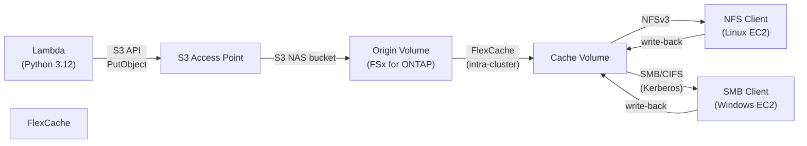

> 🌐 Language: [日本語](../ja/demo-guide-01-flexcache-same-region.md) | **English**

# Demo Guide: Lambda → S3 AP → FlexCache (NFS + SMB)

> **Time Required**: ~45min(if AD already deployed)/ ~90min(including new AD creation)
> **Cost**: ~$5–10（if deleted after verification）
> **Audience**: AWS/ONTAP beginners — copy-paste reproducible steps
> **ONTAP Version**: 9.17.1+（FSx for ONTAP 2nd Generation）

---

> ✅ **Validation Status**: E2E validated (2026-07-21, TC-09). All test cases PASS.
> Script: `scripts/validation/tc09-deploy-validate-teardown.sh`

## What This Demo Validates

```
Lambda (Python) ──S3 API──▶ S3 Access Point ──▶ Origin Volume (FSx for ONTAP)
                                                       │
                                                  FlexCache
                                                       │
                                                       ▼
                                               Cache Volume
                                              ┌────────┴────────┐
                                              │                  │
                                         NFS mount          SMB mount
                                        (Linux EC2)       (Windows EC2)
```




**Validation Points:**

| # | Validation Item | Protocol |
|:-:|---------|-----------|
| 1 | Lambda can write data to Origin Volume via S3 API | S3 |
| 2 | FlexCache Cache Volume is readable via NFS mount | NFS |
| 3 | FlexCache Cache Volume is readable via SMB mount | SMB (Kerberos) |
| 4 | Cache NFS write → readable from Origin (S3 AP) | NFS write-back |
| 5 | Cache SMB write → readable from Origin (S3 AP) | SMB write-back |
| 6 | Same data visible across all protocols | Cross-protocol |

---

## Prerequisites

### Required Tools

| Tool | Version | Verify |
|--------|-----------|-----------------|
| AWS CLI | v2.15+ | `aws --version` |
| jq | 1.6+ | `jq --version` |
| curl | 7.x+ | `curl --version` |
| Python | 3.12+ | `python3 --version` |

### AWS Resources (Existing or New)

| Resource | Create New? | Description |
|----------|:---------:|------|
| FSx for ONTAP (Cluster A) | Reuse existing | hosts Origin Volume |
| FSx for ONTAP (Cluster B)(optional) | Reuse existing or same cluster | hosts Cache Volume（single-cluster also works） |
| AWS Managed AD | New or existing | Required for SMB authentication |
| VPC + Private Subnets | Reuse existing | Same VPC as FSx for ONTAP |
| Secrets Manager | Reuse existing | fsxadmin credentials |

> **Getting Started**: If you don't have FSx for ONTAP yet, first deploy `shared/cloudformation/fsxn-s3ap-base.yaml`  to set up the environment (~45min).

---

## Step 0: Set Environment Variables

Set the variables used throughout this demo.**Replace values with your own environment settings.**

```bash
# === Replace with your environment ===
export AWS_REGION="ap-northeast-1"
export FS_ID="fs-0EXAMPLE1234abcde"           # FSx for ONTAP File System ID
export SVM_NAME="svm-lakehouse"                # SVM name to use
export SECRET_ARN="arn:aws:secretsmanager:ap-northeast-1:123456789012:secret:fsxn-admin-XXXXXX"

# === Defaults below (no change needed) ===
export ORIGIN_VOL="vol_tc09_origin"
export CACHE_VOL="vol_tc09_cache"
export S3AP_NAME="fsxn-tc09-flexcache"
export UNIX_USER="fsxadmin"
export CIFS_SHARE="tc09_share"
```

---

## Step 1: Verify ONTAP Management Endpoint

```bash
# Get FSx for ONTAP management IP
MGMT_IP=$(aws fsx describe-file-systems \
  --file-system-ids "$FS_ID" \
  --query 'FileSystems[0].OntapConfiguration.Endpoints.Management.IpAddresses[0]' \
  --output text --region "$AWS_REGION")

echo "Management IP: $MGMT_IP"
```

**Expected Output:**
```
Management IP: 198.51.100.10
```

```bash
# Get fsxadmin credentials
CREDS=$(aws secretsmanager get-secret-value \
  --secret-id "$SECRET_ARN" \
  --query SecretString --output text --region "$AWS_REGION")
ONTAP_USER=$(echo "$CREDS" | jq -r '.username')
ONTAP_PASS=$(echo "$CREDS" | jq -r '.password')

# Verify ONTAP REST API connectivity
curl -sk -u "${ONTAP_USER}:${ONTAP_PASS}" \
  "https://${MGMT_IP}/api/cluster?fields=version" | jq '.version'
```

**Expected Output:**
```json
{
  "full": "NetApp Release 9.17.1P7D1",
  "generation": 9,
  "major": 17,
  "minor": 1
}
```

> **Troubleshooting**: `curl: (7) Failed to connect` → Verify Security Group allows port 443. Access from your IP or VPC CIDR is required.

---

## Step 2: Deploy AD Environment (for SMB authentication)

Active Directory is required for SMB access. Skip if AD is already available.

```bash
# Deploy AD environment (AWS Managed AD, ~20 minutes)
aws cloudformation create-stack \
  --stack-name tc09-ad-env \
  --template-body file://shared/templates/demo-ad-environment.yaml \
  --parameters \
    ParameterKey=ADPattern,ParameterValue=ManagedAD \
    ParameterKey=VpcId,ParameterValue=vpc-0EXAMPLE \
    ParameterKey=PrivateSubnetId1,ParameterValue=subnet-0EXAMPLE1 \
    ParameterKey=PrivateSubnetId2,ParameterValue=subnet-0EXAMPLE2 \
    ParameterKey=DomainName,ParameterValue=lakehouse.example.com \
    ParameterKey=DomainShortName,ParameterValue=LAKEHOUSE \
    ParameterKey=AdminPassword,ParameterValue='YourP@ssw0rd123' \
  --capabilities CAPABILITY_NAMED_IAM \
  --region "$AWS_REGION"

# Wait for completion(15-30 minutes)
echo "Creating AD... (takes 15-30 minutes)"
aws cloudformation wait stack-create-complete --stack-name tc09-ad-env
echo "AD creation complete"
```

```bash
# Get AD DNS IPs
AD_DNS_IPS=$(aws cloudformation describe-stacks \
  --stack-name tc09-ad-env \
  --query 'Stacks[0].Outputs[?OutputKey==`DirectoryDnsIps`].OutputValue' \
  --output text --region "$AWS_REGION")
echo "AD DNS IPs: $AD_DNS_IPS"
```

**Expected Output:**
```
AD DNS IPs: 198.51.100.50,198.51.100.51
```

---

## Step 3: Join SVM to AD Domain

```bash
# Join SVM to AD domain
./shared/scripts/demo-ad-join-svm.sh \
  --fsxn-mgmt-ip "$MGMT_IP" \
  --svm-name "$SVM_NAME" \
  --domain "lakehouse.example.com" \
  --dns-ips "$AD_DNS_IPS" \
  --secret-arn "$SECRET_ARN"
```

**Expected Output:**
```
╔══════════════════════════════════════════════════════════════╗
║  FSx for ONTAP — AD Domain Join                             ║
╚══════════════════════════════════════════════════════════════╝

  ℹ SVM: svm-lakehouse
  ℹ Domain: lakehouse.example.com
  ℹ DNS: 198.51.100.50,198.51.100.51
  ℹ CIFS Server: SVM_LAKEHOUSE

━━━ Step 1: Retrieve Credentials ━━━
  ✓ AD credentials retrieved (user: Admin)

━━━ Step 2: Get SVM UUID ━━━
  ✓ SVM UUID: xxxxxxxx-xxxx-xxxx-xxxx-xxxxxxxxxxxx

━━━ Step 3: Configure DNS ━━━
  ✓ DNS configured on SVM

━━━ Step 4: Join AD Domain (CIFS Server Create) ━━━
  ✓ CIFS server created — SVM joined to lakehouse.example.com

━━━ Step 5: Verify Domain Membership ━━━
  ✓ SVM 'svm-lakehouse' is joined to domain 'lakehouse.example.com'
```

> **Troubleshooting**: "CIFS server creation failed" → Verify AD DNS IPs are reachable from SVM. Ensure SG allows TCP 53, 88, 389, 445, 636.

---

## Step 4: Create Origin Volume + Attach S3 AP

```bash
# Get SVM UUID
SVM_UUID=$(curl -sk -u "${ONTAP_USER}:${ONTAP_PASS}" \
  "https://${MGMT_IP}/api/svm/svms?name=${SVM_NAME}&fields=uuid" \
  | jq -r '.records[0].uuid')

# Create Origin Volume (UNIX security style, 10GB)
curl -sk -u "${ONTAP_USER}:${ONTAP_PASS}" \
  -X POST "https://${MGMT_IP}/api/storage/volumes" \
  -H "Content-Type: application/json" \
  -d "{
    \"name\": \"${ORIGIN_VOL}\",
    \"svm\": {\"name\": \"${SVM_NAME}\"},
    \"size\": 10737418240,
    \"style\": \"flexvol\",
    \"nas\": {
      \"path\": \"/${ORIGIN_VOL}\",
      \"security_style\": \"unix\",
      \"unix_permissions\": \"0777\"
    },
    \"guarantee\": {\"type\": \"none\"}
  }" | jq '{job: .job.uuid, status: .job.state}'
```

**Expected Output:**
```json
{
  "job": "xxxxxxxx-xxxx-xxxx-xxxx-xxxxxxxxxxxx",
  "status": "queued"
}
```

```bash
# Verify volume creation (wait 10s)
sleep 10

# Get FSx Volume ID
VOL_ID=$(aws fsx describe-volumes \
  --filters Name=file-system-id,Values="$FS_ID" \
  --query "Volumes[?Name=='${ORIGIN_VOL}'].VolumeId" \
  --output text --region "$AWS_REGION")
echo "Volume ID: $VOL_ID"
```

```bash
# Attach S3 Access Point
aws fsx create-and-attach-s3-access-point \
  --name "$S3AP_NAME" \
  --type ONTAP \
  --ontap-configuration "{
    \"VolumeId\": \"${VOL_ID}\",
    \"FileSystemIdentity\": {
      \"Type\": \"UNIX\",
      \"UnixUser\": {\"Name\": \"${UNIX_USER}\"}
    }
  }" \
  --region "$AWS_REGION" | jq '{Name: .S3AccessPoint.Name, Status: .S3AccessPoint.Lifecycle}'
```

**Expected Output:**
```json
{
  "Name": "fsxn-tc09-flexcache",
  "Status": "CREATING"
}
```

```bash
# Wait for S3 AP to become AVAILABLE (30-60s)
echo "Creating S3 AP..."
while true; do
  STATUS=$(aws fsx describe-s3-access-points \
    --filters Name=file-system-id,Values="$FS_ID" \
    --query "S3AccessPoints[?Name=='${S3AP_NAME}'].Lifecycle" \
    --output text --region "$AWS_REGION" 2>/dev/null || echo "CHECKING")
  echo "  Status: $STATUS"
  [[ "$STATUS" == "AVAILABLE" ]] && break
  sleep 10
done

# Get S3 AP Alias (used for subsequent S3 operations)
S3AP_ALIAS=$(aws fsx describe-s3-access-points \
  --filters Name=file-system-id,Values="$FS_ID" \
  --query "S3AccessPoints[?Name=='${S3AP_NAME}'].S3AccessPointConfiguration.Alias" \
  --output text --region "$AWS_REGION")
echo "S3 AP Alias: $S3AP_ALIAS"
```

**Expected Output:**
```
S3 AP Alias: fsxn-tc09-flexcache-xxxxxxxxxxxx-ext-s3alias
```

---

## Step 5: Deploy Lambda Writer Function

Create a Lambda function that writes test data via S3 AP.

```bash
# Create Lambda code
mkdir -p /tmp/tc09-lambda
cat > /tmp/tc09-lambda/lambda_function.py << 'EOF'
import boto3
import json
import time
import os

def handler(event, context):
    """Write test data to FSx for ONTAP Origin Volume via S3 AP"""
    s3 = boto3.client('s3')
    ap_alias = os.environ.get('S3AP_ALIAS', event.get('ap_alias', ''))
    prefix = event.get('prefix', 'demo-data')
    ts = int(time.time())

    files = {
        f'{prefix}/sensor-001.json': json.dumps({"sensor_id": "S001", "temperature": 23.5, "humidity": 65, "ts": ts}),
        f'{prefix}/sensor-002.json': json.dumps({"sensor_id": "S002", "temperature": 24.1, "humidity": 62, "ts": ts}),
        f'{prefix}/sensor-003.json': json.dumps({"sensor_id": "S003", "temperature": 22.8, "humidity": 70, "ts": ts}),
        f'{prefix}/metrics.csv': f"id,value,timestamp\n1,100,{ts}\n2,200,{ts}\n3,300,{ts}\n",
        f'{prefix}/config.json': json.dumps({"version": "1.0", "test_id": "tc09", "created_at": ts}),
    }

    results = []
    for key, body in files.items():
        resp = s3.put_object(Bucket=ap_alias, Key=key, Body=body.encode('utf-8'))
        results.append({
            "key": key,
            "etag": resp['ETag'],
            "http_status": resp['ResponseMetadata']['HTTPStatusCode'],
            "size_bytes": len(body.encode('utf-8'))
        })
        print(f"Written: {key} ({len(body)} bytes)")

    # Verify write
    list_resp = s3.list_objects_v2(Bucket=ap_alias, Prefix=prefix)
    listed_keys = [obj['Key'] for obj in list_resp.get('Contents', [])]

    return {
        "statusCode": 200,
        "written": len(results),
        "listed": len(listed_keys),
        "files": results,
        "verification": "PASS" if len(listed_keys) == len(files) else "PARTIAL"
    }
EOF

# Create ZIP package
cd /tmp/tc09-lambda && zip -j function.zip lambda_function.py && cd -
```

```bash
# Create IAM role (for Lambda execution)
aws iam create-role \
  --role-name tc09-lambda-writer-role \
  --assume-role-policy-document '{
    "Version": "2012-10-17",
    "Statement": [{
      "Effect": "Allow",
      "Principal": {"Service": "lambda.amazonaws.com"},
      "Action": "sts:AssumeRole"
    }]
  }' --region "$AWS_REGION" | jq '.Role.Arn'

# Attach S3 AP access policy
ACCOUNT_ID=$(aws sts get-caller-identity --query Account --output text)
aws iam put-role-policy \
  --role-name tc09-lambda-writer-role \
  --policy-name S3APWritePolicy \
  --policy-document "{
    \"Version\": \"2012-10-17\",
    \"Statement\": [{
      \"Effect\": \"Allow\",
      \"Action\": [\"s3:PutObject\", \"s3:GetObject\", \"s3:ListBucket\", \"s3:GetBucketLocation\"],
      \"Resource\": [
        \"arn:aws:s3:${AWS_REGION}:${ACCOUNT_ID}:accesspoint/${S3AP_NAME}\",
        \"arn:aws:s3:${AWS_REGION}:${ACCOUNT_ID}:accesspoint/${S3AP_NAME}/object/*\"
      ]
    }]
  }"

aws iam attach-role-policy \
  --role-name tc09-lambda-writer-role \
  --policy-arn arn:aws:iam::aws:policy/service-role/AWSLambdaBasicExecutionRole

# Wait for IAM role propagation (10s)
sleep 10
```

```bash
# Create Lambda function
ROLE_ARN="arn:aws:iam::${ACCOUNT_ID}:role/tc09-lambda-writer-role"

aws lambda create-function \
  --function-name tc09-s3ap-writer \
  --runtime python3.12 \
  --architectures arm64 \
  --handler lambda_function.handler \
  --role "$ROLE_ARN" \
  --zip-file fileb:///tmp/tc09-lambda/function.zip \
  --timeout 30 \
  --memory-size 256 \
  --environment "Variables={S3AP_ALIAS=${S3AP_ALIAS}}" \
  --region "$AWS_REGION" | jq '{FunctionName, State, Runtime}'
```

**Expected Output:**
```json
{
  "FunctionName": "tc09-s3ap-writer",
  "State": "Pending",
  "Runtime": "python3.12"
}
```

---

## Step 6: Write Data with Lambda

```bash
# Invoke Lambda to write test data
aws lambda invoke \
  --function-name tc09-s3ap-writer \
  --payload '{"prefix": "demo-data"}' \
  --cli-binary-format raw-in-base64-out \
  /tmp/tc09-lambda-result.json \
  --region "$AWS_REGION"

# Check results
cat /tmp/tc09-lambda-result.json | jq .
```

**Expected Output:**
```json
{
  "statusCode": 200,
  "written": 5,
  "listed": 5,
  "verification": "PASS",
  "files": [
    {"key": "demo-data/sensor-001.json", "etag": "\"...\"", "http_status": 200, "size_bytes": 72},
    {"key": "demo-data/sensor-002.json", "etag": "\"...\"", "http_status": 200, "size_bytes": 72},
    {"key": "demo-data/sensor-003.json", "etag": "\"...\"", "http_status": 200, "size_bytes": 72},
    {"key": "demo-data/metrics.csv", "etag": "\"...\"", "http_status": 200, "size_bytes": 54},
    {"key": "demo-data/config.json", "etag": "\"...\"", "http_status": 200, "size_bytes": 52}
  ]
}
```

```bash
# Directly verify file listing via S3 AP
aws s3api list-objects-v2 \
  --bucket "$S3AP_ALIAS" \
  --prefix "demo-data/" \
  --region "$AWS_REGION" | jq '.Contents[] | {Key, Size, LastModified}'
```

> **Key Takeaway**: Lambda → S3 API → FSx for ONTAP Origin Volume write succeeded. Origin Volume contains 5 files.

---

## Step 7: Create FlexCache Cache Volume

Create a Cache Volume using the Origin Volume as FlexCache Origin.

```bash
# Create SVM Peering (required even for same-cluster FlexCache between different SVMs)
# Skip if same SVM

# Get Origin Volume UUID
ORIGIN_UUID=$(curl -sk -u "${ONTAP_USER}:${ONTAP_PASS}" \
  "https://${MGMT_IP}/api/storage/volumes?name=${ORIGIN_VOL}&svm.name=${SVM_NAME}&fields=uuid" \
  | jq -r '.records[0].uuid')
echo "Origin Volume UUID: $ORIGIN_UUID"

# Create FlexCache Cache Volume (60GB minimum, use_tiered_aggregate required)
curl -sk -u "${ONTAP_USER}:${ONTAP_PASS}" \
  -X POST "https://${MGMT_IP}/api/storage/volumes" \
  -H "Content-Type: application/json" \
  -d "{
    \"name\": \"${CACHE_VOL}\",
    \"svm\": {\"name\": \"${SVM_NAME}\"},
    \"size\": 64424509440,
    \"type\": \"rw\",
    \"style\": \"flexgroup\",
    \"use_tiered_aggregate\": true,
    \"nas\": {
      \"path\": \"/${CACHE_VOL}\"
    },
    \"flexcache\": {
      \"fill_policy\": \"demand\",
      \"dr_cache\": false,
      \"writeback\": {\"enabled\": true},
      \"origins\": [{
        \"volume\": {\"name\": \"${ORIGIN_VOL}\"},
        \"svm\": {\"name\": \"${SVM_NAME}\"}
      }]
    }
  }" | jq '{job_uuid: .job.uuid, state: .job.state}'
```

**Expected Output:**
```json
{
  "job_uuid": "xxxxxxxx-xxxx-xxxx-xxxx-xxxxxxxxxxxx",
  "state": "queued"
}
```

```bash
# Wait for FlexCache creation (30-60s)
echo "Creating FlexCache..."
sleep 30

# Check FlexCache status
curl -sk -u "${ONTAP_USER}:${ONTAP_PASS}" \
  "https://${MGMT_IP}/api/storage/volumes?name=${CACHE_VOL}&fields=state,flexcache,type" \
  | jq '.records[0] | {name, state, type, flexcache_origin: .flexcache.origins[0].volume.name}'
```

**Expected Output:**
```json
{
  "name": "vol_tc09_cache",
  "state": "online",
  "type": "rw",
  "flexcache_origin": "vol_tc09_origin"
}
```

> **Troubleshooting**:
> - "size too small" → FlexCache is FlexGroup type, minimum 50GB. Specify `64424509440` (60GB) or larger.
> - "aggregate not found" → `use_tiered_aggregate: true` is required (FSx for ONTAP uses FabricPool aggregate).
> - "SVM peer required" → For different SVMs, create SVM Peering first.

---

## Step 8: Create SMB Share (on Cache Volume)

```bash
# Create CIFS (SMB) share on Cache Volume
curl -sk -u "${ONTAP_USER}:${ONTAP_PASS}" \
  -X POST "https://${MGMT_IP}/api/protocols/cifs/shares" \
  -H "Content-Type: application/json" \
  -d "{
    \"svm\": {\"name\": \"${SVM_NAME}\"},
    \"name\": \"${CIFS_SHARE}\",
    \"path\": \"/${CACHE_VOL}\",
    \"comment\": \"TC-09 FlexCache SMB verification share\"
  }" | jq .
```

**Expected Output:**
```json
{
  "num_records": 1,
  "records": [{"name": "tc09_share", "path": "/vol_tc09_cache"}]
}
```

```bash
# Verify share
curl -sk -u "${ONTAP_USER}:${ONTAP_PASS}" \
  "https://${MGMT_IP}/api/protocols/cifs/shares?svm.name=${SVM_NAME}&name=${CIFS_SHARE}" \
  | jq '.records[] | {name, path, comment}'
```

---

## Step 9: Verify NFS Export Policy

```bash
# Check Cache Volume export policy
curl -sk -u "${ONTAP_USER}:${ONTAP_PASS}" \
  "https://${MGMT_IP}/api/storage/volumes?name=${CACHE_VOL}&fields=nas.export_policy" \
  | jq '.records[0].nas.export_policy'

# Check default policy rules (ensure 0.0.0.0/0 is allowed)
curl -sk -u "${ONTAP_USER}:${ONTAP_PASS}" \
  "https://${MGMT_IP}/api/protocols/nfs/export-policies?svm.name=${SVM_NAME}&name=default&fields=rules" \
  | jq '.records[0].rules[] | {index, clients: .clients[].match, ro_rule, rw_rule, superuser}'
```

**Expectedされる出力例:**
```json
{
  "index": 1,
  "clients": "0.0.0.0/0",
  "ro_rule": ["sys"],
  "rw_rule": ["sys"],
  "superuser": ["sys"]
}
```

> NFS with `AUTH_SYS`  allowing access from all subnets is the minimum demo configuration.Restrict by CIDR or Kerberos in production.

---

## Step 10: NFS Data Read Verification (Linux EC2)

Mount Cache Volume via NFS from a Linux EC2 instance and read data written by Lambda.

```bash
# Get Data LIF IP
DATA_LIF=$(curl -sk -u "${ONTAP_USER}:${ONTAP_PASS}" \
  "https://${MGMT_IP}/api/network/ip/interfaces?svm.name=${SVM_NAME}&services=data_nfs&fields=ip.address" \
  | jq -r '.records[0].ip.address')
echo "NFS Data LIF: $DATA_LIF"
```

### Execute on Linux EC2 (via SSM Session Manager)

```bash
# NFS Mount
sudo mkdir -p /mnt/tc09_cache
sudo mount -t nfs -o vers=3 ${DATA_LIF}:/${CACHE_VOL} /mnt/tc09_cache

# Verify mount
df -h /mnt/tc09_cache
```

**Expected Output:**
```
Filesystem                          Size  Used Avail Use% Mounted on
198.51.100.20:/vol_tc09_cache        60G  256K   60G   1% /mnt/tc09_cache
```

```bash
# List files — All 5 files written by Lambda are visible
ls -la /mnt/tc09_cache/demo-data/
```

**Expected Output:**
```
total 24
drwxrwxrwx. 2 root bin  4096 Jul 21 10:00 .
drwxr-xr-x. 3 root root 4096 Jul 21 10:00 ..
-rw-r--r--. 1 root bin    52 Jul 21 10:00 config.json
-rw-r--r--. 1 root bin    54 Jul 21 10:00 metrics.csv
-rw-r--r--. 1 root bin    72 Jul 21 10:00 sensor-001.json
-rw-r--r--. 1 root bin    72 Jul 21 10:00 sensor-002.json
-rw-r--r--. 1 root bin    72 Jul 21 10:00 sensor-003.json
```

```bash
# Check file content
cat /mnt/tc09_cache/demo-data/sensor-001.json | jq .
```

**Expected Output:**
```json
{
  "sensor_id": "S001",
  "temperature": 23.5,
  "humidity": 65,
  "ts": 1753090800
}
```

```bash
# Write new file via NFS (write-back test)
echo '{"source": "nfs-client", "action": "write-back-test", "ts": '$(date +%s)'}' \
  > /mnt/tc09_cache/demo-data/nfs-written.json

# Verify write
cat /mnt/tc09_cache/demo-data/nfs-written.json
```

```bash
# Verify NFS write is visible via S3 AP (propagated to Origin)
# ※ With write-back, data is flushed to Origin within seconds to minutes
sleep 10
aws s3api get-object \
  --bucket "$S3AP_ALIAS" \
  --key "demo-data/nfs-written.json" \
  /tmp/nfs-written-from-s3.json \
  --region "$AWS_REGION" && cat /tmp/nfs-written-from-s3.json | jq .
```

**Expected Output:**
```json
{
  "source": "nfs-client",
  "action": "write-back-test",
  "ts": 1753090860
}
```

> **Key Takeaway**: Data written by Lambda via S3 AP is readable through FlexCache NFS. Write-back from NFS to Origin (S3 AP) is also confirmed.

---

## Step 11: SMB Data Read Verification (Windows EC2)

Mount Cache Volume via SMB from a domain-joined Windows EC2.

### Execute on Windows EC2 (via RDP or SSM Fleet Manager)

```powershell
# Check CIFS server name (ONTAP CIFS server name)
# e.g., SVM_LAKEHOUSE (the name set in Step 3)

# SMB drive mapping (Kerberos auth — automatic for domain-joined)
net use Z: \\SVM_LAKEHOUSE\tc09_share
```

**Expected Output:**
```
The command completed successfully.
```

```powershell
# Check file listing
dir Z:\demo-data\
```

**Expected Output:**
```
 Volume in drive Z is vol_tc09_cache
 Directory of Z:\demo-data

07/21/2026  10:00 AM                52 config.json
07/21/2026  10:00 AM                54 metrics.csv
07/21/2026  10:01 AM                68 nfs-written.json
07/21/2026  10:00 AM                72 sensor-001.json
07/21/2026  10:00 AM                72 sensor-002.json
07/21/2026  10:00 AM                72 sensor-003.json
               6 File(s)            390 bytes
```

> **注目**: NFS-written `nfs-written.json` is also visible from SMB (cross-protocol visibility).

```powershell
# Read file content
Get-Content Z:\demo-data\sensor-001.json | ConvertFrom-Json
```

**Expected Output:**
```
sensor_id   : S001
temperature : 23.5
humidity    : 65
ts          : 1753090800
```

```powershell
# Write new file via SMB
@{source="smb-client"; action="write-back-test"; ts=(Get-Date -UFormat %s)} | 
  ConvertTo-Json | Set-Content Z:\demo-data\smb-written.json

# Verify
Get-Content Z:\demo-data\smb-written.json
```

```powershell
# Verify SMB write is visible via S3 AP
# (from another terminal / Linux)
```

```bash
# Verify from Linux/CloudShell via S3 AP
sleep 10
aws s3api get-object \
  --bucket "$S3AP_ALIAS" \
  --key "demo-data/smb-written.json" \
  /tmp/smb-written-from-s3.json \
  --region "$AWS_REGION" && cat /tmp/smb-written-from-s3.json
```

**Expected Output:**
```json
{"source":"smb-client","action":"write-back-test","ts":"1753090920"}
```

> **Key Takeaway**: Data is readable and writable via SMB (Kerberos) on FlexCache, and write-back propagation to Origin (S3 AP) is confirmed.

---

## Step 12: Final Cross-Protocol Consistency Check

Final verification that data is correctly visible across all protocols.

```bash
# Write additional data with Lambda
aws lambda invoke \
  --function-name tc09-s3ap-writer \
  --payload '{"prefix": "demo-data/batch2", "ap_alias": "'"$S3AP_ALIAS"'"}' \
  --cli-binary-format raw-in-base64-out \
  /tmp/tc09-batch2.json \
  --region "$AWS_REGION"
cat /tmp/tc09-batch2.json | jq '.written, .verification'
```

```bash
# Verify via NFS (after 30s TTL)
sleep 30
ls /mnt/tc09_cache/demo-data/batch2/
```

```powershell
# Verify via SMB (Windows EC2)
dir Z:\demo-data\batch2\
```

### Final Results Summary

| Action | Write Source | Read Target | Result |
|------|-----------|-----------|:----:|
| Lambda → S3 AP → Origin | Lambda (S3 API) | — | ✅ |
| Origin → FlexCache → NFS read | — | Linux EC2 (NFS) | ✅ |
| Origin → FlexCache → SMB read | — | Windows EC2 (SMB) | ✅ |
| NFS write (Cache) → Origin → S3 AP read | Linux EC2 | S3 API | ✅ |
| SMB write (Cache) → Origin → S3 AP read | Windows EC2 | S3 API | ✅ |
| S3 AP write → NFS read → SMB read (cross-protocol) | Lambda | Linux + Windows | ✅ |

---

## Step 13: Cleanup (Resource Deletion)

After verification is complete, Delete resources in reverse creation order:

```bash
# 1. Windows: Disconnect SMB drive
# net use Z: /delete

# 2. Linux: Unmount NFS
sudo umount /mnt/tc09_cache

# 3. Delete FlexCache Cache Volume
CACHE_UUID=$(curl -sk -u "${ONTAP_USER}:${ONTAP_PASS}" \
  "https://${MGMT_IP}/api/storage/volumes?name=${CACHE_VOL}&svm.name=${SVM_NAME}" \
  | jq -r '.records[0].uuid')

curl -sk -u "${ONTAP_USER}:${ONTAP_PASS}" \
  -X DELETE "https://${MGMT_IP}/api/storage/volumes/${CACHE_UUID}" | jq .

echo "Deleting FlexCache... (30s wait)"
sleep 30

# 4. SMB share is auto-deleted with volume — no action needed

# 5. Detach and delete S3 AP
# S3 AP の Association ID を取得して削除
# (FSx コンソールから手動削除するか、以下の CLI を使用)
echo "Detach S3 AP from FSx console or run:"
echo "  aws fsx delete-s3-access-point --name $S3AP_NAME --region $AWS_REGION"

# 6. Delete Origin Volume
ORIGIN_UUID_DEL=$(curl -sk -u "${ONTAP_USER}:${ONTAP_PASS}" \
  "https://${MGMT_IP}/api/storage/volumes?name=${ORIGIN_VOL}&svm.name=${SVM_NAME}" \
  | jq -r '.records[0].uuid')

# Execute after S3 AP detach completes
# curl -sk -u "${ONTAP_USER}:${ONTAP_PASS}" \
#   -X DELETE "https://${MGMT_IP}/api/storage/volumes/${ORIGIN_UUID_DEL}" | jq .

# 7. Delete Lambda function
aws lambda delete-function --function-name tc09-s3ap-writer --region "$AWS_REGION"
aws iam delete-role-policy --role-name tc09-lambda-writer-role --policy-name S3APWritePolicy
aws iam detach-role-policy --role-name tc09-lambda-writer-role \
  --policy-arn arn:aws:iam::aws:policy/service-role/AWSLambdaBasicExecutionRole
aws iam delete-role --role-name tc09-lambda-writer-role

# 8. AD environment (only if no longer needed)
# aws cloudformation delete-stack --stack-name tc09-ad-env
# ※ AD deletion takes 15-30 minutes

echo "Cleanup complete"
```

---

## Troubleshooting

| Symptom | Cause | Resolution |
|------|------|------|
| Lambda が AccessDenied | IAM ポリシーの S3 AP ARN が不正 | `arn:aws:s3:<region>:<account>:accesspoint/<name>` をVerify |
| NFS mount: "access denied" | Export policy が未設定 | `default` policy に `0.0.0.0/0` ルールを追加 |
| SMB: "network path not found" | CIFS サーバー名の DNS 解決Not available | Windows EC2 の DNS が AD DNS を向いているかVerify |
| SMB: "access denied" | ドメイン参加していない or name-mapping 未設定 | EC2 がドメイン参加済みかVerify。UNIX vol の場合 win→unix name-mapping 必要 |
| FlexCache 作成失敗: "size" | 50GB 未満 flag | 60GB 以上 (`64424509440` bytes)  flag |
| FlexCache 作成失敗: "aggregate" | `use_tiered_aggregate` 未指定 | JSON に `"use_tiered_aggregate": true` を追加 |
| S3 AP 作成: "object storage server exists" | 同一 SVM に native S3 server がある | 別 SVM を使用、または native S3 server を削除 |
| Cache でファイルが見えない | FlexCache TTL 未経過 | 30秒〜60秒待機後に再試行 |
| Write-back が Origin に反映されない | Scrubber 間隔（5分）未経過 | 数分待機、または `volume flexcache cache-flush` を実行 |
| ONTAP API: "unauthorized" | fsxadmin パスワード不正 | Secrets Manager の値をVerify |
| curl: "connection refused" | Security Group で 443 未許可 | FSx SG で HTTPS (443) を許可 |

---

## Technical Background

### Relationship between S3 AP and FlexCache

```
S3 AP は「ボリュームへの S3 レンズ」
  └── 実体は通常の FlexVol / FlexGroup ボリューム
        └── FlexCache Origin としての要件を満たす
              └── Cache Volume からは NFS/SMB でアクセス
```

FlexCache は「ボリューム」をキャッシュする技術であり、S3 AP の有無を意識しません。Origin Volume が通常の NAS ボリュームであれば FlexCache は動作します。S3 AP はそのボリュームに S3 プロトコルアクセスを追加しているだけです。

### How Write-Back Works

FlexCache write-back モードでは、Cache Volume への書き込みはまずローカルに保存され、その後バックグラウンドで Origin に flush されます。Origin  side:  S3 AP が見ているのは同じボリュームのデータなので、flush Complete後に S3 API からも読めるようになります。

### SMB Authentication Flow

```
Windows EC2 → Kerberos TGT (AD から取得)
  → SMB 接続 (CIFS server への Kerberos 認証)
    → ONTAP: win→unix name-mapping (AD user → UNIX UID)
      → UNIX security style volume へのアクセス権評価
```

UNIX security style のボリュームに SMB でアクセスする場合、ONTAP は Windows ユーザーを UNIX ユーザーにマッピングしてアクセス権を評価します。In the demo environment,  `default` の name-mapping（Domain Admins → root）is applied.

---

## Version Requirements Summary

| Feature | Min ONTAP | FSx for ONTAP Support |
|------|:---------:|:-----------------:|
| S3 Access Point | 9.14.1 | ✅ |
| S3 NAS bucket on Origin | 9.12.1 | ✅ |
| S3 NAS bucket on Cache | **9.18.1** | ⏳ (将来対応) |
| FlexCache (read-only) | 9.5 | ✅ |
| FlexCache write-back | 9.15.1 | ✅ |
| FlexCache write-back (推奨) | 9.17.1P1+ | ✅ |
| SMB on FlexCache | 9.8 | ✅ |
| NFSv4 on FlexCache | 9.10.1 | ✅ |

---

## References

- [AWS Docs: FSx for ONTAP S3 Access Points](https://docs.aws.amazon.com/fsx/latest/ONTAPGuide/accessing-data-via-s3-access-points.html)
- [AWS Docs: FSx for ONTAP FlexCache](https://docs.aws.amazon.com/fsx/latest/ONTAPGuide/using-flexcache.html)
- [NetApp Docs: FlexCache supported features](https://docs.netapp.com/us-en/ontap/flexcache/supported-unsupported-features-concept.html)
- [NetApp Docs: FlexCache write-back](https://docs.netapp.com/us-en/ontap/flexcache-writeback/flexcache-write-back-overview.html)
- [Research Document (EN)](./en/research.md) — 41 Findings の詳細
- [AD Join Script](../../shared/scripts/demo-ad-join-svm.sh) — SVM ドメイン参加手順
