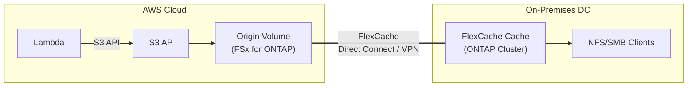

> 🌐 Language: [日本語](../ja/demo-guide-03-flexcache-on-premises.md) | **English**

# Demo Guide 03: FlexCache On-Premises (FSx for ONTAP → On-premises ONTAP)

> **Time Required**: ~90min（Direct Connect / VPN 構成済みの場合）
> **Cost**: ~$5–10（AWS side only. On-premises ONTAP license separate）
> **Audience**: infra engineers exploring hybrid cloud architectures
> **ONTAP Version**: FSx 9.17.1+ / On-premises 9.15.1+（write-back 対応）

---

> ⚠️ **Validation Status**: Procedure-level guide (not yet E2E validated in a live environment).
> Commands and architecture are based on official documentation and patterns validated in Guide 01/02 (same-region / cross-region FSx for ONTAP).
> External environment required for full validation — see BACKLOG items 7–12.


## What This Demo Validates

```
AWS Cloud                                    On-premises DC
┌────────────────────────────┐              ┌────────────────────────────┐
│  Lambda ──S3 API──▶ S3 AP  │              │                            │
│        │                   │              │    FlexCache Cache Volume   │
│        ▼                   │   DX / VPN   │           │                │
│   Origin Volume            │◄════════════▶│    ┌──────┴──────┐        │
│   (FSx for ONTAP)         │  Intercluster │    NFS mount   SMB mount   │
│                            │              │   (Linux srv) (Win srv)    │
└────────────────────────────┘              └────────────────────────────┘
```




**Validation Points:**

| # | Validation Item | Protocol |
|:-:|---------|-----------|
| 1 | Lambda writes data to Origin via S3 AP | S3 |
| 2 | NFS accessible via on-premises FlexCache | NFS |
| 3 | On-premises write-back reflected in Origin (S3 AP) | NFS write-back |
| 4 | Performance at RTT < 200ms | NFS |

---

> ⚠️ **Validation Status**: Procedure-level guide (not yet E2E validated in a live environment).
> Commands and architecture are based on official documentation and patterns validated in Guide 01/02 (same-region / cross-region FSx for ONTAP).
> External environment required for full validation — see BACKLOG items 7–12.


## Prerequisites

[Common Prerequisites](../en/demo-guide-00-prerequisites.md) plus the following:

| Resource | Location | Description |
|----------|------|------|
| FSx for ONTAP | AWS (ap-northeast-1) | Origin Volume |
| ONTAP クラスター | オンプレミス DC | Cache Volume（9.15.1+） |
| Direct Connect or Site-to-Site VPN | 両拠点間 | RTT < 200ms recommended |
| DNS 解決 | 双方向 | クラスター名が IP 解決できること |

### Network Requirements

| Direction | ポート | Purpose |
|------|--------|------|
| AWS → On-prem | TCP 11104-11105 | Intercluster (FlexCache) |
| On-prem → AWS | TCP 11104-11105 | Intercluster (FlexCache) |
| On-prem → AWS | TCP 443 | ONTAP REST API(optional) |

> **RTT 制約**: FlexCache write-back は RTT < 200ms で動作Verification済み。RTT が大きい場合は read-only Cache として使用することを推奨。

---

> ⚠️ **Validation Status**: Procedure-level guide (not yet E2E validated in a live environment).
> Commands and architecture are based on official documentation and patterns validated in Guide 01/02 (same-region / cross-region FSx for ONTAP).
> External environment required for full validation — see BACKLOG items 7–12.


## Step 0: Set Environment Variables

```bash
# === AWS  side（Origin）===
export AWS_REGION="ap-northeast-1"
export FS_ID="fs-0EXAMPLE1234abcde"
export SVM_NAME_AWS="svm-origin"
export SECRET_ARN="arn:aws:secretsmanager:ap-northeast-1:123456789012:secret:fsxn-admin-XXXXXX"

# === On-Premises Side (Cache) ===
export ONPREM_CLUSTER_IP="198.51.100.100"      # On-prem ONTAP Cluster Management IP
export ONPREM_IC_LIF="198.51.100.101"           # On-prem Intercluster LIF
export ONPREM_SVM="svm-onprem-cache"
export ONPREM_USER="admin"
# On-prem パスワードは手動入力（スクリプトに埋め込まない）

# === Common ===
export ORIGIN_VOL="vol_hybrid_origin"
export CACHE_VOL="vol_hybrid_cache"
```

---

> ⚠️ **Validation Status**: Procedure-level guide (not yet E2E validated in a live environment).
> Commands and architecture are based on official documentation and patterns validated in Guide 01/02 (same-region / cross-region FSx for ONTAP).
> External environment required for full validation — see BACKLOG items 7–12.


## Step 1: ネットワーク接続Verify

```bash
# Get AWS-side Intercluster LIF
MGMT_IP=$(aws fsx describe-file-systems --file-system-ids "$FS_ID" \
  --query 'FileSystems[0].OntapConfiguration.Endpoints.Management.IpAddresses[0]' \
  --output text --region "$AWS_REGION")

CREDS=$(aws secretsmanager get-secret-value --secret-id "$SECRET_ARN" \
  --query SecretString --output text --region "$AWS_REGION")
ONTAP_USER=$(echo "$CREDS" | jq -r '.username')
ONTAP_PASS=$(echo "$CREDS" | jq -r '.password')

AWS_IC_LIFS=$(curl -sk -u "${ONTAP_USER}:${ONTAP_PASS}" \
  "https://${MGMT_IP}/api/network/ip/interfaces?services=intercluster_core&fields=ip.address" \
  | jq -r '[.records[].ip.address] | join(",")')
echo "AWS Intercluster LIFs: $AWS_IC_LIFS"
```

```bash
# オンプレミスから AWS IC LIF への疎通Verify（オンプレミス ONTAP CLI）
ssh admin@${ONPREM_CLUSTER_IP}
```

```
cluster1::> network ping -lif <ic-lif-name> -vserver <svm> -destination <AWS_IC_LIF>
# → RTT をVerify（< 200ms が推奨）

cluster1::> network ping -lif ic-lif1 -vserver svm-onprem-cache -destination 198.51.100.30
44 bytes from 198.51.100.30: icmp_seq=0 ttl=64 time=15.2 ms
```

---

> ⚠️ **Validation Status**: Procedure-level guide (not yet E2E validated in a live environment).
> Commands and architecture are based on official documentation and patterns validated in Guide 01/02 (same-region / cross-region FSx for ONTAP).
> External environment required for full validation — see BACKLOG items 7–12.


## Step 2: Cluster Peering (On-Premises ONTAP CLI)

```
# On-premises sideで Cluster Peer を作成
cluster1::> cluster peer create -peer-addrs 198.51.100.30,198.51.100.31 \
  -initial-allowed-vserver-peers svm-onprem-cache \
  -ipspace Default \
  -encryption-protocol-proposed tls-psk \
  -generate-passphrase

# 出力例:
# Passphrase: Xyza1234AbcDeFgH
# ※ Use this passphrase on the AWS side
```

```bash
# AWS  accept Cluster Peer（REST API）
curl -sk -u "${ONTAP_USER}:${ONTAP_PASS}" \
  -X POST "https://${MGMT_IP}/api/cluster/peers" \
  -H "Content-Type: application/json" \
  -d "{
    \"remote\": {\"ip_addresses\": [\"${ONPREM_IC_LIF}\"]},
    \"authentication\": {\"passphrase\": \"Xyza1234AbcDeFgH\"}
  }" | jq '{job: .job.uuid}'
```

```bash
# Peering 状態Verify
sleep 20
curl -sk -u "${ONTAP_USER}:${ONTAP_PASS}" \
  "https://${MGMT_IP}/api/cluster/peers?fields=status" \
  | jq '.records[] | {name, status: .status.state}'
```

**Expected Output:**
```json
{
  "name": "cluster1",
  "status": "available"
}
```

---

> ⚠️ **Validation Status**: Procedure-level guide (not yet E2E validated in a live environment).
> Commands and architecture are based on official documentation and patterns validated in Guide 01/02 (same-region / cross-region FSx for ONTAP).
> External environment required for full validation — see BACKLOG items 7–12.


## Step 3: SVM Peering

```
# On-premises side（ONTAP CLI）
cluster1::> vserver peer create -vserver svm-onprem-cache \
  -peer-vserver svm-origin \
  -peer-cluster <aws-cluster-name> \
  -applications flexcache
```

```bash
# Accept SVM Peer from AWS side
curl -sk -u "${ONTAP_USER}:${ONTAP_PASS}" \
  "https://${MGMT_IP}/api/svm/peers?state=pending&fields=svm,peer" \
  | jq '.records[]'

# Accept if pending
PEER_UUID=$(curl -sk -u "${ONTAP_USER}:${ONTAP_PASS}" \
  "https://${MGMT_IP}/api/svm/peers?state=pending" \
  | jq -r '.records[0].uuid')

curl -sk -u "${ONTAP_USER}:${ONTAP_PASS}" \
  -X PATCH "https://${MGMT_IP}/api/svm/peers/${PEER_UUID}" \
  -H "Content-Type: application/json" \
  -d '{"state": "peered"}' | jq .
```

---

> ⚠️ **Validation Status**: Procedure-level guide (not yet E2E validated in a live environment).
> Commands and architecture are based on official documentation and patterns validated in Guide 01/02 (same-region / cross-region FSx for ONTAP).
> External environment required for full validation — see BACKLOG items 7–12.


## Step 4: Origin Volume + S3 AP（AWS  side）

> [Demo Guide 01 Step 4](../en/demo-guide-01-flexcache-same-region.md#step-4-origin-volume-作成--s3-ap-アタッチ)  — same procedure.

---

> ⚠️ **Validation Status**: Procedure-level guide (not yet E2E validated in a live environment).
> Commands and architecture are based on official documentation and patterns validated in Guide 01/02 (same-region / cross-region FSx for ONTAP).
> External environment required for full validation — see BACKLOG items 7–12.


## Step 5-6: Lambda Writer & データ書き込み

> [Demo Guide 01 Step 5-6](../en/demo-guide-01-flexcache-same-region.md#step-5-lambda-writer-関数のデプロイ) . Refer to this guide.

---

> ⚠️ **Validation Status**: Procedure-level guide (not yet E2E validated in a live environment).
> Commands and architecture are based on official documentation and patterns validated in Guide 01/02 (same-region / cross-region FSx for ONTAP).
> External environment required for full validation — see BACKLOG items 7–12.


## Step 7: Create FlexCache (On-Premises ONTAP CLI)

```
# On-premises sideで FlexCache を作成
cluster1::> volume flexcache create -vserver svm-onprem-cache \
  -volume vol_hybrid_cache \
  -aggr-list aggr1 \
  -size 100GB \
  -origin-vserver svm-origin \
  -origin-volume vol_hybrid_origin \
  -junction-path /vol_hybrid_cache \
  -is-writeback-enabled true

# Verify
cluster1::> volume flexcache show -volume vol_hybrid_cache
```

**Expected Output:**
```
Vserver   Volume          Size   Origin-Vserver  Origin-Volume  State
--------- --------------- ------ --------------- -------------- ------
svm-onprem-cache vol_hybrid_cache 100GB svm-origin vol_hybrid_origin online
```

---

> ⚠️ **Validation Status**: Procedure-level guide (not yet E2E validated in a live environment).
> Commands and architecture are based on official documentation and patterns validated in Guide 01/02 (same-region / cross-region FSx for ONTAP).
> External environment required for full validation — see BACKLOG items 7–12.


## Step 8: NFS Verification（オンプレミスサーバー）

```bash
# Execute on on-premises Linux server
DATA_LIF_ONPREM="198.51.100.110"  # On-prem SVM の Data LIF

sudo mkdir -p /mnt/hybrid_cache
sudo mount -t nfs -o vers=3 ${DATA_LIF_ONPREM}:/vol_hybrid_cache /mnt/hybrid_cache

# Data written by Lambda is visible
ls -la /mnt/hybrid_cache/demo-data/
cat /mnt/hybrid_cache/demo-data/sensor-001.json | jq .
```

```bash
# Write-back test
echo '{"source": "on-premises", "ts": '$(date +%s)'}' > /mnt/hybrid_cache/demo-data/onprem-written.json

# Verify from AWS S3 AP（flush 待ち）
sleep 30
aws s3api get-object --bucket "$S3AP_ALIAS" --key "demo-data/onprem-written.json" \
  /tmp/onprem-result.json --region "$AWS_REGION" && cat /tmp/onprem-result.json
```

---

> ⚠️ **Validation Status**: Procedure-level guide (not yet E2E validated in a live environment).
> Commands and architecture are based on official documentation and patterns validated in Guide 01/02 (same-region / cross-region FSx for ONTAP).
> External environment required for full validation — see BACKLOG items 7–12.


## Cleanup

```bash
# On-premises side
cluster1::> volume unmount -vserver svm-onprem-cache -volume vol_hybrid_cache
cluster1::> volume offline -vserver svm-onprem-cache -volume vol_hybrid_cache
cluster1::> volume flexcache delete -vserver svm-onprem-cache -volume vol_hybrid_cache
cluster1::> vserver peer delete -vserver svm-onprem-cache -peer-vserver svm-origin
cluster1::> cluster peer delete -cluster <aws-cluster-name>

# AWS side: Demo Guide 01 のクリーンアップrefer to this guide
```

---

> ⚠️ **Validation Status**: Procedure-level guide (not yet E2E validated in a live environment).
> Commands and architecture are based on official documentation and patterns validated in Guide 01/02 (same-region / cross-region FSx for ONTAP).
> External environment required for full validation — see BACKLOG items 7–12.


## Troubleshooting

| Symptom | Cause | Resolution |
|------|------|------|
| Cluster Peer "unreachable" | DX/VPN tunnel down | Check VPN connection status, BGP status |
| FlexCache 作成: "peer unavailable" | IC LIF routing incorrect | `network route show` でオンプレ→AWS 経路Verify |
| RTT > 200ms で write-back 失敗 | Long-distance circuit limitation | Disable write-back, operate as read-only Cache |
| NFS mount タイムアウト | Firewall blocking port 2049 | DX/VPN 経由のポート開放をVerify |
| Cache miss が多い | Origin data is large, fetch takes time | `flexcache prepopulate`  to warm up |

---

> ⚠️ **Validation Status**: Procedure-level guide (not yet E2E validated in a live environment).
> Commands and architecture are based on official documentation and patterns validated in Guide 01/02 (same-region / cross-region FSx for ONTAP).
> External environment required for full validation — see BACKLOG items 7–12.


## References

- [AWS Docs: Direct Connect](https://docs.aws.amazon.com/directconnect/latest/UserGuide/)
- [AWS Docs: Site-to-Site VPN](https://docs.aws.amazon.com/vpn/latest/s2svpn/)
- [NetApp Docs: FlexCache volumes](https://docs.netapp.com/us-en/ontap/flexcache/index.html)
- [NetApp Docs: Cluster Peering](https://docs.netapp.com/us-en/ontap/peering/index.html)
- [Demo Guide 01: FlexCache 同一リージョン](../en/demo-guide-01-flexcache-same-region.md)
