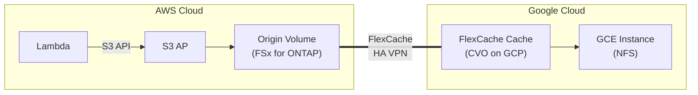

> 🌐 Language: [日本語](../ja/demo-guide-04-flexcache-cvo-gcp.md) | **English**

# Demo Guide 04: FlexCache CVO on GCP（FSx for ONTAP → Cloud Volumes ONTAP on GCP）

> **Time Required**: ~120min(including CVO deployment)
> **Cost**: ~$20–30（AWS + GCP combined, if deleted after verification）
> **Audience**: infra/data engineers exploring multi-cloud architectures
> **ONTAP Version**: FSx 9.17.1+ / CVO 9.15.1+

---

> ⚠️ **Validation Status**: Procedure-level guide (not yet E2E validated in a live environment).
> Commands and architecture are based on official documentation and patterns validated in Guide 01/02 (same-region / cross-region FSx for ONTAP).
> External environment required for full validation — see BACKLOG items 7–12.


## What This Demo Validates

```
AWS Cloud (ap-northeast-1)                  Google Cloud (us-central1)
┌────────────────────────────┐              ┌────────────────────────────┐
│  Lambda ──S3 API──▶ S3 AP  │              │                            │
│        │                   │              │  Cloud Volumes ONTAP (GCP) │
│        ▼                   │  HA VPN /    │    FlexCache Cache Volume  │
│   Origin Volume            │  Cloud VPN   │           │                │
│   (FSx for ONTAP)         │◄════════════▶│    NFS mount               │
│                            │  Intercluster│   (GCE instance)           │
└────────────────────────────┘              └────────────────────────────┘
```




**Validation Points:**

| # | Validation Item | Protocol |
|:-:|---------|-----------|
| 1 | Lambda writes data to Origin via S3 AP | S3 |
| 2 | NFS access via CVO FlexCache on GCP | NFS |
| 3 | GCP → AWS write-back reflected in S3 AP | NFS write-back |
| 4 | Cross-cloud latency impact | NFS |

---

> ⚠️ **Validation Status**: Procedure-level guide (not yet E2E validated in a live environment).
> Commands and architecture are based on official documentation and patterns validated in Guide 01/02 (same-region / cross-region FSx for ONTAP).
> External environment required for full validation — see BACKLOG items 7–12.


## Prerequisites

[Common Prerequisites](../en/demo-guide-00-prerequisites.md) plus the following:

| Resource | Cloud | Description |
|----------|---------|------|
| FSx for ONTAP | AWS | Origin Volume |
| Cloud Volumes ONTAP | GCP | FlexCache Cache (PAYGO or BYOL) |
| HA VPN or Cloud Interconnect | AWS ↔ GCP | encrypted tunnel |
| GCP VPC + Subnet | GCP | CVO deployment target |

### Additional Tools

| Tool | Purpose |
|--------|------|
| `gcloud` CLI | GCP リソース管理 |
| Terraform(optional) | CVO + VPN の IaC デプロイ |

---

> ⚠️ **Validation Status**: Procedure-level guide (not yet E2E validated in a live environment).
> Commands and architecture are based on official documentation and patterns validated in Guide 01/02 (same-region / cross-region FSx for ONTAP).
> External environment required for full validation — see BACKLOG items 7–12.


## Step 0: Set Environment Variables

```bash
# === AWS Side ===
export AWS_REGION="ap-northeast-1"
export FS_ID="fs-0EXAMPLE1234abcde"
export SVM_NAME_AWS="svm-origin"
export SECRET_ARN="arn:aws:secretsmanager:ap-northeast-1:123456789012:secret:fsxn-admin-XXXXXX"
export AWS_VPC_ID="vpc-0aaaa1111"
export AWS_VPC_CIDR="10.0.0.0/16"

# === GCP Side ===
export GCP_PROJECT="my-project-123456"
export GCP_REGION="us-central1"
export GCP_ZONE="us-central1-a"
export GCP_VPC="cvo-vpc"
export GCP_SUBNET="cvo-subnet"
export GCP_CIDR="10.100.0.0/16"
export CVO_CLUSTER_IP="10.100.1.10"    # CVO management IP (デプロイ後に確定)
export CVO_IC_LIF="10.100.1.11"         # CVO Intercluster LIF
export CVO_SVM="svm-gcp-cache"

# === Common ===
export ORIGIN_VOL="vol_gcp_origin"
export CACHE_VOL="vol_gcp_cache"
```

---

> ⚠️ **Validation Status**: Procedure-level guide (not yet E2E validated in a live environment).
> Commands and architecture are based on official documentation and patterns validated in Guide 01/02 (same-region / cross-region FSx for ONTAP).
> External environment required for full validation — see BACKLOG items 7–12.


## Step 1: Create GCP HA VPN

```bash
# Create GCP-side VPN Gateway
gcloud compute vpn-gateways create aws-vpn-gw \
  --network "$GCP_VPC" \
  --region "$GCP_REGION" \
  --project "$GCP_PROJECT"

# Create Cloud Router
gcloud compute routers create aws-router \
  --network "$GCP_VPC" \
  --region "$GCP_REGION" \
  --asn 65001 \
  --project "$GCP_PROJECT"
```

```bash
# Create AWS-side VPN Gateway / Customer Gateway
AWS_VGW=$(aws ec2 create-vpn-gateway --type ipsec.1 \
  --query 'VpnGateway.VpnGatewayId' --output text --region "$AWS_REGION")
aws ec2 attach-vpn-gateway --vpn-gateway-id "$AWS_VGW" --vpc-id "$AWS_VPC_ID" --region "$AWS_REGION"

# Get GCP VPN Gateway external IP and create Customer Gateway
GCP_VPN_IP=$(gcloud compute vpn-gateways describe aws-vpn-gw \
  --region "$GCP_REGION" --format='value(vpnInterfaces[0].ipAddress)' --project "$GCP_PROJECT")

AWS_CGW=$(aws ec2 create-customer-gateway --type ipsec.1 \
  --bgp-asn 65001 --public-ip "$GCP_VPN_IP" \
  --query 'CustomerGateway.CustomerGatewayId' --output text --region "$AWS_REGION")

# Create Site-to-Site VPN connection
aws ec2 create-vpn-connection \
  --type ipsec.1 \
  --vpn-gateway-id "$AWS_VGW" \
  --customer-gateway-id "$AWS_CGW" \
  --options '{"StaticRoutesOnly": false}' \
  --region "$AWS_REGION"
```

> **Note**: For actual VPN configuration, follow AWS/GCP documentation for tunnel settings(PSK, BGP parameters). Only an overview is shown here.

```bash
# VPN 接続後のルーティングVerify
# AWS Route Table に GCP CIDR → VGW のルートが BGP で伝播されていることをVerify
aws ec2 describe-route-tables --filters Name=vpc-id,Values="$AWS_VPC_ID" \
  --query 'RouteTables[0].Routes[?DestinationCidrBlock==`10.100.0.0/16`]' \
  --region "$AWS_REGION"
```

---

> ⚠️ **Validation Status**: Procedure-level guide (not yet E2E validated in a live environment).
> Commands and architecture are based on official documentation and patterns validated in Guide 01/02 (same-region / cross-region FSx for ONTAP).
> External environment required for full validation — see BACKLOG items 7–12.


## Step 2: Deploy CVO on GCP

CVO は ONTAP REST API 経由で管理します。デプロイには Terraform または GCP Marketplace を使用します。

```bash
# Terraform を使用する場合（例: netapp-cloudmanager/cvo-gcp module）
# ※ Terraform テンプレートは別途用意

# CVO デプロイComplete後、管理 IP をVerify
echo "CVO Cluster Management IP: $CVO_CLUSTER_IP"

# Verify ONTAP REST API connectivity
curl -sk -u "admin:<CVO_PASSWORD>" \
  "https://${CVO_CLUSTER_IP}/api/cluster?fields=version" | jq '.version'
```

**Expected Output:**
```json
{
  "full": "NetApp Release 9.15.1P2",
  "generation": 9,
  "major": 15,
  "minor": 1
}
```

---

> ⚠️ **Validation Status**: Procedure-level guide (not yet E2E validated in a live environment).
> Commands and architecture are based on official documentation and patterns validated in Guide 01/02 (same-region / cross-region FSx for ONTAP).
> External environment required for full validation — see BACKLOG items 7–12.


## Step 3: Cluster Peering (AWS ↔ GCP)

```bash
# Get AWS-side Intercluster LIF
MGMT_IP=$(aws fsx describe-file-systems --file-system-ids "$FS_ID" \
  --query 'FileSystems[0].OntapConfiguration.Endpoints.Management.IpAddresses[0]' \
  --output text --region "$AWS_REGION")

CREDS=$(aws secretsmanager get-secret-value --secret-id "$SECRET_ARN" \
  --query SecretString --output text --region "$AWS_REGION")
ONTAP_USER=$(echo "$CREDS" | jq -r '.username')
ONTAP_PASS=$(echo "$CREDS" | jq -r '.password')

AWS_IC_LIFS=$(curl -sk -u "${ONTAP_USER}:${ONTAP_PASS}" \
  "https://${MGMT_IP}/api/network/ip/interfaces?services=intercluster_core&fields=ip.address" \
  | jq -r '[.records[].ip.address] | join(",")')

# Create Cluster Peer from AWS side
curl -sk -u "${ONTAP_USER}:${ONTAP_PASS}" \
  -X POST "https://${MGMT_IP}/api/cluster/peers" \
  -H "Content-Type: application/json" \
  -d "{
    \"remote\": {\"ip_addresses\": [\"${CVO_IC_LIF}\"]},
    \"authentication\": {\"passphrase\": \"gcp-cross-cloud-2026\"},
    \"encryption\": {\"proposed\": \"tls_psk\"}
  }" | jq '{job: .job.uuid}'
```

```bash
# GCP CVO  accept Cluster Peer
curl -sk -u "admin:<CVO_PASSWORD>" \
  -X POST "https://${CVO_CLUSTER_IP}/api/cluster/peers" \
  -H "Content-Type: application/json" \
  -d "{
    \"remote\": {\"ip_addresses\": [$(echo $AWS_IC_LIFS | sed 's/,/\",\"/g' | sed 's/^/\"/;s/$/\"/')]},
    \"authentication\": {\"passphrase\": \"gcp-cross-cloud-2026\"}
  }" | jq '{job: .job.uuid}'
```

---

> ⚠️ **Validation Status**: Procedure-level guide (not yet E2E validated in a live environment).
> Commands and architecture are based on official documentation and patterns validated in Guide 01/02 (same-region / cross-region FSx for ONTAP).
> External environment required for full validation — see BACKLOG items 7–12.


## Step 4: SVM Peering + FlexCache Creation

```bash
# Create SVM Peer (from AWS side)
curl -sk -u "${ONTAP_USER}:${ONTAP_PASS}" \
  -X POST "https://${MGMT_IP}/api/svm/peers" \
  -H "Content-Type: application/json" \
  -d "{
    \"svm\": {\"name\": \"${SVM_NAME_AWS}\"},
    \"peer\": {\"svm\": {\"name\": \"${CVO_SVM}\"}},
    \"applications\": [\"flexcache\"]
  }" | jq '{job: .job.uuid}'

sleep 15

# Create FlexCache on GCP CVO side
curl -sk -u "admin:<CVO_PASSWORD>" \
  -X POST "https://${CVO_CLUSTER_IP}/api/storage/flexcache/flexcaches" \
  -H "Content-Type: application/json" \
  -d "{
    \"name\": \"${CACHE_VOL}\",
    \"svm\": {\"name\": \"${CVO_SVM}\"},
    \"size\": 107374182400,
    \"type\": \"rw\",
    \"style\": \"flexgroup\",
    \"nas\": {\"path\": \"/${CACHE_VOL}\"},
    \"flexcache\": {
      \"fill_policy\": \"demand\",
      \"writeback\": {\"enabled\": true},
      \"origins\": [{
        \"volume\": {\"name\": \"${ORIGIN_VOL}\"},
        \"svm\": {\"name\": \"${SVM_NAME_AWS}\"}
      }]
    }
  }" | jq '{job_uuid: .job.uuid}'
```

---

> ⚠️ **Validation Status**: Procedure-level guide (not yet E2E validated in a live environment).
> Commands and architecture are based on official documentation and patterns validated in Guide 01/02 (same-region / cross-region FSx for ONTAP).
> External environment required for full validation — see BACKLOG items 7–12.


## Step 5: Origin Volume + S3 AP + Lambda Writer

> [Demo Guide 01 Step 4-6](../en/demo-guide-01-flexcache-same-region.md#step-4-origin-volume-作成--s3-ap-アタッチ) . Refer to this guide.AWS  side:  Create Origin Volumeし Attach S3 AP、Lambda でデータを書き込みます。

---

> ⚠️ **Validation Status**: Procedure-level guide (not yet E2E validated in a live environment).
> Commands and architecture are based on official documentation and patterns validated in Guide 01/02 (same-region / cross-region FSx for ONTAP).
> External environment required for full validation — see BACKLOG items 7–12.


## Step 6: NFS Verification（GCE インスタンス）

```bash
# SSH into GCE instance
gcloud compute ssh cvo-test-vm --zone "$GCP_ZONE" --project "$GCP_PROJECT"

# CVO Data LIF IP (confirm after deployment)
CVO_DATA_LIF="10.100.1.20"

# NFS Mount
sudo mkdir -p /mnt/gcp_cache
sudo mount -t nfs -o vers=3 ${CVO_DATA_LIF}:/${CACHE_VOL} /mnt/gcp_cache

# Read data written by Lambda
ls -la /mnt/gcp_cache/demo-data/
cat /mnt/gcp_cache/demo-data/sensor-001.json | jq .
```

```bash
# Write-back test
echo '{"source": "gcp-cvo", "ts": '$(date +%s)'}' > /mnt/gcp_cache/demo-data/gcp-written.json

# AWS S3 AP でVerify
sleep 30
aws s3api get-object --bucket "$S3AP_ALIAS" --key "demo-data/gcp-written.json" \
  /tmp/gcp-result.json --region "$AWS_REGION" && cat /tmp/gcp-result.json
```

---

> ⚠️ **Validation Status**: Procedure-level guide (not yet E2E validated in a live environment).
> Commands and architecture are based on official documentation and patterns validated in Guide 01/02 (same-region / cross-region FSx for ONTAP).
> External environment required for full validation — see BACKLOG items 7–12.


## Cleanup

```bash
# 1. GCE: NFS unmount
sudo umount /mnt/gcp_cache

# 2. CVO: Delete FlexCache
# 3. Delete SVM Peering / Cluster Peering
# 4. Delete CVO instance (Terraform destroy or from Marketplace)
# 5. Delete VPN tunnel
gcloud compute vpn-tunnels delete <tunnel-name> --region "$GCP_REGION" --project "$GCP_PROJECT"
gcloud compute vpn-gateways delete aws-vpn-gw --region "$GCP_REGION" --project "$GCP_PROJECT"
aws ec2 delete-vpn-connection --vpn-connection-id <vpn-id> --region "$AWS_REGION"
aws ec2 detach-vpn-gateway --vpn-gateway-id "$AWS_VGW" --vpc-id "$AWS_VPC_ID" --region "$AWS_REGION"
aws ec2 delete-vpn-gateway --vpn-gateway-id "$AWS_VGW" --region "$AWS_REGION"

# 6. AWS side: Origin Volume + S3 AP 削除（Demo Guide 01 refer to this guide）
```

---

> ⚠️ **Validation Status**: Procedure-level guide (not yet E2E validated in a live environment).
> Commands and architecture are based on official documentation and patterns validated in Guide 01/02 (same-region / cross-region FSx for ONTAP).
> External environment required for full validation — see BACKLOG items 7–12.


## Troubleshooting

| Symptom | Cause | Resolution |
|------|------|------|
| VPN tunnel not coming UP | PSK / BGP ASN 不一致 | 両 sideの VPN パラメータをVerify |
| Cluster Peer "unavailable" | VPN 経由で 11104-11105 到達Not available | Check GCP Firewall + AWS SG |
| CVO の REST API 応答なし | CVO still booting or SG misconfigured | Allow 443 in GCP Firewall |
| FlexCache 作成: "cannot reach origin" | MTU issue over VPN | Adjust MTU to 1400 (VPN overhead) |
| Write-back が遅い | Cross-cloud RTT > 50ms | Normal behavior. Batch flush minimizes perceived impact |

---

> ⚠️ **Validation Status**: Procedure-level guide (not yet E2E validated in a live environment).
> Commands and architecture are based on official documentation and patterns validated in Guide 01/02 (same-region / cross-region FSx for ONTAP).
> External environment required for full validation — see BACKLOG items 7–12.


## References

- [GCP Docs: HA VPN](https://cloud.google.com/network-connectivity/docs/vpn/concepts/overview)
- [AWS Docs: Site-to-Site VPN](https://docs.aws.amazon.com/vpn/latest/s2svpn/)
- [NetApp Docs: CVO on GCP](https://docs.netapp.com/us-en/cloud-volumes-ontap-relnotes/)
- [Demo Guide 01: FlexCache 同一リージョン](../en/demo-guide-01-flexcache-same-region.md)
