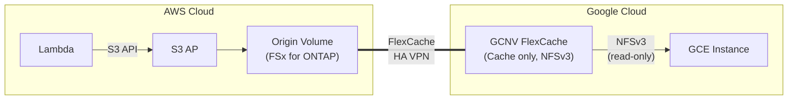

> 🌐 Language: [日本語](../ja/demo-guide-06-flexcache-gcnv.md) | **English**

# Demo Guide 06: FlexCache GCNV (FSx for ONTAP → Google Cloud NetApp Volumes)

> **Time Required**: ~90min(if VPN already configured)
> **Cost**: ~$15–25（AWS + GCP combined, if deleted after verification）
> **Audience**: engineers exploring GCP native storage + AWS data integration
> **ONTAP Version**: FSx 9.17.1+ / GCNV（Google-managed、バージョン自動）

---

## What This Demo Validates

```
AWS Cloud (ap-northeast-1)                  Google Cloud (us-central1)
┌────────────────────────────┐              ┌────────────────────────────┐
│  Lambda ──S3 API──▶ S3 AP  │              │                            │
│        │                   │              │  Google Cloud NetApp       │
│        ▼                   │  HA VPN      │  Volumes (GCNV)            │
│   Origin Volume            │◄════════════▶│    FlexCache Cache Volume  │
│   (FSx for ONTAP)         │  Intercluster│           │                │
│                            │              │    NFSv3 mount             │
│                            │              │   (GCE instance)           │
└────────────────────────────┘              └────────────────────────────┘
```




**Key Constraints:**

| Constraint | Details |
|------|------|
| GCNV は Cache のみ | GCNV を Origin にすることはできない |
| NFSv3 のみ | GCNV FlexCache は NFSv4 未対応 |
| Write-back 非対応 | GCNV FlexCache は read-only |
| Google-managed | ONTAP CLI/REST API への直接アクセスNot available |

**Validation Points:**

| # | Validation Item | Protocol |
|:-:|---------|-----------|
| 1 | Lambda writes data to Origin via S3 AP | S3 |
| 2 | NFSv3 data access via GCNV FlexCache | NFSv3 |
| 3 | Origin update → GCNV Cache propagation latency | NFSv3 |

---

## Prerequisites

[Common Prerequisites](../en/demo-guide-00-prerequisites.md) plus the following:

| Resource | Cloud | Description |
|----------|---------|------|
| FSx for ONTAP | AWS | Origin Volume |
| GCNV Storage Pool + Volume | GCP | FlexCache Cache |
| HA VPN | AWS ↔ GCP | encrypted tunnel |
| GCP VPC (PSA 有効) | GCP | Private Service Access for GCNV |

### Additional Tools

| Tool | Purpose |
|--------|------|
| `gcloud` CLI | GCP / GCNV リソース管理 |

---

## Step 0: Set Environment Variables

```bash
# === AWS Side ===
export AWS_REGION="ap-northeast-1"
export FS_ID="fs-0EXAMPLE1234abcde"
export SVM_NAME_AWS="svm-origin"
export SECRET_ARN="arn:aws:secretsmanager:ap-northeast-1:123456789012:secret:fsxn-admin-XXXXXX"

# === GCP Side ===
export GCP_PROJECT="my-project-123456"
export GCP_REGION="us-central1"
export GCP_ZONE="us-central1-a"
export GCP_VPC="gcnv-vpc"
export GCP_CIDR="10.150.0.0/16"

# === Common ===
export ORIGIN_VOL="vol_gcnv_origin"
```

---

## Step 1: GCP HA VPN 設定

> The VPN setup procedure follows [Demo Guide 04 Step 1](../en/demo-guide-04-flexcache-cvo-gcp.md#step-1-gcp-ha-vpn-の作成) . Configure HA VPN between AWS and GCP.

```bash
# VPN 接続Verify
gcloud compute vpn-tunnels describe <tunnel-name> \
  --region "$GCP_REGION" --project "$GCP_PROJECT" \
  --format='value(status)'
# Expected value: ESTABLISHED
```

---

## Step 2: Create GCNV Storage Pool

```bash
# Configure Private Service Access (required for GCNV)
gcloud compute addresses create gcnv-psa-range \
  --global \
  --purpose VPC_PEERING \
  --prefix-length 20 \
  --network "$GCP_VPC" \
  --project "$GCP_PROJECT"

gcloud services vpc-peerings connect \
  --service netapp.servicenetworking.goog \
  --ranges gcnv-psa-range \
  --network "$GCP_VPC" \
  --project "$GCP_PROJECT"

# Storage Pool 作成
gcloud netapp storage-pools create gcnv-demo-pool \
  --location "$GCP_REGION" \
  --capacity 2048 \
  --service-level PREMIUM \
  --network "$GCP_VPC" \
  --project "$GCP_PROJECT"
```

**Expected Output:**
```
Created storage pool [gcnv-demo-pool].
```

---

## Step 3: Create GCNV FlexCache Volume

Create GCNV FlexCache via `gcloud` CLI or GCP Console. Specify FSx for ONTAP Intercluster LIF as Origin.

```bash
# FSx for ONTAP の Intercluster LIF を取得
MGMT_IP=$(aws fsx describe-file-systems --file-system-ids "$FS_ID" \
  --query 'FileSystems[0].OntapConfiguration.Endpoints.Management.IpAddresses[0]' \
  --output text --region "$AWS_REGION")

CREDS=$(aws secretsmanager get-secret-value --secret-id "$SECRET_ARN" \
  --query SecretString --output text --region "$AWS_REGION")
ONTAP_USER=$(echo "$CREDS" | jq -r '.username')
ONTAP_PASS=$(echo "$CREDS" | jq -r '.password')

AWS_IC_LIFS=$(curl -sk -u "${ONTAP_USER}:${ONTAP_PASS}" \
  "https://${MGMT_IP}/api/network/ip/interfaces?services=intercluster_core&fields=ip.address" \
  | jq -r '.records[].ip.address')
echo "AWS Intercluster LIFs: $AWS_IC_LIFS"
```

```bash
# GCNV FlexCache Volume 作成
# ※ GCNV FlexCache は Google Cloud Console または API 経由で作成
# 以下は gcloud netapp volumes create の例（FlexCache パラメータは GA 時点でVerify）

gcloud netapp volumes create gcnv-cache-vol \
  --location "$GCP_REGION" \
  --capacity 1024 \
  --storage-pool gcnv-demo-pool \
  --protocols NFSv3 \
  --share-name gcnv_cache \
  --project "$GCP_PROJECT"

# ※ FlexCache Origin is configured via GCNV Replication / Cache functionality
# 詳細は GCP Console > NetApp Volumes > Volume > Create Cache をrefer to this guide
```

> **Note**: GCNV FlexCache の作成手順は Google Cloud のリリース状況により異なる場合があります。最新 procedureは [GCNV Documentation](https://cloud.google.com/netapp/volumes/docs) をrefer to this guideしてください。

---

## Step 4: Origin Volume + S3 AP + Lambda Writer（AWS  side）

> [Demo Guide 01 Step 4-6](../en/demo-guide-01-flexcache-same-region.md#step-4-origin-volume-作成--s3-ap-アタッチ) . Refer to this guide.

---

## Step 5: NFSv3 Verification（GCE インスタンス）

```bash
# SSH into GCE instance
gcloud compute ssh gcnv-test-vm --zone "$GCP_ZONE" --project "$GCP_PROJECT"

# GCNV マウントポイントVerify
GCNV_MOUNT_IP=$(gcloud netapp volumes describe gcnv-cache-vol \
  --location "$GCP_REGION" --project "$GCP_PROJECT" \
  --format='value(mountOptions.export)')

# NFSv3 mount
sudo mkdir -p /mnt/gcnv_cache
sudo mount -t nfs -o vers=3,hard,rsize=65536,wsize=65536 \
  ${GCNV_MOUNT_IP}:/gcnv_cache /mnt/gcnv_cache

# Verify mount
df -h /mnt/gcnv_cache
```

```bash
# Read data written by Lambda
ls -la /mnt/gcnv_cache/demo-data/
cat /mnt/gcnv_cache/demo-data/sensor-001.json | jq .
```

**Expected Output:**
```json
{
  "sensor_id": "S001",
  "temperature": 23.5,
  "humidity": 65,
  "ts": 1753090800
}
```

> **Note**: GCNV FlexCache is read-only. Write attempts will return `Read-only file system` an error.

```bash
# Write テスト（失敗することをVerify）
echo "test" > /mnt/gcnv_cache/demo-data/write-test.json
# Expected: "Read-only file system"
```

---

## Step 6: Origin 更新 → Cache 反映テスト

```bash
# AWS  side:  Lambda からデータを追加
aws lambda invoke \
  --function-name tc09-s3ap-writer \
  --payload '{"prefix": "demo-data/gcnv-test"}' \
  --cli-binary-format raw-in-base64-out \
  /tmp/gcnv-test.json --region "$AWS_REGION"

# GCE  side: 反映Verify（TTL 経過後）
sleep 60
ls /mnt/gcnv_cache/demo-data/gcnv-test/
```

---

## Cleanup

```bash
# 1. GCE: NFS unmount
sudo umount /mnt/gcnv_cache

# 2. Delete GCNV Volume
gcloud netapp volumes delete gcnv-cache-vol \
  --location "$GCP_REGION" --project "$GCP_PROJECT" --quiet

# 3. Delete GCNV Storage Pool
gcloud netapp storage-pools delete gcnv-demo-pool \
  --location "$GCP_REGION" --project "$GCP_PROJECT" --quiet

# 4. VPN 削除（Demo Guide 04 refer to this guide）

# 5. AWS side: Origin Volume + S3 AP 削除（Demo Guide 01 refer to this guide）
```

---

## Troubleshooting

| Symptom | Cause | Resolution |
|------|------|------|
| GCNV Volume 作成失敗 | PSA not configured | `vpc-peerings connect` がCompleteしているかVerify |
| NFSv4 マウントNot available | GCNV FlexCache は NFSv3 のみ | `-o vers=3`  flag |
| "Read-only file system" | GCNV FlexCache は read-only | Normal behavior. 書き込みは Origin (AWS) 経由 |
| Cache にデータが見えない | VPN 経由の接続問題 | Check VPN tunnel status + Intercluster ports |
| TTL 後もデータ反映されない | GCNV Cache is managed by Google | GCP Console で Volume  status verified |

---

## References

- [GCP Docs: NetApp Volumes](https://cloud.google.com/netapp/volumes/docs)
- [GCP Docs: HA VPN](https://cloud.google.com/network-connectivity/docs/vpn/concepts/overview)
- [NetApp Docs: FlexCache](https://docs.netapp.com/us-en/ontap/flexcache/index.html)
- [Demo Guide 04: FlexCache CVO on GCP](../en/demo-guide-04-flexcache-cvo-gcp.md)
- [Demo Guide 01: FlexCache 同一リージョン](../en/demo-guide-01-flexcache-same-region.md)
