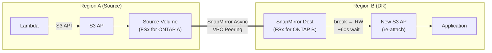

> 🌐 Language: [日本語](../ja/demo-guide-07-snapmirror-cross-region.md) | **English**

# Demo Guide 07: SnapMirror Cross-Region + S3 AP Re-Attach

> **Time Required**: ~60min(if FSx for ONTAP deployed in both regions)
> **Cost**: ~$15–20（if deleted after verification）
> **Audience**: infra engineers exploring DR / cross-region architectures
> **ONTAP Version**: 9.17.1+（FSx for ONTAP 2nd Generation）

---

> ✅ **Validation Status**: E2E validated (2026-07-22). SnapMirror transfer + break + S3 AP re-attach confirmed.
> S3 AP re-attach RTO: ~3 min (cross-region). Data integrity verified via ListObjectsV2 + GetObject.
> Script: `scripts/validation/cross-region-deploy.sh` + `cross-region-test.sh`
> Evidence: `.private/evidence/s3ap-multicloud/sm-cross-region-2026-07-22.md`

## What This Demo Validates

```
Region A (ap-northeast-1)                    Region B (us-west-2)
┌──────────────────────────┐                ┌──────────────────────────┐
│  Lambda ──S3 API──▶ S3 AP │                │                          │
│        │                  │                │   SnapMirror Dest (DP)   │
│        ▼                  │   VPC Peering  │        Volume            │
│   Source Volume           │═══════════════▶│          │               │
│   (FSx for ONTAP A)      │  SnapMirror    │   [break → RW]           │
│                           │  Async         │          │               │
│                           │                │   New S3 AP (re-attach)  │
│                           │                │          │               │
│                           │                │   Lambda / App read   │
└──────────────────────────┘                └──────────────────────────┘

After DR failover:
  - Region B volume is Promoted to RW
  - Create and attach new S3 AP in Region B
  - Applications access data via Region B S3 AP
```




**Validation Points:**

| # | Validation Item | Action |
|:-:|---------|------|
| 1 | Write data via S3 AP in Region A | Lambda → S3 AP |
| 2 | Verify SnapMirror replication complete | SnapMirror status |
| 3 | SnapMirror break in Region B (promote to RW) | ONTAP REST API |
| 4 | After 60s wait, verify VolumeType via FSx API Verify | AWS CLI |
| 5 | Create new S3 AP + data access in Region B | AWS CLI → S3 API |

---

## Prerequisites

[Common Prerequisites](../en/demo-guide-00-prerequisites.md) plus the following:

| Resource | Region | Description |
|----------|-----------|------|
| FSx for ONTAP A | ap-northeast-1 | Source Volume |
| FSx for ONTAP B | us-west-2 | Destination Volume |
| VPC Peering | Both regions | for Intercluster communication |
| Cluster Peering + SVM Peering | Both clusters | SnapMirror prerequisite |

> **VPC Peering / Cluster Peering**: [Demo Guide 02 Step 1-3](../en/demo-guide-02-flexcache-cross-region.md#step-1-vpc-peering-の作成)  procedure. Refer to this guide.

---

## Step 0: Set Environment Variables

```bash
# === Region A (Source) ===
export REGION_A="ap-northeast-1"
export FS_ID_A="fs-0EXAMPLE1111aaaaa"
export SVM_NAME_A="svm-source"
export SECRET_ARN_A="arn:aws:secretsmanager:ap-northeast-1:123456789012:secret:fsxn-admin-A-XXXXXX"

# === Region B (Destination) ===
export REGION_B="us-west-2"
export FS_ID_B="fs-0EXAMPLE2222bbbbb"
export SVM_NAME_B="svm-dest"
export SECRET_ARN_B="arn:aws:secretsmanager:us-west-2:123456789012:secret:fsxn-admin-B-XXXXXX"

# === Common ===
export SOURCE_VOL="vol_sm_source"
export DEST_VOL="vol_sm_dest"
export S3AP_NAME_A="fsxn-sm-source"
export S3AP_NAME_B="fsxn-sm-dest-dr"
```

---

## Step 1: Create Source Volume + S3 AP (Region A)

```bash
MGMT_IP_A=$(aws fsx describe-file-systems --file-system-ids "$FS_ID_A" \
  --query 'FileSystems[0].OntapConfiguration.Endpoints.Management.IpAddresses[0]' \
  --output text --region "$REGION_A")

CREDS_A=$(aws secretsmanager get-secret-value --secret-id "$SECRET_ARN_A" \
  --query SecretString --output text --region "$REGION_A")
USER_A=$(echo "$CREDS_A" | jq -r '.username')
PASS_A=$(echo "$CREDS_A" | jq -r '.password')

# Create Source Volume
curl -sk -u "${USER_A}:${PASS_A}" \
  -X POST "https://${MGMT_IP_A}/api/storage/volumes" \
  -H "Content-Type: application/json" \
  -d "{
    \"name\": \"${SOURCE_VOL}\",
    \"svm\": {\"name\": \"${SVM_NAME_A}\"},
    \"size\": 10737418240,
    \"nas\": {\"path\": \"/${SOURCE_VOL}\", \"security_style\": \"unix\", \"unix_permissions\": \"0777\"},
    \"guarantee\": {\"type\": \"none\"}
  }" | jq '{job: .job.uuid}'

sleep 10

# Attach S3 AP
VOL_ID_A=$(aws fsx describe-volumes \
  --filters Name=file-system-id,Values="$FS_ID_A" \
  --query "Volumes[?Name=='${SOURCE_VOL}'].VolumeId" \
  --output text --region "$REGION_A")

aws fsx create-and-attach-s3-access-point \
  --name "$S3AP_NAME_A" --type ONTAP \
  --ontap-configuration "{
    \"VolumeId\": \"${VOL_ID_A}\",
    \"FileSystemIdentity\": {\"Type\": \"UNIX\", \"UnixUser\": {\"Name\": \"fsxadmin\"}}
  }" --region "$REGION_A" | jq '{Name: .S3AccessPoint.Name, Status: .S3AccessPoint.Lifecycle}'
```

---

## Step 2: Write Data with Lambda

> [Demo Guide 01 Step 5-6](../en/demo-guide-01-flexcache-same-region.md#step-5-lambda-writer-関数のデプロイ) . Refer to this guide.Use Lambda in Region A to write test data.

---

## Step 3: Create SnapMirror Destination Volume (Region B)

```bash
MGMT_IP_B=$(aws fsx describe-file-systems --file-system-ids "$FS_ID_B" \
  --query 'FileSystems[0].OntapConfiguration.Endpoints.Management.IpAddresses[0]' \
  --output text --region "$REGION_B")

CREDS_B=$(aws secretsmanager get-secret-value --secret-id "$SECRET_ARN_B" \
  --query SecretString --output text --region "$REGION_B")
USER_B=$(echo "$CREDS_B" | jq -r '.username')
PASS_B=$(echo "$CREDS_B" | jq -r '.password')

# Create Destination Volume (type: DP)
curl -sk -u "${USER_B}:${PASS_B}" \
  -X POST "https://${MGMT_IP_B}/api/storage/volumes" \
  -H "Content-Type: application/json" \
  -d "{
    \"name\": \"${DEST_VOL}\",
    \"svm\": {\"name\": \"${SVM_NAME_B}\"},
    \"size\": 10737418240,
    \"type\": \"dp\",
    \"guarantee\": {\"type\": \"none\"}
  }" | jq '{job: .job.uuid}'

sleep 10
echo "Destination Volume (DP) 作成Complete"
```

---

## Step 4: Create SnapMirror Relationship + Initial Transfer

```bash
# Create SnapMirror relationship（Region B  side: ）
curl -sk -u "${USER_B}:${PASS_B}" \
  -X POST "https://${MGMT_IP_B}/api/snapmirror/relationships" \
  -H "Content-Type: application/json" \
  -d "{
    \"source\": {
      \"path\": \"${SVM_NAME_A}:${SOURCE_VOL}\",
      \"cluster\": {\"name\": \"$(curl -sk -u "${USER_B}:${PASS_B}" "https://${MGMT_IP_B}/api/cluster/peers" | jq -r '.records[0].name')\"}
    },
    \"destination\": {
      \"path\": \"${SVM_NAME_B}:${DEST_VOL}\"
    },
    \"policy\": {\"name\": \"MirrorAllSnapshots\"}
  }" | jq '{job: .job.uuid}'

echo "SnapMirror initial transfer in progress..."
sleep 30
```

```bash
# SnapMirror 状態Verify
curl -sk -u "${USER_B}:${PASS_B}" \
  "https://${MGMT_IP_B}/api/snapmirror/relationships?destination.path=${SVM_NAME_B}:${DEST_VOL}&fields=state,transfer" \
  | jq '.records[0] | {state, healthy: .healthy, last_transfer_type: .transfer.state}'
```

**Expected Output:**
```json
{
  "state": "snapmirrored",
  "healthy": true,
  "last_transfer_type": "idle"
}
```

---

## Step 5: DR Failover — SnapMirror Break

```bash
# Get SnapMirror relationship UUID
SM_UUID=$(curl -sk -u "${USER_B}:${PASS_B}" \
  "https://${MGMT_IP_B}/api/snapmirror/relationships?destination.path=${SVM_NAME_B}:${DEST_VOL}" \
  | jq -r '.records[0].uuid')

# SnapMirror Break (promote Destination to RW)
curl -sk -u "${USER_B}:${PASS_B}" \
  -X PATCH "https://${MGMT_IP_B}/api/snapmirror/relationships/${SM_UUID}" \
  -H "Content-Type: application/json" \
  -d '{"state": "broken_off"}' | jq '{job: .job.uuid}'

echo "Executing SnapMirror Break..."
sleep 15
```

```bash
# Volume が Promoted to RWされたかVerify
curl -sk -u "${USER_B}:${PASS_B}" \
  "https://${MGMT_IP_B}/api/storage/volumes?name=${DEST_VOL}&fields=type,state" \
  | jq '.records[0] | {name, type, state}'
```

**Expected Output:**
```json
{
  "name": "vol_sm_dest",
  "type": "rw",
  "state": "online"
}
```

---

## Step 6: Set Junction Path + Wait for FSx API Sync

```bash
# Set Junction Path (unmounted after break)
DEST_UUID=$(curl -sk -u "${USER_B}:${PASS_B}" \
  "https://${MGMT_IP_B}/api/storage/volumes?name=${DEST_VOL}" \
  | jq -r '.records[0].uuid')

curl -sk -u "${USER_B}:${PASS_B}" \
  -X PATCH "https://${MGMT_IP_B}/api/storage/volumes/${DEST_UUID}" \
  -H "Content-Type: application/json" \
  -d "{\"nas\": {\"path\": \"/${DEST_VOL}\"}}" | jq .
```

```bash
# Important: Wait until FSx API shows VolumeType=RW (~60 seconds)
echo "Waiting for FSx API sync (60s)..."
sleep 60

# FSx API で Volume が認識されることをVerify
VOL_ID_B=$(aws fsx describe-volumes \
  --filters Name=file-system-id,Values="$FS_ID_B" \
  --query "Volumes[?Name=='${DEST_VOL}'].VolumeId" \
  --output text --region "$REGION_B")
echo "Destination Volume ID: $VOL_ID_B"

aws fsx describe-volumes --volume-ids "$VOL_ID_B" \
  --query 'Volumes[0].{Name:Name,Type:OntapConfiguration.OntapVolumeType,Lifecycle:Lifecycle}' \
  --region "$REGION_B"
```

**Expected Output:**
```json
{
  "Name": "vol_sm_dest",
  "Type": "RW",
  "Lifecycle": "AVAILABLE"
}
```

---

## Step 7: Re-Attach S3 AP (Region B)

```bash
# Create new S3 AP in Region B
aws fsx create-and-attach-s3-access-point \
  --name "$S3AP_NAME_B" --type ONTAP \
  --ontap-configuration "{
    \"VolumeId\": \"${VOL_ID_B}\",
    \"FileSystemIdentity\": {\"Type\": \"UNIX\", \"UnixUser\": {\"Name\": \"fsxadmin\"}}
  }" --region "$REGION_B" | jq '{Name: .S3AccessPoint.Name, Status: .S3AccessPoint.Lifecycle}'

# Wait for AVAILABLE
echo "Creating S3 AP..."
while true; do
  STATUS=$(aws fsx describe-s3-access-points \
    --filters Name=file-system-id,Values="$FS_ID_B" \
    --query "S3AccessPoints[?Name=='${S3AP_NAME_B}'].Lifecycle" \
    --output text --region "$REGION_B" 2>/dev/null || echo "CHECKING")
  echo "  Status: $STATUS"
  [[ "$STATUS" == "AVAILABLE" ]] && break
  sleep 10
done

# Get S3 AP Alias
S3AP_ALIAS_B=$(aws fsx describe-s3-access-points \
  --filters Name=file-system-id,Values="$FS_ID_B" \
  --query "S3AccessPoints[?Name=='${S3AP_NAME_B}'].S3AccessPointConfiguration.Alias" \
  --output text --region "$REGION_B")
echo "DR S3 AP Alias: $S3AP_ALIAS_B"
```

---

## Step 8: DR 先でデータアクセスVerify

```bash
# Read data via Region B S3 AP
aws s3api list-objects-v2 \
  --bucket "$S3AP_ALIAS_B" \
  --prefix "demo-data/" \
  --region "$REGION_B" | jq '.Contents[] | {Key, Size}'

# ファイルContentVerify
aws s3api get-object \
  --bucket "$S3AP_ALIAS_B" \
  --key "demo-data/sensor-001.json" \
  /tmp/dr-sensor.json --region "$REGION_B"
cat /tmp/dr-sensor.json | jq .
```

**Expected Output:**
```json
{
  "sensor_id": "S001",
  "temperature": 23.5,
  "humidity": 65,
  "ts": 1753090800
}
```

> **DR failover successful**: Data written in Region A is successfully readable via the new S3 AP in Region B.

---

## Cleanup

> ⚠️ **Critical: Follow this order exactly.** Deleting VPC Peering before SVM peer deletion completes causes permanent orphaned records that require AWS Support intervention. See SM-VAL-011.

```bash
# ============================================================================
# TEARDOWN ORDER — Cross-Region SnapMirror + S3 AP
# DO NOT skip steps or reorder. Each step depends on the previous completing.
# ============================================================================

# --- Step 1: Detach and delete S3 AP on BOTH regions ---
aws fsx detach-and-delete-s3-access-point --name "${AP_NAME_B}" --region "${REGION_B}"
aws fsx detach-and-delete-s3-access-point --name "${AP_NAME_A}" --region "${REGION_A}"
# Wait until both show DELETED (poll describe-s3-access-point-attachments)

# --- Step 2: Delete SnapMirror relationship (from destination side) ---
curl -sk -u "${USER_B}:${PASS_B}" \
  -X DELETE "https://${MGMT_IP_B}/api/snapmirror/relationships/${SM_UUID}?destination_only=true"
# Wait for job completion (poll /api/cluster/jobs/{uuid})
sleep 15

# --- Step 3: Delete volumes ---
# Region B: destination volume
aws fsx delete-volume --volume-id "${FSVOL_B}" \
  --ontap-configuration '{"SkipFinalBackup":true}' --region "${REGION_B}"
# Region A: source volume
aws fsx delete-volume --volume-id "${FSVOL_A}" \
  --ontap-configuration '{"SkipFinalBackup":true}' --region "${REGION_A}"
# Wait for DELETING → gone

# --- Step 4: Delete SVM peers (BOTH sides) ---
# Get SVM peer UUID on Region B
SVM_PEER_UUID_B=$(curl -sk -u "${USER_B}:${PASS_B}" \
  "https://${MGMT_IP_B}/api/svm/peers" | python3 -c \
  "import sys,json; r=json.loads(sys.stdin.read())['records']; print(r[0]['uuid'] if r else '')")
curl -sk -u "${USER_B}:${PASS_B}" \
  -X DELETE "https://${MGMT_IP_B}/api/svm/peers/${SVM_PEER_UUID_B}"

# Get SVM peer UUID on Region A
SVM_PEER_UUID_A=$(curl -sk -u "${USER_A}:${PASS_A}" \
  "https://${MGMT_IP_A}/api/svm/peers" | python3 -c \
  "import sys,json; r=json.loads(sys.stdin.read())['records']; print(r[0]['uuid'] if r else '')")
curl -sk -u "${USER_A}:${PASS_A}" \
  -X DELETE "https://${MGMT_IP_A}/api/svm/peers/${SVM_PEER_UUID_A}"

# ⚠️ CRITICAL: Poll BOTH clusters until num_records = 0
echo "Waiting for SVM peer deletion to complete on both sides..."
while true; do
  COUNT_A=$(curl -sk -u "${USER_A}:${PASS_A}" \
    "https://${MGMT_IP_A}/api/svm/peers" | python3 -c \
    "import sys,json; print(json.loads(sys.stdin.read())['num_records'])")
  COUNT_B=$(curl -sk -u "${USER_B}:${PASS_B}" \
    "https://${MGMT_IP_B}/api/svm/peers" | python3 -c \
    "import sys,json; print(json.loads(sys.stdin.read())['num_records'])")
  echo "  SVM peers remaining — A: ${COUNT_A}, B: ${COUNT_B}"
  [[ "$COUNT_A" == "0" && "$COUNT_B" == "0" ]] && break
  sleep 10
done
echo "✅ All SVM peers deleted"

# --- Step 5: Delete Cluster peers ---
CLUSTER_PEER_UUID_A=$(curl -sk -u "${USER_A}:${PASS_A}" \
  "https://${MGMT_IP_A}/api/cluster/peers" | python3 -c \
  "import sys,json; r=json.loads(sys.stdin.read())['records']; print(r[0]['uuid'] if r else '')")
curl -sk -u "${USER_A}:${PASS_A}" \
  -X DELETE "https://${MGMT_IP_A}/api/cluster/peers/${CLUSTER_PEER_UUID_A}"
echo "✅ Cluster peer deleted"

# --- Step 6: Delete SVM via FSx API ---
aws fsx delete-storage-virtual-machine \
  --storage-virtual-machine-id "${SVM_ID_B}" --region "${REGION_B}"
# Wait for SVM to be fully deleted (poll until 404 or empty list)
echo "Waiting for SVM deletion (~2 min)..."
sleep 120

# --- Step 7: Delete FSx File System ---
aws fsx delete-file-system \
  --file-system-id "${FS_ID_B}" --region "${REGION_B}"
echo "FSx B deletion initiated (~30 min)"

# --- Step 8: Delete VPC Peering + Routes (ONLY after Step 5) ---
aws ec2 delete-vpc-peering-connection \
  --vpc-peering-connection-id "${PEERING_ID}" --region "${REGION_A}"

# --- Step 9: Delete VPC B resources (after FSx deletion completes) ---
# Subnet, Security Group, VPC (must wait for FSx ENIs to release)
```

### What happens if you delete VPC Peering too early

If VPC Peering is deleted before SVM peer deletion completes (Step 4):
1. SVM peer records become "zombie" entries on both clusters
2. DELETE API calls return 202 but records never disappear (two-phase protocol broken)
3. FSx SVM enters `MISCONFIGURED` state
4. Cannot delete SVM → Cannot delete File System
5. **Recovery**: AWS Support must run `vserver peer delete -force` via ONTAP CLI (not available to `fsxadmin` via REST API)
6. **Cost impact**: ~$6/day until resolved

---

## Troubleshooting

| Symptom | Cause | Resolution | Est. Time |
|------|------|------|:--------:|
| SnapMirror initial transfer stalls | Intercluster ports (11104-11105) blocked | Check SG rules and route tables | 10-30 min |
| Volume "offline" after break | Junction path not set | PATCH `nas.path` via ONTAP API or `update-volume` via FSx API | 2-5 min |
| FSx API shows VolumeType "DP" after break | Control-plane sync lag (>10 min cross-region) | **Don't wait for this.** S3 AP attachment works once junction path is set | N/A (cosmetic) |
| S3 AP: "volume is not mounted" | Junction path not propagated to FSx API yet | Wait ~2 min, retry. Or set via `aws fsx update-volume` | 2-3 min |
| S3 AP: "object storage server exists" | Native S3 server on same SVM | Use a different SVM | 5-10 min |
| SVM stuck in MISCONFIGURED | Orphaned SVM peer records | Delete SVM peers first. If stuck, requires AWS Support (see above) | 1-3 days (Support) |
| SnapMirror "unhealthy" | Network partition or peer gone | Check cluster/peers status and VPC Peering state | 10-30 min |
| SVM peer DELETE returns 202 but record persists | Remote cluster unreachable | Restore network connectivity, retry from both sides | 5-15 min |

### Mid-Demo Rollback

If you need to abort partway through the demo, follow the safe teardown order documented in [cross-region-teardown.sh](../../scripts/validation/cross-region-teardown.sh). The critical rule: **never delete VPC Peering before SVM peer deletion completes**. If in doubt, leave VPC Peering intact and clean up other resources first.

---

## Monitoring Cross-Region SnapMirror Health (CloudWatch)

For production use of cross-region SnapMirror, set up the following monitoring to detect replication issues before they impact DR readiness.

### Key CloudWatch Metrics (FSx for ONTAP)

| Metric | Namespace | What It Tells You | Alarm Threshold |
|--------|-----------|-------------------|:---------------:|
| `SnapMirrorLagTime` | `AWS/FSx` | Seconds since last successful transfer | > 900s (15 min) |
| `SnapMirrorTransferDuration` | `AWS/FSx` | How long transfers take | > 600s (10 min, depends on data volume) |
| `SnapMirrorHealthy` | `AWS/FSx` | Relationship health (1=healthy, 0=unhealthy) | < 1 |
| `ThroughputUtilization` | `AWS/FSx` | Throughput capacity usage (%) | > 80% sustained |
| `NetworkThroughputUtilization` | `AWS/FSx` | Network bandwidth usage (%) | > 80% sustained |

> **Note**: `SnapMirrorLagTime` is the primary DR readiness indicator. If lag exceeds your RPO target (e.g., 5 minutes for a 5-min schedule), replication is falling behind.

### Recommended Alarms

```bash
# Alarm: SnapMirror lag exceeds RPO (15 min threshold)
aws cloudwatch put-metric-alarm \
  --alarm-name "FSxONTAP-SnapMirror-LagExceedsRPO" \
  --namespace "AWS/FSx" \
  --metric-name "SnapMirrorLagTime" \
  --dimensions Name=FileSystemId,Value="${FS_ID_A}" \
  --statistic Maximum \
  --period 300 \
  --evaluation-periods 2 \
  --threshold 900 \
  --comparison-operator GreaterThanThreshold \
  --alarm-actions "arn:aws:sns:${REGION_A}:${ACCOUNT_ID}:ops-alerts" \
  --alarm-description "SnapMirror replication lag exceeds 15 minutes (RPO breach risk)"

# Alarm: SnapMirror relationship unhealthy
aws cloudwatch put-metric-alarm \
  --alarm-name "FSxONTAP-SnapMirror-Unhealthy" \
  --namespace "AWS/FSx" \
  --metric-name "SnapMirrorHealthy" \
  --dimensions Name=FileSystemId,Value="${FS_ID_A}" \
  --statistic Minimum \
  --period 300 \
  --evaluation-periods 1 \
  --threshold 1 \
  --comparison-operator LessThanThreshold \
  --alarm-actions "arn:aws:sns:${REGION_A}:${ACCOUNT_ID}:ops-alerts" \
  --alarm-description "SnapMirror relationship is unhealthy — investigate immediately"
```

### ONTAP REST API Monitoring (Complementary)

CloudWatch metrics provide service-level health. For volume-level detail, poll ONTAP REST API:

```bash
# Get SnapMirror relationship status (per-volume detail)
curl -sk -u "${USER}:${PASS}" \
  "https://${MGMT_IP}/api/snapmirror/relationships?fields=state,healthy,transfer.state,lag_time" \
  | jq '.records[] | {source: .source.path, dest: .destination.path, state, healthy, lag: .lag_time}'
```

### Runbook: SnapMirror Lag Alert

1. Check `SnapMirrorHealthy` — if unhealthy, check network connectivity (VPC Peering, routes, SG)
2. Check `ThroughputUtilization` — if >80%, SnapMirror may be throttled by provisioned throughput
3. Check ONTAP REST API `transfer.state` — if `failed`, check `transfer.end_error` for details
4. Verify Intercluster LIF connectivity: `cluster peer health show` via CLI
5. If lag is growing linearly, data change rate may exceed throughput capacity — consider increasing provisioned throughput or adjusting schedule

---

## References

- [AWS Docs: FSx for ONTAP SnapMirror](https://docs.aws.amazon.com/fsx/latest/ONTAPGuide/using-snapmirror.html)
- [NetApp Docs: SnapMirror Async](https://docs.netapp.com/us-en/ontap/data-protection/index.html)
- [Demo Guide 02: FlexCache クロスリージョン](../en/demo-guide-02-flexcache-cross-region.md)（VPC Peering / Cluster Peering 手順）
- [Demo Guide 01: FlexCache 同一リージョン](../en/demo-guide-01-flexcache-same-region.md)（Lambda Writer 手順）
