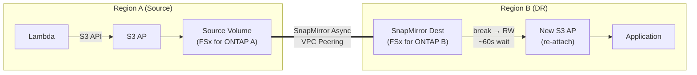

> 🌐 Language: [日本語](../ja/demo-guide-07-snapmirror-cross-region.md) | **English**

# Demo Guide 07: SnapMirror Cross-Region + S3 AP Re-Attach

> **Time Required**: ~60min(if FSx for ONTAP deployed in both regions)
> **Cost**: ~$15–20（if deleted after verification）
> **Audience**: infra engineers exploring DR / cross-region architectures
> **ONTAP Version**: 9.17.1+（FSx for ONTAP 2nd Generation）

---

> ⚠️ **Validation Status**: Partially validated. Cross-region Cluster Peering + SVM Peering confirmed (2026-07-22).
> SnapMirror transfer + break + S3 AP re-attach E2E not yet executed (requires FSx B re-deployment, ~$6/day).

## What This Demo Validates

```
Region A (ap-northeast-1)                    Region B (us-west-2)
┌──────────────────────────┐                ┌──────────────────────────┐
│  Lambda ──S3 API──▶ S3 AP │                │                          │
│        │                  │                │   SnapMirror Dest (DP)   │
│        ▼                  │   VPC Peering  │        Volume            │
│   Source Volume           │═══════════════▶│          │               │
│   (FSx for ONTAP A)      │  SnapMirror    │   [break → RW]           │
│                           │  Async         │          │               │
│                           │                │   New S3 AP (re-attach)  │
│                           │                │          │               │
│                           │                │   Lambda / App read   │
└──────────────────────────┘                └──────────────────────────┘

After DR failover:
  - Region B volume is Promoted to RW
  - Create and attach new S3 AP in Region B
  - Applications access data via Region B S3 AP
```




**Validation Points:**

| # | Validation Item | Action |
|:-:|---------|------|
| 1 | Write data via S3 AP in Region A | Lambda → S3 AP |
| 2 | Verify SnapMirror replication complete | SnapMirror status |
| 3 | SnapMirror break in Region B (promote to RW) | ONTAP REST API |
| 4 | After 60s wait, verify VolumeType via FSx API Verify | AWS CLI |
| 5 | Create new S3 AP + data access in Region B | AWS CLI → S3 API |

---

## Prerequisites

[Common Prerequisites](../en/demo-guide-00-prerequisites.md) plus the following:

| Resource | Region | Description |
|----------|-----------|------|
| FSx for ONTAP A | ap-northeast-1 | Source Volume |
| FSx for ONTAP B | us-west-2 | Destination Volume |
| VPC Peering | Both regions | for Intercluster communication |
| Cluster Peering + SVM Peering | Both clusters | SnapMirror prerequisite |

> **VPC Peering / Cluster Peering**: [Demo Guide 02 Step 1-3](../en/demo-guide-02-flexcache-cross-region.md#step-1-vpc-peering-の作成)  procedure. Refer to this guide.

---

## Step 0: Set Environment Variables

```bash
# === Region A (Source) ===
export REGION_A="ap-northeast-1"
export FS_ID_A="fs-0EXAMPLE1111aaaaa"
export SVM_NAME_A="svm-source"
export SECRET_ARN_A="arn:aws:secretsmanager:ap-northeast-1:123456789012:secret:fsxn-admin-A-XXXXXX"

# === Region B (Destination) ===
export REGION_B="us-west-2"
export FS_ID_B="fs-0EXAMPLE2222bbbbb"
export SVM_NAME_B="svm-dest"
export SECRET_ARN_B="arn:aws:secretsmanager:us-west-2:123456789012:secret:fsxn-admin-B-XXXXXX"

# === Common ===
export SOURCE_VOL="vol_sm_source"
export DEST_VOL="vol_sm_dest"
export S3AP_NAME_A="fsxn-sm-source"
export S3AP_NAME_B="fsxn-sm-dest-dr"
```

---

## Step 1: Create Source Volume + S3 AP (Region A)

```bash
MGMT_IP_A=$(aws fsx describe-file-systems --file-system-ids "$FS_ID_A" \
  --query 'FileSystems[0].OntapConfiguration.Endpoints.Management.IpAddresses[0]' \
  --output text --region "$REGION_A")

CREDS_A=$(aws secretsmanager get-secret-value --secret-id "$SECRET_ARN_A" \
  --query SecretString --output text --region "$REGION_A")
USER_A=$(echo "$CREDS_A" | jq -r '.username')
PASS_A=$(echo "$CREDS_A" | jq -r '.password')

# Create Source Volume
curl -sk -u "${USER_A}:${PASS_A}" \
  -X POST "https://${MGMT_IP_A}/api/storage/volumes" \
  -H "Content-Type: application/json" \
  -d "{
    \"name\": \"${SOURCE_VOL}\",
    \"svm\": {\"name\": \"${SVM_NAME_A}\"},
    \"size\": 10737418240,
    \"nas\": {\"path\": \"/${SOURCE_VOL}\", \"security_style\": \"unix\", \"unix_permissions\": \"0777\"},
    \"guarantee\": {\"type\": \"none\"}
  }" | jq '{job: .job.uuid}'

sleep 10

# Attach S3 AP
VOL_ID_A=$(aws fsx describe-volumes \
  --filters Name=file-system-id,Values="$FS_ID_A" \
  --query "Volumes[?Name=='${SOURCE_VOL}'].VolumeId" \
  --output text --region "$REGION_A")

aws fsx create-and-attach-s3-access-point \
  --name "$S3AP_NAME_A" --type ONTAP \
  --ontap-configuration "{
    \"VolumeId\": \"${VOL_ID_A}\",
    \"FileSystemIdentity\": {\"Type\": \"UNIX\", \"UnixUser\": {\"Name\": \"fsxadmin\"}}
  }" --region "$REGION_A" | jq '{Name: .S3AccessPoint.Name, Status: .S3AccessPoint.Lifecycle}'
```

---

## Step 2: Write Data with Lambda

> [Demo Guide 01 Step 5-6](../en/demo-guide-01-flexcache-same-region.md#step-5-lambda-writer-関数のデプロイ) . Refer to this guide.Use Lambda in Region A to write test data.

---

## Step 3: Create SnapMirror Destination Volume (Region B)

```bash
MGMT_IP_B=$(aws fsx describe-file-systems --file-system-ids "$FS_ID_B" \
  --query 'FileSystems[0].OntapConfiguration.Endpoints.Management.IpAddresses[0]' \
  --output text --region "$REGION_B")

CREDS_B=$(aws secretsmanager get-secret-value --secret-id "$SECRET_ARN_B" \
  --query SecretString --output text --region "$REGION_B")
USER_B=$(echo "$CREDS_B" | jq -r '.username')
PASS_B=$(echo "$CREDS_B" | jq -r '.password')

# Create Destination Volume (type: DP)
curl -sk -u "${USER_B}:${PASS_B}" \
  -X POST "https://${MGMT_IP_B}/api/storage/volumes" \
  -H "Content-Type: application/json" \
  -d "{
    \"name\": \"${DEST_VOL}\",
    \"svm\": {\"name\": \"${SVM_NAME_B}\"},
    \"size\": 10737418240,
    \"type\": \"dp\",
    \"guarantee\": {\"type\": \"none\"}
  }" | jq '{job: .job.uuid}'

sleep 10
echo "Destination Volume (DP) 作成Complete"
```

---

## Step 4: Create SnapMirror Relationship + Initial Transfer

```bash
# Create SnapMirror relationship（Region B  side: ）
curl -sk -u "${USER_B}:${PASS_B}" \
  -X POST "https://${MGMT_IP_B}/api/snapmirror/relationships" \
  -H "Content-Type: application/json" \
  -d "{
    \"source\": {
      \"path\": \"${SVM_NAME_A}:${SOURCE_VOL}\",
      \"cluster\": {\"name\": \"$(curl -sk -u "${USER_B}:${PASS_B}" "https://${MGMT_IP_B}/api/cluster/peers" | jq -r '.records[0].name')\"}
    },
    \"destination\": {
      \"path\": \"${SVM_NAME_B}:${DEST_VOL}\"
    },
    \"policy\": {\"name\": \"MirrorAllSnapshots\"}
  }" | jq '{job: .job.uuid}'

echo "SnapMirror initial transfer in progress..."
sleep 30
```

```bash
# SnapMirror 状態Verify
curl -sk -u "${USER_B}:${PASS_B}" \
  "https://${MGMT_IP_B}/api/snapmirror/relationships?destination.path=${SVM_NAME_B}:${DEST_VOL}&fields=state,transfer" \
  | jq '.records[0] | {state, healthy: .healthy, last_transfer_type: .transfer.state}'
```

**Expected Output:**
```json
{
  "state": "snapmirrored",
  "healthy": true,
  "last_transfer_type": "idle"
}
```

---

## Step 5: DR Failover — SnapMirror Break

```bash
# Get SnapMirror relationship UUID
SM_UUID=$(curl -sk -u "${USER_B}:${PASS_B}" \
  "https://${MGMT_IP_B}/api/snapmirror/relationships?destination.path=${SVM_NAME_B}:${DEST_VOL}" \
  | jq -r '.records[0].uuid')

# SnapMirror Break (promote Destination to RW)
curl -sk -u "${USER_B}:${PASS_B}" \
  -X PATCH "https://${MGMT_IP_B}/api/snapmirror/relationships/${SM_UUID}" \
  -H "Content-Type: application/json" \
  -d '{"state": "broken_off"}' | jq '{job: .job.uuid}'

echo "Executing SnapMirror Break..."
sleep 15
```

```bash
# Volume が Promoted to RWされたかVerify
curl -sk -u "${USER_B}:${PASS_B}" \
  "https://${MGMT_IP_B}/api/storage/volumes?name=${DEST_VOL}&fields=type,state" \
  | jq '.records[0] | {name, type, state}'
```

**Expected Output:**
```json
{
  "name": "vol_sm_dest",
  "type": "rw",
  "state": "online"
}
```

---

## Step 6: Set Junction Path + Wait for FSx API Sync

```bash
# Set Junction Path (unmounted after break)
DEST_UUID=$(curl -sk -u "${USER_B}:${PASS_B}" \
  "https://${MGMT_IP_B}/api/storage/volumes?name=${DEST_VOL}" \
  | jq -r '.records[0].uuid')

curl -sk -u "${USER_B}:${PASS_B}" \
  -X PATCH "https://${MGMT_IP_B}/api/storage/volumes/${DEST_UUID}" \
  -H "Content-Type: application/json" \
  -d "{\"nas\": {\"path\": \"/${DEST_VOL}\"}}" | jq .
```

```bash
# Important: Wait until FSx API shows VolumeType=RW (~60 seconds)
echo "Waiting for FSx API sync (60s)..."
sleep 60

# FSx API で Volume が認識されることをVerify
VOL_ID_B=$(aws fsx describe-volumes \
  --filters Name=file-system-id,Values="$FS_ID_B" \
  --query "Volumes[?Name=='${DEST_VOL}'].VolumeId" \
  --output text --region "$REGION_B")
echo "Destination Volume ID: $VOL_ID_B"

aws fsx describe-volumes --volume-ids "$VOL_ID_B" \
  --query 'Volumes[0].{Name:Name,Type:OntapConfiguration.OntapVolumeType,Lifecycle:Lifecycle}' \
  --region "$REGION_B"
```

**Expected Output:**
```json
{
  "Name": "vol_sm_dest",
  "Type": "RW",
  "Lifecycle": "AVAILABLE"
}
```

---

## Step 7: Re-Attach S3 AP (Region B)

```bash
# Create new S3 AP in Region B
aws fsx create-and-attach-s3-access-point \
  --name "$S3AP_NAME_B" --type ONTAP \
  --ontap-configuration "{
    \"VolumeId\": \"${VOL_ID_B}\",
    \"FileSystemIdentity\": {\"Type\": \"UNIX\", \"UnixUser\": {\"Name\": \"fsxadmin\"}}
  }" --region "$REGION_B" | jq '{Name: .S3AccessPoint.Name, Status: .S3AccessPoint.Lifecycle}'

# Wait for AVAILABLE
echo "Creating S3 AP..."
while true; do
  STATUS=$(aws fsx describe-s3-access-points \
    --filters Name=file-system-id,Values="$FS_ID_B" \
    --query "S3AccessPoints[?Name=='${S3AP_NAME_B}'].Lifecycle" \
    --output text --region "$REGION_B" 2>/dev/null || echo "CHECKING")
  echo "  Status: $STATUS"
  [[ "$STATUS" == "AVAILABLE" ]] && break
  sleep 10
done

# Get S3 AP Alias
S3AP_ALIAS_B=$(aws fsx describe-s3-access-points \
  --filters Name=file-system-id,Values="$FS_ID_B" \
  --query "S3AccessPoints[?Name=='${S3AP_NAME_B}'].S3AccessPointConfiguration.Alias" \
  --output text --region "$REGION_B")
echo "DR S3 AP Alias: $S3AP_ALIAS_B"
```

---

## Step 8: DR 先でデータアクセスVerify

```bash
# Read data via Region B S3 AP
aws s3api list-objects-v2 \
  --bucket "$S3AP_ALIAS_B" \
  --prefix "demo-data/" \
  --region "$REGION_B" | jq '.Contents[] | {Key, Size}'

# ファイルContentVerify
aws s3api get-object \
  --bucket "$S3AP_ALIAS_B" \
  --key "demo-data/sensor-001.json" \
  /tmp/dr-sensor.json --region "$REGION_B"
cat /tmp/dr-sensor.json | jq .
```

**Expected Output:**
```json
{
  "sensor_id": "S001",
  "temperature": 23.5,
  "humidity": 65,
  "ts": 1753090800
}
```

> **DR failover successful**: Data written in Region A is successfully readable via the new S3 AP in Region B.

---

## Cleanup

```bash
# 1. Region B: S3 AP 削除
# 2. Region B: Volume 削除（先に SnapMirror 関係を削除）
curl -sk -u "${USER_B}:${PASS_B}" \
  -X DELETE "https://${MGMT_IP_B}/api/snapmirror/relationships/${SM_UUID}" \
  -H "Content-Type: application/json" \
  -d '{"destination_only": true}'
sleep 10

# 3. Region A: S3 AP 削除 + Source Volume 削除
# 4. Delete VPC Peering（Demo Guide 02 refer to this guide）
# 5. Lambda 削除（Demo Guide 01 refer to this guide）
```

---

## Troubleshooting

| Symptom | Cause | Resolution |
|------|------|------|
| SnapMirror 初期転送が進まない | Intercluster ポート (11104-11105) 未許可 | SG / Route Verify |
| After breakに Volume が "offline" | Junction Path not set | `nas.path` を PATCH で設定 |
| FSx API で VolumeType が "DP" のまま | 同期遅延（通常 60 秒） | Wait another 60 seconds and retry |
| S3 AP 作成: "volume is DP type" | FSx API 同期前に作成試行 | VolumeType="RW" になるまで待機 |
| S3 AP 作成: "object storage server exists" | 同一 SVM に native S3 server あり | 別 SVM を使用 |
| SnapMirror 状態が "unhealthy" | ネットワーク断 or Peer 切れ | cluster/peers status Verify |

---

## References

- [AWS Docs: FSx for ONTAP SnapMirror](https://docs.aws.amazon.com/fsx/latest/ONTAPGuide/using-snapmirror.html)
- [NetApp Docs: SnapMirror Async](https://docs.netapp.com/us-en/ontap/data-protection/index.html)
- [Demo Guide 02: FlexCache クロスリージョン](../en/demo-guide-02-flexcache-cross-region.md)（VPC Peering / Cluster Peering 手順）
- [Demo Guide 01: FlexCache 同一リージョン](../en/demo-guide-01-flexcache-same-region.md)（Lambda Writer 手順）
