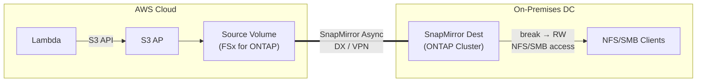

> 🌐 Language: [日本語](../ja/demo-guide-08-snapmirror-on-premises.md) | **English**

# Demo Guide 08: SnapMirror オンプレミス（FSx for ONTAP → On-premises ONTAP）

> **Time Required**: ~60min(if DX/VPN + Cluster Peering already configured)
> **Cost**: ~$5–10（AWS side only）
> **Audience**: infra engineers exploring hybrid DR / data sync
> **ONTAP Version**: FSx 9.17.1+ / On-premises 9.11.1+

---

## What This Demo Validates

```
AWS Cloud (ap-northeast-1)                  On-premises DC
┌────────────────────────────┐              ┌────────────────────────────┐
│  Lambda ──S3 API──▶ S3 AP  │              │                            │
│        │                   │              │   SnapMirror Destination   │
│        ▼                   │  DX / VPN    │        Volume (DP → RW)   │
│   Source Volume            │═════════════▶│          │                 │
│   (FSx for ONTAP)         │  SnapMirror  │   ┌──────┴──────┐         │
│                            │  Async       │   NFS mount   SMB mount    │
│                            │              │  (Linux srv) (Win srv)     │
└────────────────────────────┘              └────────────────────────────┘

※ S3 AP is not available on-premises (AWS-only feature)
   On-premises side accesses data via NFS/SMB after mirror break
```




**Validation Points:**

| # | Validation Item | Action |
|:-:|---------|------|
| 1 | Write data via S3 AP on AWS | Lambda → S3 AP |
| 2 | Verify SnapMirror replication complete | SnapMirror status |
| 3 | SnapMirror break on-premises | ONTAP CLI |
| 4 | NFS/SMB data access on-premises | NFS/SMB |

> **Important**: S3 Access Point は AWS 専用機能です。オンプレミス ONTAP では S3 AP を作成できません。After breakのデータアクセスは NFS/SMB のみです。

---

## Prerequisites

[Common Prerequisites](../en/demo-guide-00-prerequisites.md) plus the following:

| Resource | Location | Description |
|----------|------|------|
| FSx for ONTAP | AWS | Source Volume + S3 AP |
| ONTAP クラスター | オンプレミス | Destination Volume（9.11.1+） |
| Direct Connect or VPN | 両拠点 | Intercluster communication |
| Cluster + SVM Peering | Both clusters | SnapMirror prerequisite |

> **Cluster Peering の構成**: [Demo Guide 03 Step 2-3](../en/demo-guide-03-flexcache-on-premises.md#step-2-cluster-peeringオンプレミス-ontap-cli) . Refer to this guide.

---

## Step 0: Set Environment Variables

```bash
# === AWS Side (Source) ===
export AWS_REGION="ap-northeast-1"
export FS_ID="fs-0EXAMPLE1234abcde"
export SVM_NAME_AWS="svm-source"
export SECRET_ARN="arn:aws:secretsmanager:ap-northeast-1:123456789012:secret:fsxn-admin-XXXXXX"

# === On-Premises Side (Destination) ===
export ONPREM_CLUSTER_IP="198.51.100.100"
export ONPREM_SVM="svm-onprem-dr"
export ONPREM_USER="admin"

# === Common ===
export SOURCE_VOL="vol_sm_onprem_src"
export DEST_VOL="vol_sm_onprem_dest"
export S3AP_NAME="fsxn-sm-onprem"
```

---

## Step 1: Source Volume + S3 AP + Lambda Writer（AWS  side）

> [Demo Guide 01 Step 4-6](../en/demo-guide-01-flexcache-same-region.md#step-4-origin-volume-作成--s3-ap-アタッチ) . Replace volume name with `$SOURCE_VOL` .

---

## Step 2: Destination Volume 作成（オンプレミス ONTAP CLI）

```
# On-premises sideでDP Volume を作成
cluster1::> volume create -vserver svm-onprem-dr -volume vol_sm_onprem_dest \
  -aggregate aggr1 -size 20GB -type DP
```

**Expected Output:**
```
[Job 123] Job succeeded: Successful
```

---

## Step 3: SnapMirror 関係の作成

```
# Create SnapMirror relationship from on-premises
cluster1::> snapmirror create -source-path svm-source:vol_sm_onprem_src \
  -destination-path svm-onprem-dr:vol_sm_onprem_dest \
  -type XDP -policy MirrorAllSnapshots

# Execute initial transfer
cluster1::> snapmirror initialize -destination-path svm-onprem-dr:vol_sm_onprem_dest
```

```
# Check transfer status
cluster1::> snapmirror show -destination-path svm-onprem-dr:vol_sm_onprem_dest \
  -fields state,status,last-transfer-type

# Expected:
# state: Snapmirrored  status: Idle  last-transfer-type: initialize
```

---

## Step 4: DR Failover — SnapMirror Break

```
# SnapMirror Break (on-premises side)
cluster1::> snapmirror break -destination-path svm-onprem-dr:vol_sm_onprem_dest

# Verify
cluster1::> snapmirror show -destination-path svm-onprem-dr:vol_sm_onprem_dest -fields state
# Expected: state: Broken-off
```

```
# Set Junction Path to make volume accessible
cluster1::> volume mount -vserver svm-onprem-dr -volume vol_sm_onprem_dest \
  -junction-path /vol_sm_onprem_dest

# Check volume status
cluster1::> volume show -volume vol_sm_onprem_dest -fields state,type,junction-path
# Expected: state: online  type: RW  junction-path: /vol_sm_onprem_dest
```

---

## Step 5: NFS/SMB Data Access (On-Premises)

```bash
# オンプレミス Linux サーバー
DATA_LIF_ONPREM="198.51.100.110"

sudo mkdir -p /mnt/sm_dest
sudo mount -t nfs -o vers=3 ${DATA_LIF_ONPREM}:/vol_sm_onprem_dest /mnt/sm_dest

# Verify data written by Lambda
ls -la /mnt/sm_dest/demo-data/
cat /mnt/sm_dest/demo-data/sensor-001.json | jq .
```

**Expected Output:**
```json
{
  "sensor_id": "S001",
  "temperature": 23.5,
  "humidity": 65,
  "ts": 1753090800
}
```

```bash
# Volume is now RW, writes are possible
echo '{"source": "on-premises-dr", "ts": '$(date +%s)'}' > /mnt/sm_dest/demo-data/dr-written.json
cat /mnt/sm_dest/demo-data/dr-written.json
```

---

## Step 6: Resync (Failback) — Optional

To return to Region A after DR test:

```
# SnapMirror resync（オンプレミス → AWS への逆方向は別途設定が必要）
# 通常は reverse resync を使用
cluster1::> snapmirror resync -destination-path svm-onprem-dr:vol_sm_onprem_dest

# ※ Full failback is outside the scope of this guide
```

---

## Cleanup

```bash
# On-premises side
cluster1::> snapmirror delete -destination-path svm-onprem-dr:vol_sm_onprem_dest
cluster1::> snapmirror release -destination-path svm-onprem-dr:vol_sm_onprem_dest -relationship-info-only true
cluster1::> volume unmount -vserver svm-onprem-dr -volume vol_sm_onprem_dest
cluster1::> volume offline -vserver svm-onprem-dr -volume vol_sm_onprem_dest
cluster1::> volume delete -vserver svm-onprem-dr -volume vol_sm_onprem_dest

# AWS side: S3 AP 削除 + Source Volume 削除 + Lambda 削除（Demo Guide 01 refer to this guide）
```

---

## Troubleshooting

| Symptom | Cause | Resolution |
|------|------|------|
| SnapMirror initialize が進まない | 11104-11105 ポート未開放 | DX/VPN 経由のポートVerify |
| "source volume not found" | SVM Peering missing `snapmirror` application | Re-create SVM Peer |
| After breakに volume が "restricted" | Junction Path not set | `volume mount` コマンド実行 |
| NFS mount タイムアウト | Data LIF から到達Not available | Check routing + firewall |
| データが空 | Break before initial transfer completed | `snapmirror show` で last-transfer-type Verify |

---

## References

- [NetApp Docs: SnapMirror](https://docs.netapp.com/us-en/ontap/data-protection/index.html)
- [AWS Docs: FSx for ONTAP SnapMirror](https://docs.aws.amazon.com/fsx/latest/ONTAPGuide/using-snapmirror.html)
- [Demo Guide 03: FlexCache オンプレミス](../en/demo-guide-03-flexcache-on-premises.md)（Cluster Peering 手順）
- [Demo Guide 01: FlexCache 同一リージョン](../en/demo-guide-01-flexcache-same-region.md)（Lambda Writer 手順）
