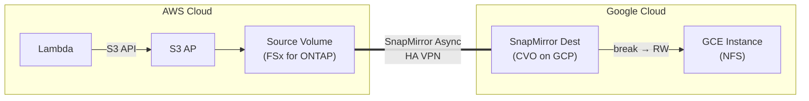

> 🌐 Language: [日本語](../ja/demo-guide-09-snapmirror-cvo-gcp.md) | **English**

# Demo Guide 09: SnapMirror CVO on GCP（FSx for ONTAP → Cloud Volumes ONTAP on GCP）

> **Time Required**: ~120min(including CVO deployment)
> **Cost**: ~$20–30（AWS + GCP combined, if deleted after verification）
> **Audience**: engineers exploring AWS → GCP multi-cloud DR
> **ONTAP Version**: FSx 9.17.1+ / CVO 9.11.1+

---

> ⚠️ **Validation Status**: Procedure-level guide (not yet E2E validated in a live environment).
> Commands and architecture are based on official documentation and patterns validated in Guide 01/02 (same-region / cross-region FSx for ONTAP).
> External environment required for full validation — see BACKLOG items 7–12.


## What This Demo Validates

```
AWS Cloud (ap-northeast-1)                  Google Cloud (us-central1)
┌────────────────────────────┐              ┌────────────────────────────┐
│  Lambda ──S3 API──▶ S3 AP  │              │                            │
│        │                   │              │  Cloud Volumes ONTAP (GCP) │
│        ▼                   │  HA VPN      │    SnapMirror Dest (DP)    │
│   Source Volume            │═════════════▶│        [break → RW]        │
│   (FSx for ONTAP)         │  SnapMirror  │          │                 │
│                            │  Async       │    NFS mount               │
│                            │              │   (GCE instance)           │
└────────────────────────────┘              └────────────────────────────┘

※ S3 AP is AWS-only — GCP side accesses via NFS/SMB
```




**Validation Points:**

| # | Validation Item | Action |
|:-:|---------|------|
| 1 | Write data via S3 AP on AWS | Lambda → S3 AP |
| 2 | Verify SnapMirror replication | REST API |
| 3 | SnapMirror break on GCP CVO | REST API |
| 4 | NFS data access from GCE | NFS |

---

> ⚠️ **Validation Status**: Procedure-level guide (not yet E2E validated in a live environment).
> Commands and architecture are based on official documentation and patterns validated in Guide 01/02 (same-region / cross-region FSx for ONTAP).
> External environment required for full validation — see BACKLOG items 7–12.


## Prerequisites

[Common Prerequisites](../en/demo-guide-00-prerequisites.md) plus the following:

| Resource | Cloud | Description |
|----------|---------|------|
| FSx for ONTAP | AWS | Source Volume + S3 AP |
| Cloud Volumes ONTAP | GCP | Destination Volume |
| HA VPN | AWS ↔ GCP | Intercluster communication |
| Cluster + SVM Peering | Both clusters | SnapMirror prerequisite |

> **VPN + Cluster Peering**: [Demo Guide 04 Step 1-3](../en/demo-guide-04-flexcache-cvo-gcp.md#step-1-gcp-ha-vpn-の作成) . Refer to this guide.

---

> ⚠️ **Validation Status**: Procedure-level guide (not yet E2E validated in a live environment).
> Commands and architecture are based on official documentation and patterns validated in Guide 01/02 (same-region / cross-region FSx for ONTAP).
> External environment required for full validation — see BACKLOG items 7–12.


## Step 0: Set Environment Variables

```bash
# === AWS Side ===
export AWS_REGION="ap-northeast-1"
export FS_ID="fs-0EXAMPLE1234abcde"
export SVM_NAME_AWS="svm-source"
export SECRET_ARN="arn:aws:secretsmanager:ap-northeast-1:123456789012:secret:fsxn-admin-XXXXXX"

# === GCP CVO Side ===
export CVO_CLUSTER_IP="198.51.100.40"
export CVO_SVM="svm-gcp-dest"

# === Common ===
export SOURCE_VOL="vol_sm_gcp_src"
export DEST_VOL="vol_sm_gcp_dest"
export S3AP_NAME="fsxn-sm-gcp"
```

---

> ⚠️ **Validation Status**: Procedure-level guide (not yet E2E validated in a live environment).
> Commands and architecture are based on official documentation and patterns validated in Guide 01/02 (same-region / cross-region FSx for ONTAP).
> External environment required for full validation — see BACKLOG items 7–12.


## Step 1: Source Volume + S3 AP + Lambda Writer（AWS  side）

> [Demo Guide 01 Step 4-6](../en/demo-guide-01-flexcache-same-region.md#step-4-origin-volume-作成--s3-ap-アタッチ) . Refer to this guide.

---

> ⚠️ **Validation Status**: Procedure-level guide (not yet E2E validated in a live environment).
> Commands and architecture are based on official documentation and patterns validated in Guide 01/02 (same-region / cross-region FSx for ONTAP).
> External environment required for full validation — see BACKLOG items 7–12.


## Step 2: VPN + Cluster Peering + SVM Peering

> [Demo Guide 04 Step 1-3](../en/demo-guide-04-flexcache-cvo-gcp.md#step-1-gcp-ha-vpn-の作成) . Refer to this guide.SVM Peering の `applications` に `snapmirror`  flagしてください。

```bash
# Set SVM Peer applications to snapmirror
MGMT_IP=$(aws fsx describe-file-systems --file-system-ids "$FS_ID" \
  --query 'FileSystems[0].OntapConfiguration.Endpoints.Management.IpAddresses[0]' \
  --output text --region "$AWS_REGION")

CREDS=$(aws secretsmanager get-secret-value --secret-id "$SECRET_ARN" \
  --query SecretString --output text --region "$AWS_REGION")
ONTAP_USER=$(echo "$CREDS" | jq -r '.username')
ONTAP_PASS=$(echo "$CREDS" | jq -r '.password')

curl -sk -u "${ONTAP_USER}:${ONTAP_PASS}" \
  -X POST "https://${MGMT_IP}/api/svm/peers" \
  -H "Content-Type: application/json" \
  -d "{
    \"svm\": {\"name\": \"${SVM_NAME_AWS}\"},
    \"peer\": {\"svm\": {\"name\": \"${CVO_SVM}\"}},
    \"applications\": [\"snapmirror\"]
  }" | jq '{job: .job.uuid}'
```

---

> ⚠️ **Validation Status**: Procedure-level guide (not yet E2E validated in a live environment).
> Commands and architecture are based on official documentation and patterns validated in Guide 01/02 (same-region / cross-region FSx for ONTAP).
> External environment required for full validation — see BACKLOG items 7–12.


## Step 3: Destination Volume 作成 + SnapMirror（GCP CVO）

```bash
# Create DP Volume on GCP CVO
curl -sk -u "admin:<CVO_PASSWORD>" \
  -X POST "https://${CVO_CLUSTER_IP}/api/storage/volumes" \
  -H "Content-Type: application/json" \
  -d "{
    \"name\": \"${DEST_VOL}\",
    \"svm\": {\"name\": \"${CVO_SVM}\"},
    \"size\": 10737418240,
    \"type\": \"dp\"
  }" | jq '{job: .job.uuid}'

sleep 10

# Create SnapMirror relationship
PEER_CLUSTER=$(curl -sk -u "admin:<CVO_PASSWORD>" \
  "https://${CVO_CLUSTER_IP}/api/cluster/peers" | jq -r '.records[0].name')

curl -sk -u "admin:<CVO_PASSWORD>" \
  -X POST "https://${CVO_CLUSTER_IP}/api/snapmirror/relationships" \
  -H "Content-Type: application/json" \
  -d "{
    \"source\": {
      \"path\": \"${SVM_NAME_AWS}:${SOURCE_VOL}\",
      \"cluster\": {\"name\": \"${PEER_CLUSTER}\"}
    },
    \"destination\": {
      \"path\": \"${CVO_SVM}:${DEST_VOL}\"
    },
    \"policy\": {\"name\": \"MirrorAllSnapshots\"}
  }" | jq '{job: .job.uuid}'

echo "SnapMirror initial transfer in progress..."
sleep 45
```

```bash
# Check status
curl -sk -u "admin:<CVO_PASSWORD>" \
  "https://${CVO_CLUSTER_IP}/api/snapmirror/relationships?destination.path=${CVO_SVM}:${DEST_VOL}&fields=state,healthy" \
  | jq '.records[0] | {state, healthy}'
```

**Expected Output:**
```json
{
  "state": "snapmirrored",
  "healthy": true
}
```

---

> ⚠️ **Validation Status**: Procedure-level guide (not yet E2E validated in a live environment).
> Commands and architecture are based on official documentation and patterns validated in Guide 01/02 (same-region / cross-region FSx for ONTAP).
> External environment required for full validation — see BACKLOG items 7–12.


## Step 4: SnapMirror Break + NFS アクセス（GCP  side）

```bash
# SnapMirror Break
SM_UUID=$(curl -sk -u "admin:<CVO_PASSWORD>" \
  "https://${CVO_CLUSTER_IP}/api/snapmirror/relationships?destination.path=${CVO_SVM}:${DEST_VOL}" \
  | jq -r '.records[0].uuid')

curl -sk -u "admin:<CVO_PASSWORD>" \
  -X PATCH "https://${CVO_CLUSTER_IP}/api/snapmirror/relationships/${SM_UUID}" \
  -H "Content-Type: application/json" \
  -d '{"state": "broken_off"}' | jq '{job: .job.uuid}'

sleep 15

# Set Junction Path
DEST_UUID=$(curl -sk -u "admin:<CVO_PASSWORD>" \
  "https://${CVO_CLUSTER_IP}/api/storage/volumes?name=${DEST_VOL}" \
  | jq -r '.records[0].uuid')

curl -sk -u "admin:<CVO_PASSWORD>" \
  -X PATCH "https://${CVO_CLUSTER_IP}/api/storage/volumes/${DEST_UUID}" \
  -H "Content-Type: application/json" \
  -d "{\"nas\": {\"path\": \"/${DEST_VOL}\"}}" | jq .
```

```bash
# GCE インスタンスから NFS Mount
CVO_DATA_LIF="198.51.100.42"

sudo mkdir -p /mnt/sm_gcp_dest
sudo mount -t nfs -o vers=3 ${CVO_DATA_LIF}:/${DEST_VOL} /mnt/sm_gcp_dest

# Verify data
ls -la /mnt/sm_gcp_dest/demo-data/
cat /mnt/sm_gcp_dest/demo-data/sensor-001.json | jq .
```

**Expected Output:**
```json
{
  "sensor_id": "S001",
  "temperature": 23.5,
  "humidity": 65,
  "ts": 1753090800
}
```

---

> ⚠️ **Validation Status**: Procedure-level guide (not yet E2E validated in a live environment).
> Commands and architecture are based on official documentation and patterns validated in Guide 01/02 (same-region / cross-region FSx for ONTAP).
> External environment required for full validation — see BACKLOG items 7–12.


## Cleanup

```bash
# 1. GCE: NFS unmount
sudo umount /mnt/sm_gcp_dest

# 2. CVO: Delete SnapMirror relationship → Delete volume
curl -sk -u "admin:<CVO_PASSWORD>" \
  -X DELETE "https://${CVO_CLUSTER_IP}/api/snapmirror/relationships/${SM_UUID}" \
  -H "Content-Type: application/json" -d '{"destination_only": true}'

# 3. SVM Peer / Cluster Peer 削除
# 4. Delete CVO + VPN 削除（Demo Guide 04 refer to this guide）
# 5. AWS side: S3 AP + Volume + Lambda 削除（Demo Guide 01 refer to this guide）
```

---

> ⚠️ **Validation Status**: Procedure-level guide (not yet E2E validated in a live environment).
> Commands and architecture are based on official documentation and patterns validated in Guide 01/02 (same-region / cross-region FSx for ONTAP).
> External environment required for full validation — see BACKLOG items 7–12.


## Troubleshooting

| Symptom | Cause | Resolution |
|------|------|------|
| SnapMirror "quiesced" のまま進まない | Insufficient bandwidth or packet loss | Check VPN throughput |
| After break volume offline | Junction Path not set | `nas.path` を PATCH |
| "peer SVM not found" | SVM Peer の applications に snapmirror 未指定 | Re-create SVM Peer |
| 初期転送で "failed" | Data volume > CVO disk size | Increase CVO disk size |
| NFS: "stale file handle" | Break 直後のキャッシュ不整合 | Unmount → remount |

---

> ⚠️ **Validation Status**: Procedure-level guide (not yet E2E validated in a live environment).
> Commands and architecture are based on official documentation and patterns validated in Guide 01/02 (same-region / cross-region FSx for ONTAP).
> External environment required for full validation — see BACKLOG items 7–12.


## References

- [NetApp Docs: SnapMirror](https://docs.netapp.com/us-en/ontap/data-protection/index.html)
- [Demo Guide 04: FlexCache CVO on GCP](../en/demo-guide-04-flexcache-cvo-gcp.md)（VPN + CVO 手順）
- [Demo Guide 01: FlexCache 同一リージョン](../en/demo-guide-01-flexcache-same-region.md)（Lambda Writer 手順）
