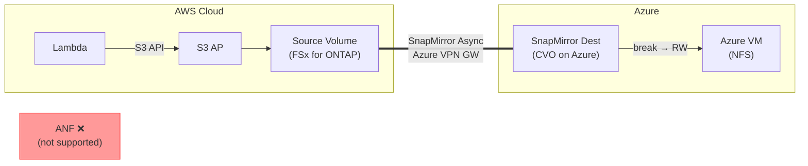

> 🌐 Language: [日本語](../ja/demo-guide-10-snapmirror-cvo-azure.md) | **English**

# Demo Guide 10: SnapMirror CVO on Azure（FSx for ONTAP → Cloud Volumes ONTAP on Azure）

> **Time Required**: ~120min(including CVO deployment)
> **Cost**: ~$20–30（AWS + Azure combined, if deleted after verification）
> **Audience**: engineers exploring AWS → Azure multi-cloud DR
> **ONTAP Version**: FSx 9.17.1+ / CVO 9.11.1+

---

> ⚠️ **Validation Status**: Procedure-level guide (not yet E2E validated in a live environment).
> Commands and architecture are based on official documentation and patterns validated in Guide 01/02 (same-region / cross-region FSx for ONTAP).
> External environment required for full validation — see BACKLOG items 7–12.


## What This Demo Validates

```
AWS Cloud (ap-northeast-1)                  Azure (East US)
┌────────────────────────────┐              ┌────────────────────────────┐
│  Lambda ──S3 API──▶ S3 AP  │              │                            │
│        │                   │              │  Cloud Volumes ONTAP       │
│        ▼                   │  Azure VPN   │    SnapMirror Dest (DP)    │
│   Source Volume            │  Gateway     │        [break → RW]        │
│   (FSx for ONTAP)         │═════════════▶│          │                 │
│                            │  SnapMirror  │    NFS mount               │
│                            │  Async       │   (Azure VM)               │
└────────────────────────────┘              └────────────────────────────┘

※ S3 AP is AWS-only — Azure side accesses via NFS/SMB
※ Azure NetApp Files (ANF) への直接 SnapMirror は未サポート (XC-007)
   → CVO on Azure が AWS → Azure の SnapMirror パス
```




**Validation Points:**

| # | Validation Item | Action |
|:-:|---------|------|
| 1 | Write data via S3 AP on AWS | Lambda → S3 AP |
| 2 | Verify SnapMirror replication | REST API |
| 3 | SnapMirror break on Azure CVO | REST API |
| 4 | Azure VM から NFS データアクセス | NFS |

---

> ⚠️ **Validation Status**: Procedure-level guide (not yet E2E validated in a live environment).
> Commands and architecture are based on official documentation and patterns validated in Guide 01/02 (same-region / cross-region FSx for ONTAP).
> External environment required for full validation — see BACKLOG items 7–12.


## Prerequisites

[Common Prerequisites](../en/demo-guide-00-prerequisites.md) plus the following:

| Resource | Cloud | Description |
|----------|---------|------|
| FSx for ONTAP | AWS | Source Volume + S3 AP |
| Cloud Volumes ONTAP | Azure | Destination Volume |
| Azure VPN Gateway | AWS ↔ Azure | IPsec トンネル |
| Cluster + SVM Peering | Both clusters | SnapMirror prerequisite |

> **重要制約 (XC-007)**: Azure NetApp Files (ANF) は FSx for ONTAP からの直接 SnapMirror をサポートしていません。AWS → Azure のデータレプリケーションには **CVO on Azure** を使用してください。

---

> ⚠️ **Validation Status**: Procedure-level guide (not yet E2E validated in a live environment).
> Commands and architecture are based on official documentation and patterns validated in Guide 01/02 (same-region / cross-region FSx for ONTAP).
> External environment required for full validation — see BACKLOG items 7–12.


## Step 0: Set Environment Variables

```bash
# === AWS Side ===
export AWS_REGION="ap-northeast-1"
export FS_ID="fs-0EXAMPLE1234abcde"
export SVM_NAME_AWS="svm-source"
export SECRET_ARN="arn:aws:secretsmanager:ap-northeast-1:123456789012:secret:fsxn-admin-XXXXXX"

# === Azure CVO Side ===
export CVO_CLUSTER_IP="198.51.100.50"
export CVO_SVM="svm-azure-dest"

# === Common ===
export SOURCE_VOL="vol_sm_azure_src"
export DEST_VOL="vol_sm_azure_dest"
export S3AP_NAME="fsxn-sm-azure"
```

---

> ⚠️ **Validation Status**: Procedure-level guide (not yet E2E validated in a live environment).
> Commands and architecture are based on official documentation and patterns validated in Guide 01/02 (same-region / cross-region FSx for ONTAP).
> External environment required for full validation — see BACKLOG items 7–12.


## Step 1: Source Volume + S3 AP + Lambda Writer（AWS  side）

> [Demo Guide 01 Step 4-6](../en/demo-guide-01-flexcache-same-region.md#step-4-create-origin-volume--attach-s3-ap) . Refer to this guide.

---

> ⚠️ **Validation Status**: Procedure-level guide (not yet E2E validated in a live environment).
> Commands and architecture are based on official documentation and patterns validated in Guide 01/02 (same-region / cross-region FSx for ONTAP).
> External environment required for full validation — see BACKLOG items 7–12.


## Step 2: VPN + Cluster Peering + SVM Peering

> [Demo Guide 05 Step 1-3](../en/demo-guide-05-flexcache-cvo-azure.md#step-1-create-azure-vpn-gateway) . Refer to this guide.SVM Peering の `applications` に `snapmirror`  flag。

```bash
# Create SVM Peer時（AWS  side）
MGMT_IP=$(aws fsx describe-file-systems --file-system-ids "$FS_ID" \
  --query 'FileSystems[0].OntapConfiguration.Endpoints.Management.IpAddresses[0]' \
  --output text --region "$AWS_REGION")

CREDS=$(aws secretsmanager get-secret-value --secret-id "$SECRET_ARN" \
  --query SecretString --output text --region "$AWS_REGION")
ONTAP_USER=$(echo "$CREDS" | jq -r '.username')
ONTAP_PASS=$(echo "$CREDS" | jq -r '.password')

curl -sk -u "${ONTAP_USER}:${ONTAP_PASS}" \
  -X POST "https://${MGMT_IP}/api/svm/peers" \
  -H "Content-Type: application/json" \
  -d "{
    \"svm\": {\"name\": \"${SVM_NAME_AWS}\"},
    \"peer\": {\"svm\": {\"name\": \"${CVO_SVM}\"}},
    \"applications\": [\"snapmirror\"]
  }" | jq '{job: .job.uuid}'
```

---

> ⚠️ **Validation Status**: Procedure-level guide (not yet E2E validated in a live environment).
> Commands and architecture are based on official documentation and patterns validated in Guide 01/02 (same-region / cross-region FSx for ONTAP).
> External environment required for full validation — see BACKLOG items 7–12.


## Step 3: Destination Volume 作成 + SnapMirror（Azure CVO）

```bash
# Azure CVO  side:  DP Volume 作成
curl -sk -u "admin:<CVO_PASSWORD>" \
  -X POST "https://${CVO_CLUSTER_IP}/api/storage/volumes" \
  -H "Content-Type: application/json" \
  -d "{
    \"name\": \"${DEST_VOL}\",
    \"svm\": {\"name\": \"${CVO_SVM}\"},
    \"size\": 10737418240,
    \"type\": \"dp\"
  }" | jq '{job: .job.uuid}'

sleep 10

# Create SnapMirror relationship
PEER_CLUSTER=$(curl -sk -u "admin:<CVO_PASSWORD>" \
  "https://${CVO_CLUSTER_IP}/api/cluster/peers" | jq -r '.records[0].name')

curl -sk -u "admin:<CVO_PASSWORD>" \
  -X POST "https://${CVO_CLUSTER_IP}/api/snapmirror/relationships" \
  -H "Content-Type: application/json" \
  -d "{
    \"source\": {
      \"path\": \"${SVM_NAME_AWS}:${SOURCE_VOL}\",
      \"cluster\": {\"name\": \"${PEER_CLUSTER}\"}
    },
    \"destination\": {
      \"path\": \"${CVO_SVM}:${DEST_VOL}\"
    },
    \"policy\": {\"name\": \"MirrorAllSnapshots\"}
  }" | jq '{job: .job.uuid}'

echo "SnapMirror initial transfer in progress..."
sleep 45
```

```bash
# Check status
curl -sk -u "admin:<CVO_PASSWORD>" \
  "https://${CVO_CLUSTER_IP}/api/snapmirror/relationships?destination.path=${CVO_SVM}:${DEST_VOL}&fields=state,healthy" \
  | jq '.records[0] | {state, healthy}'
```

**Expected Output:**
```json
{
  "state": "snapmirrored",
  "healthy": true
}
```

---

> ⚠️ **Validation Status**: Procedure-level guide (not yet E2E validated in a live environment).
> Commands and architecture are based on official documentation and patterns validated in Guide 01/02 (same-region / cross-region FSx for ONTAP).
> External environment required for full validation — see BACKLOG items 7–12.


## Step 4: SnapMirror Break + NFS アクセス（Azure  side）

```bash
# SnapMirror Break
SM_UUID=$(curl -sk -u "admin:<CVO_PASSWORD>" \
  "https://${CVO_CLUSTER_IP}/api/snapmirror/relationships?destination.path=${CVO_SVM}:${DEST_VOL}" \
  | jq -r '.records[0].uuid')

curl -sk -u "admin:<CVO_PASSWORD>" \
  -X PATCH "https://${CVO_CLUSTER_IP}/api/snapmirror/relationships/${SM_UUID}" \
  -H "Content-Type: application/json" \
  -d '{"state": "broken_off"}' | jq '{job: .job.uuid}'

sleep 15

# Set Junction Path
DEST_UUID=$(curl -sk -u "admin:<CVO_PASSWORD>" \
  "https://${CVO_CLUSTER_IP}/api/storage/volumes?name=${DEST_VOL}" \
  | jq -r '.records[0].uuid')

curl -sk -u "admin:<CVO_PASSWORD>" \
  -X PATCH "https://${CVO_CLUSTER_IP}/api/storage/volumes/${DEST_UUID}" \
  -H "Content-Type: application/json" \
  -d "{\"nas\": {\"path\": \"/${DEST_VOL}\"}}" | jq .
```

```bash
# Azure VM から NFS Mount
CVO_DATA_LIF="198.51.100.52"

sudo mkdir -p /mnt/sm_azure_dest
sudo mount -t nfs -o vers=3 ${CVO_DATA_LIF}:/${DEST_VOL} /mnt/sm_azure_dest

# Verify data
ls -la /mnt/sm_azure_dest/demo-data/
cat /mnt/sm_azure_dest/demo-data/sensor-001.json | jq .
```

**Expected Output:**
```json
{
  "sensor_id": "S001",
  "temperature": 23.5,
  "humidity": 65,
  "ts": 1753090800
}
```

---

> ⚠️ **Validation Status**: Procedure-level guide (not yet E2E validated in a live environment).
> Commands and architecture are based on official documentation and patterns validated in Guide 01/02 (same-region / cross-region FSx for ONTAP).
> External environment required for full validation — see BACKLOG items 7–12.


## Cleanup

```bash
# 1. Azure VM: NFS unmount
sudo umount /mnt/sm_azure_dest

# 2. CVO: Delete SnapMirror relationship → Delete volume
curl -sk -u "admin:<CVO_PASSWORD>" \
  -X DELETE "https://${CVO_CLUSTER_IP}/api/snapmirror/relationships/${SM_UUID}" \
  -H "Content-Type: application/json" -d '{"destination_only": true}'

# 3. Delete CVO + VPN 削除（Demo Guide 05 refer to this guide）
# 4. AWS side: S3 AP + Volume + Lambda 削除（Demo Guide 01 refer to this guide）
```

---

> ⚠️ **Validation Status**: Procedure-level guide (not yet E2E validated in a live environment).
> Commands and architecture are based on official documentation and patterns validated in Guide 01/02 (same-region / cross-region FSx for ONTAP).
> External environment required for full validation — see BACKLOG items 7–12.


## Troubleshooting

| Symptom | Cause | Resolution |
|------|------|------|
| SnapMirror 初期転送タイムアウト | Insufficient VPN throughput | Upgrade VPN Gateway SKU to VpnGw2 or higher |
| "peer cluster unreachable" | NSG not allowing 11104-11105 | Check both Azure NSG + AWS SG |
| After breakに NFS mount 失敗 | Junction Path not set or Data LIF incorrect | REST API でVerify |
| CVO ディスク空き不足 | Managed Disk サイズ < Source Vol | Add CVO disk |
| ANF を使いたい | FSx → ANF direct SnapMirror not supported | Use CVO on Azure (XC-007) |

---

> ⚠️ **Validation Status**: Procedure-level guide (not yet E2E validated in a live environment).
> Commands and architecture are based on official documentation and patterns validated in Guide 01/02 (same-region / cross-region FSx for ONTAP).
> External environment required for full validation — see BACKLOG items 7–12.


## Why ANF Cannot Be Used (Technical Background)

Azure NetApp Files (ANF) は NetApp ONTAP ベースですが、Microsoft が管理するサービスであり、以下の制約があります:

- **Cross-Cloud SnapMirror not supported**: ANF supports only ANF-to-ANF Cross-Region Replication within Azure
- **Cluster Peering not available**: ANF does not expose Cluster Management, cannot peer with external ONTAP clusters
- **Recommended path**: Use CVO on Azure for AWS → Azure data replication

ANF may support Cross-Cloud SnapMirror in the future, but it is not available as of 2026 Q3.

---

> ⚠️ **Validation Status**: Procedure-level guide (not yet E2E validated in a live environment).
> Commands and architecture are based on official documentation and patterns validated in Guide 01/02 (same-region / cross-region FSx for ONTAP).
> External environment required for full validation — see BACKLOG items 7–12.


## References

- [NetApp Docs: SnapMirror](https://docs.netapp.com/us-en/ontap/data-protection/index.html)
- [Azure Docs: VPN Gateway](https://learn.microsoft.com/azure/vpn-gateway/)
- [Demo Guide 05: FlexCache CVO on Azure](../en/demo-guide-05-flexcache-cvo-azure.md)（VPN + CVO 手順）
- [Demo Guide 01: FlexCache 同一リージョン](../en/demo-guide-01-flexcache-same-region.md)（Lambda Writer 手順）
