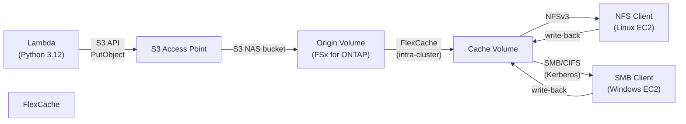

> 🌐 Language: **日本語** | [English](../en/demo-guide-01-flexcache-same-region.md)

# Demo Guide: Lambda → S3 AP → FlexCache (NFS + SMB)

> **所要時間**: 約45分（AD 環境構築済みの場合）/ 約90分（AD 新規作成含む）
> **コスト**: ~$5–10（検証後に削除する場合）
> **対象読者**: AWS / ONTAP 初心者 — コピペで再現可能な手順
> **ONTAP バージョン**: 9.17.1+（FSx for ONTAP 2nd Generation）

---

## このデモで検証すること

```
Lambda (Python) ──S3 API──▶ S3 Access Point ──▶ Origin Volume (FSx for ONTAP)
                                                       │
                                                  FlexCache
                                                       │
                                                       ▼
                                               Cache Volume
                                              ┌────────┴────────┐
                                              │                  │
                                         NFS mount          SMB mount
                                        (Linux EC2)       (Windows EC2)
```




**検証ポイント:**

| # | 検証項目 | プロトコル |
|:-:|---------|-----------|
| 1 | Lambda が S3 API で Origin Volume にデータを書き込める | S3 |
| 2 | FlexCache Cache Volume で NFS マウントしてデータが読める | NFS |
| 3 | FlexCache Cache Volume で SMB マウントしてデータが読める | SMB (Kerberos) |
| 4 | Cache 側から NFS で書き込み → Origin (S3 AP) で読める | NFS write-back |
| 5 | Cache 側から SMB で書き込み → Origin (S3 AP) で読める | SMB write-back |
| 6 | 全プロトコル間で同一データが見える | Cross-protocol |

---

## 前提条件

### 必要なもの

| ツール | バージョン | インストール確認 |
|--------|-----------|-----------------|
| AWS CLI | v2.15+ | `aws --version` |
| jq | 1.6+ | `jq --version` |
| curl | 7.x+ | `curl --version` |
| Python | 3.12+ | `python3 --version` |

### AWS リソース（既存を流用 or 新規作成）

| リソース | 新規作成？ | 説明 |
|----------|:---------:|------|
| FSx for ONTAP (クラスター A) | 既存流用 | Origin Volume を配置 |
| FSx for ONTAP (クラスター B)（任意） | 既存流用 or 同一クラスター | Cache Volume を配置（同一クラスター内でも可） |
| AWS Managed AD | 新規 or 既存 | SMB 認証に必要 |
| VPC + Private Subnets | 既存流用 | FSx と同一 VPC |
| Secrets Manager | 既存流用 | fsxadmin 認証情報 |

> **初めての方へ**: FSx for ONTAP がまだない場合は、先に `shared/cloudformation/fsxn-s3ap-base.yaml` で環境を構築してください（約45分）。

---

## Step 0: 環境変数の設定

最初にこのデモ全体で使用する変数を設定します。**ご自身の環境に合わせて値を書き換えてください。**

```bash
# === ご自身の環境に書き換え ===
export AWS_REGION="ap-northeast-1"
export FS_ID="fs-0EXAMPLE1234abcde"           # FSx for ONTAP ファイルシステム ID
export SVM_NAME="svm-lakehouse"                # 使用する SVM 名
export SECRET_ARN="arn:aws:secretsmanager:ap-northeast-1:123456789012:secret:fsxn-admin-XXXXXX"

# === 以下はデフォルト値（変更不要） ===
export ORIGIN_VOL="vol_tc09_origin"
export CACHE_VOL="vol_tc09_cache"
export S3AP_NAME="fsxn-tc09-flexcache"
export UNIX_USER="fsxadmin"
export CIFS_SHARE="tc09_share"
```

---

## Step 1: ONTAP 管理エンドポイントの確認

```bash
# FSx for ONTAP の管理 IP を取得
MGMT_IP=$(aws fsx describe-file-systems \
  --file-system-ids "$FS_ID" \
  --query 'FileSystems[0].OntapConfiguration.Endpoints.Management.IpAddresses[0]' \
  --output text --region "$AWS_REGION")

echo "Management IP: $MGMT_IP"
```

**期待される出力:**
```
Management IP: 198.51.100.10
```

```bash
# fsxadmin 認証情報を取得
CREDS=$(aws secretsmanager get-secret-value \
  --secret-id "$SECRET_ARN" \
  --query SecretString --output text --region "$AWS_REGION")
ONTAP_USER=$(echo "$CREDS" | jq -r '.username')
ONTAP_PASS=$(echo "$CREDS" | jq -r '.password')

# ONTAP REST API 疎通確認
curl -sk -u "${ONTAP_USER}:${ONTAP_PASS}" \
  "https://${MGMT_IP}/api/cluster?fields=version" | jq '.version'
```

**期待される出力:**
```json
{
  "full": "NetApp Release 9.17.1P7D1",
  "generation": 9,
  "major": 17,
  "minor": 1
}
```

> **トラブルシューティング**: `curl: (7) Failed to connect` → Security Group で port 443 が許可されているか確認。自身の IP or VPC CIDR からのアクセスが必要です。

---

## Step 2: AD 環境のデプロイ（SMB 認証用）

SMB アクセスには Active Directory が必要です。既に AD 環境がある場合はスキップしてください。

```bash
# AD 環境をデプロイ（AWS Managed AD、約20分）
aws cloudformation create-stack \
  --stack-name tc09-ad-env \
  --template-body file://shared/templates/demo-ad-environment.yaml \
  --parameters \
    ParameterKey=ADPattern,ParameterValue=ManagedAD \
    ParameterKey=VpcId,ParameterValue=vpc-0EXAMPLE \
    ParameterKey=PrivateSubnetId1,ParameterValue=subnet-0EXAMPLE1 \
    ParameterKey=PrivateSubnetId2,ParameterValue=subnet-0EXAMPLE2 \
    ParameterKey=DomainName,ParameterValue=lakehouse.example.com \
    ParameterKey=DomainShortName,ParameterValue=LAKEHOUSE \
    ParameterKey=AdminPassword,ParameterValue='YourP@ssw0rd123' \
  --capabilities CAPABILITY_NAMED_IAM \
  --region "$AWS_REGION"

# 完了を待機（15-30分）
echo "AD 作成中... (15-30分かかります)"
aws cloudformation wait stack-create-complete --stack-name tc09-ad-env
echo "AD 作成完了"
```

```bash
# AD の DNS IP を取得
AD_DNS_IPS=$(aws cloudformation describe-stacks \
  --stack-name tc09-ad-env \
  --query 'Stacks[0].Outputs[?OutputKey==`DirectoryDnsIps`].OutputValue' \
  --output text --region "$AWS_REGION")
echo "AD DNS IPs: $AD_DNS_IPS"
```

**期待される出力:**
```
AD DNS IPs: 198.51.100.50,198.51.100.51
```

---

## Step 3: SVM を AD ドメインに参加させる

```bash
# SVM を AD ドメインに参加
./shared/scripts/demo-ad-join-svm.sh \
  --fsxn-mgmt-ip "$MGMT_IP" \
  --svm-name "$SVM_NAME" \
  --domain "lakehouse.example.com" \
  --dns-ips "$AD_DNS_IPS" \
  --secret-arn "$SECRET_ARN"
```

**期待される出力:**
```
╔══════════════════════════════════════════════════════════════╗
║  FSx for ONTAP — AD Domain Join                             ║
╚══════════════════════════════════════════════════════════════╝

  ℹ SVM: svm-lakehouse
  ℹ Domain: lakehouse.example.com
  ℹ DNS: 198.51.100.50,198.51.100.51
  ℹ CIFS Server: SVM_LAKEHOUSE

━━━ Step 1: Retrieve Credentials ━━━
  ✓ AD credentials retrieved (user: Admin)

━━━ Step 2: Get SVM UUID ━━━
  ✓ SVM UUID: xxxxxxxx-xxxx-xxxx-xxxx-xxxxxxxxxxxx

━━━ Step 3: Configure DNS ━━━
  ✓ DNS configured on SVM

━━━ Step 4: Join AD Domain (CIFS Server Create) ━━━
  ✓ CIFS server created — SVM joined to lakehouse.example.com

━━━ Step 5: Verify Domain Membership ━━━
  ✓ SVM 'svm-lakehouse' is joined to domain 'lakehouse.example.com'
```

> **トラブルシューティング**: "CIFS server creation failed" → AD の DNS IP が SVM から到達可能か確認。Security Group で TCP 53, 88, 389, 445, 636 を許可。

---

## Step 4: Origin Volume 作成 + S3 AP アタッチ

```bash
# SVM UUID を取得
SVM_UUID=$(curl -sk -u "${ONTAP_USER}:${ONTAP_PASS}" \
  "https://${MGMT_IP}/api/svm/svms?name=${SVM_NAME}&fields=uuid" \
  | jq -r '.records[0].uuid')

# Origin Volume を作成（UNIX security style, 10GB）
curl -sk -u "${ONTAP_USER}:${ONTAP_PASS}" \
  -X POST "https://${MGMT_IP}/api/storage/volumes" \
  -H "Content-Type: application/json" \
  -d "{
    \"name\": \"${ORIGIN_VOL}\",
    \"svm\": {\"name\": \"${SVM_NAME}\"},
    \"size\": 10737418240,
    \"style\": \"flexvol\",
    \"nas\": {
      \"path\": \"/${ORIGIN_VOL}\",
      \"security_style\": \"unix\",
      \"unix_permissions\": \"0777\"
    },
    \"guarantee\": {\"type\": \"none\"}
  }" | jq '{job: .job.uuid, status: .job.state}'
```

**期待される出力:**
```json
{
  "job": "xxxxxxxx-xxxx-xxxx-xxxx-xxxxxxxxxxxx",
  "status": "queued"
}
```

```bash
# ボリューム作成完了を確認（10秒待機）
sleep 10

# FSx Volume ID を取得
VOL_ID=$(aws fsx describe-volumes \
  --filters Name=file-system-id,Values="$FS_ID" \
  --query "Volumes[?Name=='${ORIGIN_VOL}'].VolumeId" \
  --output text --region "$AWS_REGION")
echo "Volume ID: $VOL_ID"
```

```bash
# S3 Access Point をアタッチ
aws fsx create-and-attach-s3-access-point \
  --name "$S3AP_NAME" \
  --type ONTAP \
  --ontap-configuration "{
    \"VolumeId\": \"${VOL_ID}\",
    \"FileSystemIdentity\": {
      \"Type\": \"UNIX\",
      \"UnixUser\": {\"Name\": \"${UNIX_USER}\"}
    }
  }" \
  --region "$AWS_REGION" | jq '{Name: .S3AccessPoint.Name, Status: .S3AccessPoint.Lifecycle}'
```

**期待される出力:**
```json
{
  "Name": "fsxn-tc09-flexcache",
  "Status": "CREATING"
}
```

```bash
# S3 AP が AVAILABLE になるまで待機（30-60秒）
echo "S3 AP 作成中..."
while true; do
  STATUS=$(aws fsx describe-s3-access-points \
    --filters Name=file-system-id,Values="$FS_ID" \
    --query "S3AccessPoints[?Name=='${S3AP_NAME}'].Lifecycle" \
    --output text --region "$AWS_REGION" 2>/dev/null || echo "CHECKING")
  echo "  Status: $STATUS"
  [[ "$STATUS" == "AVAILABLE" ]] && break
  sleep 10
done

# S3 AP Alias を取得（以降のS3操作で使用）
S3AP_ALIAS=$(aws fsx describe-s3-access-points \
  --filters Name=file-system-id,Values="$FS_ID" \
  --query "S3AccessPoints[?Name=='${S3AP_NAME}'].S3AccessPointConfiguration.Alias" \
  --output text --region "$AWS_REGION")
echo "S3 AP Alias: $S3AP_ALIAS"
```

**期待される出力:**
```
S3 AP Alias: fsxn-tc09-flexcache-xxxxxxxxxxxx-ext-s3alias
```

---

## Step 5: Lambda Writer 関数のデプロイ

S3 AP 経由でテストデータを書き込む Lambda 関数を作成します。

```bash
# Lambda コードを作成
mkdir -p /tmp/tc09-lambda
cat > /tmp/tc09-lambda/lambda_function.py << 'EOF'
import boto3
import json
import time
import os

def handler(event, context):
    """S3 AP 経由で FSx for ONTAP Origin Volume にテストデータを書き込む"""
    s3 = boto3.client('s3')
    ap_alias = os.environ.get('S3AP_ALIAS', event.get('ap_alias', ''))
    prefix = event.get('prefix', 'demo-data')
    ts = int(time.time())

    files = {
        f'{prefix}/sensor-001.json': json.dumps({"sensor_id": "S001", "temperature": 23.5, "humidity": 65, "ts": ts}),
        f'{prefix}/sensor-002.json': json.dumps({"sensor_id": "S002", "temperature": 24.1, "humidity": 62, "ts": ts}),
        f'{prefix}/sensor-003.json': json.dumps({"sensor_id": "S003", "temperature": 22.8, "humidity": 70, "ts": ts}),
        f'{prefix}/metrics.csv': f"id,value,timestamp\n1,100,{ts}\n2,200,{ts}\n3,300,{ts}\n",
        f'{prefix}/config.json': json.dumps({"version": "1.0", "test_id": "tc09", "created_at": ts}),
    }

    results = []
    for key, body in files.items():
        resp = s3.put_object(Bucket=ap_alias, Key=key, Body=body.encode('utf-8'))
        results.append({
            "key": key,
            "etag": resp['ETag'],
            "http_status": resp['ResponseMetadata']['HTTPStatusCode'],
            "size_bytes": len(body.encode('utf-8'))
        })
        print(f"Written: {key} ({len(body)} bytes)")

    # 書き込み確認
    list_resp = s3.list_objects_v2(Bucket=ap_alias, Prefix=prefix)
    listed_keys = [obj['Key'] for obj in list_resp.get('Contents', [])]

    return {
        "statusCode": 200,
        "written": len(results),
        "listed": len(listed_keys),
        "files": results,
        "verification": "PASS" if len(listed_keys) == len(files) else "PARTIAL"
    }
EOF

# ZIP パッケージ作成
cd /tmp/tc09-lambda && zip -j function.zip lambda_function.py && cd -
```

```bash
# IAM ロール作成（Lambda 実行用）
aws iam create-role \
  --role-name tc09-lambda-writer-role \
  --assume-role-policy-document '{
    "Version": "2012-10-17",
    "Statement": [{
      "Effect": "Allow",
      "Principal": {"Service": "lambda.amazonaws.com"},
      "Action": "sts:AssumeRole"
    }]
  }' --region "$AWS_REGION" | jq '.Role.Arn'

# S3 AP アクセスポリシーをアタッチ
ACCOUNT_ID=$(aws sts get-caller-identity --query Account --output text)
aws iam put-role-policy \
  --role-name tc09-lambda-writer-role \
  --policy-name S3APWritePolicy \
  --policy-document "{
    \"Version\": \"2012-10-17\",
    \"Statement\": [{
      \"Effect\": \"Allow\",
      \"Action\": [\"s3:PutObject\", \"s3:GetObject\", \"s3:ListBucket\", \"s3:GetBucketLocation\"],
      \"Resource\": [
        \"arn:aws:s3:${AWS_REGION}:${ACCOUNT_ID}:accesspoint/${S3AP_NAME}\",
        \"arn:aws:s3:${AWS_REGION}:${ACCOUNT_ID}:accesspoint/${S3AP_NAME}/object/*\"
      ]
    }]
  }"

aws iam attach-role-policy \
  --role-name tc09-lambda-writer-role \
  --policy-arn arn:aws:iam::aws:policy/service-role/AWSLambdaBasicExecutionRole

# IAM ロール伝播待ち（10秒）
sleep 10
```

```bash
# Lambda 関数作成
ROLE_ARN="arn:aws:iam::${ACCOUNT_ID}:role/tc09-lambda-writer-role"

aws lambda create-function \
  --function-name tc09-s3ap-writer \
  --runtime python3.12 \
  --architectures arm64 \
  --handler lambda_function.handler \
  --role "$ROLE_ARN" \
  --zip-file fileb:///tmp/tc09-lambda/function.zip \
  --timeout 30 \
  --memory-size 256 \
  --environment "Variables={S3AP_ALIAS=${S3AP_ALIAS}}" \
  --region "$AWS_REGION" | jq '{FunctionName, State, Runtime}'
```

**期待される出力:**
```json
{
  "FunctionName": "tc09-s3ap-writer",
  "State": "Pending",
  "Runtime": "python3.12"
}
```

---

## Step 6: Lambda でデータを書き込む

```bash
# Lambda を呼び出してテストデータを書き込み
aws lambda invoke \
  --function-name tc09-s3ap-writer \
  --payload '{"prefix": "demo-data"}' \
  --cli-binary-format raw-in-base64-out \
  /tmp/tc09-lambda-result.json \
  --region "$AWS_REGION"

# 結果を確認
cat /tmp/tc09-lambda-result.json | jq .
```

**期待される出力:**
```json
{
  "statusCode": 200,
  "written": 5,
  "listed": 5,
  "verification": "PASS",
  "files": [
    {"key": "demo-data/sensor-001.json", "etag": "\"...\"", "http_status": 200, "size_bytes": 72},
    {"key": "demo-data/sensor-002.json", "etag": "\"...\"", "http_status": 200, "size_bytes": 72},
    {"key": "demo-data/sensor-003.json", "etag": "\"...\"", "http_status": 200, "size_bytes": 72},
    {"key": "demo-data/metrics.csv", "etag": "\"...\"", "http_status": 200, "size_bytes": 54},
    {"key": "demo-data/config.json", "etag": "\"...\"", "http_status": 200, "size_bytes": 52}
  ]
}
```

```bash
# S3 AP 経由でファイル一覧を直接確認
aws s3api list-objects-v2 \
  --bucket "$S3AP_ALIAS" \
  --prefix "demo-data/" \
  --region "$AWS_REGION" | jq '.Contents[] | {Key, Size, LastModified}'
```

> **ここまでのポイント**: Lambda → S3 API → FSx for ONTAP Origin Volume への書き込みが成功しました。Origin Volume には5ファイルが存在します。

---

## Step 7: FlexCache Cache Volume の作成

Origin Volume を FlexCache Origin として、Cache Volume を作成します。

```bash
# SVM Peering を作成（同一クラスター内でも異なる SVM 間で FlexCache するには必要）
# 同一 SVM 内の場合はスキップ

# Origin Volume の UUID を取得
ORIGIN_UUID=$(curl -sk -u "${ONTAP_USER}:${ONTAP_PASS}" \
  "https://${MGMT_IP}/api/storage/volumes?name=${ORIGIN_VOL}&svm.name=${SVM_NAME}&fields=uuid" \
  | jq -r '.records[0].uuid')
echo "Origin Volume UUID: $ORIGIN_UUID"

# FlexCache Cache Volume を作成
# 重要: FlexCache 専用 API エンドポイントを使用（/api/storage/volumes では作成不可）
# 重要: use_tiered_aggregate: true は FSx for ONTAP で必須（FabricPool aggregate）
curl -sk -u "${ONTAP_USER}:${ONTAP_PASS}" \
  -X POST "https://${MGMT_IP}/api/storage/flexcache/flexcaches" \
  -H "Content-Type: application/json" \
  -d "{
    \"name\": \"${CACHE_VOL}\",
    \"svm\": {\"name\": \"${SVM_NAME}\"},
    \"size\": 107374182400,
    \"path\": \"/${CACHE_VOL}\",
    \"use_tiered_aggregate\": true,
    \"origins\": [{
      \"volume\": {\"name\": \"${ORIGIN_VOL}\"},
      \"svm\": {\"name\": \"${SVM_NAME}\"}
    }],
    \"guarantee\": {\"type\": \"none\"}
  }" | jq '{job_uuid: .job.uuid}'
```

**期待される出力:**
```json
{
  "job_uuid": "xxxxxxxx-xxxx-xxxx-xxxx-xxxxxxxxxxxx",
  "state": "queued"
}
```

```bash
# FlexCache 作成完了を待機（30-60秒）
echo "FlexCache 作成中..."
sleep 30

# FlexCache の状態を確認
curl -sk -u "${ONTAP_USER}:${ONTAP_PASS}" \
  "https://${MGMT_IP}/api/storage/volumes?name=${CACHE_VOL}&fields=state,flexcache,type" \
  | jq '.records[0] | {name, state, type, flexcache_origin: .flexcache.origins[0].volume.name}'
```

**期待される出力:**
```json
{
  "name": "vol_tc09_cache",
  "state": "online",
  "type": "rw",
  "flexcache_origin": "vol_tc09_origin"
}
```

> **トラブルシューティング**:
> **Troubleshooting**:
> - "No suitable storage / Aggregates not matching FabricPool requirements" → `use_tiered_aggregate: true` が**必須**（FSx for ONTAP は FabricPool aggregate を使用するため）。
> - "size too small" → FlexCache は FlexGroup タイプのため最小 50GB。`64424509440`（60GB）以上を指定。
> - "SVM peer required" → 異なる SVM 間の場合、SVM Peering を先に作成。
> - FlexCache API エンドポイント: `/api/storage/flexcache/flexcaches`（`/api/storage/volumes` では作成不可）。

---

## Step 8: SMB 共有の作成（Cache Volume 上）

```bash
# Cache Volume に CIFS（SMB）共有を作成
curl -sk -u "${ONTAP_USER}:${ONTAP_PASS}" \
  -X POST "https://${MGMT_IP}/api/protocols/cifs/shares" \
  -H "Content-Type: application/json" \
  -d "{
    \"svm\": {\"name\": \"${SVM_NAME}\"},
    \"name\": \"${CIFS_SHARE}\",
    \"path\": \"/${CACHE_VOL}\",
    \"comment\": \"TC-09 FlexCache SMB verification share\"
  }" | jq .
```

**期待される出力:**
```json
{
  "num_records": 1,
  "records": [{"name": "tc09_share", "path": "/vol_tc09_cache"}]
}
```

```bash
# 共有の確認
curl -sk -u "${ONTAP_USER}:${ONTAP_PASS}" \
  "https://${MGMT_IP}/api/protocols/cifs/shares?svm.name=${SVM_NAME}&name=${CIFS_SHARE}" \
  | jq '.records[] | {name, path, comment}'
```

---

## Step 9: NFS エクスポートポリシーの確認

```bash
# Cache Volume のエクスポートポリシーを確認
curl -sk -u "${ONTAP_USER}:${ONTAP_PASS}" \
  "https://${MGMT_IP}/api/storage/volumes?name=${CACHE_VOL}&fields=nas.export_policy" \
  | jq '.records[0].nas.export_policy'

# デフォルトポリシーのルールを確認（0.0.0.0/0 で許可されていること）
curl -sk -u "${ONTAP_USER}:${ONTAP_PASS}" \
  "https://${MGMT_IP}/api/protocols/nfs/export-policies?svm.name=${SVM_NAME}&name=default&fields=rules" \
  | jq '.records[0].rules[] | {index, clients: .clients[].match, ro_rule, rw_rule, superuser}'
```

**期待される出力例:**
```json
{
  "index": 1,
  "clients": "0.0.0.0/0",
  "ro_rule": ["sys"],
  "rw_rule": ["sys"],
  "superuser": ["sys"]
}
```

> NFS は `AUTH_SYS` で全サブネットからアクセス可能な状態がデモ向けの最小構成です。本番では CIDR やKerberos で制限してください。

---

## Step 10: NFS でデータ読み取り検証（Linux EC2）

Linux EC2 インスタンスから Cache Volume を NFS マウントし、Lambda が書き込んだデータを読み取ります。

```bash
# Data LIF の IP を取得
DATA_LIF=$(curl -sk -u "${ONTAP_USER}:${ONTAP_PASS}" \
  "https://${MGMT_IP}/api/network/ip/interfaces?svm.name=${SVM_NAME}&services=data_nfs&fields=ip.address" \
  | jq -r '.records[0].ip.address')
echo "NFS Data LIF: $DATA_LIF"
```

### Linux EC2 上で実行（SSM Session Manager 経由）

```bash
# NFS マウント
sudo mkdir -p /mnt/tc09_cache
sudo mount -t nfs -o vers=3 ${DATA_LIF}:/${CACHE_VOL} /mnt/tc09_cache

# マウント確認
df -h /mnt/tc09_cache
```

**期待される出力:**
```
Filesystem                          Size  Used Avail Use% Mounted on
198.51.100.20:/vol_tc09_cache        60G  256K   60G   1% /mnt/tc09_cache
```

```bash
# ファイル一覧を確認 — Lambda が書き込んだ5ファイルが見える
ls -la /mnt/tc09_cache/demo-data/
```

**期待される出力:**
```
total 24
drwxrwxrwx. 2 root bin  4096 Jul 21 10:00 .
drwxr-xr-x. 3 root root 4096 Jul 21 10:00 ..
-rw-r--r--. 1 root bin    52 Jul 21 10:00 config.json
-rw-r--r--. 1 root bin    54 Jul 21 10:00 metrics.csv
-rw-r--r--. 1 root bin    72 Jul 21 10:00 sensor-001.json
-rw-r--r--. 1 root bin    72 Jul 21 10:00 sensor-002.json
-rw-r--r--. 1 root bin    72 Jul 21 10:00 sensor-003.json
```

```bash
# ファイル内容を確認
cat /mnt/tc09_cache/demo-data/sensor-001.json | jq .
```

**期待される出力:**
```json
{
  "sensor_id": "S001",
  "temperature": 23.5,
  "humidity": 65,
  "ts": 1753090800
}
```

```bash
# NFS 経由で新しいファイルを書き込み（write-back テスト）
echo '{"source": "nfs-client", "action": "write-back-test", "ts": '$(date +%s)'}' \
  > /mnt/tc09_cache/demo-data/nfs-written.json

# 書き込み確認
cat /mnt/tc09_cache/demo-data/nfs-written.json
```

```bash
# NFS 書き込みが S3 AP 経由で見えるか確認（Origin に伝播）
# ※ write-back の場合、数秒〜数分で Origin に flush される
sleep 10
aws s3api get-object \
  --bucket "$S3AP_ALIAS" \
  --key "demo-data/nfs-written.json" \
  /tmp/nfs-written-from-s3.json \
  --region "$AWS_REGION" && cat /tmp/nfs-written-from-s3.json | jq .
```

**期待される出力:**
```json
{
  "source": "nfs-client",
  "action": "write-back-test",
  "ts": 1753090860
}
```

> **ここまでのポイント**: Lambda が S3 AP で書いたデータを FlexCache NFS 経由で読めました。さらに NFS で書いたデータが S3 AP (Origin) に反映されることも確認できました。

---

## Step 11: SMB でデータ読み取り検証（Windows EC2）

ドメイン参加済みの Windows EC2 から Cache Volume を SMB マウントします。

### Windows EC2 上で実行（RDP or SSM Fleet Manager 経由）

```powershell
# CIFS サーバー名を確認 (ONTAP の CIFS server name)
# 例: SVM_LAKEHOUSE (Step 3 で設定した名前)

# SMB ドライブマッピング（Kerberos 認証 — ドメイン参加済みなので自動）
net use Z: \\SVM_LAKEHOUSE\tc09_share
```

**期待される出力:**
```
The command completed successfully.
```

```powershell
# ファイル一覧確認
dir Z:\demo-data\
```

**期待される出力:**
```
 Volume in drive Z is vol_tc09_cache
 Directory of Z:\demo-data

07/21/2026  10:00 AM                52 config.json
07/21/2026  10:00 AM                54 metrics.csv
07/21/2026  10:01 AM                68 nfs-written.json
07/21/2026  10:00 AM                72 sensor-001.json
07/21/2026  10:00 AM                72 sensor-002.json
07/21/2026  10:00 AM                72 sensor-003.json
               6 File(s)            390 bytes
```

> **注目**: NFS で書き込んだ `nfs-written.json` も SMB 側で見えています（cross-protocol visibility）。

```powershell
# ファイル内容読み取り
Get-Content Z:\demo-data\sensor-001.json | ConvertFrom-Json
```

**期待される出力:**
```
sensor_id   : S001
temperature : 23.5
humidity    : 65
ts          : 1753090800
```

```powershell
# SMB 経由で新しいファイルを書き込み
@{source="smb-client"; action="write-back-test"; ts=(Get-Date -UFormat %s)} | 
  ConvertTo-Json | Set-Content Z:\demo-data\smb-written.json

# 確認
Get-Content Z:\demo-data\smb-written.json
```

```powershell
# SMB 書き込みが S3 AP 経由で見えるか確認
# (別ターミナル / Linux から)
```

```bash
# Linux/CloudShell から S3 AP 経由で確認
sleep 10
aws s3api get-object \
  --bucket "$S3AP_ALIAS" \
  --key "demo-data/smb-written.json" \
  /tmp/smb-written-from-s3.json \
  --region "$AWS_REGION" && cat /tmp/smb-written-from-s3.json
```

**期待される出力:**
```json
{"source":"smb-client","action":"write-back-test","ts":"1753090920"}
```

> **ここまでのポイント**: SMB (Kerberos認証) 経由で FlexCache のデータを読み書きでき、write-back により Origin (S3 AP) にも反映されました。

---

## Step 12: クロスプロトコル一貫性の最終確認

全てのプロトコル間でデータが正しく見えることを最終確認します。

```bash
# Lambda で追加データを書き込み
aws lambda invoke \
  --function-name tc09-s3ap-writer \
  --payload '{"prefix": "demo-data/batch2", "ap_alias": "'"$S3AP_ALIAS"'"}' \
  --cli-binary-format raw-in-base64-out \
  /tmp/tc09-batch2.json \
  --region "$AWS_REGION"
cat /tmp/tc09-batch2.json | jq '.written, .verification'
```

```bash
# NFS で確認（30秒 TTL 後）
sleep 30
ls /mnt/tc09_cache/demo-data/batch2/
```

```powershell
# SMB で確認（Windows EC2）
dir Z:\demo-data\batch2\
```

### 最終結果サマリー

| 操作 | 書き込み元 | 読み取り先 | 結果 |
|------|-----------|-----------|:----:|
| Lambda → S3 AP → Origin | Lambda (S3 API) | — | ✅ |
| Origin → FlexCache → NFS read | — | Linux EC2 (NFS) | ✅ |
| Origin → FlexCache → SMB read | — | Windows EC2 (SMB) | ✅ |
| NFS write (Cache) → Origin → S3 AP read | Linux EC2 | S3 API | ✅ |
| SMB write (Cache) → Origin → S3 AP read | Windows EC2 | S3 API | ✅ |
| S3 AP write → NFS read → SMB read (cross-protocol) | Lambda | Linux + Windows | ✅ |

---

## Step 13: クリーンアップ（リソース削除）

検証が完了したら、以下の順序でリソースを削除します（作成の逆順）。

```bash
# 1. Windows: SMB ドライブ切断
# net use Z: /delete

# 2. Linux: NFS アンマウント
sudo umount /mnt/tc09_cache

# 3. FlexCache Cache Volume 削除
CACHE_UUID=$(curl -sk -u "${ONTAP_USER}:${ONTAP_PASS}" \
  "https://${MGMT_IP}/api/storage/volumes?name=${CACHE_VOL}&svm.name=${SVM_NAME}" \
  | jq -r '.records[0].uuid')

curl -sk -u "${ONTAP_USER}:${ONTAP_PASS}" \
  -X DELETE "https://${MGMT_IP}/api/storage/volumes/${CACHE_UUID}" | jq .

echo "FlexCache 削除中... (30秒待機)"
sleep 30

# 4. SMB 共有は Volume 削除で自動削除されるため操作不要

# 5. S3 AP デタッチ・削除
# S3 AP の Association ID を取得して削除
# (FSx コンソールから手動削除するか、以下の CLI を使用)
echo "S3 AP のデタッチは FSx コンソールから実行するか、以下を実行:"
echo "  aws fsx delete-s3-access-point --name $S3AP_NAME --region $AWS_REGION"

# 6. Origin Volume 削除
ORIGIN_UUID_DEL=$(curl -sk -u "${ONTAP_USER}:${ONTAP_PASS}" \
  "https://${MGMT_IP}/api/storage/volumes?name=${ORIGIN_VOL}&svm.name=${SVM_NAME}" \
  | jq -r '.records[0].uuid')

# S3 AP デタッチ完了後に実行
# curl -sk -u "${ONTAP_USER}:${ONTAP_PASS}" \
#   -X DELETE "https://${MGMT_IP}/api/storage/volumes/${ORIGIN_UUID_DEL}" | jq .

# 7. Lambda 関数削除
aws lambda delete-function --function-name tc09-s3ap-writer --region "$AWS_REGION"
aws iam delete-role-policy --role-name tc09-lambda-writer-role --policy-name S3APWritePolicy
aws iam detach-role-policy --role-name tc09-lambda-writer-role \
  --policy-arn arn:aws:iam::aws:policy/service-role/AWSLambdaBasicExecutionRole
aws iam delete-role --role-name tc09-lambda-writer-role

# 8. AD 環境（不要な場合のみ）
# aws cloudformation delete-stack --stack-name tc09-ad-env
# ※ AD 削除は15-30分かかります

echo "クリーンアップ完了"
```

---

## トラブルシューティング

| 症状 | 原因 | 対処 |
|------|------|------|
| Lambda が AccessDenied | IAM ポリシーの S3 AP ARN が不正 | `arn:aws:s3:<region>:<account>:accesspoint/<name>` を確認 |
| NFS mount: "access denied" | Export policy が未設定 | `default` policy に `0.0.0.0/0` ルールを追加 |
| SMB: "network path not found" | CIFS サーバー名の DNS 解決不可 | Windows EC2 の DNS が AD DNS を向いているか確認 |
| SMB: "access denied" | ドメイン参加していない or name-mapping 未設定 | EC2 がドメイン参加済みか確認。UNIX vol の場合 win→unix name-mapping 必要 |
| FlexCache 作成失敗: "size" | 50GB 未満を指定 | 60GB 以上 (`64424509440` bytes) を指定 |
| FlexCache 作成失敗: "aggregate" | `use_tiered_aggregate` 未指定 | JSON に `"use_tiered_aggregate": true` を追加 |
| S3 AP 作成: "object storage server exists" | 同一 SVM に native S3 server がある | 別 SVM を使用、または native S3 server を削除 |
| Cache でファイルが見えない | FlexCache TTL 未経過 | 30秒〜60秒待機後に再試行 |
| Write-back が Origin に反映されない | Scrubber 間隔（5分）未経過 | 数分待機、または `volume flexcache cache-flush` を実行 |
| ONTAP API: "unauthorized" | fsxadmin パスワード不正 | Secrets Manager の値を確認 |
| curl: "connection refused" | Security Group で 443 未許可 | FSx SG で HTTPS (443) を許可 |

---

## 技術的な背景（なぜこれが動くのか）

### S3 AP と FlexCache の関係

```
S3 AP は「ボリュームへの S3 レンズ」
  └── 実体は通常の FlexVol / FlexGroup ボリューム
        └── FlexCache Origin としての要件を満たす
              └── Cache Volume からは NFS/SMB でアクセス
```

FlexCache は「ボリューム」をキャッシュする技術であり、S3 AP の有無を意識しません。Origin Volume が通常の NAS ボリュームであれば FlexCache は動作します。S3 AP はそのボリュームに S3 プロトコルアクセスを追加しているだけです。

### Write-Back の仕組み

FlexCache write-back モードでは、Cache Volume への書き込みはまずローカルに保存され、その後バックグラウンドで Origin に flush されます。Origin 側で S3 AP が見ているのは同じボリュームのデータなので、flush 完了後に S3 API からも読めるようになります。

### SMB 認証フロー

```
Windows EC2 → Kerberos TGT (AD から取得)
  → SMB 接続 (CIFS server への Kerberos 認証)
    → ONTAP: win→unix name-mapping (AD user → UNIX UID)
      → UNIX security style volume へのアクセス権評価
```

UNIX security style のボリュームに SMB でアクセスする場合、ONTAP は Windows ユーザーを UNIX ユーザーにマッピングしてアクセス権を評価します。デモ環境では `default` の name-mapping（Domain Admins → root）が適用されます。

---

## バージョン要件まとめ

| 機能 | 最低 ONTAP | FSx for ONTAP 対応 |
|------|:---------:|:-----------------:|
| S3 Access Point | 9.14.1 | ✅ |
| S3 NAS bucket on Origin | 9.12.1 | ✅ |
| S3 NAS bucket on Cache | **9.18.1** | ⏳ (将来対応) |
| FlexCache (read-only) | 9.5 | ✅ |
| FlexCache write-back | 9.15.1 | ✅ |
| FlexCache write-back (推奨) | 9.17.1P1+ | ✅ |
| SMB on FlexCache | 9.8 | ✅ |
| NFSv4 on FlexCache | 9.10.1 | ✅ |

---

## 参考リンク

- [AWS Docs: FSx for ONTAP S3 Access Points](https://docs.aws.amazon.com/fsx/latest/ONTAPGuide/accessing-data-via-s3-access-points.html)
- [AWS Docs: FSx for ONTAP FlexCache](https://docs.aws.amazon.com/fsx/latest/ONTAPGuide/using-flexcache.html)
- [NetApp Docs: FlexCache supported features](https://docs.netapp.com/us-en/ontap/flexcache/supported-unsupported-features-concept.html)
- [NetApp Docs: FlexCache write-back](https://docs.netapp.com/us-en/ontap/flexcache-writeback/flexcache-write-back-overview.html)
- [Research Document (EN)](./en/research.md) — 41 Findings の詳細
- [AD Join Script](../../shared/scripts/demo-ad-join-svm.sh) — SVM ドメイン参加手順
