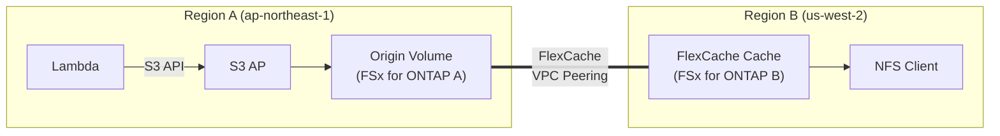

> 🌐 Language: **日本語** | [English](../en/demo-guide-02-flexcache-cross-region.md)

# Demo Guide 02: FlexCache クロスリージョン（Region A → Region B）

> **所要時間**: 約60分（両リージョンに FSx for ONTAP 構築済みの場合）
> **コスト**: ~$15–20（検証後に削除する場合、VPC Peering + 2つの FSx for ONTAP）
> **対象読者**: マルチリージョン構成を検討するインフラ/データエンジニア
> **ONTAP バージョン**: 9.17.1+（FlexCache write-back 対応）

---

## このデモで検証すること

```
Region A (ap-northeast-1)                    Region B (us-west-2)
┌──────────────────────────┐                ┌──────────────────────────┐
│  Lambda ──S3 API──▶ S3 AP │                │                          │
│        │                  │                │     FlexCache Cache      │
│        ▼                  │   VPC Peering  │        Volume            │
│   Origin Volume           │◄══════════════▶│          │               │
│   (FSx for ONTAP A)      │  Intercluster  │   ┌──────┴──────┐       │
│                           │                │   NFS mount   SMB mount  │
│                           │                │  (Linux EC2) (Win EC2)   │
└──────────────────────────┘                └──────────────────────────┘
```




**検証ポイント:**

| # | 検証項目 | プロトコル |
|:-:|---------|-----------|
| 1 | Lambda が Region A の S3 AP 経由で Origin にデータを書き込める | S3 |
| 2 | Region B の FlexCache で NFS マウントしデータが読める | NFS |
| 3 | Region B から Cache に書き込み → Region A Origin に反映 | NFS write-back |
| 4 | クロスリージョンレイテンシ（RTT）の影響を確認 | ICMP/NFS |

---

## 前提条件

[共通前提条件](./demo-guide-00-prerequisites.md) に加え:

| リソース | リージョン | 説明 |
|----------|-----------|------|
| FSx for ONTAP A | ap-northeast-1 | Origin Volume を配置 |
| FSx for ONTAP B | us-west-2 | Cache Volume を配置 |
| VPC A + Private Subnets | ap-northeast-1 | FSx A と同一 VPC |
| VPC B + Private Subnets | us-west-2 | FSx B と同一 VPC |
| VPC Peering 接続 | 両リージョン | CIDR 重複不可 |

> **Lambda Writer のセットアップ**: Step 5-6 は [Demo Guide 01](./demo-guide-01-flexcache-same-region.md) と同一です。Lambda 関数が既にデプロイ済みであればスキップ可能。

---

## Step 0: 環境変数の設定

```bash
# === Region A（Origin 側）===
export REGION_A="ap-northeast-1"
export FS_ID_A="fs-0EXAMPLE1111aaaaa"
export SVM_NAME_A="svm-origin"
export SECRET_ARN_A="arn:aws:secretsmanager:ap-northeast-1:123456789012:secret:fsxn-admin-A-XXXXXX"
export VPC_ID_A="vpc-0aaaa1111"
export VPC_CIDR_A="10.0.0.0/16"

# === Region B（Cache 側）===
export REGION_B="us-west-2"
export FS_ID_B="fs-0EXAMPLE2222bbbbb"
export SVM_NAME_B="svm-cache"
export SECRET_ARN_B="arn:aws:secretsmanager:us-west-2:123456789012:secret:fsxn-admin-B-XXXXXX"
export VPC_ID_B="vpc-0bbbb2222"
export VPC_CIDR_B="10.1.0.0/16"

# === 共通 ===
export ORIGIN_VOL="vol_cross_origin"
export CACHE_VOL="vol_cross_cache"
export S3AP_NAME="fsxn-cross-region-demo"
```

---

## Step 1: VPC Peering の作成

```bash
# VPC Peering 接続をリクエスト（Region A → Region B）
PEERING_ID=$(aws ec2 create-vpc-peering-connection \
  --vpc-id "$VPC_ID_A" \
  --peer-vpc-id "$VPC_ID_B" \
  --peer-region "$REGION_B" \
  --region "$REGION_A" \
  --query 'VpcPeeringConnection.VpcPeeringConnectionId' \
  --output text)
echo "Peering ID: $PEERING_ID"
```

**期待される出力:**
```
Peering ID: pcx-0abcdef1234567890
```

```bash
# Region B 側で Peering を承認
aws ec2 accept-vpc-peering-connection \
  --vpc-peering-connection-id "$PEERING_ID" \
  --region "$REGION_B" | jq '.VpcPeeringConnection.Status'
```

**期待される出力:**
```json
{
  "Code": "active",
  "Message": "Active"
}
```

```bash
# Route Table にピアリング経路を追加（Region A → Region B CIDR）
RT_A=$(aws ec2 describe-route-tables \
  --filters Name=vpc-id,Values="$VPC_ID_A" Name=association.main,Values=true \
  --query 'RouteTables[0].RouteTableId' --output text --region "$REGION_A")

aws ec2 create-route \
  --route-table-id "$RT_A" \
  --destination-cidr-block "$VPC_CIDR_B" \
  --vpc-peering-connection-id "$PEERING_ID" \
  --region "$REGION_A"

# Route Table にピアリング経路を追加（Region B → Region A CIDR）
RT_B=$(aws ec2 describe-route-tables \
  --filters Name=vpc-id,Values="$VPC_ID_B" Name=association.main,Values=true \
  --query 'RouteTables[0].RouteTableId' --output text --region "$REGION_B")

aws ec2 create-route \
  --route-table-id "$RT_B" \
  --destination-cidr-block "$VPC_CIDR_A" \
  --vpc-peering-connection-id "$PEERING_ID" \
  --region "$REGION_B"
```

```bash
# Security Group に相手リージョンからのアクセスを許可
# Region A: Region B からの Intercluster 通信を許可
SG_A=$(aws fsx describe-file-systems --file-system-ids "$FS_ID_A" \
  --query 'FileSystems[0].SubnetIds[0]' --output text --region "$REGION_A")

aws ec2 authorize-security-group-ingress \
  --group-id "sg-0EXAMPLE_FSX_A" \
  --protocol tcp --port 11104-11105 \
  --cidr "$VPC_CIDR_B" --region "$REGION_A"

# Region B: Region A からの Intercluster 通信を許可
aws ec2 authorize-security-group-ingress \
  --group-id "sg-0EXAMPLE_FSX_B" \
  --protocol tcp --port 11104-11105 \
  --cidr "$VPC_CIDR_A" --region "$REGION_B"
```

---

## Step 2: Cluster Peering の作成

```bash
# Region A 側の Intercluster LIF IP を取得
MGMT_IP_A=$(aws fsx describe-file-systems --file-system-ids "$FS_ID_A" \
  --query 'FileSystems[0].OntapConfiguration.Endpoints.Management.IpAddresses[0]' \
  --output text --region "$REGION_A")

CREDS_A=$(aws secretsmanager get-secret-value --secret-id "$SECRET_ARN_A" \
  --query SecretString --output text --region "$REGION_A")
USER_A=$(echo "$CREDS_A" | jq -r '.username')
PASS_A=$(echo "$CREDS_A" | jq -r '.password')

IC_LIFS_A=$(curl -sk -u "${USER_A}:${PASS_A}" \
  "https://${MGMT_IP_A}/api/network/ip/interfaces?services=intercluster_core&fields=ip.address" \
  | jq -r '[.records[].ip.address] | join(",")')
echo "Region A Intercluster LIFs: $IC_LIFS_A"

# Region B 側の Intercluster LIF IP を取得
MGMT_IP_B=$(aws fsx describe-file-systems --file-system-ids "$FS_ID_B" \
  --query 'FileSystems[0].OntapConfiguration.Endpoints.Management.IpAddresses[0]' \
  --output text --region "$REGION_B")

CREDS_B=$(aws secretsmanager get-secret-value --secret-id "$SECRET_ARN_B" \
  --query SecretString --output text --region "$REGION_B")
USER_B=$(echo "$CREDS_B" | jq -r '.username')
PASS_B=$(echo "$CREDS_B" | jq -r '.password')

IC_LIFS_B=$(curl -sk -u "${USER_B}:${PASS_B}" \
  "https://${MGMT_IP_B}/api/network/ip/interfaces?services=intercluster_core&fields=ip.address" \
  | jq -r '[.records[].ip.address] | join(",")')
echo "Region B Intercluster LIFs: $IC_LIFS_B"
```

```bash
# Region A から Cluster Peer を作成
curl -sk -u "${USER_A}:${PASS_A}" \
  -X POST "https://${MGMT_IP_A}/api/cluster/peers" \
  -H "Content-Type: application/json" \
  -d "{
    \"remote\": {\"ip_addresses\": [$(echo $IC_LIFS_B | sed 's/,/\",\"/g' | sed 's/^/\"/;s/$/\"/')]}
    \"authentication\": {\"passphrase\": \"cross-region-demo-2026\"},
    \"encryption\": {\"proposed\": \"tls_psk\"}
  }" | jq '{job: .job.uuid}'
```

```bash
# Region B から Cluster Peer を承認
curl -sk -u "${USER_B}:${PASS_B}" \
  -X POST "https://${MGMT_IP_B}/api/cluster/peers" \
  -H "Content-Type: application/json" \
  -d "{
    \"remote\": {\"ip_addresses\": [$(echo $IC_LIFS_A | sed 's/,/\",\"/g' | sed 's/^/\"/;s/$/\"/')]}
    \"authentication\": {\"passphrase\": \"cross-region-demo-2026\"}
  }" | jq '{job: .job.uuid}'
```

```bash
# Cluster Peer 状態を確認
sleep 15
curl -sk -u "${USER_A}:${PASS_A}" \
  "https://${MGMT_IP_A}/api/cluster/peers?fields=status" \
  | jq '.records[] | {name, status: .status.state}'
```

**期待される出力:**
```json
{
  "name": "Clus_xxxx",
  "status": "available"
}
```

---

## Step 3: SVM Peering の作成

```bash
# SVM UUID を取得
SVM_UUID_A=$(curl -sk -u "${USER_A}:${PASS_A}" \
  "https://${MGMT_IP_A}/api/svm/svms?name=${SVM_NAME_A}" \
  | jq -r '.records[0].uuid')

SVM_UUID_B=$(curl -sk -u "${USER_B}:${PASS_B}" \
  "https://${MGMT_IP_B}/api/svm/svms?name=${SVM_NAME_B}" \
  | jq -r '.records[0].uuid')

# Region A 側で SVM Peer 作成
PEER_CLUSTER_NAME=$(curl -sk -u "${USER_A}:${PASS_A}" \
  "https://${MGMT_IP_A}/api/cluster/peers" \
  | jq -r '.records[0].name')

curl -sk -u "${USER_A}:${PASS_A}" \
  -X POST "https://${MGMT_IP_A}/api/svm/peers" \
  -H "Content-Type: application/json" \
  -d "{
    \"svm\": {\"name\": \"${SVM_NAME_A}\"},
    \"peer\": {
      \"svm\": {\"name\": \"${SVM_NAME_B}\"},
      \"cluster\": {\"name\": \"${PEER_CLUSTER_NAME}\"}
    },
    \"applications\": [\"flexcache\"]
  }" | jq '{job: .job.uuid}'
```

```bash
# Region B 側で SVM Peer を承認（自動承認の場合はスキップ）
sleep 10
curl -sk -u "${USER_B}:${PASS_B}" \
  "https://${MGMT_IP_B}/api/svm/peers?fields=state" \
  | jq '.records[] | {svm: .svm.name, peer_svm: .peer.svm.name, state}'
```

**期待される出力:**
```json
{
  "svm": "svm-cache",
  "peer_svm": "svm-origin",
  "state": "peered"
}
```

---

## Step 4: Origin Volume 作成 + S3 AP アタッチ（Region A）

> この手順は [Demo Guide 01 Step 4](./demo-guide-01-flexcache-same-region.md#step-4-origin-volume-作成--s3-ap-アタッチ) と同一です。

```bash
# Origin Volume を作成
curl -sk -u "${USER_A}:${PASS_A}" \
  -X POST "https://${MGMT_IP_A}/api/storage/volumes" \
  -H "Content-Type: application/json" \
  -d "{
    \"name\": \"${ORIGIN_VOL}\",
    \"svm\": {\"name\": \"${SVM_NAME_A}\"},
    \"size\": 10737418240,
    \"nas\": {\"path\": \"/${ORIGIN_VOL}\", \"security_style\": \"unix\", \"unix_permissions\": \"0777\"},
    \"guarantee\": {\"type\": \"none\"}
  }" | jq '{job: .job.uuid}'

sleep 10

# S3 AP をアタッチ
VOL_ID_A=$(aws fsx describe-volumes \
  --filters Name=file-system-id,Values="$FS_ID_A" \
  --query "Volumes[?Name=='${ORIGIN_VOL}'].VolumeId" \
  --output text --region "$REGION_A")

aws fsx create-and-attach-s3-access-point \
  --name "$S3AP_NAME" --type ONTAP \
  --ontap-configuration "{
    \"VolumeId\": \"${VOL_ID_A}\",
    \"FileSystemIdentity\": {\"Type\": \"UNIX\", \"UnixUser\": {\"Name\": \"fsxadmin\"}}
  }" --region "$REGION_A" | jq '{Name: .S3AccessPoint.Name, Status: .S3AccessPoint.Lifecycle}'
```

---

## Step 5-6: Lambda Writer デプロイ & データ書き込み

> [Demo Guide 01 Step 5-6](./demo-guide-01-flexcache-same-region.md#step-5-lambda-writer-関数のデプロイ) を参照。Region A で Lambda をデプロイし、S3 AP 経由でテストデータを書き込みます。

---

## Step 7: FlexCache Cache Volume 作成（Region B）

```bash
# Region B 側で FlexCache を作成（Origin は Region A の Volume）
curl -sk -u "${USER_B}:${PASS_B}" \
  -X POST "https://${MGMT_IP_B}/api/storage/flexcache/flexcaches" \
  -H "Content-Type: application/json" \
  -d "{
    \"name\": \"${CACHE_VOL}\",
    \"svm\": {\"name\": \"${SVM_NAME_B}\"},
    \"size\": 64424509440,
    \"type\": \"rw\",
    \"style\": \"flexgroup\",
    \"use_tiered_aggregate\": true,
    \"nas\": {\"path\": \"/${CACHE_VOL}\"},
    \"flexcache\": {
      \"fill_policy\": \"demand\",
      \"writeback\": {\"enabled\": true},
      \"origins\": [{
        \"volume\": {\"name\": \"${ORIGIN_VOL}\"},
        \"svm\": {\"name\": \"${SVM_NAME_A}\"}
      }]
    }
  }" | jq '{job_uuid: .job.uuid, state: .job.state}'
```

```bash
# 作成完了確認
sleep 45
curl -sk -u "${USER_B}:${PASS_B}" \
  "https://${MGMT_IP_B}/api/storage/volumes?name=${CACHE_VOL}&fields=state,flexcache" \
  | jq '.records[0] | {name, state, origin: .flexcache.origins[0].volume.name}'
```

**期待される出力:**
```json
{
  "name": "vol_cross_cache",
  "state": "online",
  "origin": "vol_cross_origin"
}
```

---

## Step 8: NFS 検証（Region B Linux EC2）

```bash
# Region B 側の Data LIF を取得
DATA_LIF_B=$(curl -sk -u "${USER_B}:${PASS_B}" \
  "https://${MGMT_IP_B}/api/network/ip/interfaces?svm.name=${SVM_NAME_B}&services=data_nfs&fields=ip.address" \
  | jq -r '.records[0].ip.address')

# Region B の Linux EC2 上で実行
sudo mkdir -p /mnt/cross_cache
sudo mount -t nfs -o vers=3 ${DATA_LIF_B}:/${CACHE_VOL} /mnt/cross_cache

# Lambda が Region A で書いたデータが読める
ls -la /mnt/cross_cache/demo-data/
cat /mnt/cross_cache/demo-data/sensor-001.json | jq .
```

```bash
# Write-back テスト: Region B → Region A
echo '{"source": "region-b-nfs", "ts": '$(date +%s)'}' > /mnt/cross_cache/demo-data/cross-region-test.json

# Region A で S3 AP 経由で確認（flush 後）
sleep 30
aws s3api get-object --bucket "$S3AP_ALIAS" --key "demo-data/cross-region-test.json" \
  /tmp/cross-region-result.json --region "$REGION_A" && cat /tmp/cross-region-result.json
```

---

## Step 9: レイテンシ測定

```bash
# Region B EC2 から Region A Intercluster LIF への RTT
ping -c 5 $IC_LIFS_A | tail -1
```

**期待される出力例（ap-northeast-1 ↔ us-west-2）:**
```
rtt min/avg/max/mdev = 105.2/108.4/112.1/2.3 ms
```

> **注意**: FlexCache の初回読み取り（cache miss）はこの RTT 分のレイテンシが加算されます。2回目以降はキャッシュヒットによりローカル速度で読めます。Write-back の flush も RTT に影響されますが、バックグラウンド処理のためクライアント体感には影響しません。

---

## クリーンアップ

```bash
# 1. NFS アンマウント（Region B EC2）
sudo umount /mnt/cross_cache

# 2. FlexCache 削除（Region B）
CACHE_UUID=$(curl -sk -u "${USER_B}:${PASS_B}" \
  "https://${MGMT_IP_B}/api/storage/volumes?name=${CACHE_VOL}&svm.name=${SVM_NAME_B}" \
  | jq -r '.records[0].uuid')
curl -sk -u "${USER_B}:${PASS_B}" -X DELETE "https://${MGMT_IP_B}/api/storage/volumes/${CACHE_UUID}"
sleep 30

# 3. SVM Peering 削除
# 4. Cluster Peering 削除
# 5. S3 AP デタッチ + Origin Volume 削除（Region A）
# 6. VPC Peering 削除
aws ec2 delete-vpc-peering-connection --vpc-peering-connection-id "$PEERING_ID" --region "$REGION_A"

# 7. Route Table エントリ削除
aws ec2 delete-route --route-table-id "$RT_A" --destination-cidr-block "$VPC_CIDR_B" --region "$REGION_A"
aws ec2 delete-route --route-table-id "$RT_B" --destination-cidr-block "$VPC_CIDR_A" --region "$REGION_B"

# 8. Lambda 削除（Demo Guide 01 参照）
```

---

## トラブルシューティング

| 症状 | 原因 | 対処 |
|------|------|------|
| Cluster Peer が "unavailable" | VPC Peering の Route 未設定 | Route Table に相手 VPC CIDR → pcx のルートを追加 |
| Cluster Peer 接続タイムアウト | SG で 11104-11105 未許可 | 両リージョンの FSx SG でポート許可を確認 |
| FlexCache 作成失敗: "peer not found" | SVM Peering 未作成 | Step 3 の SVM Peer を作成 |
| Cache miss で高レイテンシ | 正常動作（初回は Origin fetch） | 2回目のアクセスではキャッシュヒットを確認 |
| Write-back が反映されない | クロスリージョン flush に時間がかかる | 60秒以上待機（RTT × バッチサイズ） |
| VPC Peering が "failed" | CIDR 重複 | VPC CIDR が重複していないか確認 |

---

## 参考リンク

- [AWS Docs: VPC Peering](https://docs.aws.amazon.com/vpc/latest/peering/)
- [AWS Docs: FSx for ONTAP FlexCache](https://docs.aws.amazon.com/fsx/latest/ONTAPGuide/using-flexcache.html)
- [NetApp Docs: Cluster Peering](https://docs.netapp.com/us-en/ontap/peering/index.html)
- [Demo Guide 01: FlexCache 同一リージョン](./demo-guide-01-flexcache-same-region.md)
