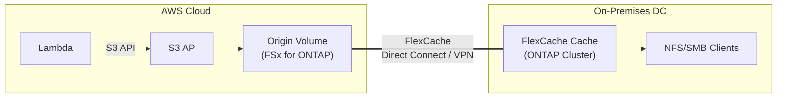

> 🌐 Language: **日本語** | [English](../en/demo-guide-03-flexcache-on-premises.md)

# Demo Guide 03: FlexCache オンプレミス（FSx for ONTAP → On-premises ONTAP）

> **所要時間**: 約90分（Direct Connect / VPN 構成済みの場合）
> **コスト**: ~$5–10（AWS 側のみ。オンプレミス ONTAP のライセンスは別途）
> **対象読者**: ハイブリッドクラウド構成を検討するインフラエンジニア
> **ONTAP バージョン**: FSx 9.17.1+ / On-premises 9.15.1+（write-back 対応）

---

## このデモで検証すること

```
AWS Cloud                                    On-premises DC
┌────────────────────────────┐              ┌────────────────────────────┐
│  Lambda ──S3 API──▶ S3 AP  │              │                            │
│        │                   │              │    FlexCache Cache Volume   │
│        ▼                   │   DX / VPN   │           │                │
│   Origin Volume            │◄════════════▶│    ┌──────┴──────┐        │
│   (FSx for ONTAP)         │  Intercluster │    NFS mount   SMB mount   │
│                            │              │   (Linux srv) (Win srv)    │
└────────────────────────────┘              └────────────────────────────┘
```




**検証ポイント:**

| # | 検証項目 | プロトコル |
|:-:|---------|-----------|
| 1 | Lambda → S3 AP で Origin にデータ書き込み | S3 |
| 2 | オンプレミス FlexCache で NFS アクセス可能 | NFS |
| 3 | オンプレミスからの write-back が Origin (S3 AP) に反映 | NFS write-back |
| 4 | RTT 200ms 未満でのパフォーマンス確認 | NFS |

---

## 前提条件

[共通前提条件](./demo-guide-00-prerequisites.md) に加え:

| リソース | 場所 | 説明 |
|----------|------|------|
| FSx for ONTAP | AWS (ap-northeast-1) | Origin Volume |
| ONTAP クラスター | オンプレミス DC | Cache Volume（9.15.1+） |
| Direct Connect or Site-to-Site VPN | 両拠点間 | RTT < 200ms 推奨 |
| DNS 解決 | 双方向 | クラスター名が IP 解決できること |

### ネットワーク要件

| 方向 | ポート | 用途 |
|------|--------|------|
| AWS → On-prem | TCP 11104-11105 | Intercluster (FlexCache) |
| On-prem → AWS | TCP 11104-11105 | Intercluster (FlexCache) |
| On-prem → AWS | TCP 443 | ONTAP REST API（任意） |

> **RTT 制約**: FlexCache write-back は RTT < 200ms で動作検証済み。RTT が大きい場合は read-only Cache として使用することを推奨。

---

## Step 0: 環境変数の設定

```bash
# === AWS 側（Origin）===
export AWS_REGION="ap-northeast-1"
export FS_ID="fs-0EXAMPLE1234abcde"
export SVM_NAME_AWS="svm-origin"
export SECRET_ARN="arn:aws:secretsmanager:ap-northeast-1:123456789012:secret:fsxn-admin-XXXXXX"

# === オンプレミス側（Cache）===
export ONPREM_CLUSTER_IP="198.51.100.100"      # On-prem ONTAP Cluster Management IP
export ONPREM_IC_LIF="198.51.100.101"           # On-prem Intercluster LIF
export ONPREM_SVM="svm-onprem-cache"
export ONPREM_USER="admin"
# On-prem パスワードは手動入力（スクリプトに埋め込まない）

# === 共通 ===
export ORIGIN_VOL="vol_hybrid_origin"
export CACHE_VOL="vol_hybrid_cache"
```

---

## Step 1: ネットワーク接続確認

```bash
# AWS 側の Intercluster LIF を取得
MGMT_IP=$(aws fsx describe-file-systems --file-system-ids "$FS_ID" \
  --query 'FileSystems[0].OntapConfiguration.Endpoints.Management.IpAddresses[0]' \
  --output text --region "$AWS_REGION")

CREDS=$(aws secretsmanager get-secret-value --secret-id "$SECRET_ARN" \
  --query SecretString --output text --region "$AWS_REGION")
ONTAP_USER=$(echo "$CREDS" | jq -r '.username')
ONTAP_PASS=$(echo "$CREDS" | jq -r '.password')

AWS_IC_LIFS=$(curl -sk -u "${ONTAP_USER}:${ONTAP_PASS}" \
  "https://${MGMT_IP}/api/network/ip/interfaces?services=intercluster_core&fields=ip.address" \
  | jq -r '[.records[].ip.address] | join(",")')
echo "AWS Intercluster LIFs: $AWS_IC_LIFS"
```

```bash
# オンプレミスから AWS IC LIF への疎通確認（オンプレミス ONTAP CLI）
ssh admin@${ONPREM_CLUSTER_IP}
```

```
cluster1::> network ping -lif <ic-lif-name> -vserver <svm> -destination <AWS_IC_LIF>
# → RTT を確認（< 200ms が推奨）

cluster1::> network ping -lif ic-lif1 -vserver svm-onprem-cache -destination 198.51.100.30
44 bytes from 198.51.100.30: icmp_seq=0 ttl=64 time=15.2 ms
```

---

## Step 2: Cluster Peering（オンプレミス ONTAP CLI）

```
# オンプレミス側で Cluster Peer を作成
cluster1::> cluster peer create -peer-addrs 198.51.100.30,198.51.100.31 \
  -initial-allowed-vserver-peers svm-onprem-cache \
  -ipspace Default \
  -encryption-protocol-proposed tls-psk \
  -generate-passphrase

# 出力例:
# Passphrase: Xyza1234AbcDeFgH
# ※ このパスフレーズを AWS 側で使用
```

```bash
# AWS 側で Cluster Peer を承認（REST API）
curl -sk -u "${ONTAP_USER}:${ONTAP_PASS}" \
  -X POST "https://${MGMT_IP}/api/cluster/peers" \
  -H "Content-Type: application/json" \
  -d "{
    \"remote\": {\"ip_addresses\": [\"${ONPREM_IC_LIF}\"]},
    \"authentication\": {\"passphrase\": \"Xyza1234AbcDeFgH\"}
  }" | jq '{job: .job.uuid}'
```

```bash
# Peering 状態確認
sleep 20
curl -sk -u "${ONTAP_USER}:${ONTAP_PASS}" \
  "https://${MGMT_IP}/api/cluster/peers?fields=status" \
  | jq '.records[] | {name, status: .status.state}'
```

**期待される出力:**
```json
{
  "name": "cluster1",
  "status": "available"
}
```

---

## Step 3: SVM Peering

```
# オンプレミス側（ONTAP CLI）
cluster1::> vserver peer create -vserver svm-onprem-cache \
  -peer-vserver svm-origin \
  -peer-cluster <aws-cluster-name> \
  -applications flexcache
```

```bash
# AWS 側で SVM Peer を承認
curl -sk -u "${ONTAP_USER}:${ONTAP_PASS}" \
  "https://${MGMT_IP}/api/svm/peers?state=pending&fields=svm,peer" \
  | jq '.records[]'

# pending があれば承認
PEER_UUID=$(curl -sk -u "${ONTAP_USER}:${ONTAP_PASS}" \
  "https://${MGMT_IP}/api/svm/peers?state=pending" \
  | jq -r '.records[0].uuid')

curl -sk -u "${ONTAP_USER}:${ONTAP_PASS}" \
  -X PATCH "https://${MGMT_IP}/api/svm/peers/${PEER_UUID}" \
  -H "Content-Type: application/json" \
  -d '{"state": "peered"}' | jq .
```

---

## Step 4: Origin Volume + S3 AP（AWS 側）

> [Demo Guide 01 Step 4](./demo-guide-01-flexcache-same-region.md#step-4-origin-volume-作成--s3-ap-アタッチ) と同一手順。

---

## Step 5-6: Lambda Writer & データ書き込み

> [Demo Guide 01 Step 5-6](./demo-guide-01-flexcache-same-region.md#step-5-lambda-writer-関数のデプロイ) を参照。

---

## Step 7: FlexCache 作成（オンプレミス ONTAP CLI）

```
# オンプレミス側で FlexCache を作成
cluster1::> volume flexcache create -vserver svm-onprem-cache \
  -volume vol_hybrid_cache \
  -aggr-list aggr1 \
  -size 100GB \
  -origin-vserver svm-origin \
  -origin-volume vol_hybrid_origin \
  -junction-path /vol_hybrid_cache \
  -is-writeback-enabled true

# 確認
cluster1::> volume flexcache show -volume vol_hybrid_cache
```

**期待される出力:**
```
Vserver   Volume          Size   Origin-Vserver  Origin-Volume  State
--------- --------------- ------ --------------- -------------- ------
svm-onprem-cache vol_hybrid_cache 100GB svm-origin vol_hybrid_origin online
```

---

## Step 8: NFS 検証（オンプレミスサーバー）

```bash
# オンプレミス Linux サーバー上で実行
DATA_LIF_ONPREM="198.51.100.110"  # On-prem SVM の Data LIF

sudo mkdir -p /mnt/hybrid_cache
sudo mount -t nfs -o vers=3 ${DATA_LIF_ONPREM}:/vol_hybrid_cache /mnt/hybrid_cache

# Lambda が書き込んだデータが見える
ls -la /mnt/hybrid_cache/demo-data/
cat /mnt/hybrid_cache/demo-data/sensor-001.json | jq .
```

```bash
# Write-back テスト
echo '{"source": "on-premises", "ts": '$(date +%s)'}' > /mnt/hybrid_cache/demo-data/onprem-written.json

# AWS S3 AP から確認（flush 待ち）
sleep 30
aws s3api get-object --bucket "$S3AP_ALIAS" --key "demo-data/onprem-written.json" \
  /tmp/onprem-result.json --region "$AWS_REGION" && cat /tmp/onprem-result.json
```

---

## クリーンアップ

```bash
# オンプレミス側
cluster1::> volume unmount -vserver svm-onprem-cache -volume vol_hybrid_cache
cluster1::> volume offline -vserver svm-onprem-cache -volume vol_hybrid_cache
cluster1::> volume flexcache delete -vserver svm-onprem-cache -volume vol_hybrid_cache
cluster1::> vserver peer delete -vserver svm-onprem-cache -peer-vserver svm-origin
cluster1::> cluster peer delete -cluster <aws-cluster-name>

# AWS 側: Demo Guide 01 のクリーンアップ参照
```

---

## トラブルシューティング

| 症状 | 原因 | 対処 |
|------|------|------|
| Cluster Peer "unreachable" | DX/VPN トンネルダウン | VPN 接続状態、BGP ステータスを確認 |
| FlexCache 作成: "peer unavailable" | IC LIF ルーティング不正 | `network route show` でオンプレ→AWS 経路確認 |
| RTT > 200ms で write-back 失敗 | 長距離回線の制約 | write-back 無効にし read-only Cache で運用 |
| NFS mount タイムアウト | ファイアウォールで 2049 遮断 | DX/VPN 経由のポート開放を確認 |
| Cache miss が多い | Origin データが大きく fetch に時間がかかる | `flexcache prepopulate` でウォームアップ |

---

## 参考リンク

- [AWS Docs: Direct Connect](https://docs.aws.amazon.com/directconnect/latest/UserGuide/)
- [AWS Docs: Site-to-Site VPN](https://docs.aws.amazon.com/vpn/latest/s2svpn/)
- [NetApp Docs: FlexCache volumes](https://docs.netapp.com/us-en/ontap/flexcache/index.html)
- [NetApp Docs: Cluster Peering](https://docs.netapp.com/us-en/ontap/peering/index.html)
- [Demo Guide 01: FlexCache 同一リージョン](./demo-guide-01-flexcache-same-region.md)
