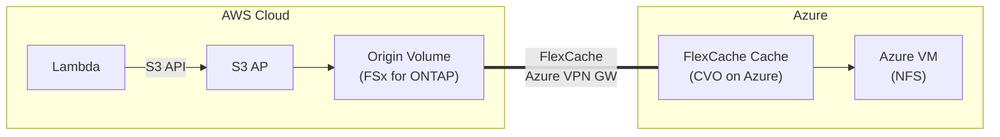

> 🌐 Language: **日本語** | [English](../en/demo-guide-05-flexcache-cvo-azure.md)

# Demo Guide 05: FlexCache CVO on Azure（FSx for ONTAP → Cloud Volumes ONTAP on Azure）

> **所要時間**: 約120分（CVO デプロイ含む）
> **コスト**: ~$20–30（AWS + Azure 合算、検証後に削除する場合）
> **対象読者**: AWS + Azure マルチクラウド構成を検討するインフラエンジニア
> **ONTAP バージョン**: FSx 9.17.1+ / CVO 9.15.1+

---

## このデモで検証すること

```
AWS Cloud (ap-northeast-1)                  Azure (East US)
┌────────────────────────────┐              ┌────────────────────────────┐
│  Lambda ──S3 API──▶ S3 AP  │              │                            │
│        │                   │              │  Cloud Volumes ONTAP       │
│        ▼                   │  Azure VPN   │    FlexCache Cache Volume  │
│   Origin Volume            │  Gateway     │           │                │
│   (FSx for ONTAP)         │◄════════════▶│    NFS mount               │
│                            │  Intercluster│   (Azure VM)               │
└────────────────────────────┘              └────────────────────────────┘
```




**検証ポイント:**

| # | 検証項目 | プロトコル |
|:-:|---------|-----------|
| 1 | Lambda → S3 AP で Origin にデータ書き込み | S3 |
| 2 | Azure CVO FlexCache で NFS データアクセス | NFS |
| 3 | Azure → AWS write-back が S3 AP に反映 | NFS write-back |
| 4 | クロスクラウドレイテンシの影響確認 | NFS |

---

## 前提条件

[共通前提条件](./demo-guide-00-prerequisites.md) に加え:

| リソース | クラウド | 説明 |
|----------|---------|------|
| FSx for ONTAP | AWS | Origin Volume |
| Cloud Volumes ONTAP | Azure | FlexCache Cache |
| Azure VPN Gateway + AWS VPN | AWS ↔ Azure | IPsec トンネル |
| Azure VNet + Subnet | Azure | CVO デプロイ先 |

### 追加ツール

| ツール | 用途 |
|--------|------|
| `az` CLI | Azure リソース管理 |
| Terraform（任意） | CVO + VPN の IaC デプロイ |

---

## Step 0: 環境変数の設定

```bash
# === AWS 側 ===
export AWS_REGION="ap-northeast-1"
export FS_ID="fs-0EXAMPLE1234abcde"
export SVM_NAME_AWS="svm-origin"
export SECRET_ARN="arn:aws:secretsmanager:ap-northeast-1:123456789012:secret:fsxn-admin-XXXXXX"
export AWS_VPC_ID="vpc-0aaaa1111"
export AWS_VPC_CIDR="10.0.0.0/16"

# === Azure 側 ===
export AZ_RESOURCE_GROUP="rg-cvo-demo"
export AZ_LOCATION="eastus"
export AZ_VNET="cvo-vnet"
export AZ_SUBNET="cvo-subnet"
export AZ_CIDR="10.200.0.0/16"
export CVO_CLUSTER_IP="10.200.1.10"
export CVO_IC_LIF="10.200.1.11"
export CVO_SVM="svm-azure-cache"

# === 共通 ===
export ORIGIN_VOL="vol_azure_origin"
export CACHE_VOL="vol_azure_cache"
```

---

## Step 1: Azure VPN Gateway の作成

```bash
# Azure リソースグループ作成
az group create --name "$AZ_RESOURCE_GROUP" --location "$AZ_LOCATION"

# VNet + GatewaySubnet 作成
az network vnet create \
  --resource-group "$AZ_RESOURCE_GROUP" \
  --name "$AZ_VNET" \
  --address-prefix "$AZ_CIDR" \
  --subnet-name "$AZ_SUBNET" \
  --subnet-prefix "10.200.1.0/24"

az network vnet subnet create \
  --resource-group "$AZ_RESOURCE_GROUP" \
  --vnet-name "$AZ_VNET" \
  --name GatewaySubnet \
  --address-prefix "10.200.255.0/27"

# Public IP for VPN Gateway
az network public-ip create \
  --resource-group "$AZ_RESOURCE_GROUP" \
  --name vpn-gw-pip \
  --allocation-method Static \
  --sku Standard

# VPN Gateway 作成（20-45分）
az network vpn-gateway create \
  --resource-group "$AZ_RESOURCE_GROUP" \
  --name aws-vpn-gw \
  --vnet "$AZ_VNET" \
  --public-ip-addresses vpn-gw-pip \
  --gateway-type Vpn \
  --vpn-type RouteBased \
  --sku VpnGw1 \
  --no-wait

echo "Azure VPN Gateway 作成中... (20-45分)"
```

```bash
# AWS 側 VPN 設定
AZ_VPN_IP=$(az network public-ip show \
  --resource-group "$AZ_RESOURCE_GROUP" --name vpn-gw-pip \
  --query 'ipAddress' --output tsv)

AWS_VGW=$(aws ec2 create-vpn-gateway --type ipsec.1 \
  --query 'VpnGateway.VpnGatewayId' --output text --region "$AWS_REGION")
aws ec2 attach-vpn-gateway --vpn-gateway-id "$AWS_VGW" --vpc-id "$AWS_VPC_ID" --region "$AWS_REGION"

AWS_CGW=$(aws ec2 create-customer-gateway --type ipsec.1 \
  --bgp-asn 65515 --public-ip "$AZ_VPN_IP" \
  --query 'CustomerGateway.CustomerGatewayId' --output text --region "$AWS_REGION")

aws ec2 create-vpn-connection \
  --type ipsec.1 \
  --vpn-gateway-id "$AWS_VGW" \
  --customer-gateway-id "$AWS_CGW" \
  --options '{"StaticRoutesOnly": false}' \
  --region "$AWS_REGION"
```

```bash
# Azure 側: Local Network Gateway + Connection 作成
AWS_VPN_ENDPOINT=$(aws ec2 describe-vpn-connections \
  --query 'VpnConnections[0].VgwTelemetry[0].OutsideIpAddress' \
  --output text --region "$AWS_REGION")

az network local-gateway create \
  --resource-group "$AZ_RESOURCE_GROUP" \
  --name aws-local-gw \
  --gateway-ip-address "$AWS_VPN_ENDPOINT" \
  --local-address-prefixes "$AWS_VPC_CIDR"

az network vpn-connection create \
  --resource-group "$AZ_RESOURCE_GROUP" \
  --name aws-connection \
  --vnet-gateway1 aws-vpn-gw \
  --local-gateway2 aws-local-gw \
  --shared-key "YourSharedKey2026"
```

---

## Step 2: CVO on Azure のデプロイ

```bash
# CVO デプロイ（Terraform or Azure Marketplace 経由）
# デプロイ完了後に管理 IP を確認

curl -sk -u "admin:<CVO_PASSWORD>" \
  "https://${CVO_CLUSTER_IP}/api/cluster?fields=version" | jq '.version'
```

**期待される出力:**
```json
{
  "full": "NetApp Release 9.15.1P2",
  "generation": 9,
  "major": 15,
  "minor": 1
}
```

---

## Step 3: Cluster Peering + SVM Peering

```bash
# AWS 側 Intercluster LIF 取得
MGMT_IP=$(aws fsx describe-file-systems --file-system-ids "$FS_ID" \
  --query 'FileSystems[0].OntapConfiguration.Endpoints.Management.IpAddresses[0]' \
  --output text --region "$AWS_REGION")

CREDS=$(aws secretsmanager get-secret-value --secret-id "$SECRET_ARN" \
  --query SecretString --output text --region "$AWS_REGION")
ONTAP_USER=$(echo "$CREDS" | jq -r '.username')
ONTAP_PASS=$(echo "$CREDS" | jq -r '.password')

AWS_IC_LIFS=$(curl -sk -u "${ONTAP_USER}:${ONTAP_PASS}" \
  "https://${MGMT_IP}/api/network/ip/interfaces?services=intercluster_core&fields=ip.address" \
  | jq -r '[.records[].ip.address] | join(",")')

# Cluster Peer 作成（AWS → Azure）
curl -sk -u "${ONTAP_USER}:${ONTAP_PASS}" \
  -X POST "https://${MGMT_IP}/api/cluster/peers" \
  -H "Content-Type: application/json" \
  -d "{
    \"remote\": {\"ip_addresses\": [\"${CVO_IC_LIF}\"]},
    \"authentication\": {\"passphrase\": \"azure-cross-cloud-2026\"},
    \"encryption\": {\"proposed\": \"tls_psk\"}
  }" | jq '{job: .job.uuid}'

# Azure CVO 側で承認
curl -sk -u "admin:<CVO_PASSWORD>" \
  -X POST "https://${CVO_CLUSTER_IP}/api/cluster/peers" \
  -H "Content-Type: application/json" \
  -d "{
    \"remote\": {\"ip_addresses\": [$(echo $AWS_IC_LIFS | sed 's/,/\",\"/g' | sed 's/^/\"/;s/$/\"/')]},
    \"authentication\": {\"passphrase\": \"azure-cross-cloud-2026\"}
  }" | jq '{job: .job.uuid}'

sleep 15

# SVM Peer 作成
curl -sk -u "${ONTAP_USER}:${ONTAP_PASS}" \
  -X POST "https://${MGMT_IP}/api/svm/peers" \
  -H "Content-Type: application/json" \
  -d "{
    \"svm\": {\"name\": \"${SVM_NAME_AWS}\"},
    \"peer\": {\"svm\": {\"name\": \"${CVO_SVM}\"}},
    \"applications\": [\"flexcache\"]
  }" | jq '{job: .job.uuid}'
```

---

## Step 4: FlexCache 作成（Azure CVO）

```bash
# Azure CVO 側で FlexCache 作成
curl -sk -u "admin:<CVO_PASSWORD>" \
  -X POST "https://${CVO_CLUSTER_IP}/api/storage/flexcache/flexcaches" \
  -H "Content-Type: application/json" \
  -d "{
    \"name\": \"${CACHE_VOL}\",
    \"svm\": {\"name\": \"${CVO_SVM}\"},
    \"size\": 107374182400,
    \"type\": \"rw\",
    \"style\": \"flexgroup\",
    \"nas\": {\"path\": \"/${CACHE_VOL}\"},
    \"flexcache\": {
      \"fill_policy\": \"demand\",
      \"writeback\": {\"enabled\": true},
      \"origins\": [{
        \"volume\": {\"name\": \"${ORIGIN_VOL}\"},
        \"svm\": {\"name\": \"${SVM_NAME_AWS}\"}
      }]
    }
  }" | jq '{job_uuid: .job.uuid}'

sleep 45

# 状態確認
curl -sk -u "admin:<CVO_PASSWORD>" \
  "https://${CVO_CLUSTER_IP}/api/storage/volumes?name=${CACHE_VOL}&fields=state,flexcache" \
  | jq '.records[0] | {name, state, origin: .flexcache.origins[0].volume.name}'
```

---

## Step 5: Origin Volume + S3 AP + Lambda Writer

> [Demo Guide 01 Step 4-6](./demo-guide-01-flexcache-same-region.md#step-4-origin-volume-作成--s3-ap-アタッチ) を参照。

---

## Step 6: NFS 検証（Azure VM）

```bash
# Azure VM に SSH
az ssh vm --resource-group "$AZ_RESOURCE_GROUP" --name cvo-test-vm

# NFS マウント
CVO_DATA_LIF="10.200.1.20"
sudo mkdir -p /mnt/azure_cache
sudo mount -t nfs -o vers=3 ${CVO_DATA_LIF}:/${CACHE_VOL} /mnt/azure_cache

# データ確認
ls -la /mnt/azure_cache/demo-data/
cat /mnt/azure_cache/demo-data/sensor-001.json | jq .

# Write-back テスト
echo '{"source": "azure-cvo", "ts": '$(date +%s)'}' > /mnt/azure_cache/demo-data/azure-written.json
```

---

## クリーンアップ

```bash
# 1. Azure VM: NFS アンマウント
# 2. CVO: FlexCache 削除 → SVM Peer 削除 → Cluster Peer 削除
# 3. CVO 削除
# 4. VPN 接続削除
az network vpn-connection delete --resource-group "$AZ_RESOURCE_GROUP" --name aws-connection
az network local-gateway delete --resource-group "$AZ_RESOURCE_GROUP" --name aws-local-gw
az network vpn-gateway delete --resource-group "$AZ_RESOURCE_GROUP" --name aws-vpn-gw
aws ec2 delete-vpn-connection --vpn-connection-id <vpn-id> --region "$AWS_REGION"
aws ec2 detach-vpn-gateway --vpn-gateway-id "$AWS_VGW" --vpc-id "$AWS_VPC_ID" --region "$AWS_REGION"
aws ec2 delete-vpn-gateway --vpn-gateway-id "$AWS_VGW" --region "$AWS_REGION"

# 5. Azure リソースグループ削除（全リソース含む）
az group delete --name "$AZ_RESOURCE_GROUP" --yes

# 6. AWS 側: Demo Guide 01 のクリーンアップ参照
```

---

## トラブルシューティング

| 症状 | 原因 | 対処 |
|------|------|------|
| Azure VPN Gateway 作成に45分以上 | Azure 側の正常動作 | `az network vpn-gateway show` で状態確認 |
| VPN トンネルが Connected にならない | PSK 不一致 or BGP ASN 不正 | 両側の設定パラメータを照合 |
| Cluster Peer "unavailable" | NSG で 11104-11105 未許可 | Azure NSG + AWS SG の両方を確認 |
| FlexCache 作成: "peer cluster not found" | Cluster Peer が未完了 | `cluster/peers` API で status 確認 |
| CVO REST API タイムアウト | NSG で 443 未許可 | Azure NSG で HTTPS inbound 許可 |
| Write-back 遅延が大きい | AWS ↔ Azure RTT (~70-150ms) | 正常動作。read-heavy ワークロードに最適 |

---

## 参考リンク

- [Azure Docs: VPN Gateway](https://learn.microsoft.com/azure/vpn-gateway/)
- [AWS Docs: Site-to-Site VPN](https://docs.aws.amazon.com/vpn/latest/s2svpn/)
- [NetApp Docs: CVO on Azure](https://docs.netapp.com/us-en/cloud-volumes-ontap-relnotes/)
- [Demo Guide 01: FlexCache 同一リージョン](./demo-guide-01-flexcache-same-region.md)
