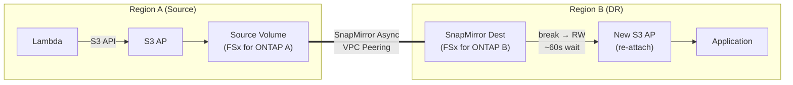

> 🌐 Language: **日本語** | [English](../en/demo-guide-07-snapmirror-cross-region.md)

# Demo Guide 07: SnapMirror クロスリージョン + S3 AP 再アタッチ

> **所要時間**: 約60分（両リージョンに FSx for ONTAP 構築済みの場合）
> **コスト**: ~$15–20（検証後に削除する場合）
> **対象読者**: DR / クロスリージョン構成を検討するインフラエンジニア
> **ONTAP バージョン**: 9.17.1+（FSx for ONTAP 2nd Generation）

---

> ⚠️ **検証ステータス**: 部分検証済み。クロスリージョン Cluster Peering + SVM Peering 確認済み (2026-07-22)。
> SnapMirror 転送 + break + S3 AP 再アタッチの E2E は未実行（FSx B の再デプロイが必要、~$6/日）。

## このデモで検証すること

```
Region A (ap-northeast-1)                    Region B (us-west-2)
┌──────────────────────────┐                ┌──────────────────────────┐
│  Lambda ──S3 API──▶ S3 AP │                │                          │
│        │                  │                │   SnapMirror Dest (DP)   │
│        ▼                  │   VPC Peering  │        Volume            │
│   Source Volume           │═══════════════▶│          │               │
│   (FSx for ONTAP A)      │  SnapMirror    │   [break → RW]           │
│                           │  Async         │          │               │
│                           │                │   New S3 AP (re-attach)  │
│                           │                │          │               │
│                           │                │   Lambda / App 読み取り   │
└──────────────────────────┘                └──────────────────────────┘

DR フェイルオーバー後:
  - Region B の Volume が RW に昇格
  - 新しい S3 AP を Region B で作成・アタッチ
  - アプリケーションは Region B の S3 AP 経由でデータアクセス
```




**検証ポイント:**

| # | 検証項目 | 操作 |
|:-:|---------|------|
| 1 | Region A で S3 AP 経由のデータ書き込み | Lambda → S3 AP |
| 2 | SnapMirror レプリケーション完了確認 | SnapMirror status |
| 3 | Region B で SnapMirror break（RW 昇格） | ONTAP REST API |
| 4 | 60秒待機後に FSx API で VolumeType 確認 | AWS CLI |
| 5 | Region B で新 S3 AP 作成・データアクセス | AWS CLI → S3 API |

---

## 前提条件

[共通前提条件](./demo-guide-00-prerequisites.md) に加え:

| リソース | リージョン | 説明 |
|----------|-----------|------|
| FSx for ONTAP A | ap-northeast-1 | Source Volume |
| FSx for ONTAP B | us-west-2 | Destination Volume |
| VPC Peering | 両リージョン | Intercluster 通信用 |
| Cluster Peering + SVM Peering | 両クラスター | SnapMirror 前提 |

> **VPC Peering / Cluster Peering**: [Demo Guide 02 Step 1-3](./demo-guide-02-flexcache-cross-region.md#step-1-vpc-peering-の作成) の手順を参照。

---

## Step 0: 環境変数の設定

```bash
# === Region A（Source）===
export REGION_A="ap-northeast-1"
export FS_ID_A="fs-0EXAMPLE1111aaaaa"
export SVM_NAME_A="svm-source"
export SECRET_ARN_A="arn:aws:secretsmanager:ap-northeast-1:123456789012:secret:fsxn-admin-A-XXXXXX"

# === Region B（Destination）===
export REGION_B="us-west-2"
export FS_ID_B="fs-0EXAMPLE2222bbbbb"
export SVM_NAME_B="svm-dest"
export SECRET_ARN_B="arn:aws:secretsmanager:us-west-2:123456789012:secret:fsxn-admin-B-XXXXXX"

# === 共通 ===
export SOURCE_VOL="vol_sm_source"
export DEST_VOL="vol_sm_dest"
export S3AP_NAME_A="fsxn-sm-source"
export S3AP_NAME_B="fsxn-sm-dest-dr"
```

---

## Step 1: Source Volume + S3 AP 作成（Region A）

```bash
MGMT_IP_A=$(aws fsx describe-file-systems --file-system-ids "$FS_ID_A" \
  --query 'FileSystems[0].OntapConfiguration.Endpoints.Management.IpAddresses[0]' \
  --output text --region "$REGION_A")

CREDS_A=$(aws secretsmanager get-secret-value --secret-id "$SECRET_ARN_A" \
  --query SecretString --output text --region "$REGION_A")
USER_A=$(echo "$CREDS_A" | jq -r '.username')
PASS_A=$(echo "$CREDS_A" | jq -r '.password')

# Source Volume 作成
curl -sk -u "${USER_A}:${PASS_A}" \
  -X POST "https://${MGMT_IP_A}/api/storage/volumes" \
  -H "Content-Type: application/json" \
  -d "{
    \"name\": \"${SOURCE_VOL}\",
    \"svm\": {\"name\": \"${SVM_NAME_A}\"},
    \"size\": 10737418240,
    \"nas\": {\"path\": \"/${SOURCE_VOL}\", \"security_style\": \"unix\", \"unix_permissions\": \"0777\"},
    \"guarantee\": {\"type\": \"none\"}
  }" | jq '{job: .job.uuid}'

sleep 10

# S3 AP アタッチ
VOL_ID_A=$(aws fsx describe-volumes \
  --filters Name=file-system-id,Values="$FS_ID_A" \
  --query "Volumes[?Name=='${SOURCE_VOL}'].VolumeId" \
  --output text --region "$REGION_A")

aws fsx create-and-attach-s3-access-point \
  --name "$S3AP_NAME_A" --type ONTAP \
  --ontap-configuration "{
    \"VolumeId\": \"${VOL_ID_A}\",
    \"FileSystemIdentity\": {\"Type\": \"UNIX\", \"UnixUser\": {\"Name\": \"fsxadmin\"}}
  }" --region "$REGION_A" | jq '{Name: .S3AccessPoint.Name, Status: .S3AccessPoint.Lifecycle}'
```

---

## Step 2: Lambda でデータ書き込み

> [Demo Guide 01 Step 5-6](./demo-guide-01-flexcache-same-region.md#step-5-lambda-writer-関数のデプロイ) を参照。Region A で Lambda を使いテストデータを書き込みます。

---

## Step 3: SnapMirror Destination Volume 作成（Region B）

```bash
MGMT_IP_B=$(aws fsx describe-file-systems --file-system-ids "$FS_ID_B" \
  --query 'FileSystems[0].OntapConfiguration.Endpoints.Management.IpAddresses[0]' \
  --output text --region "$REGION_B")

CREDS_B=$(aws secretsmanager get-secret-value --secret-id "$SECRET_ARN_B" \
  --query SecretString --output text --region "$REGION_B")
USER_B=$(echo "$CREDS_B" | jq -r '.username')
PASS_B=$(echo "$CREDS_B" | jq -r '.password')

# Destination Volume 作成（type: DP）
curl -sk -u "${USER_B}:${PASS_B}" \
  -X POST "https://${MGMT_IP_B}/api/storage/volumes" \
  -H "Content-Type: application/json" \
  -d "{
    \"name\": \"${DEST_VOL}\",
    \"svm\": {\"name\": \"${SVM_NAME_B}\"},
    \"size\": 10737418240,
    \"type\": \"dp\",
    \"guarantee\": {\"type\": \"none\"}
  }" | jq '{job: .job.uuid}'

sleep 10
echo "Destination Volume (DP) 作成完了"
```

---

## Step 4: SnapMirror 関係の作成・初期転送

```bash
# SnapMirror 関係を作成（Region B 側から）
curl -sk -u "${USER_B}:${PASS_B}" \
  -X POST "https://${MGMT_IP_B}/api/snapmirror/relationships" \
  -H "Content-Type: application/json" \
  -d "{
    \"source\": {
      \"path\": \"${SVM_NAME_A}:${SOURCE_VOL}\",
      \"cluster\": {\"name\": \"$(curl -sk -u "${USER_B}:${PASS_B}" "https://${MGMT_IP_B}/api/cluster/peers" | jq -r '.records[0].name')\"}
    },
    \"destination\": {
      \"path\": \"${SVM_NAME_B}:${DEST_VOL}\"
    },
    \"policy\": {\"name\": \"MirrorAllSnapshots\"}
  }" | jq '{job: .job.uuid}'

echo "SnapMirror 初期転送中..."
sleep 30
```

```bash
# SnapMirror 状態確認
curl -sk -u "${USER_B}:${PASS_B}" \
  "https://${MGMT_IP_B}/api/snapmirror/relationships?destination.path=${SVM_NAME_B}:${DEST_VOL}&fields=state,transfer" \
  | jq '.records[0] | {state, healthy: .healthy, last_transfer_type: .transfer.state}'
```

**期待される出力:**
```json
{
  "state": "snapmirrored",
  "healthy": true,
  "last_transfer_type": "idle"
}
```

---

## Step 5: DR フェイルオーバー — SnapMirror Break

```bash
# SnapMirror 関係の UUID を取得
SM_UUID=$(curl -sk -u "${USER_B}:${PASS_B}" \
  "https://${MGMT_IP_B}/api/snapmirror/relationships?destination.path=${SVM_NAME_B}:${DEST_VOL}" \
  | jq -r '.records[0].uuid')

# SnapMirror Break（Destination を RW に昇格）
curl -sk -u "${USER_B}:${PASS_B}" \
  -X PATCH "https://${MGMT_IP_B}/api/snapmirror/relationships/${SM_UUID}" \
  -H "Content-Type: application/json" \
  -d '{"state": "broken_off"}' | jq '{job: .job.uuid}'

echo "SnapMirror Break 実行中..."
sleep 15
```

```bash
# Volume が RW に昇格されたか確認
curl -sk -u "${USER_B}:${PASS_B}" \
  "https://${MGMT_IP_B}/api/storage/volumes?name=${DEST_VOL}&fields=type,state" \
  | jq '.records[0] | {name, type, state}'
```

**期待される出力:**
```json
{
  "name": "vol_sm_dest",
  "type": "rw",
  "state": "online"
}
```

---

## Step 6: Junction Path 設定 + FSx API Volume 反映待ち

```bash
# Junction Path を設定（break 後は unmounted）
DEST_UUID=$(curl -sk -u "${USER_B}:${PASS_B}" \
  "https://${MGMT_IP_B}/api/storage/volumes?name=${DEST_VOL}" \
  | jq -r '.records[0].uuid')

curl -sk -u "${USER_B}:${PASS_B}" \
  -X PATCH "https://${MGMT_IP_B}/api/storage/volumes/${DEST_UUID}" \
  -H "Content-Type: application/json" \
  -d "{\"nas\": {\"path\": \"/${DEST_VOL}\"}}" | jq .
```

```bash
# 重要: FSx API で VolumeType が RW に変わるまで待機（約60秒）
echo "FSx API 同期待ち（60秒）..."
sleep 60

# FSx API で Volume が認識されることを確認
VOL_ID_B=$(aws fsx describe-volumes \
  --filters Name=file-system-id,Values="$FS_ID_B" \
  --query "Volumes[?Name=='${DEST_VOL}'].VolumeId" \
  --output text --region "$REGION_B")
echo "Destination Volume ID: $VOL_ID_B"

aws fsx describe-volumes --volume-ids "$VOL_ID_B" \
  --query 'Volumes[0].{Name:Name,Type:OntapConfiguration.OntapVolumeType,Lifecycle:Lifecycle}' \
  --region "$REGION_B"
```

**期待される出力:**
```json
{
  "Name": "vol_sm_dest",
  "Type": "RW",
  "Lifecycle": "AVAILABLE"
}
```

---

## Step 7: S3 AP 再アタッチ（Region B）

```bash
# Region B で新しい S3 AP を作成
aws fsx create-and-attach-s3-access-point \
  --name "$S3AP_NAME_B" --type ONTAP \
  --ontap-configuration "{
    \"VolumeId\": \"${VOL_ID_B}\",
    \"FileSystemIdentity\": {\"Type\": \"UNIX\", \"UnixUser\": {\"Name\": \"fsxadmin\"}}
  }" --region "$REGION_B" | jq '{Name: .S3AccessPoint.Name, Status: .S3AccessPoint.Lifecycle}'

# AVAILABLE 待ち
echo "S3 AP 作成中..."
while true; do
  STATUS=$(aws fsx describe-s3-access-points \
    --filters Name=file-system-id,Values="$FS_ID_B" \
    --query "S3AccessPoints[?Name=='${S3AP_NAME_B}'].Lifecycle" \
    --output text --region "$REGION_B" 2>/dev/null || echo "CHECKING")
  echo "  Status: $STATUS"
  [[ "$STATUS" == "AVAILABLE" ]] && break
  sleep 10
done

# S3 AP Alias 取得
S3AP_ALIAS_B=$(aws fsx describe-s3-access-points \
  --filters Name=file-system-id,Values="$FS_ID_B" \
  --query "S3AccessPoints[?Name=='${S3AP_NAME_B}'].S3AccessPointConfiguration.Alias" \
  --output text --region "$REGION_B")
echo "DR S3 AP Alias: $S3AP_ALIAS_B"
```

---

## Step 8: DR 先でデータアクセス確認

```bash
# Region B の S3 AP 経由でデータ読み取り
aws s3api list-objects-v2 \
  --bucket "$S3AP_ALIAS_B" \
  --prefix "demo-data/" \
  --region "$REGION_B" | jq '.Contents[] | {Key, Size}'

# ファイル内容確認
aws s3api get-object \
  --bucket "$S3AP_ALIAS_B" \
  --key "demo-data/sensor-001.json" \
  /tmp/dr-sensor.json --region "$REGION_B"
cat /tmp/dr-sensor.json | jq .
```

**期待される出力:**
```json
{
  "sensor_id": "S001",
  "temperature": 23.5,
  "humidity": 65,
  "ts": 1753090800
}
```

> **DR フェイルオーバー成功**: Region A で書き込んだデータが、Region B の新しい S3 AP 経由で正常に読み取れました。

---

## クリーンアップ

```bash
# 1. Region B: S3 AP 削除
# 2. Region B: Volume 削除（先に SnapMirror 関係を削除）
curl -sk -u "${USER_B}:${PASS_B}" \
  -X DELETE "https://${MGMT_IP_B}/api/snapmirror/relationships/${SM_UUID}" \
  -H "Content-Type: application/json" \
  -d '{"destination_only": true}'
sleep 10

# 3. Region A: S3 AP 削除 + Source Volume 削除
# 4. VPC Peering 削除（Demo Guide 02 参照）
# 5. Lambda 削除（Demo Guide 01 参照）
```

---

## トラブルシューティング

| 症状 | 原因 | 対処 |
|------|------|------|
| SnapMirror 初期転送が進まない | Intercluster ポート (11104-11105) 未許可 | SG / Route 確認 |
| Break 後に Volume が "offline" | Junction Path 未設定 | `nas.path` を PATCH で設定 |
| FSx API で VolumeType が "DP" のまま | 同期遅延（通常 60 秒） | さらに 60 秒待機して再確認 |
| S3 AP 作成: "volume is DP type" | FSx API 同期前に作成試行 | VolumeType="RW" になるまで待機 |
| S3 AP 作成: "object storage server exists" | 同一 SVM に native S3 server あり | 別 SVM を使用 |
| SnapMirror 状態が "unhealthy" | ネットワーク断 or Peer 切れ | cluster/peers status 確認 |

---

## 参考リンク

- [AWS Docs: FSx for ONTAP SnapMirror](https://docs.aws.amazon.com/fsx/latest/ONTAPGuide/using-snapmirror.html)
- [NetApp Docs: SnapMirror Async](https://docs.netapp.com/us-en/ontap/data-protection/index.html)
- [Demo Guide 02: FlexCache クロスリージョン](./demo-guide-02-flexcache-cross-region.md)（VPC Peering / Cluster Peering 手順）
- [Demo Guide 01: FlexCache 同一リージョン](./demo-guide-01-flexcache-same-region.md)（Lambda Writer 手順）
