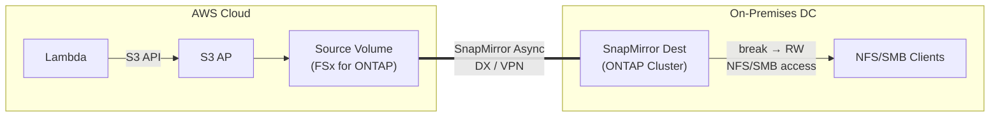

> 🌐 Language: **日本語** | [English](../en/demo-guide-08-snapmirror-on-premises.md)

# Demo Guide 08: SnapMirror オンプレミス（FSx for ONTAP → On-premises ONTAP）

> **所要時間**: 約60分（Direct Connect / VPN + Cluster Peering 構成済みの場合）
> **コスト**: ~$5–10（AWS 側のみ）
> **対象読者**: ハイブリッド DR / データ同期を検討するインフラエンジニア
> **ONTAP バージョン**: FSx 9.17.1+ / On-premises 9.11.1+

---

## このデモで検証すること

```
AWS Cloud (ap-northeast-1)                  On-premises DC
┌────────────────────────────┐              ┌────────────────────────────┐
│  Lambda ──S3 API──▶ S3 AP  │              │                            │
│        │                   │              │   SnapMirror Destination   │
│        ▼                   │  DX / VPN    │        Volume (DP → RW)   │
│   Source Volume            │═════════════▶│          │                 │
│   (FSx for ONTAP)         │  SnapMirror  │   ┌──────┴──────┐         │
│                            │  Async       │   NFS mount   SMB mount    │
│                            │              │  (Linux srv) (Win srv)     │
└────────────────────────────┘              └────────────────────────────┘

※ S3 AP はオンプレミスでは利用不可（AWS 専用機能）
   オンプレミス側はミラー break 後に NFS/SMB でアクセス
```




**検証ポイント:**

| # | 検証項目 | 操作 |
|:-:|---------|------|
| 1 | AWS で S3 AP 経由のデータ書き込み | Lambda → S3 AP |
| 2 | SnapMirror レプリケーション完了確認 | SnapMirror status |
| 3 | オンプレミスで SnapMirror break | ONTAP CLI |
| 4 | オンプレミスで NFS/SMB データアクセス | NFS/SMB |

> **重要**: S3 Access Point は AWS 専用機能です。オンプレミス ONTAP では S3 AP を作成できません。Break 後のデータアクセスは NFS/SMB のみです。

---

## 前提条件

[共通前提条件](./demo-guide-00-prerequisites.md) に加え:

| リソース | 場所 | 説明 |
|----------|------|------|
| FSx for ONTAP | AWS | Source Volume + S3 AP |
| ONTAP クラスター | オンプレミス | Destination Volume（9.11.1+） |
| Direct Connect or VPN | 両拠点 | Intercluster 通信 |
| Cluster + SVM Peering | 両クラスター | SnapMirror 前提 |

> **Cluster Peering の構成**: [Demo Guide 03 Step 2-3](./demo-guide-03-flexcache-on-premises.md#step-2-cluster-peeringオンプレミス-ontap-cli) を参照。

---

## Step 0: 環境変数の設定

```bash
# === AWS 側（Source）===
export AWS_REGION="ap-northeast-1"
export FS_ID="fs-0EXAMPLE1234abcde"
export SVM_NAME_AWS="svm-source"
export SECRET_ARN="arn:aws:secretsmanager:ap-northeast-1:123456789012:secret:fsxn-admin-XXXXXX"

# === オンプレミス側（Destination）===
export ONPREM_CLUSTER_IP="198.51.100.100"
export ONPREM_SVM="svm-onprem-dr"
export ONPREM_USER="admin"

# === 共通 ===
export SOURCE_VOL="vol_sm_onprem_src"
export DEST_VOL="vol_sm_onprem_dest"
export S3AP_NAME="fsxn-sm-onprem"
```

---

## Step 1: Source Volume + S3 AP + Lambda Writer（AWS 側）

> [Demo Guide 01 Step 4-6](./demo-guide-01-flexcache-same-region.md#step-4-origin-volume-作成--s3-ap-アタッチ) を参照。Volume 名を `$SOURCE_VOL` に置き換えてください。

---

## Step 2: Destination Volume 作成（オンプレミス ONTAP CLI）

```
# オンプレミス側でDP Volume を作成
cluster1::> volume create -vserver svm-onprem-dr -volume vol_sm_onprem_dest \
  -aggregate aggr1 -size 20GB -type DP
```

**期待される出力:**
```
[Job 123] Job succeeded: Successful
```

---

## Step 3: SnapMirror 関係の作成

```
# オンプレミス側から SnapMirror 関係を作成
cluster1::> snapmirror create -source-path svm-source:vol_sm_onprem_src \
  -destination-path svm-onprem-dr:vol_sm_onprem_dest \
  -type XDP -policy MirrorAllSnapshots

# 初期転送を実行
cluster1::> snapmirror initialize -destination-path svm-onprem-dr:vol_sm_onprem_dest
```

```
# 転送状態を確認
cluster1::> snapmirror show -destination-path svm-onprem-dr:vol_sm_onprem_dest \
  -fields state,status,last-transfer-type

# 期待:
# state: Snapmirrored  status: Idle  last-transfer-type: initialize
```

---

## Step 4: DR フェイルオーバー — SnapMirror Break

```
# SnapMirror Break（オンプレミス側）
cluster1::> snapmirror break -destination-path svm-onprem-dr:vol_sm_onprem_dest

# 確認
cluster1::> snapmirror show -destination-path svm-onprem-dr:vol_sm_onprem_dest -fields state
# 期待: state: Broken-off
```

```
# Junction Path を設定してアクセス可能にする
cluster1::> volume mount -vserver svm-onprem-dr -volume vol_sm_onprem_dest \
  -junction-path /vol_sm_onprem_dest

# Volume 状態確認
cluster1::> volume show -volume vol_sm_onprem_dest -fields state,type,junction-path
# 期待: state: online  type: RW  junction-path: /vol_sm_onprem_dest
```

---

## Step 5: NFS/SMB でデータアクセス（オンプレミス）

```bash
# オンプレミス Linux サーバー
DATA_LIF_ONPREM="198.51.100.110"

sudo mkdir -p /mnt/sm_dest
sudo mount -t nfs -o vers=3 ${DATA_LIF_ONPREM}:/vol_sm_onprem_dest /mnt/sm_dest

# Lambda が書き込んだデータ確認
ls -la /mnt/sm_dest/demo-data/
cat /mnt/sm_dest/demo-data/sensor-001.json | jq .
```

**期待される出力:**
```json
{
  "sensor_id": "S001",
  "temperature": 23.5,
  "humidity": 65,
  "ts": 1753090800
}
```

```bash
# RW に昇格されたので書き込みも可能
echo '{"source": "on-premises-dr", "ts": '$(date +%s)'}' > /mnt/sm_dest/demo-data/dr-written.json
cat /mnt/sm_dest/demo-data/dr-written.json
```

---

## Step 6: 再同期（フェイルバック）— 任意

DR テスト後に Region A に戻す場合:

```
# SnapMirror resync（オンプレミス → AWS への逆方向は別途設定が必要）
# 通常は reverse resync を使用
cluster1::> snapmirror resync -destination-path svm-onprem-dr:vol_sm_onprem_dest

# ※ 完全なフェイルバックは本ガイドの範囲外
```

---

## クリーンアップ

```bash
# オンプレミス側
cluster1::> snapmirror delete -destination-path svm-onprem-dr:vol_sm_onprem_dest
cluster1::> snapmirror release -destination-path svm-onprem-dr:vol_sm_onprem_dest -relationship-info-only true
cluster1::> volume unmount -vserver svm-onprem-dr -volume vol_sm_onprem_dest
cluster1::> volume offline -vserver svm-onprem-dr -volume vol_sm_onprem_dest
cluster1::> volume delete -vserver svm-onprem-dr -volume vol_sm_onprem_dest

# AWS 側: S3 AP 削除 + Source Volume 削除 + Lambda 削除（Demo Guide 01 参照）
```

---

## トラブルシューティング

| 症状 | 原因 | 対処 |
|------|------|------|
| SnapMirror initialize が進まない | 11104-11105 ポート未開放 | DX/VPN 経由のポート確認 |
| "source volume not found" | SVM Peering に `snapmirror` アプリケーション未指定 | SVM Peer 再作成 |
| Break 後に volume が "restricted" | Junction Path 未設定 | `volume mount` コマンド実行 |
| NFS mount タイムアウト | Data LIF から到達不可 | ルーティング + ファイアウォール確認 |
| データが空 | 初期転送未完了のまま break | `snapmirror show` で last-transfer-type 確認 |

---

## 参考リンク

- [NetApp Docs: SnapMirror](https://docs.netapp.com/us-en/ontap/data-protection/index.html)
- [AWS Docs: FSx for ONTAP SnapMirror](https://docs.aws.amazon.com/fsx/latest/ONTAPGuide/using-snapmirror.html)
- [Demo Guide 03: FlexCache オンプレミス](./demo-guide-03-flexcache-on-premises.md)（Cluster Peering 手順）
- [Demo Guide 01: FlexCache 同一リージョン](./demo-guide-01-flexcache-same-region.md)（Lambda Writer 手順）
