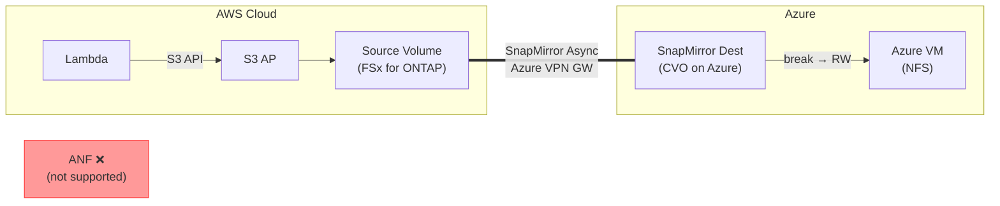

> 🌐 Language: **日本語** | [English](../en/demo-guide-10-snapmirror-cvo-azure.md)

# Demo Guide 10: SnapMirror CVO on Azure（FSx for ONTAP → Cloud Volumes ONTAP on Azure）

> **所要時間**: 約120分（CVO デプロイ含む）
> **コスト**: ~$20–30（AWS + Azure 合算、検証後に削除する場合）
> **対象読者**: AWS → Azure マルチクラウド DR を検討するエンジニア
> **ONTAP バージョン**: FSx 9.17.1+ / CVO 9.11.1+

---

> ⚠️ **検証ステータス**: 手順レベルのガイド（実環境での E2E 検証は未実施）。
> コマンドとアーキテクチャは公式ドキュメントおよび Guide 01/02（同一リージョン / クロスリージョン FSx for ONTAP）で検証済みのパターンに基づいています。
> 完全な検証には外部環境が必要です — BACKLOG items 7–12 を参照。


## このデモで検証すること

```
AWS Cloud (ap-northeast-1)                  Azure (East US)
┌────────────────────────────┐              ┌────────────────────────────┐
│  Lambda ──S3 API──▶ S3 AP  │              │                            │
│        │                   │              │  Cloud Volumes ONTAP       │
│        ▼                   │  Azure VPN   │    SnapMirror Dest (DP)    │
│   Source Volume            │  Gateway     │        [break → RW]        │
│   (FSx for ONTAP)         │═════════════▶│          │                 │
│                            │  SnapMirror  │    NFS mount               │
│                            │  Async       │   (Azure VM)               │
└────────────────────────────┘              └────────────────────────────┘

※ S3 AP は AWS 専用機能 — Azure 側は NFS/SMB でアクセス
※ Azure NetApp Files (ANF) への直接 SnapMirror は未サポート (XC-007)
   → CVO on Azure が AWS → Azure の SnapMirror パス
```




**検証ポイント:**

| # | 検証項目 | 操作 |
|:-:|---------|------|
| 1 | AWS で S3 AP 経由のデータ書き込み | Lambda → S3 AP |
| 2 | SnapMirror レプリケーション確認 | REST API |
| 3 | Azure CVO で SnapMirror break | REST API |
| 4 | Azure VM から NFS データアクセス | NFS |

---

> ⚠️ **検証ステータス**: 手順レベルのガイド（実環境での E2E 検証は未実施）。
> コマンドとアーキテクチャは公式ドキュメントおよび Guide 01/02（同一リージョン / クロスリージョン FSx for ONTAP）で検証済みのパターンに基づいています。
> 完全な検証には外部環境が必要です — BACKLOG items 7–12 を参照。


## 前提条件

[共通前提条件](./demo-guide-00-prerequisites.md) に加え:

| リソース | クラウド | 説明 |
|----------|---------|------|
| FSx for ONTAP | AWS | Source Volume + S3 AP |
| Cloud Volumes ONTAP | Azure | Destination Volume |
| Azure VPN Gateway | AWS ↔ Azure | IPsec トンネル |
| Cluster + SVM Peering | 両クラスター | SnapMirror 前提 |

> **重要制約 (XC-007)**: Azure NetApp Files (ANF) は FSx for ONTAP からの直接 SnapMirror をサポートしていません。AWS → Azure のデータレプリケーションには **CVO on Azure** を使用してください。

---

> ⚠️ **検証ステータス**: 手順レベルのガイド（実環境での E2E 検証は未実施）。
> コマンドとアーキテクチャは公式ドキュメントおよび Guide 01/02（同一リージョン / クロスリージョン FSx for ONTAP）で検証済みのパターンに基づいています。
> 完全な検証には外部環境が必要です — BACKLOG items 7–12 を参照。


## Step 0: 環境変数の設定

```bash
# === AWS 側 ===
export AWS_REGION="ap-northeast-1"
export FS_ID="fs-0EXAMPLE1234abcde"
export SVM_NAME_AWS="svm-source"
export SECRET_ARN="arn:aws:secretsmanager:ap-northeast-1:123456789012:secret:fsxn-admin-XXXXXX"

# === Azure CVO 側 ===
export CVO_CLUSTER_IP="198.51.100.50"
export CVO_SVM="svm-azure-dest"

# === 共通 ===
export SOURCE_VOL="vol_sm_azure_src"
export DEST_VOL="vol_sm_azure_dest"
export S3AP_NAME="fsxn-sm-azure"
```

---

> ⚠️ **検証ステータス**: 手順レベルのガイド（実環境での E2E 検証は未実施）。
> コマンドとアーキテクチャは公式ドキュメントおよび Guide 01/02（同一リージョン / クロスリージョン FSx for ONTAP）で検証済みのパターンに基づいています。
> 完全な検証には外部環境が必要です — BACKLOG items 7–12 を参照。


## Step 1: Source Volume + S3 AP + Lambda Writer（AWS 側）

> [Demo Guide 01 Step 4-6](./demo-guide-01-flexcache-same-region.md#step-4-origin-volume-作成--s3-ap-アタッチ) を参照。

---

> ⚠️ **検証ステータス**: 手順レベルのガイド（実環境での E2E 検証は未実施）。
> コマンドとアーキテクチャは公式ドキュメントおよび Guide 01/02（同一リージョン / クロスリージョン FSx for ONTAP）で検証済みのパターンに基づいています。
> 完全な検証には外部環境が必要です — BACKLOG items 7–12 を参照。


## Step 2: VPN + Cluster Peering + SVM Peering

> [Demo Guide 05 Step 1-3](./demo-guide-05-flexcache-cvo-azure.md#step-1-azure-vpn-gateway-の作成) を参照。SVM Peering の `applications` に `snapmirror` を指定。

```bash
# SVM Peer 作成時（AWS 側）
MGMT_IP=$(aws fsx describe-file-systems --file-system-ids "$FS_ID" \
  --query 'FileSystems[0].OntapConfiguration.Endpoints.Management.IpAddresses[0]' \
  --output text --region "$AWS_REGION")

CREDS=$(aws secretsmanager get-secret-value --secret-id "$SECRET_ARN" \
  --query SecretString --output text --region "$AWS_REGION")
ONTAP_USER=$(echo "$CREDS" | jq -r '.username')
ONTAP_PASS=$(echo "$CREDS" | jq -r '.password')

curl -sk -u "${ONTAP_USER}:${ONTAP_PASS}" \
  -X POST "https://${MGMT_IP}/api/svm/peers" \
  -H "Content-Type: application/json" \
  -d "{
    \"svm\": {\"name\": \"${SVM_NAME_AWS}\"},
    \"peer\": {\"svm\": {\"name\": \"${CVO_SVM}\"}},
    \"applications\": [\"snapmirror\"]
  }" | jq '{job: .job.uuid}'
```

---

> ⚠️ **検証ステータス**: 手順レベルのガイド（実環境での E2E 検証は未実施）。
> コマンドとアーキテクチャは公式ドキュメントおよび Guide 01/02（同一リージョン / クロスリージョン FSx for ONTAP）で検証済みのパターンに基づいています。
> 完全な検証には外部環境が必要です — BACKLOG items 7–12 を参照。


## Step 3: Destination Volume 作成 + SnapMirror（Azure CVO）

```bash
# Azure CVO 側で DP Volume 作成
curl -sk -u "admin:<CVO_PASSWORD>" \
  -X POST "https://${CVO_CLUSTER_IP}/api/storage/volumes" \
  -H "Content-Type: application/json" \
  -d "{
    \"name\": \"${DEST_VOL}\",
    \"svm\": {\"name\": \"${CVO_SVM}\"},
    \"size\": 10737418240,
    \"type\": \"dp\"
  }" | jq '{job: .job.uuid}'

sleep 10

# SnapMirror 関係を作成
PEER_CLUSTER=$(curl -sk -u "admin:<CVO_PASSWORD>" \
  "https://${CVO_CLUSTER_IP}/api/cluster/peers" | jq -r '.records[0].name')

curl -sk -u "admin:<CVO_PASSWORD>" \
  -X POST "https://${CVO_CLUSTER_IP}/api/snapmirror/relationships" \
  -H "Content-Type: application/json" \
  -d "{
    \"source\": {
      \"path\": \"${SVM_NAME_AWS}:${SOURCE_VOL}\",
      \"cluster\": {\"name\": \"${PEER_CLUSTER}\"}
    },
    \"destination\": {
      \"path\": \"${CVO_SVM}:${DEST_VOL}\"
    },
    \"policy\": {\"name\": \"MirrorAllSnapshots\"}
  }" | jq '{job: .job.uuid}'

echo "SnapMirror 初期転送中..."
sleep 45
```

```bash
# 状態確認
curl -sk -u "admin:<CVO_PASSWORD>" \
  "https://${CVO_CLUSTER_IP}/api/snapmirror/relationships?destination.path=${CVO_SVM}:${DEST_VOL}&fields=state,healthy" \
  | jq '.records[0] | {state, healthy}'
```

**期待される出力:**
```json
{
  "state": "snapmirrored",
  "healthy": true
}
```

---

> ⚠️ **検証ステータス**: 手順レベルのガイド（実環境での E2E 検証は未実施）。
> コマンドとアーキテクチャは公式ドキュメントおよび Guide 01/02（同一リージョン / クロスリージョン FSx for ONTAP）で検証済みのパターンに基づいています。
> 完全な検証には外部環境が必要です — BACKLOG items 7–12 を参照。


## Step 4: SnapMirror Break + NFS アクセス（Azure 側）

```bash
# SnapMirror Break
SM_UUID=$(curl -sk -u "admin:<CVO_PASSWORD>" \
  "https://${CVO_CLUSTER_IP}/api/snapmirror/relationships?destination.path=${CVO_SVM}:${DEST_VOL}" \
  | jq -r '.records[0].uuid')

curl -sk -u "admin:<CVO_PASSWORD>" \
  -X PATCH "https://${CVO_CLUSTER_IP}/api/snapmirror/relationships/${SM_UUID}" \
  -H "Content-Type: application/json" \
  -d '{"state": "broken_off"}' | jq '{job: .job.uuid}'

sleep 15

# Junction Path 設定
DEST_UUID=$(curl -sk -u "admin:<CVO_PASSWORD>" \
  "https://${CVO_CLUSTER_IP}/api/storage/volumes?name=${DEST_VOL}" \
  | jq -r '.records[0].uuid')

curl -sk -u "admin:<CVO_PASSWORD>" \
  -X PATCH "https://${CVO_CLUSTER_IP}/api/storage/volumes/${DEST_UUID}" \
  -H "Content-Type: application/json" \
  -d "{\"nas\": {\"path\": \"/${DEST_VOL}\"}}" | jq .
```

```bash
# Azure VM から NFS マウント
CVO_DATA_LIF="198.51.100.52"

sudo mkdir -p /mnt/sm_azure_dest
sudo mount -t nfs -o vers=3 ${CVO_DATA_LIF}:/${DEST_VOL} /mnt/sm_azure_dest

# データ確認
ls -la /mnt/sm_azure_dest/demo-data/
cat /mnt/sm_azure_dest/demo-data/sensor-001.json | jq .
```

**期待される出力:**
```json
{
  "sensor_id": "S001",
  "temperature": 23.5,
  "humidity": 65,
  "ts": 1753090800
}
```

---

> ⚠️ **検証ステータス**: 手順レベルのガイド（実環境での E2E 検証は未実施）。
> コマンドとアーキテクチャは公式ドキュメントおよび Guide 01/02（同一リージョン / クロスリージョン FSx for ONTAP）で検証済みのパターンに基づいています。
> 完全な検証には外部環境が必要です — BACKLOG items 7–12 を参照。


## クリーンアップ

```bash
# 1. Azure VM: NFS アンマウント
sudo umount /mnt/sm_azure_dest

# 2. CVO: SnapMirror 関係削除 → Volume 削除
curl -sk -u "admin:<CVO_PASSWORD>" \
  -X DELETE "https://${CVO_CLUSTER_IP}/api/snapmirror/relationships/${SM_UUID}" \
  -H "Content-Type: application/json" -d '{"destination_only": true}'

# 3. CVO 削除 + VPN 削除（Demo Guide 05 参照）
# 4. AWS 側: S3 AP + Volume + Lambda 削除（Demo Guide 01 参照）
```

---

> ⚠️ **検証ステータス**: 手順レベルのガイド（実環境での E2E 検証は未実施）。
> コマンドとアーキテクチャは公式ドキュメントおよび Guide 01/02（同一リージョン / クロスリージョン FSx for ONTAP）で検証済みのパターンに基づいています。
> 完全な検証には外部環境が必要です — BACKLOG items 7–12 を参照。


## トラブルシューティング

| 症状 | 原因 | 対処 |
|------|------|------|
| SnapMirror 初期転送タイムアウト | VPN スループット不足 | VPN Gateway SKU を VpnGw2 以上に変更 |
| "peer cluster unreachable" | NSG で 11104-11105 未許可 | Azure NSG + AWS SG 両方確認 |
| Break 後に NFS mount 失敗 | Junction Path 未設定 or Data LIF 不正 | REST API で確認 |
| CVO ディスク空き不足 | Managed Disk サイズ < Source Vol | CVO ディスク追加 |
| ANF を使いたい | FSx → ANF 直接 SnapMirror 未サポート | CVO on Azure を使用 (XC-007) |

---

> ⚠️ **検証ステータス**: 手順レベルのガイド（実環境での E2E 検証は未実施）。
> コマンドとアーキテクチャは公式ドキュメントおよび Guide 01/02（同一リージョン / クロスリージョン FSx for ONTAP）で検証済みのパターンに基づいています。
> 完全な検証には外部環境が必要です — BACKLOG items 7–12 を参照。


## ANF が使えない理由（技術的背景）

Azure NetApp Files (ANF) は NetApp ONTAP ベースですが、Microsoft が管理するサービスであり、以下の制約があります:

- **Cross-Cloud SnapMirror 未サポート**: ANF は Azure 内の ANF 間 Cross-Region Replication のみサポート
- **Cluster Peering 不可**: ANF は Cluster Management を公開していないため、外部 ONTAP クラスターとの Peering 不可
- **推奨パス**: AWS → Azure データレプリケーションには CVO on Azure を使用

将来的に ANF が Cross-Cloud SnapMirror をサポートする可能性はありますが、現時点 (2026 Q3) では未対応です。

---

> ⚠️ **検証ステータス**: 手順レベルのガイド（実環境での E2E 検証は未実施）。
> コマンドとアーキテクチャは公式ドキュメントおよび Guide 01/02（同一リージョン / クロスリージョン FSx for ONTAP）で検証済みのパターンに基づいています。
> 完全な検証には外部環境が必要です — BACKLOG items 7–12 を参照。


## 参考リンク

- [NetApp Docs: SnapMirror](https://docs.netapp.com/us-en/ontap/data-protection/index.html)
- [Azure Docs: VPN Gateway](https://learn.microsoft.com/azure/vpn-gateway/)
- [Demo Guide 05: FlexCache CVO on Azure](./demo-guide-05-flexcache-cvo-azure.md)（VPN + CVO 手順）
- [Demo Guide 01: FlexCache 同一リージョン](./demo-guide-01-flexcache-same-region.md)（Lambda Writer 手順）
