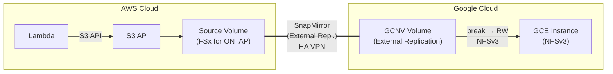

> 🌐 Language: **日本語** | [English](../en/demo-guide-11-snapmirror-gcnv.md)

# Demo Guide 11: SnapMirror GCNV（FSx for ONTAP → Google Cloud NetApp Volumes）

> **所要時間**: 約90分（VPN 構成済みの場合）
> **コスト**: ~$15–25（AWS + GCP 合算、検証後に削除する場合）
> **対象読者**: AWS → GCP データレプリケーションを検討するエンジニア
> **ONTAP バージョン**: FSx 9.17.1+ / GCNV（Google 管理、External Replication 対応）

---

> ⚠️ **検証ステータス**: 手順レベルのガイド（実環境での E2E 検証は未実施）。
> コマンドとアーキテクチャは公式ドキュメントおよび Guide 01/02（同一リージョン / クロスリージョン FSx for ONTAP）で検証済みのパターンに基づいています。
> 完全な検証には外部環境が必要です — BACKLOG items 7–12 を参照。


## このデモで検証すること

```
AWS Cloud (ap-northeast-1)                  Google Cloud (us-central1)
┌────────────────────────────┐              ┌────────────────────────────┐
│  Lambda ──S3 API──▶ S3 AP  │              │                            │
│        │                   │              │  Google Cloud NetApp       │
│        ▼                   │  HA VPN      │  Volumes (GCNV)            │
│   Source Volume            │═════════════▶│    External Replication    │
│   (FSx for ONTAP)         │  SnapMirror  │    Destination Volume      │
│                            │  (External   │          │                 │
│                            │   Repl.)     │    NFS mount               │
│                            │              │   (GCE instance)           │
└────────────────────────────┘              └────────────────────────────┘

GCNV の External Replication:
  - Google が管理する SnapMirror 互換レプリケーション
  - GCNV が Destination Volume を管理
  - Break 後は GCNV Volume として独立運用
```




**検証ポイント:**

| # | 検証項目 | 操作 |
|:-:|---------|------|
| 1 | AWS で S3 AP 経由のデータ書き込み | Lambda → S3 AP |
| 2 | GCNV External Replication の確認 | gcloud / GCP Console |
| 3 | Replication break 後の NFS アクセス | NFSv3 |

---

> ⚠️ **検証ステータス**: 手順レベルのガイド（実環境での E2E 検証は未実施）。
> コマンドとアーキテクチャは公式ドキュメントおよび Guide 01/02（同一リージョン / クロスリージョン FSx for ONTAP）で検証済みのパターンに基づいています。
> 完全な検証には外部環境が必要です — BACKLOG items 7–12 を参照。


## 前提条件

[共通前提条件](./demo-guide-00-prerequisites.md) に加え:

| リソース | クラウド | 説明 |
|----------|---------|------|
| FSx for ONTAP | AWS | Source Volume + S3 AP |
| GCNV Storage Pool | GCP | Destination Volume |
| HA VPN | AWS ↔ GCP | Intercluster 通信 |
| GCP VPC (PSA 有効) | GCP | GCNV 接続用 |

### GCNV External Replication の特徴

| 項目 | 詳細 |
|------|------|
| 管理者 | Google（GCNV が Destination を管理） |
| Source 要件 | FSx for ONTAP の Intercluster LIF が GCNV から到達可能 |
| プロトコル | SnapMirror 互換（GCNV 内部実装） |
| Break 後 | GCNV Volume として独立運用（NFS アクセス） |
| 制約 | NFSv3 のみ対応 |

---

> ⚠️ **検証ステータス**: 手順レベルのガイド（実環境での E2E 検証は未実施）。
> コマンドとアーキテクチャは公式ドキュメントおよび Guide 01/02（同一リージョン / クロスリージョン FSx for ONTAP）で検証済みのパターンに基づいています。
> 完全な検証には外部環境が必要です — BACKLOG items 7–12 を参照。


## Step 0: 環境変数の設定

```bash
# === AWS 側 ===
export AWS_REGION="ap-northeast-1"
export FS_ID="fs-0EXAMPLE1234abcde"
export SVM_NAME_AWS="svm-source"
export SECRET_ARN="arn:aws:secretsmanager:ap-northeast-1:123456789012:secret:fsxn-admin-XXXXXX"

# === GCP 側 ===
export GCP_PROJECT="my-project-123456"
export GCP_REGION="us-central1"
export GCP_ZONE="us-central1-a"
export GCP_VPC="gcnv-vpc"

# === 共通 ===
export SOURCE_VOL="vol_sm_gcnv_src"
export S3AP_NAME="fsxn-sm-gcnv"
```

---

> ⚠️ **検証ステータス**: 手順レベルのガイド（実環境での E2E 検証は未実施）。
> コマンドとアーキテクチャは公式ドキュメントおよび Guide 01/02（同一リージョン / クロスリージョン FSx for ONTAP）で検証済みのパターンに基づいています。
> 完全な検証には外部環境が必要です — BACKLOG items 7–12 を参照。


## Step 1: VPN 設定

> [Demo Guide 04 Step 1](./demo-guide-04-flexcache-cvo-gcp.md#step-1-gcp-ha-vpn-の作成) の HA VPN 設定を参照。

---

> ⚠️ **検証ステータス**: 手順レベルのガイド（実環境での E2E 検証は未実施）。
> コマンドとアーキテクチャは公式ドキュメントおよび Guide 01/02（同一リージョン / クロスリージョン FSx for ONTAP）で検証済みのパターンに基づいています。
> 完全な検証には外部環境が必要です — BACKLOG items 7–12 を参照。


## Step 2: Source Volume + S3 AP + Lambda Writer（AWS 側）

> [Demo Guide 01 Step 4-6](./demo-guide-01-flexcache-same-region.md#step-4-origin-volume-作成--s3-ap-アタッチ) を参照。

---

> ⚠️ **検証ステータス**: 手順レベルのガイド（実環境での E2E 検証は未実施）。
> コマンドとアーキテクチャは公式ドキュメントおよび Guide 01/02（同一リージョン / クロスリージョン FSx for ONTAP）で検証済みのパターンに基づいています。
> 完全な検証には外部環境が必要です — BACKLOG items 7–12 を参照。


## Step 3: FSx for ONTAP Intercluster LIF 情報の取得

GCNV External Replication を設定するために、FSx for ONTAP の Intercluster LIF 情報が必要です。

```bash
MGMT_IP=$(aws fsx describe-file-systems --file-system-ids "$FS_ID" \
  --query 'FileSystems[0].OntapConfiguration.Endpoints.Management.IpAddresses[0]' \
  --output text --region "$AWS_REGION")

CREDS=$(aws secretsmanager get-secret-value --secret-id "$SECRET_ARN" \
  --query SecretString --output text --region "$AWS_REGION")
ONTAP_USER=$(echo "$CREDS" | jq -r '.username')
ONTAP_PASS=$(echo "$CREDS" | jq -r '.password')

# Intercluster LIF
IC_LIFS=$(curl -sk -u "${ONTAP_USER}:${ONTAP_PASS}" \
  "https://${MGMT_IP}/api/network/ip/interfaces?services=intercluster_core&fields=ip.address" \
  | jq -r '.records[].ip.address')
echo "FSx Intercluster LIFs: $IC_LIFS"

# Cluster Name (Peer に使用)
CLUSTER_NAME=$(curl -sk -u "${ONTAP_USER}:${ONTAP_PASS}" \
  "https://${MGMT_IP}/api/cluster" | jq -r '.name')
echo "Cluster Name: $CLUSTER_NAME"

# SVM UUID
SVM_UUID=$(curl -sk -u "${ONTAP_USER}:${ONTAP_PASS}" \
  "https://${MGMT_IP}/api/svm/svms?name=${SVM_NAME_AWS}" | jq -r '.records[0].uuid')
echo "SVM UUID: $SVM_UUID"
```

---

> ⚠️ **検証ステータス**: 手順レベルのガイド（実環境での E2E 検証は未実施）。
> コマンドとアーキテクチャは公式ドキュメントおよび Guide 01/02（同一リージョン / クロスリージョン FSx for ONTAP）で検証済みのパターンに基づいています。
> 完全な検証には外部環境が必要です — BACKLOG items 7–12 を参照。


## Step 4: GCNV External Replication Volume の作成

GCNV の External Replication は GCP Console または `gcloud` CLI から設定します。

```bash
# GCNV Storage Pool 作成（まだない場合）
gcloud netapp storage-pools create gcnv-repl-pool \
  --location "$GCP_REGION" \
  --capacity 2048 \
  --service-level PREMIUM \
  --network "$GCP_VPC" \
  --project "$GCP_PROJECT"

# External Replication Volume の作成
# ※ gcloud netapp volumes create with replication source 設定
# 具体的なパラメータは GCNV External Replication の GA 状態により異なります

gcloud netapp volumes create gcnv-repl-dest \
  --location "$GCP_REGION" \
  --capacity 1024 \
  --storage-pool gcnv-repl-pool \
  --protocols NFSv3 \
  --share-name gcnv_repl \
  --project "$GCP_PROJECT"

# External Replication の設定（GCP Console 経由を推奨）
# Source: FSx for ONTAP Cluster IP + SVM Name + Volume Name
# Intercluster LIFs: $IC_LIFS
# Replication Schedule: hourly / daily / custom
```

> **注意**: GCNV External Replication の具体的な CLI パラメータは Google Cloud のリリース状況により変動します。最新の手順は GCP Console の NetApp Volumes > Volumes > Create Volume > External Replication セクションを参照してください。

---

> ⚠️ **検証ステータス**: 手順レベルのガイド（実環境での E2E 検証は未実施）。
> コマンドとアーキテクチャは公式ドキュメントおよび Guide 01/02（同一リージョン / クロスリージョン FSx for ONTAP）で検証済みのパターンに基づいています。
> 完全な検証には外部環境が必要です — BACKLOG items 7–12 を参照。


## Step 5: Replication 状態の確認

```bash
# GCNV Volume のレプリケーション状態を確認
gcloud netapp volumes describe gcnv-repl-dest \
  --location "$GCP_REGION" \
  --project "$GCP_PROJECT" \
  --format='yaml(replicationStatus, dataProtection)'
```

**期待される出力例:**
```yaml
replicationStatus: MIRRORED
dataProtection:
  replication:
    mirrorState: MIRRORED
    healthy: true
```

---

> ⚠️ **検証ステータス**: 手順レベルのガイド（実環境での E2E 検証は未実施）。
> コマンドとアーキテクチャは公式ドキュメントおよび Guide 01/02（同一リージョン / クロスリージョン FSx for ONTAP）で検証済みのパターンに基づいています。
> 完全な検証には外部環境が必要です — BACKLOG items 7–12 を参照。


## Step 6: Replication Break + NFS アクセス

```bash
# Replication を Break（GCP Console または gcloud）
gcloud netapp volumes replications stop gcnv-repl-dest \
  --location "$GCP_REGION" \
  --project "$GCP_PROJECT"

# Break 完了待ち
sleep 30

gcloud netapp volumes describe gcnv-repl-dest \
  --location "$GCP_REGION" \
  --project "$GCP_PROJECT" \
  --format='value(replicationStatus)'
# 期待: STOPPED or BROKEN_OFF
```

```bash
# GCE インスタンスから NFS マウント
gcloud compute ssh gcnv-test-vm --zone "$GCP_ZONE" --project "$GCP_PROJECT"

# GCNV Mount Target の取得
GCNV_MOUNT=$(gcloud netapp volumes describe gcnv-repl-dest \
  --location "$GCP_REGION" --project "$GCP_PROJECT" \
  --format='value(mountOptions.export)')

sudo mkdir -p /mnt/gcnv_repl
sudo mount -t nfs -o vers=3,hard ${GCNV_MOUNT}:/gcnv_repl /mnt/gcnv_repl

# データ確認
ls -la /mnt/gcnv_repl/demo-data/
cat /mnt/gcnv_repl/demo-data/sensor-001.json | jq .
```

**期待される出力:**
```json
{
  "sensor_id": "S001",
  "temperature": 23.5,
  "humidity": 65,
  "ts": 1753090800
}
```

---

> ⚠️ **検証ステータス**: 手順レベルのガイド（実環境での E2E 検証は未実施）。
> コマンドとアーキテクチャは公式ドキュメントおよび Guide 01/02（同一リージョン / クロスリージョン FSx for ONTAP）で検証済みのパターンに基づいています。
> 完全な検証には外部環境が必要です — BACKLOG items 7–12 を参照。


## クリーンアップ

```bash
# 1. GCE: NFS アンマウント
sudo umount /mnt/gcnv_repl

# 2. GCNV Replication 削除 + Volume 削除
gcloud netapp volumes delete gcnv-repl-dest \
  --location "$GCP_REGION" --project "$GCP_PROJECT" --quiet

# 3. GCNV Storage Pool 削除
gcloud netapp storage-pools delete gcnv-repl-pool \
  --location "$GCP_REGION" --project "$GCP_PROJECT" --quiet

# 4. VPN 削除（Demo Guide 04 参照）
# 5. AWS 側: S3 AP + Volume + Lambda 削除（Demo Guide 01 参照）
```

---

> ⚠️ **検証ステータス**: 手順レベルのガイド（実環境での E2E 検証は未実施）。
> コマンドとアーキテクチャは公式ドキュメントおよび Guide 01/02（同一リージョン / クロスリージョン FSx for ONTAP）で検証済みのパターンに基づいています。
> 完全な検証には外部環境が必要です — BACKLOG items 7–12 を参照。


## トラブルシューティング

| 症状 | 原因 | 対処 |
|------|------|------|
| External Replication 作成失敗 | IC LIF が GCNV から到達不可 | VPN + Firewall + ルーティング確認 |
| Replication が "INITIALIZING" のまま | 初期転送中（データ量依存） | 10GB なら数分。大量データなら時間がかかる |
| NFS mount: "access denied" | GCNV Volume の export policy | GCP Console で allowed-clients を確認 |
| NFSv4 指定でエラー | GCNV は NFSv3 のみ対応 | `-o vers=3` を指定 |
| Break 後に書き込めない | GCNV の Volume 設定 | Break 後は RW Volume。export policy を確認 |

---

> ⚠️ **検証ステータス**: 手順レベルのガイド（実環境での E2E 検証は未実施）。
> コマンドとアーキテクチャは公式ドキュメントおよび Guide 01/02（同一リージョン / クロスリージョン FSx for ONTAP）で検証済みのパターンに基づいています。
> 完全な検証には外部環境が必要です — BACKLOG items 7–12 を参照。


## GCNV External Replication vs CVO SnapMirror の選び方

| 観点 | GCNV External Replication | CVO on GCP SnapMirror |
|------|:---:|:---:|
| 管理の手軽さ | ✅ Google 管理 | △ 自己管理 |
| コスト | ✅ GCNV 料金のみ | △ CVO ライセンス + VM 費用 |
| Write-back 対応 | ❌ 不可 | ✅ FlexCache 経由で可能 |
| SMB 対応 | ❌ NFSv3 のみ | ✅ NFS + SMB |
| ONTAP CLI/API アクセス | ❌ 不可 | ✅ フルアクセス |
| FlexCache 併用 | ❌ 不可 | ✅ 可能 |

**選択ガイド:**
- **Read-only で十分 + 管理コスト最小化** → GCNV External Replication
- **Write-back / SMB / ONTAP フル機能が必要** → CVO on GCP

---

> ⚠️ **検証ステータス**: 手順レベルのガイド（実環境での E2E 検証は未実施）。
> コマンドとアーキテクチャは公式ドキュメントおよび Guide 01/02（同一リージョン / クロスリージョン FSx for ONTAP）で検証済みのパターンに基づいています。
> 完全な検証には外部環境が必要です — BACKLOG items 7–12 を参照。


## 参考リンク

- [GCP Docs: NetApp Volumes](https://cloud.google.com/netapp/volumes/docs)
- [GCP Docs: NetApp Volumes Replication](https://cloud.google.com/netapp/volumes/docs/configure-and-use/data-replication)
- [Demo Guide 06: FlexCache GCNV](./demo-guide-06-flexcache-gcnv.md)
- [Demo Guide 04: FlexCache CVO on GCP](./demo-guide-04-flexcache-cvo-gcp.md)（VPN 手順）
- [Demo Guide 01: FlexCache 同一リージョン](./demo-guide-01-flexcache-same-region.md)（Lambda Writer 手順）
