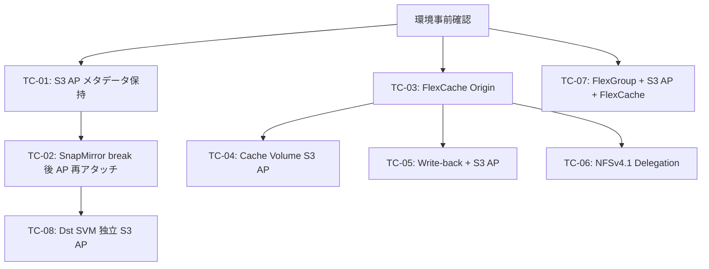

# S3 AP + SnapMirror + FlexCache マルチクラウドデータ配信 — Validation Plan

> **ステータス**: Phase 2 作成
> **最終更新**: 2026-07-15
> **対象**: `undocumented — validation required` に分類された全項目 + `partially_supported` で検証が必要な項目
> **エビデンス保存先**: `.private/evidence/s3ap-multicloud/`

---

## 概要

本ドキュメントは、Research Document（`docs/ja/s3ap-snapmirror-flexcache-research.md`）Phase 1 調査で `undocumented — validation required` または `partially_supported`（検証確認必要）に分類された項目に対する構造化された検証計画を定義する。

### 検証対象一覧

| TC ID | Finding ID | Priority | タイトル |
|:-----:|:----------:|:--------:|---------|
| TC-01 | SM-002 | P1 | S3 AP メタデータ保持 — デスティネーション S3 AP 経由のデータアクセス |
| TC-02 | SM-005 | P1 | SnapMirror break 後の S3 AP 再アタッチ |
| TC-03 | FC-001 | P1 | S3 AP アタッチ済みボリュームの FlexCache Origin 設定 |
| TC-04 | FC-002 | P2 | Cache Volume への S3 AP 独立アタッチ |
| TC-05 | FC-004 | P1 | Write-back mode + S3 AP 書き込み相互作用 |
| TC-06 | FC-005 | P2 | NFSv4.1 Delegation の Cache Volume 動作 |
| TC-07 | FC-007 | P2 | FlexGroup + S3 AP + FlexCache Origin |
| TC-08 | SVM-002 | P2 | SnapMirror break 後のデスティネーション SVM 独立 S3 AP |

---

## Infrastructure Requirements

### 必要リソース

| リソース | 役割 | 要件 |
|---------|------|------|
| FSx for ONTAP Cluster A (Source) | S3 AP アタッチ済みボリューム保持 | ONTAP 9.15.1+ (write-back テスト対応) |
| FSx for ONTAP Cluster B (Destination) | SnapMirror デスティネーション / FlexCache Cache | ONTAP 9.15.1+ |
| Intercluster LIF | クラスター間 SnapMirror / FlexCache 通信 | 両クラスターで構成済み |
| Cluster Peering | SnapMirror / FlexCache 関係の前提 | TLS 1.2 暗号化有効 |
| AWS Managed AD | SMB テスト用 AD 環境 | 既存 Managed AD 流用 |
| テスト専用ボリューム | 各テストケースで作成・削除 | FlexVol / FlexGroup |
| IAM Role / Policy | S3 AP データ操作用 | `s3:ListBucket`, `s3:GetObject`, `s3:PutObject` |

### ネットワーク要件

- Cluster A ↔ Cluster B 間: TCP 11104, 11105, ICMP 到達性確認済み
- AD DC への到達性: TCP 53/88/389/445/636 (SVM ENI → AD DC IP)
- S3 AP エンドポイント到達性: Lambda / CLI からインターネット経由

### 事前確認コマンド

```bash
# ONTAP バージョン確認
curl -s -k -u "fsxadmin:${FSX_PASSWORD}" \
  "https://${CLUSTER_A_MGMT_IP}/api/cluster?fields=version" | jq '.version'

# Intercluster LIF 確認
curl -s -k -u "fsxadmin:${FSX_PASSWORD}" \
  "https://${CLUSTER_A_MGMT_IP}/api/network/ip/interfaces?services=intercluster&fields=ip.address,state" | jq '.records[]'

# Cluster Peering 状態確認
curl -s -k -u "fsxadmin:${FSX_PASSWORD}" \
  "https://${CLUSTER_A_MGMT_IP}/api/cluster/peers?fields=name,status,encryption" | jq '.records[]'

# AD 接続性確認 (CIFS サービス状態)
curl -s -k -u "fsxadmin:${FSX_PASSWORD}" \
  "https://${CLUSTER_A_MGMT_IP}/api/protocols/cifs/services?svm.name=${SVM_NAME}&fields=enabled,ad_domain" | jq '.records[]'
```

### 命名規則

- テストボリューム: `s3ap_val_tc{NN}_{purpose}` (例: `s3ap_val_tc01_src`)
- S3 AP 名: `s3ap-val-tc{NN}` (例: `s3ap-val-tc01`)
- SnapMirror ラベル: `s3ap_validation`
- エビデンスファイル: `tc{NN}-{step}-{timestamp}.json`
- IP アドレス例: RFC 5737 範囲 `198.51.100.x`

---

## Test Case: TC-01 — S3 AP メタデータ保持確認（デスティネーション S3 AP データアクセス）

### Finding Ref: SM-002
### Requirement Ref: Requirement 1, AC 1.2 / Requirement 7, AC 7.1
### Priority: P1
### Estimated Duration: 45 min

### Preconditions

- Cluster A に S3 AP アタッチ済みボリューム（FlexVol, UNIX security style）が存在
- S3 AP 経由でテストデータ（Parquet, CSV, JSON 各1ファイル以上）が書き込み済み
- Cluster A → Cluster B の SnapMirror Async 関係が確立済み
- デスティネーションボリュームが DP (read-only) 状態

### Test Steps

**Step 1: ソースボリュームの S3 AP 状態記録**

```bash
# ソース S3 AP の詳細取得
aws fsx describe-s3-access-points \
  --filters "Name=volume-id,Values=${SRC_VOLUME_ID}" \
  --region ${REGION} > .private/evidence/s3ap-multicloud/tc01-step1-src-ap-describe.json

# ソースボリュームのファイルリスト取得（S3 API 経由）
aws s3api list-objects-v2 \
  --bucket "${SRC_AP_ARN}" \
  --max-keys 100 > .private/evidence/s3ap-multicloud/tc01-step1-src-file-list.json
```

**Step 2: SnapMirror 転送実行と完了確認**

```bash
# SnapMirror 手動更新トリガー
curl -s -k -u "fsxadmin:${FSX_PASSWORD}" \
  -X PATCH "https://${CLUSTER_B_MGMT_IP}/api/snapmirror/relationships/${SM_REL_UUID}" \
  -H "Content-Type: application/json" \
  -d '{"state": "snapmirrored", "transfer": {"state": "transferring"}}' \
  | jq '.' > .private/evidence/s3ap-multicloud/tc01-step2-sm-update.json

# 転送完了ポーリング（最大10分）
for i in $(seq 1 20); do
  STATUS=$(curl -s -k -u "fsxadmin:${FSX_PASSWORD}" \
    "https://${CLUSTER_B_MGMT_IP}/api/snapmirror/relationships/${SM_REL_UUID}?fields=transfer.state,state" \
    | jq -r '.transfer.state // "idle"')
  echo "$(date -u +%Y-%m-%dT%H:%M:%SZ) transfer_state=${STATUS}"
  [ "${STATUS}" = "idle" ] || [ "${STATUS}" = "null" ] && break
  sleep 30
done
```

**Step 3: SnapMirror break 実行**

```bash
# SnapMirror break（デスティネーションを RW に昇格）
curl -s -k -u "fsxadmin:${FSX_PASSWORD}" \
  -X PATCH "https://${CLUSTER_B_MGMT_IP}/api/snapmirror/relationships/${SM_REL_UUID}" \
  -H "Content-Type: application/json" \
  -d '{"state": "broken_off"}' \
  | jq '.' > .private/evidence/s3ap-multicloud/tc01-step3-sm-break.json

# デスティネーションボリュームの RW 状態確認
curl -s -k -u "fsxadmin:${FSX_PASSWORD}" \
  "https://${CLUSTER_B_MGMT_IP}/api/storage/volumes/${DST_VOLUME_UUID}?fields=type,state" \
  | jq '.' > .private/evidence/s3ap-multicloud/tc01-step3-dst-vol-state.json
```

**Step 4: デスティネーションに新規 S3 AP アタッチ**

```bash
# デスティネーションボリュームに S3 AP を新規作成・アタッチ
aws fsx create-and-attach-s3-access-point \
  --name "s3ap-val-tc01-dst" \
  --type ONTAP \
  --ontap-configuration '{
    "VolumeId": "'${DST_VOLUME_ID}'",
    "FileSystemIdentity": {
      "Type": "UNIX",
      "UnixUser": {"Name": "testuser"}
    }
  }' \
  --region ${REGION} > .private/evidence/s3ap-multicloud/tc01-step4-dst-ap-create.json

# S3 AP アタッチ完了ポーリング
DST_AP_ARN=$(jq -r '.S3AccessPoint.S3AccessPointArn' .private/evidence/s3ap-multicloud/tc01-step4-dst-ap-create.json)
for i in $(seq 1 12); do
  LIFECYCLE=$(aws fsx describe-s3-access-points \
    --filters "Name=volume-id,Values=${DST_VOLUME_ID}" \
    --region ${REGION} | jq -r '.S3AccessPoints[0].Lifecycle')
  echo "$(date -u +%Y-%m-%dT%H:%M:%SZ) lifecycle=${LIFECYCLE}"
  [ "${LIFECYCLE}" = "AVAILABLE" ] && break
  sleep 10
done
```

**Step 5: デスティネーション S3 AP 経由のデータアクセス検証**

```bash
# ListObjectsV2 でファイル一覧取得
aws s3api list-objects-v2 \
  --bucket "${DST_AP_ARN}" \
  --max-keys 100 > .private/evidence/s3ap-multicloud/tc01-step5-dst-file-list.json

# GetObject でファイル内容取得（チェックサム比較用）
aws s3api get-object \
  --bucket "${DST_AP_ARN}" \
  --key "test-data/sample.parquet" \
  /tmp/tc01-dst-sample.parquet
sha256sum /tmp/tc01-dst-sample.parquet > .private/evidence/s3ap-multicloud/tc01-step5-dst-checksum.txt

# ソース側のチェックサムと比較
aws s3api get-object \
  --bucket "${SRC_AP_ARN}" \
  --key "test-data/sample.parquet" \
  /tmp/tc01-src-sample.parquet
sha256sum /tmp/tc01-src-sample.parquet >> .private/evidence/s3ap-multicloud/tc01-step5-dst-checksum.txt
```

### Expected Result

- デスティネーションボリュームに S3 AP が正常にアタッチできる（Lifecycle = `AVAILABLE`）
- デスティネーション S3 AP 経由で ListObjectsV2 が成功し、ソースと同一のファイル一覧が返る
- GetObject で取得したファイルの SHA-256 チェックサムがソースと一致する（byte-accurate replication）
- FSx が `s3_unix` name-mapping を自動作成していることを確認

### Pass/Fail Criteria

| 判定 | 条件 |
|:----:|------|
| PASS | デスティネーション S3 AP の ListObjectsV2 + GetObject がソースと同一結果を返す |
| PASS | ファイルチェックサムが完全一致 |
| FAIL | S3 AP アタッチが失敗（エラーメッセージ記録） |
| FAIL | ListObjectsV2 が AccessDenied を返す |
| FAIL | ファイル内容がソースと不一致 |

### Evidence Capture

| アーティファクト | ファイル名パターン |
|----------------|-------------------|
| ソース AP 詳細 | `tc01-step1-src-ap-describe.json` |
| ソースファイル一覧 | `tc01-step1-src-file-list.json` |
| SnapMirror 転送結果 | `tc01-step2-sm-update.json` |
| SnapMirror break 結果 | `tc01-step3-sm-break.json` |
| デスティネーション AP 作成結果 | `tc01-step4-dst-ap-create.json` |
| デスティネーションファイル一覧 | `tc01-step5-dst-file-list.json` |
| チェックサム比較 | `tc01-step5-dst-checksum.txt` |

### Rollback Procedure

```bash
# 1. デスティネーション S3 AP デタッチ・削除
aws fsx delete-s3-access-point \
  --s3-access-point-id "${DST_AP_ID}" \
  --region ${REGION}

# 2. SnapMirror 関係の resync（DP 状態に戻す）
curl -s -k -u "fsxadmin:${FSX_PASSWORD}" \
  -X PATCH "https://${CLUSTER_B_MGMT_IP}/api/snapmirror/relationships/${SM_REL_UUID}" \
  -H "Content-Type: application/json" \
  -d '{"state": "snapmirrored"}'

# 3. テスト用ファイルのクリーンアップ
rm -f /tmp/tc01-*.parquet
```

---

## Test Case: TC-02 — SnapMirror break 後の S3 AP 再アタッチ

### Finding Ref: SM-005
### Requirement Ref: Requirement 1, AC 1.6 / Requirement 7, AC 7.1
### Priority: P1
### Estimated Duration: 40 min

### Preconditions

- Cluster A にテスト用ボリューム（FlexVol, UNIX security style）作成済み
- S3 AP がアタッチされ、テストデータ書き込み済み
- Cluster A → Cluster B へのSnapMirror Async 関係確立済み
- 少なくとも1回のベースライン転送完了済み

### Test Steps

**Step 1: テスト前 Snapshot 取得（ロールバックポイント）**

```bash
# デスティネーションボリュームの Snapshot 取得
curl -s -k -u "fsxadmin:${FSX_PASSWORD}" \
  -X POST "https://${CLUSTER_B_MGMT_IP}/api/storage/volumes/${DST_VOLUME_UUID}/snapshots" \
  -H "Content-Type: application/json" \
  -d '{"name": "pre_tc02_rollback"}' \
  | jq '.' > .private/evidence/s3ap-multicloud/tc02-step1-snapshot.json
```

**Step 2: SnapMirror break 実行**

```bash
# SnapMirror break
curl -s -k -u "fsxadmin:${FSX_PASSWORD}" \
  -X PATCH "https://${CLUSTER_B_MGMT_IP}/api/snapmirror/relationships/${SM_REL_UUID}" \
  -H "Content-Type: application/json" \
  -d '{"state": "broken_off"}' \
  | jq '.' > .private/evidence/s3ap-multicloud/tc02-step2-sm-break.json

# ボリューム状態確認（RW に昇格していること）
curl -s -k -u "fsxadmin:${FSX_PASSWORD}" \
  "https://${CLUSTER_B_MGMT_IP}/api/storage/volumes/${DST_VOLUME_UUID}?fields=type,state,nas.path" \
  | jq '.' > .private/evidence/s3ap-multicloud/tc02-step2-vol-state.json
```

**Step 3: Junction path 確認（S3 AP アタッチ前提条件）**

```bash
# Junction path がマウントされていることを確認
JUNCTION=$(curl -s -k -u "fsxadmin:${FSX_PASSWORD}" \
  "https://${CLUSTER_B_MGMT_IP}/api/storage/volumes/${DST_VOLUME_UUID}?fields=nas.path" \
  | jq -r '.nas.path')
echo "Junction path: ${JUNCTION}" > .private/evidence/s3ap-multicloud/tc02-step3-junction.txt

# Junction path が未設定の場合はマウント
if [ "${JUNCTION}" = "null" ] || [ -z "${JUNCTION}" ]; then
  curl -s -k -u "fsxadmin:${FSX_PASSWORD}" \
    -X PATCH "https://${CLUSTER_B_MGMT_IP}/api/storage/volumes/${DST_VOLUME_UUID}" \
    -H "Content-Type: application/json" \
    -d '{"nas": {"path": "/s3ap_val_tc02_dst"}}' \
    | jq '.' >> .private/evidence/s3ap-multicloud/tc02-step3-junction.txt
fi
```

**Step 4: S3 AP アタッチ実行**

```bash
# create-and-attach-s3-access-point 実行
aws fsx create-and-attach-s3-access-point \
  --name "s3ap-val-tc02" \
  --type ONTAP \
  --ontap-configuration '{
    "VolumeId": "'${DST_VOLUME_ID}'",
    "FileSystemIdentity": {
      "Type": "UNIX",
      "UnixUser": {"Name": "testuser"}
    }
  }' \
  --region ${REGION} > .private/evidence/s3ap-multicloud/tc02-step4-ap-create.json

# Lifecycle ポーリング
for i in $(seq 1 12); do
  LIFECYCLE=$(aws fsx describe-s3-access-points \
    --filters "Name=volume-id,Values=${DST_VOLUME_ID}" \
    --region ${REGION} | jq -r '.S3AccessPoints[0].Lifecycle')
  echo "$(date -u +%Y-%m-%dT%H:%M:%SZ) lifecycle=${LIFECYCLE}"
  [ "${LIFECYCLE}" = "AVAILABLE" ] && break
  sleep 10
done > .private/evidence/s3ap-multicloud/tc02-step4-lifecycle-poll.log
```

**Step 5: S3 AP 経由のデータ操作確認**

```bash
DST_AP_ARN=$(jq -r '.S3AccessPoint.S3AccessPointArn' .private/evidence/s3ap-multicloud/tc02-step4-ap-create.json)

# ListObjectsV2
aws s3api list-objects-v2 \
  --bucket "${DST_AP_ARN}" \
  --max-keys 10 > .private/evidence/s3ap-multicloud/tc02-step5-list.json

# PutObject（RW ボリュームへの書き込みテスト）
echo '{"test": "tc02-write-after-break", "timestamp": "'$(date -u +%Y-%m-%dT%H:%M:%SZ)'"}' > /tmp/tc02-test.json
aws s3api put-object \
  --bucket "${DST_AP_ARN}" \
  --key "validation/tc02-write-test.json" \
  --body /tmp/tc02-test.json > .private/evidence/s3ap-multicloud/tc02-step5-put.json

# GetObject で書き込み確認
aws s3api get-object \
  --bucket "${DST_AP_ARN}" \
  --key "validation/tc02-write-test.json" \
  /tmp/tc02-readback.json
diff /tmp/tc02-test.json /tmp/tc02-readback.json && echo "PASS: write-read consistent"
```

### Expected Result

- SnapMirror break 後のデスティネーションボリュームに S3 AP が正常アタッチ可能
- `create-and-attach-s3-access-point` が成功（HTTP 200, Lifecycle → AVAILABLE）
- ListObjectsV2 でレプリケート済みファイルが参照可能
- PutObject でデスティネーションへの新規書き込みが成功
- GetObject で書き込んだデータが正しく読み出せる

### Pass/Fail Criteria

| 判定 | 条件 |
|:----:|------|
| PASS | S3 AP が AVAILABLE になり、List/Get/Put 全てが成功 |
| FAIL | `create-and-attach-s3-access-point` がエラーを返す |
| FAIL | AP は作成されるが Lifecycle が AVAILABLE にならない（タイムアウト） |
| FAIL | データ操作で AccessDenied または InternalError |

### Evidence Capture

| アーティファクト | ファイル名パターン |
|----------------|-------------------|
| 事前 Snapshot 結果 | `tc02-step1-snapshot.json` |
| SnapMirror break 結果 | `tc02-step2-sm-break.json` |
| ボリューム状態 | `tc02-step2-vol-state.json` |
| Junction path 確認 | `tc02-step3-junction.txt` |
| S3 AP 作成結果 | `tc02-step4-ap-create.json` |
| Lifecycle ポーリングログ | `tc02-step4-lifecycle-poll.log` |
| List/Put/Get 結果 | `tc02-step5-*.json` |

### Rollback Procedure

```bash
# 1. S3 AP 削除
aws fsx delete-s3-access-point \
  --s3-access-point-id "${DST_AP_ID}" \
  --region ${REGION}

# 2. テストファイルのクリーンアップ（NFS マウント経由）
# sudo mount -t nfs ${DST_SVM_NFS_IP}:/s3ap_val_tc02_dst /mnt/tc02
# rm -f /mnt/tc02/validation/tc02-write-test.json
# sudo umount /mnt/tc02

# 3. SnapMirror resync（DP 状態に復帰）
curl -s -k -u "fsxadmin:${FSX_PASSWORD}" \
  -X PATCH "https://${CLUSTER_B_MGMT_IP}/api/snapmirror/relationships/${SM_REL_UUID}" \
  -H "Content-Type: application/json" \
  -d '{"state": "snapmirrored"}'

# 4. ローカルファイル削除
rm -f /tmp/tc02-*.json
```

---

## Test Case: TC-03 — S3 AP アタッチ済みボリュームの FlexCache Origin 設定

### Finding Ref: FC-001
### Requirement Ref: Requirement 2, AC 2.1 / Requirement 7, AC 7.1
### Priority: P1
### Estimated Duration: 45 min

### Preconditions

- Cluster A にテスト用ボリューム（FlexVol, UNIX security style）作成済み
- S3 AP がアタッチ済みで Lifecycle = AVAILABLE
- S3 AP 経由でテストデータ書き込み済み
- Cluster A ↔ Cluster B の Cluster Peering 確立済み
- SVM Peering 確立済み（FlexCache 前提条件）

### Test Steps

**Step 1: テスト前 Snapshot と S3 AP 状態記録**

```bash
# ソースボリュームの状態記録
curl -s -k -u "fsxadmin:${FSX_PASSWORD}" \
  "https://${CLUSTER_A_MGMT_IP}/api/storage/volumes/${SRC_VOLUME_UUID}?fields=name,type,state,style,nas.path" \
  | jq '.' > .private/evidence/s3ap-multicloud/tc03-step1-src-vol.json

# S3 AP 状態記録
aws fsx describe-s3-access-points \
  --filters "Name=volume-id,Values=${SRC_VOLUME_ID}" \
  --region ${REGION} > .private/evidence/s3ap-multicloud/tc03-step1-ap-state.json

# ソースの Snapshot 取得
curl -s -k -u "fsxadmin:${FSX_PASSWORD}" \
  -X POST "https://${CLUSTER_A_MGMT_IP}/api/storage/volumes/${SRC_VOLUME_UUID}/snapshots" \
  -H "Content-Type: application/json" \
  -d '{"name": "pre_tc03_rollback"}'
```

**Step 2: FlexCache 作成（S3 AP アタッチ済みボリュームを Origin に指定）**

```bash
# FlexCache Volume 作成
curl -s -k -u "fsxadmin:${FSX_PASSWORD}" \
  -X POST "https://${CLUSTER_B_MGMT_IP}/api/storage/flexcache/flexcaches" \
  -H "Content-Type: application/json" \
  -d '{
    "name": "s3ap_val_tc03_cache",
    "svm": {"name": "'${DST_SVM_NAME}'"},
    "origins": [{
      "volume": {"name": "'${SRC_VOL_NAME}'"},
      "svm": {"name": "'${SRC_SVM_NAME}'"},
      "cluster": {"name": "'${CLUSTER_A_NAME}'"}
    }],
    "path": "/s3ap_val_tc03_cache",
    "guarantee": {"type": "none"}
  }' | jq '.' > .private/evidence/s3ap-multicloud/tc03-step2-flexcache-create.json

# FlexCache 作成完了ポーリング
CACHE_UUID=$(jq -r '.uuid // .job.uuid' .private/evidence/s3ap-multicloud/tc03-step2-flexcache-create.json)
for i in $(seq 1 12); do
  STATE=$(curl -s -k -u "fsxadmin:${FSX_PASSWORD}" \
    "https://${CLUSTER_B_MGMT_IP}/api/storage/volumes?name=s3ap_val_tc03_cache&fields=state" \
    | jq -r '.records[0].state // "creating"')
  echo "$(date -u +%Y-%m-%dT%H:%M:%SZ) state=${STATE}"
  [ "${STATE}" = "online" ] && break
  sleep 10
done > .private/evidence/s3ap-multicloud/tc03-step2-cache-poll.log
```

**Step 3: Cache Volume の NFS マウントとデータ読み取り**

```bash
# NFS マウント
sudo mount -t nfs -o vers=3 ${DST_SVM_NFS_IP}:/s3ap_val_tc03_cache /mnt/tc03_cache

# ファイル一覧取得
ls -la /mnt/tc03_cache/ > .private/evidence/s3ap-multicloud/tc03-step3-ls.txt
find /mnt/tc03_cache -type f | head -20 >> .private/evidence/s3ap-multicloud/tc03-step3-ls.txt

# ファイル読み取りとチェックサム
sha256sum /mnt/tc03_cache/test-data/sample.parquet > .private/evidence/s3ap-multicloud/tc03-step3-checksum.txt
```

**Step 4: S3 AP 経由の書き込み → Cache Volume 反映確認**

```bash
# S3 AP 経由で Origin に新規ファイル書き込み
echo '{"test": "tc03-origin-write", "ts": "'$(date -u +%Y-%m-%dT%H:%M:%SZ)'"}' > /tmp/tc03-new.json
aws s3api put-object \
  --bucket "${SRC_AP_ARN}" \
  --key "validation/tc03-flexcache-test.json" \
  --body /tmp/tc03-new.json > .private/evidence/s3ap-multicloud/tc03-step4-put.json

# Cache Volume での反映確認（TTL 経過後）
sleep 30
ls -la /mnt/tc03_cache/validation/ > .private/evidence/s3ap-multicloud/tc03-step4-cache-ls.txt
cat /mnt/tc03_cache/validation/tc03-flexcache-test.json > .private/evidence/s3ap-multicloud/tc03-step4-cache-read.json
```

### Expected Result

- FlexCache 作成が成功し、Cache Volume が online 状態になる
- Cache Volume を NFS マウントし、Origin のデータが読み取れる
- S3 AP 経由で Origin に書き込んだファイルが Cache Volume に反映される（TTL 後）
- ファイルチェックサムが Origin NFS マウントと一致

### Pass/Fail Criteria

| 判定 | 条件 |
|:----:|------|
| PASS | FlexCache 作成成功 + NFS 読み取り成功 + S3 AP 書き込み反映確認 |
| FAIL | FlexCache 作成が失敗（S3 AP 存在を理由とするエラー） |
| FAIL | Cache Volume が online にならない |
| FAIL | NFS マウントは成功するがデータが読めない |

### Evidence Capture

| アーティファクト | ファイル名パターン |
|----------------|-------------------|
| ソースボリューム状態 | `tc03-step1-src-vol.json` |
| FlexCache 作成結果 | `tc03-step2-flexcache-create.json` |
| Cache ポーリングログ | `tc03-step2-cache-poll.log` |
| NFS ファイル一覧 | `tc03-step3-ls.txt` |
| チェックサム | `tc03-step3-checksum.txt` |
| S3 AP 書き込み → Cache 読み取り | `tc03-step4-*.json` |

### Rollback Procedure

```bash
# 1. NFS アンマウント
sudo umount /mnt/tc03_cache

# 2. FlexCache Volume 削除
curl -s -k -u "fsxadmin:${FSX_PASSWORD}" \
  -X DELETE "https://${CLUSTER_B_MGMT_IP}/api/storage/volumes/${CACHE_VOLUME_UUID}"

# 3. ローカルファイル削除
rm -f /tmp/tc03-*.json
```

---

## Test Case: TC-04 — Cache Volume への S3 AP 独立アタッチ

### Finding Ref: FC-002
### Requirement Ref: Requirement 2, AC 2.2 / Requirement 7, AC 7.1
### Priority: P2
### Estimated Duration: 30 min

### Preconditions

- TC-03 が完了し、FlexCache Cache Volume が存在する状態
- Cache Volume が online で NFS アクセス可能
- デスティネーション SVM に `vserver object-store-server` が存在しないこと確認済み

### Test Steps

**Step 1: Cache Volume の情報取得**

```bash
# Cache Volume の詳細取得（FlexCache 属性確認）
curl -s -k -u "fsxadmin:${FSX_PASSWORD}" \
  "https://${CLUSTER_B_MGMT_IP}/api/storage/volumes?name=s3ap_val_tc03_cache&fields=uuid,style,type,flexcache.origin,state" \
  | jq '.' > .private/evidence/s3ap-multicloud/tc04-step1-cache-vol.json

# FSx Volume ID の取得（AWS レイヤーでの操作に必要）
CACHE_FSX_VOL_ID=$(aws fsx describe-volumes \
  --filters "Name=storage-virtual-machine-id,Values=${DST_SVM_FSX_ID}" \
  --region ${REGION} \
  | jq -r '.Volumes[] | select(.Name == "s3ap_val_tc03_cache") | .VolumeId')
echo "Cache FSx Volume ID: ${CACHE_FSX_VOL_ID}" > .private/evidence/s3ap-multicloud/tc04-step1-cache-fsx-id.txt
```

**Step 2: Cache Volume への S3 AP アタッチ試行**

```bash
# Cache Volume に S3 AP をアタッチ試行
aws fsx create-and-attach-s3-access-point \
  --name "s3ap-val-tc04-cache" \
  --type ONTAP \
  --ontap-configuration '{
    "VolumeId": "'${CACHE_FSX_VOL_ID}'",
    "FileSystemIdentity": {
      "Type": "UNIX",
      "UnixUser": {"Name": "testuser"}
    }
  }' \
  --region ${REGION} 2>&1 | tee .private/evidence/s3ap-multicloud/tc04-step2-ap-attach-attempt.json
```

**Step 3: 結果の分岐処理**

```bash
# 成功した場合: S3 AP データ操作テスト
AP_RESULT=$(cat .private/evidence/s3ap-multicloud/tc04-step2-ap-attach-attempt.json)
if echo "${AP_RESULT}" | jq -e '.S3AccessPoint' > /dev/null 2>&1; then
  echo "SUCCESS: S3 AP attached to Cache Volume"
  
  # ListObjectsV2 テスト
  CACHE_AP_ARN=$(echo "${AP_RESULT}" | jq -r '.S3AccessPoint.S3AccessPointArn')
  aws s3api list-objects-v2 \
    --bucket "${CACHE_AP_ARN}" \
    --max-keys 10 > .private/evidence/s3ap-multicloud/tc04-step3-list.json
else
  echo "EXPECTED FAILURE: S3 AP cannot be attached to Cache Volume"
  echo "Error details recorded in tc04-step2-ap-attach-attempt.json"
fi
```

### Expected Result

**想定パターン A（失敗）**: Cache Volume は DP タイプの FlexGroup であるため、S3 AP アタッチが拒否される可能性が高い。エラーメッセージの内容を記録する。

**想定パターン B（成功）**: 仮にアタッチ可能な場合、Cache Volume 経由の S3 API アクセスで Origin データが参照可能か確認する。

### Pass/Fail Criteria

| 判定 | 条件 |
|:----:|------|
| PASS (パターン A) | 明確なエラーメッセージで拒否され、理由が記録される |
| PASS (パターン B) | アタッチ成功 + S3 API データアクセスが可能 |
| INCONCLUSIVE | タイムアウトや不明確なエラーで判定不能 |

### Evidence Capture

| アーティファクト | ファイル名パターン |
|----------------|-------------------|
| Cache Volume 詳細 | `tc04-step1-cache-vol.json` |
| S3 AP アタッチ試行結果 | `tc04-step2-ap-attach-attempt.json` |
| データ操作結果（成功時） | `tc04-step3-list.json` |

### Rollback Procedure

```bash
# 成功した場合のみ S3 AP 削除
if [ -n "${CACHE_AP_ID}" ]; then
  aws fsx delete-s3-access-point \
    --s3-access-point-id "${CACHE_AP_ID}" \
    --region ${REGION}
fi
```

---

## Test Case: TC-05 — Write-back mode + S3 AP 書き込み相互作用

### Finding Ref: FC-004
### Requirement Ref: Requirement 2, AC 2.4, 2.5 / Requirement 7, AC 7.1
### Priority: P1
### Estimated Duration: 60 min

### Preconditions

- Cluster A に S3 AP アタッチ済みテストボリューム（FlexVol, single constituent 推奨）
- Cluster B に FlexCache Cache Volume（write-back mode 有効化予定）
- Origin/Cache 双方が ONTAP 9.15.1 以降
- Cache Volume の constituent 数 = 1（write-back mode ガイドライン準拠）
- NFS クライアント（EC2 インスタンス）から Cache Volume マウント可能

### Test Steps

**Step 1: FlexCache 作成（write-back mode 有効）**

```bash
# FlexCache 作成（write-back mode で構成）
curl -s -k -u "fsxadmin:${FSX_PASSWORD}" \
  -X POST "https://${CLUSTER_B_MGMT_IP}/api/storage/flexcache/flexcaches" \
  -H "Content-Type: application/json" \
  -d '{
    "name": "s3ap_val_tc05_cache_wb",
    "svm": {"name": "'${DST_SVM_NAME}'"},
    "origins": [{
      "volume": {"name": "'${SRC_VOL_NAME}'"},
      "svm": {"name": "'${SRC_SVM_NAME}'"},
      "cluster": {"name": "'${CLUSTER_A_NAME}'"}
    }],
    "path": "/s3ap_val_tc05_cache_wb",
    "guarantee": {"type": "none"},
    "writeback": {"enabled": true}
  }' | jq '.' > .private/evidence/s3ap-multicloud/tc05-step1-cache-wb-create.json

# 作成完了ポーリング
for i in $(seq 1 15); do
  STATE=$(curl -s -k -u "fsxadmin:${FSX_PASSWORD}" \
    "https://${CLUSTER_B_MGMT_IP}/api/storage/volumes?name=s3ap_val_tc05_cache_wb&fields=state" \
    | jq -r '.records[0].state // "creating"')
  echo "$(date -u +%Y-%m-%dT%H:%M:%SZ) state=${STATE}"
  [ "${STATE}" = "online" ] && break
  sleep 10
done > .private/evidence/s3ap-multicloud/tc05-step1-cache-poll.log
```

**Step 2: Cache Volume に NFS 経由で書き込み（XLD 取得）**

```bash
# Cache Volume を NFS マウント
sudo mount -t nfs -o vers=3 ${DST_SVM_NFS_IP}:/s3ap_val_tc05_cache_wb /mnt/tc05_cache

# Cache 側でファイル作成（XLD を取得する）
echo "cache-write-$(date -u +%Y-%m-%dT%H:%M:%SZ)" > /mnt/tc05_cache/validation/tc05-cache-write.txt
sync

# XLD 状態確認（ONTAP REST API / statistics）
curl -s -k -u "fsxadmin:${FSX_PASSWORD}" \
  "https://${CLUSTER_B_MGMT_IP}/api/storage/flexcache/flexcaches?name=s3ap_val_tc05_cache_wb&fields=writeback.per_inode_dirty_limit" \
  | jq '.' > .private/evidence/s3ap-multicloud/tc05-step2-wb-state.json
```

**Step 3: S3 AP 経由で同一ファイルに書き込み（XLD revoke テスト）**

```bash
# S3 AP 経由で Origin 上の同一ファイルに上書き
echo '{"test": "tc05-s3ap-concurrent-write", "ts": "'$(date -u +%Y-%m-%dT%H:%M:%SZ)'"}' > /tmp/tc05-s3write.json
aws s3api put-object \
  --bucket "${SRC_AP_ARN}" \
  --key "validation/tc05-cache-write.txt" \
  --body /tmp/tc05-s3write.json 2>&1 > .private/evidence/s3ap-multicloud/tc05-step3-s3-put.json

# S3 AP 書き込み結果記録
echo "S3 AP PutObject exit code: $?" >> .private/evidence/s3ap-multicloud/tc05-step3-s3-put.json
```

**Step 4: Cache 側での影響確認**

```bash
# Cache Volume からの読み取り（XLD revoke 後のデータ確認）
sleep 10  # XLD revoke + dirty flush 待機
cat /mnt/tc05_cache/validation/tc05-cache-write.txt > .private/evidence/s3ap-multicloud/tc05-step4-cache-read.txt
echo "---" >> .private/evidence/s3ap-multicloud/tc05-step4-cache-read.txt

# 別ファイルでの並行テスト（別ファイルなら XLD 競合なし）
echo "cache-separate-$(date -u +%Y-%m-%dT%H:%M:%SZ)" > /mnt/tc05_cache/validation/tc05-separate-file.txt
echo '{"test": "tc05-separate-s3-write"}' > /tmp/tc05-sep.json
aws s3api put-object \
  --bucket "${SRC_AP_ARN}" \
  --key "validation/tc05-another-file.json" \
  --body /tmp/tc05-sep.json > .private/evidence/s3ap-multicloud/tc05-step4-separate-put.json
```

**Step 5: 整合性確認**

```bash
# Origin 側（NFS マウント経由）で最終状態確認
sudo mount -t nfs -o vers=3 ${SRC_SVM_NFS_IP}:/${SRC_VOL_JUNCTION} /mnt/tc05_origin
ls -la /mnt/tc05_origin/validation/ > .private/evidence/s3ap-multicloud/tc05-step5-origin-ls.txt
cat /mnt/tc05_origin/validation/tc05-cache-write.txt >> .private/evidence/s3ap-multicloud/tc05-step5-origin-ls.txt
sudo umount /mnt/tc05_origin
```

### Expected Result

- Write-back mode の FlexCache 作成が成功する
- Cache 側 NFS 書き込みが成功し、XLD が取得される
- S3 AP 経由の Origin 書き込みが以下のいずれかの挙動を示す:
  - (a) S3 AP 書き込みが成功し、Cache 側の XLD が revoke される（XLD revoke → dirty flush → S3 AP 書き込み完了）
  - (b) S3 AP 書き込みが一時的に遅延するが最終的に成功する
  - (c) S3 AP 書き込みがエラーを返す（write-back 排他制御による拒否）
- 別ファイルへの並行操作は競合なく成功する

### Pass/Fail Criteria

| 判定 | 条件 |
|:----:|------|
| PASS | write-back FlexCache 作成成功 + S3 AP 書き込みの挙動が明確に記録される |
| PASS (動作確認) | パターン (a) または (b): S3 AP と write-back が共存可能 |
| PASS (制約確認) | パターン (c): 排他制約の存在が明確化され、ドキュメント化可能 |
| FAIL | write-back FlexCache 作成自体が失敗（S3 AP が原因） |
| FAIL | テスト中にデータ不整合が発生（Origin/Cache 間のデータ矛盾） |

### Evidence Capture

| アーティファクト | ファイル名パターン |
|----------------|-------------------|
| FlexCache write-back 作成結果 | `tc05-step1-cache-wb-create.json` |
| Write-back 状態 | `tc05-step2-wb-state.json` |
| S3 AP PutObject 結果 | `tc05-step3-s3-put.json` |
| Cache 読み取り結果 | `tc05-step4-cache-read.txt` |
| Origin 最終状態 | `tc05-step5-origin-ls.txt` |

### Rollback Procedure

```bash
# 1. NFS アンマウント
sudo umount /mnt/tc05_cache 2>/dev/null

# 2. FlexCache Volume 削除
CACHE_WB_UUID=$(curl -s -k -u "fsxadmin:${FSX_PASSWORD}" \
  "https://${CLUSTER_B_MGMT_IP}/api/storage/volumes?name=s3ap_val_tc05_cache_wb" \
  | jq -r '.records[0].uuid')
curl -s -k -u "fsxadmin:${FSX_PASSWORD}" \
  -X DELETE "https://${CLUSTER_B_MGMT_IP}/api/storage/volumes/${CACHE_WB_UUID}"

# 3. Origin 上のテストファイル削除
aws s3api delete-object \
  --bucket "${SRC_AP_ARN}" \
  --key "validation/tc05-cache-write.txt"
aws s3api delete-object \
  --bucket "${SRC_AP_ARN}" \
  --key "validation/tc05-another-file.json"

# 4. ローカルファイル削除
rm -f /tmp/tc05-*.json
```

---

## Test Case: TC-06 — NFSv4.1 Delegation の Cache Volume 動作

### Finding Ref: FC-005
### Requirement Ref: Requirement 2, AC 2.5 / Requirement 7, AC 7.1
### Priority: P2
### Estimated Duration: 35 min

### Preconditions

- Cluster A に S3 AP アタッチ済みテストボリューム
- Cluster B に FlexCache Cache Volume（write-around mode, TC-03 で作成済みまたは新規作成）
- Origin/Cache 双方で ONTAP 9.10.1 以降（NFSv4.x FlexCache サポート要件）
- NFS クライアントが NFSv4.1 マウントに対応（Amazon Linux 2023 推奨）
- デスティネーション SVM で NFSv4.1 が有効化されていること

### Test Steps

**Step 1: SVM の NFS プロトコル設定確認**

```bash
# デスティネーション SVM の NFS プロトコル設定確認
curl -s -k -u "fsxadmin:${FSX_PASSWORD}" \
  "https://${CLUSTER_B_MGMT_IP}/api/protocols/nfs/services?svm.name=${DST_SVM_NAME}&fields=protocol.v40_enabled,protocol.v41_enabled" \
  | jq '.' > .private/evidence/s3ap-multicloud/tc06-step1-nfs-config.json

# NFSv4.1 が無効の場合は有効化
V41=$(jq -r '.records[0].protocol.v41_enabled' .private/evidence/s3ap-multicloud/tc06-step1-nfs-config.json)
if [ "${V41}" != "true" ]; then
  curl -s -k -u "fsxadmin:${FSX_PASSWORD}" \
    -X PATCH "https://${CLUSTER_B_MGMT_IP}/api/protocols/nfs/services/${NFS_SVC_UUID}" \
    -H "Content-Type: application/json" \
    -d '{"protocol": {"v41_enabled": true}}'
fi
```

**Step 2: Cache Volume を NFSv4.1 でマウント**

```bash
# NFSv4.1 マウント
sudo mount -t nfs4 -o vers=4.1 ${DST_SVM_NFS_IP}:/s3ap_val_tc03_cache /mnt/tc06_cache_v41

# マウントオプション確認
mount | grep tc06_cache_v41 > .private/evidence/s3ap-multicloud/tc06-step2-mount-opts.txt
cat /proc/mounts | grep tc06_cache_v41 >> .private/evidence/s3ap-multicloud/tc06-step2-mount-opts.txt
```

**Step 3: NFSv4.1 delegation 動作テスト**

```bash
# ファイル読み取り（read delegation 取得試行）
cat /mnt/tc06_cache_v41/test-data/sample.parquet > /dev/null
cat /mnt/tc06_cache_v41/test-data/sample.csv > /dev/null

# delegation 状態確認（ONTAP 側）
curl -s -k -u "fsxadmin:${FSX_PASSWORD}" \
  "https://${CLUSTER_B_MGMT_IP}/api/protocols/nfs/connected-clients?svm.name=${DST_SVM_NAME}&fields=protocol,volume" \
  | jq '.' > .private/evidence/s3ap-multicloud/tc06-step3-nfs-clients.json

# NFSv4 open/lock 状態確認
curl -s -k -u "fsxadmin:${FSX_PASSWORD}" \
  "https://${CLUSTER_B_MGMT_IP}/api/protocols/locks?svm.name=${DST_SVM_NAME}&fields=type,state,client_address,volume.name" \
  | jq '.' > .private/evidence/s3ap-multicloud/tc06-step3-locks.json
```

**Step 4: ファイル書き込みと delegation recall テスト**

```bash
# Cache Volume 上にファイル書き込み（write-around mode の場合 Origin に直接書き込み）
echo "nfsv41-delegation-test-$(date -u +%Y-%m-%dT%H:%M:%SZ)" > /mnt/tc06_cache_v41/validation/tc06-v41-write.txt

# S3 AP 経由で同一ファイルに書き込み（delegation recall トリガー確認）
echo '{"test": "tc06-delegation-recall"}' > /tmp/tc06-recall.json
aws s3api put-object \
  --bucket "${SRC_AP_ARN}" \
  --key "validation/tc06-v41-write.txt" \
  --body /tmp/tc06-recall.json > .private/evidence/s3ap-multicloud/tc06-step4-s3-put.json

# 再読み取り（delegation recall 後のデータ確認）
sleep 5
cat /mnt/tc06_cache_v41/validation/tc06-v41-write.txt > .private/evidence/s3ap-multicloud/tc06-step4-reread.txt
```

### Expected Result

- NFSv4.1 マウントが成功する
- Cache Volume 上のデータに NFSv4.1 でアクセス可能
- Delegation の有無に関わらずデータアクセスが正常に動作する
- S3 AP 書き込み後の re-read で更新されたデータが取得できる

### Pass/Fail Criteria

| 判定 | 条件 |
|:----:|------|
| PASS | NFSv4.1 マウント成功 + データ読み書き正常動作 |
| PASS (delegation 確認) | delegation の挙動（有効/無効）が明確に記録される |
| FAIL | NFSv4.1 マウント自体が失敗（Cache Volume で NFSv4.1 非対応） |
| FAIL | データ不整合（S3 AP 書き込み後に古いデータが返り続ける） |

### Evidence Capture

| アーティファクト | ファイル名パターン |
|----------------|-------------------|
| NFS プロトコル設定 | `tc06-step1-nfs-config.json` |
| マウントオプション | `tc06-step2-mount-opts.txt` |
| NFS クライアント/ロック状態 | `tc06-step3-nfs-clients.json`, `tc06-step3-locks.json` |
| S3 AP 書き込み + re-read 結果 | `tc06-step4-*.json`, `tc06-step4-reread.txt` |

### Rollback Procedure

```bash
# 1. NFS アンマウント
sudo umount /mnt/tc06_cache_v41

# 2. テストファイル削除
aws s3api delete-object \
  --bucket "${SRC_AP_ARN}" \
  --key "validation/tc06-v41-write.txt"

# 3. ローカルファイル削除
rm -f /tmp/tc06-*.json
```

---

## Test Case: TC-07 — FlexGroup + S3 AP + FlexCache Origin

### Finding Ref: FC-007
### Requirement Ref: Requirement 2, AC 2.7 / Requirement 7, AC 7.1
### Priority: P2
### Estimated Duration: 50 min

### Preconditions

- Cluster A に FlexGroup スタイルのボリュームが作成可能
- Cluster A ↔ Cluster B の Cluster/SVM Peering 確立済み
- ONTAP 9.12.1 以降（S3 NAS bucket + FlexGroup Origin サポート要件）

### Test Steps

**Step 1: FlexGroup ボリューム作成**

```bash
# FlexGroup ボリューム作成（multi-constituent）
curl -s -k -u "fsxadmin:${FSX_PASSWORD}" \
  -X POST "https://${CLUSTER_A_MGMT_IP}/api/storage/volumes" \
  -H "Content-Type: application/json" \
  -d '{
    "name": "s3ap_val_tc07_fg",
    "svm": {"name": "'${SRC_SVM_NAME}'"},
    "aggregates": [{"name": "'${AGGR_NAME}'"}],
    "size": "10737418240",
    "style": "flexgroup",
    "nas": {
      "path": "/s3ap_val_tc07_fg",
      "security_style": "unix"
    }
  }' | jq '.' > .private/evidence/s3ap-multicloud/tc07-step1-fg-create.json

# FlexGroup ボリュームの constituent 確認
curl -s -k -u "fsxadmin:${FSX_PASSWORD}" \
  "https://${CLUSTER_A_MGMT_IP}/api/storage/volumes?name=s3ap_val_tc07_fg&fields=style,constituents_per_aggregate,state" \
  | jq '.' > .private/evidence/s3ap-multicloud/tc07-step1-fg-details.json
```

**Step 2: FlexGroup ボリュームに S3 AP アタッチ**

```bash
# FSx Volume ID 取得
FG_FSX_VOL_ID=$(aws fsx describe-volumes \
  --filters "Name=storage-virtual-machine-id,Values=${SRC_SVM_FSX_ID}" \
  --region ${REGION} \
  | jq -r '.Volumes[] | select(.Name == "s3ap_val_tc07_fg") | .VolumeId')

# S3 AP アタッチ
aws fsx create-and-attach-s3-access-point \
  --name "s3ap-val-tc07" \
  --type ONTAP \
  --ontap-configuration '{
    "VolumeId": "'${FG_FSX_VOL_ID}'",
    "FileSystemIdentity": {
      "Type": "UNIX",
      "UnixUser": {"Name": "testuser"}
    }
  }' \
  --region ${REGION} > .private/evidence/s3ap-multicloud/tc07-step2-ap-create.json

# Lifecycle ポーリング
FG_AP_ARN=$(jq -r '.S3AccessPoint.S3AccessPointArn' .private/evidence/s3ap-multicloud/tc07-step2-ap-create.json)
for i in $(seq 1 12); do
  LIFECYCLE=$(aws fsx describe-s3-access-points \
    --filters "Name=volume-id,Values=${FG_FSX_VOL_ID}" \
    --region ${REGION} | jq -r '.S3AccessPoints[0].Lifecycle')
  [ "${LIFECYCLE}" = "AVAILABLE" ] && break
  sleep 10
done
```

**Step 3: S3 AP 経由でテストデータ書き込み**

```bash
# 複数ファイルを書き込み（constituent 分散を促す）
for i in $(seq 1 10); do
  echo "{\"id\": ${i}, \"ts\": \"$(date -u +%Y-%m-%dT%H:%M:%SZ)\"}" > /tmp/tc07-data-${i}.json
  aws s3api put-object \
    --bucket "${FG_AP_ARN}" \
    --key "test-data/file-${i}.json" \
    --body /tmp/tc07-data-${i}.json
done > .private/evidence/s3ap-multicloud/tc07-step3-writes.log 2>&1
```

**Step 4: FlexCache 作成（FlexGroup Origin）**

```bash
# FlexGroup を Origin として FlexCache 作成
curl -s -k -u "fsxadmin:${FSX_PASSWORD}" \
  -X POST "https://${CLUSTER_B_MGMT_IP}/api/storage/flexcache/flexcaches" \
  -H "Content-Type: application/json" \
  -d '{
    "name": "s3ap_val_tc07_cache",
    "svm": {"name": "'${DST_SVM_NAME}'"},
    "origins": [{
      "volume": {"name": "s3ap_val_tc07_fg"},
      "svm": {"name": "'${SRC_SVM_NAME}'"},
      "cluster": {"name": "'${CLUSTER_A_NAME}'"}
    }],
    "path": "/s3ap_val_tc07_cache",
    "guarantee": {"type": "none"}
  }' | jq '.' > .private/evidence/s3ap-multicloud/tc07-step4-cache-create.json

# 作成完了ポーリング
for i in $(seq 1 15); do
  STATE=$(curl -s -k -u "fsxadmin:${FSX_PASSWORD}" \
    "https://${CLUSTER_B_MGMT_IP}/api/storage/volumes?name=s3ap_val_tc07_cache&fields=state" \
    | jq -r '.records[0].state // "creating"')
  echo "$(date -u +%Y-%m-%dT%H:%M:%SZ) state=${STATE}"
  [ "${STATE}" = "online" ] && break
  sleep 10
done > .private/evidence/s3ap-multicloud/tc07-step4-cache-poll.log
```

**Step 5: Cache Volume からのデータ読み取り検証**

```bash
# NFS マウント
sudo mount -t nfs -o vers=3 ${DST_SVM_NFS_IP}:/s3ap_val_tc07_cache /mnt/tc07_cache

# ファイル一覧確認
ls -la /mnt/tc07_cache/test-data/ > .private/evidence/s3ap-multicloud/tc07-step5-cache-ls.txt
wc -l /mnt/tc07_cache/test-data/* >> .private/evidence/s3ap-multicloud/tc07-step5-cache-ls.txt

# 全ファイルのチェックサム
for i in $(seq 1 10); do
  sha256sum /mnt/tc07_cache/test-data/file-${i}.json
done > .private/evidence/s3ap-multicloud/tc07-step5-checksums.txt
```

### Expected Result

- FlexGroup ボリュームへの S3 AP アタッチが成功
- S3 AP 経由の複数ファイル書き込みが成功
- FlexGroup Origin からの FlexCache 作成が成功
- Cache Volume で全ファイルが読み取れ、内容がソースと一致

### Pass/Fail Criteria

| 判定 | 条件 |
|:----:|------|
| PASS | FlexGroup + S3 AP + FlexCache Origin の全ステップが成功 |
| FAIL | FlexGroup への S3 AP アタッチが失敗 |
| FAIL | FlexGroup Origin からの FlexCache 作成が失敗 |
| FAIL | Cache Volume でデータが読めない / 不完全 |

### Evidence Capture

| アーティファクト | ファイル名パターン |
|----------------|-------------------|
| FlexGroup 作成結果 | `tc07-step1-fg-create.json`, `tc07-step1-fg-details.json` |
| S3 AP 作成結果 | `tc07-step2-ap-create.json` |
| 書き込みログ | `tc07-step3-writes.log` |
| FlexCache 作成結果 | `tc07-step4-cache-create.json` |
| Cache データ読み取り | `tc07-step5-cache-ls.txt`, `tc07-step5-checksums.txt` |

### Rollback Procedure

```bash
# 1. NFS アンマウント
sudo umount /mnt/tc07_cache

# 2. FlexCache 削除
CACHE_UUID=$(curl -s -k -u "fsxadmin:${FSX_PASSWORD}" \
  "https://${CLUSTER_B_MGMT_IP}/api/storage/volumes?name=s3ap_val_tc07_cache" \
  | jq -r '.records[0].uuid')
curl -s -k -u "fsxadmin:${FSX_PASSWORD}" \
  -X DELETE "https://${CLUSTER_B_MGMT_IP}/api/storage/volumes/${CACHE_UUID}"

# 3. S3 AP 削除
FG_AP_ID=$(jq -r '.S3AccessPoint.S3AccessPointId' .private/evidence/s3ap-multicloud/tc07-step2-ap-create.json)
aws fsx delete-s3-access-point \
  --s3-access-point-id "${FG_AP_ID}" \
  --region ${REGION}

# 4. FlexGroup ボリューム削除
FG_UUID=$(curl -s -k -u "fsxadmin:${FSX_PASSWORD}" \
  "https://${CLUSTER_A_MGMT_IP}/api/storage/volumes?name=s3ap_val_tc07_fg" \
  | jq -r '.records[0].uuid')
curl -s -k -u "fsxadmin:${FSX_PASSWORD}" \
  -X DELETE "https://${CLUSTER_A_MGMT_IP}/api/storage/volumes/${FG_UUID}"

# 5. ローカルファイル削除
rm -f /tmp/tc07-data-*.json
```

---

## Test Case: TC-08 — SnapMirror break 後のデスティネーション SVM 独立 S3 AP

### Finding Ref: SVM-002
### Requirement Ref: Requirement 5, AC 5.2 / Requirement 7, AC 7.1
### Priority: P2
### Estimated Duration: 40 min

### Preconditions

- Cluster A → Cluster B の SnapMirror Async 関係確立済み（通常ボリューム、S3 AP なし）
- デスティネーション SVM に `vserver object-store-server` が存在しない
- デスティネーション SVM に既存の S3 AP アタッチメントがない
- SnapMirror break が実行済み（または本テストで実行）

### Test Steps

**Step 1: テスト用 SnapMirror 構成確認**

```bash
# SnapMirror 関係の状態確認
curl -s -k -u "fsxadmin:${FSX_PASSWORD}" \
  "https://${CLUSTER_B_MGMT_IP}/api/snapmirror/relationships/${SM_REL_UUID}?fields=state,source.path,destination.path" \
  | jq '.' > .private/evidence/s3ap-multicloud/tc08-step1-sm-state.json

# デスティネーション SVM の Object Store Server 非存在確認
curl -s -k -u "fsxadmin:${FSX_PASSWORD}" \
  "https://${CLUSTER_B_MGMT_IP}/api/protocols/s3/services?svm.name=${DST_SVM_NAME}" \
  | jq '.' > .private/evidence/s3ap-multicloud/tc08-step1-s3-svc.json
```

**Step 2: SnapMirror break（未実行の場合）**

```bash
# SnapMirror 関係が snapmirrored 状態の場合のみ break 実行
SM_STATE=$(jq -r '.state' .private/evidence/s3ap-multicloud/tc08-step1-sm-state.json)
if [ "${SM_STATE}" = "snapmirrored" ]; then
  curl -s -k -u "fsxadmin:${FSX_PASSWORD}" \
    -X PATCH "https://${CLUSTER_B_MGMT_IP}/api/snapmirror/relationships/${SM_REL_UUID}" \
    -H "Content-Type: application/json" \
    -d '{"state": "broken_off"}' \
    | jq '.' > .private/evidence/s3ap-multicloud/tc08-step2-sm-break.json
fi

# ボリューム状態確認
curl -s -k -u "fsxadmin:${FSX_PASSWORD}" \
  "https://${CLUSTER_B_MGMT_IP}/api/storage/volumes/${DST_VOLUME_UUID}?fields=type,state" \
  | jq '.' > .private/evidence/s3ap-multicloud/tc08-step2-vol-state.json
```

**Step 3: デスティネーションボリュームに独立 S3 AP アタッチ**

```bash
# ソースとは独立した S3 AP を新規作成（異なる FileSystemIdentity 使用）
aws fsx create-and-attach-s3-access-point \
  --name "s3ap-val-tc08-independent" \
  --type ONTAP \
  --ontap-configuration '{
    "VolumeId": "'${DST_VOLUME_ID}'",
    "FileSystemIdentity": {
      "Type": "UNIX",
      "UnixUser": {"Name": "dst-s3user"}
    }
  }' \
  --region ${REGION} > .private/evidence/s3ap-multicloud/tc08-step3-ap-create.json

# Lifecycle ポーリング
for i in $(seq 1 12); do
  LIFECYCLE=$(aws fsx describe-s3-access-points \
    --filters "Name=volume-id,Values=${DST_VOLUME_ID}" \
    --region ${REGION} | jq -r '.S3AccessPoints[0].Lifecycle')
  echo "$(date -u +%Y-%m-%dT%H:%M:%SZ) lifecycle=${LIFECYCLE}"
  [ "${LIFECYCLE}" = "AVAILABLE" ] && break
  sleep 10
done > .private/evidence/s3ap-multicloud/tc08-step3-lifecycle.log
```

**Step 4: 独立 S3 AP のデータ操作テスト**

```bash
IND_AP_ARN=$(jq -r '.S3AccessPoint.S3AccessPointArn' .private/evidence/s3ap-multicloud/tc08-step3-ap-create.json)

# ListObjectsV2（レプリケート済みデータの参照）
aws s3api list-objects-v2 \
  --bucket "${IND_AP_ARN}" \
  --max-keys 20 > .private/evidence/s3ap-multicloud/tc08-step4-list.json

# PutObject（独立した書き込み — ソースとは無関係な新規データ）
echo '{"source": "independent-dst-svm", "ts": "'$(date -u +%Y-%m-%dT%H:%M:%SZ)'"}' > /tmp/tc08-ind.json
aws s3api put-object \
  --bucket "${IND_AP_ARN}" \
  --key "dst-independent/tc08-new-data.json" \
  --body /tmp/tc08-ind.json > .private/evidence/s3ap-multicloud/tc08-step4-put.json

# GetObject で確認
aws s3api get-object \
  --bucket "${IND_AP_ARN}" \
  --key "dst-independent/tc08-new-data.json" \
  /tmp/tc08-readback.json
diff /tmp/tc08-ind.json /tmp/tc08-readback.json && echo "PASS" > .private/evidence/s3ap-multicloud/tc08-step4-verify.txt
```

**Step 5: name-mapping 自動作成の確認**

```bash
# デスティネーション SVM の s3_unix name-mapping 確認
curl -s -k -u "fsxadmin:${FSX_PASSWORD}" \
  "https://${CLUSTER_B_MGMT_IP}/api/name-services/name-mappings?svm.name=${DST_SVM_NAME}&direction=s3_unix" \
  | jq '.' > .private/evidence/s3ap-multicloud/tc08-step5-namemap.json
```

### Expected Result

- SnapMirror break 後のデスティネーション SVM に独立した S3 AP が正常作成可能
- ソース S3 AP とは異なる FileSystemIdentity（UNIX ユーザー）を使用可能
- レプリケート済みデータへの ListObjectsV2 アクセスが成功
- 新規データの書き込み（PutObject）と読み取り（GetObject）が成功
- FSx が `s3_unix` name-mapping を自動作成していることを確認

### Pass/Fail Criteria

| 判定 | 条件 |
|:----:|------|
| PASS | 独立 S3 AP 作成成功 + List/Get/Put 全操作成功 + name-mapping 確認 |
| FAIL | S3 AP 作成が失敗（SnapMirror 関連の残存制約が原因） |
| FAIL | AP は作成されるがデータ操作で AccessDenied |
| FAIL | name-mapping が自動作成されない |

### Evidence Capture

| アーティファクト | ファイル名パターン |
|----------------|-------------------|
| SnapMirror 状態 | `tc08-step1-sm-state.json` |
| Object Store Server 非存在確認 | `tc08-step1-s3-svc.json` |
| S3 AP 作成結果 | `tc08-step3-ap-create.json` |
| Lifecycle ログ | `tc08-step3-lifecycle.log` |
| データ操作結果 | `tc08-step4-list.json`, `tc08-step4-put.json` |
| name-mapping 確認 | `tc08-step5-namemap.json` |

### Rollback Procedure

```bash
# 1. S3 AP 削除
IND_AP_ID=$(jq -r '.S3AccessPoint.S3AccessPointId' .private/evidence/s3ap-multicloud/tc08-step3-ap-create.json)
aws fsx delete-s3-access-point \
  --s3-access-point-id "${IND_AP_ID}" \
  --region ${REGION}

# 2. SnapMirror resync
curl -s -k -u "fsxadmin:${FSX_PASSWORD}" \
  -X PATCH "https://${CLUSTER_B_MGMT_IP}/api/snapmirror/relationships/${SM_REL_UUID}" \
  -H "Content-Type: application/json" \
  -d '{"state": "snapmirrored"}'

# 3. ローカルファイル削除
rm -f /tmp/tc08-*.json
```

---

## テスト実行順序と依存関係

### 推奨実行順序



### 依存関係

| TC | 前提となる TC | 理由 |
|:--:|:---:|------|
| TC-01 | なし | 独立テスト |
| TC-02 | TC-01 推奨 | TC-01 で確立した SnapMirror 環境を流用可能 |
| TC-03 | なし | 独立テスト |
| TC-04 | TC-03 | TC-03 で作成した Cache Volume を使用 |
| TC-05 | TC-03 | TC-03 で確認した Origin 設定可否に依存 |
| TC-06 | TC-03 | TC-03 で作成した Cache Volume を使用 |
| TC-07 | なし | 独立テスト（FlexGroup 新規作成） |
| TC-08 | TC-02 推奨 | TC-02 で確認した break 後アタッチに依存 |

### 推定総所要時間

| グループ | テストケース | 推定時間 |
|---------|-------------|:--------:|
| SnapMirror 系 | TC-01 + TC-02 + TC-08 | 125 min |
| FlexCache 系 | TC-03 + TC-04 + TC-05 + TC-06 | 170 min |
| FlexGroup 系 | TC-07 | 50 min |
| **合計** | | **345 min（約 5.75 時間）** |

環境準備・トラブルシューティング時間を含め、**実質 1.5〜2 日**を見込む。

---

## Monitoring Metrics

### SnapMirror テスト時（TC-01, TC-02, TC-08）

```bash
# SnapMirror lag time 確認
curl -s -k -u "fsxadmin:${FSX_PASSWORD}" \
  "https://${CLUSTER_B_MGMT_IP}/api/snapmirror/relationships/${SM_REL_UUID}?fields=transfer.bytes_transferred,lag_time" \
  | jq '{lag_time, transfer_bytes: .transfer.bytes_transferred}'

# CloudWatch メトリクス（検証前後のベースライン比較）
aws cloudwatch get-metric-statistics \
  --namespace AWS/FSx \
  --metric-name DataWriteBytes \
  --dimensions Name=FileSystemId,Value=${FSX_FS_ID} \
  --start-time $(date -u -d '1 hour ago' +%Y-%m-%dT%H:%M:%SZ) \
  --end-time $(date -u +%Y-%m-%dT%H:%M:%SZ) \
  --period 300 \
  --statistics Sum \
  --region ${REGION}
```

### FlexCache テスト時（TC-03, TC-04, TC-05, TC-06, TC-07）

```bash
# FlexCache hit/miss ratio
curl -s -k -u "fsxadmin:${FSX_PASSWORD}" \
  "https://${CLUSTER_B_MGMT_IP}/api/storage/flexcache/flexcaches?name=${CACHE_NAME}&fields=prepopulate" \
  | jq '.'

# FlexCache 統計（ONTAP CLI 相当を REST API で取得）
# Note: 詳細な hit/miss カウンターは ONTAP REST API では限定的
# `statistics show -object flexcache` に相当する詳細メトリクスは SSH 経由が必要な場合あり
```

---

## エビデンス管理

### ディレクトリ構造

```
.private/evidence/s3ap-multicloud/
├── tc01-step1-src-ap-describe.json
├── tc01-step1-src-file-list.json
├── tc01-step2-sm-update.json
├── tc01-step3-sm-break.json
├── tc01-step4-dst-ap-create.json
├── tc01-step5-dst-file-list.json
├── tc01-step5-dst-checksum.txt
├── tc02-step1-snapshot.json
├── ...
├── tc08-step5-namemap.json
└── validation-summary.md          ← 全テスト結果のサマリー
```

### エビデンス記録ルール

1. 全 API レスポンスを JSON 形式で保存（`jq '.'` でフォーマット）
2. タイムスタンプは UTC ISO 8601 形式
3. 機密情報の除去: ファイルシステム ID、アカウント ID、IP アドレスは公開前に redact
4. 各テスト完了後に `validation-summary.md` を更新

### 公開前の sanitization チェックリスト

```bash
# エビデンスファイルから機密情報を検索
grep -rniE 'fs-[0-9a-f]{17}|[0-9]{12}|10\.[0-9]|172\.(1[6-9]|2[0-9]|3[01])\.|192\.168\.' \
  .private/evidence/s3ap-multicloud/
# 上記がヒットする場合、公開前に redact が必要
```

---

## Appendix: テスト環境変数テンプレート

```bash
# === Cluster A (Source) ===
export CLUSTER_A_MGMT_IP="198.51.100.10"   # RFC 5737 例示用
export CLUSTER_A_NAME="FsxClusterA"
export SRC_SVM_NAME="svm-source"
export SRC_SVM_FSX_ID="fsvol-xxxxxxxxxxxxxxxxx"
export SRC_VOLUME_UUID="xxxxxxxx-xxxx-xxxx-xxxx-xxxxxxxxxxxx"
export SRC_VOLUME_ID="fsvol-xxxxxxxxxxxxxxxxx"
export SRC_VOL_NAME="s3ap_val_src"
export SRC_VOL_JUNCTION="/s3ap_val_src"
export SRC_AP_ARN="arn:aws:s3:ap-northeast-1:123456789012:accesspoint/s3ap-val-src"
export SRC_SVM_NFS_IP="198.51.100.11"

# === Cluster B (Destination) ===
export CLUSTER_B_MGMT_IP="198.51.100.20"
export CLUSTER_B_NAME="FsxClusterB"
export DST_SVM_NAME="svm-destination"
export DST_SVM_FSX_ID="fsvol-yyyyyyyyyyyyyyyyy"
export DST_VOLUME_UUID="yyyyyyyy-yyyy-yyyy-yyyy-yyyyyyyyyyyy"
export DST_VOLUME_ID="fsvol-yyyyyyyyyyyyyyyyy"
export DST_SVM_NFS_IP="198.51.100.21"
export SM_REL_UUID="zzzzzzzz-zzzz-zzzz-zzzz-zzzzzzzzzzzz"

# === Common ===
export REGION="ap-northeast-1"
export FSX_PASSWORD="<retrieved-from-secrets-manager>"
export FSX_FS_ID="fs-xxxxxxxxxxxxxxxxx"
export AGGR_NAME="aggr1"
```

> **セキュリティ注記**: `FSX_PASSWORD` は AWS Secrets Manager から動的に取得すること。スクリプトやエビデンスにパスワードをハードコードしない。
